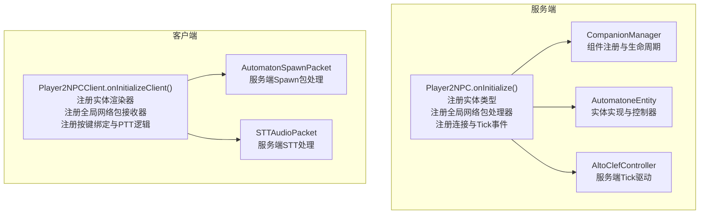
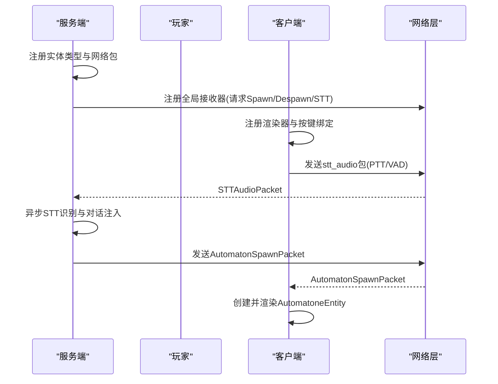
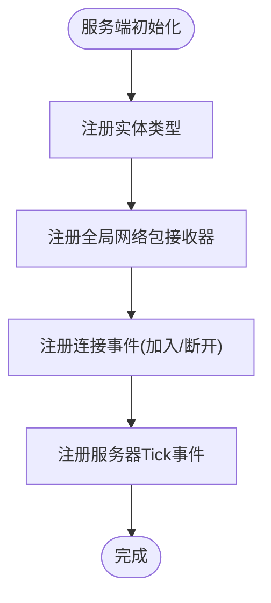
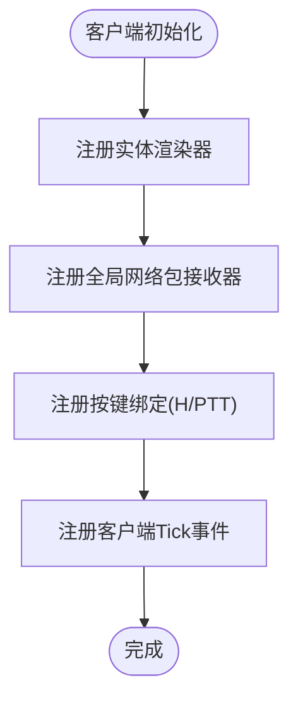
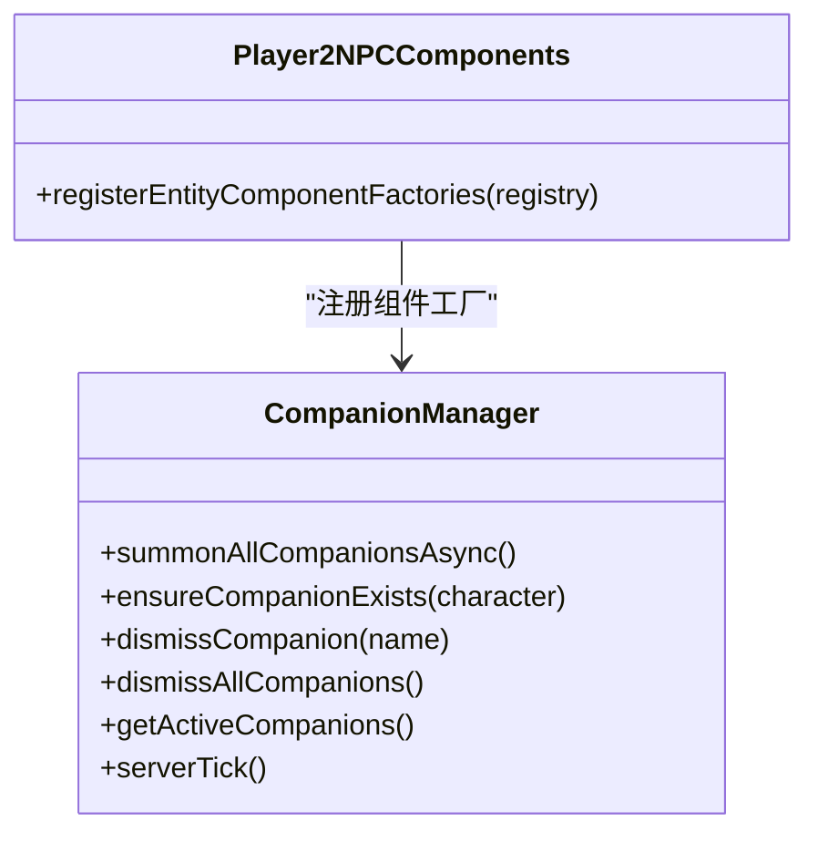
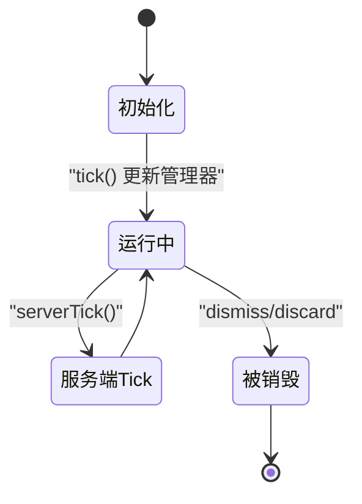
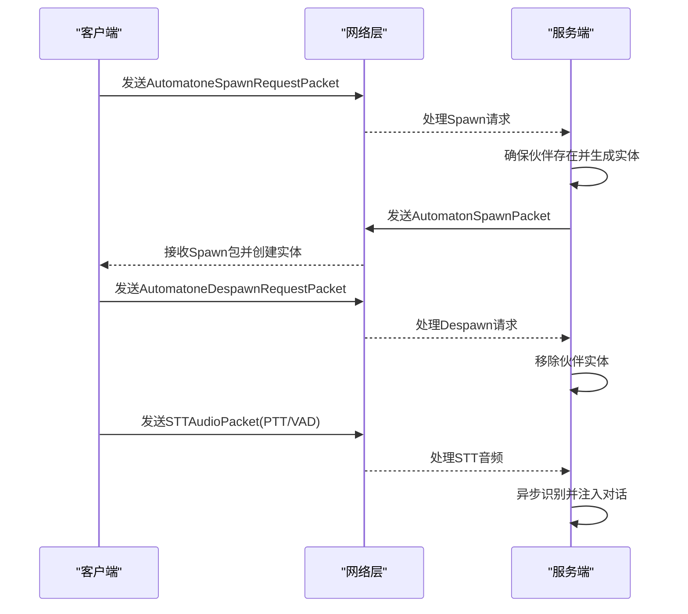
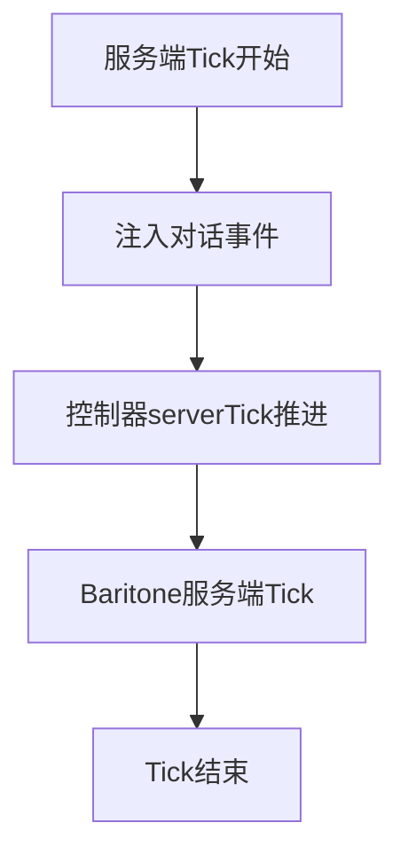
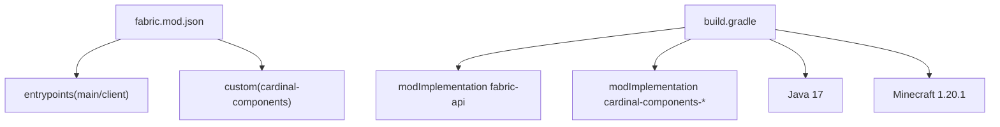

# 模组初始化与生命周期

<cite>
**本文引用的文件**
- [Player2NPC.java](file://src/main/java/com/goodbird/player2npc/Player2NPC.java)
- [Player2NPCClient.java](file://src/main/java/com/goodbird/player2npc/Player2NPCClient.java)
- [Player2NPCComponents.java](file://src/main/java/com/goodbird/player2npc/Player2NPCComponents.java)
- [fabric.mod.json](file://src/main/resources/fabric.mod.json)
- [build.gradle](file://build.gradle)
- [settings.gradle](file://settings.gradle)
- [AutomatoneEntity.java](file://src/main/java/com/goodbird/player2npc/companion/AutomatoneEntity.java)
- [AutomatonSpawnPacket.java](file://src/main/java/com/goodbird/player2npc/network/AutomatonSpawnPacket.java)
- [AutomatoneSpawnRequestPacket.java](file://src/main/java/com/goodbird/player2npc/network/AutomatoneSpawnRequestPacket.java)
- [AutomatoneDespawnRequestPacket.java](file://src/main/java/com/goodbird/player2npc/network/AutomatoneDespawnRequestPacket.java)
- [STTAudioPacket.java](file://src/main/java/com/goodbird/player2npc/network/STTAudioPacket.java)
- [CompanionManager.java](file://src/main/java/com/goodbird/player2npc/companion/CompanionManager.java)
- [AltoClefController.java](file://src/main/java/adris/altoclef/AltoClefController.java)
- [README.md](file://README.md)
</cite>

## 目录
1. [简介](#简介)
2. [项目结构](#项目结构)
3. [核心组件](#核心组件)
4. [架构总览](#架构总览)
5. [详细组件分析](#详细组件分析)
6. [依赖分析](#依赖分析)
7. [性能考虑](#性能考虑)
8. [故障排除指南](#故障排除指南)
9. [结论](#结论)
10. [附录](#附录)

## 简介
本文件面向Player2NPC服务端与客户端模组的初始化与生命周期管理，系统性阐述以下主题：
- 服务端Player2NPC模组初始化流程：ModInitializer接口实现、实体类型注册、网络包注册、事件监听器注册
- 客户端Player2NPCClient初始化流程：渲染器注册、网络包接收、按键绑定、音频录制与发送
- 模组生命周期管理机制：服务端Tick驱动、客户端Tick驱动、组件生命周期、实体生命周期
- Fabric模组元数据配置：entrypoints、depends、custom cardinal-components等
- 加载顺序、初始化时机、资源清理等关键概念
- 提供可直接参考的代码片段路径，帮助开发者正确实现实体注册、网络通信初始化、事件监听器注册等核心步骤

## 项目结构
Player2NPC模组采用Fabric架构，服务端与客户端分别通过入口类进行初始化，并通过Fabric API完成实体注册、网络包注册、事件订阅与渲染器注册。模组元数据在fabric.mod.json中集中声明。

**图表来源**
- [Player2NPC.java:48-65](file://src/main/java/com/goodbird/player2npc/Player2NPC.java#L48-L65)
- [Player2NPCClient.java:36-124](file://src/main/java/com/goodbird/player2npc/Player2NPCClient.java#L36-L124)
- [CompanionManager.java:28-191](file://src/main/java/com/goodbird/player2npc/companion/CompanionManager.java#L28-L191)
- [AutomatoneEntity.java:50-312](file://src/main/java/com/goodbird/player2npc/companion/AutomatoneEntity.java#L50-L312)
- [AltoClefController.java:152-158](file://src/main/java/adris/altoclef/AltoClefController.java#L152-L158)

**章节来源**
- [Player2NPC.java:25-67](file://src/main/java/com/goodbird/player2npc/Player2NPC.java#L25-L67)
- [Player2NPCClient.java:23-164](file://src/main/java/com/goodbird/player2npc/Player2NPCClient.java#L23-L164)
- [fabric.mod.json:17-29](file://src/main/resources/fabric.mod.json#L17-L29)

## 核心组件
- 服务端入口：实现ModInitializer，负责实体注册、网络包注册、连接事件与服务器Tick事件注册
- 客户端入口：实现ClientModInitializer，负责实体渲染器注册、网络包接收器注册、按键绑定与PTT逻辑
- 组件系统：基于Cardinal Components API，为ServerPlayer注册CompanionManager组件
- 实体系统：AutomatoneEntity继承LivingEntity，实现IAutomatone等接口，承载NPC行为与控制器
- 网络包系统：服务端与客户端的网络包定义与处理，支撑Spawn、Despawn、STT等交互
- 生命周期驱动：AltoClefController在服务端Tick中推进NPC控制器逻辑

**章节来源**
- [Player2NPC.java:48-65](file://src/main/java/com/goodbird/player2npc/Player2NPC.java#L48-L65)
- [Player2NPCClient.java:36-124](file://src/main/java/com/goodbird/player2npc/Player2NPCClient.java#L36-L124)
- [Player2NPCComponents.java:10-16](file://src/main/java/com/goodbird/player2npc/Player2NPCComponents.java#L10-L16)
- [AutomatoneEntity.java:50-312](file://src/main/java/com/goodbird/player2npc/companion/AutomatoneEntity.java#L50-L312)
- [AltoClefController.java:136-158](file://src/main/java/adris/altoclef/AltoClefController.java#L136-L158)

## 架构总览
服务端与客户端通过Fabric API协同工作：服务端负责实体注册、组件生命周期、网络包处理与Tick驱动；客户端负责渲染、按键与音频交互、网络包接收与显示。

**图表来源**
- [Player2NPC.java:48-65](file://src/main/java/com/goodbird/player2npc/Player2NPC.java#L48-L65)
- [Player2NPCClient.java:36-124](file://src/main/java/com/goodbird/player2npc/Player2NPCClient.java#L36-L124)
- [STTAudioPacket.java:39-121](file://src/main/java/com/goodbird/player2npc/network/STTAudioPacket.java#L39-L121)
- [AutomatonSpawnPacket.java:100-119](file://src/main/java/com/goodbird/player2npc/network/AutomatonSpawnPacket.java#L100-L119)

## 详细组件分析

### 服务端初始化流程（Player2NPC）
- 实现ModInitializer接口，在onInitialize中完成：
  - 注册实体类型：通过Registry.register将AutomatoneEntity注册到ENTITY_TYPE
  - 注册全局网络包接收器：处理Spawn请求、Despawn请求、STT音频
  - 注册连接事件：JOIN时召唤所有伙伴，DISCONNECT时解散所有伙伴
  - 注册服务器Tick事件：每Tick调用AltoClefController.staticServerTick推进对话队列

**图表来源**
- [Player2NPC.java:48-65](file://src/main/java/com/goodbird/player2npc/Player2NPC.java#L48-L65)

**章节来源**
- [Player2NPC.java:48-65](file://src/main/java/com/goodbird/player2npc/Player2NPC.java#L48-L65)

### 客户端初始化流程（Player2NPCClient）
- 实现ClientModInitializer接口，在onInitializeClient中完成：
  - 注册实体渲染器：将AutomatoneEntity与RenderAutomaton关联
  - 注册全局网络包接收器：处理服务端Spawn包
  - 注册按键绑定：打开角色选择界面、Push-to-Talk（PTT）
  - 客户端Tick事件：处理PTT按键状态、VAD自动停止、音频发送与提示

**图表来源**
- [Player2NPCClient.java:36-124](file://src/main/java/com/goodbird/player2npc/Player2NPCClient.java#L36-L124)

**章节来源**
- [Player2NPCClient.java:36-124](file://src/main/java/com/goodbird/player2npc/Player2NPCClient.java#L36-L124)

### 组件生命周期（Player2NPCComponents）
- 基于Cardinal Components API，为ServerPlayer注册CompanionManager组件
- 通过EntityComponentInitializer接口完成工厂注册，确保每个ServerPlayer拥有独立的CompanionManager实例

**图表来源**
- [Player2NPCComponents.java:10-16](file://src/main/java/com/goodbird/player2npc/Player2NPCComponents.java#L10-L16)
- [CompanionManager.java:28-191](file://src/main/java/com/goodbird/player2npc/companion/CompanionManager.java#L28-L191)

**章节来源**
- [Player2NPCComponents.java:10-16](file://src/main/java/com/goodbird/player2npc/Player2NPCComponents.java#L10-L16)
- [CompanionManager.java:28-191](file://src/main/java/com/goodbird/player2npc/companion/CompanionManager.java#L28-L191)

### 实体生命周期（AutomatoneEntity）
- 继承LivingEntity，实现IAutomatone、IInventoryProvider、IInteractionManagerProvider、IHungerManagerProvider
- 初始化：设置移动速度、步高，初始化交互管理器、库存与饥饿管理器
- Tick：更新交互管理器与库存，服务端Tick推进控制器逻辑
- Spawn包：重写getAddEntityPacket，使用AutomatonSpawnPacket传输实体状态与角色信息

**图表来源**
- [AutomatoneEntity.java:78-177](file://src/main/java/com/goodbird/player2npc/companion/AutomatoneEntity.java#L78-L177)
- [AutomatonSpawnPacket.java:70-93](file://src/main/java/com/goodbird/player2npc/network/AutomatonSpawnPacket.java#L70-L93)

**章节来源**
- [AutomatoneEntity.java:50-312](file://src/main/java/com/goodbird/player2npc/companion/AutomatoneEntity.java#L50-L312)
- [AutomatonSpawnPacket.java:26-119](file://src/main/java/com/goodbird/player2npc/network/AutomatonSpawnPacket.java#L26-L119)

### 网络包处理（Spawn/Despawn/STT）
- Spawn请求/响应：客户端发送Spawn请求包，服务端根据角色信息确保伙伴存在并生成实体；服务端通过AutomatonSpawnPacket向客户端推送实体状态
- Despawn请求：客户端发送Despawn请求包，服务端移除对应伙伴
- STT音频：客户端通过PTT/VAD录制音频，发送stt_audio包；服务端异步识别并注入对话系统

**图表来源**
- [AutomatoneSpawnRequestPacket.java:57-65](file://src/main/java/com/goodbird/player2npc/network/AutomatoneSpawnRequestPacket.java#L57-L65)
- [AutomatoneDespawnRequestPacket.java:56-63](file://src/main/java/com/goodbird/player2npc/network/AutomatoneDespawnRequestPacket.java#L56-L63)
- [AutomatonSpawnPacket.java:100-119](file://src/main/java/com/goodbird/player2npc/network/AutomatonSpawnPacket.java#L100-L119)
- [STTAudioPacket.java:39-121](file://src/main/java/com/goodbird/player2npc/network/STTAudioPacket.java#L39-L121)

**章节来源**
- [AutomatoneSpawnRequestPacket.java:24-66](file://src/main/java/com/goodbird/player2npc/network/AutomatoneSpawnRequestPacket.java#L24-L66)
- [AutomatoneDespawnRequestPacket.java:21-64](file://src/main/java/com/goodbird/player2npc/network/AutomatoneDespawnRequestPacket.java#L21-L64)
- [AutomatonSpawnPacket.java:26-119](file://src/main/java/com/goodbird/player2npc/network/AutomatonSpawnPacket.java#L26-L119)
- [STTAudioPacket.java:28-133](file://src/main/java/com/goodbird/player2npc/network/STTAudioPacket.java#L28-L133)

### 生命周期驱动（AltoClefController）
- 服务端Tick：在静态初始化中注册ServerTickEvents.END_SERVER_TICK，推进ConversationManager与控制器逻辑
- 控制器推进：在serverTick中依次更新输入控制、追踪器、任务运行器、Baritone路径等

**图表来源**
- [AltoClefController.java:152-158](file://src/main/java/adris/altoclef/AltoClefController.java#L152-L158)
- [AltoClefController.java:136-150](file://src/main/java/adris/altoclef/AltoClefController.java#L136-L150)

**章节来源**
- [AltoClefController.java:136-158](file://src/main/java/adris/altoclef/AltoClefController.java#L136-L158)

## 依赖分析
- Fabric元数据：entrypoints声明了服务端与客户端入口类，custom中声明了cardinal-components组件键
- 依赖声明：fabricloader与fabric-api版本要求，以及Cardinal Components API依赖
- 版本兼容性：Java 17、Minecraft 1.20.1、Fabric API版本与构建工具版本

**图表来源**
- [fabric.mod.json:17-29](file://src/main/resources/fabric.mod.json#L17-L29)
- [build.gradle:43-69](file://src/main/java/com/goodbird/player2npc/Player2NPC.java#L43-L69)

**章节来源**
- [fabric.mod.json:17-29](file://src/main/resources/fabric.mod.json#L17-L29)
- [build.gradle:43-69](file://src/main/java/com/goodbird/player2npc/Player2NPC.java#L43-L69)
- [settings.gradle:17-26](file://settings.gradle#L17-L26)

## 性能考虑
- 网络包处理：STT音频处理在独立线程执行，避免阻塞服务器主线程
- Tick驱动：服务端Tick中仅推进必要逻辑，避免过度计算
- 客户端渲染：实体渲染器按需创建，避免重复注册
- 组件生命周期：CompanionManager在服务端Tick中批量处理伙伴召唤/解散，减少频繁IO

[本节为通用指导，无需特定文件引用]

## 故障排除指南
- 无法加载模组：检查fabric.mod.json中的entrypoints与depends是否正确
- 服务端崩溃或异常：关注AltoClefController的staticServerTick与STTAudioPacket的异常日志
- 客户端渲染异常：确认实体渲染器已注册，且实体类型一致
- PTT/VAD无效：检查按键绑定、麦克风可用性与最小音频长度限制

**章节来源**
- [fabric.mod.json:17-29](file://src/main/resources/fabric.mod.json#L17-L29)
- [STTAudioPacket.java:113-120](file://src/main/java/com/goodbird/player2npc/network/STTAudioPacket.java#L113-L120)
- [Player2NPCClient.java:131-144](file://src/main/java/com/goodbird/player2npc/Player2NPCClient.java#L131-L144)

## 结论
Player2NPC模组通过Fabric API实现了清晰的服务端与客户端初始化流程：服务端负责实体与网络包注册、组件生命周期与Tick驱动；客户端负责渲染与交互；二者通过网络包协同完成NPC的生成、销毁与语音交互。遵循本文所述初始化步骤与最佳实践，可确保模组稳定运行并具备良好的扩展性。

[本节为总结，无需特定文件引用]

## 附录
- Fabric模组元数据配置要点
  - entrypoints：main/client分别声明服务端与客户端入口类
  - custom：cardinal-components键用于组件注册
  - depends：声明fabricloader与fabric版本要求
- 依赖与版本兼容性
  - Java 17、Minecraft 1.20.1、Fabric API版本与构建工具版本
- 初始化步骤参考
  - 服务端：实体注册、网络包注册、连接事件、Tick事件
  - 客户端：渲染器注册、网络包接收器、按键绑定、PTT逻辑
  - 组件：为ServerPlayer注册CompanionManager

**章节来源**
- [fabric.mod.json:17-29](file://src/main/resources/fabric.mod.json#L17-L29)
- [build.gradle:43-69](file://src/main/java/com/goodbird/player2npc/Player2NPC.java#L43-L69)
- [README.md:496-529](file://README.md#L496-L529)