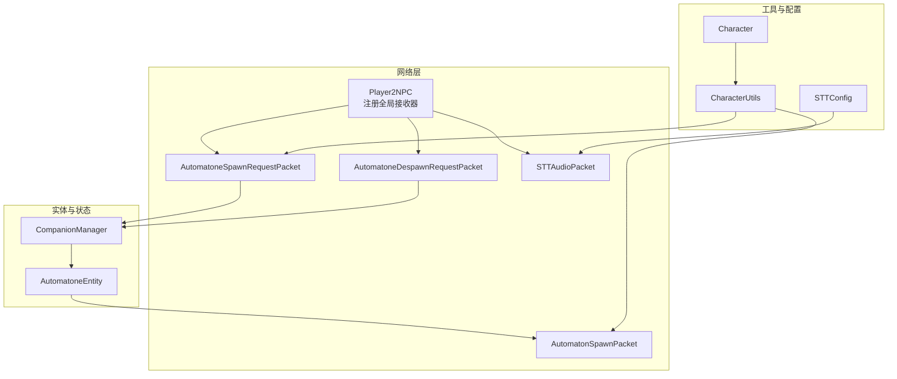
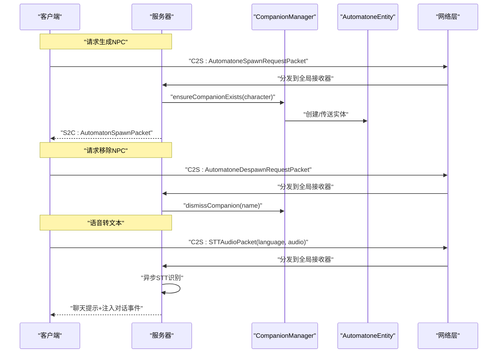
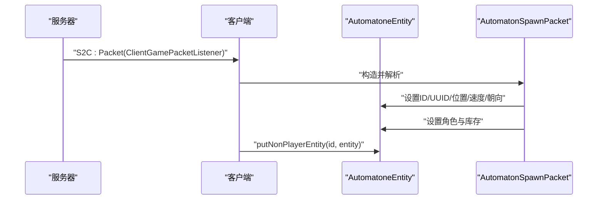
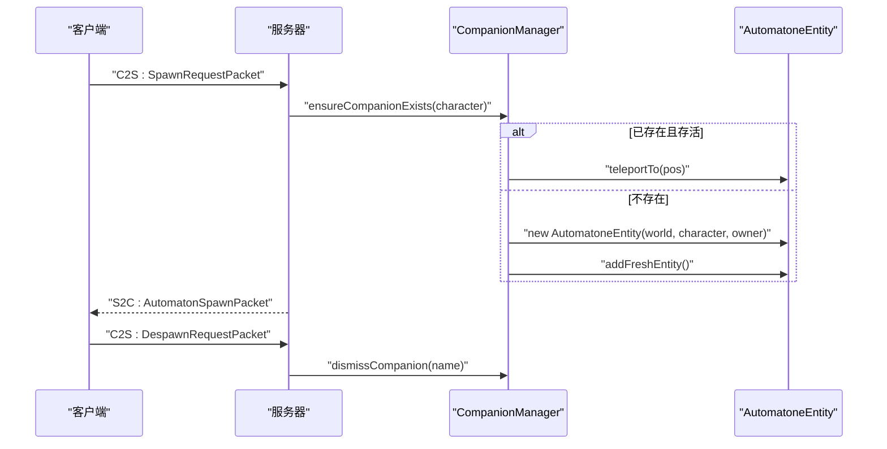
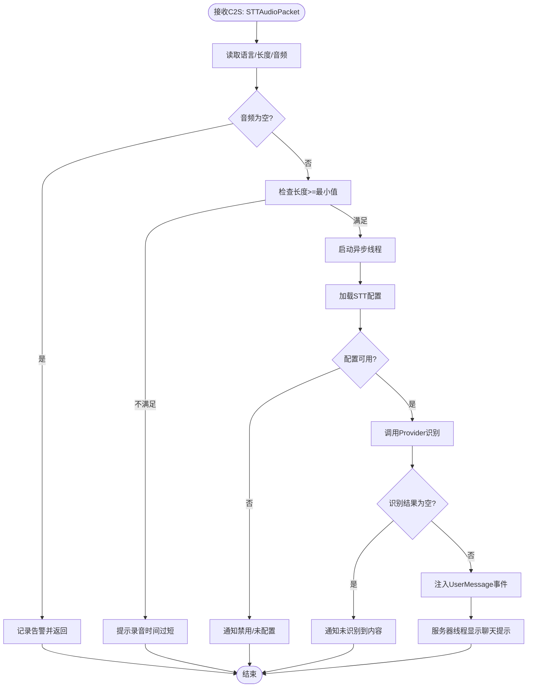
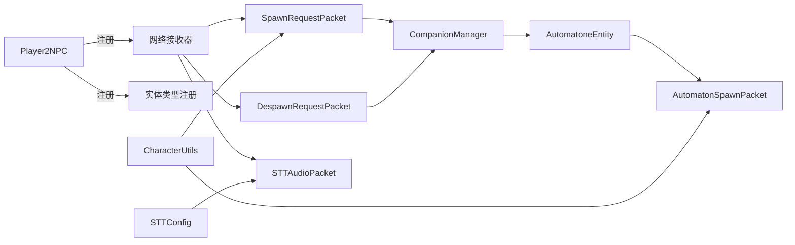

# 网络通信协议

<cite>
**本文引用的文件列表**
- [Player2NPC.java](file://src/main/java/com/goodbird/player2npc/Player2NPC.java)
- [AutomatonSpawnPacket.java](file://src/main/java/com/goodbird/player2npc/network/AutomatonSpawnPacket.java)
- [AutomatoneSpawnRequestPacket.java](file://src/main/java/com/goodbird/player2npc/network/AutomatoneSpawnRequestPacket.java)
- [AutomatoneDespawnRequestPacket.java](file://src/main/java/com/goodbird/player2npc/network/AutomatoneDespawnRequestPacket.java)
- [STTAudioPacket.java](file://src/main/java/com/goodbird/player2npc/network/STTAudioPacket.java)
- [AutomatoneEntity.java](file://src/main/java/com/goodbird/player2npc/companion/AutomatoneEntity.java)
- [CompanionManager.java](file://src/main/java/com/goodbird/player2npc/companion/CompanionManager.java)
- [Character.java](file://src/main/java/adris/altoclef/player2api/Character.java)
- [CharacterUtils.java](file://src/main/java/adris/altoclef/player2api/utils/CharacterUtils.java)
- [STTConfig.java](file://src/main/java/adris/altoclef/player2api/stt/STTConfig.java)
- [fabric.mod.json](file://src/main/resources/fabric.mod.json)
</cite>

## 目录
1. [简介](#简介)
2. [项目结构与角色定位](#项目结构与角色定位)
3. [核心组件与协议总览](#核心组件与协议总览)
4. [架构总览](#架构总览)
5. [详细组件分析](#详细组件分析)
6. [依赖关系分析](#依赖关系分析)
7. [性能与传输优化](#性能与传输优化)
8. [故障排查指南](#故障排查指南)
9. [结论](#结论)
10. [附录：协议规范与最佳实践](#附录协议规范与最佳实践)

## 简介
本文件面向需要在Minecraft Fabric环境中实现“AI玩家到NPC”的网络通信模块，系统性阐述以下内容：
- Fabric网络API的使用方式与注册流程
- 自定义网络包设计与序列化/反序列化策略
- 客户端-服务器通信模式与消息流
- 数据完整性与错误处理机制
- 网络延迟处理、数据压缩与传输优化
- 安全与配置要点（如STT鉴权）
- 提供完整协议规范与可复用的实现参考路径

## 项目结构与角色定位
该模块位于“player2npc”子包下，围绕以下职责划分：
- 协议与网络层：定义并注册自定义网络包，处理C2S/S2C消息
- 实体与状态层：管理NPC实体生命周期与状态同步
- 配置与工具层：提供字符与序列化工具、STT配置读取

图表来源
- [Player2NPC.java:48-65](file://src/main/java/com/goodbird/player2npc/Player2NPC.java#L48-L65)
- [AutomatoneSpawnRequestPacket.java:24-66](file://src/main/java/com/goodbird/player2npc/network/AutomatoneSpawnRequestPacket.java#L24-L66)
- [AutomatoneDespawnRequestPacket.java:21-64](file://src/main/java/com/goodbird/player2npc/network/AutomatoneDespawnRequestPacket.java#L21-L64)
- [AutomatonSpawnPacket.java:26-120](file://src/main/java/com/goodbird/player2npc/network/AutomatonSpawnPacket.java#L26-L120)
- [STTAudioPacket.java:28-134](file://src/main/java/com/goodbird/player2npc/network/STTAudioPacket.java#L28-L134)
- [AutomatoneEntity.java:50-313](file://src/main/java/com/goodbird/player2npc/companion/AutomatoneEntity.java#L50-L313)
- [CompanionManager.java:28-191](file://src/main/java/com/goodbird/player2npc/companion/CompanionManager.java#L28-L191)
- [CharacterUtils.java:83-142](file://src/main/java/adris/altoclef/player2api/utils/CharacterUtils.java#L83-L142)
- [Character.java:5-22](file://src/main/java/adris/altoclef/player2api/Character.java#L5-L22)
- [STTConfig.java:31-78](file://src/main/java/adris/altoclef/player2api/stt/STTConfig.java#L31-L78)

章节来源
- [Player2NPC.java:25-67](file://src/main/java/com/goodbird/player2npc/Player2NPC.java#L25-L67)
- [fabric.mod.json:17-29](file://src/main/resources/fabric.mod.json#L17-L29)

## 核心组件与协议总览
- 全局网络ID与实体类型注册：在模组初始化时注册网络ID与实体类型，并注册全局接收器
- 自定义网络包：
  - 请求类：客户端→服务器（C2S），用于请求生成或移除NPC
  - 同步类：服务器→客户端（S2C），用于向客户端广播NPC实体的初始状态
  - STT音频类：客户端→服务器（C2S），用于语音转文本
- 实体生命周期：通过“请求→生成→同步→移除”的闭环完成跨客户端一致的状态传播

章节来源
- [Player2NPC.java:29-54](file://src/main/java/com/goodbird/player2npc/Player2NPC.java#L29-L54)
- [AutomatoneEntity.java:298-302](file://src/main/java/com/goodbird/player2npc/companion/AutomatoneEntity.java#L298-L302)

## 架构总览
下面以序列图展示关键消息流。

图表来源
- [Player2NPC.java:52-54](file://src/main/java/com/goodbird/player2npc/Player2NPC.java#L52-L54)
- [AutomatoneSpawnRequestPacket.java:57-65](file://src/main/java/com/goodbird/player2npc/network/AutomatoneSpawnRequestPacket.java#L57-L65)
- [AutomatoneDespawnRequestPacket.java:56-63](file://src/main/java/com/goodbird/player2npc/network/AutomatoneDespawnRequestPacket.java#L56-L63)
- [AutomatonSpawnPacket.java:70-93](file://src/main/java/com/goodbird/player2npc/network/AutomatonSpawnPacket.java#L70-L93)
- [STTAudioPacket.java:39-121](file://src/main/java/com/goodbird/player2npc/network/STTAudioPacket.java#L39-L121)

## 详细组件分析

### 组件A：实体生成与同步（S2C）
- 职责：服务器侧根据请求生成NPC实体；客户端侧接收同步包并创建本地实体
- 关键点：
  - 客户端收到S2C包后，在主线程中创建实体并写入位置、朝向、速度、角色与库存
  - 服务器侧通过实体的“添加实体包”覆盖，发送自定义同步包
  - 序列化采用紧凑格式：位置使用双精度，速度按比例量化，角度按字节量化，角色与库存通过CharacterUtils与NBT序列化

图表来源
- [AutomatonSpawnPacket.java:100-119](file://src/main/java/com/goodbird/player2npc/network/AutomatonSpawnPacket.java#L100-L119)
- [AutomatonSpawnPacket.java:70-93](file://src/main/java/com/goodbird/player2npc/network/AutomatonSpawnPacket.java#L70-L93)
- [AutomatoneEntity.java:298-302](file://src/main/java/com/goodbird/player2npc/companion/AutomatoneEntity.java#L298-L302)

章节来源
- [AutomatonSpawnPacket.java:26-120](file://src/main/java/com/goodbird/player2npc/network/AutomatonSpawnPacket.java#L26-L120)
- [AutomatoneEntity.java:50-313](file://src/main/java/com/goodbird/player2npc/companion/AutomatoneEntity.java#L50-L313)

### 组件B：请求生成与移除（C2S）
- 职责：客户端请求服务器生成/移除指定角色的NPC
- 关键点：
  - 请求包携带Character对象，服务器侧通过CompanionManager确保实体存在或移除
  - 处理空角色的防御性日志与忽略
  - 生成时在附近随机偏移位置进行传送或创建

图表来源
- [AutomatoneSpawnRequestPacket.java:57-65](file://src/main/java/com/goodbird/player2npc/network/AutomatoneSpawnRequestPacket.java#L57-L65)
- [AutomatoneDespawnRequestPacket.java:56-63](file://src/main/java/com/goodbird/player2npc/network/AutomatoneDespawnRequestPacket.java#L56-L63)
- [CompanionManager.java:100-129](file://src/main/java/com/goodbird/player2npc/companion/CompanionManager.java#L100-L129)

章节来源
- [AutomatoneSpawnRequestPacket.java:24-66](file://src/main/java/com/goodbird/player2npc/network/AutomatoneSpawnRequestPacket.java#L24-L66)
- [AutomatoneDespawnRequestPacket.java:21-64](file://src/main/java/com/goodbird/player2npc/network/AutomatoneDespawnRequestPacket.java#L21-L64)
- [CompanionManager.java:28-191](file://src/main/java/com/goodbird/player2npc/companion/CompanionManager.java#L28-L191)

### 组件C：语音转文本（C2S）
- 职责：客户端上传音频，服务器异步识别并回传结果
- 关键点：
  - 包格式：语言字符串、音频长度、音频字节
  - 防御性校验：空数据、时长过短（最小约1秒）
  - 异步处理：避免阻塞网络线程
  - 配置校验：STT开关、API Key、模型与语言
  - 结果注入：识别成功后注入对话系统事件，并在聊天中反馈

图表来源
- [STTAudioPacket.java:39-121](file://src/main/java/com/goodbird/player2npc/network/STTAudioPacket.java#L39-L121)
- [STTConfig.java:31-78](file://src/main/java/adris/altoclef/player2api/stt/STTConfig.java#L31-L78)

章节来源
- [STTAudioPacket.java:28-134](file://src/main/java/com/goodbird/player2npc/network/STTAudioPacket.java#L28-L134)
- [STTConfig.java:13-78](file://src/main/java/adris/altoclef/player2api/stt/STTConfig.java#L13-L78)

### 组件D：序列化与反序列化
- 角色对象（Character）：
  - 字段：名称、简称、问候语、描述、皮肤URL、声音ID数组
  - 序列化：UTF字符串、整型数组长度、逐项UTF字符串
  - 反序列化：顺序读取对应字段
- 实体同步包（AutomatonSpawnPacket）：
  - 基本字段：VarInt ID、UUID、Vec3位置、速度（短整型量化）、字节角度
  - 角色与库存：通过CharacterUtils与NBT列表写入/读取
- STT包：
  - 语言：UTF字符串（限制长度）
  - 音频：VarInt长度 + 字节数组

章节来源
- [Character.java:5-22](file://src/main/java/adris/altoclef/player2api/Character.java#L5-L22)
- [CharacterUtils.java:83-142](file://src/main/java/adris/altoclef/player2api/utils/CharacterUtils.java#L83-L142)
- [AutomatonSpawnPacket.java:54-93](file://src/main/java/com/goodbird/player2npc/network/AutomatonSpawnPacket.java#L54-L93)
- [STTAudioPacket.java:42-45](file://src/main/java/com/goodbird/player2npc/network/STTAudioPacket.java#L42-L45)

## 依赖关系分析
- 模块入口：Player2NPC负责注册网络ID与实体类型，并注册全局接收器
- 网络包与实体：AutomatonSpawnPacket与AutomatoneEntity形成S2C同步闭环
- 状态管理：CompanionManager协调实体生命周期，处理生成/移除/传送
- 工具链：Character与CharacterUtils贯穿请求与同步包的数据承载
- 配置链路：STTConfig从LLM配置中读取STT参数，驱动STTAudioPacket行为

图表来源
- [Player2NPC.java:48-65](file://src/main/java/com/goodbird/player2npc/Player2NPC.java#L48-L65)
- [AutomatoneSpawnRequestPacket.java:57-65](file://src/main/java/com/goodbird/player2npc/network/AutomatoneSpawnRequestPacket.java#L57-L65)
- [AutomatoneDespawnRequestPacket.java:56-63](file://src/main/java/com/goodbird/player2npc/network/AutomatoneDespawnRequestPacket.java#L56-L63)
- [AutomatonSpawnPacket.java:70-93](file://src/main/java/com/goodbird/player2npc/network/AutomatonSpawnPacket.java#L70-L93)
- [AutomatoneEntity.java:298-302](file://src/main/java/com/goodbird/player2npc/companion/AutomatoneEntity.java#L298-L302)
- [CompanionManager.java:100-129](file://src/main/java/com/goodbird/player2npc/companion/CompanionManager.java#L100-L129)
- [CharacterUtils.java:83-142](file://src/main/java/adris/altoclef/player2api/utils/CharacterUtils.java#L83-L142)
- [STTConfig.java:31-78](file://src/main/java/adris/altoclef/player2api/stt/STTConfig.java#L31-L78)

## 性能与传输优化
- 速度与角度量化：将连续的速度与角度映射到短整型/字节范围，显著降低带宽占用
- 变长整型：VarInt用于长度与ID，减少小数值的字节开销
- 异步STT：在网络线程外执行识别，避免阻塞
- 最小音频阈值：拒绝过短音频，减少无效识别开销
- 实体更新频率：实体追踪更新率设为1，降低网络压力

章节来源
- [AutomatonSpawnPacket.java:76-93](file://src/main/java/com/goodbird/player2npc/network/AutomatonSpawnPacket.java#L76-L93)
- [Player2NPC.java:43-46](file://src/main/java/com/goodbird/player2npc/Player2NPC.java#L43-L46)
- [STTAudioPacket.java:32-33](file://src/main/java/com/goodbird/player2npc/network/STTAudioPacket.java#L32-L33)

## 故障排查指南
- STT无法识别
  - 检查STT配置是否启用、API Key是否正确
  - 确认音频长度是否达到最小要求
  - 查看服务器日志中的警告与错误
- NPC不出现或不同步
  - 确认请求包已到达服务器并触发生成
  - 检查客户端是否收到S2C同步包并创建实体
  - 核对角色名一致性与CompanionManager映射
- 移除无效
  - 确认请求包中的角色名与当前映射一致
  - 检查服务器日志中是否存在空角色的告警

章节来源
- [STTAudioPacket.java:51-63](file://src/main/java/com/goodbird/player2npc/network/STTAudioPacket.java#L51-L63)
- [AutomatoneSpawnRequestPacket.java:62-64](file://src/main/java/com/goodbird/player2npc/network/AutomatoneSpawnRequestPacket.java#L62-L64)
- [AutomatoneDespawnRequestPacket.java:58-62](file://src/main/java/com/goodbird/player2npc/network/AutomatoneDespawnRequestPacket.java#L58-L62)
- [AutomatonSpawnPacket.java:100-119](file://src/main/java/com/goodbird/player2npc/network/AutomatonSpawnPacket.java#L100-L119)

## 结论
本协议以Fabric网络API为基础，结合自定义网络包与实体同步机制，实现了可靠的跨客户端NPC通信。通过紧凑的序列化、异步处理与防御性校验，兼顾了性能与稳定性。建议在生产环境进一步引入：
- 包大小与速率限制
- 重放与去重机制
- 加密与鉴权扩展（如基于令牌的认证）
- 更细粒度的实体状态增量同步

## 附录：协议规范与最佳实践

### 协议规范（摘要）
- 网络ID
  - 生成请求：spawn_request_automatone
  - 移除请求：request_despawn_automatone
  - 实体同步：spawn_automatone
  - 语音转文本：stt_audio
- 包格式
  - 生成/移除请求：包含UTF角色名与简短元信息
  - 实体同步：包含ID、UUID、位置、速度、角度、角色、库存
  - STT音频：语言（UTF）、音频长度（VarInt）、音频字节
- 错误处理
  - 空音频、过短音频、配置缺失、空角色均记录日志并优雅降级
- 安全与配置
  - STT需配置有效API Key与模型
  - 建议在客户端侧进行音频质量与时长控制

章节来源
- [Player2NPC.java:29-32](file://src/main/java/com/goodbird/player2npc/Player2NPC.java#L29-L32)
- [AutomatoneSpawnRequestPacket.java:37-39](file://src/main/java/com/goodbird/player2npc/network/AutomatoneSpawnRequestPacket.java#L37-L39)
- [AutomatoneDespawnRequestPacket.java:36-38](file://src/main/java/com/goodbird/player2npc/network/AutomatoneDespawnRequestPacket.java#L36-L38)
- [AutomatonSpawnPacket.java:54-68](file://src/main/java/com/goodbird/player2npc/network/AutomatonSpawnPacket.java#L54-L68)
- [STTAudioPacket.java:42-45](file://src/main/java/com/goodbird/player2npc/network/STTAudioPacket.java#L42-L45)

### 最佳实践
- 在网络线程内仅做轻量解析，耗时任务放入异步线程
- 对输入进行边界检查与默认值兜底
- 使用变长编码与量化策略减少带宽
- 将配置与鉴权参数集中管理，避免硬编码
- 为关键路径增加日志与指标采集，便于排障