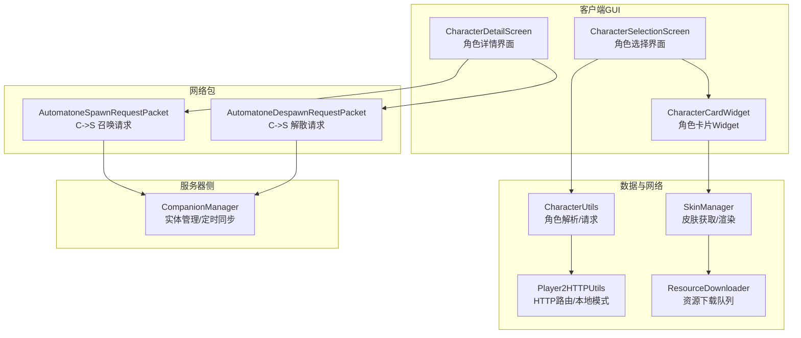
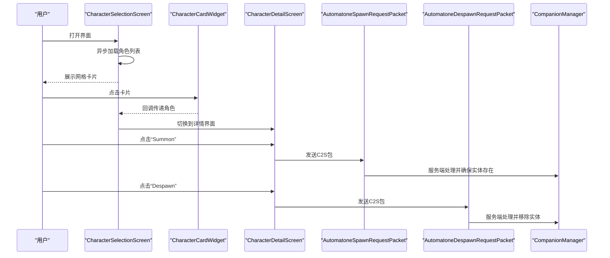
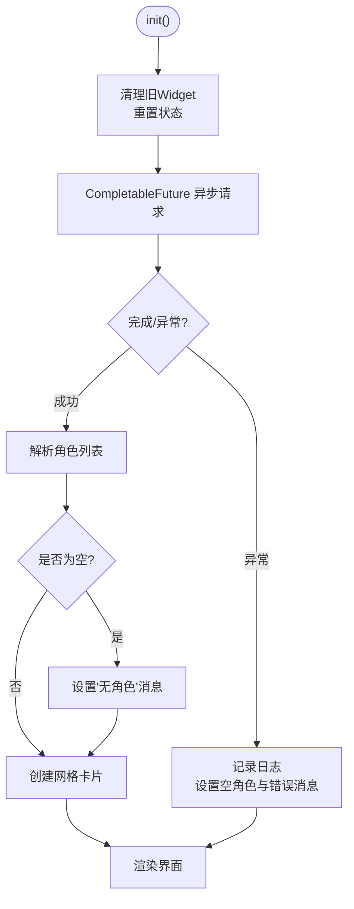
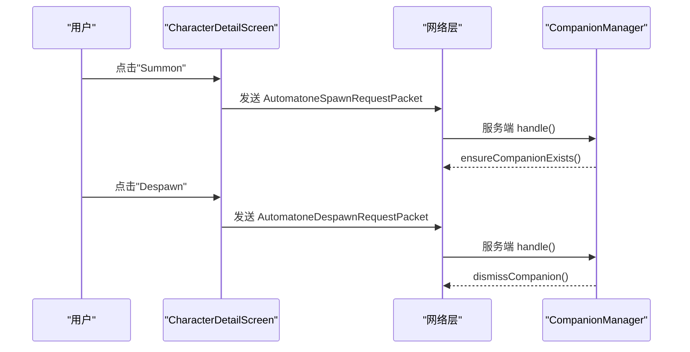
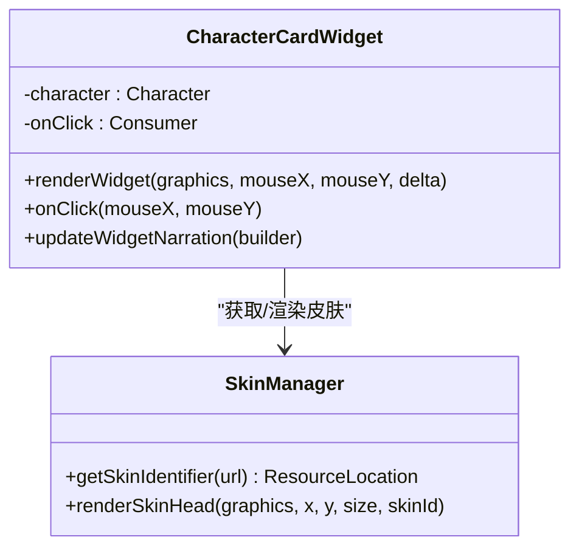
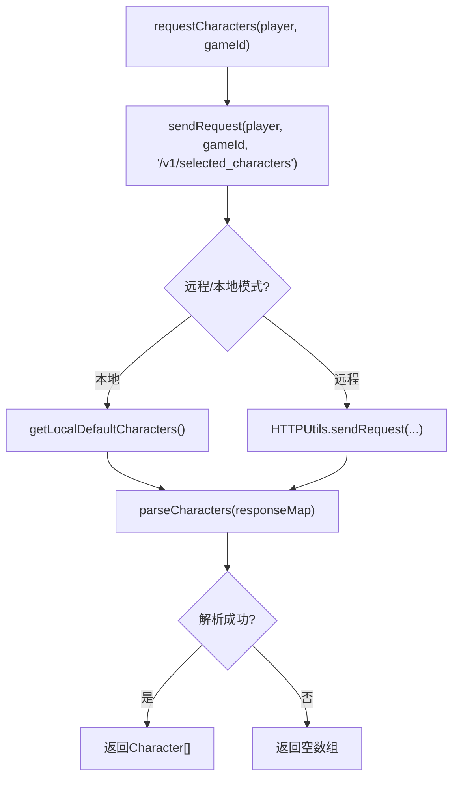
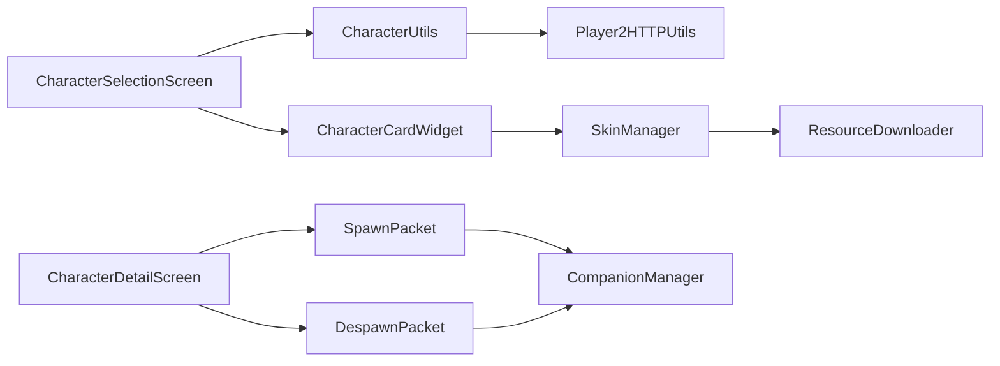

# GUI组件系统

<cite>
**本文引用的文件**
- [CharacterSelectionScreen.java](file://src/main/java/com/goodbird/player2npc/client/gui/CharacterSelectionScreen.java)
- [CharacterDetailScreen.java](file://src/main/java/com/goodbird/player2npc/client/gui/CharacterDetailScreen.java)
- [CharacterCardWidget.java](file://src/main/java/com/goodbird/player2npc/client/gui/CharacterCardWidget.java)
- [CharacterUtils.java](file://src/main/java/adris/altoclef/player2api/utils/CharacterUtils.java)
- [Player2HTTPUtils.java](file://src/main/java/adris/altoclef/player2api/utils/Player2HTTPUtils.java)
- [SkinManager.java](file://src/main/java/com/goodbird/player2npc/client/util/SkinManager.java)
- [ResourceDownloader.java](file://src/main/java/com/goodbird/player2npc/client/util/ResourceDownloader.java)
- [AutomatoneSpawnRequestPacket.java](file://src/main/java/com/goodbird/player2npc/network/AutomatoneSpawnRequestPacket.java)
- [AutomatoneDespawnRequestPacket.java](file://src/main/java/com/goodbird/player2npc/network/AutomatoneDespawnRequestPacket.java)
- [CompanionManager.java](file://src/main/java/com/goodbird/player2npc/companion/CompanionManager.java)
- [Character.java](file://src/main/java/adris/altoclef/player2api/Character.java)
</cite>

## 目录
1. [简介](#简介)
2. [项目结构](#项目结构)
3. [核心组件](#核心组件)
4. [架构总览](#架构总览)
5. [详细组件分析](#详细组件分析)
6. [依赖关系分析](#依赖关系分析)
7. [性能考虑](#性能考虑)
8. [故障排除指南](#故障排除指南)
9. [结论](#结论)

## 简介
本文件面向GUI组件系统的使用者与维护者，系统性阐述角色选择界面与详情界面的实现原理，覆盖异步字符加载机制、网格布局算法、状态管理、错误处理、事件处理流程、与CharacterUtils的数据交互方式，以及网络请求失败时的容错策略。文档同时解释了Minecraft Screen API的使用、Widget添加机制、组件生命周期管理，并给出可直接定位到源码位置的路径指引，便于快速查阅与二次开发。

## 项目结构
GUI相关代码主要位于以下路径：
- 客户端GUI：com.goodbird.player2npc.client.gui（角色选择、详情、卡片）
- 数据工具：adris.altoclef.player2api.utils（角色解析、HTTP请求）
- 资源与皮肤：com.goodbird.player2npc.client.util（皮肤下载与渲染）
- 网络包：com.goodbird.player2npc.network（召唤/解散请求）
- 服务器侧管理：com.goodbird.player2npc.companion（实体管理）

**图表来源**
- [CharacterSelectionScreen.java:1-106](file://src/main/java/com/goodbird/player2npc/client/gui/CharacterSelectionScreen.java#L1-L106)
- [CharacterDetailScreen.java:1-80](file://src/main/java/com/goodbird/player2npc/client/gui/CharacterDetailScreen.java#L1-L80)
- [CharacterCardWidget.java:1-53](file://src/main/java/com/goodbird/player2npc/client/gui/CharacterCardWidget.java#L1-L53)
- [CharacterUtils.java:1-142](file://src/main/java/adris/altoclef/player2api/utils/CharacterUtils.java#L1-L142)
- [Player2HTTPUtils.java:1-152](file://src/main/java/adris/altoclef/player2api/utils/Player2HTTPUtils.java#L1-L152)
- [SkinManager.java:1-57](file://src/main/java/com/goodbird/player2npc/client/util/SkinManager.java#L1-L57)
- [ResourceDownloader.java:1-65](file://src/main/java/com/goodbird/player2npc/client/util/ResourceDownloader.java#L1-L65)
- [AutomatoneSpawnRequestPacket.java:1-67](file://src/main/java/com/goodbird/player2npc/network/AutomatoneSpawnRequestPacket.java#L1-L67)
- [AutomatoneDespawnRequestPacket.java:1-65](file://src/main/java/com/goodbird/player2npc/network/AutomatoneDespawnRequestPacket.java#L1-L65)
- [CompanionManager.java:1-191](file://src/main/java/com/goodbird/player2npc/companion/CompanionManager.java#L1-L191)

**章节来源**
- [CharacterSelectionScreen.java:1-106](file://src/main/java/com/goodbird/player2npc/client/gui/CharacterSelectionScreen.java#L1-L106)
- [CharacterDetailScreen.java:1-80](file://src/main/java/com/goodbird/player2npc/client/gui/CharacterDetailScreen.java#L1-L80)
- [CharacterCardWidget.java:1-53](file://src/main/java/com/goodbird/player2npc/client/gui/CharacterCardWidget.java#L1-L53)
- [CharacterUtils.java:1-142](file://src/main/java/adris/altoclef/player2api/utils/CharacterUtils.java#L1-L142)
- [Player2HTTPUtils.java:1-152](file://src/main/java/adris/altoclef/player2api/utils/Player2HTTPUtils.java#L1-L152)
- [SkinManager.java:1-57](file://src/main/java/com/goodbird/player2npc/client/util/SkinManager.java#L1-L57)
- [ResourceDownloader.java:1-65](file://src/main/java/com/goodbird/player2npc/client/util/ResourceDownloader.java#L1-L65)
- [AutomatoneSpawnRequestPacket.java:1-67](file://src/main/java/com/goodbird/player2npc/network/AutomatoneSpawnRequestPacket.java#L1-L67)
- [AutomatoneDespawnRequestPacket.java:1-65](file://src/main/java/com/goodbird/player2npc/network/AutomatoneDespawnRequestPacket.java#L1-L65)
- [CompanionManager.java:1-191](file://src/main/java/com/goodbird/player2npc/companion/CompanionManager.java#L1-L191)

## 核心组件
- 角色选择界面（CharacterSelectionScreen）：负责异步加载角色列表、网格布局展示、状态提示与点击跳转。
- 角色详情界面（CharacterDetailScreen）：负责展示角色信息、皮肤头像、描述文本，以及召唤/解散等交互按钮。
- 角色卡片Widget（CharacterCardWidget）：封装单个角色卡片的绘制与点击回调，复用性强。
- 角色工具（CharacterUtils）：统一解析与请求角色数据，支持本地默认回退。
- HTTP工具（Player2HTTPUtils）：根据配置路由到远端或本地模式，处理鉴权与请求头。
- 皮肤管理（SkinManager/ResourceDownloader）：负责皮肤缓存、下载与渲染。
- 网络包（AutomatoneSpawnRequestPacket/AutomatoneDespawnRequestPacket）：客户端向服务端发送召唤/解散请求。
- 服务器侧管理（CompanionManager）：服务端接收请求并管理实体生成/传送/移除。

**章节来源**
- [CharacterSelectionScreen.java:13-106](file://src/main/java/com/goodbird/player2npc/client/gui/CharacterSelectionScreen.java#L13-L106)
- [CharacterDetailScreen.java:18-80](file://src/main/java/com/goodbird/player2npc/client/gui/CharacterDetailScreen.java#L18-L80)
- [CharacterCardWidget.java:14-53](file://src/main/java/com/goodbird/player2npc/client/gui/CharacterCardWidget.java#L14-L53)
- [CharacterUtils.java:25-81](file://src/main/java/adris/altoclef/player2api/utils/CharacterUtils.java#L25-L81)
- [Player2HTTPUtils.java:45-88](file://src/main/java/adris/altoclef/player2api/utils/Player2HTTPUtils.java#L45-L88)
- [SkinManager.java:14-57](file://src/main/java/com/goodbird/player2npc/client/util/SkinManager.java#L14-L57)
- [ResourceDownloader.java:24-42](file://src/main/java/com/goodbird/player2npc/client/util/ResourceDownloader.java#L24-L42)
- [AutomatoneSpawnRequestPacket.java:41-65](file://src/main/java/com/goodbird/player2npc/network/AutomatoneSpawnRequestPacket.java#L41-L65)
- [AutomatoneDespawnRequestPacket.java:40-63](file://src/main/java/com/goodbird/player2npc/network/AutomatoneDespawnRequestPacket.java#L40-L63)
- [CompanionManager.java:100-144](file://src/main/java/com/goodbird/player2npc/companion/CompanionManager.java#L100-L144)

## 架构总览
下图展示了从界面到网络再到服务器实体管理的整体调用链路。

**图表来源**
- [CharacterSelectionScreen.java:32-51](file://src/main/java/com/goodbird/player2npc/client/gui/CharacterSelectionScreen.java#L32-L51)
- [CharacterCardWidget.java:43-47](file://src/main/java/com/goodbird/player2npc/client/gui/CharacterCardWidget.java#L43-L47)
- [CharacterDetailScreen.java:33-56](file://src/main/java/com/goodbird/player2npc/client/gui/CharacterDetailScreen.java#L33-L56)
- [AutomatoneSpawnRequestPacket.java:57-65](file://src/main/java/com/goodbird/player2npc/network/AutomatoneSpawnRequestPacket.java#L57-L65)
- [AutomatoneDespawnRequestPacket.java:56-63](file://src/main/java/com/goodbird/player2npc/network/AutomatoneDespawnRequestPacket.java#L56-L63)
- [CompanionManager.java:100-144](file://src/main/java/com/goodbird/player2npc/companion/CompanionManager.java#L100-L144)

## 详细组件分析

### 角色选择界面（CharacterSelectionScreen）
- 异步加载机制
  - 使用CompletableFuture在后台线程发起角色请求，完成后通过whenCompleteAsync切回Minecraft主线程更新UI。
  - 请求入口：[CharacterUtils.requestCharacters:65-72](file://src/main/java/adris/altoclef/player2api/utils/CharacterUtils.java#L65-L72)，内部委托[Player2HTTPUtils.sendRequest:45-88](file://src/main/java/adris/altoclef/player2api/utils/Player2HTTPUtils.java#L45-L88)。
  - 失败处理：捕获异常后记录日志、设置空数组与状态消息，避免崩溃。
- 网格布局算法
  - 计算每行卡片数：cardsPerRow = max(1, (width - padding) / (cardWidth + padding))
  - 总宽度与起始点：totalWidth = cardsPerRow*(cardWidth+padding)-padding；startX = width/2 - totalWidth/2；startY = 70
  - 行列推进：横向满一行后换行，保证居中对齐。
- 状态管理
  - isLoading、statusMessage用于显示加载中/无可用角色/加载失败等状态。
- 错误处理
  - 网络异常时记录日志、清空角色列表并提示用户。
- 事件处理
  - 卡片点击回调触发界面切换至详情页。

**图表来源**
- [CharacterSelectionScreen.java:24-51](file://src/main/java/com/goodbird/player2npc/client/gui/CharacterSelectionScreen.java#L24-L51)
- [CharacterUtils.java:65-72](file://src/main/java/adris/altoclef/player2api/utils/CharacterUtils.java#L65-L72)
- [Player2HTTPUtils.java:45-88](file://src/main/java/adris/altoclef/player2api/utils/Player2HTTPUtils.java#L45-L88)

**章节来源**
- [CharacterSelectionScreen.java:23-106](file://src/main/java/com/goodbird/player2npc/client/gui/CharacterSelectionScreen.java#L23-L106)
- [CharacterUtils.java:65-72](file://src/main/java/adris/altoclef/player2api/utils/CharacterUtils.java#L65-L72)
- [Player2HTTPUtils.java:45-88](file://src/main/java/adris/altoclef/player2api/utils/Player2HTTPUtils.java#L45-L88)

### 角色详情界面（CharacterDetailScreen）
- 交互逻辑
  - Summon按钮：通过网络包发送召唤请求，服务端由CompanionManager确保实体存在。
  - Despawn按钮：发送解散请求，服务端移除对应实体。
  - Back按钮：返回上一界面。
- 渲染逻辑
  - 绘制角色名称、头像（SkinManager）、多行描述文本（按字体宽度折行）。
- 事件处理
  - 使用Button.builder创建按钮，绑定bounds与回调。

**图表来源**
- [CharacterDetailScreen.java:33-56](file://src/main/java/com/goodbird/player2npc/client/gui/CharacterDetailScreen.java#L33-L56)
- [AutomatoneSpawnRequestPacket.java:57-65](file://src/main/java/com/goodbird/player2npc/network/AutomatoneSpawnRequestPacket.java#L57-L65)
- [AutomatoneDespawnRequestPacket.java:56-63](file://src/main/java/com/goodbird/player2npc/network/AutomatoneDespawnRequestPacket.java#L56-L63)
- [CompanionManager.java:100-144](file://src/main/java/com/goodbird/player2npc/companion/CompanionManager.java#L100-L144)

**章节来源**
- [CharacterDetailScreen.java:18-80](file://src/main/java/com/goodbird/player2npc/client/gui/CharacterDetailScreen.java#L18-L80)
- [AutomatoneSpawnRequestPacket.java:24-65](file://src/main/java/com/goodbird/player2npc/network/AutomatoneSpawnRequestPacket.java#L24-L65)
- [AutomatoneDespawnRequestPacket.java:21-63](file://src/main/java/com/goodbird/player2npc/network/AutomatoneDespawnRequestPacket.java#L21-L63)
- [CompanionManager.java:100-144](file://src/main/java/com/goodbird/player2npc/companion/CompanionManager.java#L100-L144)

### 角色卡片Widget（CharacterCardWidget）
- 设计模式
  - 基于AbstractWidget，封装绘制与点击事件，通过Consumer注入回调，解耦UI与业务。
- 生命周期管理
  - 仅在visible且active时响应点击；渲染阶段绘制背景、头像与名称。
- 与皮肤系统集成
  - 使用SkinManager获取皮肤标识并渲染头像。

**图表来源**
- [CharacterCardWidget.java:14-53](file://src/main/java/com/goodbird/player2npc/client/gui/CharacterCardWidget.java#L14-L53)
- [SkinManager.java:14-57](file://src/main/java/com/goodbird/player2npc/client/util/SkinManager.java#L14-L57)

**章节来源**
- [CharacterCardWidget.java:14-53](file://src/main/java/com/goodbird/player2npc/client/gui/CharacterCardWidget.java#L14-L53)
- [SkinManager.java:14-57](file://src/main/java/com/goodbird/player2npc/client/util/SkinManager.java#L14-L57)

### 与CharacterUtils的数据交互
- 角色解析
  - [CharacterUtils.parseCharacters:25-63](file://src/main/java/adris/altoclef/player2api/utils/CharacterUtils.java#L25-L63)负责从JSON响应中提取字段并构造Character数组。
- 请求与回退
  - [CharacterUtils.requestCharacters:65-72](file://src/main/java/adris/altoclef/player2api/utils/CharacterUtils.java#L65-L72)通过[Player2HTTPUtils.sendRequest:45-88](file://src/main/java/adris/altoclef/player2api/utils/Player2HTTPUtils.java#L45-L88)获取数据；当处于本地模式或异常时，返回空数组以保证界面稳定。
- 本地模式
  - [Player2HTTPUtils.sendRequest:57-62](file://src/main/java/adris/altoclef/player2api/utils/Player2HTTPUtils.java#L57-L62)在本地模式下返回本地默认角色，避免网络依赖。

**图表来源**
- [CharacterUtils.java:65-72](file://src/main/java/adris/altoclef/player2api/utils/CharacterUtils.java#L65-L72)
- [Player2HTTPUtils.java:45-88](file://src/main/java/adris/altoclef/player2api/utils/Player2HTTPUtils.java#L45-L88)
- [CharacterUtils.java:25-63](file://src/main/java/adris/altoclef/player2api/utils/CharacterUtils.java#L25-L63)

**章节来源**
- [CharacterUtils.java:25-81](file://src/main/java/adris/altoclef/player2api/utils/CharacterUtils.java#L25-L81)
- [Player2HTTPUtils.java:45-88](file://src/main/java/adris/altoclef/player2api/utils/Player2HTTPUtils.java#L45-L88)

### 网络请求失败的处理
- 客户端层面
  - CharacterSelectionScreen在whenCompleteAsync中捕获异常，记录日志并设置错误状态消息，保证界面可用。
- 服务器层面
  - CompanionManager在处理请求时同样进行空值检查与日志输出，避免空指针与异常传播。
- 本地模式容错
  - Player2HTTPUtils在本地模式下直接返回默认角色，绕过网络请求，确保功能可用。

**章节来源**
- [CharacterSelectionScreen.java:37-42](file://src/main/java/com/goodbird/player2npc/client/gui/CharacterSelectionScreen.java#L37-L42)
- [CompanionManager.java:100-144](file://src/main/java/com/goodbird/player2npc/companion/CompanionManager.java#L100-L144)
- [Player2HTTPUtils.java:57-62](file://src/main/java/adris/altoclef/player2api/utils/Player2HTTPUtils.java#L57-L62)

## 依赖关系分析
- 组件内聚与耦合
  - CharacterSelectionScreen与CharacterCardWidget通过回调解耦；前者专注布局与状态，后者专注渲染与交互。
  - CharacterDetailScreen与网络包解耦，通过按钮事件触发，便于扩展其他操作。
- 外部依赖
  - 界面层依赖Minecraft Screen API与Widget体系。
  - 数据层依赖CharacterUtils与Player2HTTPUtils，后者根据配置决定走本地还是远程。
  - 皮肤渲染依赖SkinManager与ResourceDownloader，后者负责并发下载与缓存。

**图表来源**
- [CharacterSelectionScreen.java:1-106](file://src/main/java/com/goodbird/player2npc/client/gui/CharacterSelectionScreen.java#L1-L106)
- [CharacterCardWidget.java:1-53](file://src/main/java/com/goodbird/player2npc/client/gui/CharacterCardWidget.java#L1-L53)
- [CharacterDetailScreen.java:1-80](file://src/main/java/com/goodbird/player2npc/client/gui/CharacterDetailScreen.java#L1-L80)
- [CharacterUtils.java:1-142](file://src/main/java/adris/altoclef/player2api/utils/CharacterUtils.java#L1-L142)
- [Player2HTTPUtils.java:1-152](file://src/main/java/adris/altoclef/player2api/utils/Player2HTTPUtils.java#L1-L152)
- [SkinManager.java:1-57](file://src/main/java/com/goodbird/player2npc/client/util/SkinManager.java#L1-L57)
- [ResourceDownloader.java:1-65](file://src/main/java/com/goodbird/player2npc/client/util/ResourceDownloader.java#L1-L65)
- [AutomatoneSpawnRequestPacket.java:1-67](file://src/main/java/com/goodbird/player2npc/network/AutomatoneSpawnRequestPacket.java#L1-L67)
- [AutomatoneDespawnRequestPacket.java:1-65](file://src/main/java/com/goodbird/player2npc/network/AutomatoneDespawnRequestPacket.java#L1-L65)
- [CompanionManager.java:1-191](file://src/main/java/com/goodbird/player2npc/companion/CompanionManager.java#L1-L191)

**章节来源**
- [CharacterSelectionScreen.java:1-106](file://src/main/java/com/goodbird/player2npc/client/gui/CharacterSelectionScreen.java#L1-L106)
- [CharacterDetailScreen.java:1-80](file://src/main/java/com/goodbird/player2npc/client/gui/CharacterDetailScreen.java#L1-L80)
- [CharacterCardWidget.java:1-53](file://src/main/java/com/goodbird/player2npc/client/gui/CharacterCardWidget.java#L1-L53)
- [CharacterUtils.java:1-142](file://src/main/java/adris/altoclef/player2api/utils/CharacterUtils.java#L1-L142)
- [Player2HTTPUtils.java:1-152](file://src/main/java/adris/altoclef/player2api/utils/Player2HTTPUtils.java#L1-L152)
- [SkinManager.java:1-57](file://src/main/java/com/goodbird/player2npc/client/util/SkinManager.java#L1-L57)
- [ResourceDownloader.java:1-65](file://src/main/java/com/goodbird/player2npc/client/util/ResourceDownloader.java#L1-L65)
- [AutomatoneSpawnRequestPacket.java:1-67](file://src/main/java/com/goodbird/player2npc/network/AutomatoneSpawnRequestPacket.java#L1-L67)
- [AutomatoneDespawnRequestPacket.java:1-65](file://src/main/java/com/goodbird/player2npc/network/AutomatoneDespawnRequestPacket.java#L1-L65)
- [CompanionManager.java:1-191](file://src/main/java/com/goodbird/player2npc/companion/CompanionManager.java#L1-L191)

## 性能考虑
- 异步加载
  - 使用CompletableFuture避免阻塞UI线程，提升响应速度。
- 并发下载
  - ResourceDownloader使用单线程调度器串行下载，避免过多并发导致卡顿；如需优化可考虑限流或优先级队列。
- 布局计算
  - 网格布局采用整数运算，复杂度低；建议在窗口尺寸变化时重新计算，避免重复计算。
- 皮肤渲染
  - SkinManager先尝试纹理缓存，再触发下载；渲染时关闭/开启混合以减少不必要的状态切换。

[本节为通用指导，不直接分析具体文件]

## 故障排除指南
- 加载失败
  - 现象：界面显示“加载失败”或空白。
  - 排查：确认网络连通性；检查日志中的异常堆栈；确认Player2HTTPUtils是否处于本地模式。
  - 参考路径：
    - [CharacterSelectionScreen.java:37-42](file://src/main/java/com/goodbird/player2npc/client/gui/CharacterSelectionScreen.java#L37-L42)
    - [Player2HTTPUtils.java:79-88](file://src/main/java/adris/altoclef/player2api/utils/Player2HTTPUtils.java#L79-L88)
- 皮肤未显示
  - 现象：卡片头像显示默认皮肤。
  - 排查：确认skinURL有效；检查ResourceDownloader是否成功注册纹理；验证SkinManager的回退逻辑。
  - 参考路径：
    - [SkinManager.java:14-31](file://src/main/java/com/goodbird/player2npc/client/util/SkinManager.java#L14-L31)
    - [ResourceDownloader.java:24-42](file://src/main/java/com/goodbird/player2npc/client/util/ResourceDownloader.java#L24-L42)
- 召唤/解散无效
  - 现象：点击按钮无反应。
  - 排查：确认网络连接可用；检查CompanionManager的handle方法是否被调用；确认实体已存在或已移除。
  - 参考路径：
    - [CharacterDetailScreen.java:33-50](file://src/main/java/com/goodbird/player2npc/client/gui/CharacterDetailScreen.java#L33-L50)
    - [AutomatoneSpawnRequestPacket.java:57-65](file://src/main/java/com/goodbird/player2npc/network/AutomatoneSpawnRequestPacket.java#L57-L65)
    - [AutomatoneDespawnRequestPacket.java:56-63](file://src/main/java/com/goodbird/player2npc/network/AutomatoneDespawnRequestPacket.java#L56-L63)
    - [CompanionManager.java:100-144](file://src/main/java/com/goodbird/player2npc/companion/CompanionManager.java#L100-L144)

**章节来源**
- [CharacterSelectionScreen.java:37-42](file://src/main/java/com/goodbird/player2npc/client/gui/CharacterSelectionScreen.java#L37-L42)
- [Player2HTTPUtils.java:79-88](file://src/main/java/adris/altoclef/player2api/utils/Player2HTTPUtils.java#L79-L88)
- [SkinManager.java:14-31](file://src/main/java/com/goodbird/player2npc/client/util/SkinManager.java#L14-L31)
- [ResourceDownloader.java:24-42](file://src/main/java/com/goodbird/player2npc/client/util/ResourceDownloader.java#L24-L42)
- [CharacterDetailScreen.java:33-50](file://src/main/java/com/goodbird/player2npc/client/gui/CharacterDetailScreen.java#L33-L50)
- [AutomatoneSpawnRequestPacket.java:57-65](file://src/main/java/com/goodbird/player2npc/network/AutomatoneSpawnRequestPacket.java#L57-L65)
- [AutomatoneDespawnRequestPacket.java:56-63](file://src/main/java/com/goodbird/player2npc/network/AutomatoneDespawnRequestPacket.java#L56-L63)
- [CompanionManager.java:100-144](file://src/main/java/com/goodbird/player2npc/companion/CompanionManager.java#L100-L144)

## 结论
该GUI组件系统以清晰的职责分离实现了角色选择与详情展示：界面层负责渲染与交互，工具层负责数据解析与网络路由，服务器层负责实体生命周期管理。异步加载与本地回退机制提升了稳定性与可用性；网格布局与皮肤渲染兼顾了性能与体验。后续可在并发下载与布局缓存方面进一步优化，以适配更复杂的场景。