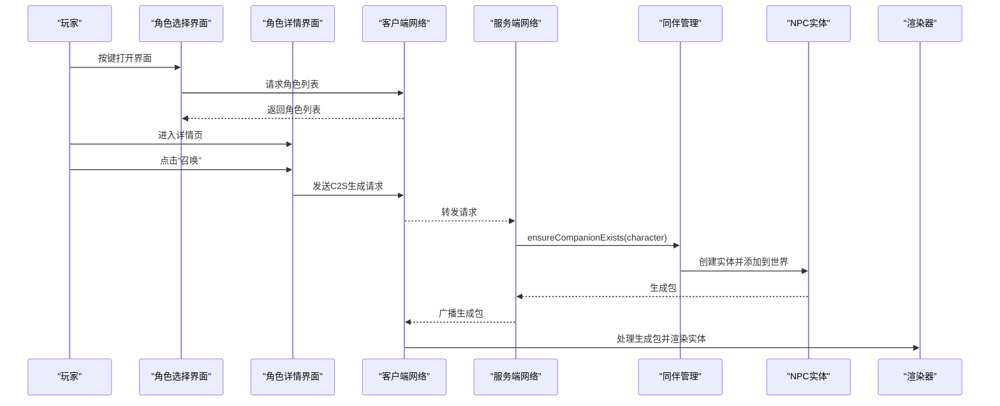
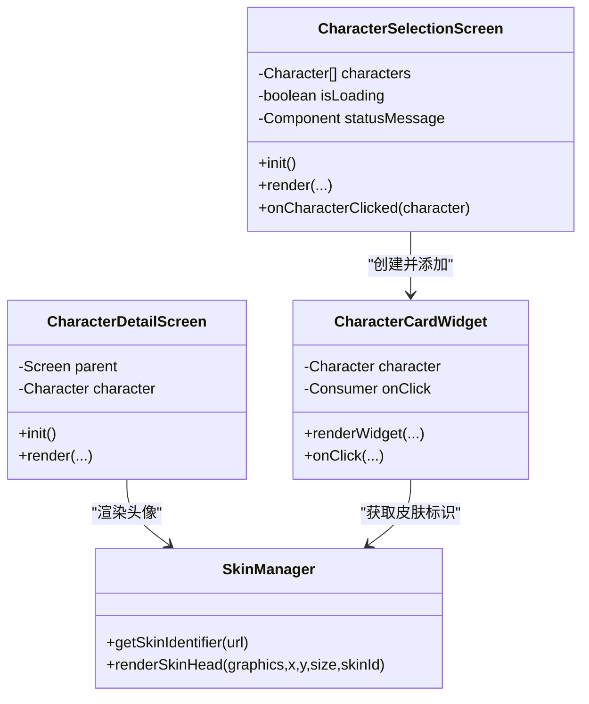
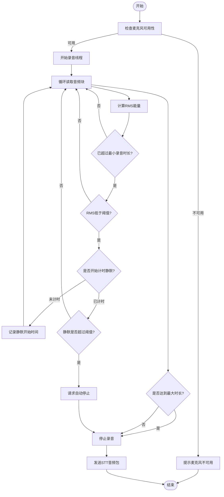
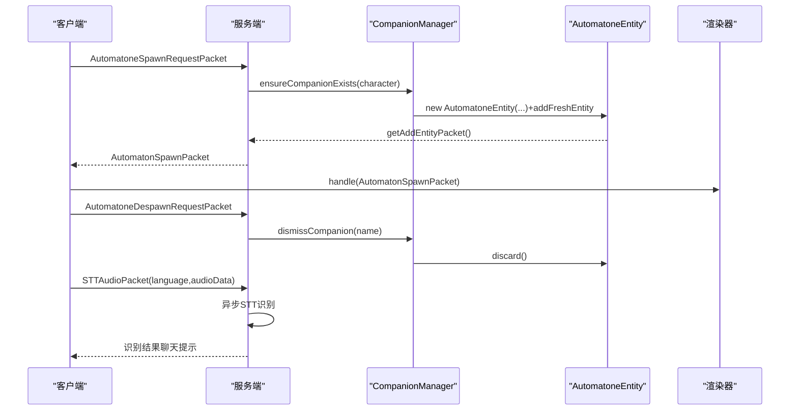
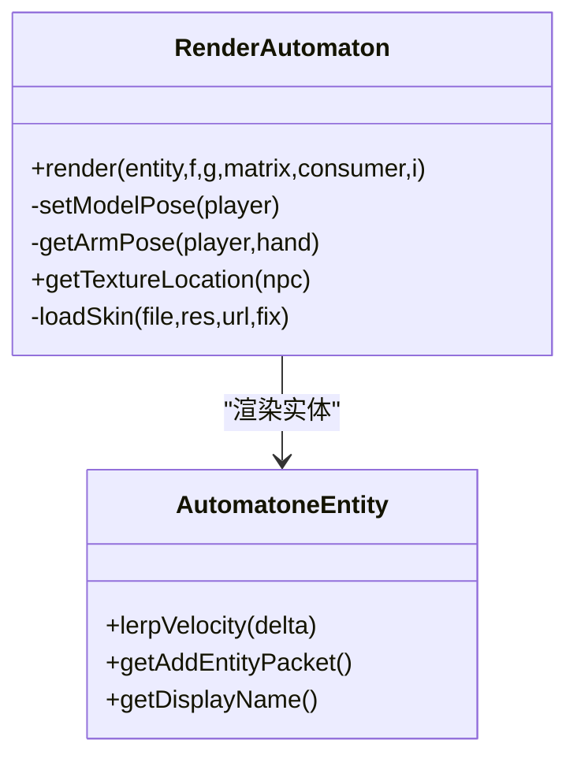
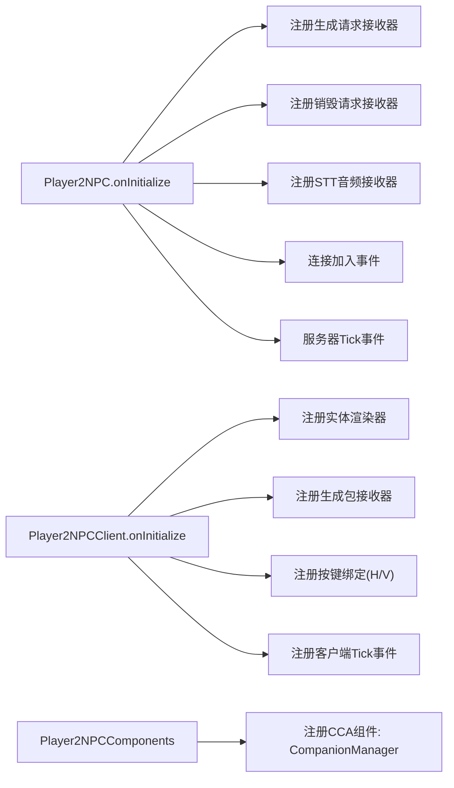
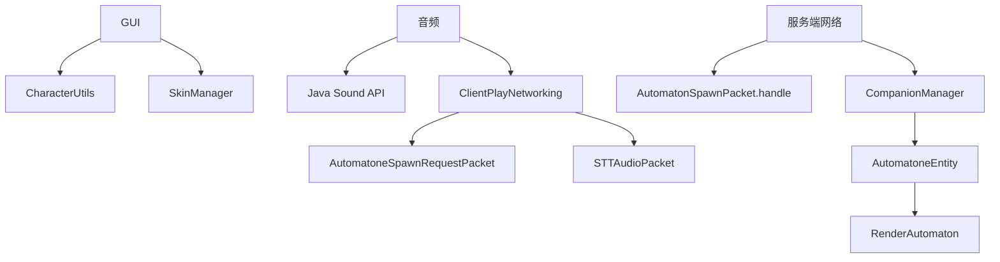

# UI/Network层

<cite>
**本文引用的文件**
- [Player2NPC.java](file://src/main/java/com/goodbird/player2npc/Player2NPC.java)
- [Player2NPCClient.java](file://src/main/java/com/goodbird/player2npc/Player2NPCClient.java)
- [Player2NPCComponents.java](file://src/main/java/com/goodbird/player2npc/Player2NPCComponents.java)
- [CharacterSelectionScreen.java](file://src/main/java/com/goodbird/player2npc/client/gui/CharacterSelectionScreen.java)
- [CharacterDetailScreen.java](file://src/main/java/com/goodbird/player2npc/client/gui/CharacterDetailScreen.java)
- [CharacterCardWidget.java](file://src/main/java/com/goodbird/player2npc/client/gui/CharacterCardWidget.java)
- [SkinManager.java](file://src/main/java/com/goodbird/player2npc/client/util/SkinManager.java)
- [MicrophoneRecorder.java](file://src/main/java/com/goodbird/player2npc/client/audio/MicrophoneRecorder.java)
- [RenderAutomaton.java](file://src/main/java/com/goodbird/player2npc/client/render/RenderAutomaton.java)
- [AutomatonSpawnPacket.java](file://src/main/java/com/goodbird/player2npc/network/AutomatonSpawnPacket.java)
- [AutomatoneSpawnRequestPacket.java](file://src/main/java/com/goodbird/player2npc/network/AutomatoneSpawnRequestPacket.java)
- [AutomatoneDespawnRequestPacket.java](file://src/main/java/com/goodbird/player2npc/network/AutomatoneDespawnRequestPacket.java)
- [STTAudioPacket.java](file://src/main/java/com/goodbird/player2npc/network/STTAudioPacket.java)
- [AutomatoneEntity.java](file://src/main/java/com/goodbird/player2npc/companion/AutomatoneEntity.java)
- [CompanionManager.java](file://src/main/java/com/goodbird/player2npc/companion/CompanionManager.java)
</cite>

## 目录
1. [引言](#引言)
2. [项目结构](#项目结构)
3. [核心组件](#核心组件)
4. [架构总览](#架构总览)
5. [详细组件分析](#详细组件分析)
6. [依赖分析](#依赖分析)
7. [性能考虑](#性能考虑)
8. [故障排查指南](#故障排查指南)
9. [结论](#结论)
10. [附录](#附录)

## 引言
本文件聚焦于UI/Network层的架构设计与实现细节，涵盖以下方面：
- 用户界面：角色选择界面与角色详情界面的构建、布局与交互流程
- 客户端音频处理：麦克风录音与基于能量阈值的静音检测（VAD）
- 网络通信协议：NPC生成/销毁请求与响应、语音音频包传输、Fabric网络包协议
- 渲染系统：NPC实体渲染器与皮肤加载策略
- 与Minecraft Integration层的数据交换：通过Fabric网络与事件总线实现跨层协作

目标是帮助开发者快速理解UI层如何与服务端、渲染层、音频层协同工作，并提供可操作的优化建议与排障指引。

## 项目结构
UI/Network层主要分布在以下包中：
- client/gui：角色选择与详情界面、自定义控件
- client/audio：麦克风录音与VAD静音检测
- client/render：NPC实体渲染器
- network：Fabric网络包定义与处理
- companion：NPC实体与同伴管理
- client/util：皮肤下载与渲染辅助

```mermaid
graph TB
subgraph "客户端"
GUI["GUI 层<br/>CharacterSelectionScreen/CharacterDetailScreen"]
AUDIO["音频层<br/>MicrophoneRecorder"]
RENDER["渲染层<br/>RenderAutomaton"]
NET_C["网络(客户端)<br/>ClientPlayNetworking"]
end
subgraph "服务端"
NET_S["网络(服务端)<br/>ServerPlayNetworking"]
COMP["同伴管理<br/>CompanionManager"]
ENT["NPC实体<br/>AutomatoneEntity"]
end
NET_C <- --> NET_S
GUI --> NET_C
AUDIO --> NET_C
RENDER --> ENT
NET_S --> COMP
COMP --> ENT
```

**图表来源**
- [Player2NPCClient.java:37-124](file://src/main/java/com/goodbird/player2npc/Player2NPCClient.java#L37-L124)
- [Player2NPC.java:48-65](file://src/main/java/com/goodbird/player2npc/Player2NPC.java#L48-L65)
- [CompanionManager.java:28-191](file://src/main/java/com/goodbird/player2npc/companion/CompanionManager.java#L28-L191)
- [AutomatoneEntity.java:50-313](file://src/main/java/com/goodbird/player2npc/companion/AutomatoneEntity.java#L50-L313)

**章节来源**
- [Player2NPC.java:25-67](file://src/main/java/com/goodbird/player2npc/Player2NPC.java#L25-L67)
- [Player2NPCClient.java:23-164](file://src/main/java/com/goodbird/player2npc/Player2NPCClient.java#L23-L164)

## 核心组件
- 角色选择界面与详情界面：负责角色列表加载、卡片渲染、按钮交互（召唤/解散），并通过网络包向服务端发起请求
- 麦克风录音与VAD：在PTT模式下录制PCM音频，采用RMS能量阈值与连续静默时间触发自动停止
- Fabric网络包：定义C2S/S2C消息格式与处理流程，包括角色请求、NPC生成/销毁、语音音频包
- NPC实体与渲染：服务端创建NPC实体，客户端接收生成包并渲染；实体携带角色信息与行为控制器
- 同伴管理：基于玩家的Cca组件，维护角色与实体的映射，支持批量召唤与清理

**章节来源**
- [CharacterSelectionScreen.java:13-106](file://src/main/java/com/goodbird/player2npc/client/gui/CharacterSelectionScreen.java#L13-L106)
- [CharacterDetailScreen.java:18-80](file://src/main/java/com/goodbird/player2npc/client/gui/CharacterDetailScreen.java#L18-L80)
- [MicrophoneRecorder.java:21-200](file://src/main/java/com/goodbird/player2npc/client/audio/MicrophoneRecorder.java#L21-L200)
- [AutomatonSpawnPacket.java:26-120](file://src/main/java/com/goodbird/player2npc/network/AutomatonSpawnPacket.java#L26-L120)
- [AutomatoneSpawnRequestPacket.java:24-67](file://src/main/java/com/goodbird/player2npc/network/AutomatoneSpawnRequestPacket.java#L24-L67)
- [AutomatoneDespawnRequestPacket.java:21-65](file://src/main/java/com/goodbird/player2npc/network/AutomatoneDespawnRequestPacket.java#L21-L65)
- [STTAudioPacket.java:28-134](file://src/main/java/com/goodbird/player2npc/network/STTAudioPacket.java#L28-L134)
- [RenderAutomaton.java:39-202](file://src/main/java/com/goodbird/player2npc/client/render/RenderAutomaton.java#L39-L202)
- [AutomatoneEntity.java:50-313](file://src/main/java/com/goodbird/player2npc/companion/AutomatoneEntity.java#L50-L313)
- [CompanionManager.java:28-191](file://src/main/java/com/goodbird/player2npc/companion/CompanionManager.java#L28-L191)

## 架构总览
UI/Network层围绕“按键绑定—界面—网络—实体—渲染”闭环展开，关键流程如下：
- 客户端按键触发：打开角色选择界面、PTT录音
- 界面交互：点击角色卡片进入详情页，发起召唤/解散请求
- 网络通信：客户端发送C2S请求，服务端处理并广播生成包或执行实体销毁
- 渲染更新：客户端接收生成包后创建实体并渲染，显示角色皮肤与动作



**图表来源**
- [Player2NPCClient.java:56-123](file://src/main/java/com/goodbird/player2npc/Player2NPCClient.java#L56-L123)
- [Player2NPC.java:52-58](file://src/main/java/com/goodbird/player2npc/Player2NPC.java#L52-L58)
- [AutomatoneSpawnRequestPacket.java:57-65](file://src/main/java/com/goodbird/player2npc/network/AutomatoneSpawnRequestPacket.java#L57-L65)
- [AutomatoneEntity.java:298-302](file://src/main/java/com/goodbird/player2npc/companion/AutomatoneEntity.java#L298-L302)
- [AutomatonSpawnPacket.java:100-119](file://src/main/java/com/goodbird/player2npc/network/AutomatonSpawnPacket.java#L100-L119)
- [RenderAutomaton.java:52-59](file://src/main/java/com/goodbird/player2npc/client/render/RenderAutomaton.java#L52-L59)

## 详细组件分析

### 角色选择与详情界面
- 角色选择界面负责异步拉取角色列表，动态生成角色卡片网格，支持加载状态与错误提示
- 角色详情界面展示角色头像、简介与操作按钮，分别触发“召唤”和“解散”请求
- 自定义控件CharacterCardWidget封装了头像渲染与点击回调



**图表来源**
- [CharacterSelectionScreen.java:13-106](file://src/main/java/com/goodbird/player2npc/client/gui/CharacterSelectionScreen.java#L13-L106)
- [CharacterDetailScreen.java:18-80](file://src/main/java/com/goodbird/player2npc/client/gui/CharacterDetailScreen.java#L18-L80)
- [CharacterCardWidget.java:14-53](file://src/main/java/com/goodbird/player2npc/client/gui/CharacterCardWidget.java#L14-L53)
- [SkinManager.java:10-57](file://src/main/java/com/goodbird/player2npc/client/util/SkinManager.java#L10-L57)

**章节来源**
- [CharacterSelectionScreen.java:23-52](file://src/main/java/com/goodbird/player2npc/client/gui/CharacterSelectionScreen.java#L23-L52)
- [CharacterDetailScreen.java:29-57](file://src/main/java/com/goodbird/player2npc/client/gui/CharacterDetailScreen.java#L29-L57)
- [CharacterCardWidget.java:26-47](file://src/main/java/com/goodbird/player2npc/client/gui/CharacterCardWidget.java#L26-L47)
- [SkinManager.java:14-31](file://src/main/java/com/goodbird/player2npc/client/util/SkinManager.java#L14-L31)

### 客户端音频处理（PTT+VAD）
- 录音参数：16kHz、16bit、单声道，符合阿里云Gummy STT要求
- 录制控制：PTT按下开始录音，松开或VAD检测到持续静默自动停止
- VAD策略：最小录音时长、静默阈值与静默持续时间共同决定自动停止
- 数据发送：构造语言、长度与字节流，通过Fabric网络发送至服务端



**图表来源**
- [MicrophoneRecorder.java:62-121](file://src/main/java/com/goodbird/player2npc/client/audio/MicrophoneRecorder.java#L62-L121)
- [MicrophoneRecorder.java:128-153](file://src/main/java/com/goodbird/player2npc/client/audio/MicrophoneRecorder.java#L128-L153)
- [Player2NPCClient.java:64-123](file://src/main/java/com/goodbird/player2npc/Player2NPCClient.java#L64-L123)

**章节来源**
- [MicrophoneRecorder.java:24-56](file://src/main/java/com/goodbird/player2npc/client/audio/MicrophoneRecorder.java#L24-L56)
- [MicrophoneRecorder.java:86-111](file://src/main/java/com/goodbird/player2npc/client/audio/MicrophoneRecorder.java#L86-L111)
- [Player2NPCClient.java:131-162](file://src/main/java/com/goodbird/player2npc/Player2NPCClient.java#L131-L162)

### 网络通信协议（Fabric包）
- 生成请求（C2S）：客户端发送角色信息，服务端确保实体存在并添加到世界
- 生成包（S2C）：服务端广播NPC生成包，客户端创建实体并同步位置/朝向/物品栏
- 销毁请求（C2S）：客户端请求销毁指定角色的实体，服务端移除
- 语音音频包（C2S）：客户端发送语言、长度与音频字节流，服务端异步执行STT并注入对话系统



**图表来源**
- [AutomatoneSpawnRequestPacket.java:57-65](file://src/main/java/com/goodbird/player2npc/network/AutomatoneSpawnRequestPacket.java#L57-L65)
- [AutomatoneEntity.java:298-302](file://src/main/java/com/goodbird/player2npc/companion/AutomatoneEntity.java#L298-L302)
- [AutomatonSpawnPacket.java:100-119](file://src/main/java/com/goodbird/player2npc/network/AutomatonSpawnPacket.java#L100-L119)
- [AutomatoneDespawnRequestPacket.java:56-63](file://src/main/java/com/goodbird/player2npc/network/AutomatoneDespawnRequestPacket.java#L56-L63)
- [STTAudioPacket.java:39-121](file://src/main/java/com/goodbird/player2npc/network/STTAudioPacket.java#L39-L121)

**章节来源**
- [AutomatonSpawnPacket.java:26-98](file://src/main/java/com/goodbird/player2npc/network/AutomatonSpawnPacket.java#L26-L98)
- [AutomatoneSpawnRequestPacket.java:24-55](file://src/main/java/com/goodbird/player2npc/network/AutomatoneSpawnRequestPacket.java#L24-L55)
- [AutomatoneDespawnRequestPacket.java:21-54](file://src/main/java/com/goodbird/player2npc/network/AutomatoneDespawnRequestPacket.java#L21-L54)
- [STTAudioPacket.java:28-134](file://src/main/java/com/goodbird/player2npc/network/STTAudioPacket.java#L28-L134)

### 渲染系统（NPC渲染器）
- 基于LivingEntityRenderer，复用玩家模型与各层（盔甲、主手物品、头部等）
- 动作姿态根据主/副手物品与使用动画动态切换
- 皮肤加载：优先使用远程皮肤，否则回退到默认Steve皮肤；首次加载时异步下载并缓存



**图表来源**
- [RenderAutomaton.java:39-202](file://src/main/java/com/goodbird/player2npc/client/render/RenderAutomaton.java#L39-L202)
- [AutomatoneEntity.java:294-312](file://src/main/java/com/goodbird/player2npc/companion/AutomatoneEntity.java#L294-L312)

**章节来源**
- [RenderAutomaton.java:52-59](file://src/main/java/com/goodbird/player2npc/client/render/RenderAutomaton.java#L52-L59)
- [RenderAutomaton.java:139-201](file://src/main/java/com/goodbird/player2npc/client/render/RenderAutomaton.java#L139-L201)
- [AutomatoneEntity.java:294-302](file://src/main/java/com/goodbird/player2npc/companion/AutomatoneEntity.java#L294-L302)

### 与Minecraft Integration层的数据交换
- 服务端入口注册：实体类型、网络包接收器、连接事件、Tick事件
- 客户端入口注册：实体渲染器、网络包接收器、按键绑定、客户端Tick事件
- CCA组件：为每个ServerPlayer注册CompanionManager，实现玩家级NPC生命周期管理



**图表来源**
- [Player2NPC.java:48-65](file://src/main/java/com/goodbird/player2npc/Player2NPC.java#L48-L65)
- [Player2NPCClient.java:36-124](file://src/main/java/com/goodbird/player2npc/Player2NPCClient.java#L36-L124)
- [Player2NPCComponents.java:10-17](file://src/main/java/com/goodbird/player2npc/Player2NPCComponents.java#L10-L17)

**章节来源**
- [Player2NPC.java:48-65](file://src/main/java/com/goodbird/player2npc/Player2NPC.java#L48-L65)
- [Player2NPCClient.java:36-55](file://src/main/java/com/goodbird/player2npc/Player2NPCClient.java#L36-L55)
- [Player2NPCComponents.java:12-15](file://src/main/java/com/goodbird/player2npc/Player2NPCComponents.java#L12-L15)

## 依赖分析
- UI层依赖CharacterUtils进行角色数据拉取，依赖SkinManager进行头像渲染
- 音频层依赖Java Sound API与RMS能量计算，依赖客户端网络发送STT包
- 网络层依赖Fabric Networking API，区分客户端/服务端接收器
- 渲染层依赖Minecraft渲染管线与纹理管理
- 实体层依赖AltoClef控制器与Baritone接口，实现AI行为与任务链



**图表来源**
- [CharacterSelectionScreen.java:32-51](file://src/main/java/com/goodbird/player2npc/client/gui/CharacterSelectionScreen.java#L32-L51)
- [SkinManager.java:14-31](file://src/main/java/com/goodbird/player2npc/client/util/SkinManager.java#L14-L31)
- [MicrophoneRecorder.java:67-121](file://src/main/java/com/goodbird/player2npc/client/audio/MicrophoneRecorder.java#L67-L121)
- [Player2NPCClient.java:150-162](file://src/main/java/com/goodbird/player2npc/Player2NPCClient.java#L150-L162)
- [AutomatonSpawnPacket.java:100-119](file://src/main/java/com/goodbird/player2npc/network/AutomatonSpawnPacket.java#L100-L119)
- [CompanionManager.java:100-129](file://src/main/java/com/goodbird/player2npc/companion/CompanionManager.java#L100-L129)
- [RenderAutomaton.java:139-201](file://src/main/java/com/goodbird/player2npc/client/render/RenderAutomaton.java#L139-L201)

**章节来源**
- [CharacterSelectionScreen.java:32-51](file://src/main/java/com/goodbird/player2npc/client/gui/CharacterSelectionScreen.java#L32-L51)
- [SkinManager.java:14-31](file://src/main/java/com/goodbird/player2npc/client/util/SkinManager.java#L14-L31)
- [MicrophoneRecorder.java:67-121](file://src/main/java/com/goodbird/player2npc/client/audio/MicrophoneRecorder.java#L67-L121)
- [Player2NPCClient.java:150-162](file://src/main/java/com/goodbird/player2npc/Player2NPCClient.java#L150-L162)
- [AutomatonSpawnPacket.java:100-119](file://src/main/java/com/goodbird/player2npc/network/AutomatonSpawnPacket.java#L100-L119)
- [CompanionManager.java:100-129](file://src/main/java/com/goodbird/player2npc/companion/CompanionManager.java#L100-L129)
- [RenderAutomaton.java:139-201](file://src/main/java/com/goodbird/player2npc/client/render/RenderAutomaton.java#L139-L201)

## 性能考虑
- 网络包体积压缩：生成包对速度分量与角度进行量化压缩，减少带宽占用
- STT异步处理：避免阻塞服务器主线程，使用独立线程池执行识别
- 客户端渲染优化：仅在实体可见时进行渲染，避免异常捕获导致的吞吐下降
- 音频缓冲：按约100ms块读取，降低CPU抖动；VAD阈值与静默窗口需结合设备校准

[本节为通用指导，不直接分析具体文件]

## 故障排查指南
- 麦克风不可用：确认系统权限与设备可用性，查看日志中的麦克风初始化错误
- 录音过短：PTT/VAD均设置最低时长阈值，确保至少0.5秒以上音频
- STT未启用/密钥未配置：检查服务端配置，确认API Key与模型设置
- 识别为空：确认音频质量与静默检测策略，必要时提高阈值或延长静默窗口
- 生成包未生效：检查服务端网络接收器注册与客户端渲染器注册是否正确
- 同伴未召唤：确认连接事件与异步角色列表拉取是否完成

**章节来源**
- [MicrophoneRecorder.java:117-121](file://src/main/java/com/goodbird/player2npc/client/audio/MicrophoneRecorder.java#L117-L121)
- [Player2NPCClient.java:76-80](file://src/main/java/com/goodbird/player2npc/Player2NPCClient.java#L76-L80)
- [STTAudioPacket.java:70-81](file://src/main/java/com/goodbird/player2npc/network/STTAudioPacket.java#L70-L81)
- [STTAudioPacket.java:95-99](file://src/main/java/com/goodbird/player2npc/network/STTAudioPacket.java#L95-L99)
- [Player2NPC.java:52-54](file://src/main/java/com/goodbird/player2npc/Player2NPC.java#L52-L54)
- [Player2NPCClient.java:38-40](file://src/main/java/com/goodbird/player2npc/Player2NPCClient.java#L38-L40)

## 结论
UI/Network层通过清晰的职责划分与Fabric网络协议，实现了从界面交互到服务端实体管理再到客户端渲染的完整闭环。UI层负责用户意图表达，网络层负责跨端数据交换，渲染层负责视觉反馈，配合音频层与AI集成层，形成完整的可扩展架构。

[本节为总结性内容，不直接分析具体文件]

## 附录
- 关键常量与ID：生成/销毁请求与STT音频包的资源定位符
- 实体维度与追踪：实体类型注册与追踪参数
- 组件注册：为ServerPlayer注册CompanionManager组件

**章节来源**
- [Player2NPC.java:29-46](file://src/main/java/com/goodbird/player2npc/Player2NPC.java#L29-L46)
- [Player2NPCComponents.java:12-15](file://src/main/java/com/goodbird/player2npc/Player2NPCComponents.java#L12-L15)