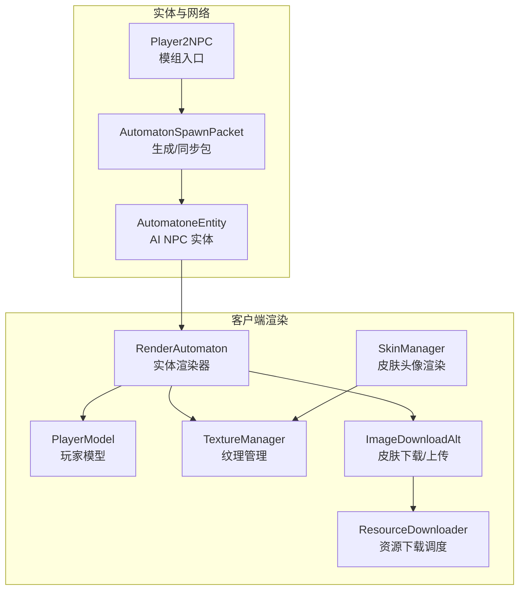
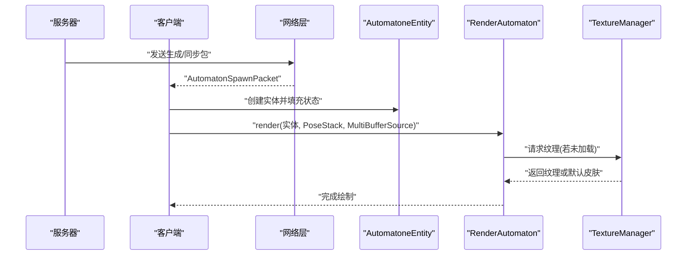
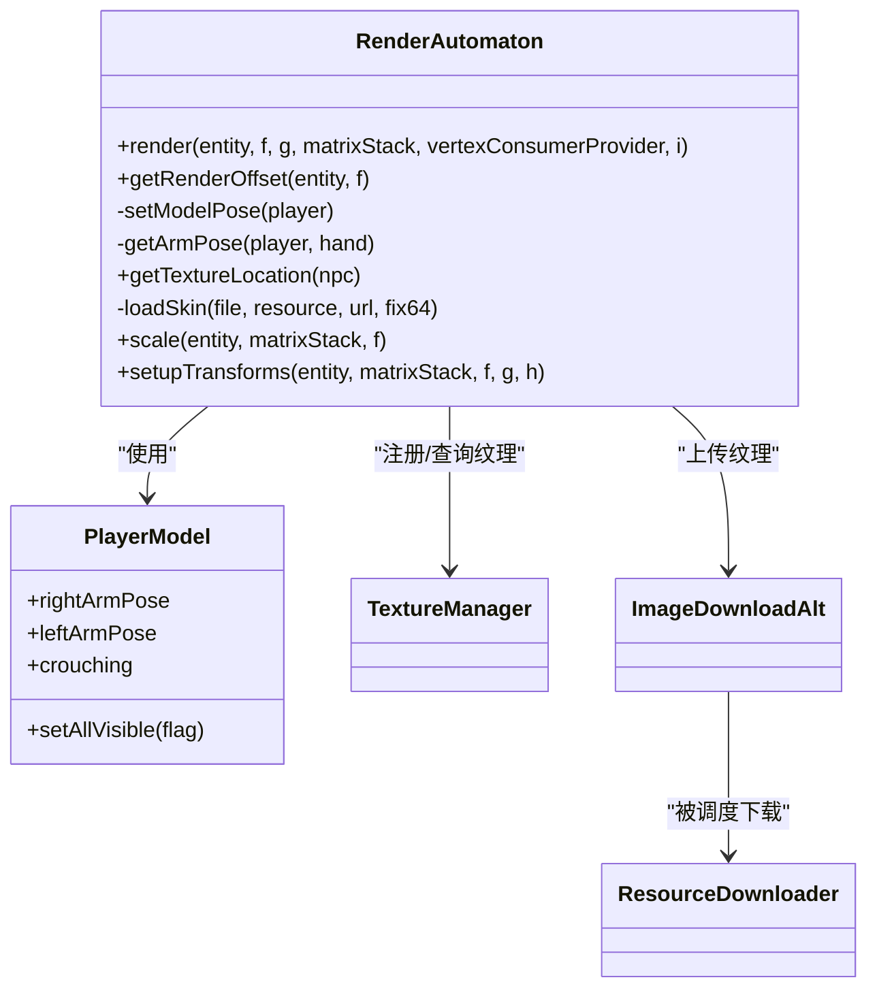
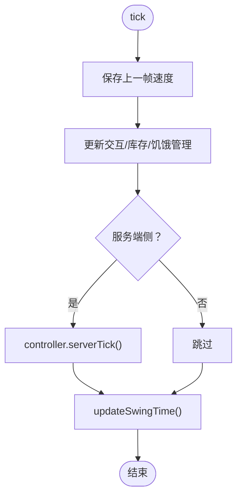
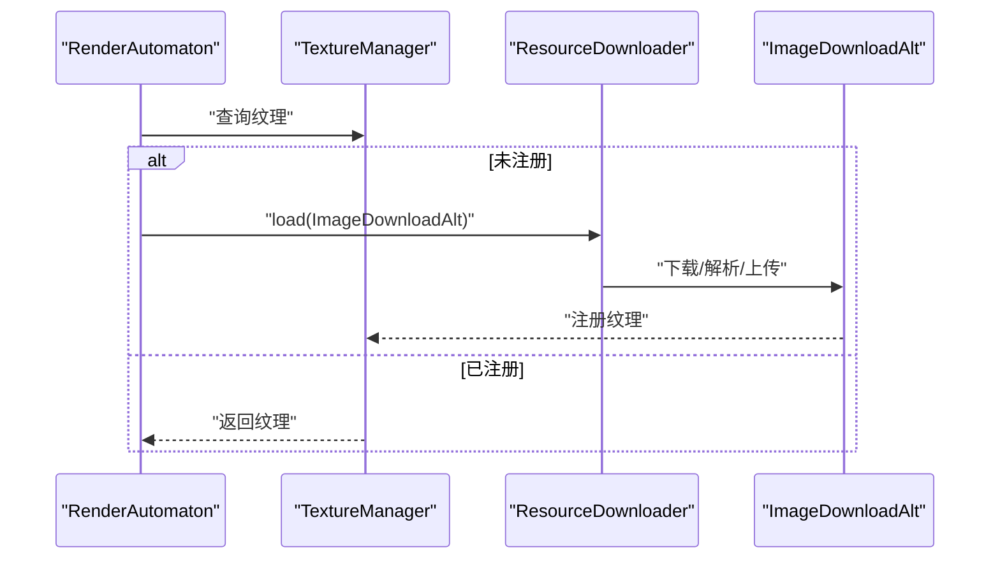
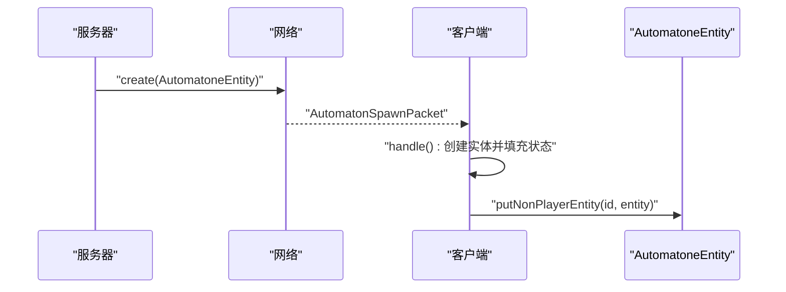
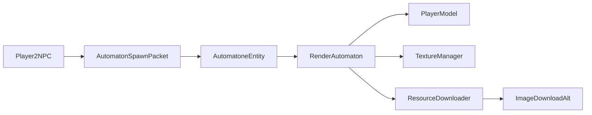

# 渲染系统

<cite>
**本文引用的文件**
- [RenderAutomaton.java](file://src/main/java/com/goodbird/player2npc/client/render/RenderAutomaton.java)
- [AutomatoneEntity.java](file://src/main/java/com/goodbird/player2npc/companion/AutomatoneEntity.java)
- [SkinManager.java](file://src/main/java/com/goodbird/player2npc/client/util/SkinManager.java)
- [ImageDownloadAlt.java](file://src/main/java/com/goodbird/player2npc/client/util/ImageDownloadAlt.java)
- [ResourceDownloader.java](file://src/main/java/com/goodbird/player2npc/client/util/ResourceDownloader.java)
- [AutomatonSpawnPacket.java](file://src/main/java/com/goodbird/player2npc/network/AutomatonSpawnPacket.java)
- [Player2NPC.java](file://src/main/java/com/goodbird/player2npc/Player2NPC.java)
</cite>

## 目录
1. [简介](#简介)
2. [项目结构](#项目结构)
3. [核心组件](#核心组件)
4. [架构总览](#架构总览)
5. [详细组件分析](#详细组件分析)
6. [依赖分析](#依赖分析)
7. [性能考量](#性能考量)
8. [故障排查指南](#故障排查指南)
9. [结论](#结论)

## 简介
本文件面向渲染系统，聚焦 RenderAutomaton NPC 渲染器的实现与工作机制，涵盖实体渲染管线、材质加载与绑定、纹理管理、光照与阴影在当前实现中的角色、Minecraft 渲染 API 的使用方式（RenderType、VertexConsumer、MultiBufferSource），并结合 AutomatoneEntity 实体类说明渲染生命周期、动画帧处理、颜色与纹理应用、透明度与混合模式设置。同时解释渲染系统与实体类的协作关系，以及在不同视角与距离下的渲染优化策略。

## 项目结构
渲染相关的关键模块分布如下：
- 客户端渲染器：RenderAutomaton 负责 NPC 模型装配、姿态设置、纹理加载与变换
- 实体类：AutomatoneEntity 提供渲染所需的状态数据（如速度、朝向、主手/副手物品、是否游泳/滑翔等）
- 纹理与下载：SkinManager、ResourceDownloader、ImageDownloadAlt 负责皮肤下载、缓存与注册
- 网络同步：AutomatonSpawnPacket 负责服务端到客户端的实体生成与状态同步
- 模组入口：Player2NPC 注册实体类型与网络事件

图表来源
- [RenderAutomaton.java:39-50](file://src/main/java/com/goodbird/player2npc/client/render/RenderAutomaton.java#L39-L50)
- [AutomatoneEntity.java:50-100](file://src/main/java/com/goodbird/player2npc/companion/AutomatoneEntity.java#L50-L100)
- [SkinManager.java:10-31](file://src/main/java/com/goodbird/player2npc/client/util/SkinManager.java#L10-L31)
- [ImageDownloadAlt.java:23-57](file://src/main/java/com/goodbird/player2npc/client/util/ImageDownloadAlt.java#L23-L57)
- [ResourceDownloader.java:16-42](file://src/main/java/com/goodbird/player2npc/client/util/ResourceDownloader.java#L16-L42)
- [AutomatonSpawnPacket.java:26-52](file://src/main/java/com/goodbird/player2npc/network/AutomatonSpawnPacket.java#L26-L52)
- [Player2NPC.java:25-46](file://src/main/java/com/goodbird/player2npc/Player2NPC.java#L25-L46)

章节来源
- [RenderAutomaton.java:39-50](file://src/main/java/com/goodbird/player2npc/client/render/RenderAutomaton.java#L39-L50)
- [AutomatoneEntity.java:50-100](file://src/main/java/com/goodbird/player2npc/companion/AutomatoneEntity.java#L50-L100)
- [SkinManager.java:10-31](file://src/main/java/com/goodbird/player2npc/client/util/SkinManager.java#L10-L31)
- [ImageDownloadAlt.java:23-57](file://src/main/java/com/goodbird/player2npc/client/util/ImageDownloadAlt.java#L23-L57)
- [ResourceDownloader.java:16-42](file://src/main/java/com/goodbird/player2npc/client/util/ResourceDownloader.java#L16-L42)
- [AutomatonSpawnPacket.java:26-52](file://src/main/java/com/goodbird/player2npc/network/AutomatonSpawnPacket.java#L26-L52)
- [Player2NPC.java:25-46](file://src/main/java/com/goodbird/player2npc/Player2NPC.java#L25-L46)

## 核心组件
- RenderAutomaton：继承自 LivingEntityRenderer，负责 NPC 的模型装配、姿态与动画、装备层叠加、纹理选择与变换、泳圈/滑翔/游泳时的姿态调整。
- AutomatoneEntity：提供渲染所需的实体状态（位置、朝向、速度、主手/副手物品、是否游泳/滑翔、是否隐身等），并参与网络生成与同步。
- SkinManager：提供皮肤头像渲染与默认皮肤回退逻辑。
- ImageDownloadAlt：从远端下载 PNG 皮肤、本地缓存、解析与上传纹理。
- ResourceDownloader：线程池异步调度资源下载，并注册到 TextureManager。
- AutomatonSpawnPacket：服务端到客户端的实体生成与状态同步包。
- Player2NPC：注册实体类型与网络通道，触发实体生成流程。

章节来源
- [RenderAutomaton.java:39-50](file://src/main/java/com/goodbird/player2npc/client/render/RenderAutomaton.java#L39-L50)
- [AutomatoneEntity.java:50-100](file://src/main/java/com/goodbird/player2npc/companion/AutomatoneEntity.java#L50-L100)
- [SkinManager.java:10-31](file://src/main/java/com/goodbird/player2npc/client/util/SkinManager.java#L10-L31)
- [ImageDownloadAlt.java:23-57](file://src/main/java/com/goodbird/player2npc/client/util/ImageDownloadAlt.java#L23-L57)
- [ResourceDownloader.java:16-42](file://src/main/java/com/goodbird/player2npc/client/util/ResourceDownloader.java#L16-L42)
- [AutomatonSpawnPacket.java:26-52](file://src/main/java/com/goodbird/player2npc/network/AutomatonSpawnPacket.java#L26-L52)
- [Player2NPC.java:25-46](file://src/main/java/com/goodbird/player2npc/Player2NPC.java#L25-L46)

## 架构总览
渲染系统围绕“实体状态 → 渲染器 → 模型与纹理 → 渲染管线”的链路展开。渲染器根据实体状态设置模型姿态与变换，纹理通过下载与注册机制动态加载，最终由 Minecraft 的渲染管线输出到屏幕。

图表来源
- [AutomatonSpawnPacket.java:100-119](file://src/main/java/com/goodbird/player2npc/network/AutomatonSpawnPacket.java#L100-L119)
- [RenderAutomaton.java:52-59](file://src/main/java/com/goodbird/player2npc/client/render/RenderAutomaton.java#L52-L59)
- [RenderAutomaton.java:139-153](file://src/main/java/com/goodbird/player2npc/client/render/RenderAutomaton.java#L139-L153)

## 详细组件分析

### RenderAutomaton 渲染器
- 继承与初始化
  - 继承 LivingEntityRenderer，使用 PlayerModel 并注册多种层（盔甲、主副手物品、箭矢、头颅、鞘翅、旋转攻击特效、蜂蛰）。
  - 通过 bakeLayer 获取模型图层，确保渲染时有正确的几何拓扑。
- 渲染生命周期
  - render 方法中先设置模型姿态，再调用父类渲染，异常被捕获记录日志。
  - getRenderOffset 根据是否潜行调整渲染偏移。
- 模型姿态与动画
  - setModelPose 设置可见性与姿态，依据实体的主/副手物品、使用动画、是否双手持物等决定左右臂的 ArmPose。
  - getArmPose 基于 UseAnim 与物品类型（盾牌格挡、弓、三叉戟、弩、望远镜、号角、刷子）返回对应姿态。
- 纹理与皮肤
  - getTextureLocation 首次访问时下载并注册皮肤；若失败则回退到默认皮肤。
  - loadSkin 在纹理未注册时通过 ResourceDownloader 异步加载 ImageDownloadAlt 并上传至 GPU。
- 变换与特殊状态
  - scale 固定缩放比例。
  - setupTransforms 针对滑翔、游泳/水下旋转、游泳姿态进行额外变换，保证视觉一致。

图表来源
- [RenderAutomaton.java:39-50](file://src/main/java/com/goodbird/player2npc/client/render/RenderAutomaton.java#L39-L50)
- [RenderAutomaton.java:65-95](file://src/main/java/com/goodbird/player2npc/client/render/RenderAutomaton.java#L65-L95)
- [RenderAutomaton.java:97-137](file://src/main/java/com/goodbird/player2npc/client/render/RenderAutomaton.java#L97-L137)
- [RenderAutomaton.java:139-162](file://src/main/java/com/goodbird/player2npc/client/render/RenderAutomaton.java#L139-L162)
- [ImageDownloadAlt.java:23-57](file://src/main/java/com/goodbird/player2npc/client/util/ImageDownloadAlt.java#L23-L57)
- [ResourceDownloader.java:16-42](file://src/main/java/com/goodbird/player2npc/client/util/ResourceDownloader.java#L16-L42)

章节来源
- [RenderAutomaton.java:39-50](file://src/main/java/com/goodbird/player2npc/client/render/RenderAutomaton.java#L39-L50)
- [RenderAutomaton.java:65-95](file://src/main/java/com/goodbird/player2npc/client/render/RenderAutomaton.java#L65-L95)
- [RenderAutomaton.java:97-137](file://src/main/java/com/goodbird/player2npc/client/render/RenderAutomaton.java#L97-L137)
- [RenderAutomaton.java:139-162](file://src/main/java/com/goodbird/player2npc/client/render/RenderAutomaton.java#L139-L162)

### AutomatoneEntity 实体类
- 角色与状态
  - 持有 Character 以决定外观与名称；维护 Inventory、InteractionManager、HungerManager。
  - 提供 lerpVelocity 用于平滑插值速度，辅助渲染时的旋转与位移过渡。
- 生命周期与网络
  - tick 中更新上一帧速度、控制器与库存；aiStep 处理水下行为与拾取掉落物。
  - getAddEntityPacket 返回自定义 Spawn 包，用于客户端侧创建实体。
  - getDisplayName 使用 Character 的 shortName 作为显示名。
- 与渲染器协作
  - 提供主/副手物品、使用动画剩余时间、是否游泳/滑翔、潜行等状态，驱动 RenderAutomaton 的姿态与变换。

图表来源
- [AutomatoneEntity.java:165-177](file://src/main/java/com/goodbird/player2npc/companion/AutomatoneEntity.java#L165-L177)

章节来源
- [AutomatoneEntity.java:50-100](file://src/main/java/com/goodbird/player2npc/companion/AutomatoneEntity.java#L50-L100)
- [AutomatoneEntity.java:165-177](file://src/main/java/com/goodbird/player2npc/companion/AutomatoneEntity.java#L165-L177)
- [AutomatoneEntity.java:298-312](file://src/main/java/com/goodbird/player2npc/companion/AutomatoneEntity.java#L298-L312)

### 纹理管理与皮肤加载
- SkinManager
  - 若目标皮肤已存在则直接返回；否则通过 ResourceDownloader 异步下载并注册默认皮肤回退。
  - 提供头像渲染方法，分别绘制基础皮肤与帽子区域，并启用/禁用混合。
- ResourceDownloader
  - 使用单线程调度器异步下载，完成后在客户端主线程注册到 TextureManager。
  - 通过 getUrlResourceLocation 与 getUrlFile 计算缓存路径与资源定位符。
- ImageDownloadAlt
  - 从缓存或远端加载 PNG，解析为 NativeImage 后上传至 GPU。
  - 支持将非标准尺寸皮肤修复为 64×64 倍数规格，并对特定区域置透明。

图表来源
- [RenderAutomaton.java:139-162](file://src/main/java/com/goodbird/player2npc/client/render/RenderAutomaton.java#L139-L162)
- [SkinManager.java:14-31](file://src/main/java/com/goodbird/player2npc/client/util/SkinManager.java#L14-L31)
- [ResourceDownloader.java:24-42](file://src/main/java/com/goodbird/player2npc/client/util/ResourceDownloader.java#L24-L42)
- [ImageDownloadAlt.java:59-77](file://src/main/java/com/goodbird/player2npc/client/util/ImageDownloadAlt.java#L59-L77)

章节来源
- [SkinManager.java:14-31](file://src/main/java/com/goodbird/player2npc/client/util/SkinManager.java#L14-L31)
- [ResourceDownloader.java:24-42](file://src/main/java/com/goodbird/player2npc/client/util/ResourceDownloader.java#L24-L42)
- [ImageDownloadAlt.java:59-77](file://src/main/java/com/goodbird/player2npc/client/util/ImageDownloadAlt.java#L59-L77)
- [ImageDownloadAlt.java:105-138](file://src/main/java/com/goodbird/player2npc/client/util/ImageDownloadAlt.java#L105-L138)

### 网络与实体生成
- 自定义生成包
  - AutomatonSpawnPacket 封装实体 ID、UUID、位置、速度、俯仰角、偏航角、Character、Inventory。
  - 服务端通过 create 发送，客户端在 handle 中反序列化并创建实体，填充状态后加入世界。
- 模组入口
  - Player2NPC 注册实体类型与网络通道，在连接建立时唤起实体生成与清理。

图表来源
- [AutomatonSpawnPacket.java:70-98](file://src/main/java/com/goodbird/player2npc/network/AutomatonSpawnPacket.java#L70-L98)
- [AutomatonSpawnPacket.java:100-119](file://src/main/java/com/goodbird/player2npc/network/AutomatonSpawnPacket.java#L100-L119)
- [Player2NPC.java:48-65](file://src/main/java/com/goodbird/player2npc/Player2NPC.java#L48-L65)

章节来源
- [AutomatonSpawnPacket.java:70-98](file://src/main/java/com/goodbird/player2npc/network/AutomatonSpawnPacket.java#L70-L98)
- [AutomatonSpawnPacket.java:100-119](file://src/main/java/com/goodbird/player2npc/network/AutomatonSpawnPacket.java#L100-L119)
- [Player2NPC.java:48-65](file://src/main/java/com/goodbird/player2npc/Player2NPC.java#L48-L65)

## 依赖分析
- 渲染器与实体
  - RenderAutomaton 依赖 AutomatoneEntity 的状态（主/副手、使用动画、速度、姿态）以设置模型与变换。
- 渲染器与纹理
  - RenderAutomaton 依赖 TextureManager 与 ResourceDownloader/ ImageDownloadAlt 完成皮肤下载与注册。
- 网络与实体
  - AutomatonSpawnPacket 与 Player2NPC 协作完成实体生成与状态同步。
- 层叠与扩展
  - RenderAutomaton 通过 addLayer 注入多种层（盔甲、物品、箭矢、头颅、鞘翅、特效、蜂蛰），形成可扩展的外观系统。

图表来源
- [RenderAutomaton.java:39-50](file://src/main/java/com/goodbird/player2npc/client/render/RenderAutomaton.java#L39-L50)
- [AutomatoneEntity.java:50-100](file://src/main/java/com/goodbird/player2npc/companion/AutomatoneEntity.java#L50-L100)
- [ResourceDownloader.java:16-42](file://src/main/java/com/goodbird/player2npc/client/util/ResourceDownloader.java#L16-L42)
- [ImageDownloadAlt.java:23-57](file://src/main/java/com/goodbird/player2npc/client/util/ImageDownloadAlt.java#L23-L57)
- [AutomatonSpawnPacket.java:26-52](file://src/main/java/com/goodbird/player2npc/network/AutomatonSpawnPacket.java#L26-L52)
- [Player2NPC.java:25-46](file://src/main/java/com/goodbird/player2npc/Player2NPC.java#L25-L46)

章节来源
- [RenderAutomaton.java:39-50](file://src/main/java/com/goodbird/player2npc/client/render/RenderAutomaton.java#L39-L50)
- [AutomatoneEntity.java:50-100](file://src/main/java/com/goodbird/player2npc/companion/AutomatoneEntity.java#L50-L100)
- [ResourceDownloader.java:16-42](file://src/main/java/com/goodbird/player2npc/client/util/ResourceDownloader.java#L16-L42)
- [ImageDownloadAlt.java:23-57](file://src/main/java/com/goodbird/player2npc/client/util/ImageDownloadAlt.java#L23-L57)
- [AutomatonSpawnPacket.java:26-52](file://src/main/java/com/goodbird/player2npc/network/AutomatonSpawnPacket.java#L26-L52)
- [Player2NPC.java:25-46](file://src/main/java/com/goodbird/player2npc/Player2NPC.java#L25-L46)

## 性能考量
- 异步下载与注册
  - 通过单线程调度器异步下载皮肤，避免阻塞主线程；仅在纹理未注册时触发下载，减少重复工作。
- 纹理复用与回退
  - 已注册纹理直接复用；下载失败时回退默认皮肤，保障渲染稳定性。
- 姿态与变换优化
  - 仅在滑翔/游泳/潜行等状态下进行额外变换，降低常规帧的计算开销。
- 网络同步频率
  - 实体跟踪范围与更新频率已在实体类型注册中设定，有助于控制渲染与网络负载。

章节来源
- [ResourceDownloader.java:16-42](file://src/main/java/com/goodbird/player2npc/client/util/ResourceDownloader.java#L16-L42)
- [RenderAutomaton.java:139-162](file://src/main/java/com/goodbird/player2npc/client/render/RenderAutomaton.java#L139-L162)
- [RenderAutomaton.java:164-200](file://src/main/java/com/goodbird/player2npc/client/render/RenderAutomaton.java#L164-L200)
- [Player2NPC.java:38-46](file://src/main/java/com/goodbird/player2npc/Player2NPC.java#L38-L46)

## 故障排查指南
- 渲染异常
  - RenderAutomaton 的 render 方法内捕获异常并记录日志，便于定位具体实体与问题。
- 纹理加载失败
  - 检查 ResourceDownloader 是否成功注册；确认 ImageDownloadAlt 的下载与解析流程是否抛出异常；必要时回退默认皮肤。
- 网络生成失败
  - 检查 AutomatonSpawnPacket 的序列化/反序列化是否正确；确认客户端 handle 中实体创建与状态填充是否完成。

章节来源
- [RenderAutomaton.java:52-59](file://src/main/java/com/goodbird/player2npc/client/render/RenderAutomaton.java#L52-L59)
- [ResourceDownloader.java:37-41](file://src/main/java/com/goodbird/player2npc/client/util/ResourceDownloader.java#L37-L41)
- [ImageDownloadAlt.java:79-103](file://src/main/java/com/goodbird/player2npc/client/util/ImageDownloadAlt.java#L79-L103)
- [AutomatonSpawnPacket.java:100-119](file://src/main/java/com/goodbird/player2npc/network/AutomatonSpawnPacket.java#L100-L119)

## 结论
RenderAutomaton 将实体状态与模型/纹理系统紧密耦合，通过异步资源下载与层叠渲染实现灵活且稳定的 NPC 外观表现。结合 AutomatoneEntity 的状态与网络包，系统在不同视角与距离下具备良好的可扩展性与性能表现。未来可在光照与阴影方面引入更精细的着色器与 RenderType 控制，进一步提升视觉质量与一致性。