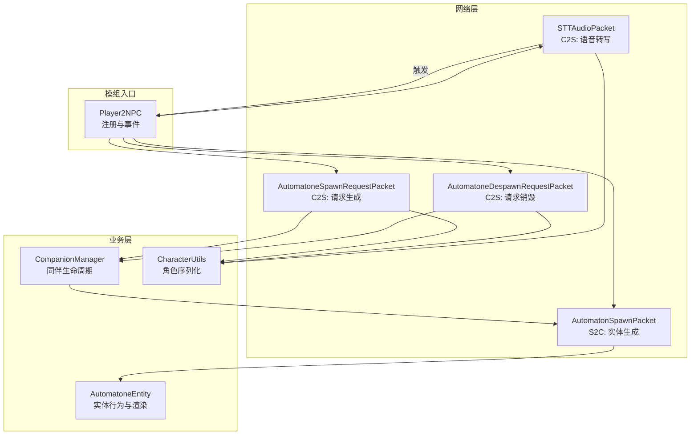
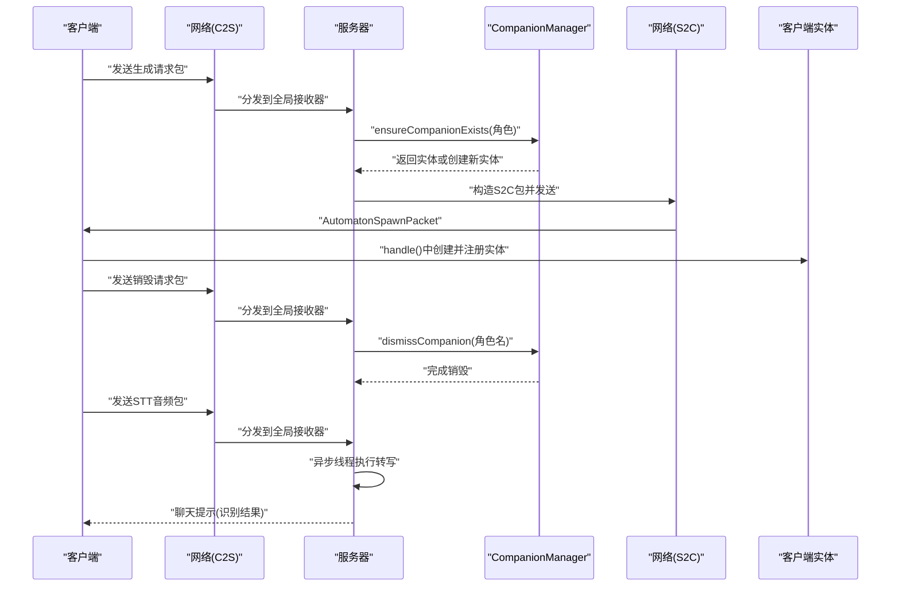
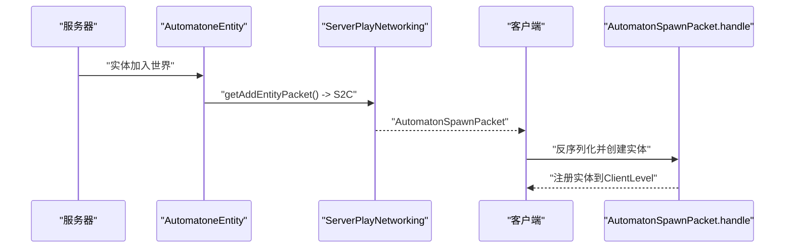
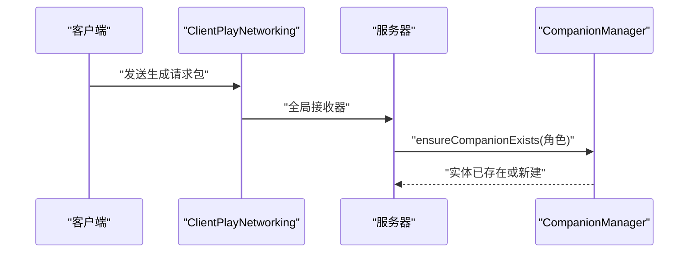
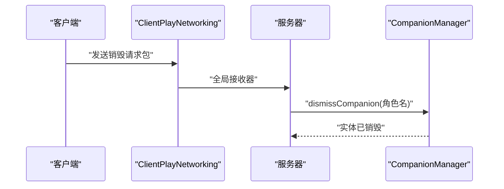
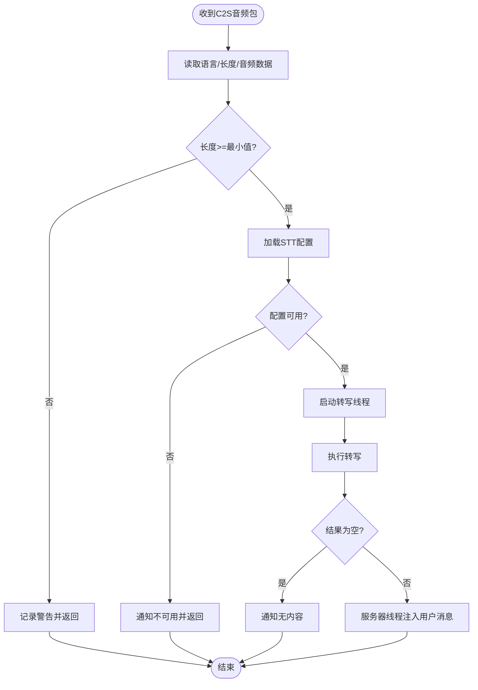
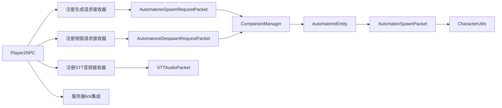

# 网络通信协议

<cite>
**本文引用的文件**
- [AutomatonSpawnPacket.java](file://src/main/java/com/goodbird/player2npc/network/AutomatonSpawnPacket.java)
- [AutomatoneSpawnRequestPacket.java](file://src/main/java/com/goodbird/player2npc/network/AutomatoneSpawnRequestPacket.java)
- [AutomatoneDespawnRequestPacket.java](file://src/main/java/com/goodbird/player2npc/network/AutomatoneDespawnRequestPacket.java)
- [STTAudioPacket.java](file://src/main/java/com/goodbird/player2npc/network/STTAudioPacket.java)
- [CharacterUtils.java](file://src/main/java/adris/altoclef/player2api/utils/CharacterUtils.java)
- [CompanionManager.java](file://src/main/java/com/goodbird/player2npc/companion/CompanionManager.java)
- [Player2NPC.java](file://src/main/java/com/goodbird/player2npc/Player2NPC.java)
- [AutomatoneEntity.java](file://src/main/java/com/goodbird/player2npc/companion/AutomatoneEntity.java)
</cite>

## 目录
1. [简介](#简介)
2. [项目结构](#项目结构)
3. [核心组件](#核心组件)
4. [架构总览](#架构总览)
5. [详细组件分析](#详细组件分析)
6. [依赖关系分析](#依赖关系分析)
7. [性能与可靠性考量](#性能与可靠性考量)
8. [故障排查指南](#故障排查指南)
9. [结论](#结论)
10. [附录：代码片段路径索引](#附录代码片段路径索引)

## 简介
本文件面向网络通信协议与Fabric多版本适配层，系统性解析以下四类网络包的实现机制与数据流：
- NPC生成包：AutomatonSpawnPacket（S2C）
- 生成请求包：AutomatoneSpawnRequestPacket（C2S）
- 销毁请求包：AutomatoneDespawnRequestPacket（C2S）
- 语音音频包：STTAudioPacket（C2S）

重点覆盖：
- 网络包的序列化/反序列化细节与PacketByteBuf使用方式
- 客户端-服务器通信流程与异步处理策略
- 包处理回调函数与事件注册点
- 数据完整性保障、延迟与丢包的应对思路

## 项目结构
围绕网络通信的核心文件分布如下：
- 网络包定义与处理：network包下的四个类
- 字符与序列化工具：CharacterUtils
- 实体与同伴管理：AutomatoneEntity、CompanionManager
- 模组入口与全局注册：Player2NPC

图表来源
- [Player2NPC.java:52-54](file://src/main/java/com/goodbird/player2npc/Player2NPC.java#L52-L54)
- [AutomatonSpawnPacket.java:26-98](file://src/main/java/com/goodbird/player2npc/network/AutomatonSpawnPacket.java#L26-L98)
- [AutomatoneSpawnRequestPacket.java:24-55](file://src/main/java/com/goodbird/player2npc/network/AutomatoneSpawnRequestPacket.java#L24-L55)
- [AutomatoneDespawnRequestPacket.java:21-54](file://src/main/java/com/goodbird/player2npc/network/AutomatoneDespawnRequestPacket.java#L21-L54)
- [STTAudioPacket.java:39-121](file://src/main/java/com/goodbird/player2npc/network/STTAudioPacket.java#L39-L121)
- [CompanionManager.java:100-129](file://src/main/java/com/goodbird/player2npc/companion/CompanionManager.java#L100-L129)
- [AutomatoneEntity.java:300-302](file://src/main/java/com/goodbird/player2npc/companion/AutomatoneEntity.java#L300-L302)

章节来源
- [Player2NPC.java:48-65](file://src/main/java/com/goodbird/player2npc/Player2NPC.java#L48-L65)

## 核心组件
- AutomatonSpawnPacket（S2C）：服务器向客户端广播NPC实体的初始状态，包含实体ID、UUID、位置、速度、朝向、角色信息与物品栏快照。
- AutomatoneSpawnRequestPacket（C2S）：客户端请求生成指定角色的NPC，服务器校验后通过CompanionManager确保实体存在。
- AutomatoneDespawnRequestPacket（C2S）：客户端请求移除对应角色的NPC，服务器执行销毁。
- STTAudioPacket（C2S）：客户端上传音频，服务器异步进行语音转写，并将结果注入对话系统。

章节来源
- [AutomatonSpawnPacket.java:26-119](file://src/main/java/com/goodbird/player2npc/network/AutomatonSpawnPacket.java#L26-L119)
- [AutomatoneSpawnRequestPacket.java:24-66](file://src/main/java/com/goodbird/player2npc/network/AutomatoneSpawnRequestPacket.java#L24-L66)
- [AutomatoneDespawnRequestPacket.java:21-64](file://src/main/java/com/goodbird/player2npc/network/AutomatoneDespawnRequestPacket.java#L21-L64)
- [STTAudioPacket.java:28-134](file://src/main/java/com/goodbird/player2npc/network/STTAudioPacket.java#L28-L134)

## 架构总览
下图展示了从客户端发起请求到服务器处理并回传S2C包的整体流程，以及STT音频包的异步处理路径。

图表来源
- [Player2NPC.java:52-54](file://src/main/java/com/goodbird/player2npc/Player2NPC.java#L52-L54)
- [AutomatoneSpawnRequestPacket.java:57-65](file://src/main/java/com/goodbird/player2npc/network/AutomatoneSpawnRequestPacket.java#L57-L65)
- [AutomatoneDespawnRequestPacket.java:56-63](file://src/main/java/com/goodbird/player2npc/network/AutomatoneDespawnRequestPacket.java#L56-L63)
- [AutomatonSpawnPacket.java:100-119](file://src/main/java/com/goodbird/player2npc/network/AutomatonSpawnPacket.java#L100-L119)
- [STTAudioPacket.java:39-121](file://src/main/java/com/goodbird/player2npc/network/STTAudioPacket.java#L39-L121)

## 详细组件分析

### NPC生成包：AutomatonSpawnPacket（S2C）
- 数据结构要点
  - 基础属性：实体ID、UUID、三维位置、速度向量
  - 角度：俯仰角与偏航角（字节编码，映射到0-255范围）
  - 角色信息：Character对象，通过CharacterUtils序列化
  - 物品栏：LivingEntityInventory的NBT列表
- 序列化/反序列化
  - 写入：VarInt/UUID/Double/Short/Byte/UTF/NBT组合
  - 读取：与写入顺序严格对称
- 处理流程
  - 服务器侧：实体添加时自动调用getAddEntityPacket()生成S2C包
  - 客户端侧：handle()中创建实体、设置状态、注册到世界
- 关键路径
  - 发送：[AutomatonSpawnPacket.create(...):70-74](file://src/main/java/com/goodbird/player2npc/network/AutomatonSpawnPacket.java#L70-L74)
  - 接收与应用：[AutomatonSpawnPacket.handle(...):100-119](file://src/main/java/com/goodbird/player2npc/network/AutomatonSpawnPacket.java#L100-L119)
  - 注册：[AutomatoneEntity.getAddEntityPacket():300-302](file://src/main/java/com/goodbird/player2npc/companion/AutomatoneEntity.java#L300-L302)

图表来源
- [AutomatonSpawnPacket.java:70-74](file://src/main/java/com/goodbird/player2npc/network/AutomatonSpawnPacket.java#L70-L74)
- [AutomatonSpawnPacket.java:100-119](file://src/main/java/com/goodbird/player2npc/network/AutomatonSpawnPacket.java#L100-L119)
- [AutomatoneEntity.java:300-302](file://src/main/java/com/goodbird/player2npc/companion/AutomatoneEntity.java#L300-L302)

章节来源
- [AutomatonSpawnPacket.java:26-119](file://src/main/java/com/goodbird/player2npc/network/AutomatonSpawnPacket.java#L26-L119)
- [CharacterUtils.java:83-110](file://src/main/java/adris/altoclef/player2api/utils/CharacterUtils.java#L83-L110)

### 生成请求包：AutomatoneSpawnRequestPacket（C2S）
- 参数传递
  - 仅包含Character对象，由CharacterUtils序列化
- 处理流程
  - 客户端：构造C2S包并发送
  - 服务器：全局接收器触发handle()，通过CompanionManager.ensureCompanionExists()确保实体存在
- 关键路径
  - 发送：[AutomatoneSpawnRequestPacket.create(...):41-45](file://src/main/java/com/goodbird/player2npc/network/AutomatoneSpawnRequestPacket.java#L41-L45)
  - 接收与处理：[AutomatoneSpawnRequestPacket.handle(...):57-65](file://src/main/java/com/goodbird/player2npc/network/AutomatoneSpawnRequestPacket.java#L57-65)

图表来源
- [AutomatoneSpawnRequestPacket.java:41-45](file://src/main/java/com/goodbird/player2npc/network/AutomatoneSpawnRequestPacket.java#L41-L45)
- [AutomatoneSpawnRequestPacket.java:57-65](file://src/main/java/com/goodbird/player2npc/network/AutomatoneSpawnRequestPacket.java#L57-L65)
- [CompanionManager.java:100-129](file://src/main/java/com/goodbird/player2npc/companion/CompanionManager.java#L100-L129)

章节来源
- [AutomatoneSpawnRequestPacket.java:24-66](file://src/main/java/com/goodbird/player2npc/network/AutomatoneSpawnRequestPacket.java#L24-L66)
- [CharacterUtils.java:83-110](file://src/main/java/adris/altoclef/player2api/utils/CharacterUtils.java#L83-L110)

### 销毁请求包：AutomatoneDespawnRequestPacket（C2S）
- 参数传递
  - 同样携带Character对象，用于定位要销毁的NPC
- 处理流程
  - 客户端：构造C2S包并发送
  - 服务器：全局接收器触发handle()，调用CompanionManager.dismissCompanion()移除实体
- 关键路径
  - 发送：[AutomatoneDespawnRequestPacket.create(...):40-44](file://src/main/java/com/goodbird/player2npc/network/AutomatoneDespawnRequestPacket.java#L40-L44)
  - 接收与处理：[AutomatoneDespawnRequestPacket.handle(...):56-63](file://src/main/java/com/goodbird/player2npc/network/AutomatoneDespawnRequestPacket.java#L56-63)

图表来源
- [AutomatoneDespawnRequestPacket.java:40-44](file://src/main/java/com/goodbird/player2npc/network/AutomatoneDespawnRequestPacket.java#L40-L44)
- [AutomatoneDespawnRequestPacket.java:56-63](file://src/main/java/com/goodbird/player2npc/network/AutomatoneDespawnRequestPacket.java#L56-L63)
- [CompanionManager.java:131-143](file://src/main/java/com/goodbird/player2npc/companion/CompanionManager.java#L131-L143)

章节来源
- [AutomatoneDespawnRequestPacket.java:21-64](file://src/main/java/com/goodbird/player2npc/network/AutomatoneDespawnRequestPacket.java#L21-L64)
- [CharacterUtils.java:83-110](file://src/main/java/adris/altoclef/player2api/utils/CharacterUtils.java#L83-L110)

### 语音音频包：STTAudioPacket（C2S）
- 协议格式（C2S）
  - UTF语言标识（长度限制）、VarInt音频长度、字节数组音频数据
- 处理流程
  - 客户端：PTT录音后发送
  - 服务器：在网络线程中读取数据，进行长度校验与配置检查
  - 异步处理：启动独立线程执行转写，避免阻塞服务器主线程
  - 结果注入：在服务器线程中通知玩家并注入用户消息事件到对话系统
- 关键路径
  - 接收与异步转写：[STTAudioPacket.handle(...):39-121](file://src/main/java/com/goodbird/player2npc/network/STTAudioPacket.java#L39-121)
  - 通知玩家：[notifyPlayer(...):126-132](file://src/main/java/com/goodbird/player2npc/network/STTAudioPacket.java#L126-132)

图表来源
- [STTAudioPacket.java:39-121](file://src/main/java/com/goodbird/player2npc/network/STTAudioPacket.java#L39-L121)

章节来源
- [STTAudioPacket.java:16-134](file://src/main/java/com/goodbird/player2npc/network/STTAudioPacket.java#L16-L134)

## 依赖关系分析
- 全局注册
  - 服务器注册三个全局接收器，分别处理生成/销毁请求与STT音频
  - 连接建立/断开时触发同伴的召唤/清理
- 组件耦合
  - AutomatonSpawnPacket依赖CharacterUtils进行角色序列化
  - CompanionManager负责实体生命周期管理并与服务器线程交互
  - AutomatoneEntity作为实体载体，提供S2C包生成与显示名称逻辑

图表来源
- [Player2NPC.java:52-54](file://src/main/java/com/goodbird/player2npc/Player2NPC.java#L52-L54)
- [AutomatoneSpawnRequestPacket.java:57-65](file://src/main/java/com/goodbird/player2npc/network/AutomatoneSpawnRequestPacket.java#L57-L65)
- [AutomatoneDespawnRequestPacket.java:56-63](file://src/main/java/com/goodbird/player2npc/network/AutomatoneDespawnRequestPacket.java#L56-L63)
- [AutomatonSpawnPacket.java:100-119](file://src/main/java/com/goodbird/player2npc/network/AutomatonSpawnPacket.java#L100-L119)
- [CharacterUtils.java:83-110](file://src/main/java/adris/altoclef/player2api/utils/CharacterUtils.java#L83-L110)

章节来源
- [Player2NPC.java:48-65](file://src/main/java/com/goodbird/player2npc/Player2NPC.java#L48-L65)
- [CompanionManager.java:100-129](file://src/main/java/com/goodbird/player2npc/companion/CompanionManager.java#L100-L129)

## 性能与可靠性考量
- 序列化效率
  - 使用VarInt/Short/Byte等紧凑类型存储位置与速度，减少带宽占用
  - 音频长度采用VarInt，避免固定头开销
- 异步处理
  - STT转写在独立线程执行，避免阻塞网络线程与服务器主线程
  - 服务器线程仅用于最终通知与事件注入，降低锁竞争
- 数据完整性
  - 通过严格的读写顺序与类型匹配，确保反序列化安全
  - 音频长度阈值与配置检查，减少无效请求对服务器的影响
- 可靠性建议
  - 对于高频率的生成/销毁请求，可在客户端侧做去抖与队列化
  - STT结果注入应考虑幂等性与重复消息处理
  - 建议在客户端增加重试与退避策略，以应对网络抖动

## 故障排查指南
- 生成请求无效
  - 检查Character是否为空（服务器日志会记录警告）
  - 确认CompanionManager.ensureCompanionExists()是否被正确调用
- 销毁请求无效
  - 检查角色名是否匹配，确认实体UUID映射是否存在
- STT无法识别
  - 确认音频长度是否满足最小要求
  - 检查STT配置是否启用且API Key有效
  - 查看服务器日志中的警告与错误信息
- 客户端未显示实体
  - 确认S2C包是否到达客户端
  - 检查AutomatonSpawnPacket.handle()中的实体创建与注册逻辑

章节来源
- [AutomatoneSpawnRequestPacket.java:62-65](file://src/main/java/com/goodbird/player2npc/network/AutomatoneSpawnRequestPacket.java#L62-L65)
- [AutomatoneDespawnRequestPacket.java:60-63](file://src/main/java/com/goodbird/player2npc/network/AutomatoneDespawnRequestPacket.java#L60-L63)
- [STTAudioPacket.java:57-63](file://src/main/java/com/goodbird/player2npc/network/STTAudioPacket.java#L57-L63)
- [STTAudioPacket.java:76-81](file://src/main/java/com/goodbird/player2npc/network/STTAudioPacket.java#L76-L81)
- [AutomatonSpawnPacket.java:100-119](file://src/main/java/com/goodbird/player2npc/network/AutomatonSpawnPacket.java#L100-L119)

## 结论
该网络协议以Fabric的PacketType与ServerPlayNetworking为基础，实现了NPC实体的生成/销毁与语音转写功能。通过紧凑的序列化格式、严格的读写顺序与异步处理策略，兼顾了性能与可靠性。后续可进一步引入心跳、确认与重传机制以增强在不稳定网络环境下的鲁棒性。

## 附录：代码片段路径索引
- AutomatonSpawnPacket
  - [构造与写入:54-93](file://src/main/java/com/goodbird/player2npc/network/AutomatonSpawnPacket.java#L54-L93)
  - [S2C发送:70-74](file://src/main/java/com/goodbird/player2npc/network/AutomatonSpawnPacket.java#L70-L74)
  - [客户端处理:100-119](file://src/main/java/com/goodbird/player2npc/network/AutomatonSpawnPacket.java#L100-L119)
- AutomatoneSpawnRequestPacket
  - [构造与写入:37-50](file://src/main/java/com/goodbird/player2npc/network/AutomatoneSpawnRequestPacket.java#L37-L50)
  - [C2S发送:41-45](file://src/main/java/com/goodbird/player2npc/network/AutomatoneSpawnRequestPacket.java#L41-L45)
  - [服务器处理:57-65](file://src/main/java/com/goodbird/player2npc/network/AutomatoneSpawnRequestPacket.java#L57-65)
- AutomatoneDespawnRequestPacket
  - [构造与写入:36-49](file://src/main/java/com/goodbird/player2npc/network/AutomatoneDespawnRequestPacket.java#L36-L49)
  - [C2S发送:40-44](file://src/main/java/com/goodbird/player2npc/network/AutomatoneDespawnRequestPacket.java#L40-L44)
  - [服务器处理:56-63](file://src/main/java/com/goodbird/player2npc/network/AutomatoneDespawnRequestPacket.java#L56-63)
- STTAudioPacket
  - [协议格式与处理:16-121](file://src/main/java/com/goodbird/player2npc/network/STTAudioPacket.java#L16-L121)
  - [通知玩家:126-132](file://src/main/java/com/goodbird/player2npc/network/STTAudioPacket.java#L126-132)
- CharacterUtils
  - [角色序列化/反序列化:83-110](file://src/main/java/adris/altoclef/player2api/utils/CharacterUtils.java#L83-L110)
- CompanionManager
  - [确保实体存在:100-129](file://src/main/java/com/goodbird/player2npc/companion/CompanionManager.java#L100-129)
  - [移除实体:131-143](file://src/main/java/com/goodbird/player2npc/companion/CompanionManager.java#L131-143)
- Player2NPC
  - [全局接收器注册:52-54](file://src/main/java/com/goodbird/player2npc/Player2NPC.java#L52-54)
  - [连接事件:56-61](file://src/main/java/com/goodbird/player2npc/Player2NPC.java#L56-61)
- AutomatoneEntity
  - [S2C包生成:300-302](file://src/main/java/com/goodbird/player2npc/companion/AutomatoneEntity.java#L300-L302)