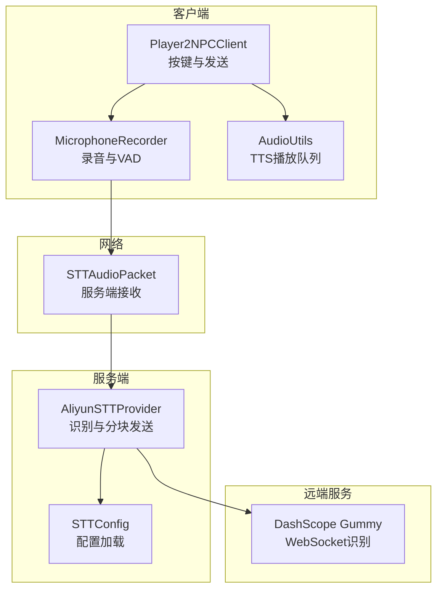
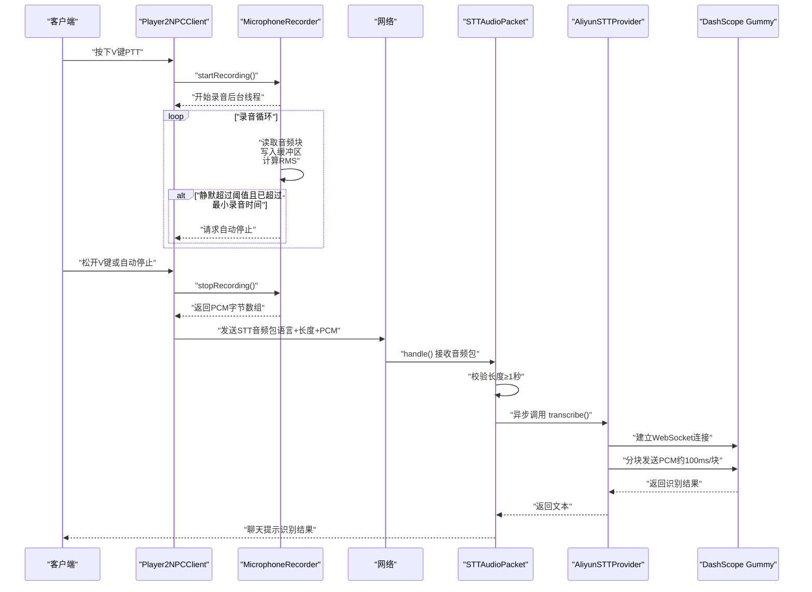
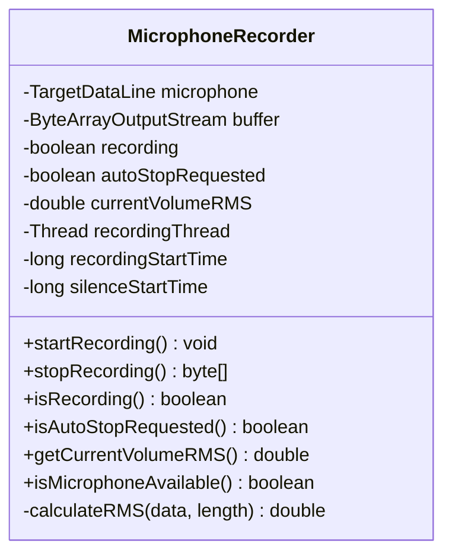
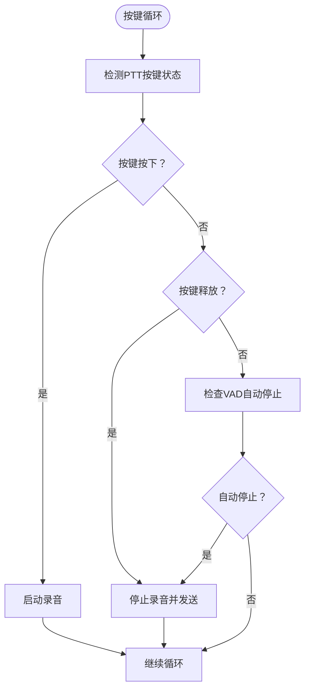
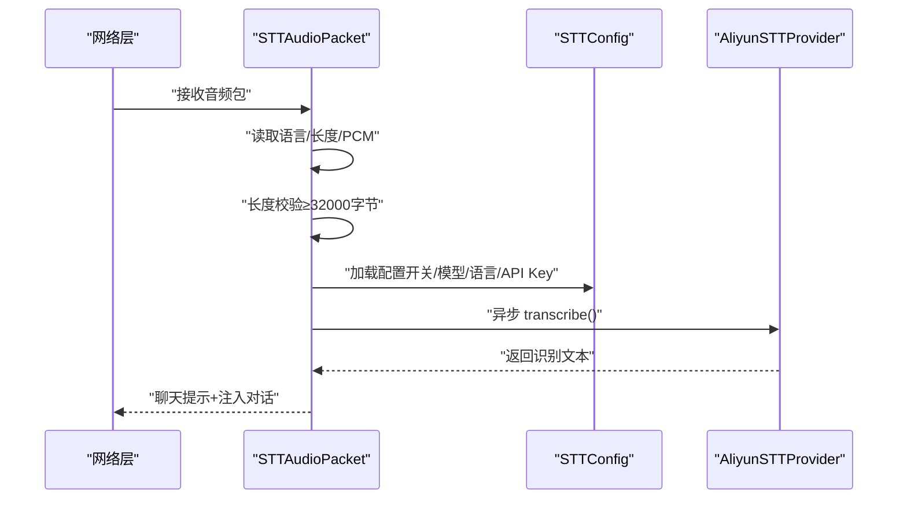
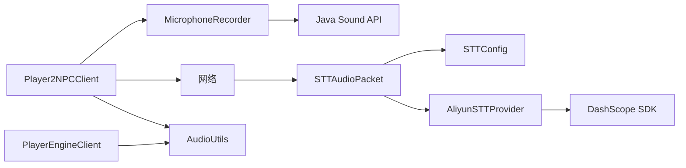

# 音频处理系统

<cite>
**本文引用的文件**
- [MicrophoneRecorder.java](file://src/main/java/com/goodbird/player2npc/client/audio/MicrophoneRecorder.java)
- [Player2NPCClient.java](file://src/main/java/com/goodbird/player2npc/Player2NPCClient.java)
- [STTAudioPacket.java](file://src/main/java/com/goodbird/player2npc/network/STTAudioPacket.java)
- [AliyunSTTProvider.java](file://src/main/java/adris/altoclef/player2api/stt/AliyunSTTProvider.java)
- [STTConfig.java](file://src/main/java/adris/altoclef/player2api/stt/STTConfig.java)
- [AudioUtils.java](file://src/main/java/adris/altoclef/player2api/utils/AudioUtils.java)
- [PlayerEngineClient.java](file://src/main/java/adris/altoclef/PlayerEngineClient.java)
</cite>

## 目录
1. [简介](#简介)
2. [项目结构](#项目结构)
3. [核心组件](#核心组件)
4. [架构总览](#架构总览)
5. [组件详解](#组件详解)
6. [依赖关系分析](#依赖关系分析)
7. [性能考量](#性能考量)
8. [故障排查指南](#故障排查指南)
9. [结论](#结论)
10. [附录](#附录)

## 简介
本技术文档围绕音频处理系统中的 MicrophoneRecorder 麦克风录音器展开，系统性阐述其在 Minecraft 客户端侧的实现机制与工作流程，涵盖以下关键点：
- 音频捕获流程：基于 Java Sound API 的目标数据线（TargetDataLine）进行 PCM 捕获
- PCM 数据处理：实时计算 RMS 音量、缓冲区写入与线程管理
- VAD（Voice Activity Detection）静音检测：基于 RMS 阈值与连续静默时长的自动停止策略
- 音频缓冲区管理：基于 ByteArrayOutputStream 的内存缓冲与安全上限
- 音频采样率与格式：统一采用 16kHz、16bit、Mono（Little-Endian）
- 实时音频流处理：客户端按键触发录音、网络传输、服务端异步识别
- 与 STT 服务集成：通过阿里云 DashScope Gummy 模型进行语音转文本
- 音频质量控制与延迟优化：最小有效时长阈值、分块发送、速率限制与超时控制

## 项目结构
音频处理相关模块主要分布在以下包中：
- 客户端音频采集与按键逻辑：com.goodbird.player2npc.client.audio、com.goodbird.player2npc
- 网络层音频包收发：com.goodbird.player2npc.network
- STT 服务集成：adris.altoclef.player2api.stt
- TTS 播放辅助：adris.altoclef.player2api.utils
- 远程 TTS 流式播放（兼容模式）：adris.altoclef

**图表来源**
- [Player2NPCClient.java:1-164](file://src/main/java/com/goodbird/player2npc/Player2NPCClient.java#L1-164)
- [MicrophoneRecorder.java:1-200](file://src/main/java/com/goodbird/player2npc/client/audio/MicrophoneRecorder.java#L1-200)
- [STTAudioPacket.java:1-134](file://src/main/java/com/goodbird/player2npc/network/STTAudioPacket.java#L1-134)
- [AliyunSTTProvider.java:1-172](file://src/main/java/adris/altoclef/player2api/stt/AliyunSTTProvider.java#L1-172)
- [STTConfig.java:1-78](file://src/main/java/adris/altoclef/player2api/stt/STTConfig.java#L1-78)
- [AudioUtils.java:1-170](file://src/main/java/adris/altoclef/player2api/utils/AudioUtils.java#L1-170)

**章节来源**
- [Player2NPCClient.java:1-164](file://src/main/java/com/goodbird/player2npc/Player2NPCClient.java#L1-164)
- [MicrophoneRecorder.java:1-200](file://src/main/java/com/goodbird/player2npc/client/audio/MicrophoneRecorder.java#L1-200)
- [STTAudioPacket.java:1-134](file://src/main/java/com/goodbird/player2npc/network/STTAudioPacket.java#L1-134)
- [AliyunSTTProvider.java:1-172](file://src/main/java/adris/altoclef/player2api/stt/AliyunSTTProvider.java#L1-172)
- [STTConfig.java:1-78](file://src/main/java/adris/altoclef/player2api/stt/STTConfig.java#L1-78)
- [AudioUtils.java:1-170](file://src/main/java/adris/altoclef/player2api/utils/AudioUtils.java#L1-170)

## 核心组件
- MicrophoneRecorder：负责麦克风 PCM 捕获、缓冲区写入、RMS 计算与 VAD 自动停止、最大录制时长保护
- Player2NPCClient：负责按键事件（PTT）、调用录音器、发送音频包、提示信息
- STTAudioPacket：服务端接收客户端音频包、校验长度、异步触发 STT 并回传结果
- AliyunSTTProvider：封装 DashScope Gummy 识别，支持 PCM/WAV 输入、分块发送、超时与错误处理
- STTConfig：从 LLM 配置中读取 STT 开关、模型、语言与 API Key
- AudioUtils：提供 WAV 播放与队列播放能力（用于 TTS 合成播放）

**章节来源**
- [MicrophoneRecorder.java:1-200](file://src/main/java/com/goodbird/player2npc/client/audio/MicrophoneRecorder.java#L1-200)
- [Player2NPCClient.java:1-164](file://src/main/java/com/goodbird/player2npc/Player2NPCClient.java#L1-164)
- [STTAudioPacket.java:1-134](file://src/main/java/com/goodbird/player2npc/network/STTAudioPacket.java#L1-134)
- [AliyunSTTProvider.java:1-172](file://src/main/java/adris/altoclef/player2api/stt/AliyunSTTProvider.java#L1-172)
- [STTConfig.java:1-78](file://src/main/java/adris/altoclef/player2api/stt/STTConfig.java#L1-78)
- [AudioUtils.java:1-170](file://src/main/java/adris/altoclef/player2api/utils/AudioUtils.java#L1-170)

## 架构总览
下图展示了从按键触发录音到服务端识别并返回结果的整体流程。

**图表来源**
- [Player2NPCClient.java:56-123](file://src/main/java/com/goodbird/player2npc/Player2NPCClient.java#L56-123)
- [MicrophoneRecorder.java:62-121](file://src/main/java/com/goodbird/player2npc/client/audio/MicrophoneRecorder.java#L62-121)
- [STTAudioPacket.java:39-121](file://src/main/java/com/goodbird/player2npc/network/STTAudioPacket.java#L39-121)
- [AliyunSTTProvider.java:47-154](file://src/main/java/adris/altoclef/player2api/stt/AliyunSTTProvider.java#L47-154)

## 组件详解

### MicrophoneRecorder 麦克风录音器
- 音频格式与采样率
  - 使用 16kHz、16bit、Mono、有符号、小端序的 AudioFormat，与 DashScope Gummy 所需格式一致
  - 参考路径：[MicrophoneRecorder.java:24-25](file://src/main/java/com/goodbird/player2npc/client/audio/MicrophoneRecorder.java#L24-L25)
- 录音启动与线程管理
  - 通过 AudioSystem.getTargetDataLine 获取目标数据线并打开
  - 启动后台线程循环读取音频块（约 100ms），写入 ByteArrayOutputStream
  - 参考路径：[MicrophoneRecorder.java:62-121](file://src/main/java/com/goodbird/player2npc/client/audio/MicrophoneRecorder.java#L62-L121)
- VAD 静音检测
  - 计算每个音频块的 RMS 值，当 RMS 小于阈值且持续时间超过静默阈值时，触发自动停止
  - 参考路径：[MicrophoneRecorder.java:86-103](file://src/main/java/com/goodbird/player2npc/client/audio/MicrophoneRecorder.java#L86-L103)
- 缓冲区与最大时长
  - 使用 ByteArrayOutputStream 累积 PCM 数据；超过最大录制时长（60 秒）强制停止
  - 参考路径：[MicrophoneRecorder.java:27-28](file://src/main/java/com/goodbird/player2npc/client/audio/MicrophoneRecorder.java#L27-L28)
- 设备可用性检查
  - 提供静态方法检测当前系统是否可获取指定格式的目标数据线
  - 参考路径：[MicrophoneRecorder.java:49-56](file://src/main/java/com/goodbird/player2npc/client/audio/MicrophoneRecorder.java#L49-L56)
- 关键方法与属性
  - startRecording()/stopRecording()：同步控制录音生命周期
  - isRecording()/isAutoStopRequested()/getCurrentVolumeRMS()：状态查询
  - calculateRMS()：RMS 计算（16bit 小端序样本解析）
  - 参考路径：[MicrophoneRecorder.java:62-199](file://src/main/java/com/goodbird/player2npc/client/audio/MicrophoneRecorder.java#L62-L199)

**图表来源**
- [MicrophoneRecorder.java:1-200](file://src/main/java/com/goodbird/player2npc/client/audio/MicrophoneRecorder.java#L1-200)

**章节来源**
- [MicrophoneRecorder.java:1-200](file://src/main/java/com/goodbird/player2npc/client/audio/MicrophoneRecorder.java#L1-200)

### 客户端按键与发送逻辑（Player2NPCClient）
- PTT 键绑定与按键状态检测
  - 使用 GLFW 原生按键状态检测以避免 KeyMapping 在屏幕切换等场景下的状态重置问题
  - 参考路径：[Player2NPCClient.java:64-144](file://src/main/java/com/goodbird/player2npc/Player2NPCClient.java#L64-L144)
- 录音控制与提示
  - 按下 V 键启动录音；自动停止或松开 V 键后停止录音并发送音频
  - 对短录音（<0.5 秒）给出提示，避免 STT 无效输入
  - 参考路径：[Player2NPCClient.java:72-119](file://src/main/java/com/goodbird/player2npc/Player2NPCClient.java#L72-L119)
- 音频包发送
  - 包含语言标识、PCM 长度与字节数据，发送至服务端
  - 参考路径：[Player2NPCClient.java:150-162](file://src/main/java/com/goodbird/player2npc/Player2NPCClient.java#L150-L162)

**图表来源**
- [Player2NPCClient.java:56-123](file://src/main/java/com/goodbird/player2npc/Player2NPCClient.java#L56-123)

**章节来源**
- [Player2NPCClient.java:1-164](file://src/main/java/com/goodbird/player2npc/Player2NPCClient.java#L1-164)

### 服务端音频包处理（STTAudioPacket）
- 包格式与接收
  - 协议：UTF 语言 + VarInt 长度 + 字节数据
  - 参考路径：[STTAudioPacket.java:19-27](file://src/main/java/com/goodbird/player2npc/network/STTAudioPacket.java#L19-L27)
- 长度校验与提示
  - 最小长度阈值为 1 秒（32000 字节），不足则提示“录音时间太短”
  - 参考路径：[STTAudioPacket.java:32-63](file://src/main/java/com/goodbird/player2npc/network/STTAudioPacket.java#L32-L63)
- 异步识别与注入
  - 加载 STT 配置，异步线程执行识别；完成后将识别结果作为用户消息注入对话系统，并在聊天中提示
  - 参考路径：[STTAudioPacket.java:65-121](file://src/main/java/com/goodbird/player2npc/network/STTAudioPacket.java#L65-L121)

**图表来源**
- [STTAudioPacket.java:39-121](file://src/main/java/com/goodbird/player2npc/network/STTAudioPacket.java#L39-121)
- [STTConfig.java:31-59](file://src/main/java/adris/altoclef/player2api/stt/STTConfig.java#L31-59)
- [AliyunSTTProvider.java:47-154](file://src/main/java/adris/altoclef/player2api/stt/AliyunSTTProvider.java#L47-154)

**章节来源**
- [STTAudioPacket.java:1-134](file://src/main/java/com/goodbird/player2npc/network/STTAudioPacket.java#L1-134)
- [STTConfig.java:1-78](file://src/main/java/adris/altoclef/player2api/stt/STTConfig.java#L1-78)

### STT 服务集成（AliyunSTTProvider）
- 输入格式与参数
  - 支持 PCM 或 WAV（自动剥离 WAV 头部）；格式要求 16kHz、16bit、Mono
  - 参考路径：[AliyunSTTProvider.java:47-107](file://src/main/java/adris/altoclef/player2api/stt/AliyunSTTProvider.java#L47-L107)
- 分块发送与速率限制
  - 每块约 100ms（3200 字节），逐块发送并 sleep 20ms 控制 CPU 占用
  - 参考路径：[AliyunSTTProvider.java:109-127](file://src/main/java/adris/altoclef/player2api/stt/AliyunSTTProvider.java#L109-L127)
- 超时与完成回调
  - 等待识别完成最多 30 秒，超时返回空；异常与完成回调均有处理
  - 参考路径：[AliyunSTTProvider.java:133-154](file://src/main/java/adris/altoclef/player2api/stt/AliyunSTTProvider.java#L133-L154)
- 可用性检查
  - API Key 非空且非占位符才视为可用
  - 参考路径：[AliyunSTTProvider.java:168-170](file://src/main/java/adris/altoclef/player2api/stt/AliyunSTTProvider.java#L168-L170)

**章节来源**
- [AliyunSTTProvider.java:1-172](file://src/main/java/adris/altoclef/player2api/stt/AliyunSTTProvider.java#L1-172)

### TTS 播放辅助（AudioUtils）
- 队列播放
  - 提供 WAV 音频入队与顺序播放，避免重叠播放
  - 参考路径：[AudioUtils.java:49-68](file://src/main/java/adris/altoclef/player2api/utils/AudioUtils.java#L49-L68)
- 直接播放
  - 从字节数组直接播放 WAV，内部通过 AudioSystem 与 SourceDataLine 输出
  - 参考路径：[AudioUtils.java:76-104](file://src/main/java/adris/altoclef/player2api/utils/AudioUtils.java#L76-L104)
- 兼容远程流式播放（player2-remote）
  - 通过 HTTP 调用远端 API 获取 WAV 并播放
  - 参考路径：[AudioUtils.java:110-169](file://src/main/java/adris/altoclef/player2api/utils/AudioUtils.java#L110-L169)

**章节来源**
- [AudioUtils.java:1-170](file://src/main/java/adris/altoclef/player2api/utils/AudioUtils.java#L1-170)
- [PlayerEngineClient.java:36-63](file://src/main/java/adris/altoclef/PlayerEngineClient.java#L36-63)

## 依赖关系分析
- 客户端依赖
  - Player2NPCClient 依赖 MicrophoneRecorder 进行录音控制
  - MicrophoneRecorder 依赖 Java Sound API 的 AudioSystem 与 TargetDataLine
- 网络与服务端
  - STTAudioPacket 依赖 STTConfig 与 AliyunSTTProvider
  - AliyunSTTProvider 依赖 DashScope SDK（WebSocket 识别）
- TTS 播放
  - PlayerEngineClient 注册 TTS 音频包接收，交由 AudioUtils 队列播放

**图表来源**
- [Player2NPCClient.java:1-164](file://src/main/java/com/goodbird/player2npc/Player2NPCClient.java#L1-164)
- [MicrophoneRecorder.java:1-200](file://src/main/java/com/goodbird/player2npc/client/audio/MicrophoneRecorder.java#L1-200)
- [STTAudioPacket.java:1-134](file://src/main/java/com/goodbird/player2npc/network/STTAudioPacket.java#L1-134)
- [STTConfig.java:1-78](file://src/main/java/adris/altoclef/player2api/stt/STTConfig.java#L1-78)
- [AliyunSTTProvider.java:1-172](file://src/main/java/adris/altoclef/player2api/stt/AliyunSTTProvider.java#L1-172)
- [AudioUtils.java:1-170](file://src/main/java/adris/altoclef/player2api/utils/AudioUtils.java#L1-170)
- [PlayerEngineClient.java:36-63](file://src/main/java/adris/altoclef/PlayerEngineClient.java#L36-63)

**章节来源**
- [Player2NPCClient.java:1-164](file://src/main/java/com/goodbird/player2npc/Player2NPCClient.java#L1-164)
- [MicrophoneRecorder.java:1-200](file://src/main/java/com/goodbird/player2npc/client/audio/MicrophoneRecorder.java#L1-200)
- [STTAudioPacket.java:1-134](file://src/main/java/com/goodbird/player2npc/network/STTAudioPacket.java#L1-134)
- [AliyunSTTProvider.java:1-172](file://src/main/java/adris/altoclef/player2api/stt/AliyunSTTProvider.java#L1-172)
- [STTConfig.java:1-78](file://src/main/java/adris/altoclef/player2api/stt/STTConfig.java#L1-78)
- [AudioUtils.java:1-170](file://src/main/java/adris/altoclef/player2api/utils/AudioUtils.java#L1-170)
- [PlayerEngineClient.java:36-63](file://src/main/java/adris/altoclef/PlayerEngineClient.java#L36-63)

## 性能考量
- 采样率与格式
  - 固定 16kHz、16bit、Mono，降低带宽与识别延迟，符合 DashScope Gummy 要求
  - 参考路径：[MicrophoneRecorder.java:24-25](file://src/main/java/com/goodbird/player2npc/client/audio/MicrophoneRecorder.java#L24-L25)
- 分块发送与速率限制
  - 每块约 100ms（3200 字节），sleep 20ms 控制 CPU 占用，兼顾实时性与稳定性
  - 参考路径：[AliyunSTTProvider.java:109-127](file://src/main/java/adris/altoclef/player2api/stt/AliyunSTTProvider.java#L109-L127)
- 超时与最大时长
  - 识别等待最多 30 秒，录音最大时长 60 秒，避免资源泄漏
  - 参考路径：[AliyunSTTProvider.java:133-137](file://src/main/java/adris/altoclef/player2api/stt/AliyunSTTProvider.java#L133-L137)、[MicrophoneRecorder.java:27-28](file://src/main/java/com/goodbird/player2npc/client/audio/MicrophoneRecorder.java#L27-L28)
- 最小有效时长
  - 客户端与服务端均设置最小录音长度（0.5~1 秒），提升识别成功率
  - 参考路径：[Player2NPCClient.java:27-28](file://src/main/java/com/goodbird/player2npc/Player2NPCClient.java#L27-L28)、[STTAudioPacket.java:32-33](file://src/main/java/com/goodbird/player2npc/network/STTAudioPacket.java#L32-L33)

[本节为通用性能建议，不涉及具体文件分析]

## 故障排查指南
- 麦克风不可用
  - 现象：PTT 按下无反应或提示麦克风不可用
  - 排查：确认系统音频设备可用；检查 isMicrophoneAvailable 返回值
  - 参考路径：[MicrophoneRecorder.java:49-56](file://src/main/java/com/goodbird/player2npc/client/audio/MicrophoneRecorder.java#L49-L56)
- 录音过短被拒绝
  - 现象：服务端提示“录音时间太短”，无法识别
  - 排查：确保按住 V 键至少 0.5~1 秒；检查客户端与服务端最小长度阈值
  - 参考路径：[Player2NPCClient.java:87-118](file://src/main/java/com/goodbird/player2npc/Player2NPCClient.java#L87-L118)、[STTAudioPacket.java:57-63](file://src/main/java/com/goodbird/player2npc/network/STTAudioPacket.java#L57-L63)
- STT 未启用或 API Key 未配置
  - 现象：服务端提示“语音识别未启用”或“API Key 未配置”
  - 排查：检查 STTConfig 中 enabled、apiKey、model、language 设置
  - 参考路径：[STTAudioPacket.java:70-81](file://src/main/java/com/goodbird/player2npc/network/STTAudioPacket.java#L70-L81)、[STTConfig.java:31-59](file://src/main/java/adris/altoclef/player2api/stt/STTConfig.java#L31-59)
- 识别超时或失败
  - 现象：识别长时间无响应或返回空结果
  - 排查：检查网络连通性、DashScope WebSocket 地址、识别等待超时设置
  - 参考路径：[AliyunSTTProvider.java:133-154](file://src/main/java/adris/altoclef/player2api/stt/AliyunSTTProvider.java#L133-L154)
- VAD 提前停止导致录音过短
  - 现象：录音被静音检测提前终止
  - 排查：调整 VAD 参数（最小录音时间、静默阈值、RMS 阈值）或提高说话音量
  - 参考路径：[MicrophoneRecorder.java:30-35](file://src/main/java/com/goodbird/player2npc/client/audio/MicrophoneRecorder.java#L30-L35)

**章节来源**
- [MicrophoneRecorder.java:1-200](file://src/main/java/com/goodbird/player2npc/client/audio/MicrophoneRecorder.java#L1-200)
- [Player2NPCClient.java:1-164](file://src/main/java/com/goodbird/player2npc/Player2NPCClient.java#L1-164)
- [STTAudioPacket.java:1-134](file://src/main/java/com/goodbird/player2npc/network/STTAudioPacket.java#L1-134)
- [AliyunSTTProvider.java:1-172](file://src/main/java/adris/altoclef/player2api/stt/AliyunSTTProvider.java#L1-172)
- [STTConfig.java:1-78](file://src/main/java/adris/altoclef/player2api/stt/STTConfig.java#L1-78)

## 结论
本音频处理系统以 MicrophoneRecorder 为核心，结合客户端按键控制、服务端异步识别与 DashScope Gummy 服务，实现了低延迟、高可靠性的语音转文本链路。系统通过严格的格式约束、分块发送、速率限制与超时控制，保证了在不同环境下的稳定性；同时通过最小录音长度阈值与 VAD 策略，提升了识别质量与用户体验。

[本节为总结性内容，不涉及具体文件分析]

## 附录
- 代码示例路径（不展示具体代码内容）
  - Java Sound API 使用与目标数据线打开：[MicrophoneRecorder.java:67-70](file://src/main/java/com/goodbird/player2npc/client/audio/MicrophoneRecorder.java#L67-L70)
  - 录音线程与缓冲区写入：[MicrophoneRecorder.java:79-84](file://src/main/java/com/goodbird/player2npc/client/audio/MicrophoneRecorder.java#L79-L84)
  - RMS 音量计算（16bit 小端序）：[MicrophoneRecorder.java:183-198](file://src/main/java/com/goodbird/player2npc/client/audio/MicrophoneRecorder.java#L183-L198)
  - 客户端按键循环与发送包：[Player2NPCClient.java:56-123](file://src/main/java/com/goodbird/player2npc/Player2NPCClient.java#L56-L123)
  - 服务端接收与异步识别：[STTAudioPacket.java:39-121](file://src/main/java/com/goodbird/player2npc/network/STTAudioPacket.java#L39-L121)
  - STT 分块发送与超时等待：[AliyunSTTProvider.java:109-137](file://src/main/java/adris/altoclef/player2api/stt/AliyunSTTProvider.java#L109-L137)
  - 配置加载与 API Key 回退策略：[STTConfig.java:31-59](file://src/main/java/adris/altoclef/player2api/stt/STTConfig.java#L31-59)
  - WAV 播放与队列播放：[AudioUtils.java:49-104](file://src/main/java/adris/altoclef/player2api/utils/AudioUtils.java#L49-L104)

[本节为附录性内容，不涉及具体文件分析]