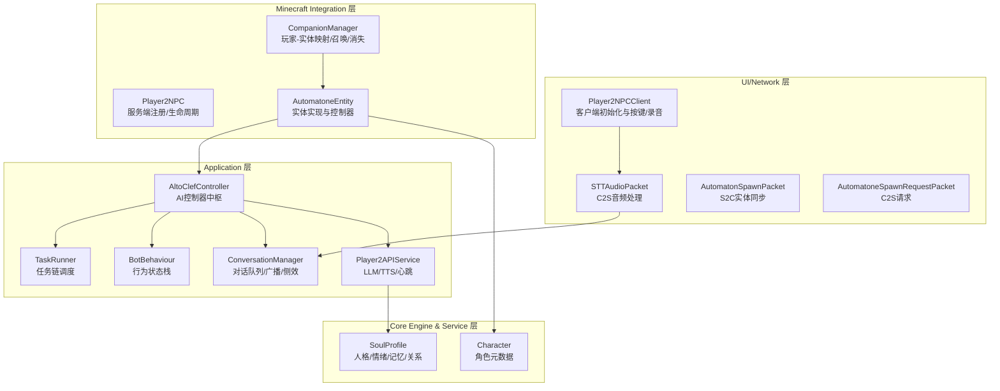
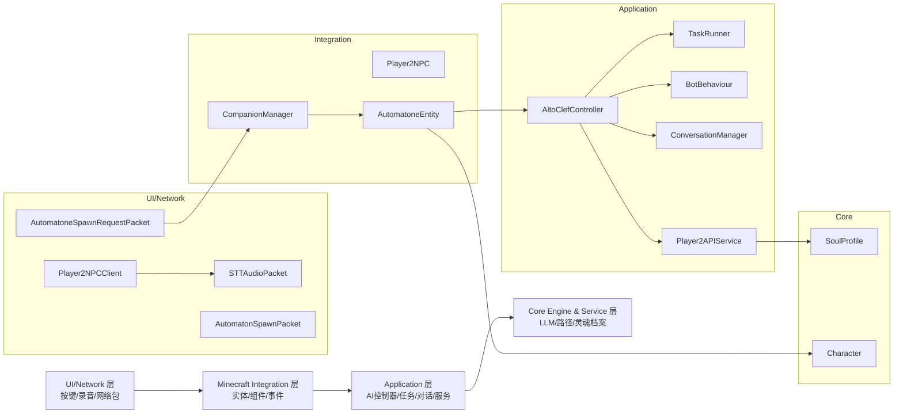
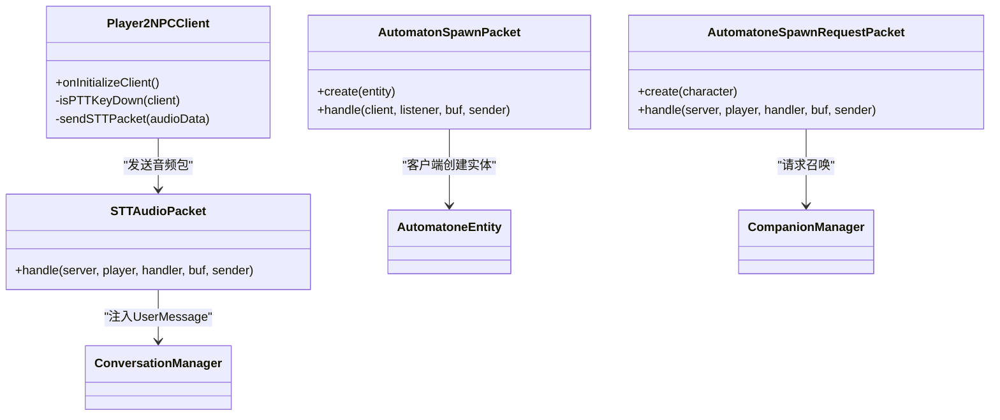
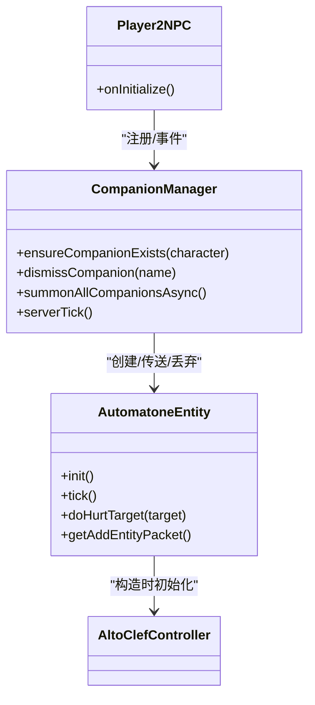
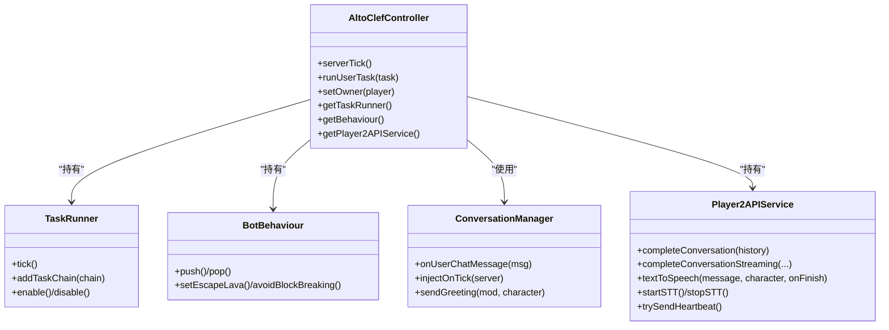
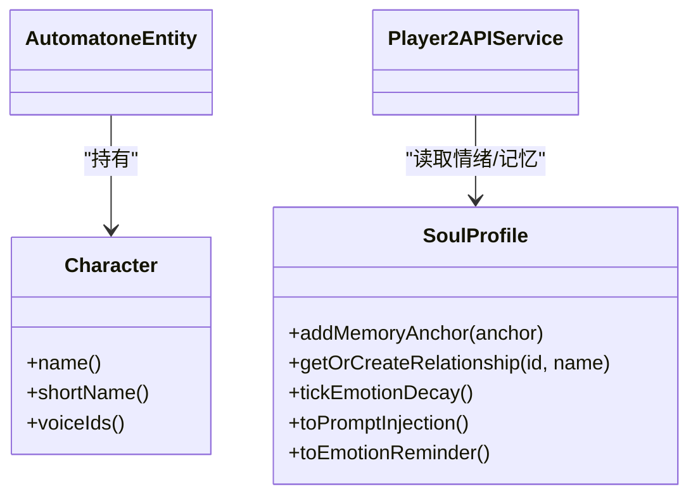
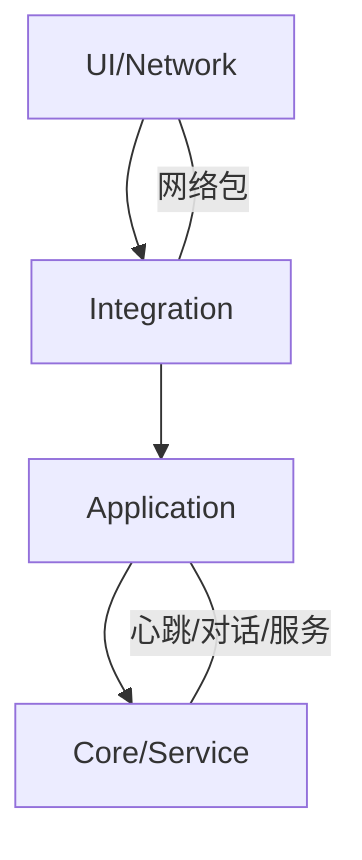

# 四层架构设计

<cite>
**本文引用的文件**
- [Player2NPC.java](file://src/main/java/com/goodbird/player2npc/Player2NPC.java)
- [Player2NPCClient.java](file://src/main/java/com/goodbird/player2npc/Player2NPCClient.java)
- [AutomatoneEntity.java](file://src/main/java/com/goodbird/player2npc/companion/AutomatoneEntity.java)
- [CompanionManager.java](file://src/main/java/com/goodbird/player2npc/companion/CompanionManager.java)
- [AutomatonSpawnPacket.java](file://src/main/java/com/goodbird/player2npc/network/AutomatonSpawnPacket.java)
- [AutomatoneSpawnRequestPacket.java](file://src/main/java/com/goodbird/player2npc/network/AutomatoneSpawnRequestPacket.java)
- [STTAudioPacket.java](file://src/main/java/com/goodbird/player2npc/network/STTAudioPacket.java)
- [AltoClefController.java](file://src/main/java/adris/altoclef/AltoClefController.java)
- [BotBehaviour.java](file://src/main/java/adris/altoclef/BotBehaviour.java)
- [Playground.java](file://src/main/java/adris/altoclef/Playground.java)
- [TaskRunner.java](file://src/main/java/adris/altoclef/tasksystem/TaskRunner.java)
- [Player2APIService.java](file://src/main/java/adris/altoclef/player2api/Player2APIService.java)
- [ConversationManager.java](file://src/main/java/adris/altoclef/player2api/manager/ConversationManager.java)
- [SoulProfile.java](file://src/main/java/adris/altoclef/player2api/soul/SoulProfile.java)
- [Character.java](file://src/main/java/adris/altoclef/player2api/Character.java)
</cite>

## 目录
1. [引言](#引言)
2. [项目结构](#项目结构)
3. [核心组件](#核心组件)
4. [架构总览](#架构总览)
5. [详细组件分析](#详细组件分析)
6. [依赖分析](#依赖分析)
7. [性能考虑](#性能考虑)
8. [故障排查指南](#故障排查指南)
9. [结论](#结论)

## 引言
本设计文档面向“AI NPC系统”，基于仓库现有实现，构建四层架构视角下的完整说明：UI/Network层（用户界面与网络通信）、Minecraft Integration层（Fabric事件与实体管理）、Application层（AI控制器与任务调度）、Core Engine & Service层（LLM服务与路径规划）。文档通过类关系图与序列图展示层间依赖与数据流，帮助开发者快速理解模块职责与协作方式。

## 项目结构
系统采用“Fabric + Baritone”扩展的Mod结构，核心入口位于com.goodbird.player2npc包，AI逻辑与任务系统位于adris.altoclef包，二者通过网络与实体进行集成。

图表来源
- [Player2NPCClient.java:1-164](file://src/main/java/com/goodbird/player2npc/Player2NPCClient.java#L1-L164)
- [STTAudioPacket.java:1-134](file://src/main/java/com/goodbird/player2npc/network/STTAudioPacket.java#L1-L134)
- [AutomatonSpawnPacket.java:1-120](file://src/main/java/com/goodbird/player2npc/network/AutomatonSpawnPacket.java#L1-L120)
- [AutomatoneSpawnRequestPacket.java:1-67](file://src/main/java/com/goodbird/player2npc/network/AutomatoneSpawnRequestPacket.java#L1-L67)
- [Player2NPC.java:1-67](file://src/main/java/com/goodbird/player2npc/Player2NPC.java#L1-L67)
- [AutomatoneEntity.java:1-313](file://src/main/java/com/goodbird/player2npc/companion/AutomatoneEntity.java#L1-L313)
- [CompanionManager.java:1-191](file://src/main/java/com/goodbird/player2npc/companion/CompanionManager.java#L1-L191)
- [AltoClefController.java:1-404](file://src/main/java/adris/altoclef/AltoClefController.java#L1-L404)
- [TaskRunner.java:1-98](file://src/main/java/adris/altoclef/tasksystem/TaskRunner.java#L1-L98)
- [BotBehaviour.java:1-343](file://src/main/java/adris/altoclef/BotBehaviour.java#L1-L343)
- [ConversationManager.java:1-180](file://src/main/java/adris/altoclef/player2api/manager/ConversationManager.java#L1-L180)
- [Player2APIService.java:1-274](file://src/main/java/adris/altoclef/player2api/Player2APIService.java#L1-L274)
- [SoulProfile.java:1-174](file://src/main/java/adris/altoclef/player2api/soul/SoulProfile.java#L1-L174)
- [Character.java:1-22](file://src/main/java/adris/altoclef/player2api/Character.java#L1-L22)

章节来源
- [Player2NPC.java:1-67](file://src/main/java/com/goodbird/player2npc/Player2NPC.java#L1-L67)
- [Player2NPCClient.java:1-164](file://src/main/java/com/goodbird/player2npc/Player2NPCClient.java#L1-L164)
- [AutomatoneEntity.java:1-313](file://src/main/java/com/goodbird/player2npc/companion/AutomatoneEntity.java#L1-L313)
- [CompanionManager.java:1-191](file://src/main/java/com/goodbird/player2npc/companion/CompanionManager.java#L1-L191)
- [AltoClefController.java:1-404](file://src/main/java/adris/altoclef/AltoClefController.java#L1-L404)
- [TaskRunner.java:1-98](file://src/main/java/adris/altoclef/tasksystem/TaskRunner.java#L1-L98)
- [BotBehaviour.java:1-343](file://src/main/java/adris/altoclef/BotBehaviour.java#L1-L343)
- [ConversationManager.java:1-180](file://src/main/java/adris/altoclef/player2api/manager/ConversationManager.java#L1-L180)
- [Player2APIService.java:1-274](file://src/main/java/adris/altoclef/player2api/Player2APIService.java#L1-L274)
- [SoulProfile.java:1-174](file://src/main/java/adris/altoclef/player2api/soul/SoulProfile.java#L1-L174)
- [Character.java:1-22](file://src/main/java/adris/altoclef/player2api/Character.java#L1-L22)

## 核心组件
- UI/Network层
  - 客户端按键绑定与录音：Push-to-Talk触发录音，VAD自动停止，发送STT音频包
  - 服务端网络注册：全局接收Spawn/Despawn/STT音频包
  - 实体同步：服务端生成实体同步包，客户端解析并渲染
- Minecraft Integration层
  - 自动人形实体：实现Baritone接口，封装交互/库存/饥饿管理
  - 全局组件：玩家级同伴管理器，负责召唤/消失/持久化
- Application层
  - AI控制器：统一调度任务链、行为状态、心跳、对话
  - 任务系统：优先级驱动的任务链执行器
  - 行为状态：可压栈/弹栈的行为策略
  - 对话管理：用户消息广播、AI消息传播、侧效执行
  - 服务接口：LLM对话、TTS合成、STT启动/停止、心跳上报
- Core Engine & Service层
  - 灵魂档案：人格矩阵、情绪状态、行为签名、记忆锚点、关系图谱
  - 角色元数据：名称、简介、皮肤、语音ID等

章节来源
- [Player2NPCClient.java:36-124](file://src/main/java/com/goodbird/player2npc/Player2NPCClient.java#L36-L124)
- [Player2NPC.java:48-65](file://src/main/java/com/goodbird/player2npc/Player2NPC.java#L48-L65)
- [AutomatonSpawnPacket.java:26-120](file://src/main/java/com/goodbird/player2npc/network/AutomatonSpawnPacket.java#L26-L120)
- [AutomatoneSpawnRequestPacket.java:24-67](file://src/main/java/com/goodbird/player2npc/network/AutomatoneSpawnRequestPacket.java#L24-L67)
- [AutomatoneEntity.java:50-313](file://src/main/java/com/goodbird/player2npc/companion/AutomatoneEntity.java#L50-L313)
- [CompanionManager.java:28-191](file://src/main/java/com/goodbird/player2npc/companion/CompanionManager.java#L28-L191)
- [AltoClefController.java:53-150](file://src/main/java/adris/altoclef/AltoClefController.java#L53-L150)
- [TaskRunner.java:9-98](file://src/main/java/adris/altoclef/tasksystem/TaskRunner.java#L9-L98)
- [BotBehaviour.java:22-343](file://src/main/java/adris/altoclef/BotBehaviour.java#L22-L343)
- [ConversationManager.java:27-180](file://src/main/java/adris/altoclef/player2api/manager/ConversationManager.java#L27-L180)
- [Player2APIService.java:35-274](file://src/main/java/adris/altoclef/player2api/Player2APIService.java#L35-L274)
- [SoulProfile.java:14-174](file://src/main/java/adris/altoclef/player2api/soul/SoulProfile.java#L14-L174)
- [Character.java:5-22](file://src/main/java/adris/altoclef/player2api/Character.java#L5-L22)

## 架构总览
四层架构以“UI/Network → Integration → Application → Core/Service”的方向传递控制与数据：

图表来源
- [Player2NPCClient.java:1-164](file://src/main/java/com/goodbird/player2npc/Player2NPCClient.java#L1-L164)
- [STTAudioPacket.java:1-134](file://src/main/java/com/goodbird/player2npc/network/STTAudioPacket.java#L1-L134)
- [AutomatonSpawnPacket.java:1-120](file://src/main/java/com/goodbird/player2npc/network/AutomatonSpawnPacket.java#L1-L120)
- [AutomatoneSpawnRequestPacket.java:1-67](file://src/main/java/com/goodbird/player2npc/network/AutomatoneSpawnRequestPacket.java#L1-L67)
- [Player2NPC.java:1-67](file://src/main/java/com/goodbird/player2npc/Player2NPC.java#L1-L67)
- [AutomatoneEntity.java:1-313](file://src/main/java/com/goodbird/player2npc/companion/AutomatoneEntity.java#L1-L313)
- [CompanionManager.java:1-191](file://src/main/java/com/goodbird/player2npc/companion/CompanionManager.java#L1-L191)
- [AltoClefController.java:1-404](file://src/main/java/adris/altoclef/AltoClefController.java#L1-L404)
- [TaskRunner.java:1-98](file://src/main/java/adris/altoclef/tasksystem/TaskRunner.java#L1-L98)
- [BotBehaviour.java:1-343](file://src/main/java/adris/altoclef/BotBehaviour.java#L1-L343)
- [ConversationManager.java:1-180](file://src/main/java/adris/altoclef/player2api/manager/ConversationManager.java#L1-L180)
- [Player2APIService.java:1-274](file://src/main/java/adris/altoclef/player2api/Player2APIService.java#L1-L274)
- [SoulProfile.java:1-174](file://src/main/java/adris/altoclef/player2api/soul/SoulProfile.java#L1-L174)
- [Character.java:1-22](file://src/main/java/adris/altoclef/player2api/Character.java#L1-L22)

## 详细组件分析

### UI/Network层
- 职责边界
  - 客户端：按键绑定、Push-to-Talk录音、VAD检测、最小录音时长校验、发送STT音频包
  - 服务端：注册全局网络处理器，接收STT音频包，异步执行识别，注入用户消息
  - 实体同步：服务端打包实体状态，客户端解包渲染
- 数据流
  - 客户端录音 → 发送字节流 → 服务端解析 → STT识别 → 注入对话系统 → AI响应
- 关键类关系

图表来源
- [Player2NPCClient.java:23-164](file://src/main/java/com/goodbird/player2npc/Player2NPCClient.java#L23-L164)
- [STTAudioPacket.java:28-134](file://src/main/java/com/goodbird/player2npc/network/STTAudioPacket.java#L28-L134)
- [AutomatonSpawnPacket.java:26-120](file://src/main/java/com/goodbird/player2npc/network/AutomatonSpawnPacket.java#L26-L120)
- [AutomatoneSpawnRequestPacket.java:24-67](file://src/main/java/com/goodbird/player2npc/network/AutomatoneSpawnRequestPacket.java#L24-L67)

章节来源
- [Player2NPCClient.java:36-124](file://src/main/java/com/goodbird/player2npc/Player2NPCClient.java#L36-L124)
- [STTAudioPacket.java:39-121](file://src/main/java/com/goodbird/player2npc/network/STTAudioPacket.java#L39-L121)
- [AutomatonSpawnPacket.java:70-120](file://src/main/java/com/goodbird/player2npc/network/AutomatonSpawnPacket.java#L70-L120)
- [AutomatoneSpawnRequestPacket.java:57-65](file://src/main/java/com/goodbird/player2npc/network/AutomatoneSpawnRequestPacket.java#L57-L65)

### Minecraft Integration层
- 职责边界
  - 实体：实现Baritone接口，提供交互/库存/饥饿管理；服务端tick驱动AI控制器
  - 组件：玩家级同伴管理，支持异步拉取角色列表、按需召唤/消失、跨世界定位
- 数据流
  - 玩家连接/断开 → 组件加载 → 拉取角色 → 召唤实体 → 同步至客户端渲染
- 关键类关系

图表来源
- [Player2NPC.java:48-65](file://src/main/java/com/goodbird/player2npc/Player2NPC.java#L48-L65)
- [CompanionManager.java:45-175](file://src/main/java/com/goodbird/player2npc/companion/CompanionManager.java#L45-L175)
- [AutomatoneEntity.java:78-177](file://src/main/java/com/goodbird/player2npc/companion/AutomatoneEntity.java#L78-L177)

章节来源
- [Player2NPC.java:48-65](file://src/main/java/com/goodbird/player2npc/Player2NPC.java#L48-L65)
- [CompanionManager.java:45-175](file://src/main/java/com/goodbird/player2npc/companion/CompanionManager.java#L45-L175)
- [AutomatoneEntity.java:78-177](file://src/main/java/com/goodbird/player2npc/companion/AutomatoneEntity.java#L78-L177)

### Application层
- 职责边界
  - AI控制器：统一调度任务链、行为状态、心跳、对话、输入控制
  - 任务系统：多任务链优先级选择与中断切换
  - 行为状态：可压栈/弹栈的状态机，适配Baritone设置
  - 对话管理：用户消息广播、AI消息传播、侧效执行
  - 服务接口：LLM对话/流式、TTS合成、STT启动/停止、心跳上报
- 数据流
  - 服务端tick → 控制器tick → 任务链tick → 行为状态应用 → Baritone路径/交互
- 关键类关系

图表来源
- [AltoClefController.java:53-150](file://src/main/java/adris/altoclef/AltoClefController.java#L53-L150)
- [TaskRunner.java:22-98](file://src/main/java/adris/altoclef/tasksystem/TaskRunner.java#L22-L98)
- [BotBehaviour.java:187-222](file://src/main/java/adris/altoclef/BotBehaviour.java#L187-L222)
- [ConversationManager.java:99-165](file://src/main/java/adris/altoclef/player2api/manager/ConversationManager.java#L99-L165)
- [Player2APIService.java:48-274](file://src/main/java/adris/altoclef/player2api/Player2APIService.java#L48-L274)

章节来源
- [AltoClefController.java:136-150](file://src/main/java/adris/altoclef/AltoClefController.java#L136-L150)
- [TaskRunner.java:22-98](file://src/main/java/adris/altoclef/tasksystem/TaskRunner.java#L22-L98)
- [BotBehaviour.java:187-222](file://src/main/java/adris/altoclef/BotBehaviour.java#L187-L222)
- [ConversationManager.java:99-165](file://src/main/java/adris/altoclef/player2api/manager/ConversationManager.java#L99-L165)
- [Player2APIService.java:48-274](file://src/main/java/adris/altoclef/player2api/Player2APIService.java#L48-L274)

### Core Engine & Service层
- 职责边界
  - 灵魂档案：承载人格矩阵、情绪状态、行为签名、记忆锚点、关系图谱，支持提示词注入与情绪提醒
  - 角色元数据：角色基础信息与语音ID集合
- 数据流
  - AI控制器持有角色与灵魂档案，随时间衰减情绪，注入系统提示词
- 关键类关系

图表来源
- [SoulProfile.java:33-174](file://src/main/java/adris/altoclef/player2api/soul/SoulProfile.java#L33-L174)
- [Character.java:5-22](file://src/main/java/adris/altoclef/player2api/Character.java#L5-L22)
- [AutomatoneEntity.java:60-90](file://src/main/java/com/goodbird/player2npc/companion/AutomatoneEntity.java#L60-L90)
- [Player2APIService.java:135-155](file://src/main/java/adris/altoclef/player2api/Player2APIService.java#L135-L155)

章节来源
- [SoulProfile.java:33-174](file://src/main/java/adris/altoclef/player2api/soul/SoulProfile.java#L33-L174)
- [Character.java:5-22](file://src/main/java/adris/altoclef/player2api/Character.java#L5-L22)
- [AutomatoneEntity.java:60-90](file://src/main/java/com/goodbird/player2npc/companion/AutomatoneEntity.java#L60-L90)
- [Player2APIService.java:135-155](file://src/main/java/adris/altoclef/player2api/Player2APIService.java#L135-L155)

## 依赖分析
- 层内耦合
  - UI/Network层：客户端按键与录音逻辑与服务端STT处理解耦，通过网络包传递
  - Integration层：实体与组件低耦合，组件负责生命周期与状态持久化
  - Application层：控制器聚合任务链、行为状态、对话与服务，形成高内聚
  - Core层：灵魂档案与角色数据作为只读输入，被服务层读取
- 层间依赖
  - UI/Network → Integration：网络请求触发组件行为
  - Integration → Application：实体创建后由控制器接管
  - Application → Core：控制器读取角色与灵魂档案
- 循环依赖
  - 未发现直接循环依赖；对话管理器通过静态注入在服务端tick中被调用

图表来源
- [Player2NPCClient.java:1-164](file://src/main/java/com/goodbird/player2npc/Player2NPCClient.java#L1-L164)
- [Player2NPC.java:1-67](file://src/main/java/com/goodbird/player2npc/Player2NPC.java#L1-L67)
- [AltoClefController.java:1-404](file://src/main/java/adris/altoclef/AltoClefController.java#L1-L404)
- [Player2APIService.java:1-274](file://src/main/java/adris/altoclef/player2api/Player2APIService.java#L1-L274)

章节来源
- [Player2NPC.java:48-65](file://src/main/java/com/goodbird/player2npc/Player2NPC.java#L48-L65)
- [AltoClefController.java:156-158](file://src/main/java/adris/altoclef/AltoClefController.java#L156-L158)
- [Player2APIService.java:258-273](file://src/main/java/adris/altoclef/player2api/Player2APIService.java#L258-L273)

## 性能考虑
- 网络与I/O
  - STT音频包最小长度阈值避免无效请求；异步线程处理识别，避免阻塞服务器线程
  - 音频合成通过服务端打包发送，客户端按需播放
- Tick与调度
  - 服务端tick统一驱动AI控制器；任务链按优先级选择，减少无效计算
  - 行为状态栈支持快速切换，降低重复初始化成本
- 内存与持久化
  - 记忆锚点数量上限与定期清理，防止内存膨胀
  - 组件持久化存储实体映射，跨世界查找实体

## 故障排查指南
- 录音与STT
  - 录音时长过短：客户端会提示时长不足；服务端拒绝小于阈值的音频
  - API Key未配置：服务端记录警告并提示未启用或不可用
- 实体与同步
  - 实体未显示：检查实体同步包字段与客户端创建流程
  - 召唤失败：确认角色列表拉取成功与玩家在线状态
- 对话与侧效
  - 无响应：检查对话队列是否被锁定、距离过滤条件、广播关键字
  - 心跳异常：确认心跳间隔与服务端健康接口可用性

章节来源
- [Player2NPCClient.java:87-118](file://src/main/java/com/goodbird/player2npc/Player2NPCClient.java#L87-L118)
- [STTAudioPacket.java:57-121](file://src/main/java/com/goodbird/player2npc/network/STTAudioPacket.java#L57-L121)
- [AutomatonSpawnPacket.java:100-120](file://src/main/java/com/goodbird/player2npc/network/AutomatonSpawnPacket.java#L100-L120)
- [CompanionManager.java:45-98](file://src/main/java/com/goodbird/player2npc/companion/CompanionManager.java#L45-L98)
- [ConversationManager.java:99-165](file://src/main/java/adris/altoclef/player2api/manager/ConversationManager.java#L99-L165)
- [Player2APIService.java:258-273](file://src/main/java/adris/altoclef/player2api/Player2APIService.java#L258-L273)

## 结论
本四层架构清晰划分了UI/Network、Integration、Application与Core/Service的职责，通过网络包与实体组件实现松耦合集成，借助AI控制器与任务系统完成高层决策与执行，结合LLM与灵魂档案实现具备情感与记忆的NPC行为。建议后续在以下方面持续演进：对话锁机制的显式化、任务链优先级策略的可视化配置、TTS/STT的本地化与云端双栈能力增强、以及对Baritone设置的动态热更新与回滚。