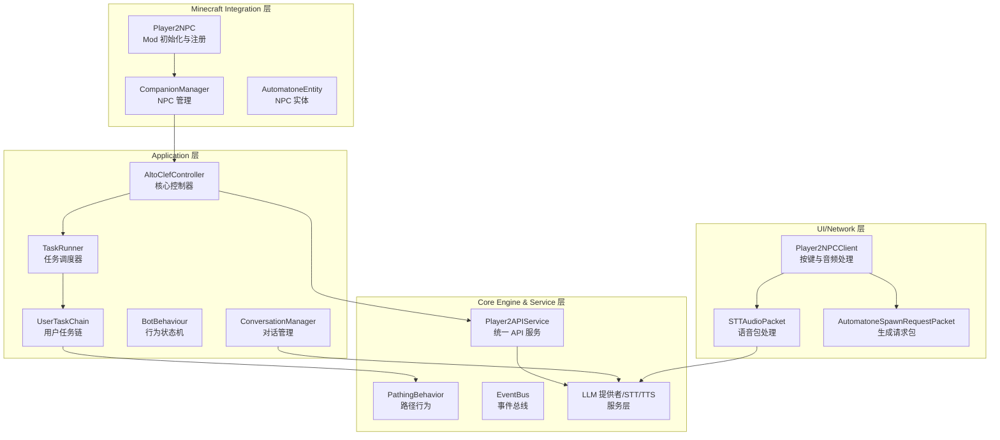
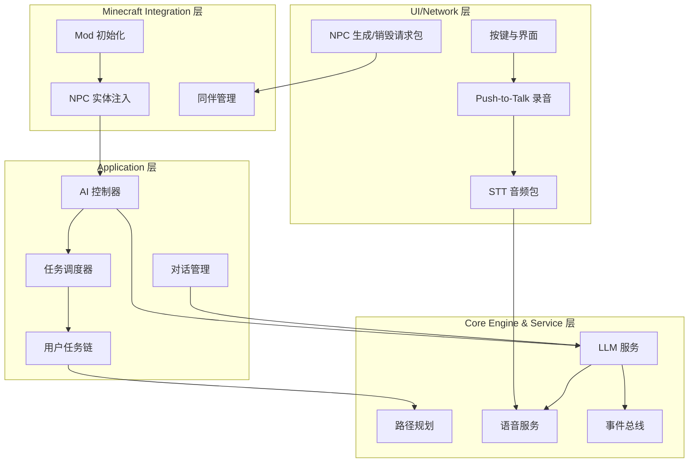
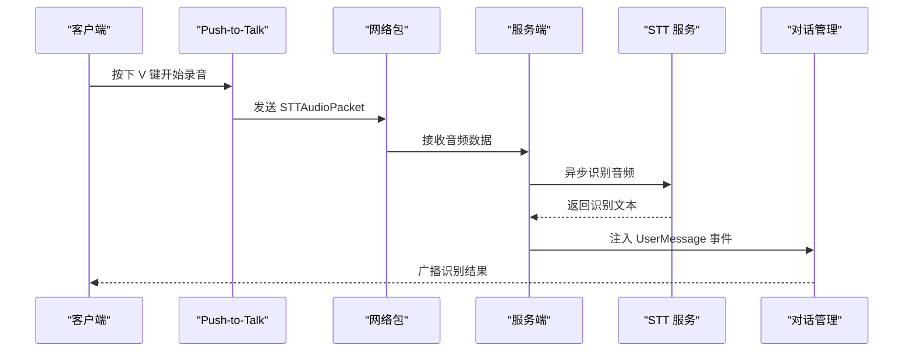
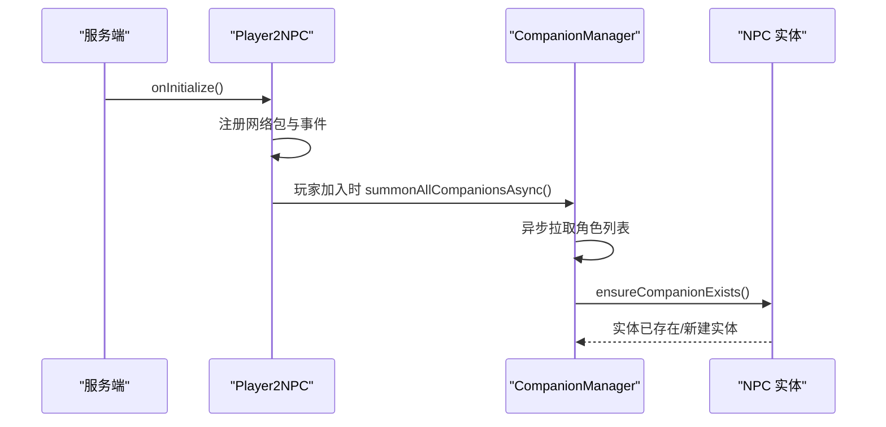
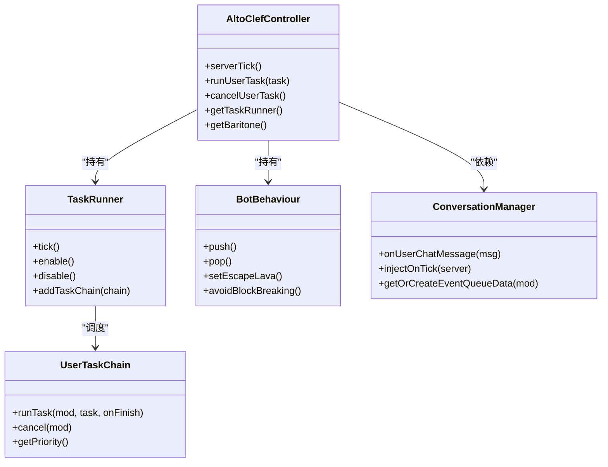
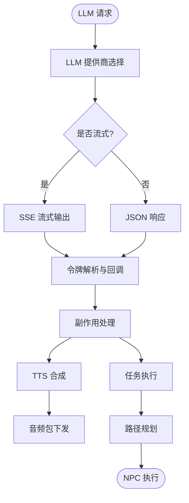
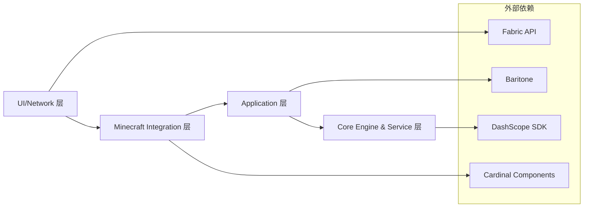

# 整体架构概览

<cite>
**本文档引用的文件**
- [Player2NPC.java](file://src/main/java/com/goodbird/player2npc/Player2NPC.java)
- [Player2NPCClient.java](file://src/main/java/com/goodbird/player2npc/Player2NPCClient.java)
- [AltoClefController.java](file://src/main/java/adris/altoclef/AltoClefController.java)
- [BotBehaviour.java](file://src/main/java/adris/altoclef/BotBehaviour.java)
- [TaskRunner.java](file://src/main/java/adris/altoclef/tasksystem/TaskRunner.java)
- [UserTaskChain.java](file://src/main/java/adris/altoclef/chains/UserTaskChain.java)
- [Player2APIService.java](file://src/main/java/adris/altoclef/player2api/Player2APIService.java)
- [ConversationManager.java](file://src/main/java/adris/altoclef/player2api/manager/ConversationManager.java)
- [STTAudioPacket.java](file://src/main/java/com/goodbird/player2npc/network/STTAudioPacket.java)
- [AutomatoneSpawnRequestPacket.java](file://src/main/java/com/goodbird/player2npc/network/AutomatoneSpawnRequestPacket.java)
- [CompanionManager.java](file://src/main/java/com/goodbird/player2npc/companion/CompanionManager.java)
- [PathingBehavior.java](file://src/main/java/baritone/behavior/PathingBehavior.java)
- [EventBus.java](file://src/main/java/adris/altoclef/eventbus/EventBus.java)
- [fabric.mod.json](file://src/main/resources/fabric.mod.json)
- [AI_NPC项目整体架构概览.md](file://docs/AI_NPC项目整体架构概览.md)
</cite>

## 目录
1. [简介](#简介)
2. [项目结构](#项目结构)
3. [核心组件](#核心组件)
4. [架构总览](#架构总览)
5. [详细组件分析](#详细组件分析)
6. [依赖关系分析](#依赖关系分析)
7. [性能考量](#性能考量)
8. [故障排查指南](#故障排查指南)
9. [结论](#结论)
10. [附录](#附录)

## 简介
本项目是一个基于 Minecraft 1.20.1 Fabric 的 LLM 驱动智能 NPC 伙伴系统，采用四层分层架构设计，自上而下分别为：UI/Network 层、Minecraft Integration 层、Application 层、Core Engine & Service 层。系统通过 Fabric 网络包与事件机制实现层间解耦，采用事件驱动与异步处理提升响应性与稳定性；同时结合 Baritone 路径规划引擎与 AltoClef AI 任务系统，实现 NPC 的自然对话、复杂任务执行与智能导航。

## 项目结构
项目源码位于 `src/main/java/`，按功能域划分为三大包：
- `adris/altoclef/`：AI 任务执行系统与核心控制器
- `baritone/`：路径规划引擎
- `com/goodbird/player2npc/`：Player2NPC 集成层（实体、网络、客户端）

图表来源
- [Player2NPCClient.java:1-164](file://src/main/java/com/goodbird/player2npc/Player2NPCClient.java#L1-L164)
- [STTAudioPacket.java:1-134](file://src/main/java/com/goodbird/player2npc/network/STTAudioPacket.java#L1-L134)
- [AutomatoneSpawnRequestPacket.java:1-67](file://src/main/java/com/goodbird/player2npc/network/AutomatoneSpawnRequestPacket.java#L1-L67)
- [Player2NPC.java:1-67](file://src/main/java/com/goodbird/player2npc/Player2NPC.java#L1-L67)
- [CompanionManager.java:1-191](file://src/main/java/com/goodbird/player2npc/companion/CompanionManager.java#L1-L191)
- [AltoClefController.java:1-404](file://src/main/java/adris/altoclef/AltoClefController.java#L1-L404)
- [TaskRunner.java:1-98](file://src/main/java/adris/altoclef/tasksystem/TaskRunner.java#L1-L98)
- [UserTaskChain.java:1-223](file://src/main/java/adris/altoclef/chains/UserTaskChain.java#L1-L223)
- [BotBehaviour.java:1-343](file://src/main/java/adris/altoclef/BotBehaviour.java#L1-L343)
- [ConversationManager.java:1-180](file://src/main/java/adris/altoclef/player2api/manager/ConversationManager.java#L1-L180)
- [Player2APIService.java:1-274](file://src/main/java/adris/altoclef/player2api/Player2APIService.java#L1-L274)
- [PathingBehavior.java:1-526](file://src/main/java/baritone/behavior/PathingBehavior.java#L1-L526)
- [EventBus.java:1-69](file://src/main/java/adris/altoclef/eventbus/EventBus.java#L1-L69)

章节来源
- [AI_NPC项目整体架构概览.md:61-92](file://docs/AI_NPC项目整体架构概览.md#L61-L92)

## 核心组件
- UI/Network 层：负责用户交互与网络通信，包含按键绑定、Push-to-Talk 录音、STT 音频包发送、NPC 生成/销毁请求包处理。
- Minecraft Integration 层：负责 Mod 生命周期事件监听、NPC 实体注入与管理、玩家连接断开时的同伴处理。
- Application 层：负责 AI 行为编排与任务执行，包含控制器、任务调度器、用户任务链、行为状态机与对话管理。
- Core Engine & Service 层：提供 LLM 推理、路径规划、语音合成与识别等核心能力，以及事件总线与服务注册。

章节来源
- [AI_NPC项目整体架构概览.md:94-281](file://docs/AI_NPC项目整体架构概览.md#L94-L281)

## 架构总览
系统采用四层分层架构，强调层间解耦与接口隔离：
- UI/Network 层：通过 Fabric 网络包协议与服务端通信，负责用户输入与语音数据的采集与转发。
- Minecraft Integration 层：监听 Fabric 生命周期事件，将 NPC 实体注入世界并与玩家建立关联。
- Application 层：调度 AI 行为链，处理指令执行与对话管理，协调任务系统与路径规划。
- Core Engine & Service 层：提供 LLM、STT、TTS、路径规划等基础能力，支持多提供商策略与事件驱动。

图表来源
- [Player2NPCClient.java:36-124](file://src/main/java/com/goodbird/player2npc/Player2NPCClient.java#L36-L124)
- [STTAudioPacket.java:39-121](file://src/main/java/com/goodbird/player2npc/network/STTAudioPacket.java#L39-L121)
- [AutomatoneSpawnRequestPacket.java:57-65](file://src/main/java/com/goodbird/player2npc/network/AutomatoneSpawnRequestPacket.java#L57-L65)
- [Player2NPC.java:48-65](file://src/main/java/com/goodbird/player2npc/Player2NPC.java#L48-L65)
- [CompanionManager.java:100-129](file://src/main/java/com/goodbird/player2npc/companion/CompanionManager.java#L100-L129)
- [AltoClefController.java:136-150](file://src/main/java/adris/altoclef/AltoClefController.java#L136-L150)
- [TaskRunner.java:22-58](file://src/main/java/adris/altoclef/tasksystem/TaskRunner.java#L22-L58)
- [UserTaskChain.java:133-168](file://src/main/java/adris/altoclef/chains/UserTaskChain.java#L133-L168)
- [Player2APIService.java:48-118](file://src/main/java/adris/altoclef/player2api/Player2APIService.java#L48-L118)
- [PathingBehavior.java:67-74](file://src/main/java/baritone/behavior/PathingBehavior.java#L67-L74)
- [EventBus.java:14-42](file://src/main/java/adris/altoclef/eventbus/EventBus.java#L14-L42)

章节来源
- [AI_NPC项目整体架构概览.md:61-92](file://docs/AI_NPC项目整体架构概览.md#L61-L92)

## 详细组件分析

### UI/Network 层
- Player2NPCClient：负责按键绑定（打开角色界面、Push-to-Talk）、麦克风录音与 VAD、STT 音频包发送。
- STTAudioPacket：服务端接收客户端音频包，进行长度校验与异步 STT 识别，将结果注入对话系统。
- AutomatoneSpawnRequestPacket：客户端请求生成 NPC，服务端解析角色数据并调用同伴管理器确保实体存在。

图表来源
- [Player2NPCClient.java:68-122](file://src/main/java/com/goodbird/player2npc/Player2NPCClient.java#L68-L122)
- [STTAudioPacket.java:39-121](file://src/main/java/com/goodbird/player2npc/network/STTAudioPacket.java#L39-L121)
- [ConversationManager.java:99-114](file://src/main/java/adris/altoclef/player2api/manager/ConversationManager.java#L99-L114)

章节来源
- [Player2NPCClient.java:1-164](file://src/main/java/com/goodbird/player2npc/Player2NPCClient.java#L1-L164)
- [STTAudioPacket.java:1-134](file://src/main/java/com/goodbird/player2npc/network/STTAudioPacket.java#L1-L134)
- [AutomatoneSpawnRequestPacket.java:1-67](file://src/main/java/com/goodbird/player2npc/network/AutomatoneSpawnRequestPacket.java#L1-L67)

### Minecraft Integration 层
- Player2NPC：Mod 初始化入口，注册实体类型、网络包处理器与生命周期事件（连接/断开、服务器 tick）。
- CompanionManager：基于 Cardinal Components API 的组件，管理玩家的 NPC 同伴，支持异步召唤与消失。

图表来源
- [Player2NPC.java:48-65](file://src/main/java/com/goodbird/player2npc/Player2NPC.java#L48-L65)
- [CompanionManager.java:45-98](file://src/main/java/com/goodbird/player2npc/companion/CompanionManager.java#L45-L98)
- [CompanionManager.java:100-129](file://src/main/java/com/goodbird/player2npc/companion/CompanionManager.java#L100-L129)

章节来源
- [Player2NPC.java:1-67](file://src/main/java/com/goodbird/player2npc/Player2NPC.java#L1-L67)
- [CompanionManager.java:1-191](file://src/main/java/com/goodbird/player2npc/companion/CompanionManager.java#L1-L191)

### Application 层
- AltoClefController：核心控制器，持有任务系统、行为链、追踪器、输入控制等组件，每 tick 调度执行。
- TaskRunner：按优先级选择最高优先级的活动链执行，支持链切换与中断。
- UserTaskChain：用户任务链，优先级最高，承载 LLM 生成的任务，具备距离监控与自动返回逻辑。
- BotBehaviour：行为状态机，通过状态栈管理路径规划参数（如避障、工具使用、水下行走等）。
- ConversationManager：全局对话调度中心，监听聊天事件，按距离与关键字分发到对应 NPC 的事件队列。

图表来源
- [AltoClefController.java:53-150](file://src/main/java/adris/altoclef/AltoClefController.java#L53-L150)
- [TaskRunner.java:9-98](file://src/main/java/adris/altoclef/tasksystem/TaskRunner.java#L9-L98)
- [UserTaskChain.java:14-223](file://src/main/java/adris/altoclef/chains/UserTaskChain.java#L14-L223)
- [BotBehaviour.java:22-343](file://src/main/java/adris/altoclef/BotBehaviour.java#L22-L343)
- [ConversationManager.java:27-180](file://src/main/java/adris/altoclef/player2api/manager/ConversationManager.java#L27-L180)

章节来源
- [AltoClefController.java:1-404](file://src/main/java/adris/altoclef/AltoClefController.java#L1-L404)
- [TaskRunner.java:1-98](file://src/main/java/adris/altoclef/tasksystem/TaskRunner.java#L1-L98)
- [UserTaskChain.java:1-223](file://src/main/java/adris/altoclef/chains/UserTaskChain.java#L1-L223)
- [BotBehaviour.java:1-343](file://src/main/java/adris/altoclef/BotBehaviour.java#L1-L343)
- [ConversationManager.java:1-180](file://src/main/java/adris/altoclef/player2api/manager/ConversationManager.java#L1-L180)

### Core Engine & Service 层
- Player2APIService：统一 API 服务入口，封装 LLM、TTS、STT 调用，支持多种提供商与流式响应。
- PathingBehavior：路径行为核心，负责 A* 寻路计算、路径执行与动态重算，支持异步计算与预计算。
- EventBus：轻量事件总线，支持订阅/发布与安全遍历，用于内部事件传递。

图表来源
- [Player2APIService.java:109-118](file://src/main/java/adris/altoclef/player2api/Player2APIService.java#L109-L118)
- [Player2APIService.java:120-231](file://src/main/java/adris/altoclef/player2api/Player2APIService.java#L120-L231)
- [PathingBehavior.java:404-502](file://src/main/java/baritone/behavior/PathingBehavior.java#L404-L502)
- [EventBus.java:14-68](file://src/main/java/adris/altoclef/eventbus/EventBus.java#L14-L68)

章节来源
- [Player2APIService.java:1-274](file://src/main/java/adris/altoclef/player2api/Player2APIService.java#L1-L274)
- [PathingBehavior.java:1-526](file://src/main/java/baritone/behavior/PathingBehavior.java#L1-L526)
- [EventBus.java:1-69](file://src/main/java/adris/altoclef/eventbus/EventBus.java#L1-L69)

## 依赖关系分析
- 层间依赖：UI/Network 层依赖 Minecraft Integration 层提供的实体与网络能力；Integration 层依赖 Application 层的控制器与任务系统；Application 层依赖 Core Engine 层的服务能力。
- 组件耦合：AltoClefController 作为中枢，聚合多个子系统；UserTaskChain 与 TaskRunner 通过优先级机制解耦；ConversationManager 通过事件队列实现 NPC 间的解耦。
- 外部依赖：Fabric API、Cardinal Components、Baritone、DashScope SDK 等。

图表来源
- [fabric.mod.json:17-46](file://src/main/resources/fabric.mod.json#L17-L46)
- [AltoClefController.java:136-150](file://src/main/java/adris/altoclef/AltoClefController.java#L136-L150)
- [Player2APIService.java:48-118](file://src/main/java/adris/altoclef/player2api/Player2APIService.java#L48-L118)

章节来源
- [fabric.mod.json:1-48](file://src/main/resources/fabric.mod.json#L1-48)
- [AI_NPC项目整体架构概览.md:61-92](file://docs/AI_NPC项目整体架构概览.md#L61-L92)

## 性能考量
- 异步处理：LLM 与 TTS 通过独立线程池异步执行，避免阻塞服务器 tick。
- 路径规划：A* 寻路在独立线程中计算，支持路径预计算与拼接，减少主线程压力。
- 事件驱动：对话系统通过事件队列与锁机制避免并发冲突，降低 CPU 占用。
- 资源管理：CompanionManager 使用异步拉取与实体复用，减少频繁创建销毁带来的开销。

## 故障排查指南
- STT 识别失败：检查音频长度阈值、API Key 配置与服务可用性；确认服务端日志中的错误提示。
- NPC 不出现：检查玩家连接事件与同伴管理器的异步召唤流程；确认角色列表拉取是否成功。
- 对话不生效：检查对话管理器的聊天事件订阅、距离过滤与关键字广播逻辑。
- 路径规划异常：查看路径行为的日志与事件队列，确认目标设定与计算上下文是否正确。

章节来源
- [STTAudioPacket.java:66-121](file://src/main/java/com/goodbird/player2npc/network/STTAudioPacket.java#L66-L121)
- [CompanionManager.java:45-98](file://src/main/java/com/goodbird/player2npc/companion/CompanionManager.java#L45-L98)
- [ConversationManager.java:98-114](file://src/main/java/adris/altoclef/player2api/manager/ConversationManager.java#L98-L114)
- [PathingBehavior.java:67-74](file://src/main/java/baritone/behavior/PathingBehavior.java#L67-L74)

## 结论
本系统通过四层分层架构实现了清晰的职责划分与良好的层间解耦，结合事件驱动与异步处理机制，在保证响应性的同时提升了系统的可维护性与扩展性。UI/Network 层与 Minecraft Integration 层负责用户交互与实体管理，Application 层承担 AI 行为编排与任务执行，Core Engine & Service 层提供 LLM、路径规划与语音服务等核心能力。整体设计兼顾技术可行性与用户体验，为后续功能扩展奠定了坚实基础。

## 附录
- 架构设计模式：策略模式（LLM 提供商）、观察者模式（事件驱动对话）、责任链模式（行为链）、异步处理模式（LLM/TTS）。
- 数据流与控制流：从用户输入到 NPC 执行的完整链路，涵盖 STT、对话管理、LLM 推理、副作用处理、任务执行与路径规划。

章节来源
- [AI_NPC项目整体架构概览.md:284-401](file://docs/AI_NPC项目整体架构概览.md#L284-L401)
- [AI_NPC项目整体架构概览.md:701-774](file://docs/AI_NPC项目整体架构概览.md#L701-L774)