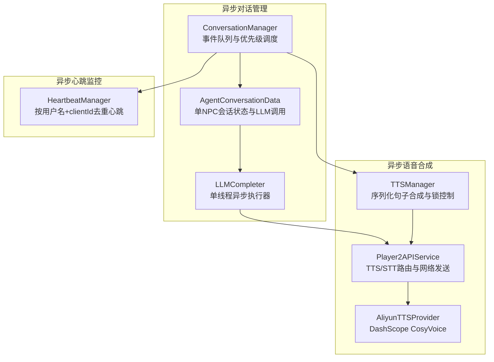
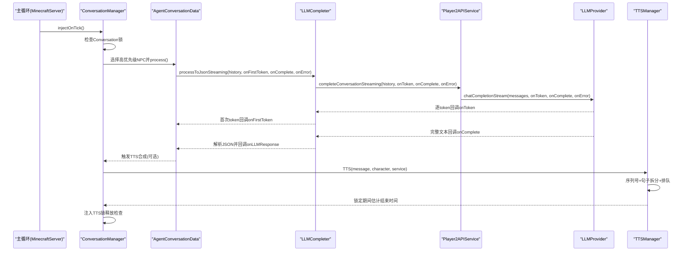
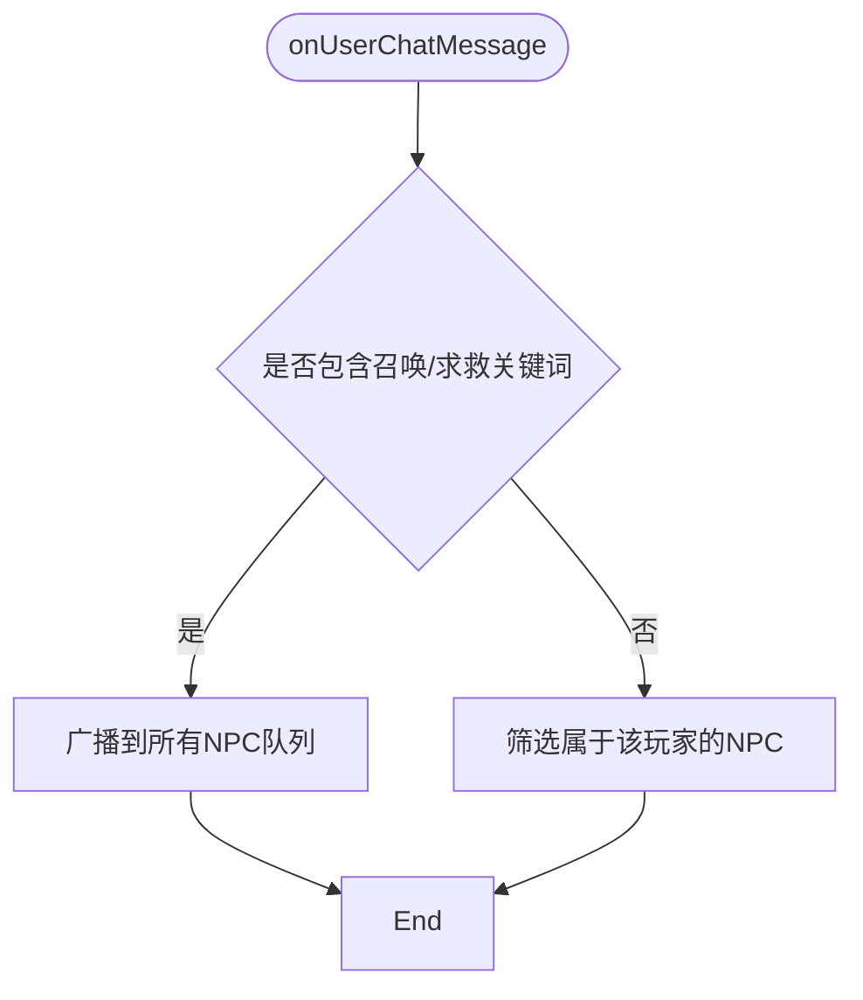
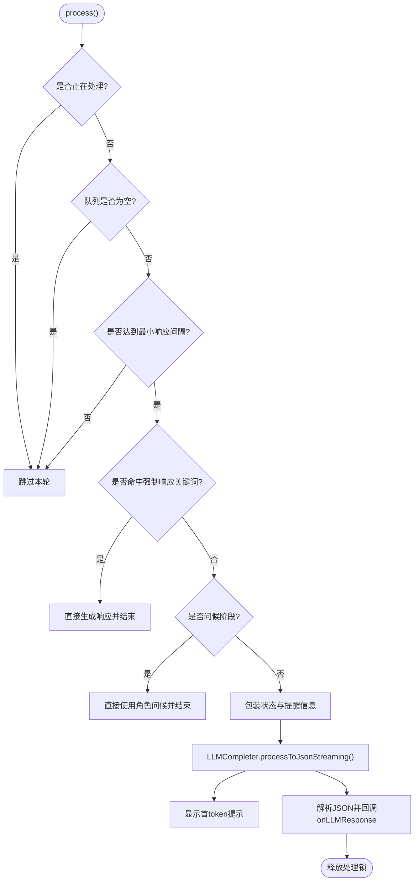
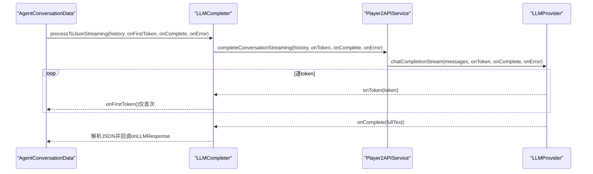
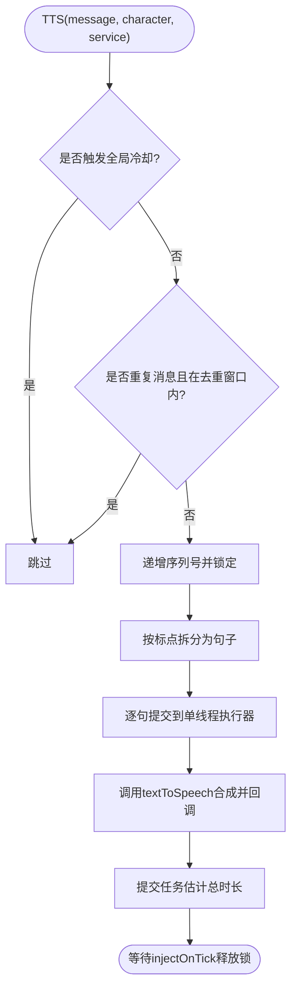
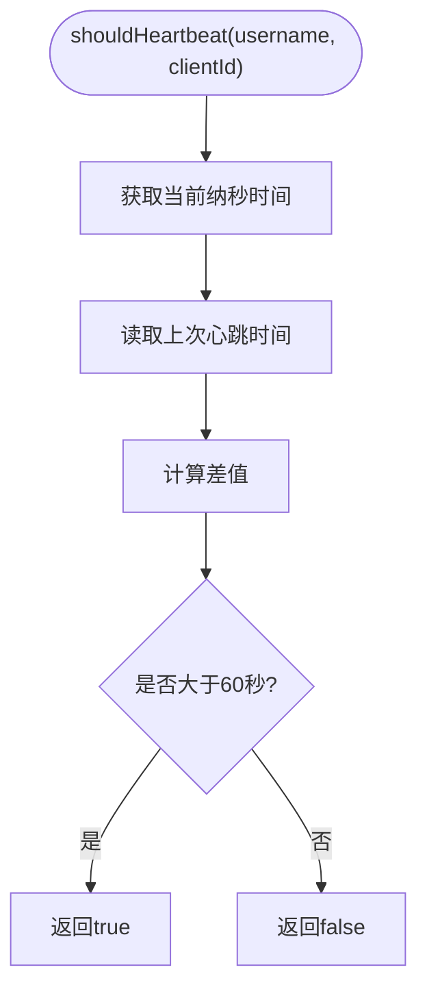
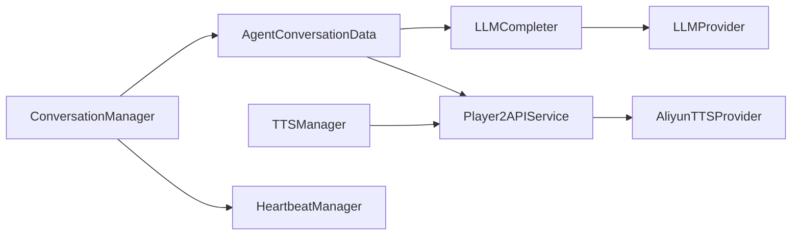

# 异步处理模式

<cite>
**本文引用的文件列表**
- [ConversationManager.java](file://src/main/java/adris/altoclef/player2api/manager/ConversationManager.java)
- [TTSManager.java](file://src/main/java/adris/altoclef/player2api/manager/TTSManager.java)
- [HeartbeatManager.java](file://src/main/java/adris/altoclef/player2api/manager/HeartbeatManager.java)
- [LLMProvider.java](file://src/main/java/adris/altoclef/player2api/llm/LLMProvider.java)
- [LLMCompleter.java](file://src/main/java/adris/altoclef/player2api/LLMCompleter.java)
- [AgentConversationData.java](file://src/main/java/adris/altoclef/player2api/AgentConversationData.java)
- [Player2APIService.java](file://src/main/java/adris/altoclef/player2api/Player2APIService.java)
- [Player2HTTPUtils.java](file://src/main/java/adris/altoclef/player2api/utils/Player2HTTPUtils.java)
- [AliyunTTSProvider.java](file://src/main/java/adris/altoclef/player2api/tts/AliyunTTSProvider.java)
- [AliyunSTTProvider.java](file://src/main/java/adris/altoclef/player2api/stt/AliyunSTTProvider.java)
</cite>

## 目录
1. [简介](#简介)
2. [项目结构与异步模块定位](#项目结构与异步模块定位)
3. [核心组件与职责](#核心组件与职责)
4. [架构总览](#架构总览)
5. [关键组件深度解析](#关键组件深度解析)
6. [依赖关系与耦合分析](#依赖关系与耦合分析)
7. [性能与并发特性](#性能与并发特性)
8. [故障排查与错误处理](#故障排查与错误处理)
9. [最佳实践与调试技巧](#最佳实践与调试技巧)
10. [结论](#结论)

## 简介
本文件聚焦于AI NPC系统中的异步处理模式，系统通过异步方式处理LLM调用、TTS语音合成与心跳检测等耗时操作，避免阻塞主游戏线程，提升交互流畅度与系统响应性。本文将从架构、数据流、处理逻辑、时序图、错误与超时管理、并发安全与调试技巧等方面进行系统化阐述，并给出面向游戏开发者的实践建议。

## 项目结构与异步模块定位
- 异步对话管理：ConversationManager + AgentConversationData + LLMCompleter
- 异步语音合成：TTSManager + Player2APIService + AliyunTTSProvider
- 异步心跳监控：HeartbeatManager
- 流式LLM响应：LLMProvider接口及其实现（通过Player2APIService路由至具体Provider）

图表来源
- [ConversationManager.java:115-191](file://src/main/java/adris/altoclef/player2api/manager/ConversationManager.java#L115-L191)
- [AgentConversationData.java:109-272](file://src/main/java/adris/altoclef/player2api/AgentConversationData.java#L109-L272)
- [LLMCompleter.java:24-94](file://src/main/java/adris/altoclef/player2api/LLMCompleter.java#L24-L94)
- [TTSManager.java:94-153](file://src/main/java/adris/altoclef/player2api/manager/TTSManager.java#L94-L153)
- [Player2APIService.java:120-231](file://src/main/java/adris/altoclef/player2api/Player2APIService.java#L120-L231)
- [AliyunTTSProvider.java:50-104](file://src/main/java/adris/altoclef/player2api/tts/AliyunTTSProvider.java#L50-L104)
- [HeartbeatManager.java:30-41](file://src/main/java/adris/altoclef/player2api/manager/HeartbeatManager.java#L30-L41)

章节来源
- [ConversationManager.java:115-191](file://src/main/java/adris/altoclef/player2api/manager/ConversationManager.java#L115-L191)
- [AgentConversationData.java:109-272](file://src/main/java/adris/altoclef/player2api/AgentConversationData.java#L109-L272)
- [TTSManager.java:94-153](file://src/main/java/adris/altoclef/player2api/manager/TTSManager.java#L94-L153)
- [HeartbeatManager.java:30-41](file://src/main/java/adris/altoclef/player2api/manager/HeartbeatManager.java#L30-L41)
- [Player2APIService.java:120-231](file://src/main/java/adris/altoclef/player2api/Player2APIService.java#L120-L231)

## 核心组件与职责
- ConversationManager：全局事件入口与调度，负责聊天消息分发、NPC队列选择与周期性处理注入。
- AgentConversationData：单个NPC的会话状态机，负责事件队列、优先级计算、最小响应间隔、强制救援/攻击/召唤拦截、LLM调用包装与首次token反馈。
- LLMCompleter：单线程异步执行器，封装LLM调用（同步/流式），统一回调与超时处理，配合ConversationManager锁避免竞态。
- TTSManager：单线程串行合成调度器，支持句子级拆分、序列号去重、全局冷却与估计结束时间锁释放。
- Player2APIService：服务编排层，将LLM/TTS/STT请求路由到HTTP或本地Provider，负责网络包发送与回退策略。
- HeartbeatManager：按用户名+clientId维度记录心跳时间戳，避免频繁心跳。
- LLMProvider：统一LLM接口，支持流式回调，默认回退为一次性返回。

章节来源
- [ConversationManager.java:27-53](file://src/main/java/adris/altoclef/player2api/manager/ConversationManager.java#L27-L53)
- [AgentConversationData.java:32-81](file://src/main/java/adris/altoclef/player2api/AgentConversationData.java#L32-L81)
- [LLMCompleter.java:16-22](file://src/main/java/adris/altoclef/player2api/LLMCompleter.java#L16-L22)
- [TTSManager.java:35-57](file://src/main/java/adris/altoclef/player2api/manager/TTSManager.java#L35-L57)
- [Player2APIService.java:35-46](file://src/main/java/adris/altoclef/player2api/Player2APIService.java#L35-L46)
- [HeartbeatManager.java:22-45](file://src/main/java/adris/altoclef/player2api/manager/HeartbeatManager.java#L22-L45)
- [LLMProvider.java:11-66](file://src/main/java/adris/altoclef/player2api/llm/LLMProvider.java#L11-L66)

## 架构总览
系统采用“事件驱动 + 单线程异步执行器”的模式：
- 主循环每tick调用ConversationManager.injectOnTick，内部根据锁状态与队列优先级选择NPC并触发LLM处理。
- LLMCompleter使用单线程Executor提交任务，保证同一时刻仅有一个LLM请求在处理，避免资源竞争。
- TTSManager同样使用单线程Executor串行合成句子，结合序列号与估计结束时间，避免过时任务执行与重复播放。
- Player2APIService作为统一入口，将LLM/TTS/STT请求路由到配置的Provider或远程API，并负责网络包发送。

图表来源
- [ConversationManager.java:172-191](file://src/main/java/adris/altoclef/player2api/manager/ConversationManager.java#L172-L191)
- [AgentConversationData.java:259-271](file://src/main/java/adris/altoclef/player2api/AgentConversationData.java#L259-L271)
- [LLMCompleter.java:181-211](file://src/main/java/adris/altoclef/player2api/LLMCompleter.java#L181-L211)
- [Player2APIService.java:109-118](file://src/main/java/adris/altoclef/player2api/Player2APIService.java#L109-L118)
- [TTSManager.java:133-152](file://src/main/java/adris/altoclef/player2api/manager/TTSManager.java#L133-L152)

## 关键组件深度解析

### ConversationManager：异步对话管理
- 事件入口：注册Fabric聊天事件，将用户消息分发到对应NPC队列；支持“召唤/求救”关键词广播。
- 调度策略：基于队列优先级（时间戳×最大紧急度）选择待处理NPC；通过锁避免LLM处理重叠。
- 周期注入：injectOnTick中调用process与TTSManager.injectOnTick，确保每tick推进异步流程。

图表来源
- [ConversationManager.java:115-130](file://src/main/java/adris/altoclef/player2api/manager/ConversationManager.java#L115-L130)

章节来源
- [ConversationManager.java:59-70](file://src/main/java/adris/altoclef/player2api/manager/ConversationManager.java#L59-L70)
- [ConversationManager.java:115-130](file://src/main/java/adris/altoclef/player2api/manager/ConversationManager.java#L115-L130)
- [ConversationManager.java:172-191](file://src/main/java/adris/altoclef/player2api/manager/ConversationManager.java#L172-L191)

### AgentConversationData：会话状态与LLM调用
- 事件队列：ConcurrentLinkedDeque，支持多线程安全追加与消费。
- 优先级与超时：getPriority综合时间戳与事件紧急度；PROCESSING_TIMEOUT_MS用于强制重置。
- 最小响应间隔：MIN_RESPONSE_INTERVAL_MS避免LLM刷屏。
- 强制响应：针对救援/攻击/召唤关键字的两阶段拦截（先跟随主人，再清理威胁）。
- 流式LLM：调用LLMCompleter.processToJsonStreaming，首token回调用于显示“NPC正在思考”。

图表来源
- [AgentConversationData.java:109-272](file://src/main/java/adris/altoclef/player2api/AgentConversationData.java#L109-L272)

章节来源
- [AgentConversationData.java:32-81](file://src/main/java/adris/altoclef/player2api/AgentConversationData.java#L32-L81)
- [AgentConversationData.java:88-106](file://src/main/java/adris/altoclef/player2api/AgentConversationData.java#L88-L106)
- [AgentConversationData.java:123-129](file://src/main/java/adris/altoclef/player2api/AgentConversationData.java#L123-L129)
- [AgentConversationData.java:144-174](file://src/main/java/adris/altoclef/player2api/AgentConversationData.java#L144-L174)
- [AgentConversationData.java:176-200](file://src/main/java/adris/altoclef/player2api/AgentConversationData.java#L176-L200)
- [AgentConversationData.java:259-271](file://src/main/java/adris/altoclef/player2api/AgentConversationData.java#L259-L271)

### LLMCompleter：单线程异步执行器与流式处理
- 单线程Executor：确保LLM调用串行化，避免并发冲突。
- 锁与超时：ConversationManager.Lock与PROCESSING_TIMEOUT_MS双重保障，超时自动释放。
- 流式回调：首个token触发onFirstToken，完整文本回调onComplete；异常回调onError。
- 统一接口：支持toJson与toString两种输出形式，便于上层灵活处理。

图表来源
- [LLMCompleter.java:181-211](file://src/main/java/adris/altoclef/player2api/LLMCompleter.java#L181-L211)
- [Player2APIService.java:109-118](file://src/main/java/adris/altoclef/player2api/Player2APIService.java#L109-L118)
- [LLMProvider.java:50-59](file://src/main/java/adris/altoclef/player2api/llm/LLMProvider.java#L50-L59)

章节来源
- [LLMCompleter.java:16-22](file://src/main/java/adris/altoclef/player2api/LLMCompleter.java#L16-L22)
- [LLMCompleter.java:24-94](file://src/main/java/adris/altoclef/player2api/LLMCompleter.java#L24-L94)
- [LLMCompleter.java:121-211](file://src/main/java/adris/altoclef/player2api/LLMCompleter.java#L121-L211)
- [LLMProvider.java:11-66](file://src/main/java/adris/altoclef/player2api/llm/LLMProvider.java#L11-L66)

### TTSManager：语音合成调度与锁控制
- 单线程串行：Executor.newSingleThreadExecutor保证句子顺序合成与播放。
- 序列号去重：currentSequence确保新消息打断旧队列，避免过时句子播放。
- 句子级拆分：splitIntoSentences按标点拆分，逐句合成以降低延迟。
- 冷却与去重：GLOBAL_TTS_COOLDOWN_MS与DEDUP_INTERVAL_MS防止刷屏与重复。
- 结束时间估计：setEstimatedEndTime结合字符数估算播放时长，injectOnTick中释放锁。

图表来源
- [TTSManager.java:98-153](file://src/main/java/adris/altoclef/player2api/manager/TTSManager.java#L98-L153)
- [Player2APIService.java:120-231](file://src/main/java/adris/altoclef/player2api/Player2APIService.java#L120-L231)

章节来源
- [TTSManager.java:35-57](file://src/main/java/adris/altoclef/player2api/manager/TTSManager.java#L35-L57)
- [TTSManager.java:70-92](file://src/main/java/adris/altoclef/player2api/manager/TTSManager.java#L70-L92)
- [TTSManager.java:94-153](file://src/main/java/adris/altoclef/player2api/manager/TTSManager.java#L94-L153)
- [Player2APIService.java:120-231](file://src/main/java/adris/altoclef/player2api/Player2APIService.java#L120-L231)

### HeartbeatManager：心跳监控机制
- 去重策略：以username:clientId为键存储上次心跳时间，超过阈值（60秒）才发送。
- 存储结构：CompoundTag键值存储，支持跨tick持久化。

图表来源
- [HeartbeatManager.java:30-41](file://src/main/java/adris/altoclef/player2api/manager/HeartbeatManager.java#L30-L41)

章节来源
- [HeartbeatManager.java:22-45](file://src/main/java/adris/altoclef/player2api/manager/HeartbeatManager.java#L22-L45)

## 依赖关系与耦合分析
- ConversationManager依赖AgentConversationData与LLMCompleter；通过锁与优先级解耦多个NPC之间的竞争。
- AgentConversationData依赖Player2APIService与LLMCompleter；通过流式回调与状态包装实现低耦合。
- LLMCompleter依赖LLMProvider；通过接口抽象屏蔽具体实现差异。
- TTSManager依赖Player2APIService与AliyunTTSProvider；通过单线程与序列号实现确定性行为。
- Player2APIService依赖LLMProviderRegistry与HTTP工具类；通过路由与回退策略适配本地/远程模式。
- HeartbeatManager独立于其他模块，仅依赖系统时间。

图表来源
- [ConversationManager.java:115-191](file://src/main/java/adris/altoclef/player2api/manager/ConversationManager.java#L115-L191)
- [AgentConversationData.java:270-271](file://src/main/java/adris/altoclef/player2api/AgentConversationData.java#L270-L271)
- [LLMCompleter.java:181-211](file://src/main/java/adris/altoclef/player2api/LLMCompleter.java#L181-L211)
- [Player2APIService.java:120-231](file://src/main/java/adris/altoclef/player2api/Player2APIService.java#L120-L231)
- [TTSManager.java:94-153](file://src/main/java/adris/altoclef/player2api/manager/TTSManager.java#L94-L153)
- [HeartbeatManager.java:30-41](file://src/main/java/adris/altoclef/player2api/manager/HeartbeatManager.java#L30-L41)

章节来源
- [Player2APIService.java:35-46](file://src/main/java/adris/altoclef/player2api/Player2APIService.java#L35-L46)
- [Player2HTTPUtils.java:41-88](file://src/main/java/adris/altoclef/player2api/utils/Player2HTTPUtils.java#L41-L88)

## 性能与并发特性
- 单线程串行：LLMCompleter与TTSManager均使用单线程执行器，避免上下文切换开销与资源争用。
- 锁与超时：ConversationManager.Lock与LLMCompleter超时机制防止死锁与长时间占用。
- 去重与冷却：TTSManager的序列号、去重窗口与全局冷却减少无效工作量。
- 估计结束时间：TTSManager通过字符数估算播放时长，降低等待不确定性。
- 本地/远程路由：Player2HTTPUtils根据配置选择本地Provider或远程API，减少网络抖动对主线程的影响。

章节来源
- [LLMCompleter.java:21-22](file://src/main/java/adris/altoclef/player2api/LLMCompleter.java#L21-L22)
- [TTSManager.java:39-47](file://src/main/java/adris/altoclef/player2api/manager/TTSManager.java#L39-L47)
- [TTSManager.java:58-64](file://src/main/java/adris/altoclef/player2api/manager/TTSManager.java#L58-L64)
- [Player2HTTPUtils.java:41-88](file://src/main/java/adris/altoclef/player2api/utils/Player2HTTPUtils.java#L41-L88)

## 故障排查与错误处理
- LLM错误回调：LLMCompleter在onError中统一捕获并释放锁，避免卡死。
- TTS回退：AliyunTTSProvider合成失败时回退到显示聊天消息，保证可见性。
- 心跳失败：HeartbeatManager不抛异常，仅记录失败信息；由上层定期尝试。
- 超时恢复：各组件均内置超时检测与强制重置逻辑，避免状态悬挂。
- 日志与调试：大量INFO/WARN/ERROR日志便于定位问题；建议开启DEBUG级别观察序列号与锁状态。

章节来源
- [LLMCompleter.java:65-82](file://src/main/java/adris/altoclef/player2api/LLMCompleter.java#L65-L82)
- [LLMCompleter.java:213-225](file://src/main/java/adris/altoclef/player2api/LLMCompleter.java#L213-L225)
- [Player2APIService.java:181-191](file://src/main/java/adris/altoclef/player2api/Player2APIService.java#L181-L191)
- [HeartbeatManager.java:30-41](file://src/main/java/adris/altoclef/player2api/manager/HeartbeatManager.java#L30-L41)

## 最佳实践与调试技巧
- 使用单线程异步执行器处理耗时任务，避免多线程共享状态带来的竞态。
- 通过序列号与去重窗口控制过时任务，确保UI与音频播放的一致性。
- 在首token回调中提供即时反馈（如“NPC正在思考…”），改善用户体验。
- 合理设置最小响应间隔与全局冷却，避免LLM/语音刷屏。
- 将Provider抽象化，便于在本地与远程模式间切换，便于测试与部署。
- 为每个异步组件添加超时与重置逻辑，防止状态悬挂。
- 使用日志分级与关键路径标记（如“[指令链路]”）辅助定位问题。

章节来源
- [AgentConversationData.java:259-268](file://src/main/java/adris/altoclef/player2api/AgentConversationData.java#L259-L268)
- [TTSManager.java:103-118](file://src/main/java/adris/altoclef/player2api/manager/TTSManager.java#L103-L118)
- [Player2HTTPUtils.java:41-88](file://src/main/java/adris/altoclef/player2api/utils/Player2HTTPUtils.java#L41-L88)

## 结论
该系统通过“事件驱动 + 单线程异步执行器”的设计，在保证交互一致性的同时有效避免了主线程阻塞。ConversationManager、AgentConversationData、LLMCompleter、TTSManager与HeartbeatManager各司其职，配合LLMProvider接口与Player2APIService路由，形成了清晰、可扩展且易于调试的异步处理框架。遵循本文的最佳实践与调试技巧，可在游戏场景中稳定地提供流畅的AI NPC体验。