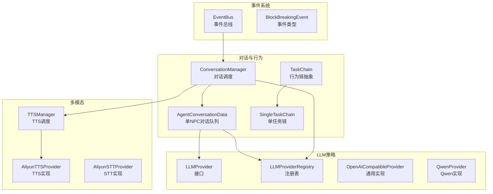
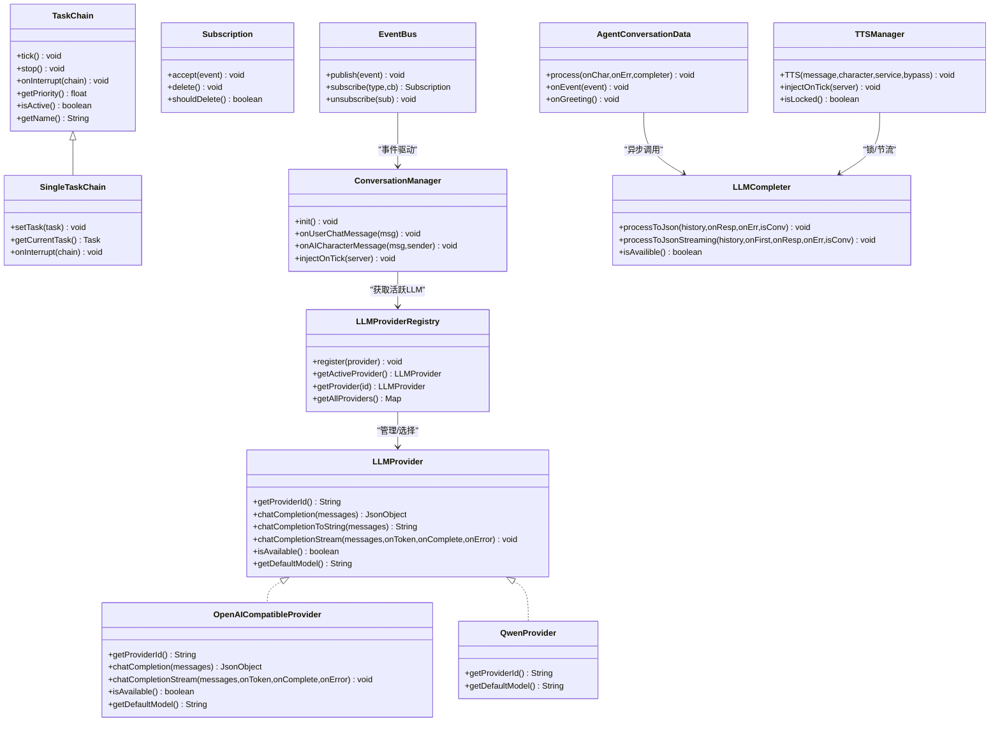
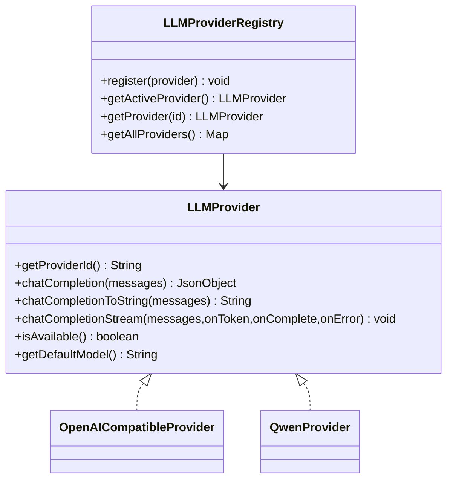
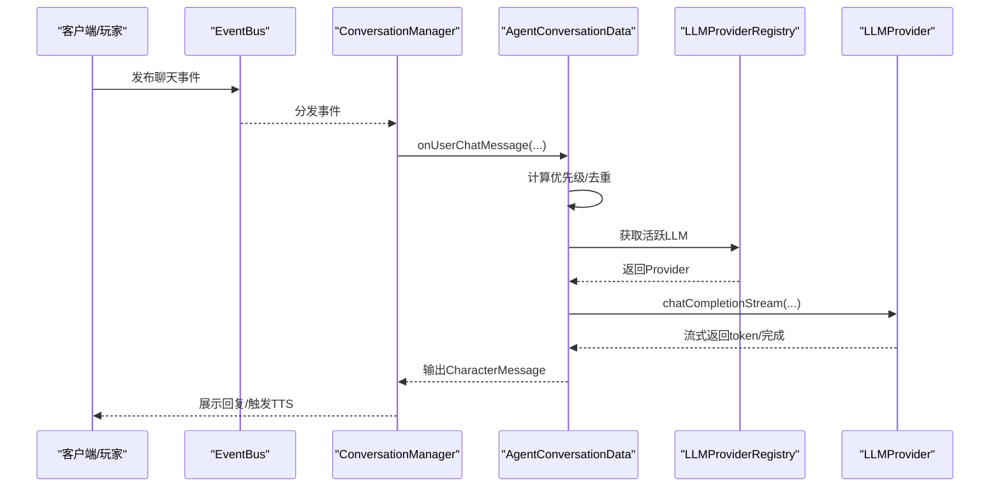
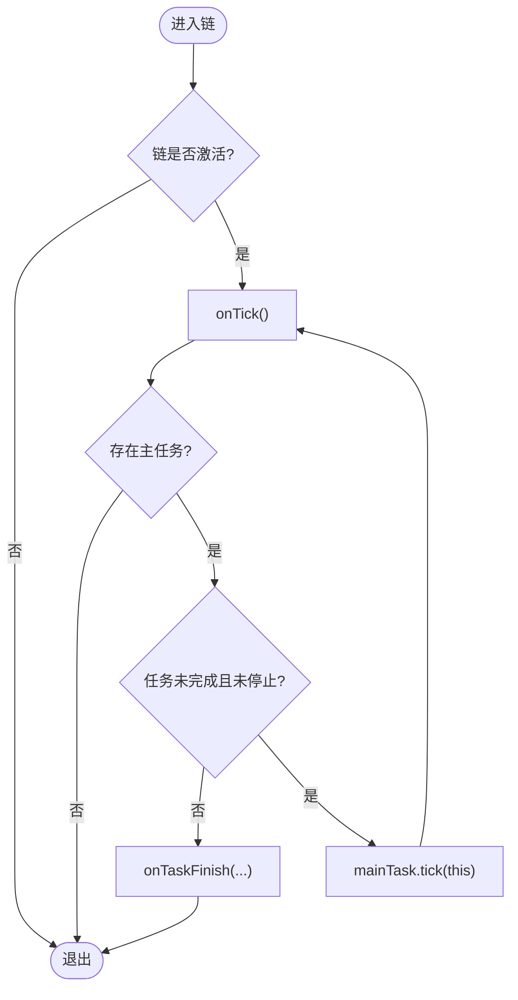
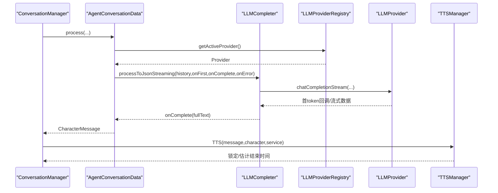
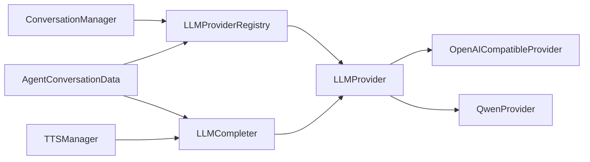

# 核心设计模式

<cite>
**本文引用的文件**
- [LLMProvider.java](file://src/main/java/adris/altoclef/player2api/llm/LLMProvider.java)
- [LLMProviderRegistry.java](file://src/main/java/adris/altoclef/player2api/llm/LLMProviderRegistry.java)
- [OpenAICompatibleProvider.java](file://src/main/java/adris/altoclef/player2api/llm/impl/OpenAICompatibleProvider.java)
- [QwenProvider.java](file://src/main/java/adris/altoclef/player2api/llm/impl/QwenProvider.java)
- [EventBus.java](file://src/main/java/adris/altoclef/eventbus/EventBus.java)
- [Subscription.java](file://src/main/java/adris/altoclef/eventbus/Subscription.java)
- [BlockBreakingEvent.java](file://src/main/java/adris/altoclef/eventbus/events/BlockBreakingEvent.java)
- [TaskChain.java](file://src/main/java/adris/altoclef/tasksystem/TaskChain.java)
- [SingleTaskChain.java](file://src/main/java/adris/altoclef/chains/SingleTaskChain.java)
- [ConversationManager.java](file://src/main/java/adris/altoclef/player2api/manager/ConversationManager.java)
- [AgentConversationData.java](file://src/main/java/adris/altoclef/player2api/AgentConversationData.java)
- [LLMCompleter.java](file://src/main/java/adris/altoclef/player2api/LLMCompleter.java)
- [TTSManager.java](file://src/main/java/adris/altoclef/player2api/manager/TTSManager.java)
- [AliyunTTSProvider.java](file://src/main/java/adris/altoclef/player2api/tts/AliyunTTSProvider.java)
- [AliyunSTTProvider.java](file://src/main/java/adris/altoclef/player2api/stt/AliyunSTTProvider.java)
- [playerengine-llm-default.json](file://src/main/resources/playerengine-llm-default.json)
</cite>

## 目录
1. [引言](#引言)
2. [项目结构](#项目结构)
3. [核心组件](#核心组件)
4. [架构总览](#架构总览)
5. [详细组件分析](#详细组件分析)
6. [依赖分析](#依赖分析)
7. [性能考量](#性能考量)
8. [故障排查指南](#故障排查指南)
9. [结论](#结论)
10. [附录](#附录)

## 引言
本文件聚焦于AI NPC系统中的四大核心设计模式：策略模式（LLM Provider架构）、观察者模式（事件驱动的对话管理）、责任链模式（行为链系统）、异步处理模式（LLM与TTS调用）。我们将结合实际代码路径，给出类图、时序图与流程图，并总结优势与最佳实践。

## 项目结构
系统围绕“对话管理”“行为链执行”“多模态输入输出（STT/TTS）”三大主线展开，分别对应观察者、责任链与异步处理；而LLM调用通过统一接口与注册表实现策略切换，形成可插拔的策略模式架构。

图表来源
- [ConversationManager.java:1-206](file://src/main/java/adris/altoclef/player2api/manager/ConversationManager.java#L1-L206)
- [AgentConversationData.java:1-562](file://src/main/java/adris/altoclef/player2api/AgentConversationData.java#L1-L562)
- [TaskChain.java:1-51](file://src/main/java/adris/altoclef/tasksystem/TaskChain.java#L1-L51)
- [SingleTaskChain.java:1-96](file://src/main/java/adris/altoclef/chains/SingleTaskChain.java#L1-L96)
- [EventBus.java:1-69](file://src/main/java/adris/altoclef/eventbus/EventBus.java#L1-L69)
- [BlockBreakingEvent.java:1-12](file://src/main/java/adris/altoclef/eventbus/events/BlockBreakingEvent.java#L1-L12)
- [LLMProvider.java:1-67](file://src/main/java/adris/altoclef/player2api/llm/LLMProvider.java#L1-L67)
- [LLMProviderRegistry.java:1-80](file://src/main/java/adris/altoclef/player2api/llm/LLMProviderRegistry.java#L1-L80)
- [OpenAICompatibleProvider.java:1-228](file://src/main/java/adris/altoclef/player2api/llm/impl/OpenAICompatibleProvider.java#L1-L228)
- [QwenProvider.java:1-22](file://src/main/java/adris/altoclef/player2api/llm/impl/QwenProvider.java#L1-L22)
- [TTSManager.java:1-168](file://src/main/java/adris/altoclef/player2api/manager/TTSManager.java#L1-L168)
- [AliyunTTSProvider.java:1-113](file://src/main/java/adris/altoclef/player2api/tts/AliyunTTSProvider.java#L1-L113)
- [AliyunSTTProvider.java:1-172](file://src/main/java/adris/altoclef/player2api/stt/AliyunSTTProvider.java#L1-L172)

章节来源
- [ConversationManager.java:1-206](file://src/main/java/adris/altoclef/player2api/manager/ConversationManager.java#L1-L206)
- [LLMProviderRegistry.java:1-80](file://src/main/java/adris/altoclef/player2api/llm/LLMProviderRegistry.java#L1-L80)
- [EventBus.java:1-69](file://src/main/java/adris/altoclef/eventbus/EventBus.java#L1-L69)
- [TaskChain.java:1-51](file://src/main/java/adris/altoclef/tasksystem/TaskChain.java#L1-L51)
- [TTSManager.java:1-168](file://src/main/java/adris/altoclef/player2api/manager/TTSManager.java#L1-L168)

## 核心组件
- 策略模式（LLM Provider）
  - 统一接口：[LLMProvider.java:11-66](file://src/main/java/adris/altoclef/player2api/llm/LLMProvider.java#L11-L66)
  - 注册表与选择：[LLMProviderRegistry.java:49-70](file://src/main/java/adris/altoclef/player2api/llm/LLMProviderRegistry.java#L49-L70)
  - 具体实现：[OpenAICompatibleProvider.java:24-227](file://src/main/java/adris/altoclef/player2api/llm/impl/OpenAICompatibleProvider.java#L24-L227)、[QwenProvider.java:11-21](file://src/main/java/adris/altoclef/player2api/llm/impl/QwenProvider.java#L11-L21)
- 观察者模式（事件驱动对话）
  - 总线与订阅：[EventBus.java:14-61](file://src/main/java/adris/altoclef/eventbus/EventBus.java#L14-L61)、[Subscription.java:5-24](file://src/main/java/adris/altoclef/eventbus/Subscription.java#L5-L24)
  - 事件类型：[BlockBreakingEvent.java:5-11](file://src/main/java/adris/altoclef/eventbus/events/BlockBreakingEvent.java#L5-L11)
  - 对话管理：[ConversationManager.java:115-130](file://src/main/java/adris/altoclef/player2api/manager/ConversationManager.java#L115-L130)、[AgentConversationData.java:101-264](file://src/main/java/adris/altoclef/player2api/AgentConversationData.java#L101-L264)
- 责任链模式（行为链）
  - 抽象链：[TaskChain.java:7-36](file://src/main/java/adris/altoclef/tasksystem/TaskChain.java#L7-L36)
  - 单任务链：[SingleTaskChain.java:11-95](file://src/main/java/adris/altoclef/chains/SingleTaskChain.java#L11-L95)
- 异步处理模式（LLM与TTS）
  - LLM异步：[LLMCompleter.java:84-94](file://src/main/java/adris/altoclef/player2api/LLMCompleter.java#L84-L94)、[OpenAICompatibleProvider.java:144-211](file://src/main/java/adris/altoclef/player2api/llm/impl/OpenAICompatibleProvider.java#L144-L211)
  - TTS异步：[TTSManager.java:94-153](file://src/main/java/adris/altoclef/player2api/manager/TTSManager.java#L94-L153)

章节来源
- [LLMProvider.java:11-66](file://src/main/java/adris/altoclef/player2api/llm/LLMProvider.java#L11-L66)
- [LLMProviderRegistry.java:49-70](file://src/main/java/adris/altoclef/player2api/llm/LLMProviderRegistry.java#L49-L70)
- [OpenAICompatibleProvider.java:144-211](file://src/main/java/adris/altoclef/player2api/llm/impl/OpenAICompatibleProvider.java#L144-L211)
- [QwenProvider.java:11-21](file://src/main/java/adris/altoclef/player2api/llm/impl/QwenProvider.java#L11-L21)
- [EventBus.java:14-61](file://src/main/java/adris/altoclef/eventbus/EventBus.java#L14-L61)
- [Subscription.java:5-24](file://src/main/java/adris/altoclef/eventbus/Subscription.java#L5-L24)
- [BlockBreakingEvent.java:5-11](file://src/main/java/adris/altoclef/eventbus/events/BlockBreakingEvent.java#L5-L11)
- [ConversationManager.java:115-130](file://src/main/java/adris/altoclef/player2api/manager/ConversationManager.java#L115-L130)
- [AgentConversationData.java:101-264](file://src/main/java/adris/altoclef/player2api/AgentConversationData.java#L101-L264)
- [TaskChain.java:7-36](file://src/main/java/adris/altoclef/tasksystem/TaskChain.java#L7-L36)
- [SingleTaskChain.java:11-95](file://src/main/java/adris/altoclef/chains/SingleTaskChain.java#L11-L95)
- [LLMCompleter.java:84-94](file://src/main/java/adris/altoclef/player2api/LLMCompleter.java#L84-L94)
- [TTSManager.java:94-153](file://src/main/java/adris/altoclef/player2api/manager/TTSManager.java#L94-L153)

## 架构总览
下图展示了策略模式（LLM Provider）、观察者模式（EventBus）、责任链模式（TaskChain）与异步处理（LLMCompleter/TTSManager）在系统中的交互关系。

图表来源
- [LLMProvider.java:11-66](file://src/main/java/adris/altoclef/player2api/llm/LLMProvider.java#L11-L66)
- [LLMProviderRegistry.java:49-70](file://src/main/java/adris/altoclef/player2api/llm/LLMProviderRegistry.java#L49-L70)
- [OpenAICompatibleProvider.java:24-227](file://src/main/java/adris/altoclef/player2api/llm/impl/OpenAICompatibleProvider.java#L24-L227)
- [QwenProvider.java:11-21](file://src/main/java/adris/altoclef/player2api/llm/impl/QwenProvider.java#L11-L21)
- [EventBus.java:14-61](file://src/main/java/adris/altoclef/eventbus/EventBus.java#L14-L61)
- [Subscription.java:5-24](file://src/main/java/adris/altoclef/eventbus/Subscription.java#L5-L24)
- [TaskChain.java:7-36](file://src/main/java/adris/altoclef/tasksystem/TaskChain.java#L7-L36)
- [SingleTaskChain.java:11-95](file://src/main/java/adris/altoclef/chains/SingleTaskChain.java#L11-L95)
- [ConversationManager.java:115-130](file://src/main/java/adris/altoclef/player2api/manager/ConversationManager.java#L115-L130)
- [AgentConversationData.java:101-264](file://src/main/java/adris/altoclef/player2api/AgentConversationData.java#L101-L264)
- [LLMCompleter.java:84-94](file://src/main/java/adris/altoclef/player2api/LLMCompleter.java#L84-L94)
- [TTSManager.java:94-153](file://src/main/java/adris/altoclef/player2api/manager/TTSManager.java#L94-L153)

## 详细组件分析

### 策略模式：LLM Provider架构
- 应用场景
  - 在不改变上层调用逻辑的前提下，支持多种LLM后端（如OpenAI兼容、Qwen等），并具备自动可用性回退能力。
- 实现方式
  - 统一接口定义与默认方法，便于扩展与简化调用：[LLMProvider.java:11-66](file://src/main/java/adris/altoclef/player2api/llm/LLMProvider.java#L11-L66)
  - 注册表集中管理与选择：[LLMProviderRegistry.java:49-70](file://src/main/java/adris/altoclef/player2api/llm/LLMProviderRegistry.java#L49-L70)
  - 具体实现遵循通用协议（OpenAI兼容）：[OpenAICompatibleProvider.java:24-227](file://src/main/java/adris/altoclef/player2api/llm/impl/OpenAICompatibleProvider.java#L24-L227)
  - 特定厂商适配（如Qwen）：[QwenProvider.java:11-21](file://src/main/java/adris/altoclef/player2api/llm/impl/QwenProvider.java#L11-L21)
- 优势
  - 解耦调用方与具体实现，便于替换与扩展；支持配置化与动态回退。
- 最佳实践
  - 新增Provider时仅实现接口与必要配置项，注册表自动纳入；严格校验可用性与错误处理。

图表来源
- [LLMProvider.java:11-66](file://src/main/java/adris/altoclef/player2api/llm/LLMProvider.java#L11-L66)
- [LLMProviderRegistry.java:49-70](file://src/main/java/adris/altoclef/player2api/llm/LLMProviderRegistry.java#L49-L70)
- [OpenAICompatibleProvider.java:24-227](file://src/main/java/adris/altoclef/player2api/llm/impl/OpenAICompatibleProvider.java#L24-L227)
- [QwenProvider.java:11-21](file://src/main/java/adris/altoclef/player2api/llm/impl/QwenProvider.java#L11-L21)

章节来源
- [LLMProvider.java:11-66](file://src/main/java/adris/altoclef/player2api/llm/LLMProvider.java#L11-L66)
- [LLMProviderRegistry.java:49-70](file://src/main/java/adris/altoclef/player2api/llm/LLMProviderRegistry.java#L49-L70)
- [OpenAICompatibleProvider.java:24-227](file://src/main/java/adris/altoclef/player2api/llm/impl/OpenAICompatibleProvider.java#L24-L227)
- [QwenProvider.java:11-21](file://src/main/java/adris/altoclef/player2api/llm/impl/QwenProvider.java#L11-L21)

### 观察者模式：事件驱动的对话管理
- 应用场景
  - 将用户聊天、AI角色消息、世界事件等作为事件发布，对话管理器订阅并按优先级处理。
- 实现方式
  - 事件总线与订阅封装：[EventBus.java:14-61](file://src/main/java/adris/altoclef/eventbus/EventBus.java#L14-L61)、[Subscription.java:5-24](file://src/main/java/adris/altoclef/eventbus/Subscription.java#L5-L24)
  - 典型事件类型：[BlockBreakingEvent.java:5-11](file://src/main/java/adris/altoclef/eventbus/events/BlockBreakingEvent.java#L5-L11)
  - 对话入口与过滤：[ConversationManager.java:115-130](file://src/main/java/adris/altoclef/player2api/manager/ConversationManager.java#L115-L130)
  - 单NPC队列与优先级：[AgentConversationData.java:80-98](file://src/main/java/adris/altoclef/player2api/AgentConversationData.java#L80-L98)
- 优势
  - 松耦合的事件分发，易于扩展新的事件源与处理器。
- 最佳实践
  - 订阅生命周期管理（删除标记）；发布时避免类型错配；合理设置事件优先级。

图表来源
- [EventBus.java:14-61](file://src/main/java/adris/altoclef/eventbus/EventBus.java#L14-L61)
- [ConversationManager.java:115-130](file://src/main/java/adris/altoclef/player2api/manager/ConversationManager.java#L115-L130)
- [AgentConversationData.java:101-264](file://src/main/java/adris/altoclef/player2api/AgentConversationData.java#L101-L264)
- [LLMProviderRegistry.java:49-70](file://src/main/java/adris/altoclef/player2api/llm/LLMProviderRegistry.java#L49-L70)
- [OpenAICompatibleProvider.java:144-211](file://src/main/java/adris/altoclef/player2api/llm/impl/OpenAICompatibleProvider.java#L144-L211)

章节来源
- [EventBus.java:14-61](file://src/main/java/adris/altoclef/eventbus/EventBus.java#L14-L61)
- [Subscription.java:5-24](file://src/main/java/adris/altoclef/eventbus/Subscription.java#L5-L24)
- [BlockBreakingEvent.java:5-11](file://src/main/java/adris/altoclef/eventbus/events/BlockBreakingEvent.java#L5-L11)
- [ConversationManager.java:115-130](file://src/main/java/adris/altoclef/player2api/manager/ConversationManager.java#L115-L130)
- [AgentConversationData.java:80-98](file://src/main/java/adris/altoclef/player2api/AgentConversationData.java#L80-L98)

### 责任链模式：行为链系统
- 应用场景
  - 将复杂任务拆分为可中断、可切换的子任务，链式推进执行。
- 实现方式
  - 抽象链：[TaskChain.java:7-36](file://src/main/java/adris/altoclef/tasksystem/TaskChain.java#L7-L36)
  - 单任务链：[SingleTaskChain.java:11-95](file://src/main/java/adris/altoclef/chains/SingleTaskChain.java#L11-L95)
- 优势
  - 清晰的任务生命周期管理，支持中断与切换，便于调试与扩展。
- 最佳实践
  - 合理划分任务粒度；在链中断时正确清理状态；避免链间相互阻塞。

图表来源
- [SingleTaskChain.java:22-90](file://src/main/java/adris/altoclef/chains/SingleTaskChain.java#L22-L90)
- [TaskChain.java:16-36](file://src/main/java/adris/altoclef/tasksystem/TaskChain.java#L16-L36)

章节来源
- [TaskChain.java:7-36](file://src/main/java/adris/altoclef/tasksystem/TaskChain.java#L7-L36)
- [SingleTaskChain.java:11-95](file://src/main/java/adris/altoclef/chains/SingleTaskChain.java#L11-L95)

### 异步处理模式：LLM与TTS调用
- 应用场景
  - LLM推理与TTS语音合成均可能耗时较长，采用异步线程池与锁机制保障UI流畅与顺序一致性。
- 实现方式
  - LLM异步：[LLMCompleter.java:84-94](file://src/main/java/adris/altoclef/player2api/LLMCompleter.java#L84-L94)、[OpenAICompatibleProvider.java:144-211](file://src/main/java/adris/altoclef/player2api/llm/impl/OpenAICompatibleProvider.java#L144-L211)
  - TTS异步：[TTSManager.java:94-153](file://src/main/java/adris/altoclef/player2api/manager/TTSManager.java#L94-L153)
- 优势
  - 避免主线程阻塞；支持首token提示、序列去重、全局冷却与句子级流水线。
- 最佳实践
  - 使用序列号剔除过期任务；合理估计播放时长以释放锁；对重复消息进行去重。

图表来源
- [AgentConversationData.java:262-264](file://src/main/java/adris/altoclef/player2api/AgentConversationData.java#L262-L264)
- [LLMCompleter.java:182-211](file://src/main/java/adris/altoclef/player2api/LLMCompleter.java#L182-L211)
- [OpenAICompatibleProvider.java:144-211](file://src/main/java/adris/altoclef/player2api/llm/impl/OpenAICompatibleProvider.java#L144-L211)
- [TTSManager.java:94-153](file://src/main/java/adris/altoclef/player2api/manager/TTSManager.java#L94-L153)

章节来源
- [LLMCompleter.java:84-94](file://src/main/java/adris/altoclef/player2api/LLMCompleter.java#L84-L94)
- [OpenAICompatibleProvider.java:144-211](file://src/main/java/adris/altoclef/player2api/llm/impl/OpenAICompatibleProvider.java#L144-L211)
- [TTSManager.java:94-153](file://src/main/java/adris/altoclef/player2api/manager/TTSManager.java#L94-L153)

## 依赖分析
- 组件内聚与耦合
  - LLMProvider与LLMProviderRegistry低耦合：通过接口与注册表解耦；新增Provider无需改动调用方。
  - ConversationManager与AgentConversationData高内聚：前者负责调度，后者负责单体优先级与状态机。
  - TTSManager与LLMCompleter通过锁协同：避免并发冲突与过期任务。
- 外部依赖
  - 配置文件驱动：[playerengine-llm-default.json:6-43](file://src/main/resources/playerengine-llm-default.json#L6-L43)、[playerengine-llm-default.json:52-87](file://src/main/resources/playerengine-llm-default.json#L52-L87)
  - 第三方SDK：阿里云DashScope（TTS/STT/LLM兼容）

图表来源
- [LLMProviderRegistry.java:49-70](file://src/main/java/adris/altoclef/player2api/llm/LLMProviderRegistry.java#L49-L70)
- [LLMProvider.java:11-66](file://src/main/java/adris/altoclef/player2api/llm/LLMProvider.java#L11-L66)
- [OpenAICompatibleProvider.java:24-227](file://src/main/java/adris/altoclef/player2api/llm/impl/OpenAICompatibleProvider.java#L24-L227)
- [QwenProvider.java:11-21](file://src/main/java/adris/altoclef/player2api/llm/impl/QwenProvider.java#L11-L21)
- [ConversationManager.java:115-130](file://src/main/java/adris/altoclef/player2api/manager/ConversationManager.java#L115-L130)
- [AgentConversationData.java:101-264](file://src/main/java/adris/altoclef/player2api/AgentConversationData.java#L101-L264)
- [LLMCompleter.java:84-94](file://src/main/java/adris/altoclef/player2api/LLMCompleter.java#L84-L94)
- [TTSManager.java:94-153](file://src/main/java/adris/altoclef/player2api/manager/TTSManager.java#L94-L153)

章节来源
- [LLMProviderRegistry.java:49-70](file://src/main/java/adris/altoclef/player2api/llm/LLMProviderRegistry.java#L49-L70)
- [playerengine-llm-default.json:6-43](file://src/main/resources/playerengine-llm-default.json#L6-L43)

## 性能考量
- LLM调用
  - 流式返回可尽早提示“正在思考”，提升交互体验；建议控制请求体大小与超时阈值。
  - 通过注册表回退可用Provider，避免单点故障导致长时间等待。
- TTS合成
  - 句子级流水线减少首字延迟；全局冷却与去重避免语音风暴。
  - 估计播放时长释放锁，保证后续对话及时处理。
- 事件与队列
  - 事件总线发布时加锁与延迟添加，避免并发订阅问题；对话队列限制长度，避免内存膨胀。

## 故障排查指南
- LLM不可用
  - 检查配置文件中Provider开关与API Key；确认网络代理设置；查看注册表回退逻辑是否生效。
  - 参考：[playerengine-llm-default.json:6-43](file://src/main/resources/playerengine-llm-default.json#L6-L43)、[LLMProviderRegistry.java:49-70](file://src/main/java/adris/altoclef/player2api/llm/LLMProviderRegistry.java#L49-L70)
- TTS无声或卡顿
  - 检查API Key与模型参数；确认音频格式与采样率；关注全局冷却与去重策略。
  - 参考：[TTSManager.java:94-153](file://src/main/java/adris/altoclef/player2api/manager/TTSManager.java#L94-L153)、[AliyunTTSProvider.java:50-104](file://src/main/java/adris/altoclef/player2api/tts/AliyunTTSProvider.java#L50-L104)
- 对话卡死
  - 查看ConversationManager锁状态与超时；检查AgentConversationData处理超时与最小响应间隔。
  - 参考：[ConversationManager.java:30-53](file://src/main/java/adris/altoclef/player2api/manager/ConversationManager.java#L30-L53)、[AgentConversationData.java:80-98](file://src/main/java/adris/altoclef/player2api/AgentConversationData.java#L80-L98)
- 事件未被处理
  - 确认EventBus订阅生命周期与删除标记；检查事件类型是否匹配。
  - 参考：[EventBus.java:14-61](file://src/main/java/adris/altoclef/eventbus/EventBus.java#L14-L61)、[Subscription.java:5-24](file://src/main/java/adris/altoclef/eventbus/Subscription.java#L5-L24)

章节来源
- [playerengine-llm-default.json:6-43](file://src/main/resources/playerengine-llm-default.json#L6-L43)
- [LLMProviderRegistry.java:49-70](file://src/main/java/adris/altoclef/player2api/llm/LLMProviderRegistry.java#L49-L70)
- [TTSManager.java:94-153](file://src/main/java/adris/altoclef/player2api/manager/TTSManager.java#L94-L153)
- [AliyunTTSProvider.java:50-104](file://src/main/java/adris/altoclef/player2api/tts/AliyunTTSProvider.java#L50-L104)
- [ConversationManager.java:30-53](file://src/main/java/adris/altoclef/player2api/manager/ConversationManager.java#L30-L53)
- [AgentConversationData.java:80-98](file://src/main/java/adris/altoclef/player2api/AgentConversationData.java#L80-L98)
- [EventBus.java:14-61](file://src/main/java/adris/altoclef/eventbus/EventBus.java#L14-L61)
- [Subscription.java:5-24](file://src/main/java/adris/altoclef/eventbus/Subscription.java#L5-L24)

## 结论
本系统通过策略模式实现LLM Provider的可插拔架构，借助观察者模式将事件与对话解耦，用责任链模式组织行为链，再以异步处理模式保障LLM与TTS的流畅体验。四者协同，既满足了功能扩展需求，也兼顾了性能与稳定性。

## 附录
- 配置参考
  - LLM Provider与代理、TTS、STT、进度语音等配置项参见：[playerengine-llm-default.json:1-89](file://src/main/resources/playerengine-llm-default.json#L1-L89)
- 关键实现路径索引
  - 策略模式：[LLMProvider.java:11-66](file://src/main/java/adris/altoclef/player2api/llm/LLMProvider.java#L11-L66)、[LLMProviderRegistry.java:49-70](file://src/main/java/adris/altoclef/player2api/llm/LLMProviderRegistry.java#L49-L70)、[OpenAICompatibleProvider.java:24-227](file://src/main/java/adris/altoclef/player2api/llm/impl/OpenAICompatibleProvider.java#L24-L227)、[QwenProvider.java:11-21](file://src/main/java/adris/altoclef/player2api/llm/impl/QwenProvider.java#L11-L21)
  - 观察者模式：[EventBus.java:14-61](file://src/main/java/adris/altoclef/eventbus/EventBus.java#L14-L61)、[Subscription.java:5-24](file://src/main/java/adris/altoclef/eventbus/Subscription.java#L5-L24)、[BlockBreakingEvent.java:5-11](file://src/main/java/adris/altoclef/eventbus/events/BlockBreakingEvent.java#L5-L11)、[ConversationManager.java:115-130](file://src/main/java/adris/altoclef/player2api/manager/ConversationManager.java#L115-L130)、[AgentConversationData.java:101-264](file://src/main/java/adris/altoclef/player2api/AgentConversationData.java#L101-L264)
  - 责任链模式：[TaskChain.java:7-36](file://src/main/java/adris/altoclef/tasksystem/TaskChain.java#L7-L36)、[SingleTaskChain.java:11-95](file://src/main/java/adris/altoclef/chains/SingleTaskChain.java#L11-L95)
  - 异步处理：[LLMCompleter.java:84-94](file://src/main/java/adris/altoclef/player2api/LLMCompleter.java#L84-L94)、[OpenAICompatibleProvider.java:144-211](file://src/main/java/adris/altoclef/player2api/llm/impl/OpenAICompatibleProvider.java#L144-L211)、[TTSManager.java:94-153](file://src/main/java/adris/altoclef/player2api/manager/TTSManager.java#L94-L153)