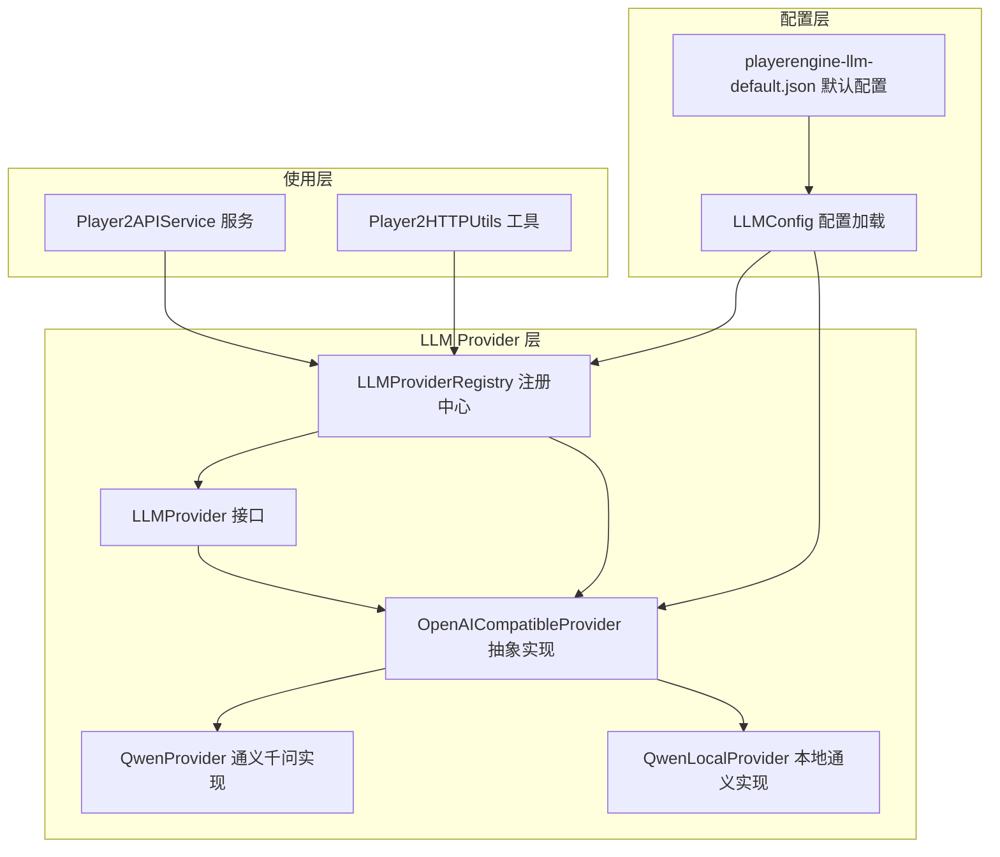
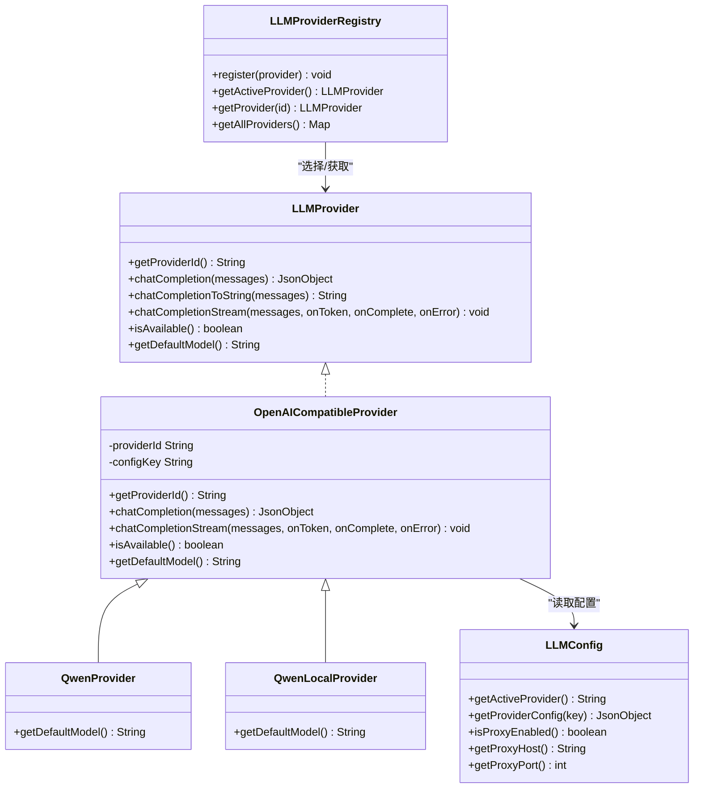
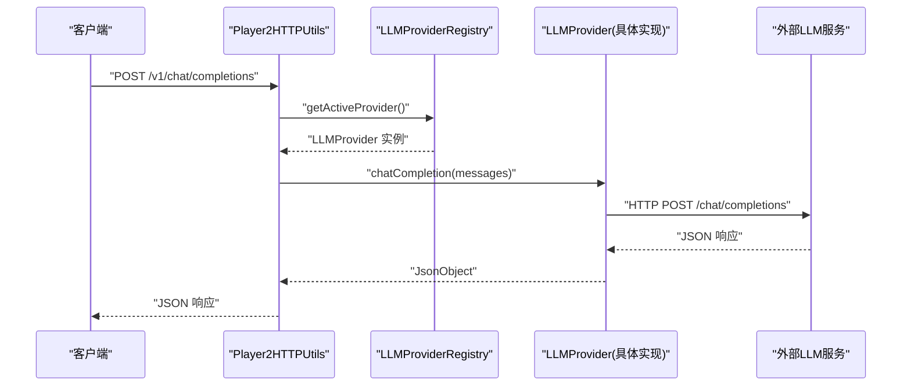
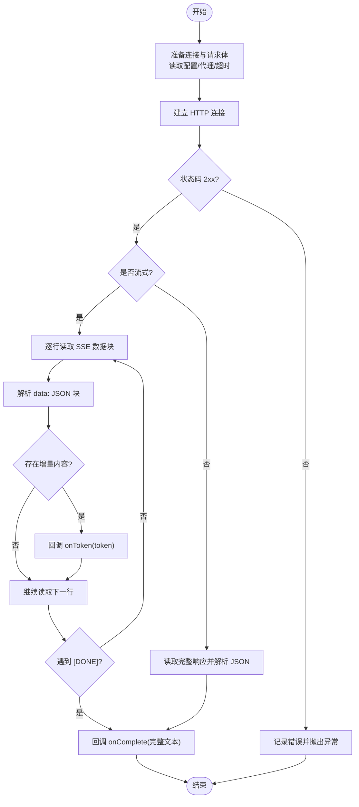
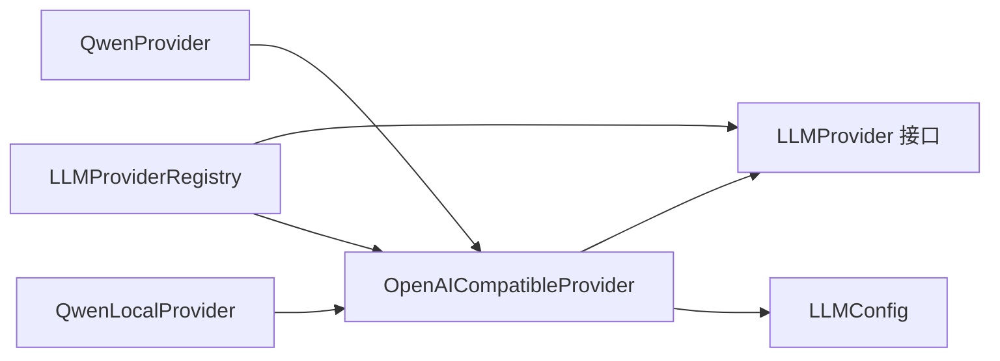

# 策略模式

<cite>
**本文引用的文件列表**
- [LLMProvider.java](file://src/main/java/adris/altoclef/player2api/llm/LLMProvider.java)
- [LLMProviderRegistry.java](file://src/main/java/adris/altoclef/player2api/llm/LLMProviderRegistry.java)
- [OpenAICompatibleProvider.java](file://src/main/java/adris/altoclef/player2api/llm/impl/OpenAICompatibleProvider.java)
- [QwenProvider.java](file://src/main/java/adris/altoclef/player2api/llm/impl/QwenProvider.java)
- [QwenLocalProvider.java](file://src/main/java/adris/altoclef/player2api/llm/impl/QwenLocalProvider.java)
- [LLMConfig.java](file://src/main/java/adris/altoclef/player2api/llm/LLMConfig.java)
- [Player2APIService.java](file://src/main/java/adris/altoclef/player2api/Player2APIService.java)
- [Player2HTTPUtils.java](file://src/main/java/adris/altoclef/player2api/utils/Player2HTTPUtils.java)
- [playerengine-llm-default.json](file://src/main/resources/playerengine-llm-default.json)
</cite>

## 目录
1. [引言](#引言)
2. [项目结构](#项目结构)
3. [核心组件](#核心组件)
4. [架构总览](#架构总览)
5. [详细组件分析](#详细组件分析)
6. [依赖关系分析](#依赖关系分析)
7. [性能考量](#性能考量)
8. [故障排查指南](#故障排查指南)
9. [结论](#结论)
10. [附录](#附录)

## 引言
本文件围绕 AI NPC 系统中的“策略模式”实现进行深入解析，重点阐述 LLM Provider 架构如何通过统一接口与可插拔实现，支持多种大语言模型提供商（如通义千问、OpenAI 兼容接口、本地 Ollama/Qwen）。我们将从接口设计、具体实现类、注册机制、调用流程、错误处理与性能特性等方面展开，并给出新增提供商的最佳实践与常见陷阱规避建议。

## 项目结构
LLM Provider 相关代码主要位于以下路径：
- 接口与注册中心：adris/altoclef/player2api/llm
- 具体实现：adris/altoclef/player2api/llm/impl
- 配置加载：adris/altoclef/player2api/llm/LLMConfig.java
- 使用示例：adris/altoclef/player2api/Player2APIService.java、adris/altoclef/player2api/utils/Player2HTTPUtils.java
- 默认配置：src/main/resources/playerengine-llm-default.json

图表来源
- [LLMProvider.java:11-66](file://src/main/java/adris/altoclef/player2api/llm/LLMProvider.java#L11-L66)
- [LLMProviderRegistry.java:16-79](file://src/main/java/adris/altoclef/player2api/llm/LLMProviderRegistry.java#L16-L79)
- [OpenAICompatibleProvider.java:24-227](file://src/main/java/adris/altoclef/player2api/llm/impl/OpenAICompatibleProvider.java#L24-L227)
- [QwenProvider.java:11-21](file://src/main/java/adris/altoclef/player2api/llm/impl/QwenProvider.java#L11-L21)
- [QwenLocalProvider.java:12-22](file://src/main/java/adris/altoclef/player2api/llm/impl/QwenLocalProvider.java#L12-L22)
- [LLMConfig.java:19-103](file://src/main/java/adris/altoclef/player2api/llm/LLMConfig.java#L19-L103)
- [Player2APIService.java:110-118](file://src/main/java/adris/altoclef/player2api/Player2APIService.java#L110-L118)
- [Player2HTTPUtils.java:90-112](file://src/main/java/adris/altoclef/player2api/utils/Player2HTTPUtils.java#L90-L112)
- [playerengine-llm-default.json:1-89](file://src/main/resources/playerengine-llm-default.json#L1-L89)

章节来源
- [LLMProvider.java:1-67](file://src/main/java/adris/altoclef/player2api/llm/LLMProvider.java#L1-L67)
- [LLMProviderRegistry.java:1-80](file://src/main/java/adris/altoclef/player2api/llm/LLMProviderRegistry.java#L1-L80)
- [OpenAICompatibleProvider.java:1-228](file://src/main/java/adris/altoclef/player2api/llm/impl/OpenAICompatibleProvider.java#L1-L228)
- [QwenProvider.java:1-22](file://src/main/java/adris/altoclef/player2api/llm/impl/QwenProvider.java#L1-L22)
- [QwenLocalProvider.java:1-23](file://src/main/java/adris/altoclef/player2api/llm/impl/QwenLocalProvider.java#L1-L23)
- [LLMConfig.java:1-104](file://src/main/java/adris/altoclef/player2api/llm/LLMConfig.java#L1-L104)
- [Player2APIService.java:110-118](file://src/main/java/adris/altoclef/player2api/Player2APIService.java#L110-L118)
- [Player2HTTPUtils.java:90-112](file://src/main/java/adris/altoclef/player2api/utils/Player2HTTPUtils.java#L90-L112)
- [playerengine-llm-default.json:1-89](file://src/main/resources/playerengine-llm-default.json#L1-L89)

## 核心组件
- LLMProvider 接口：定义统一的提供商能力，包括唯一标识、聊天补全、流式补全、可用性检查、默认模型等。
- OpenAICompatibleProvider 抽象实现：封装通用的 OpenAI 兼容协议调用逻辑（请求构建、连接建立、代理、超时、非流式/流式响应解析）。
- QwenProvider：基于 OpenAI 兼容协议的通义千问实现，重写默认模型。
- QwenLocalProvider：本地 Ollama/Qwen 实现，重写默认模型与配置键。
- LLMProviderRegistry：单例注册中心，负责内置提供商注册、可用性选择与按 ID 获取。
- LLMConfig：配置加载器，读取 playerengine-llm.json 并提供代理、提供商配置等。
- 使用示例：Player2APIService 与 Player2HTTPUtils 通过注册中心获取当前活跃提供商并发起请求。

章节来源
- [LLMProvider.java:11-66](file://src/main/java/adris/altoclef/player2api/llm/LLMProvider.java#L11-L66)
- [OpenAICompatibleProvider.java:24-227](file://src/main/java/adris/altoclef/player2api/llm/impl/OpenAICompatibleProvider.java#L24-L227)
- [QwenProvider.java:11-21](file://src/main/java/adris/altoclef/player2api/llm/impl/QwenProvider.java#L11-L21)
- [QwenLocalProvider.java:12-22](file://src/main/java/adris/altoclef/player2api/llm/impl/QwenLocalProvider.java#L12-L22)
- [LLMProviderRegistry.java:16-79](file://src/main/java/adris/altoclef/player2api/llm/LLMProviderRegistry.java#L16-L79)
- [LLMConfig.java:19-103](file://src/main/java/adris/altoclef/player2api/llm/LLMConfig.java#L19-L103)
- [Player2APIService.java:110-118](file://src/main/java/adris/altoclef/player2api/Player2APIService.java#L110-L118)
- [Player2HTTPUtils.java:90-112](file://src/main/java/adris/altoclef/player2api/utils/Player2HTTPUtils.java#L90-L112)

## 架构总览
下图展示了策略模式在 LLM Provider 中的应用：客户端通过统一接口调用，具体实现由注册中心根据配置选择，底层统一遵循 OpenAI 兼容协议。

图表来源
- [LLMProvider.java:11-66](file://src/main/java/adris/altoclef/player2api/llm/LLMProvider.java#L11-L66)
- [OpenAICompatibleProvider.java:24-227](file://src/main/java/adris/altoclef/player2api/llm/impl/OpenAICompatibleProvider.java#L24-L227)
- [QwenProvider.java:11-21](file://src/main/java/adris/altoclef/player2api/llm/impl/QwenProvider.java#L11-L21)
- [QwenLocalProvider.java:12-22](file://src/main/java/adris/altoclef/player2api/llm/impl/QwenLocalProvider.java#L12-L22)
- [LLMProviderRegistry.java:16-79](file://src/main/java/adris/altoclef/player2api/llm/LLMProviderRegistry.java#L16-L79)
- [LLMConfig.java:19-103](file://src/main/java/adris/altoclef/player2api/llm/LLMConfig.java#L19-L103)

## 详细组件分析

### LLMProvider 接口设计
- 统一抽象：提供统一的提供商标识、聊天补全、字符串便捷方法、流式补全回调、可用性判断与默认模型声明。
- 默认行为：提供默认的流式补全回退实现（直接走非流式），便于具体提供商按需覆盖。
- 设计意图：屏蔽不同提供商的差异，使上层调用者只关心“发送消息并获得回复”。

章节来源
- [LLMProvider.java:11-66](file://src/main/java/adris/altoclef/player2api/llm/LLMProvider.java#L11-L66)

### OpenAICompatibleProvider 抽象实现
- 请求构建：从配置读取 API 地址、密钥、模型、最大令牌数、温度等；构造 OpenAI 兼容格式的请求体。
- 连接与代理：支持直连或 HTTP 代理，设置超时与 Content-Type。
- 非流式调用：读取响应流，校验状态码，解析 JSON。
- 流式调用：解析 SSE 数据块，逐段提取增量内容，回调 onToken；首次 token 记录 TTFT。
- 可用性：检查 enabled、apiKey 是否有效且未使用占位符。
- 默认模型：提供一个通用默认模型名，子类可覆盖。

章节来源
- [OpenAICompatibleProvider.java:24-227](file://src/main/java/adris/altoclef/player2api/llm/impl/OpenAICompatibleProvider.java#L24-L227)

### QwenProvider（通义千问）
- 继承 OpenAICompatibleProvider，仅重写 providerId、configKey 与默认模型。
- 默认模型：提供更合适的通义模型名称。
- 配置键：对应 playerengine-llm.json 中的 "qwen" 节点。

章节来源
- [QwenProvider.java:11-21](file://src/main/java/adris/altoclef/player2api/llm/impl/QwenProvider.java#L11-L21)

### QwenLocalProvider（本地通义/Ollama）
- 继承 OpenAICompatibleProvider，重写 providerId、configKey 与默认模型。
- 默认模型：指向本地 Ollama 的 qwen2.5:7b。
- 配置键：对应 "qwen_local" 节点，默认 API 地址为本地 11434 端口。

章节来源
- [QwenLocalProvider.java:12-22](file://src/main/java/adris/altoclef/player2api/llm/impl/QwenLocalProvider.java#L12-L22)

### LLMProviderRegistry 注册机制
- 单例：首次访问自动注册内置提供商（通义千问、OpenAI 兼容、本地通义）。
- 注册：通过 register 将提供商加入映射表。
- 选择策略：优先返回配置中指定的提供商，若不可用则回退到第一个可用提供商；否则抛出异常提示检查配置。
- 查询：支持按 ID 获取或返回全部提供商副本。

章节来源
- [LLMProviderRegistry.java:16-79](file://src/main/java/adris/altoclef/player2api/llm/LLMProviderRegistry.java#L16-L79)

### 配置加载 LLMConfig
- 文件定位：通过工具类确保默认配置复制到正确位置，支持开发与生产环境。
- 结构：包含 activeProvider、providers（各提供商配置）、proxy、tts、stt 等。
- 代理：提供开关、主机与端口读取。
- 提供商配置：按 providerId 返回对应配置对象。

章节来源
- [LLMConfig.java:19-103](file://src/main/java/adris/altoclef/player2api/llm/LLMConfig.java#L19-L103)
- [playerengine-llm-default.json:1-89](file://src/main/resources/playerengine-llm-default.json#L1-L89)

### 使用示例：服务与工具
- Player2APIService：在流式对话中，将历史消息数组传给活跃提供商，触发流式回调。
- Player2HTTPUtils：在 HTTP 路由中，从请求体提取 messages 数组，调用提供商并返回结果。

章节来源
- [Player2APIService.java:110-118](file://src/main/java/adris/altoclef/player2api/Player2APIService.java#L110-L118)
- [Player2HTTPUtils.java:90-112](file://src/main/java/adris/altoclef/player2api/utils/Player2HTTPUtils.java#L90-L112)

### 调用序列图：HTTP 路由到提供商

图表来源
- [Player2HTTPUtils.java:90-112](file://src/main/java/adris/altoclef/player2api/utils/Player2HTTPUtils.java#L90-L112)
- [LLMProviderRegistry.java:49-70](file://src/main/java/adris/altoclef/player2api/llm/LLMProviderRegistry.java#L49-L70)
- [OpenAICompatibleProvider.java:112-141](file://src/main/java/adris/altoclef/player2api/llm/impl/OpenAICompatibleProvider.java#L112-L141)

### 流式补全算法流程图

图表来源
- [OpenAICompatibleProvider.java:143-211](file://src/main/java/adris/altoclef/player2api/llm/impl/OpenAICompatibleProvider.java#L143-L211)

## 依赖关系分析
- 组件内聚：LLMProvider 将“能力”与“实现细节”分离，OpenAICompatibleProvider 将“网络协议细节”与“具体提供商”分离。
- 组件耦合：注册中心与配置中心耦合度较低，通过 providerId 解耦；具体提供商对配置中心有读取依赖但无硬编码。
- 可扩展性：新增提供商只需继承 OpenAICompatibleProvider 或实现 LLMProvider，并在注册中心注册即可。
- 循环依赖：未发现循环依赖；注册中心仅持有接口引用。

图表来源
- [LLMProviderRegistry.java:16-79](file://src/main/java/adris/altoclef/player2api/llm/LLMProviderRegistry.java#L16-L79)
- [OpenAICompatibleProvider.java:24-227](file://src/main/java/adris/altoclef/player2api/llm/impl/OpenAICompatibleProvider.java#L24-L227)
- [QwenProvider.java:11-21](file://src/main/java/adris/altoclef/player2api/llm/impl/QwenProvider.java#L11-L21)
- [QwenLocalProvider.java:12-22](file://src/main/java/adris/altoclef/player2api/llm/impl/QwenLocalProvider.java#L12-L22)
- [LLMConfig.java:19-103](file://src/main/java/adris/altoclef/player2api/llm/LLMConfig.java#L19-L103)

章节来源
- [LLMProviderRegistry.java:16-79](file://src/main/java/adris/altoclef/player2api/llm/LLMProviderRegistry.java#L16-L79)
- [OpenAICompatibleProvider.java:24-227](file://src/main/java/adris/altoclef/player2api/llm/impl/OpenAICompatibleProvider.java#L24-L227)
- [QwenProvider.java:11-21](file://src/main/java/adris/altoclef/player2api/llm/impl/QwenProvider.java#L11-L21)
- [QwenLocalProvider.java:12-22](file://src/main/java/adris/altoclef/player2api/llm/impl/QwenLocalProvider.java#L12-L22)
- [LLMConfig.java:19-103](file://src/main/java/adris/altoclef/player2api/llm/LLMConfig.java#L19-L103)

## 性能考量
- 流式传输：优先使用流式接口以降低首字节延迟（TTFT），提升用户体验。
- 代理与超时：合理设置连接与读取超时，避免阻塞；在受限网络环境下启用代理。
- 最大令牌与温度：根据任务复杂度调整 maxTokens 与 temperature，平衡生成质量与成本。
- 回退策略：当配置提供商不可用时，快速回退到首个可用提供商，减少失败时间。

## 故障排查指南
- 无可用提供商：当所有提供商均不可用时，注册中心会抛出异常，提示检查配置文件。请确认 activeProvider 对应的提供商 enabled 且 apiKey 非空。
- 配置未生效：修改 playerengine-llm.json 后需重启游戏，配置加载器会在首次访问时复制默认配置并读取。
- 代理问题：若访问 OpenAI 等海外服务，请开启 proxy 并正确填写 host 与 port。
- 流式解析异常：SSE 数据块解析失败时会记录警告，检查服务端返回格式是否符合 OpenAI 兼容规范。

章节来源
- [LLMProviderRegistry.java:69-70](file://src/main/java/adris/altoclef/player2api/llm/LLMProviderRegistry.java#L69-L70)
- [LLMConfig.java:54-77](file://src/main/java/adris/altoclef/player2api/llm/LLMConfig.java#L54-L77)
- [OpenAICompatibleProvider.java:194-196](file://src/main/java/adris/altoclef/player2api/llm/impl/OpenAICompatibleProvider.java#L194-L196)

## 结论
该 LLM Provider 架构通过“策略模式”实现了高度可扩展、可测试与灵活的多提供商支持。统一接口屏蔽差异，抽象实现封装协议细节，注册中心负责选择与回退，配置中心提供运行时参数。新增提供商只需继承或实现即可无缝接入，同时保留了流式传输、代理与可用性检查等关键能力。

## 附录

### 如何添加新的 LLM 提供商（最佳实践）
- 方案一：继承 OpenAICompatibleProvider（推荐）
  - 步骤：
    1) 新建类继承 OpenAICompatibleProvider，并在构造函数中传入 providerId 与 configKey。
    2) 重写 getDefaultModel() 返回默认模型。
    3) 在 LLMProviderRegistry.getInstance().register(new YourProvider()) 注册。
  - 示例参考路径：
    - [QwenProvider.java:11-21](file://src/main/java/adris/altoclef/player2api/llm/impl/QwenProvider.java#L11-L21)
    - [QwenLocalProvider.java:12-22](file://src/main/java/adris/altoclef/player2api/llm/impl/QwenLocalProvider.java#L12-L22)
    - [LLMProviderRegistry.java:40-43](file://src/main/java/adris/altoclef/player2api/llm/LLMProviderRegistry.java#L40-L43)
- 方案二：直接实现 LLMProvider
  - 步骤：
    1) 实现 getProviderId、chatCompletion、chatCompletionStream、isAvailable、getDefaultModel。
    2) 若需要 OpenAI 兼容协议，可参考 OpenAICompatibleProvider 的请求构建与流式解析逻辑。
  - 示例参考路径：
    - [LLMProvider.java:11-66](file://src/main/java/adris/altoclef/player2api/llm/LLMProvider.java#L11-L66)
    - [OpenAICompatibleProvider.java:51-110](file://src/main/java/adris/altoclef/player2api/llm/impl/OpenAICompatibleProvider.java#L51-L110)

### 常见陷阱与规避
- 忘记注册：新增提供商后必须在注册中心注册，否则无法被 getActiveProvider() 选中。
- 配置键不匹配：providerId 与 configKey 必须与 playerengine-llm.json 中的键一致。
- 占位密钥：isAvailable 会拒绝以特定前缀开头的占位密钥，避免误以为可用。
- 代理未启用：访问海外服务时务必启用代理并正确配置 host/port。
- 流式解析：确保服务端返回符合 OpenAI SSE 规范的数据块，否则会记录解析警告。

章节来源
- [QwenProvider.java:11-21](file://src/main/java/adris/altoclef/player2api/llm/impl/QwenProvider.java#L11-L21)
- [QwenLocalProvider.java:12-22](file://src/main/java/adris/altoclef/player2api/llm/impl/QwenLocalProvider.java#L12-L22)
- [LLMProviderRegistry.java:40-43](file://src/main/java/adris/altoclef/player2api/llm/LLMProviderRegistry.java#L40-L43)
- [LLMProvider.java:11-66](file://src/main/java/adris/altoclef/player2api/llm/LLMProvider.java#L11-L66)
- [OpenAICompatibleProvider.java:213-221](file://src/main/java/adris/altoclef/player2api/llm/impl/OpenAICompatibleProvider.java#L213-L221)
- [playerengine-llm-default.json:1-89](file://src/main/resources/playerengine-llm-default.json#L1-L89)