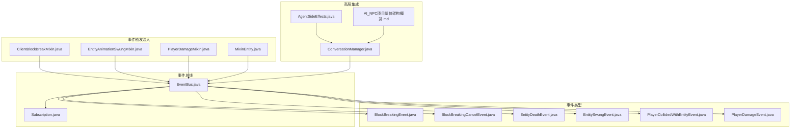
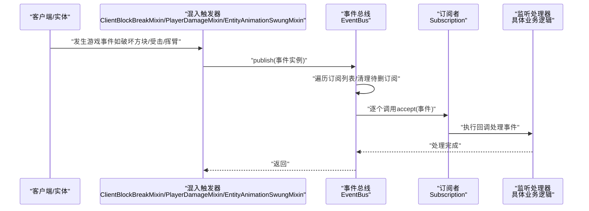
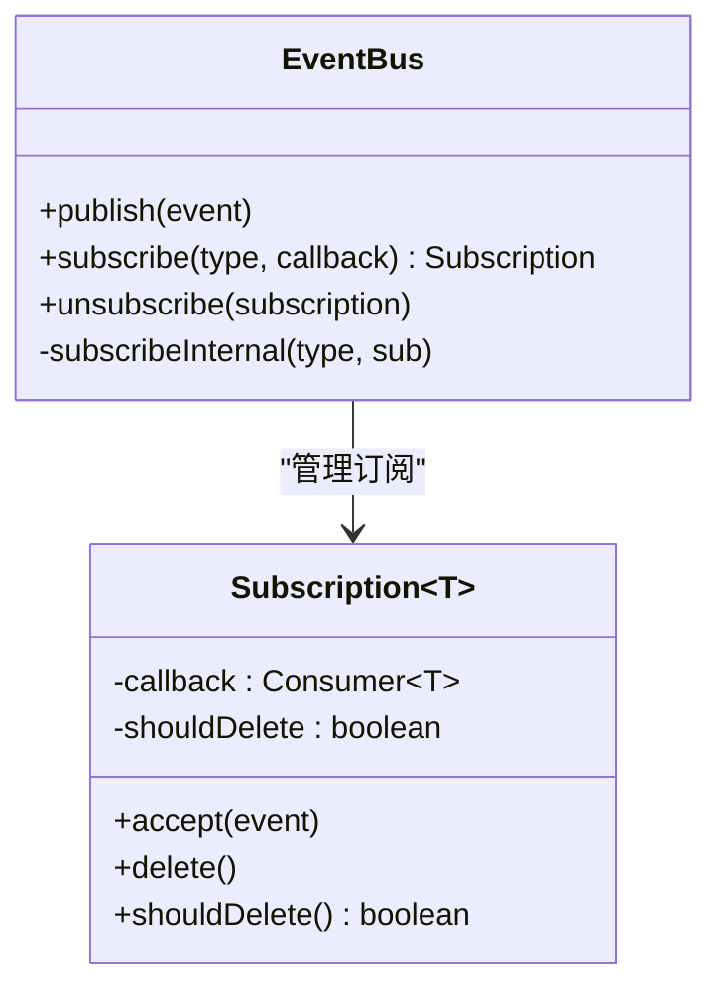
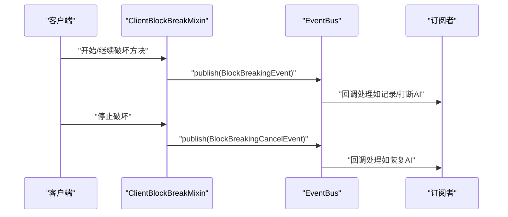
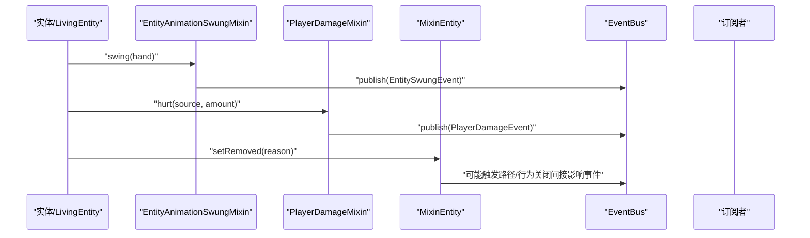
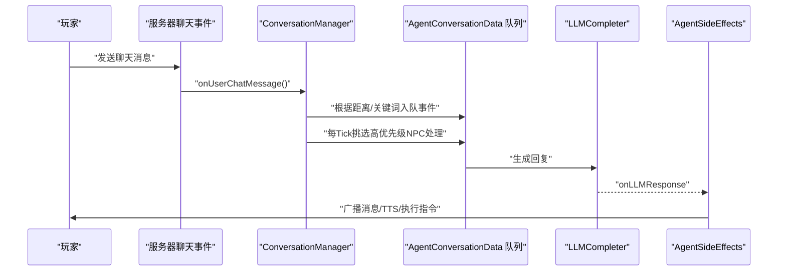
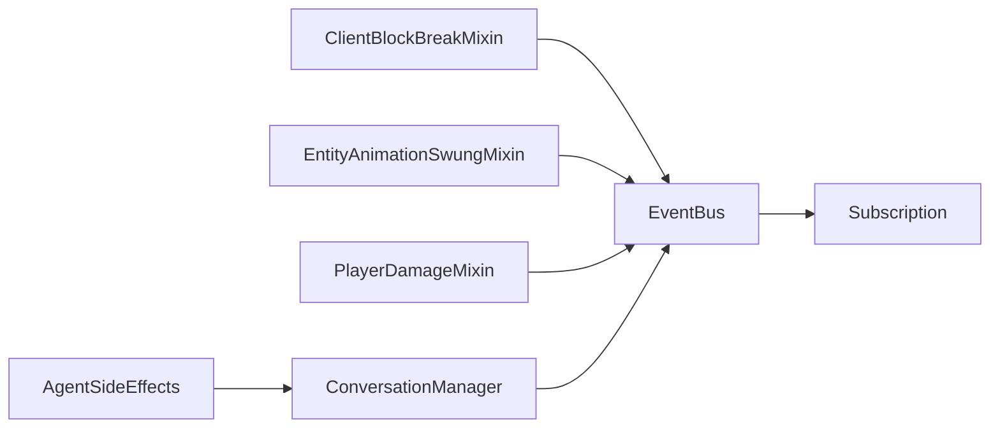

# 观察者模式

<cite>
**本文引用的文件**
- [EventBus.java](file://src/main/java/adris/altoclef/eventbus/EventBus.java)
- [Subscription.java](file://src/main/java/adris/altoclef/eventbus/Subscription.java)
- [BlockBreakingEvent.java](file://src/main/java/adris/altoclef/eventbus/events/BlockBreakingEvent.java)
- [BlockBreakingCancelEvent.java](file://src/main/java/adris/altoclef/eventbus/events/BlockBreakingCancelEvent.java)
- [EntityDeathEvent.java](file://src/main/java/adris/altoclef/eventbus/events/EntityDeathEvent.java)
- [EntitySwungEvent.java](file://src/main/java/adris/altoclef/eventbus/events/EntitySwungEvent.java)
- [PlayerCollidedWithEntityEvent.java](file://src/main/java/adris/altoclef/eventbus/events/PlayerCollidedWithEntityEvent.java)
- [PlayerDamageEvent.java](file://src/main/java/adris/altoclef/eventbus/events/PlayerDamageEvent.java)
- [ClientBlockBreakMixin.java](file://src/main/java/adris/altoclef/mixins/ClientBlockBreakMixin.java)
- [EntityAnimationSwungMixin.java](file://src/main/java/adris/altoclef/mixins/EntityAnimationSwungMixin.java)
- [PlayerDamageMixin.java](file://src/main/java/adris/altoclef/mixins/PlayerDamageMixin.java)
- [MixinEntity.java](file://src/main/java/adris/altoclef/mixins/baritone/MixinEntity.java)
- [AI_NPC项目整体架构概览.md](file://docs/AI_NPC项目整体架构概览.md)
- [ConversationManager.java](file://src/main/java/adris/altoclef/player2api/manager/ConversationManager.java)
- [AgentSideEffects.java](file://src/main/java/adris/altoclef/player2api/AgentSideEffects.java)
</cite>

## 目录
1. [引言](#引言)
2. [项目结构](#项目结构)
3. [核心组件](#核心组件)
4. [架构总览](#架构总览)
5. [详细组件分析](#详细组件分析)
6. [依赖分析](#依赖分析)
7. [性能考量](#性能考量)
8. [故障排查指南](#故障排查指南)
9. [结论](#结论)
10. [附录](#附录)

## 引言
本文件围绕 AI NPC 系统中的事件驱动架构，系统性阐述观察者模式在该系统中的落地方式与价值。通过事件总线 EventBus、订阅者 Subscription 以及多种领域事件（如方块破坏、实体死亡、玩家伤害等），系统实现了模块间的松耦合通信：触发端无需关心监听者是谁，监听者也无需感知触发源的具体实现细节。这种设计提升了系统的可扩展性与实时响应能力，并为后续新增事件类型与监听逻辑提供了清晰的接入点。

## 项目结构
与观察者模式直接相关的核心目录与文件如下：
- 事件总线与订阅模型：eventbus 包下的 EventBus 与 Subscription
- 领域事件定义：eventbus/events 下的各类事件类
- 事件触发点（混入）：mixins 下针对客户端与实体行为的注入式触发
- 全局对话与事件系统：player2api 下的 ConversationManager 与 AgentSideEffects 展示了事件在更高层的集成与处理

图表来源
- [EventBus.java:1-69](file://src/main/java/adris/altoclef/eventbus/EventBus.java#L1-L69)
- [Subscription.java:1-25](file://src/main/java/adris/altoclef/eventbus/Subscription.java#L1-L25)
- [BlockBreakingEvent.java:1-12](file://src/main/java/adris/altoclef/eventbus/events/BlockBreakingEvent.java#L1-L12)
- [BlockBreakingCancelEvent.java:1-5](file://src/main/java/adris/altoclef/eventbus/events/BlockBreakingCancelEvent.java#L1-L5)
- [EntityDeathEvent.java:1-15](file://src/main/java/adris/altoclef/eventbus/events/EntityDeathEvent.java#L1-L15)
- [EntitySwungEvent.java:1-12](file://src/main/java/adris/altoclef/eventbus/events/EntitySwungEvent.java#L1-L12)
- [PlayerCollidedWithEntityEvent.java:1-15](file://src/main/java/adris/altoclef/eventbus/events/PlayerCollidedWithEntityEvent.java#L1-L15)
- [PlayerDamageEvent.java:1-22](file://src/main/java/adris/altoclef/eventbus/events/PlayerDamageEvent.java#L1-L22)
- [ClientBlockBreakMixin.java:1-39](file://src/main/java/adris/altoclef/mixins/ClientBlockBreakMixin.java#L1-L39)
- [EntityAnimationSwungMixin.java:1-22](file://src/main/java/adris/altoclef/mixins/EntityAnimationSwungMixin.java#L1-L22)
- [PlayerDamageMixin.java:1-22](file://src/main/java/adris/altoclef/mixins/PlayerDamageMixin.java#L1-L22)
- [MixinEntity.java:1-38](file://src/main/java/adris/altoclef/mixins/baritone/MixinEntity.java#L1-L38)
- [ConversationManager.java:59-124](file://src/main/java/adris/altoclef/player2api/manager/ConversationManager.java#L59-L124)
- [AgentSideEffects.java:36-57](file://src/main/java/adris/altoclef/player2api/AgentSideEffects.java#L36-L57)
- [AI_NPC项目整体架构概览.md:527-997](file://docs/AI_NPC项目整体架构概览.md#L527-L997)

章节来源
- [EventBus.java:1-69](file://src/main/java/adris/altoclef/eventbus/EventBus.java#L1-L69)
- [Subscription.java:1-25](file://src/main/java/adris/altoclef/eventbus/Subscription.java#L1-L25)
- [AI_NPC项目整体架构概览.md:527-997](file://docs/AI_NPC项目整体架构概览.md#L527-L997)

## 核心组件
- 事件总线 EventBus
  - 单例式静态接口，负责事件发布、订阅登记与订阅者清理
  - 内部维护“事件类型 -> 订阅列表”的映射，支持运行时安全地批量挂载新订阅
  - 发布时遍历订阅列表并调用回调，同时对异常进行捕获与提示
- 订阅者 Subscription
  - 封装单个监听者的回调函数与删除标记
  - 提供 accept 以触发回调，delete 标记延迟删除，shouldDelete 用于发布循环中识别待清理项
- 领域事件
  - 多种事件类承载上下文信息，如 BlockBreakingEvent、EntityDeathEvent、PlayerDamageEvent 等
  - 事件对象通常仅包含必要字段，避免携带重型状态，保证轻量传递

章节来源
- [EventBus.java:14-61](file://src/main/java/adris/altoclef/eventbus/EventBus.java#L14-L61)
- [Subscription.java:5-24](file://src/main/java/adris/altoclef/eventbus/Subscription.java#L5-L24)
- [BlockBreakingEvent.java:5-11](file://src/main/java/adris/altoclef/eventbus/events/BlockBreakingEvent.java#L5-L11)
- [EntityDeathEvent.java:6-14](file://src/main/java/adris/altoclef/eventbus/events/EntityDeathEvent.java#L6-L14)
- [PlayerDamageEvent.java:1-22](file://src/main/java/adris/altoclef/eventbus/events/PlayerDamageEvent.java#L1-L22)

## 架构总览
下图展示了从底层触发到高层处理的整体链路：混入在合适时机发布事件，EventBus 将事件分发给对应类型的订阅者；高层模块（如对话系统）通过订阅获取事件并执行业务逻辑。

图表来源
- [ClientBlockBreakMixin.java:25-36](file://src/main/java/adris/altoclef/mixins/ClientBlockBreakMixin.java#L25-L36)
- [PlayerDamageMixin.java:18-20](file://src/main/java/adris/altoclef/mixins/PlayerDamageMixin.java#L18-L20)
- [EntityAnimationSwungMixin.java:18-20](file://src/main/java/adris/altoclef/mixins/EntityAnimationSwungMixin.java#L18-L20)
- [EventBus.java:14-42](file://src/main/java/adris/altoclef/eventbus/EventBus.java#L14-L42)
- [Subscription.java:13-15](file://src/main/java/adris/altoclef/eventbus/Subscription.java#L13-L15)

## 详细组件分析

### 事件总线 EventBus 设计与实现
- 发布流程
  - 发布前先处理“待添加订阅”队列，确保发布时订阅已就绪
  - 使用布尔锁控制订阅变更与发布之间的原子性，避免并发问题
  - 遍历订阅列表时，先收集需要删除的订阅，再统一清理，保证遍历安全
  - 对类型不匹配的情况进行捕获与告警，避免崩溃
- 订阅流程
  - subscribe 在发布期间将订阅加入“待添加队列”，其余时间直接登记
  - unsubscribe 通过标记订阅删除，由发布循环统一清理
- 性能与健壮性
  - 采用列表存储订阅，查找按事件类型分桶，发布复杂度 O(N)（N 为订阅数）
  - 通过异常捕获与日志输出提升鲁棒性

图表来源
- [EventBus.java:9-68](file://src/main/java/adris/altoclef/eventbus/EventBus.java#L9-L68)
- [Subscription.java:5-24](file://src/main/java/adris/altoclef/eventbus/Subscription.java#L5-L24)

章节来源
- [EventBus.java:14-61](file://src/main/java/adris/altoclef/eventbus/EventBus.java#L14-L61)
- [Subscription.java:9-23](file://src/main/java/adris/altoclef/eventbus/Subscription.java#L9-L23)

### 订阅机制 Subscription
- 回调封装：将监听者的处理逻辑封装为 Consumer，便于统一调度
- 删除标记：通过 delete 标记延迟删除，避免在发布过程中修改订阅列表导致迭代器失效
- 安全调用：accept 作为唯一入口，确保回调执行路径一致

章节来源
- [Subscription.java:13-23](file://src/main/java/adris/altoclef/eventbus/Subscription.java#L13-L23)

### 事件类型与触发点

#### 方块破坏事件族
- BlockBreakingEvent：记录破坏位置，由客户端破坏更新触发
- BlockBreakingCancelEvent：记录取消破坏动作，由停止破坏触发

图表来源
- [ClientBlockBreakMixin.java:25-36](file://src/main/java/adris/altoclef/mixins/ClientBlockBreakMixin.java#L25-L36)
- [BlockBreakingEvent.java:5-11](file://src/main/java/adris/altoclef/eventbus/events/BlockBreakingEvent.java#L5-L11)
- [BlockBreakingCancelEvent.java:3](file://src/main/java/adris/altoclef/eventbus/events/BlockBreakingCancelEvent.java#L3)

章节来源
- [ClientBlockBreakMixin.java:21-37](file://src/main/java/adris/altoclef/mixins/ClientBlockBreakMixin.java#L21-L37)
- [BlockBreakingEvent.java:5-11](file://src/main/java/adris/altoclef/eventbus/events/BlockBreakingEvent.java#L5-L11)
- [BlockBreakingCancelEvent.java:3](file://src/main/java/adris/altoclef/eventbus/events/BlockBreakingCancelEvent.java#L3)

#### 实体交互与伤害事件
- EntitySwungEvent：记录挥臂实体，由实体 swing 触发
- PlayerDamageEvent：记录伤害实体、来源与伤害值，由 hurt 触发
- EntityDeathEvent：记录死亡实体与伤害来源，由实体移除或死亡路径触发
- PlayerCollidedWithEntityEvent：记录玩家与实体碰撞事件

图表来源
- [EntityAnimationSwungMixin.java:18-20](file://src/main/java/adris/altoclef/mixins/EntityAnimationSwungMixin.java#L18-L20)
- [PlayerDamageMixin.java:18-20](file://src/main/java/adris/altoclef/mixins/PlayerDamageMixin.java#L18-L20)
- [MixinEntity.java:32-36](file://src/main/java/adris/altoclef/mixins/baritone/MixinEntity.java#L32-L36)
- [EntitySwungEvent.java:5-11](file://src/main/java/adris/altoclef/eventbus/events/EntitySwungEvent.java#L5-L11)
- [PlayerDamageEvent.java:18-20](file://src/main/java/adris/altoclef/eventbus/events/PlayerDamageEvent.java#L18-L20)

章节来源
- [EntityAnimationSwungMixin.java:12-21](file://src/main/java/adris/altoclef/mixins/EntityAnimationSwungMixin.java#L12-L21)
- [PlayerDamageMixin.java:12-22](file://src/main/java/adris/altoclef/mixins/PlayerDamageMixin.java#L12-L22)
- [MixinEntity.java:19-38](file://src/main/java/adris/altoclef/mixins/baritone/MixinEntity.java#L19-L38)
- [EntitySwungEvent.java:5-11](file://src/main/java/adris/altoclef/eventbus/events/EntitySwungEvent.java#L5-L11)
- [PlayerDamageEvent.java:10-20](file://src/main/java/adris/altoclef/eventbus/events/PlayerDamageEvent.java#L10-L20)

### 高层集成：对话与事件系统
- ConversationManager 作为全局对话调度中心，负责接收用户消息并按规则分发至各 NPC 的事件队列
- AgentSideEffects 在收到 AI 的回复后，执行广播、TTS 与指令下发等副作用操作
- 文档中描述了完整的事件流：用户消息 -> 服务器聊天事件 -> ConversationManager -> AgentConversationData -> LLM -> AgentSideEffects

图表来源
- [AI_NPC项目整体架构概览.md:533-559](file://docs/AI_NPC项目整体架构概览.md#L533-L559)
- [ConversationManager.java:59-124](file://src/main/java/adris/altoclef/player2api/manager/ConversationManager.java#L59-L124)
- [AgentSideEffects.java:40-57](file://src/main/java/adris/altoclef/player2api/AgentSideEffects.java#L40-L57)

章节来源
- [AI_NPC项目整体架构概览.md:527-997](file://docs/AI_NPC项目整体架构概览.md#L527-L997)
- [ConversationManager.java:59-124](file://src/main/java/adris/altoclef/player2api/manager/ConversationManager.java#L59-L124)
- [AgentSideEffects.java:36-57](file://src/main/java/adris/altoclef/player2api/AgentSideEffects.java#L36-L57)

## 依赖分析
- 触发端依赖
  - 各混入文件依赖 EventBus 与具体事件类，确保在恰当生命周期钩子中发布事件
- 分发端依赖
  - EventBus 依赖 Subscription 与 Java 标准库容器与函数式接口
- 监听端依赖
  - 监听者通过 subscribe 获取 Subscription，随后在回调中处理业务逻辑
- 高层依赖
  - ConversationManager 与 AgentSideEffects 依赖底层事件总线，形成“事件 -> 处理 -> 副作用”的闭环

图表来源
- [ClientBlockBreakMixin.java:25-36](file://src/main/java/adris/altoclef/mixins/ClientBlockBreakMixin.java#L25-L36)
- [EntityAnimationSwungMixin.java:18-20](file://src/main/java/adris/altoclef/mixins/EntityAnimationSwungMixin.java#L18-L20)
- [PlayerDamageMixin.java:18-20](file://src/main/java/adris/altoclef/mixins/PlayerDamageMixin.java#L18-L20)
- [EventBus.java:14-61](file://src/main/java/adris/altoclef/eventbus/EventBus.java#L14-L61)
- [Subscription.java:13-23](file://src/main/java/adris/altoclef/eventbus/Subscription.java#L13-L23)
- [ConversationManager.java:59-124](file://src/main/java/adris/altoclef/player2api/manager/ConversationManager.java#L59-L124)
- [AgentSideEffects.java:40-57](file://src/main/java/adris/altoclef/player2api/AgentSideEffects.java#L40-L57)

章节来源
- [EventBus.java:9-68](file://src/main/java/adris/altoclef/eventbus/EventBus.java#L9-L68)
- [Subscription.java:5-24](file://src/main/java/adris/altoclef/eventbus/Subscription.java#L5-L24)
- [ClientBlockBreakMixin.java:16-38](file://src/main/java/adris/altoclef/mixins/ClientBlockBreakMixin.java#L16-L38)
- [EntityAnimationSwungMixin.java:12-21](file://src/main/java/adris/altoclef/mixins/EntityAnimationSwungMixin.java#L12-L21)
- [PlayerDamageMixin.java:12-22](file://src/main/java/adris/altoclef/mixins/PlayerDamageMixin.java#L12-L22)
- [ConversationManager.java:59-124](file://src/main/java/adris/altoclef/player2api/manager/ConversationManager.java#L59-L124)
- [AgentSideEffects.java:36-57](file://src/main/java/adris/altoclef/player2api/AgentSideEffects.java#L36-L57)

## 性能考量
- 发布复杂度
  - 每次发布需遍历该事件类型的订阅列表，复杂度 O(N)。若某事件订阅较多，建议在监听端做轻量处理或分流
- 并发与一致性
  - 发布期间通过布尔锁与“待添加队列”避免订阅变更与遍历的竞态，但大规模订阅仍需谨慎
- 异常防护
  - 发布循环内捕获类型不匹配异常并打印错误，避免崩溃；建议在监听回调中做好参数校验
- 建议
  - 对高频事件（如方块破坏更新）可考虑在监听端做去抖/节流
  - 将重型计算移出回调，必要时异步化或延迟处理
  - 事件对象尽量保持轻量，避免携带大对象或频繁 GC 压力

## 故障排查指南
- 发布未生效
  - 检查是否在发布期间 subscribe，此时订阅会被延后到本次发布结束后才登记
  - 确认事件类型与回调签名一致，避免类型不匹配导致被吞掉
- 订阅未被清理
  - 确保调用 unsubscribe 或在回调中主动 delete，否则会在发布循环中被识别并清理
- 回调异常导致中断
  - 发布循环已捕获异常并输出错误日志，检查日志定位具体回调
- 高层事件未到达
  - 确认 ConversationManager 的消息过滤规则（距离/关键词）是否符合预期

章节来源
- [EventBus.java:14-42](file://src/main/java/adris/altoclef/eventbus/EventBus.java#L14-L42)
- [Subscription.java:17-23](file://src/main/java/adris/altoclef/eventbus/Subscription.java#L17-L23)
- [AI_NPC项目整体架构概览.md:561-569](file://docs/AI_NPC项目整体架构概览.md#L561-L569)

## 结论
本系统以 EventBus 为核心，结合 Subscription 与多类领域事件，构建了低耦合、可扩展且具备实时响应能力的事件驱动架构。通过混入在关键生命周期钩子中发布事件，再由高层模块订阅并处理，形成了从底层游戏事件到上层 AI 行为的完整链路。该设计在保证稳定性的同时，为后续扩展新的事件类型与处理逻辑提供了清晰的范式。

## 附录

### 如何注册事件监听器与处理事件（步骤指引）
- 注册监听
  - 使用 EventBus.subscribe(事件类型, 回调) 获取 Subscription
  - 若在事件发布期间注册，订阅将自动延后至本次发布完成后生效
- 处理事件
  - 在回调中读取事件对象字段并执行业务逻辑
  - 若不再需要接收事件，调用 subscription.delete() 或 EventBus.unsubscribe(subscription)
- 示例参考路径
  - 订阅注册与删除：[EventBus.java:52-67](file://src/main/java/adris/altoclef/eventbus/EventBus.java#L52-L67)
  - 回调执行入口：[Subscription.java:13](file://src/main/java/adris/altoclef/eventbus/Subscription.java#L13)
  - 事件触发示例（破坏方块）：[ClientBlockBreakMixin.java:25-27](file://src/main/java/adris/altoclef/mixins/ClientBlockBreakMixin.java#L25-L27)
  - 事件触发示例（实体挥臂）：[EntityAnimationSwungMixin.java:18-20](file://src/main/java/adris/altoclef/mixins/EntityAnimationSwungMixin.java#L18-L20)
  - 事件触发示例（玩家受击）：[PlayerDamageMixin.java:18-20](file://src/main/java/adris/altoclef/mixins/PlayerDamageMixin.java#L18-L20)

章节来源
- [EventBus.java:52-67](file://src/main/java/adris/altoclef/eventbus/EventBus.java#L52-L67)
- [Subscription.java:13](file://src/main/java/adris/altoclef/eventbus/Subscription.java#L13)
- [ClientBlockBreakMixin.java:25-27](file://src/main/java/adris/altoclef/mixins/ClientBlockBreakMixin.java#L25-L27)
- [EntityAnimationSwungMixin.java:18-20](file://src/main/java/adris/altoclef/mixins/EntityAnimationSwungMixin.java#L18-L20)
- [PlayerDamageMixin.java:18-20](file://src/main/java/adris/altoclef/mixins/PlayerDamageMixin.java#L18-L20)