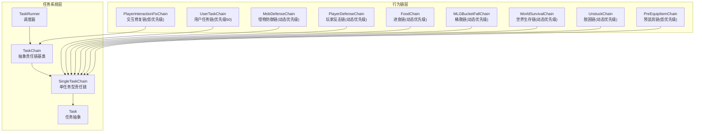
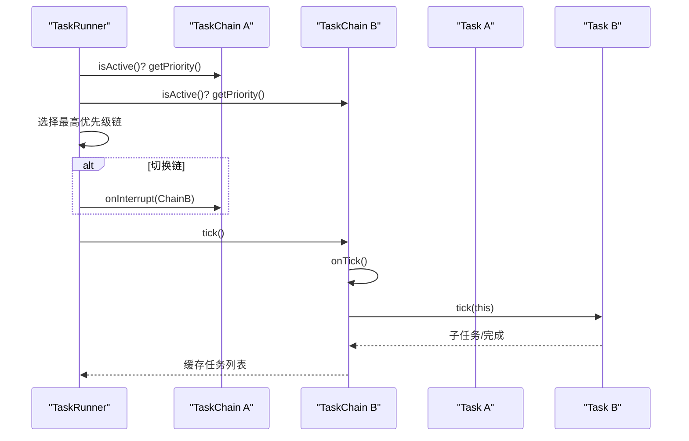
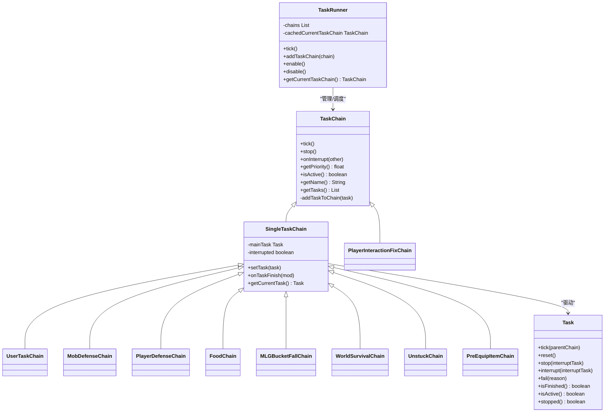
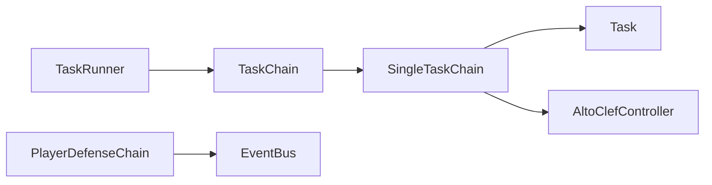

# 责任链模式

<cite>
**本文引用的文件**
- [TaskChain.java](file://src/main/java/adris/altoclef/tasksystem/TaskChain.java)
- [SingleTaskChain.java](file://src/main/java/adris/altoclef/chains/SingleTaskChain.java)
- [TaskRunner.java](file://src/main/java/adris/altoclef/tasksystem/TaskRunner.java)
- [Task.java](file://src/main/java/adris/altoclef/tasksystem/Task.java)
- [UserTaskChain.java](file://src/main/java/adris/altoclef/chains/UserTaskChain.java)
- [MobDefenseChain.java](file://src/main/java/adris/altoclef/chains/MobDefenseChain.java)
- [PlayerDefenseChain.java](file://src/main/java/adris/altoclef/chains/PlayerDefenseChain.java)
- [FoodChain.java](file://src/main/java/adris/altoclef/chains/FoodChain.java)
- [MLGBucketFallChain.java](file://src/main/java/adris/altoclef/chains/MLGBucketFallChain.java)
- [WorldSurvivalChain.java](file://src/main/java/adris/altoclef/chains/WorldSurvivalChain.java)
- [UnstuckChain.java](file://src/main/java/adris/altoclef/chains/UnstuckChain.java)
- [PlayerInteractionFixChain.java](file://src/main/java/adris/altoclef/chains/PlayerInteractionFixChain.java)
- [PreEquipItemChain.java](file://src/main/java/adris/altoclef/chains/PreEquipItemChain.java)
</cite>

## 目录
1. [简介](#简介)
2. [项目结构](#项目结构)
3. [核心组件](#核心组件)
4. [架构总览](#架构总览)
5. [详细组件分析](#详细组件分析)
6. [依赖分析](#依赖分析)
7. [性能考虑](#性能考虑)
8. [故障排查指南](#故障排查指南)
9. [结论](#结论)
10. [附录](#附录)

## 简介
本文件围绕 AI NPC 系统中的“责任链模式”进行系统化文档化，重点阐述行为链系统如何通过责任链模式实现任务执行的优先级调度与条件判断。文档将深入解析 TaskChain 基类设计、具体行为链实现（如 UserTaskChain、MobDefenseChain、PlayerDefenseChain 等）的执行逻辑与链式调用传递机制，并给出 UML 序列图展示责任链的执行流程。同时提供可直接定位到源码的路径示例，帮助读者快速添加新行为链并调整执行顺序；最后总结该模式在 AI 决策系统中的优势、设计原则与性能优化建议。

## 项目结构
责任链相关的核心代码位于以下模块：
- 任务系统层：Task、TaskChain、SingleTaskChain、TaskRunner
- 行为链层：UserTaskChain、MobDefenseChain、PlayerDefenseChain、FoodChain、MLGBucketFallChain、WorldSurvivalChain、UnstuckChain、PlayerInteractionFixChain、PreEquipItemChain

图表来源
- [TaskChain.java:7-50](file://src/main/java/adris/altoclef/tasksystem/TaskChain.java#L7-L50)
- [SingleTaskChain.java:11-95](file://src/main/java/adris/altoclef/chains/SingleTaskChain.java#L11-L95)
- [TaskRunner.java:9-97](file://src/main/java/adris/altoclef/tasksystem/TaskRunner.java#L9-L97)
- [Task.java:8-180](file://src/main/java/adris/altoclef/tasksystem/Task.java#L8-L180)
- [UserTaskChain.java:14-222](file://src/main/java/adris/altoclef/chains/UserTaskChain.java#L14-L222)
- [MobDefenseChain.java:74-683](file://src/main/java/adris/altoclef/chains/MobDefenseChain.java#L74-L683)
- [PlayerDefenseChain.java:19-188](file://src/main/java/adris/altoclef/chains/PlayerDefenseChain.java#L19-L188)
- [FoodChain.java:23-228](file://src/main/java/adris/altoclef/chains/FoodChain.java#L23-L228)
- [MLGBucketFallChain.java:21-138](file://src/main/java/adris/altoclef/chains/MLGBucketFallChain.java#L21-L138)
- [WorldSurvivalChain.java:27-166](file://src/main/java/adris/altoclef/chains/WorldSurvivalChain.java#L27-L166)
- [UnstuckChain.java:21-162](file://src/main/java/adris/altoclef/chains/UnstuckChain.java#L21-L162)
- [PlayerInteractionFixChain.java:22-137](file://src/main/java/adris/altoclef/chains/PlayerInteractionFixChain.java#L22-L137)
- [PreEquipItemChain.java:13-62](file://src/main/java/adris/altoclef/chains/PreEquipItemChain.java#L13-L62)

章节来源
- [TaskChain.java:7-50](file://src/main/java/adris/altoclef/tasksystem/TaskChain.java#L7-L50)
- [TaskRunner.java:9-97](file://src/main/java/adris/altoclef/tasksystem/TaskRunner.java#L9-L97)

## 核心组件
- TaskChain 抽象责任链基类
  - 提供生命周期钩子：onTick、onStop、onInterrupt
  - 提供优先级接口：getPriority、isActive、getName
  - 维护链内缓存任务列表：getTasks、addTaskToChain
  - 在构造时注册到 TaskRunner 并注入控制器上下文
- SingleTaskChain 单任务型责任链
  - 维护 mainTask 当前任务实例
  - 在 tick 中驱动 mainTask 的生命周期：tick、finish 或 interrupt
  - 支持任务切换与中断处理
- TaskRunner 调度器
  - 遍历所有已注册链，按 isActive 和 getPriority 选择最高优先级链
  - 在链切换时触发 onInterrupt，确保平滑过渡
  - 提供 enable/disable 控制与状态报告
- Task 任务抽象
  - 支持子任务嵌套与可中断性检查
  - 提供 fail、stop、interrupt 等控制流

章节来源
- [TaskChain.java:7-50](file://src/main/java/adris/altoclef/tasksystem/TaskChain.java#L7-L50)
- [SingleTaskChain.java:11-95](file://src/main/java/adris/altoclef/chains/SingleTaskChain.java#L11-L95)
- [TaskRunner.java:9-97](file://src/main/java/adris/altoclef/tasksystem/TaskRunner.java#L9-L97)
- [Task.java:8-180](file://src/main/java/adris/altoclef/tasksystem/Task.java#L8-L180)

## 架构总览
责任链模式在本项目中的体现：
- 多个行为链以链的形式存在，各自维护独立的优先级与激活条件
- TaskRunner 每 tick 评估各链优先级，仅激活最高优先级链
- 当前链被更高优先级链打断时，触发 onInterrupt，清理或重置当前任务
- 单任务型链（SingleTaskChain）内部持有并驱动单一主任务，支持任务切换与完成回调

图表来源
- [TaskRunner.java:22-58](file://src/main/java/adris/altoclef/tasksystem/TaskRunner.java#L22-L58)
- [TaskChain.java:16-30](file://src/main/java/adris/altoclef/tasksystem/TaskChain.java#L16-L30)
- [SingleTaskChain.java:22-44](file://src/main/java/adris/altoclef/chains/SingleTaskChain.java#L22-L44)
- [Task.java:17-49](file://src/main/java/adris/altoclef/tasksystem/Task.java#L17-L49)

## 详细组件分析

### TaskChain 基类设计
- 设计要点
  - 生命周期：构造时注册到 TaskRunner；tick 清空缓存后调用 onTick；stop 清理并调用 onStop
  - 优先级与激活：由子类实现 getPriority、isActive；TaskRunner 依据两者决定是否参与竞争
  - 任务收集：通过 addTaskToChain 将当前 tick 执行的任务加入缓存列表，便于上层观察
  - 中断：onInterrupt 接收“更高优先级链”的引用，用于清理或降级当前任务
- 适用场景
  - 任何需要“按优先级竞争执行权”的行为模块均可继承该基类

章节来源
- [TaskChain.java:7-50](file://src/main/java/adris/altoclef/tasksystem/TaskChain.java#L7-L50)

### SingleTaskChain 单任务型链
- 设计要点
  - 维护 mainTask，若未完成则持续 tick；完成后回调 onTaskFinish
  - setTask 支持任务切换：若新旧任务不相等，则停止旧任务并启动新任务
  - 中断：onInterrupt 标记 interrupted 并向 mainTask 发送 interrupt
- 适用场景
  - 需要“单一主任务驱动”的行为链，如用户任务、防御链、生存链等

章节来源
- [SingleTaskChain.java:11-95](file://src/main/java/adris/altoclef/chains/SingleTaskChain.java#L11-L95)

### TaskRunner 调度器
- 设计要点
  - 遍历所有链，计算最大优先级链并记录缓存
  - 链切换时调用 onInterrupt，避免任务冲突
  - enable/disable 控制行为栈与输入接管
- 性能注意
  - 遍历链的时间复杂度 O(N)，N 为链数量；可通过减少链数量或降低链的 getPriority 计算频率优化

章节来源
- [TaskRunner.java:9-97](file://src/main/java/adris/altoclef/tasksystem/TaskRunner.java#L9-L97)

### 具体行为链实现

#### UserTaskChain 用户任务链
- 优先级：固定 50
- 功能要点
  - 运行用户下发的任务，支持强制重启同一任务以解决状态卡住问题
  - 距离监控：超过阈值自动返回主人或警告
  - 完成回调：根据设置决定是否进入空闲命令
- 使用场景
  - 承载 LLM 生成的用户指令，如跟随、采集、合成等

章节来源
- [UserTaskChain.java:14-222](file://src/main/java/adris/altoclef/chains/UserTaskChain.java#L14-L222)

#### MobDefenseChain 怪物防御链
- 优先级：动态计算，最高可达 80+，并受玩家攻击覆盖影响
- 功能要点
  - 根据环境危险度（火、箭、苦力怕、药水、龙之息等）动态选择逃跑、格挡、反击或力场
  - 可配置“玩家覆盖攻击”，限制其优先级低于用户任务链
- 使用场景
  - 自动防御与生存策略，优先保障 NPC 生命安全

章节来源
- [MobDefenseChain.java:74-683](file://src/main/java/adris/altoclef/chains/MobDefenseChain.java#L74-L683)

#### PlayerDefenseChain 玩家反击链
- 优先级：动态计算，命中阈值达到后返回 55
- 功能要点
  - 订阅伤害事件与挥砍事件，统计玩家攻击次数
  - 达到阈值后锁定目标并发起反击
- 使用场景
  - 对恶意玩家的自动反击，保护 NPC 不受骚扰

章节来源
- [PlayerDefenseChain.java:19-188](file://src/main/java/adris/altoclef/chains/PlayerDefenseChain.java#L19-L188)

#### FoodChain 进食链
- 优先级：动态计算，通常 55 左右，必要时触发收集食物
- 功能要点
  - 结合饥饿、健康、效果与 Dragon Breath 状态，决定是否进食或收集
  - 与防御链互斥，避免在格挡/防御时强行进食
- 使用场景
  - 维持 NPC 生存状态的基础链

章节来源
- [FoodChain.java:23-228](file://src/main/java/adris/altoclef/chains/FoodChain.java#L23-L228)

#### MLGBucketFallChain 桶救链
- 优先级：动态计算，落地瞬间最高可达 100
- 功能要点
  - 检测自由落体并自动执行桶救；随后尝试回收水桶
  - 与 levitation 效果联动，必要时使用瞬移食物
- 使用场景
  - 防止摔落伤害与漂浮异常

章节来源
- [MLGBucketFallChain.java:21-138](file://src/main/java/adris/altoclef/chains/MLGBucketFallChain.java#L21-L138)

#### WorldSurvivalChain 世界生存链
- 优先级：动态计算，紧急情况可达 100
- 功能要点
  - 火焰/岩浆逃生、灭火、避免溺水、处理传送门卡顿
  - 与交互修复链配合，保证基础生存
- 使用场景
  - 处理世界环境对 NPC 的即时威胁

章节来源
- [WorldSurvivalChain.java:27-166](file://src/main/java/adris/altoclef/chains/WorldSurvivalChain.java#L27-L166)

#### UnstuckChain 脱困链
- 优先级：动态计算，通常 65
- 功能要点
  - 检测卡水、踩粉末雪、吃食卡顿、端口框架卡住等异常
  - 触发相应脱困任务或随机 Shimmy
- 使用场景
  - 修复客户端/路径异常导致的状态停滞

章节来源
- [UnstuckChain.java:21-162](file://src/main/java/adris/altoclef/chains/UnstuckChain.java#L21-L162)

#### PlayerInteractionFixChain 交互修复链
- 优先级：较低，常为负无穷或接近负无穷
- 功能要点
  - 自动更换更优工具、释放误按的按键、整理光标物品
  - 与用户任务链协作，避免交互异常
- 使用场景
  - 作为“兜底修复链”，提升稳定性

章节来源
- [PlayerInteractionFixChain.java:22-137](file://src/main/java/adris/altoclef/chains/PlayerInteractionFixChain.java#L22-L137)

#### PreEquipItemChain 预装具链
- 优先级：较低，常为负数
- 功能要点
  - 在即将进行战斗或破坏前，预判并装备合适武器
- 使用场景
  - 优化战斗准备效率

章节来源
- [PreEquipItemChain.java:13-62](file://src/main/java/adris/altoclef/chains/PreEquipItemChain.java#L13-L62)

### 类关系图（代码级）

图表来源
- [TaskChain.java:7-50](file://src/main/java/adris/altoclef/tasksystem/TaskChain.java#L7-L50)
- [SingleTaskChain.java:11-95](file://src/main/java/adris/altoclef/chains/SingleTaskChain.java#L11-L95)
- [TaskRunner.java:9-97](file://src/main/java/adris/altoclef/tasksystem/TaskRunner.java#L9-L97)
- [Task.java:8-180](file://src/main/java/adris/altoclef/tasksystem/Task.java#L8-L180)
- [UserTaskChain.java:14-222](file://src/main/java/adris/altoclef/chains/UserTaskChain.java#L14-L222)
- [MobDefenseChain.java:74-683](file://src/main/java/adris/altoclef/chains/MobDefenseChain.java#L74-L683)
- [PlayerDefenseChain.java:19-188](file://src/main/java/adris/altoclef/chains/PlayerDefenseChain.java#L19-L188)
- [FoodChain.java:23-228](file://src/main/java/adris/altoclef/chains/FoodChain.java#L23-L228)
- [MLGBucketFallChain.java:21-138](file://src/main/java/adris/altoclef/chains/MLGBucketFallChain.java#L21-L138)
- [WorldSurvivalChain.java:27-166](file://src/main/java/adris/altoclef/chains/WorldSurvivalChain.java#L27-L166)
- [UnstuckChain.java:21-162](file://src/main/java/adris/altoclef/chains/UnstuckChain.java#L21-L162)
- [PlayerInteractionFixChain.java:22-137](file://src/main/java/adris/altoclef/chains/PlayerInteractionFixChain.java#L22-L137)
- [PreEquipItemChain.java:13-62](file://src/main/java/adris/altoclef/chains/PreEquipItemChain.java#L13-L62)

## 依赖分析
- 组件耦合
  - TaskRunner 与 TaskChain：单向依赖，负责调度与中断
  - SingleTaskChain 与 Task：双向协作，链驱动任务生命周期
  - 各行为链之间低耦合，通过优先级竞争获得执行权
- 外部依赖
  - 控制器上下文（AltoClefController）贯穿链与任务，提供世界、实体、库存、行为等能力
  - 事件总线（EventBus）用于 PlayerDefenseChain 的伤害事件订阅

图表来源
- [TaskRunner.java:9-97](file://src/main/java/adris/altoclef/tasksystem/TaskRunner.java#L9-L97)
- [SingleTaskChain.java:11-95](file://src/main/java/adris/altoclef/chains/SingleTaskChain.java#L11-L95)
- [PlayerDefenseChain.java:19-188](file://src/main/java/adris/altoclef/chains/PlayerDefenseChain.java#L19-L188)

章节来源
- [TaskRunner.java:9-97](file://src/main/java/adris/altoclef/tasksystem/TaskRunner.java#L9-L97)
- [SingleTaskChain.java:11-95](file://src/main/java/adris/altoclef/chains/SingleTaskChain.java#L11-L95)
- [PlayerDefenseChain.java:19-188](file://src/main/java/adris/altoclef/chains/PlayerDefenseChain.java#L19-L188)

## 性能考虑
- 优先级计算
  - 动态优先级链（如 MobDefenseChain、PlayerDefenseChain、FoodChain）应尽量复用缓存结果，避免每 tick 重复昂贵计算
- 链数量控制
  - 减少不必要的链数量，或在非必要时返回负无穷优先级，降低 TaskRunner 的遍历成本
- 任务切换
  - SingleTaskChain 的 setTask 已具备去重逻辑，避免相同任务反复重启带来的开销
- 输入接管
  - TaskRunner.enable/disable 会切换行为栈与输入接管，频繁开关可能带来额外开销，建议在链切换时谨慎使用

## 故障排查指南
- 任务无法开始或卡住
  - 检查链的 isActive 与 getPriority 是否正确返回
  - 确认 TaskRunner 是否处于 active 状态
  - 参考路径：[TaskRunner.java:64-83](file://src/main/java/adris/altoclef/tasksystem/TaskRunner.java#L64-L83)
- 高优先级链打断用户任务
  - UserTaskChain 优先级固定 50；若被更高优先级链打断，确认是否为防御链或生存链
  - 参考路径：[UserTaskChain.java:124-126](file://src/main/java/adris/altoclef/chains/UserTaskChain.java#L124-L126)
- 防御链优先级过高导致无法手动攻击
  - MobDefenseChain 支持“玩家覆盖攻击”限制其优先级，避免与用户攻击冲突
  - 参考路径：[MobDefenseChain.java:159-163](file://src/main/java/adris/altoclef/chains/MobDefenseChain.java#L159-L163)
- 进食链与防御链冲突
  - FoodChain 会在防御链格挡时主动停止进食，确保生存优先
  - 参考路径：[FoodChain.java:72-74](file://src/main/java/adris/altoclef/chains/FoodChain.java#L72-L74)
- 桶救链未触发
  - 检查是否满足自由落体条件与设置开关
  - 参考路径：[MLGBucketFallChain.java:128-137](file://src/main/java/adris/altoclef/chains/MLGBucketFallChain.java#L128-L137)
- 世界生存链未生效
  - 确认是否处于紧急状态（火焰/岩浆/溺水），并检查设置项
  - 参考路径：[WorldSurvivalChain.java:48-50](file://src/main/java/adris/altoclef/chains/WorldSurvivalChain.java#L48-L50)

章节来源
- [TaskRunner.java:64-83](file://src/main/java/adris/altoclef/tasksystem/TaskRunner.java#L64-L83)
- [UserTaskChain.java:124-126](file://src/main/java/adris/altoclef/chains/UserTaskChain.java#L124-L126)
- [MobDefenseChain.java:159-163](file://src/main/java/adris/altoclef/chains/MobDefenseChain.java#L159-L163)
- [FoodChain.java:72-74](file://src/main/java/adris/altoclef/chains/FoodChain.java#L72-L74)
- [MLGBucketFallChain.java:128-137](file://src/main/java/adris/altoclef/chains/MLGBucketFallChain.java#L128-L137)
- [WorldSurvivalChain.java:48-50](file://src/main/java/adris/altoclef/chains/WorldSurvivalChain.java#L48-L50)

## 结论
责任链模式在 AI NPC 系统中提供了清晰的“优先级竞争 + 条件判断 + 链式传递”的执行模型。通过 TaskChain/SingleTaskChain/TaskRunner 的分层设计，系统实现了：
- 灵活的任务组合：任意行为链可按需启用/禁用
- 明确的优先级管理：动态优先级与固定优先级并存，满足不同场景
- 强大的动态调整能力：链间可相互打断，任务可动态切换
- 可扩展性：新增行为链只需继承基类并实现关键方法，即可无缝接入调度器

## 附录

### 如何添加新的行为链
- 步骤
  - 新建类继承 SingleTaskChain 或 TaskChain，实现 getPriority、isActive、getName
  - 在构造函数中调用父类构造，完成注册
  - 在合适的时机 setTask 切换任务
  - 若需要全局中断通知，重写 onInterrupt
- 示例路径
  - [SingleTaskChain.java:17-20](file://src/main/java/adris/altoclef/chains/SingleTaskChain.java#L17-L20)
  - [TaskChain.java:11-14](file://src/main/java/adris/altoclef/tasksystem/TaskChain.java#L11-L14)

章节来源
- [SingleTaskChain.java:17-20](file://src/main/java/adris/altoclef/chains/SingleTaskChain.java#L17-L20)
- [TaskChain.java:11-14](file://src/main/java/adris/altoclef/tasksystem/TaskChain.java#L11-L14)

### 如何调整执行顺序
- 方法一：修改链的优先级
  - 固定优先级链：直接调整返回值（如 UserTaskChain 为 50）
  - 动态优先级链：在 getPriority 中根据条件返回不同值
- 方法二：在非必要时返回负无穷优先级
  - 例如 PlayerInteractionFixChain、PreEquipItemChain 默认返回负无穷
- 示例路径
  - [UserTaskChain.java:124-126](file://src/main/java/adris/altoclef/chains/UserTaskChain.java#L124-L126)
  - [PlayerInteractionFixChain.java:128-131](file://src/main/java/adris/altoclef/chains/PlayerInteractionFixChain.java#L128-L131)

章节来源
- [UserTaskChain.java:124-126](file://src/main/java/adris/altoclef/chains/UserTaskChain.java#L124-L126)
- [PlayerInteractionFixChain.java:128-131](file://src/main/java/adris/altoclef/chains/PlayerInteractionFixChain.java#L128-L131)

### 责任链模式在 AI 决策系统中的优势
- 灵活的任务组合：链可独立启停，组合出复杂决策树
- 优先级管理：明确的优先级体系使高危/紧急任务优先执行
- 动态调整：事件驱动与状态驱动结合，实现自适应行为
- 可观测性：TaskRunner 缓存链内任务列表，便于调试与可视化