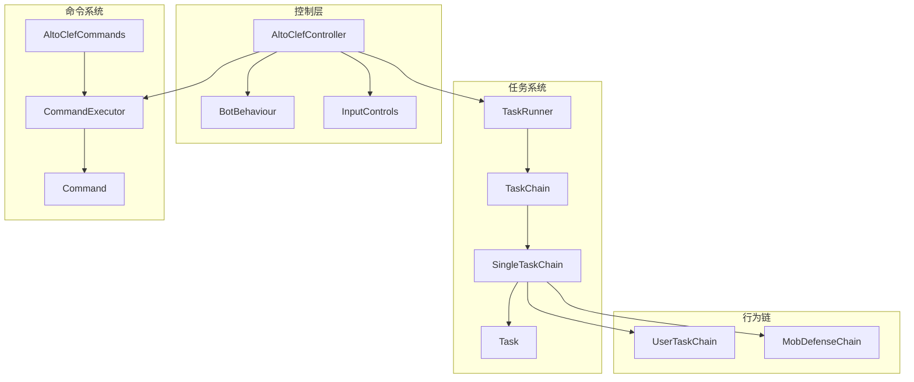
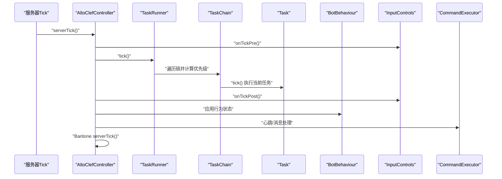
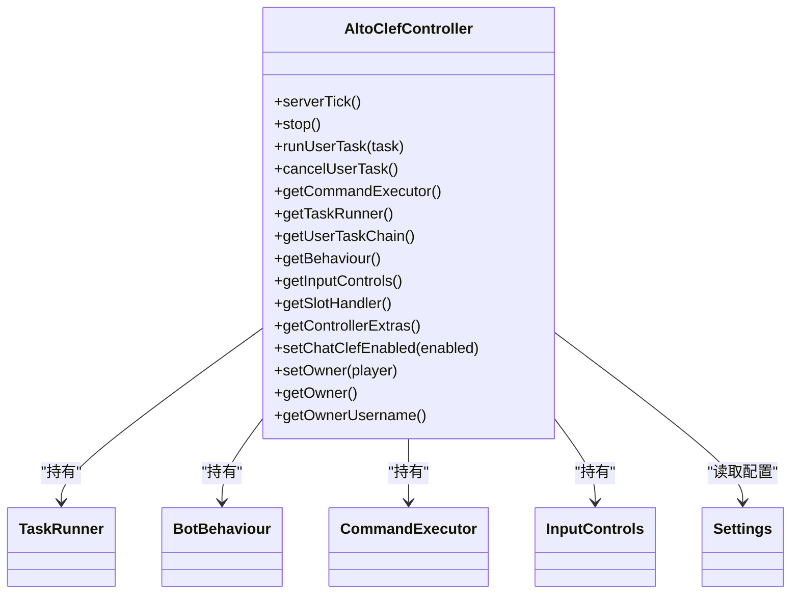
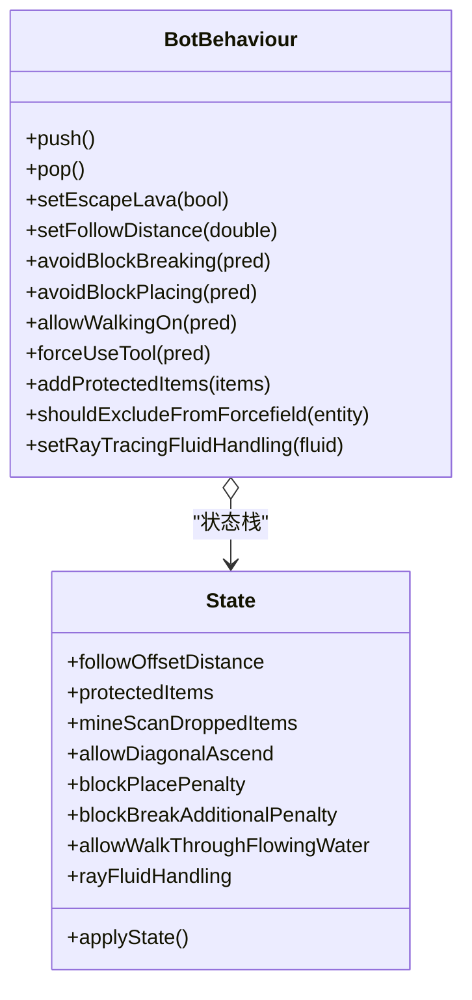
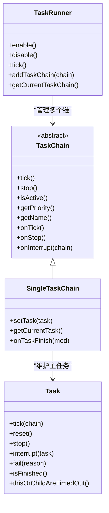
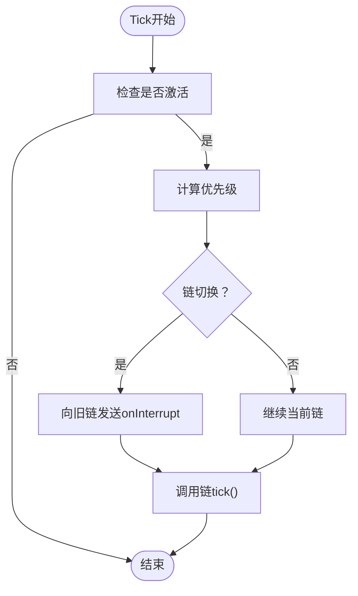
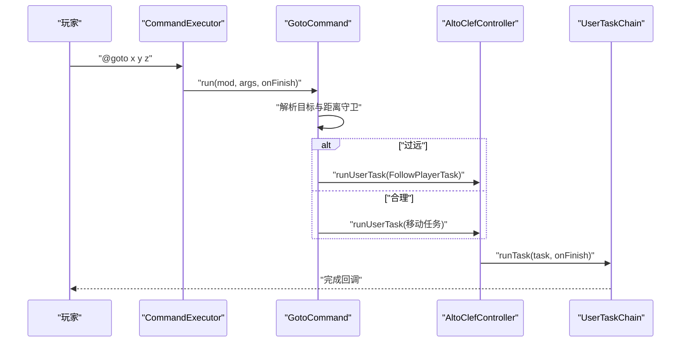
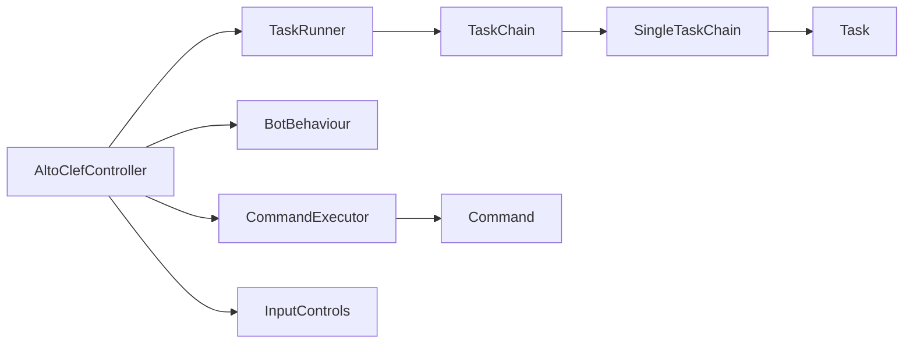

# AI任务执行系统模块

<cite>
**本文引用的文件**
- [AltoClefController.java](file://src/main/java/adris/altoclef/AltoClefController.java)
- [BotBehaviour.java](file://src/main/java/adris/altoclef/BotBehaviour.java)
- [TaskRunner.java](file://src/main/java/adris/altoclef/tasksystem/TaskRunner.java)
- [TaskChain.java](file://src/main/java/adris/altoclef/tasksystem/TaskChain.java)
- [Task.java](file://src/main/java/adris/altoclef/tasksystem/Task.java)
- [SingleTaskChain.java](file://src/main/java/adris/altoclef/chains/SingleTaskChain.java)
- [UserTaskChain.java](file://src/main/java/adris/altoclef/chains/UserTaskChain.java)
- [MobDefenseChain.java](file://src/main/java/adris/altoclef/chains/MobDefenseChain.java)
- [CommandExecutor.java](file://src/main/java/adris/altoclef/commandsystem/CommandExecutor.java)
- [AltoClefCommands.java](file://src/main/java/adris/altoclef/AltoClefCommands.java)
- [Command.java](file://src/main/java/adris/altoclef/commandsystem/Command.java)
- [Settings.java](file://src/main/java/adris/altoclef/Settings.java)
- [FollowPlayerTask.java](file://src/main/java/adris/altoclef/tasks/movement/FollowPlayerTask.java)
- [KillEntitiesTask.java](file://src/main/java/adris/altoclef/tasks/entity/KillEntitiesTask.java)
- [GotoCommand.java](file://src/main/java/adris/altoclef/commands/GotoCommand.java)
- [FollowOwnerCommand.java](file://src/main/java/adris/altoclef/commands/FollowOwnerCommand.java)
- [InputControls.java](file://src/main/java/adris/altoclef/control/InputControls.java)
</cite>

## 目录
1. [引言](#引言)
2. [项目结构](#项目结构)
3. [核心组件](#核心组件)
4. [架构总览](#架构总览)
5. [详细组件分析](#详细组件分析)
6. [依赖分析](#依赖分析)
7. [性能考虑](#性能考虑)
8. [故障排查指南](#故障排查指南)
9. [结论](#结论)
10. [附录](#附录)

## 引言
本文件面向AI任务执行系统模块，聚焦于adris/altoclef包中的核心AI控制层设计与实现，围绕以下主题展开：统一控制器AltoClefController的角色与职责、BotBehaviour行为状态机的实现方式、TaskRunner任务调度器的工作原理；行为链系统（如UserTaskChain、MobDefenseChain等）的优先级机制与执行流程；任务系统框架（Task、TaskChain、TaskRunner）的设计模式；以及命令执行系统（CommandExecutor）如何将自然语言指令解析并转化为具体的游戏动作。文档同时提供可视化图示与代码路径引用，帮助读者快速把握模块间协作关系与数据流向。

## 项目结构
该模块位于adris/altoclef包下，采用“按功能域分层+按职责划分”的组织方式：
- 控制层：AltoClefController作为统一入口，协调各子系统（任务、行为、输入、追踪器、命令等）
- 行为系统：BotBehaviour通过状态栈管理Baritone设置与全局策略
- 任务系统：Task/TaskChain/TaskRunner构成可中断、可优先级调度的任务执行框架
- 行为链：SingleTaskChain派生出UserTaskChain、MobDefenseChain等，分别负责用户任务与生存防御
- 命令系统：CommandExecutor解析命令行，调用具体Command实现
- 控制与输入：InputControls封装对Baritone输入覆盖层的操作



图表来源
- [AltoClefController.java:83-134](file://src/main/java/adris/altoclef/AltoClefController.java#L83-L134)
- [TaskRunner.java:17-98](file://src/main/java/adris/altoclef/tasksystem/TaskRunner.java#L17-L98)
- [TaskChain.java:11-51](file://src/main/java/adris/altoclef/tasksystem/TaskChain.java#L11-L51)
- [SingleTaskChain.java:17-96](file://src/main/java/adris/altoclef/chains/SingleTaskChain.java#L17-L96)
- [UserTaskChain.java:36-223](file://src/main/java/adris/altoclef/chains/UserTaskChain.java#L36-L223)
- [MobDefenseChain.java:74-684](file://src/main/java/adris/altoclef/chains/MobDefenseChain.java#L74-L684)
- [CommandExecutor.java:16-121](file://src/main/java/adris/altoclef/commandsystem/CommandExecutor.java#L16-L121)
- [AltoClefCommands.java:30-59](file://src/main/java/adris/altoclef/AltoClefCommands.java#L30-L59)

章节来源
- [AltoClefController.java:53-134](file://src/main/java/adris/altoclef/AltoClefController.java#L53-L134)

## 核心组件
本节从系统视角概述关键构件及其职责：
- AltoClefController：统一控制器，初始化并编排任务运行器、行为状态机、追踪器、命令执行器、输入控制、AI持久化与服务等；在服务端每Tick驱动各子系统更新
- BotBehaviour：基于状态栈的行为策略管理器，将高层策略映射为Baritone设置（如避让、工具使用、全局启发式等），支持入栈/出栈切换
- TaskRunner：多行为链的调度器，按优先级选择当前活跃链并驱动其tick；支持启用/禁用与中断通知
- TaskChain/SingleTaskChain：抽象行为链接口与单任务链实现，负责维护当前主任务、任务切换、中断与完成回调
- Task：任务基类，支持启动/执行/停止/中断、子任务嵌套、超时检测与强制打断策略
- CommandExecutor：命令解析与串行执行器，支持前缀识别、分段命令链、异常传播与完成回调
- InputControls：对Baritone输入覆盖层的薄封装，提供按键按下/保持/释放与强制视角控制

章节来源
- [AltoClefController.java:53-134](file://src/main/java/adris/altoclef/AltoClefController.java#L53-L134)
- [BotBehaviour.java:22-343](file://src/main/java/adris/altoclef/BotBehaviour.java#L22-L343)
- [TaskRunner.java:9-98](file://src/main/java/adris/altoclef/tasksystem/TaskRunner.java#L9-L98)
- [TaskChain.java:7-51](file://src/main/java/adris/altoclef/tasksystem/TaskChain.java#L7-L51)
- [SingleTaskChain.java:11-96](file://src/main/java/adris/altoclef/chains/SingleTaskChain.java#L11-L96)
- [Task.java:8-181](file://src/main/java/adris/altoclef/tasksystem/Task.java#L8-L181)
- [CommandExecutor.java:11-121](file://src/main/java/adris/altoclef/commandsystem/CommandExecutor.java#L11-L121)
- [InputControls.java:11-54](file://src/main/java/adris/altoclef/control/InputControls.java#L11-L54)

## 架构总览
下图展示了AI控制层的整体交互：AltoClefController在每Tick内驱动任务系统、行为状态机与输入控制，并通过命令系统接收外部指令，最终由Baritone执行底层寻路与动作。



图表来源
- [AltoClefController.java:136-150](file://src/main/java/adris/altoclef/AltoClefController.java#L136-L150)
- [TaskRunner.java:22-58](file://src/main/java/adris/altoclef/tasksystem/TaskRunner.java#L22-L58)
- [SingleTaskChain.java:22-44](file://src/main/java/adris/altoclef/chains/SingleTaskChain.java#L22-L44)
- [Task.java:17-50](file://src/main/java/adris/altoclef/tasksystem/Task.java#L17-L50)
- [InputControls.java:44-52](file://src/main/java/adris/altoclef/control/InputControls.java#L44-L52)
- [BotBehaviour.java:265-340](file://src/main/java/adris/altoclef/BotBehaviour.java#L265-L340)

## 详细组件分析

### 统一控制器 AltoClefController
- 职责
  - 初始化并持有任务运行器、行为状态机、追踪器、命令执行器、输入控制、槽位处理器、额外控制器等
  - 在每Tick驱动输入控制、追踪器、扫描器、任务运行器、Baritone与AI服务的心跳
  - 提供便捷访问器方法，暴露各子系统实例
  - 管理设置加载与Baritone参数初始化
- 关键点
  - 通过Settings配置动态调整行为（如抛投物避让、放置/破坏限制、空闲命令等）
  - 支持暂停/停止、所有者绑定与距离监控（自动返回）



图表来源
- [AltoClefController.java:53-404](file://src/main/java/adris/altoclef/AltoClefController.java#L53-L404)
- [Settings.java:32-357](file://src/main/java/adris/altoclef/Settings.java#L32-L357)

章节来源
- [AltoClefController.java:83-134](file://src/main/java/adris/altoclef/AltoClefController.java#L83-L134)
- [AltoClefController.java:136-150](file://src/main/java/adris/altoclef/AltoClefController.java#L136-L150)

### 行为状态机 BotBehaviour
- 设计要点
  - 使用状态栈保存/恢复行为策略，支持push/pop切换
  - 将高层策略映射为Baritone设置（如避让破坏/放置、允许行走/穿越、工具使用策略、全局启发式等）
  - 提供保护物品列表、力场排除条件、流体射线处理等能力
- 作用
  - 在TaskRunner启用/禁用时，通过push/pop确保Baritone设置正确入栈/出栈
  - 随任务链切换时，即时应用新状态



图表来源
- [BotBehaviour.java:22-343](file://src/main/java/adris/altoclef/BotBehaviour.java#L22-L343)

章节来源
- [BotBehaviour.java:187-222](file://src/main/java/adris/altoclef/BotBehaviour.java#L187-L222)
- [BotBehaviour.java:265-340](file://src/main/java/adris/altoclef/BotBehaviour.java#L265-L340)

### 任务系统框架：Task、TaskChain、TaskRunner
- Task
  - 生命周期：start → tick（可能嵌套子任务）→ stop/interrupt
  - 支持调试状态、超时检测、强制打断策略（ITaskCanForce）
- TaskChain
  - 抽象行为链，暴露isActive/getPriority/getName/onTick/onStop/onInterrupt
  - SingleTaskChain实现单主任务管理与切换
- TaskRunner
  - 多链优先级选择：遍历活跃链，取最高优先级链驱动
  - 启用/禁用时push/pop行为状态
  - 中断通知：当链切换时向旧链发送onInterrupt



图表来源
- [Task.java:8-181](file://src/main/java/adris/altoclef/tasksystem/Task.java#L8-L181)
- [TaskChain.java:7-51](file://src/main/java/adris/altoclef/tasksystem/TaskChain.java#L7-L51)
- [SingleTaskChain.java:11-96](file://src/main/java/adris/altoclef/chains/SingleTaskChain.java#L11-L96)
- [TaskRunner.java:9-98](file://src/main/java/adris/altoclef/tasksystem/TaskRunner.java#L9-L98)

章节来源
- [Task.java:17-164](file://src/main/java/adris/altoclef/tasksystem/Task.java#L17-L164)
- [SingleTaskChain.java:54-94](file://src/main/java/adris/altoclef/chains/SingleTaskChain.java#L54-L94)
- [TaskRunner.java:22-84](file://src/main/java/adris/altoclef/tasksystem/TaskRunner.java#L22-L84)

### 行为链系统：UserTaskChain 与 MobDefenseChain
- UserTaskChain
  - 用户任务链，固定优先级，负责执行用户下发的任务并进行距离监控与自动返回
  - 支持“空闲任务”信号与完成回调
- MobDefenseChain
  - 生存防御链，动态计算威胁并选择逃跑/格挡/攻击/力场等策略
  - 通过实体追踪、射弹预测、伤害评估等逻辑决定优先级
  - 可被玩家显式攻击覆盖，从而降低优先级以避免冲突



图表来源
- [TaskRunner.java:22-58](file://src/main/java/adris/altoclef/tasksystem/TaskRunner.java#L22-L58)
- [SingleTaskChain.java:22-44](file://src/main/java/adris/altoclef/chains/SingleTaskChain.java#L22-L44)
- [UserTaskChain.java:124-131](file://src/main/java/adris/altoclef/chains/UserTaskChain.java#L124-L131)
- [MobDefenseChain.java:152-167](file://src/main/java/adris/altoclef/chains/MobDefenseChain.java#L152-L167)

章节来源
- [UserTaskChain.java:64-114](file://src/main/java/adris/altoclef/chains/UserTaskChain.java#L64-L114)
- [UserTaskChain.java:133-201](file://src/main/java/adris/altoclef/chains/UserTaskChain.java#L133-L201)
- [MobDefenseChain.java:203-407](file://src/main/java/adris/altoclef/chains/MobDefenseChain.java#L203-L407)

### 命令执行系统：CommandExecutor 与 Command
- CommandExecutor
  - 注册命令、解析命令行（支持分号分隔的命令序列）、前缀识别、递归执行与异常传播
  - 支持带前缀的快捷执行
- Command
  - 抽象命令基类，封装参数解析、帮助信息与完成回调
- AltoClefCommands
  - 初始化并注册全部可用命令

```mermaid
sequenceDiagram
participant Player as "玩家"
participant CE as "CommandExecutor"
participant Parser as "ArgParser"
participant Cmd as "Command"
participant Mod as "AltoClefController"
Player->>CE : "execute(line)"
CE->>CE : "isClientCommand() 前缀匹配"
CE->>CE : "split(';') 分割命令"
CE->>Cmd : "getCommand(name)"
CE->>Parser : "loadArgs(line)"
CE->>Cmd : "run(mod, args, onFinish)"
Cmd->>Mod : "调用具体任务或操作"
Cmd-->>CE : "finish()"
CE-->>Player : "完成回调"
```

图表来源
- [CommandExecutor.java:38-92](file://src/main/java/adris/altoclef/commandsystem/CommandExecutor.java#L38-L92)
- [Command.java:19-51](file://src/main/java/adris/altoclef/commandsystem/Command.java#L19-L51)
- [AltoClefCommands.java:30-59](file://src/main/java/adris/altoclef/AltoClefCommands.java#L30-L59)

章节来源
- [CommandExecutor.java:16-121](file://src/main/java/adris/altoclef/commandsystem/CommandExecutor.java#L16-L121)
- [Command.java:6-61](file://src/main/java/adris/altoclef/commandsystem/Command.java#L6-L61)
- [AltoClefCommands.java:30-59](file://src/main/java/adris/altoclef/AltoClefCommands.java#L30-L59)

### 自然语言指令到游戏动作的转化示例
- goto命令：解析坐标/维度目标，根据距离守卫拒绝过远目标并回退为跟随；否则生成移动任务并交由用户任务链执行
- follow_owner命令：若存在所有者则生成跟随任务并交由用户任务链执行



图表来源
- [GotoCommand.java:42-64](file://src/main/java/adris/altoclef/commands/GotoCommand.java#L42-L64)
- [FollowOwnerCommand.java:14-22](file://src/main/java/adris/altoclef/commands/FollowOwnerCommand.java#L14-L22)
- [UserTaskChain.java:133-168](file://src/main/java/adris/altoclef/chains/UserTaskChain.java#L133-L168)

章节来源
- [GotoCommand.java:32-64](file://src/main/java/adris/altoclef/commands/GotoCommand.java#L32-L64)
- [FollowOwnerCommand.java:8-23](file://src/main/java/adris/altoclef/commands/FollowOwnerCommand.java#L8-L23)

## 依赖分析
- 组件耦合
  - AltoClefController对各子系统强聚合，但通过访问器解耦上层业务
  - TaskRunner与TaskChain之间为松耦合的管理关系，SingleTaskChain与Task形成强绑定
  - BotBehaviour与Baritone设置强耦合，通过状态栈实现策略切换
  - CommandExecutor与Command之间为注册与调用关系
- 外部依赖
  - Baritone作为底层寻路与输入控制引擎
  - Fabric事件系统用于服务器Tick钩子
- 循环依赖
  - 未发现直接循环依赖；链与任务通过接口解耦



图表来源
- [AltoClefController.java:83-134](file://src/main/java/adris/altoclef/AltoClefController.java#L83-L134)
- [TaskRunner.java:17-98](file://src/main/java/adris/altoclef/tasksystem/TaskRunner.java#L17-L98)
- [TaskChain.java:11-51](file://src/main/java/adris/altoclef/tasksystem/TaskChain.java#L11-L51)
- [SingleTaskChain.java:17-96](file://src/main/java/adris/altoclef/chains/SingleTaskChain.java#L17-L96)
- [Task.java:17-50](file://src/main/java/adris/altoclef/tasksystem/Task.java#L17-L50)
- [CommandExecutor.java:16-121](file://src/main/java/adris/altoclef/commandsystem/CommandExecutor.java#L16-L121)
- [Command.java:19-51](file://src/main/java/adris/altoclef/commandsystem/Command.java#L19-L51)

章节来源
- [AltoClefController.java:53-134](file://src/main/java/adris/altoclef/AltoClefController.java#L53-L134)

## 性能考虑
- 任务优先级选择
  - TaskRunner按活跃链遍历并比较优先级，建议行为链优先级应具备明确分层，避免频繁切换导致开销
- 子任务嵌套与强制打断
  - Task支持子任务嵌套与强制打断策略，需谨慎使用强制策略以免造成频繁重启
- 输入控制抖动
  - InputControls在每Tick前后清空临时按键，避免长按残留；建议命令执行与任务执行尽量短时、幂等
- 设置加载与Baritone参数
  - Settings加载失败会标记失败状态，建议在初始化阶段捕获并降级处理

## 故障排查指南
- 任务无法停止或卡死
  - 检查Task的stop/interrupt实现与子任务清理逻辑
  - 关注强制打断策略（ITaskCanForce）是否阻止了必要的中断
- 优先级切换异常
  - 确认各行为链的isActive/getPriority实现是否稳定
  - 检查TaskRunner的链缓存与中断通知是否正确触发
- 命令解析错误
  - 查看CommandExecutor的异常传播与help信息输出
  - 确认命令名称唯一且ArgParser参数解析正确
- 行为状态不生效
  - 确认BotBehaviour的push/pop时机与applyState是否被调用
  - 检查Baritone设置是否被其他模块覆盖

章节来源
- [Task.java:58-96](file://src/main/java/adris/altoclef/tasksystem/Task.java#L58-L96)
- [TaskRunner.java:37-48](file://src/main/java/adris/altoclef/tasksystem/TaskRunner.java#L37-L48)
- [CommandExecutor.java:58-76](file://src/main/java/adris/altoclef/commandsystem/CommandExecutor.java#L58-L76)
- [BotBehaviour.java:265-340](file://src/main/java/adris/altoclef/BotBehaviour.java#L265-L340)

## 结论
本模块以AltoClefController为核心，结合BotBehaviour的状态策略、TaskRunner的优先级调度与SingleTaskChain的任务执行模型，构建了高内聚、低耦合的AI任务执行体系。命令系统通过CommandExecutor将自然语言指令解析为具体任务，最终由Baritone落地执行。该设计既保证了行为链的独立性与可扩展性，又通过统一控制器实现了跨子系统的协同与一致性。

## 附录
- 典型任务示例
  - 跟随玩家：FollowPlayerTask
  - 击杀实体：KillEntitiesTask
- 常用命令示例
  - goto：根据坐标/维度生成移动任务
  - follow_owner：跟随所有者

章节来源
- [FollowPlayerTask.java:11-75](file://src/main/java/adris/altoclef/tasks/movement/FollowPlayerTask.java#L11-L75)
- [KillEntitiesTask.java:8-33](file://src/main/java/adris/altoclef/tasks/entity/KillEntitiesTask.java#L8-L33)
- [GotoCommand.java:32-64](file://src/main/java/adris/altoclef/commands/GotoCommand.java#L32-L64)
- [FollowOwnerCommand.java:8-23](file://src/main/java/adris/altoclef/commands/FollowOwnerCommand.java#L8-L23)