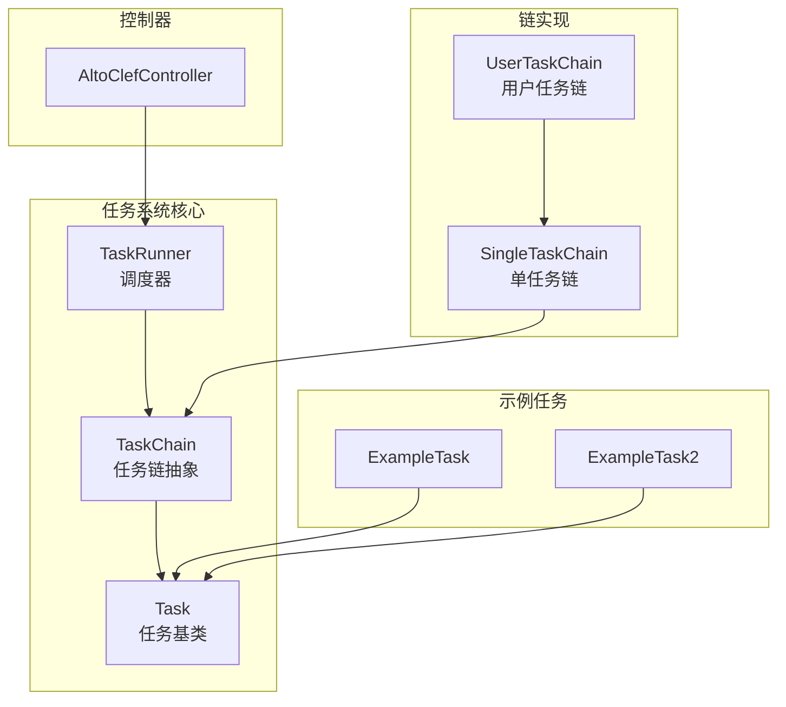
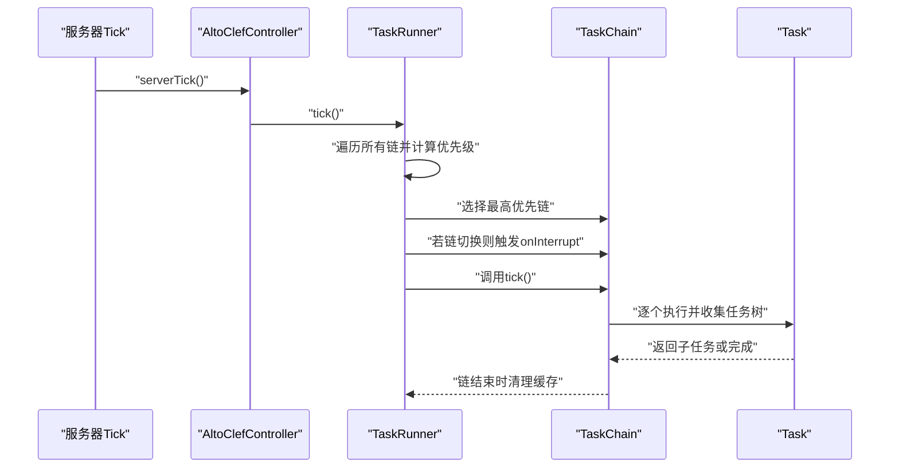
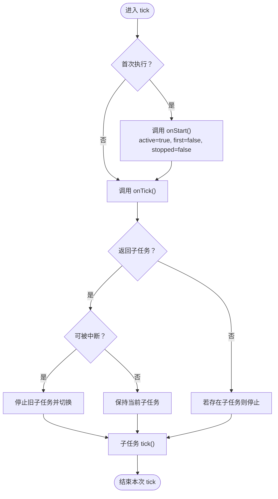
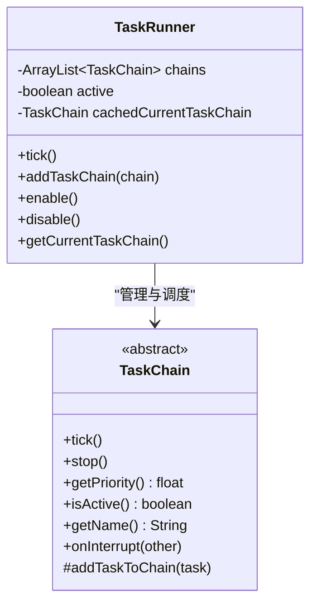
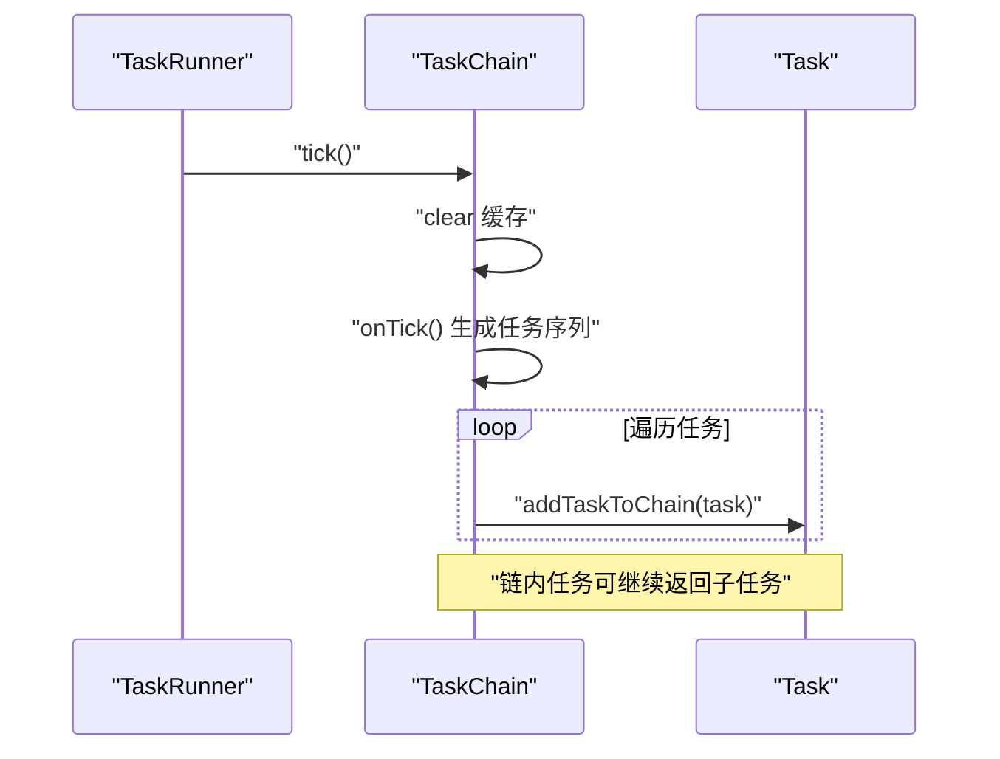
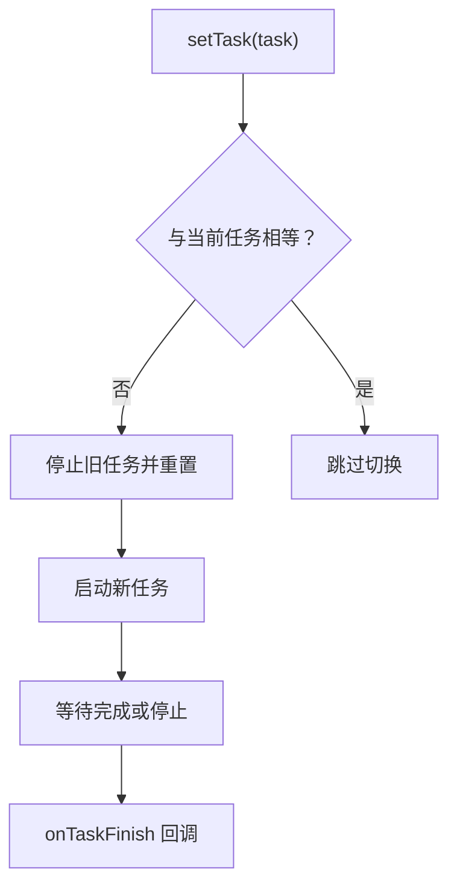
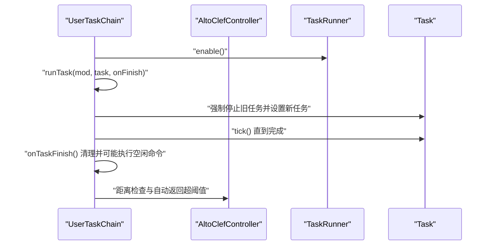
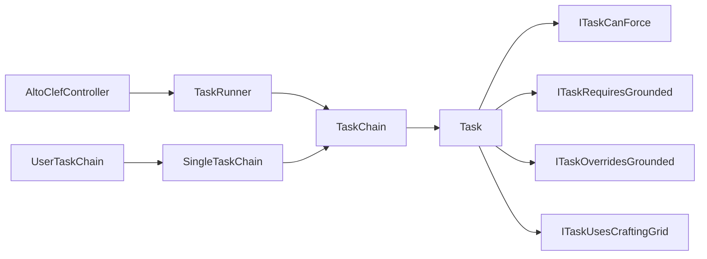

# 任务系统框架

<cite>
**本文引用的文件**
- [Task.java](file://src/main/java/adris/altoclef/tasksystem/Task.java)
- [TaskChain.java](file://src/main/java/adris/altoclef/tasksystem/TaskChain.java)
- [TaskRunner.java](file://src/main/java/adris/altoclef/tasksystem/TaskRunner.java)
- [ITaskCanForce.java](file://src/main/java/adris/altoclef/tasksystem/ITaskCanForce.java)
- [ITaskOverridesGrounded.java](file://src/main/java/adris/altoclef/tasksystem/ITaskOverridesGrounded.java)
- [ITaskRequiresGrounded.java](file://src/main/java/adris/altoclef/tasksystem/ITaskRequiresGrounded.java)
- [ITaskUsesCraftingGrid.java](file://src/main/java/adris/altoclef/tasksystem/ITaskUsesCraftingGrid.java)
- [SingleTaskChain.java](file://src/main/java/adris/altoclef/chains/SingleTaskChain.java)
- [UserTaskChain.java](file://src/main/java/adris/altoclef/chains/UserTaskChain.java)
- [ExampleTask.java](file://src/main/java/adris/altoclef/tasks/examples/ExampleTask.java)
- [ExampleTask2.java](file://src/main/java/adris/altoclef/tasks/examples/ExampleTask2.java)
- [AltoClefController.java](file://src/main/java/adris/altoclef/AltoClefController.java)
</cite>

## 目录
1. [简介](#简介)
2. [项目结构](#项目结构)
3. [核心组件](#核心组件)
4. [架构总览](#架构总览)
5. [详细组件分析](#详细组件分析)
6. [依赖关系分析](#依赖关系分析)
7. [性能考虑](#性能考虑)
8. [故障排查指南](#故障排查指南)
9. [结论](#结论)
10. [附录：示例与最佳实践](#附录示例与最佳实践)

## 简介
本文件面向任务系统框架，系统性阐述 Task 基类的设计模式与任务生命周期管理（创建、执行、暂停、恢复、完成），TaskRunner 调度器的任务队列管理、优先级排序与并发控制，以及 TaskChain 任务链的实现机制（任务间依赖关系、执行顺序与错误处理）。同时提供可直接定位到源码的路径示例，帮助开发者快速创建自定义任务、实现任务链并集成到系统中，并总结性能优化技巧与最佳实践。

## 项目结构
任务系统位于模块路径 adris/altoclef/tasksystem 下，核心由 Task、TaskChain、TaskRunner 三者构成；在 chains 包下提供具体链实现（如 SingleTaskChain、UserTaskChain）；tasks/examples 提供可参考的自定义任务示例；AltoClefController 作为控制器入口，负责初始化与驱动整个系统。

图示来源
- [Task.java:1-181](file://src/main/java/adris/altoclef/tasksystem/Task.java#L1-L181)
- [TaskChain.java:1-51](file://src/main/java/adris/altoclef/tasksystem/TaskChain.java#L1-L51)
- [TaskRunner.java:1-98](file://src/main/java/adris/altoclef/tasksystem/TaskRunner.java#L1-L98)
- [SingleTaskChain.java:1-96](file://src/main/java/adris/altoclef/chains/SingleTaskChain.java#L1-L96)
- [UserTaskChain.java:1-223](file://src/main/java/adris/altoclef/chains/UserTaskChain.java#L1-L223)
- [ExampleTask.java:1-68](file://src/main/java/adris/altoclef/tasks/examples/ExampleTask.java#L1-L68)
- [ExampleTask2.java:1-70](file://src/main/java/adris/altoclef/tasks/examples/ExampleTask2.java#L1-L70)
- [AltoClefController.java:1-200](file://src/main/java/adris/altoclef/AltoClefController.java#L1-L200)

章节来源
- [AltoClefController.java:82-133](file://src/main/java/adris/altoclef/AltoClefController.java#L82-L133)

## 核心组件
- Task：任务生命周期的最小单元，负责启动、每 tick 执行、子任务切换、停止与失败处理，并通过接口标记自身能力或约束（如是否可强制打断、是否需要贴地等）。
- TaskChain：任务链抽象，封装链级生命周期与优先级，向 TaskRunner 注册并被其调度。
- TaskRunner：全局调度器，按链的优先级选择当前活跃链，处理链间中断与状态报告。
- SingleTaskChain：单任务链实现，负责设置与运行单一主任务，处理任务完成回调与链中断。
- UserTaskChain：用户任务链，扩展单任务链，增加距离监控、语音反馈、空闲态处理等业务逻辑。

章节来源
- [Task.java:8-181](file://src/main/java/adris/altoclef/tasksystem/Task.java#L8-L181)
- [TaskChain.java:7-51](file://src/main/java/adris/altoclef/tasksystem/TaskChain.java#L7-L51)
- [TaskRunner.java:9-98](file://src/main/java/adris/altoclef/tasksystem/TaskRunner.java#L9-L98)
- [SingleTaskChain.java:11-96](file://src/main/java/adris/altoclef/chains/SingleTaskChain.java#L11-L96)
- [UserTaskChain.java:14-223](file://src/main/java/adris/altoclef/chains/UserTaskChain.java#L14-L223)

## 架构总览
任务系统采用“控制器驱动 + 链式调度 + 任务树”的分层架构。控制器在服务端 tick 中统一调用 TaskRunner.tick，TaskRunner 选择最高优先级的 TaskChain 并驱动其执行；TaskChain 在每 tick 内构建任务序列并委托给 Task 执行；Task 可返回子任务以形成嵌套执行树，支持条件中断与恢复。

图示来源
- [AltoClefController.java:135-149](file://src/main/java/adris/altoclef/AltoClefController.java#L135-L149)
- [TaskRunner.java:22-58](file://src/main/java/adris/altoclef/tasksystem/TaskRunner.java#L22-L58)
- [TaskChain.java:16-24](file://src/main/java/adris/altoclef/tasksystem/TaskChain.java#L16-L24)
- [Task.java:17-50](file://src/main/java/adris/altoclef/tasksystem/Task.java#L17-L50)

## 详细组件分析

### Task 类设计与生命周期
- 生命周期阶段
  - 创建与启动：首次 tick 时进入 onStart，标记 active=true，first=false。
  - 执行阶段：每 tick 调用 onTick，根据返回值决定是否切换/停止子任务。
  - 子任务管理：若 onTick 返回非空新子任务且满足中断条件，则替换并递归 tick；否则停止旧子任务。
  - 结束与失败：stop/interrupt 将 active=false、stopped=true，并递归停止子任务；fail 会停止当前任务并记录日志。
  - 完成判定：isFinished 默认返回 false，由具体任务覆盖。
- 调试与树形追踪：支持 setDebugState 与 toString 输出调试信息；getTaskTree 可打印当前任务及其子任务链路。
- 能力与约束接口
  - ITaskCanForce：允许任务声明是否可被强制打断。
  - ITaskRequiresGrounded：声明在特定条件下（如未贴地）不应被中断。
  - ITaskOverridesGrounded：声明可覆盖贴地约束。
  - ITaskUsesCraftingGrid：标记任务使用工作台网格。

图示来源
- [Task.java:17-50](file://src/main/java/adris/altoclef/tasksystem/Task.java#L17-L50)
- [ITaskCanForce.java:3-5](file://src/main/java/adris/altoclef/tasksystem/ITaskCanForce.java#L3-L5)
- [ITaskRequiresGrounded.java:5-15](file://src/main/java/adris/altoclef/tasksystem/ITaskRequiresGrounded.java#L5-L15)

章节来源
- [Task.java:17-181](file://src/main/java/adris/altoclef/tasksystem/Task.java#L17-L181)

### TaskRunner 调度器
- 任务队列管理：维护 TaskChain 列表，通过 addTaskChain 注册。
- 优先级排序：遍历所有激活链，取最高优先级链作为当前链；链切换时触发原链 onInterrupt。
- 并发控制：同一时刻仅一个链处于活跃状态；链内可包含多层嵌套任务树。
- 状态报告：维护 statusReport 字段，便于外部观察当前链与优先级。
- 启停控制：enable/disable 时对底层行为栈进行 push/pop，确保输入接管与释放。

图示来源
- [TaskRunner.java:9-98](file://src/main/java/adris/altoclef/tasksystem/TaskRunner.java#L9-L98)
- [TaskChain.java:7-51](file://src/main/java/adris/altoclef/tasksystem/TaskChain.java#L7-L51)

章节来源
- [TaskRunner.java:22-98](file://src/main/java/adris/altoclef/tasksystem/TaskRunner.java#L22-L98)

### TaskChain 任务链
- 抽象职责：封装链级生命周期、优先级、激活条件与名称；在每 tick 内清空并重建任务缓存，收集链上所有任务以便调试与统计。
- 与 TaskRunner 的协作：构造函数自动注册到 TaskRunner；tick 时由 TaskRunner 调用。
- 与 Task 的协作：Task 在 tick 时通过 addTaskToChain 将自身加入链的任务缓存。

图示来源
- [TaskChain.java:16-44](file://src/main/java/adris/altoclef/tasksystem/TaskChain.java#L16-L44)
- [Task.java:19-20](file://src/main/java/adris/altoclef/tasksystem/Task.java#L19-L20)

章节来源
- [TaskChain.java:16-51](file://src/main/java/adris/altoclef/tasksystem/TaskChain.java#L16-L51)

### SingleTaskChain 单任务链
- 主任务管理：setTask 支持切换主任务，若新旧任务不相等则停止旧任务并重置新任务；若链被中断则在下次 tick 重置主任务。
- 完成回调：当主任务完成或停止时触发 onTaskFinish，用于链级收尾与状态更新。
- 中断处理：onInterrupt 标记 interrupted=true，并对当前主任务执行 interrupt。

图示来源
- [SingleTaskChain.java:54-95](file://src/main/java/adris/altoclef/chains/SingleTaskChain.java#L54-L95)

章节来源
- [SingleTaskChain.java:22-95](file://src/main/java/adris/altoclef/chains/SingleTaskChain.java#L22-L95)

### UserTaskChain 用户任务链
- 距离监控：定期检查 NPC 与玩家的距离，超过阈值时发出警告并自动返回。
- 语音反馈：按间隔播报进度，增强交互体验。
- 空闲态处理：任务完成后可执行空闲命令或保持空闲状态。
- 任务设置策略：在设置新任务前强制停止当前任务，避免“相等”导致的静默跳过问题。

图示来源
- [UserTaskChain.java:133-201](file://src/main/java/adris/altoclef/chains/UserTaskChain.java#L133-L201)
- [AltoClefController.java:135-149](file://src/main/java/adris/altoclef/AltoClefController.java#L135-L149)

章节来源
- [UserTaskChain.java:65-223](file://src/main/java/adris/altoclef/chains/UserTaskChain.java#L65-L223)

### 自定义任务示例
- 示例一：ExampleTask 展示了从资源收集到放置方块的完整流程，体现任务内部条件判断与子任务切换。
- 示例二：ExampleTask2 展示了基于扫描与漫游的寻物任务，体现任务与环境扫描器的协作。

章节来源
- [ExampleTask.java:12-68](file://src/main/java/adris/altoclef/tasks/examples/ExampleTask.java#L12-L68)
- [ExampleTask2.java:14-70](file://src/main/java/adris/altoclef/tasks/examples/ExampleTask2.java#L14-L70)

## 依赖关系分析
- Task 与 TaskChain：Task 在 tick 时将自身加入 TaskChain 的缓存列表，形成“链-任务树”的关系。
- Task 与接口：Task 通过 ITaskCanForce/ITaskRequiresGrounded 等接口表达自身能力与约束，影响链间切换与中断策略。
- TaskRunner 与 TaskChain：TaskRunner 维护链集合，按优先级选择当前链；链切换时触发原链 onInterrupt。
- 控制器与系统：AltoClefController 在 serverTick 中统一驱动 TaskRunner，串联各子系统。

图示来源
- [AltoClefController.java:86-96](file://src/main/java/adris/altoclef/AltoClefController.java#L86-L96)
- [TaskRunner.java:11-20](file://src/main/java/adris/altoclef/tasksystem/TaskRunner.java#L11-L20)
- [TaskChain.java:11-14](file://src/main/java/adris/altoclef/tasksystem/TaskChain.java#L11-L14)
- [Task.java:152-164](file://src/main/java/adris/altoclef/tasksystem/Task.java#L152-L164)
- [ITaskCanForce.java:3-5](file://src/main/java/adris/altoclef/tasksystem/ITaskCanForce.java#L3-L5)
- [ITaskRequiresGrounded.java:5-15](file://src/main/java/adris/altoclef/tasksystem/ITaskRequiresGrounded.java#L5-L15)
- [SingleTaskChain.java:17-20](file://src/main/java/adris/altoclef/chains/SingleTaskChain.java#L17-L20)
- [UserTaskChain.java:36-38](file://src/main/java/adris/altoclef/chains/UserTaskChain.java#L36-L38)

章节来源
- [AltoClefController.java:82-133](file://src/main/java/adris/altoclef/AltoClefController.java#L82-L133)

## 性能考虑
- 任务树深度与中断成本：频繁切换子任务会带来额外开销，建议在 onTick 中合并相似步骤，减少不必要的子任务创建。
- 链切换频率：TaskRunner 每 tick 遍历所有链计算优先级，应避免链优先级频繁抖动；可通过平滑策略或冷却时间降低切换次数。
- 缓存与复用：TaskChain 的任务缓存每 tick 清空重建，尽量避免在 onTick 中产生大量临时对象；必要时在链级做轻量缓存。
- I/O 与网络：UserTaskChain 中的语音播报与距离检查涉及日志与网络，建议限制频率与批量处理，避免阻塞 tick。
- 并发与输入接管：TaskRunner 启停时对底层行为栈进行 push/pop，注意避免在高频 tick 中重复操作。

## 故障排查指南
- 任务无法停止或卡死
  - 检查 isFinished 是否正确实现，以及子任务是否被正确停止。
  - 使用 getTaskTree 查看任务树，确认是否存在未停止的子任务。
- 任务链切换异常
  - 确认链的 isActive/getPriority 实现是否稳定；检查 ITaskRequiresGrounded/ITaskOverridesGrounded 的约束是否导致意外中断。
- 任务被静默跳过
  - SingleTaskChain 的 setTask 对“相等”任务会跳过，需在需要强制重启时显式停止旧任务后再设置新任务。
- 日志与状态
  - TaskRunner 与 UserTaskChain 维护状态报告与日志输出，结合 statusReport 与日志定位问题。

章节来源
- [Task.java:166-181](file://src/main/java/adris/altoclef/tasksystem/Task.java#L166-L181)
- [SingleTaskChain.java:54-67](file://src/main/java/adris/altoclef/chains/SingleTaskChain.java#L54-L67)
- [TaskRunner.java:37-48](file://src/main/java/adris/altoclef/tasksystem/TaskRunner.java#L37-L48)

## 结论
该任务系统通过 Task/TaskChain/TaskRunner 的清晰分层，提供了灵活的任务生命周期管理与链式调度能力。借助接口化的能力声明与约束，系统可在不同场景下安全地进行任务中断与优先级切换。配合 UserTaskChain 的业务增强（如距离监控、语音反馈），可满足复杂交互需求。遵循本文的最佳实践与性能建议，可进一步提升系统的稳定性与可维护性。

## 附录：示例与最佳实践

### 如何创建自定义任务
- 继承 Task，实现以下方法：
  - onStart/onStop：在任务开始/停止时进行资源保护/释放。
  - onTick：返回下一步要执行的子任务，或返回 null 表示完成。
  - isFinished：判断任务是否完成。
  - isEqual/toDebugString：用于任务相等性比较与调试输出。
- 参考路径
  - [ExampleTask.java:12-68](file://src/main/java/adris/altoclef/tasks/examples/ExampleTask.java#L12-L68)
  - [ExampleTask2.java:14-70](file://src/main/java/adris/altoclef/tasks/examples/ExampleTask2.java#L14-L70)

### 如何实现任务链
- 使用 SingleTaskChain 或 UserTaskChain：
  - SingleTaskChain：适合单一主任务的链，负责设置任务与完成回调。
  - UserTaskChain：在单任务链基础上增加距离监控、语音反馈与空闲态处理。
- 参考路径
  - [SingleTaskChain.java:11-96](file://src/main/java/adris/altoclef/chains/SingleTaskChain.java#L11-L96)
  - [UserTaskChain.java:14-223](file://src/main/java/adris/altoclef/chains/UserTaskChain.java#L14-L223)

### 如何集成到系统
- 在控制器中初始化 TaskRunner 与各链，并在 serverTick 中统一驱动：
  - 初始化与注册：参见构造函数中的链注册。
  - Tick 驱动：serverTick 中调用 taskRunner.tick。
- 参考路径
  - [AltoClefController.java:82-133](file://src/main/java/adris/altoclef/AltoClefController.java#L82-L133)
  - [AltoClefController.java:135-149](file://src/main/java/adris/altoclef/AltoClefController.java#L135-L149)

### 最佳实践清单
- 任务粒度：将复杂动作拆分为多个可组合的小任务，便于复用与测试。
- 优先级设计：为链提供稳定的优先级评估，避免频繁切换。
- 中断策略：合理使用 ITaskCanForce/ITaskRequiresGrounded，确保关键任务在合适时机不被中断。
- 资源管理：在 onStart/onStop 中成对申请/释放资源，防止泄漏。
- 调试可观测：利用 setDebugState 与 getTaskTree 输出关键状态，便于定位问题。