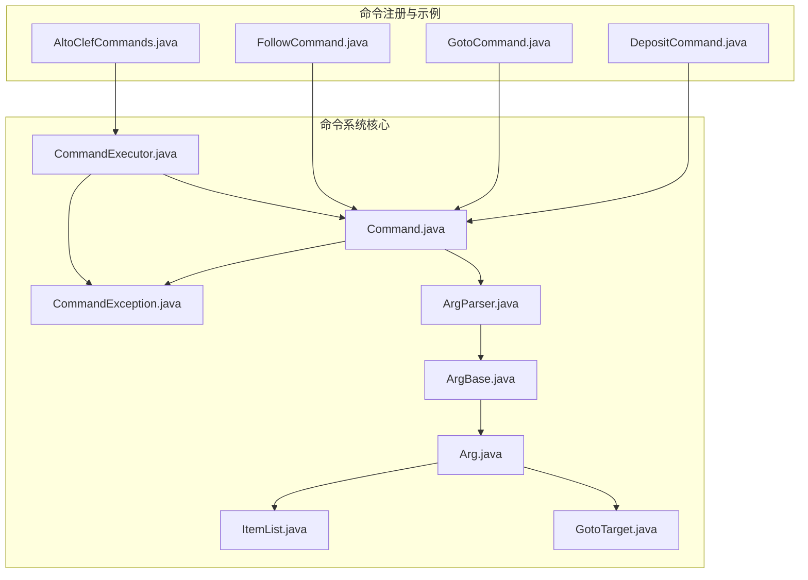
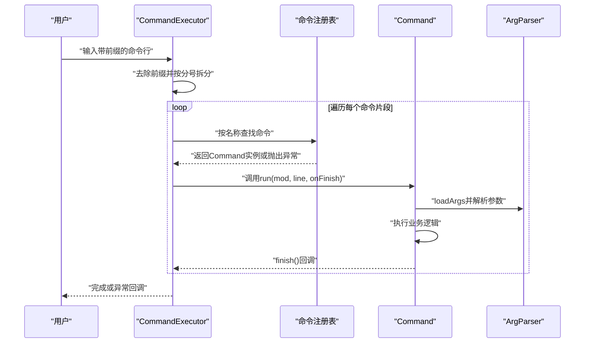
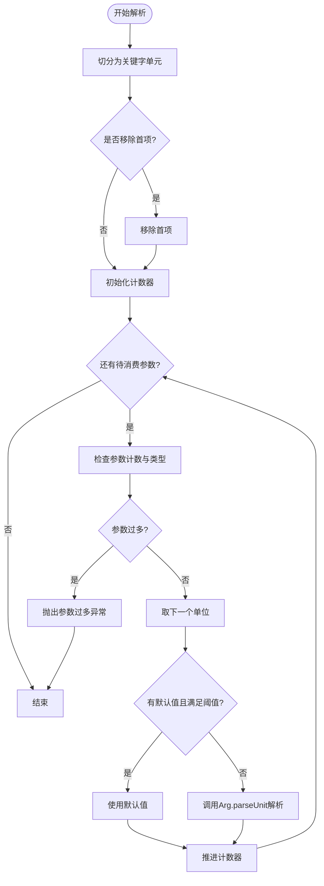
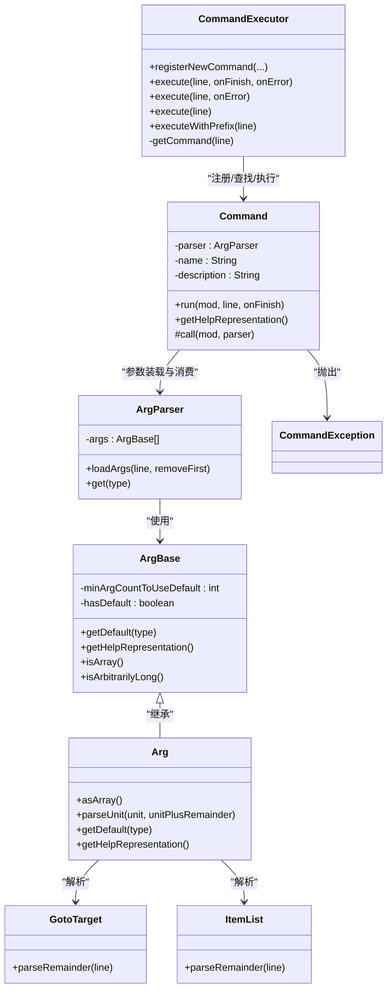

# 命令执行系统

<cite>
**本文引用的文件**
- [CommandExecutor.java](file://src/main/java/adris/altoclef/commandsystem/CommandExecutor.java)
- [Command.java](file://src/main/java/adris/altoclef/commandsystem/Command.java)
- [ArgParser.java](file://src/main/java/adris/altoclef/commandsystem/ArgParser.java)
- [ArgBase.java](file://src/main/java/adris/altoclef/commandsystem/ArgBase.java)
- [Arg.java](file://src/main/java/adris/altoclef/commandsystem/Arg.java)
- [GotoTarget.java](file://src/main/java/adris/altoclef/commandsystem/GotoTarget.java)
- [ItemList.java](file://src/main/java/adris/altoclef/commandsystem/ItemList.java)
- [CommandException.java](file://src/main/java/adris/altoclef/commandsystem/CommandException.java)
- [AltoClefCommands.java](file://src/main/java/adris/altoclef/AltoClefCommands.java)
- [FollowCommand.java](file://src/main/java/adris/altoclef/commands/FollowCommand.java)
- [GotoCommand.java](file://src/main/java/adris/altoclef/commands/GotoCommand.java)
- [DepositCommand.java](file://src/main/java/adris/altoclef/commands/DepositCommand.java)
</cite>

## 目录
1. [简介](#简介)
2. [项目结构](#项目结构)
3. [核心组件](#核心组件)
4. [架构总览](#架构总览)
5. [详细组件分析](#详细组件分析)
6. [依赖分析](#依赖分析)
7. [性能考虑](#性能考虑)
8. [故障排查指南](#故障排查指南)
9. [结论](#结论)
10. [附录：扩展与自定义命令开发指南](#附录扩展与自定义命令开发指南)

## 简介
本文件面向“命令执行系统”的设计与实现，围绕以下目标展开：
- 深入解释命令执行器的设计架构，包括命令解析、参数处理与执行流程
- 详解 Command 基类的实现机制，包括命令注册、权限验证与执行上下文管理
- 解释 ArgParser 参数解析器的工作原理，包括参数类型识别、验证规则与错误处理
- 提供具体示例路径，展示如何实现自定义命令、添加参数解析器与集成到系统
- 给出扩展方法与自定义命令的开发指南

## 项目结构
命令系统位于模块内的命令执行子系统，核心文件集中在命令系统包下，同时在命令实现层提供了多个具体命令示例。下图展示了与命令系统相关的核心文件与它们之间的关系。

图表来源
- [CommandExecutor.java:1-121](file://src/main/java/adris/altoclef/commandsystem/CommandExecutor.java#L1-L121)
- [Command.java:1-61](file://src/main/java/adris/altoclef/commandsystem/Command.java#L1-L61)
- [ArgParser.java:1-106](file://src/main/java/adris/altoclef/commandsystem/ArgParser.java#L1-L106)
- [ArgBase.java:1-44](file://src/main/java/adris/altoclef/commandsystem/ArgBase.java#L1-L44)
- [Arg.java:1-171](file://src/main/java/adris/altoclef/commandsystem/Arg.java#L1-L171)
- [GotoTarget.java:1-102](file://src/main/java/adris/altoclef/commandsystem/GotoTarget.java#L1-L102)
- [ItemList.java:1-90](file://src/main/java/adris/altoclef/commandsystem/ItemList.java#L1-L90)
- [CommandException.java:1-12](file://src/main/java/adris/altoclef/commandsystem/CommandException.java#L1-L12)
- [AltoClefCommands.java:1-59](file://src/main/java/adris/altoclef/AltoClefCommands.java#L1-L59)
- [FollowCommand.java:1-33](file://src/main/java/adris/altoclef/commands/FollowCommand.java#L1-L33)
- [GotoCommand.java:1-66](file://src/main/java/adris/altoclef/commands/GotoCommand.java#L1-L66)
- [DepositCommand.java:1-97](file://src/main/java/adris/altoclef/commands/DepositCommand.java#L1-L97)

章节来源
- [CommandExecutor.java:1-121](file://src/main/java/adris/altoclef/commandsystem/CommandExecutor.java#L1-L121)
- [Command.java:1-61](file://src/main/java/adris/altoclef/commandsystem/Command.java#L1-L61)
- [ArgParser.java:1-106](file://src/main/java/adris/altoclef/commandsystem/ArgParser.java#L1-L106)
- [ArgBase.java:1-44](file://src/main/java/adris/altoclef/commandsystem/ArgBase.java#L1-L44)
- [Arg.java:1-171](file://src/main/java/adris/altoclef/commandsystem/Arg.java#L1-L171)
- [GotoTarget.java:1-102](file://src/main/java/adris/altoclef/commandsystem/GotoTarget.java#L1-L102)
- [ItemList.java:1-90](file://src/main/java/adris/altoclef/commandsystem/ItemList.java#L1-L90)
- [CommandException.java:1-12](file://src/main/java/adris/altoclef/commandsystem/CommandException.java#L1-L12)
- [AltoClefCommands.java:1-59](file://src/main/java/adris/altoclef/AltoClefCommands.java#L1-L59)
- [FollowCommand.java:1-33](file://src/main/java/adris/altoclef/commands/FollowCommand.java#L1-L33)
- [GotoCommand.java:1-66](file://src/main/java/adris/altoclef/commands/GotoCommand.java#L1-L66)
- [DepositCommand.java:1-97](file://src/main/java/adris/altoclef/commands/DepositCommand.java#L1-L97)

## 核心组件
本节对命令系统的关键组件进行深入剖析，涵盖职责、数据结构、复杂度与性能影响。

- CommandExecutor：命令执行器，负责命令注册、前缀识别、命令拆分与递归执行、异常收集与回调完成通知。
- Command：抽象命令基类，封装参数解析器、帮助信息生成、日志记录与执行上下文（控制器实例）传递。
- ArgParser：参数解析器，负责将输入行切分为关键字单元、按顺序消费参数、处理默认值与数组参数、调用具体 Arg 的解析逻辑。
- ArgBase/Arg：参数类型抽象与具体实现，支持字符串、数值、枚举、以及特定领域类型（如 GotoTarget、ItemList），并提供帮助表示与默认值策略。
- GotoTarget/ItemList：领域特定参数类型，用于坐标目标与物品列表解析，具备容错与模糊匹配提示能力。
- CommandException：命令系统统一异常类型，便于上层收集与展示。

章节来源
- [CommandExecutor.java:1-121](file://src/main/java/adris/altoclef/commandsystem/CommandExecutor.java#L1-L121)
- [Command.java:1-61](file://src/main/java/adris/altoclef/commandsystem/Command.java#L1-L61)
- [ArgParser.java:1-106](file://src/main/java/adris/altoclef/commandsystem/ArgParser.java#L1-L106)
- [ArgBase.java:1-44](file://src/main/java/adris/altoclef/commandsystem/ArgBase.java#L1-L44)
- [Arg.java:1-171](file://src/main/java/adris/altoclef/commandsystem/Arg.java#L1-L171)
- [GotoTarget.java:1-102](file://src/main/java/adris/altoclef/commandsystem/GotoTarget.java#L1-L102)
- [ItemList.java:1-90](file://src/main/java/adris/altoclef/commandsystem/ItemList.java#L1-L90)
- [CommandException.java:1-12](file://src/main/java/adris/altoclef/commandsystem/CommandException.java#L1-L12)

## 架构总览
命令执行的整体流程如下：
- 输入命令行以指定前缀开头，执行器去除前缀后按分号拆分为多段命令
- 对每一段命令，根据名称从注册表中查找对应 Command 实例
- 逐个命令通过 Command.run 触发参数解析与业务执行，支持链式命令串行执行
- 执行过程中捕获 CommandException 并向上抛出，最终由调用方处理或记录

图表来源
- [CommandExecutor.java:58-76](file://src/main/java/adris/altoclef/commandsystem/CommandExecutor.java#L58-L76)
- [CommandExecutor.java:38-56](file://src/main/java/adris/altoclef/commandsystem/CommandExecutor.java#L38-L56)
- [Command.java:19-24](file://src/main/java/adris/altoclef/commandsystem/Command.java#L19-L24)
- [ArgParser.java:57-67](file://src/main/java/adris/altoclef/commandsystem/ArgParser.java#L57-L67)

## 详细组件分析

### CommandExecutor 分析
- 职责
  - 命令注册：将 Command 实例按名称注册到内部映射表，重复名会记录警告
  - 前缀识别与命令拆分：依据配置前缀判断是否为客户端命令；按分号拆分链式命令
  - 递归执行：对拆分后的命令序列逐一执行，遇到异常时收集错误并继续后续命令
  - 异常处理：捕获 CommandException 并附加帮助信息，支持回调通知完成
- 关键点
  - 命令名称唯一性检查，避免覆盖
  - 递归执行保证链式命令的顺序性与失败隔离
  - 日志记录与调试输出，便于问题定位

章节来源
- [CommandExecutor.java:20-28](file://src/main/java/adris/altoclef/commandsystem/CommandExecutor.java#L20-L28)
- [CommandExecutor.java:38-56](file://src/main/java/adris/altoclef/commandsystem/CommandExecutor.java#L38-L56)
- [CommandExecutor.java:58-76](file://src/main/java/adris/altoclef/commandsystem/CommandExecutor.java#L58-L76)
- [CommandExecutor.java:94-111](file://src/main/java/adris/altoclef/commandsystem/CommandExecutor.java#L94-L111)

### Command 基类分析
- 职责
  - 组合 ArgParser，负责加载参数与调用具体命令实现
  - 生成帮助信息，基于参数的 help 表示拼接命令签名
  - 提供日志接口与完成回调
- 执行流程
  - run 接收 mod、原始行与完成回调，设置当前上下文
  - 通过 ArgParser.loadArgs 进行参数装载
  - 调用抽象方法 call 执行业务逻辑
- 上下文管理
  - 保存 mod 与 onFinish，便于在命令内部触发任务与回调

章节来源
- [Command.java:13-17](file://src/main/java/adris/altoclef/commandsystem/Command.java#L13-L17)
- [Command.java:19-24](file://src/main/java/adris/altoclef/commandsystem/Command.java#L19-L24)
- [Command.java:32-41](file://src/main/java/adris/altoclef/commandsystem/Command.java#L32-L41)
- [Command.java:43-49](file://src/main/java/adris/altoclef/commandsystem/Command.java#L43-L49)

### ArgParser 参数解析器分析
- 关键能力
  - 关键字切分：支持引号包裹、转义字符、注释截断与空白折叠
  - 参数消费：按声明顺序消费参数，支持默认值与数组参数
  - 错误处理：在参数不足、过多、类型不匹配等场景抛出 CommandException
- 参数模型
  - 单值参数：按顺序取下一个单位
  - 默认值参数：当给定参数数量小于阈值时使用默认值
  - 数组参数：标记后一次性消耗剩余所有单位
  - 可变长参数：某些类型允许任意长度（如物品列表、坐标目标）

图表来源
- [ArgParser.java:57-67](file://src/main/java/adris/altoclef/commandsystem/ArgParser.java#L57-L67)
- [ArgParser.java:69-96](file://src/main/java/adris/altoclef/commandsystem/ArgParser.java#L69-L96)

章节来源
- [ArgParser.java:18-55](file://src/main/java/adris/altoclef/commandsystem/ArgParser.java#L18-L55)
- [ArgParser.java:57-67](file://src/main/java/adris/altoclef/commandsystem/ArgParser.java#L57-L67)
- [ArgParser.java:69-96](file://src/main/java/adris/altoclef/commandsystem/ArgParser.java#L69-L96)

### ArgBase/Arg 类型系统
- ArgBase
  - 抽象参数基类，提供默认值策略、最小参数阈值、数组与可变长标识
  - 通过泛型推导目标类型并进行转换
- Arg<T>
  - 具体参数实现，支持类型白名单（字符串、数值、枚举、ItemList、GotoTarget）
  - 枚举解析大小写不敏感，提供可用值列表提示
  - 字符串去引号、数值解析失败时抛出明确异常
  - 可选显示默认值，支持 asArray 将剩余参数作为数组一次性消费

章节来源
- [ArgBase.java:9-22](file://src/main/java/adris/altoclef/commandsystem/ArgBase.java#L9-L22)
- [ArgBase.java:24-43](file://src/main/java/adris/altoclef/commandsystem/ArgBase.java#L24-L43)
- [Arg.java:10-35](file://src/main/java/adris/altoclef/commandsystem/Arg.java#L10-L35)
- [Arg.java:37-52](file://src/main/java/adris/altoclef/commandsystem/Arg.java#L37-L52)
- [Arg.java:97-149](file://src/main/java/adris/altoclef/commandsystem/Arg.java#L97-L149)
- [Arg.java:162-169](file://src/main/java/adris/altoclef/commandsystem/Arg.java#L162-L169)

### 领域参数类型
- GotoTarget
  - 支持括号包裹、逗号分隔与空白折叠
  - 解析 x/y/z/dimension 或仅维度/单坐标等组合，返回不同坐标类型
- ItemList
  - 支持数组与单元素两种形式，自动校验资源名并提供模糊匹配建议
  - 解析失败时给出明确错误与建议

章节来源
- [GotoTarget.java:22-69](file://src/main/java/adris/altoclef/commandsystem/GotoTarget.java#L22-L69)
- [ItemList.java:16-88](file://src/main/java/adris/altoclef/commandsystem/ItemList.java#L16-L88)

### 命令注册与集成
- 注册入口
  - 通过 AltoClefCommands.init 在控制器初始化阶段批量注册命令
- 执行入口
  - CommandExecutor.execute 接受完整命令行，自动处理前缀与链式命令

章节来源
- [AltoClefCommands.java:30-57](file://src/main/java/adris/altoclef/AltoClefCommands.java#L30-L57)
- [CommandExecutor.java:58-84](file://src/main/java/adris/altoclef/commandsystem/CommandExecutor.java#L58-L84)

### 典型命令示例
- FollowCommand
  - 定义一个可选用户名参数，若未提供则回退至拥有者
  - 启动跟随任务并在完成后回调
- GotoCommand
  - 使用 GotoTarget 作为参数，根据坐标类型选择不同移动任务
  - 带距离保护：超出阈值时改为跟随拥有者
- DepositCommand
  - 使用 ItemList 作为参数，支持空参数全量存款
  - 校验库存数量，不足时提示并提前结束

章节来源
- [FollowCommand.java:10-33](file://src/main/java/adris/altoclef/commands/FollowCommand.java#L10-L33)
- [GotoCommand.java:20-66](file://src/main/java/adris/altoclef/commands/GotoCommand.java#L20-L66)
- [DepositCommand.java:23-97](file://src/main/java/adris/altoclef/commands/DepositCommand.java#L23-L97)

## 依赖分析
- 组件耦合
  - CommandExecutor 依赖 Command 注册表与控制器上下文，承担调度职责
  - Command 依赖 ArgParser 与控制器上下文，承载业务逻辑
  - ArgParser 依赖 ArgBase/Arg 族，实现类型解析
  - 领域类型（GotoTarget、ItemList）被 Arg 解析，增强参数表达力
- 外部依赖
  - 控制器（AltoClefController）贯穿执行上下文，用于启动任务与日志
  - 日志框架用于记录执行状态与告警

图表来源
- [CommandExecutor.java:1-121](file://src/main/java/adris/altoclef/commandsystem/CommandExecutor.java#L1-L121)
- [Command.java:1-61](file://src/main/java/adris/altoclef/commandsystem/Command.java#L1-L61)
- [ArgParser.java:1-106](file://src/main/java/adris/altoclef/commandsystem/ArgParser.java#L1-L106)
- [ArgBase.java:1-44](file://src/main/java/adris/altoclef/commandsystem/ArgBase.java#L1-L44)
- [Arg.java:1-171](file://src/main/java/adris/altoclef/commandsystem/Arg.java#L1-L171)
- [GotoTarget.java:1-102](file://src/main/java/adris/altoclef/commandsystem/GotoTarget.java#L1-L102)
- [ItemList.java:1-90](file://src/main/java/adris/altoclef/commandsystem/ItemList.java#L1-L90)
- [CommandException.java:1-12](file://src/main/java/adris/altoclef/commandsystem/CommandException.java#L1-L12)

## 性能考虑
- 参数解析复杂度
  - 切分关键字线性于输入长度
  - 参数消费按声明顺序线性，整体 O(N)
- 命令执行
  - 链式命令串行执行，单次执行开销主要来自业务任务启动与参数解析
- 内存占用
  - 关键字数组与参数单位数组按需分配，通常较小
- 优化建议
  - 对频繁使用的命令可缓存解析结果（视业务需求）
  - 合理使用 asArray 一次性消费，减少多次解析成本
  - 在命令内部尽量复用控制器提供的工具函数，避免重复计算

## 故障排查指南
- 常见错误类型
  - 参数过多/过少：检查命令帮助信息与参数数量
  - 类型解析失败：确认传入值格式与类型支持范围
  - 命令不存在：核对命令名称与注册情况
  - 物品名/资源名无效：参考模糊匹配建议修正
- 定位步骤
  - 查看执行器日志与异常消息
  - 使用 getHelpRepresentation 输出命令签名，核对参数位置
  - 在命令内部使用日志接口输出中间状态
- 相关实现参考
  - 异常类型与消息构造
  - 参数解析边界条件与默认值策略

章节来源
- [ArgParser.java:74-96](file://src/main/java/adris/altoclef/commandsystem/ArgParser.java#L74-L96)
- [Arg.java:91-95](file://src/main/java/adris/altoclef/commandsystem/Arg.java#L91-L95)
- [ItemList.java:42-50](file://src/main/java/adris/altoclef/commandsystem/ItemList.java#L42-L50)
- [CommandExecutor.java:52-55](file://src/main/java/adris/altoclef/commandsystem/CommandExecutor.java#L52-L55)

## 结论
该命令执行系统通过清晰的职责分离与可扩展的参数类型体系，实现了简洁而强大的命令解析与执行能力。CommandExecutor 负责调度与异常聚合，Command 负责业务与上下文，ArgParser 与 Arg 族提供稳健的参数解析与类型支持。结合领域参数类型（GotoTarget、ItemList），系统能够高效处理复杂输入并提供良好的错误反馈与帮助信息。

## 附录：扩展与自定义命令开发指南
- 开发步骤
  - 定义命令类，继承 Command，构造函数中声明参数（可使用 Arg、Arg.asArray、默认值与阈值）
  - 在 call 中读取参数并执行业务逻辑，必要时启动控制器的任务
  - 在完成时调用 finish() 回调，确保链式命令继续执行
  - 在注册入口中加入新命令实例
- 示例路径参考
  - 自定义命令模板与参数声明：[FollowCommand.java:10-33](file://src/main/java/adris/altoclef/commands/FollowCommand.java#L10-L33)
  - 使用坐标目标参数：[GotoCommand.java:20-66](file://src/main/java/adris/altoclef/commands/GotoCommand.java#L20-L66)
  - 使用物品列表参数：[DepositCommand.java:23-97](file://src/main/java/adris/altoclef/commands/DepositCommand.java#L23-L97)
  - 注册命令入口：[AltoClefCommands.java:30-57](file://src/main/java/adris/altoclef/AltoClefCommands.java#L30-L57)
- 参数解析器扩展
  - 若需新增参数类型，可在 ArgBase/Arg 体系中扩展解析逻辑，并在 Arg 中声明支持类型
  - 对于复杂类型，建议提供 parseRemainder 与 getHelpRepresentation，提升易用性
- 权限与上下文
  - 命令内部通过控制器访问世界状态与任务系统，注意在执行前进行必要的前置检查
  - 对于需要拥有者信息的命令，应提供合理的回退策略与提示

章节来源
- [FollowCommand.java:10-33](file://src/main/java/adris/altoclef/commands/FollowCommand.java#L10-L33)
- [GotoCommand.java:20-66](file://src/main/java/adris/altoclef/commands/GotoCommand.java#L20-L66)
- [DepositCommand.java:23-97](file://src/main/java/adris/altoclef/commands/DepositCommand.java#L23-L97)
- [AltoClefCommands.java:30-57](file://src/main/java/adris/altoclef/AltoClefCommands.java#L30-L57)
- [Arg.java:10-35](file://src/main/java/adris/altoclef/commandsystem/Arg.java#L10-L35)
- [Arg.java:151-154](file://src/main/java/adris/altoclef/commandsystem/Arg.java#L151-L154)