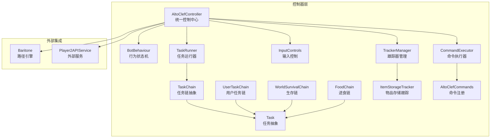
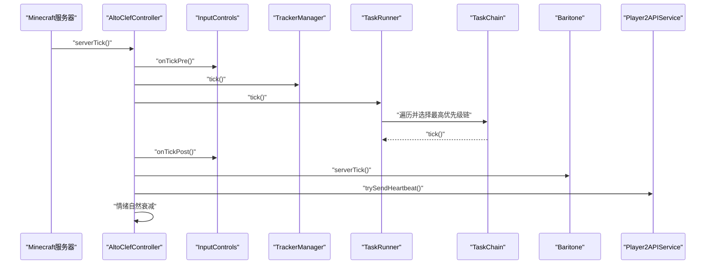
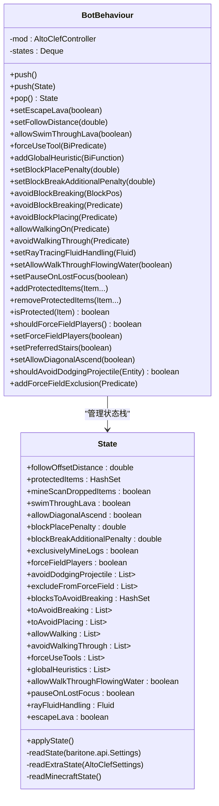
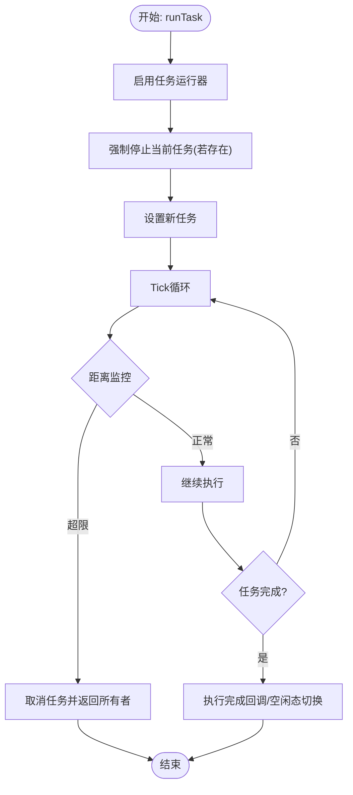
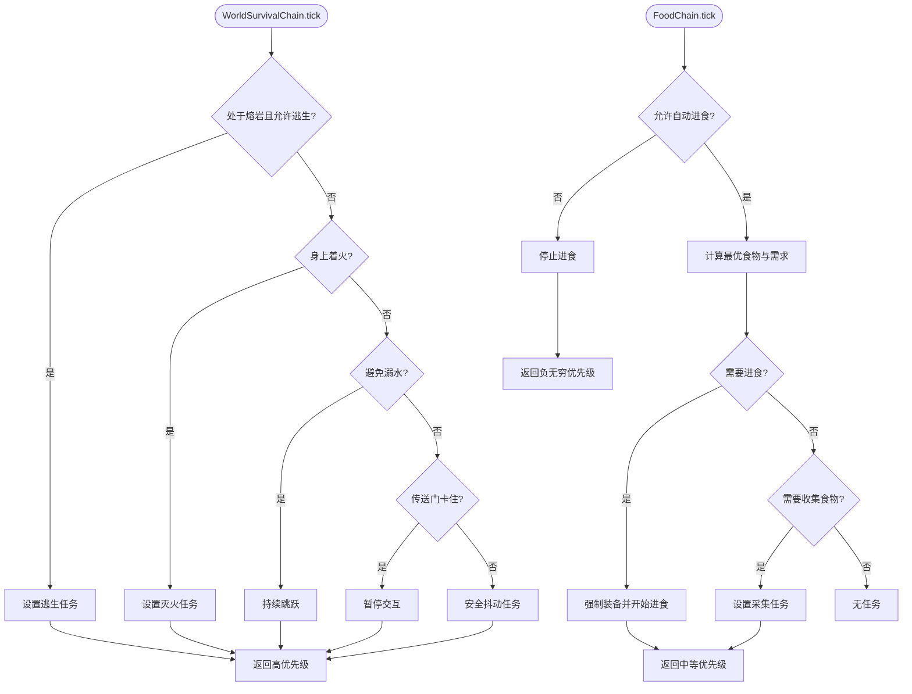
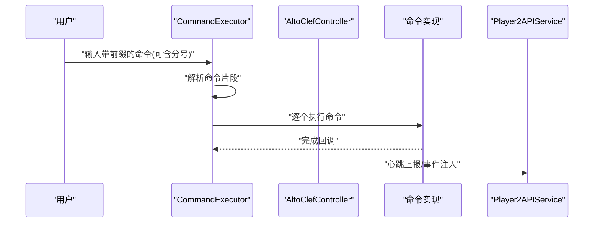
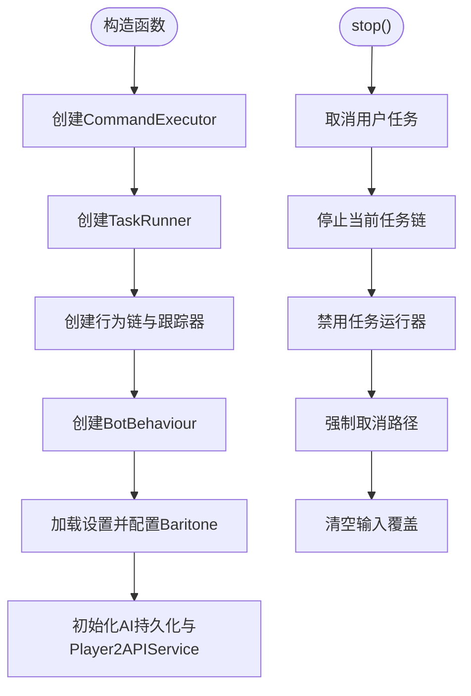
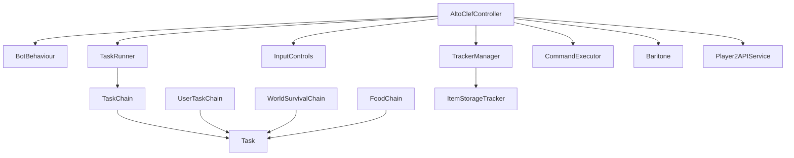

# 控制器层

<cite>
**本文引用的文件**
- [AltoClefController.java](file://src/main/java/adris/altoclef/AltoClefController.java)
- [BotBehaviour.java](file://src/main/java/adris/altoclef/BotBehaviour.java)
- [TaskRunner.java](file://src/main/java/adris/altoclef/tasksystem/TaskRunner.java)
- [TaskChain.java](file://src/main/java/adris/altoclef/tasksystem/TaskChain.java)
- [Task.java](file://src/main/java/adris/altoclef/tasksystem/Task.java)
- [UserTaskChain.java](file://src/main/java/adris/altoclef/chains/UserTaskChain.java)
- [WorldSurvivalChain.java](file://src/main/java/adris/altoclef/chains/WorldSurvivalChain.java)
- [FoodChain.java](file://src/main/java/adris/altoclef/chains/FoodChain.java)
- [CommandExecutor.java](file://src/main/java/adris/altoclef/commandsystem/CommandExecutor.java)
- [AltoClefCommands.java](file://src/main/java/adris/altoclef/AltoClefCommands.java)
- [InputControls.java](file://src/main/java/adris/altoclef/control/InputControls.java)
- [TrackerManager.java](file://src/main/java/adris/altoclef/trackers/TrackerManager.java)
- [Tracker.java](file://src/main/java/adris/altoclef/trackers/Tracker.java)
- [ItemStorageTracker.java](file://src/main/java/adris/altoclef/trackers/storage/ItemStorageTracker.java)
- [AgentConversationData.java](file://src/main/java/adris/altoclef/player2api/AgentConversationData.java)
</cite>

## 目录
1. [简介](#简介)
2. [项目结构](#项目结构)
3. [核心组件](#核心组件)
4. [架构总览](#架构总览)
5. [详细组件分析](#详细组件分析)
6. [依赖关系分析](#依赖关系分析)
7. [性能考量](#性能考量)
8. [故障排查指南](#故障排查指南)
9. [结论](#结论)
10. [附录](#附录)

## 简介
本文件聚焦于AI控制器层，系统性阐述AltoClefController作为统一AI控制中心的作用与实现方式，涵盖其如何协调任务执行、行为链、跟踪器、输入控制与外部服务；深入解析BotBehaviour行为状态机的状态栈机制、优先级调度策略与决策算法；并给出控制器生命周期管理、初始化流程与停止机制的完整说明。同时提供具体调用序列与数据流图，帮助读者快速理解控制器如何接收用户指令、调度任务执行以及处理系统事件。

## 项目结构
控制器层位于adris/altoclef包下，围绕AltoClefController为核心，向上连接命令系统、任务系统、行为链与跟踪器，向下桥接Baritone路径引擎与玩家输入控制，并通过Player2API与外部服务进行交互。主要模块划分如下：
- 控制器核心：AltoClefController
- 行为状态机：BotBehaviour
- 任务系统：TaskRunner、TaskChain、Task
- 行为链：UserTaskChain、WorldSurvivalChain、FoodChain等
- 输入控制：InputControls
- 跟踪器：TrackerManager、Tracker、ItemStorageTracker等
- 命令系统：CommandExecutor、AltoClefCommands
- 外部服务：Player2API（会话、心跳、对话队列）

图表来源
- [AltoClefController.java:53-134](file://src/main/java/adris/altoclef/AltoClefController.java#L53-L134)
- [BotBehaviour.java:22-29](file://src/main/java/adris/altoclef/BotBehaviour.java#L22-L29)
- [TaskRunner.java:9-20](file://src/main/java/adris/altoclef/tasksystem/TaskRunner.java#L9-L20)
- [TaskChain.java:7-14](file://src/main/java/adris/altoclef/tasksystem/TaskChain.java#L7-L14)
- [Task.java:8-16](file://src/main/java/adris/altoclef/tasksystem/Task.java#L8-L16)
- [UserTaskChain.java:14-38](file://src/main/java/adris/altoclef/chains/UserTaskChain.java#L14-L38)
- [WorldSurvivalChain.java:27-35](file://src/main/java/adris/altoclef/chains/WorldSurvivalChain.java#L27-L35)
- [FoodChain.java:23-35](file://src/main/java/adris/altoclef/chains/FoodChain.java#L23-L35)
- [InputControls.java:11-18](file://src/main/java/adris/altoclef/control/InputControls.java#L11-L18)
- [TrackerManager.java:6-13](file://src/main/java/adris/altoclef/trackers/TrackerManager.java#L6-L13)
- [ItemStorageTracker.java:21-30](file://src/main/java/adris/altoclef/trackers/storage/ItemStorageTracker.java#L21-L30)
- [CommandExecutor.java:11-18](file://src/main/java/adris/altoclef/commandsystem/CommandExecutor.java#L11-L18)
- [AltoClefCommands.java:29-30](file://src/main/java/adris/altoclef/AltoClefCommands.java#L29-L30)

章节来源
- [AltoClefController.java:53-134](file://src/main/java/adris/altoclef/AltoClefController.java#L53-L134)
- [TaskRunner.java:9-20](file://src/main/java/adris/altoclef/tasksystem/TaskRunner.java#L9-L20)
- [TaskChain.java:7-14](file://src/main/java/adris/altoclef/tasksystem/TaskChain.java#L7-L14)
- [Task.java:8-16](file://src/main/java/adris/altoclef/tasksystem/Task.java#L8-L16)
- [UserTaskChain.java:14-38](file://src/main/java/adris/altoclef/chains/UserTaskChain.java#L14-L38)
- [WorldSurvivalChain.java:27-35](file://src/main/java/adris/altoclef/chains/WorldSurvivalChain.java#L27-L35)
- [FoodChain.java:23-35](file://src/main/java/adris/altoclef/chains/FoodChain.java#L23-L35)
- [InputControls.java:11-18](file://src/main/java/adris/altoclef/control/InputControls.java#L11-L18)
- [TrackerManager.java:6-13](file://src/main/java/adris/altoclef/trackers/TrackerManager.java#L6-L13)
- [ItemStorageTracker.java:21-30](file://src/main/java/adris/altoclef/trackers/storage/ItemStorageTracker.java#L21-L30)
- [CommandExecutor.java:11-18](file://src/main/java/adris/altoclef/commandsystem/CommandExecutor.java#L11-L18)
- [AltoClefCommands.java:29-30](file://src/main/java/adris/altoclef/AltoClefCommands.java#L29-L30)

## 核心组件
- AltoClefController：控制器入口，负责初始化各子系统（任务运行器、行为链、跟踪器、输入控制、命令执行器、AI持久化与外部服务），并在服务器tick中驱动各模块更新与心跳。
- BotBehaviour：行为状态机，基于状态栈封装Baritone设置与行为约束，支持动态推入/弹出状态以切换行为策略。
- TaskRunner：任务运行器，按优先级选择当前活跃任务链并驱动其tick，负责启用/禁用状态与中断通知。
- TaskChain/Task：任务链与任务抽象，定义任务生命周期、优先级、激活条件与调试信息。
- UserTaskChain：用户任务链，承载用户下发的任务，负责距离监控、自动返回、空闲态切换与完成回调。
- WorldSurvivalChain/FoodChain：生存与进食行为链，根据环境与状态计算优先级并驱动相应任务。
- InputControls：输入控制适配器，桥接Baritone输入覆盖接口，提供按键按下/释放与视角控制。
- TrackerManager/Tracker/ItemStorageTracker：跟踪器体系，统一管理脏标记与状态更新，提供物品库存与容器状态查询。
- CommandExecutor/AltoClefCommands：命令执行器与命令注册，解析用户指令并串行执行多段命令。
- Player2API：会话与心跳管理，配合对话队列与情绪系统，支撑NPC与外部服务交互。

章节来源
- [AltoClefController.java:53-134](file://src/main/java/adris/altoclef/AltoClefController.java#L53-L134)
- [BotBehaviour.java:22-29](file://src/main/java/adris/altoclef/BotBehaviour.java#L22-L29)
- [TaskRunner.java:9-20](file://src/main/java/adris/altoclef/tasksystem/TaskRunner.java#L9-L20)
- [TaskChain.java:7-14](file://src/main/java/adris/altoclef/tasksystem/TaskChain.java#L7-L14)
- [Task.java:8-16](file://src/main/java/adris/altoclef/tasksystem/Task.java#L8-L16)
- [UserTaskChain.java:14-38](file://src/main/java/adris/altoclef/chains/UserTaskChain.java#L14-L38)
- [WorldSurvivalChain.java:27-35](file://src/main/java/adris/altoclef/chains/WorldSurvivalChain.java#L27-L35)
- [FoodChain.java:23-35](file://src/main/java/adris/altoclef/chains/FoodChain.java#L23-L35)
- [InputControls.java:11-18](file://src/main/java/adris/altoclef/control/InputControls.java#L11-L18)
- [TrackerManager.java:6-13](file://src/main/java/adris/altoclef/trackers/TrackerManager.java#L6-L13)
- [ItemStorageTracker.java:21-30](file://src/main/java/adris/altoclef/trackers/storage/ItemStorageTracker.java#L21-L30)
- [CommandExecutor.java:11-18](file://src/main/java/adris/altoclef/commandsystem/CommandExecutor.java#L11-L18)
- [AltoClefCommands.java:29-30](file://src/main/java/adris/altoclef/AltoClefCommands.java#L29-L30)

## 架构总览
控制器在每个服务器tick内依次驱动输入控制、跟踪器、块扫描、任务运行器、Baritone与心跳上报，并维护AI持久化与对话队列。BotBehaviour通过状态栈在启用/禁用时切换行为参数，确保任务链在不同上下文下的行为一致性。

图表来源
- [AltoClefController.java:136-150](file://src/main/java/adris/altoclef/AltoClefController.java#L136-L150)
- [TaskRunner.java:22-58](file://src/main/java/adris/altoclef/tasksystem/TaskRunner.java#L22-L58)
- [InputControls.java:44-52](file://src/main/java/adris/altoclef/control/InputControls.java#L44-L52)
- [TrackerManager.java:15-31](file://src/main/java/adris/altoclef/trackers/TrackerManager.java#L15-L31)
- [AgentConversationData.java:36-57](file://src/main/java/adris/altoclef/player2api/AgentConversationData.java#L36-L57)

章节来源
- [AltoClefController.java:136-150](file://src/main/java/adris/altoclef/AltoClefController.java#L136-L150)
- [TaskRunner.java:22-58](file://src/main/java/adris/altoclef/tasksystem/TaskRunner.java#L22-L58)
- [InputControls.java:44-52](file://src/main/java/adris/altoclef/control/InputControls.java#L44-L52)
- [TrackerManager.java:15-31](file://src/main/java/adris/altoclef/trackers/TrackerManager.java#L15-L31)
- [AgentConversationData.java:36-57](file://src/main/java/adris/altoclef/player2api/AgentConversationData.java#L36-L57)

## 详细组件分析

### BotBehaviour行为状态机
BotBehaviour采用“状态栈”设计，每次启用任务运行器时向栈顶压入新状态，禁用时弹出恢复旧状态。状态包含行为参数如跟随距离、是否允许游泳穿过熔岩、是否强制使用工具、全局启发式函数、避让策略等。这些参数通过Baritone设置与自定义扩展设置同步应用，保证在不同任务上下文中行为的一致性与可回溯性。

图表来源
- [BotBehaviour.java:22-342](file://src/main/java/adris/altoclef/BotBehaviour.java#L22-L342)

章节来源
- [BotBehaviour.java:22-342](file://src/main/java/adris/altoclef/BotBehaviour.java#L22-L342)
- [TaskRunner.java:64-83](file://src/main/java/adris/altoclef/tasksystem/TaskRunner.java#L64-L83)

### 用户任务链与优先级调度
UserTaskChain负责承载用户下发的任务，具备以下特性：
- 优先级固定为较高值，确保在有用户任务时优先执行。
- 距离监控：当NPC与所有者距离超过阈值时，自动取消当前任务并返回所有者。
- 完成回调：任务完成后可选择进入空闲态或完全停止。
- 强制重启：为避免“相等任务”被跳过，设置新任务前会强制停止当前任务。

图表来源
- [UserTaskChain.java:133-201](file://src/main/java/adris/altoclef/chains/UserTaskChain.java#L133-L201)

章节来源
- [UserTaskChain.java:14-223](file://src/main/java/adris/altoclef/chains/UserTaskChain.java#L14-L223)
- [TaskRunner.java:22-58](file://src/main/java/adris/altoclef/tasksystem/TaskRunner.java#L22-L58)

### 生存链与进食链
- WorldSurvivalChain：检测熔岩、火焰、溺水风险与传送门卡住等危险情况，按优先级驱动逃生/灭火/安全抖动等任务。
- FoodChain：根据饥饿度、饱和度、健康状态与Dragon Breath影响，计算最优食物并驱动拾取与进食，同时在必要时收集食物。

图表来源
- [WorldSurvivalChain.java:42-106](file://src/main/java/adris/altoclef/chains/WorldSurvivalChain.java#L42-L106)
- [FoodChain.java:66-125](file://src/main/java/adris/altoclef/chains/FoodChain.java#L66-L125)

章节来源
- [WorldSurvivalChain.java:27-167](file://src/main/java/adris/altoclef/chains/WorldSurvivalChain.java#L27-L167)
- [FoodChain.java:23-229](file://src/main/java/adris/altoclef/chains/FoodChain.java#L23-L229)

### 命令执行与系统事件
命令系统通过CommandExecutor解析用户输入，支持分号分隔的多段命令串行执行。AltoClefCommands集中注册可用命令，控制器在初始化时完成注册。对话队列与心跳由Player2API模块负责，控制器在tick中尝试发送心跳并注入每tick事件。

图表来源
- [CommandExecutor.java:58-92](file://src/main/java/adris/altoclef/commandsystem/CommandExecutor.java#L58-L92)
- [AltoClefCommands.java:30-57](file://src/main/java/adris/altoclef/AltoClefCommands.java#L30-L57)
- [AltoClefController.java:156-158](file://src/main/java/adris/altoclef/AltoClefController.java#L156-L158)

章节来源
- [CommandExecutor.java:11-120](file://src/main/java/adris/altoclef/commandsystem/CommandExecutor.java#L11-L120)
- [AltoClefCommands.java:29-59](file://src/main/java/adris/altoclef/AltoClefCommands.java#L29-L59)
- [AltoClefController.java:156-158](file://src/main/java/adris/altoclef/AltoClefController.java#L156-L158)

### 生命周期管理、初始化与停止
- 初始化：构造函数中创建并装配命令执行器、任务运行器、行为链、跟踪器、输入控制、槽位处理、额外控制器与BotBehaviour；随后加载设置并配置Baritone扩展设置；最后初始化AI持久化与Player2API服务。
- Tick：serverTick驱动输入控制前后处理、跟踪器、块扫描、任务运行器、Baritone与心跳上报。
- 停止：cancel用户任务、停止当前任务链、禁用任务运行器、强制取消路径、清空输入覆盖。

图表来源
- [AltoClefController.java:83-134](file://src/main/java/adris/altoclef/AltoClefController.java#L83-L134)
- [AltoClefController.java:160-169](file://src/main/java/adris/altoclef/AltoClefController.java#L160-L169)

章节来源
- [AltoClefController.java:83-134](file://src/main/java/adris/altoclef/AltoClefController.java#L83-L134)
- [AltoClefController.java:160-169](file://src/main/java/adris/altoclef/AltoClefController.java#L160-L169)

## 依赖关系分析
控制器层内部模块高度内聚，通过AltoClefController统一编排；外部依赖主要为Baritone路径引擎与Player2API服务。BotBehaviour与TaskRunner之间通过状态栈与启用/禁用开关耦合，UserTaskChain与WorldSurvivalChain/FoodChain共同参与优先级竞争。

图表来源
- [AltoClefController.java:53-134](file://src/main/java/adris/altoclef/AltoClefController.java#L53-L134)
- [TaskRunner.java:9-20](file://src/main/java/adris/altoclef/tasksystem/TaskRunner.java#L9-L20)
- [TaskChain.java:7-14](file://src/main/java/adris/altoclef/tasksystem/TaskChain.java#L7-L14)
- [Task.java:8-16](file://src/main/java/adris/altoclef/tasksystem/Task.java#L8-L16)
- [UserTaskChain.java:14-38](file://src/main/java/adris/altoclef/chains/UserTaskChain.java#L14-L38)
- [WorldSurvivalChain.java:27-35](file://src/main/java/adris/altoclef/chains/WorldSurvivalChain.java#L27-L35)
- [FoodChain.java:23-35](file://src/main/java/adris/altoclef/chains/FoodChain.java#L23-L35)
- [InputControls.java:11-18](file://src/main/java/adris/altoclef/control/InputControls.java#L11-L18)
- [TrackerManager.java:6-13](file://src/main/java/adris/altoclef/trackers/TrackerManager.java#L6-L13)
- [ItemStorageTracker.java:21-30](file://src/main/java/adris/altoclef/trackers/storage/ItemStorageTracker.java#L21-L30)

章节来源
- [AltoClefController.java:53-134](file://src/main/java/adris/altoclef/AltoClefController.java#L53-L134)
- [TaskRunner.java:9-20](file://src/main/java/adris/altoclef/tasksystem/TaskRunner.java#L9-L20)
- [TaskChain.java:7-14](file://src/main/java/adris/altoclef/tasksystem/TaskChain.java#L7-L14)
- [Task.java:8-16](file://src/main/java/adris/altoclef/tasksystem/Task.java#L8-L16)
- [UserTaskChain.java:14-38](file://src/main/java/adris/altoclef/chains/UserTaskChain.java#L14-L38)
- [WorldSurvivalChain.java:27-35](file://src/main/java/adris/altoclef/chains/WorldSurvivalChain.java#L27-L35)
- [FoodChain.java:23-35](file://src/main/java/adris/altoclef/chains/FoodChain.java#L23-L35)
- [InputControls.java:11-18](file://src/main/java/adris/altoclef/control/InputControls.java#L11-L18)
- [TrackerManager.java:6-13](file://src/main/java/adris/altoclef/trackers/TrackerManager.java#L6-L13)
- [ItemStorageTracker.java:21-30](file://src/main/java/adris/altoclef/trackers/storage/ItemStorageTracker.java#L21-L30)

## 性能考量
- 优先级选择：TaskRunner按链的isActive与getPriority比较，仅在变更时发出中断通知，减少不必要的任务切换开销。
- 状态栈：BotBehaviour通过状态栈在启用/禁用时批量应用/恢复参数，避免频繁读写Baritone设置。
- 跟踪器脏标记：TrackerManager统一设置脏标记并延迟更新，降低I/O与扫描频率。
- 输入控制：InputControls在tick前后批处理按键状态，避免重复覆盖调用。
- 自动返回与空闲态：UserTaskChain在任务完成后按配置决定是否进入空闲态或完全停止，减少无效路径计算。

## 故障排查指南
- 任务未执行或反复重启：检查是否在设置新任务前强制停止了旧任务，确认UserTaskChain的强制重启逻辑已生效。
- 任务被其他链抢占：查看TaskRunner的优先级选择逻辑，确认目标链的isActive与getPriority实现是否正确。
- 行为异常：检查BotBehaviour状态栈是否正确启用/禁用，确认状态参数是否被意外覆盖。
- 输入无效：检查InputControls的按键状态与Baritone输入覆盖接口调用时机，确保在onTickPre/onTickPost中正确释放。
- 对话队列不工作：确认Player2APIService的心跳与事件注入是否在serverTick中被调用。

章节来源
- [UserTaskChain.java:140-168](file://src/main/java/adris/altoclef/chains/UserTaskChain.java#L140-L168)
- [TaskRunner.java:37-58](file://src/main/java/adris/altoclef/tasksystem/TaskRunner.java#L37-L58)
- [BotBehaviour.java:187-213](file://src/main/java/adris/altoclef/BotBehaviour.java#L187-L213)
- [InputControls.java:44-52](file://src/main/java/adris/altoclef/control/InputControls.java#L44-L52)
- [AltoClefController.java:156-158](file://src/main/java/adris/altoclef/AltoClefController.java#L156-L158)

## 结论
AltoClefController通过清晰的职责划分与状态化设计，将复杂的AI行为组织为可组合、可回溯的行为链，并以优先级调度与状态栈实现灵活的上下文切换。配合命令系统、输入控制与跟踪器体系，控制器实现了从用户指令到具体动作的完整闭环，既保证了可维护性，也兼顾了运行效率与可扩展性。

## 附录
- 典型调用路径参考
  - 接收用户指令：[CommandExecutor.execute:58-92](file://src/main/java/adris/altoclef/commandsystem/CommandExecutor.java#L58-L92) → [AltoClefCommands.init:30-57](file://src/main/java/adris/altoclef/AltoClefCommands.java#L30-L57)
  - 调度任务执行：[UserTaskChain.runTask:133-168](file://src/main/java/adris/altoclef/chains/UserTaskChain.java#L133-L168) → [TaskRunner.tick:22-58](file://src/main/java/adris/altoclef/tasksystem/TaskRunner.java#L22-L58)
  - 处理系统事件：[AltoClefController.serverTick:136-150](file://src/main/java/adris/altoclef/AltoClefController.java#L136-L150) → [AgentConversationData:36-57](file://src/main/java/adris/altoclef/player2api/AgentConversationData.java#L36-L57)