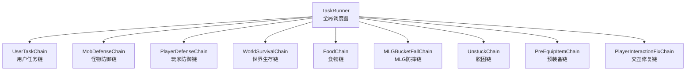
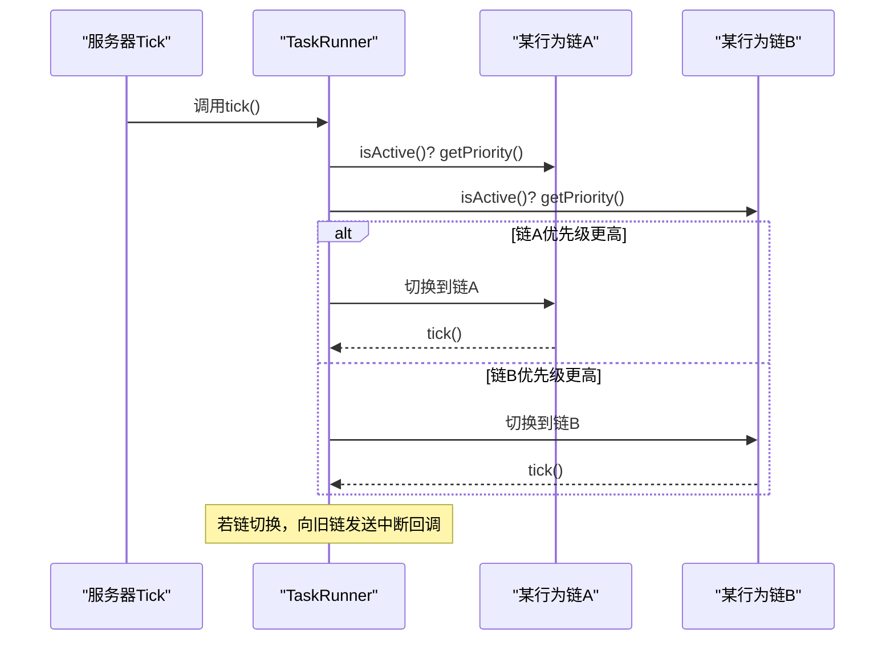
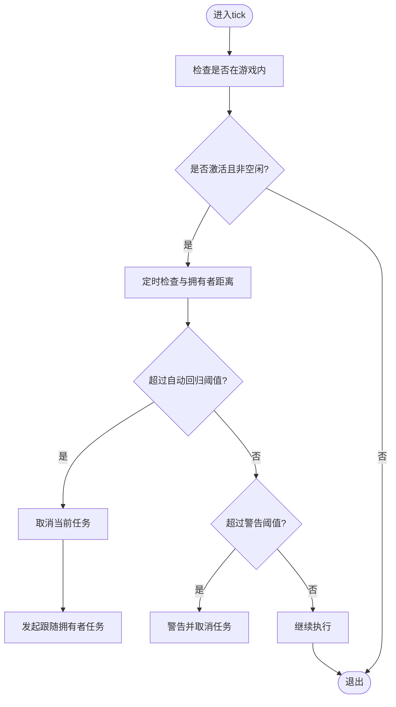
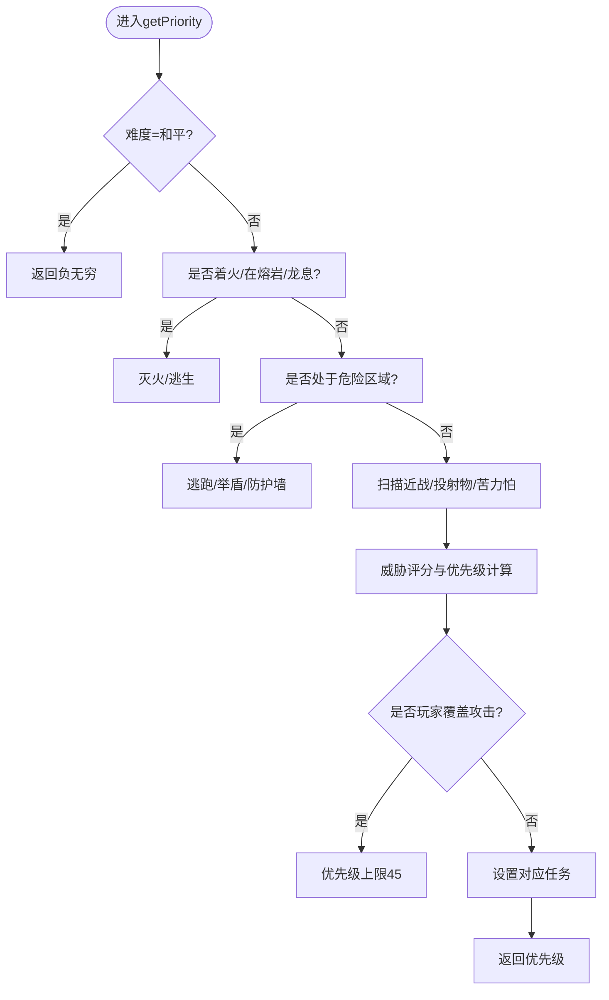
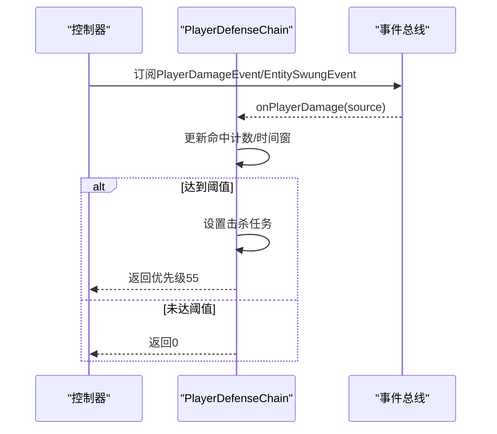
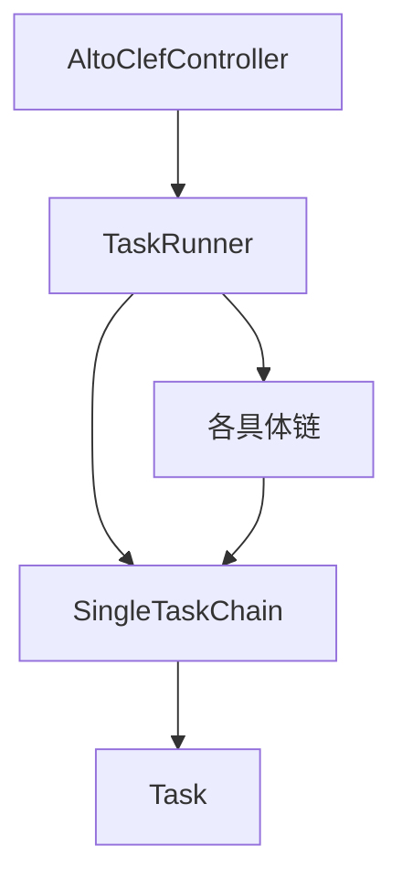

# 行为链系统

<cite>
**本文引用的文件**
- [AltoClefController.java](file://src/main/java/adris/altoclef/AltoClefController.java)
- [TaskRunner.java](file://src/main/java/adris/altoclef/tasksystem/TaskRunner.java)
- [TaskChain.java](file://src/main/java/adris/altoclef/tasksystem/TaskChain.java)
- [SingleTaskChain.java](file://src/main/java/adris/altoclef/chains/SingleTaskChain.java)
- [UserTaskChain.java](file://src/main/java/adris/altoclef/chains/UserTaskChain.java)
- [MobDefenseChain.java](file://src/main/java/adris/altoclef/chains/MobDefenseChain.java)
- [PlayerDefenseChain.java](file://src/main/java/adris/altoclef/chains/PlayerDefenseChain.java)
- [WorldSurvivalChain.java](file://src/main/java/adris/altoclef/chains/WorldSurvivalChain.java)
- [FoodChain.java](file://src/main/java/adris/altoclef/chains/FoodChain.java)
- [MLGBucketFallChain.java](file://src/main/java/adris/altoclef/chains/MLGBucketFallChain.java)
- [PreEquipItemChain.java](file://src/main/java/adris/altoclef/chains/PreEquipItemChain.java)
- [UnstuckChain.java](file://src/main/java/adris/altoclef/chains/UnstuckChain.java)
- [PlayerInteractionFixChain.java](file://src/main/java/adris/altoclef/chains/PlayerInteractionFixChain.java)
- [AI_NPC游戏指令系统重构.md](file://docs/AI_NPC游戏指令系统重构.md)
</cite>

## 目录
1. [简介](#简介)
2. [项目结构](#项目结构)
3. [核心组件](#核心组件)
4. [架构总览](#架构总览)
5. [详细组件分析](#详细组件分析)
6. [依赖分析](#依赖分析)
7. [性能考量](#性能考量)
8. [故障排查指南](#故障排查指南)
9. [结论](#结论)
10. [附录](#附录)

## 简介
本文件系统性阐述“行为链”（Task Chain）体系的设计理念与实现原理，覆盖用户任务链、怪物防御链、玩家防御链、世界生存链、食物链、MLG水桶防摔链、预装备链与脱困链、交互修复链等。重点说明：
- 行为链的优先级调度机制与中断策略
- 执行顺序、条件判断与状态管理
- 如何通过行为链实现复杂AI决策（含紧急情况处理）
- 不同行为链的组合使用与协作关系
- 扩展与自定义行为链的实践指南

## 项目结构
行为链系统位于模块的“chains”包中，并由统一的任务运行器驱动。核心类包括：
- TaskChain：抽象基类，定义优先级、激活状态、tick循环与中断回调
- SingleTaskChain：单任务型链，负责当前任务的启动、重置、完成回调与打断
- TaskRunner：全局调度器，按优先级选择最高优先级链并驱动其tick
- 各具体链：如UserTaskChain、MobDefenseChain、PlayerDefenseChain等

图表来源
- [TaskRunner.java:22-58](file://src/main/java/adris/altoclef/tasksystem/TaskRunner.java#L22-L58)
- [TaskChain.java:16-36](file://src/main/java/adris/altoclef/tasksystem/TaskChain.java#L16-L36)
- [AltoClefController.java:88-96](file://src/main/java/adris/altoclef/AltoClefController.java#L88-L96)

章节来源
- [AltoClefController.java:82-133](file://src/main/java/adris/altoclef/AltoClefController.java#L82-L133)
- [TaskRunner.java:17-58](file://src/main/java/adris/altoclef/tasksystem/TaskRunner.java#L17-L58)
- [TaskChain.java:16-36](file://src/main/java/adris/altoclef/tasksystem/TaskChain.java#L16-L36)

## 核心组件
- TaskChain：定义链的生命周期与优先级接口，负责缓存当前链的任务集合以便调试与追踪
- SingleTaskChain：封装单任务执行与中断逻辑，支持任务切换、重置与完成回调
- TaskRunner：遍历所有已注册链，计算优先级并选择最高优先级链执行；在链切换时触发中断回调
- 具体链：各自实现getPriority与业务逻辑，返回可执行任务或0/负值表示不激活

章节来源
- [TaskChain.java:7-50](file://src/main/java/adris/altoclef/tasksystem/TaskChain.java#L7-L50)
- [SingleTaskChain.java:11-95](file://src/main/java/adris/altoclef/chains/SingleTaskChain.java#L11-L95)
- [TaskRunner.java:9-97](file://src/main/java/adris/altoclef/tasksystem/TaskRunner.java#L9-L97)

## 架构总览
行为链系统采用“多链竞争、单链执行”的模式。TaskRunner每tick扫描所有链的优先级，选择最大者执行；若当前链与上一tick不同，则向旧链发出中断通知，确保任务安全切换。

图表来源
- [TaskRunner.java:22-58](file://src/main/java/adris/altoclef/tasksystem/TaskRunner.java#L22-L58)
- [TaskChain.java:26-36](file://src/main/java/adris/altoclef/tasksystem/TaskChain.java#L26-L36)

## 详细组件分析

### 用户任务链 UserTaskChain
- 角色定位：用户命令的执行链，优先级固定为50.0F
- 关键能力
  - 任务设置与强制重启：为避免相同任务重复执行被跳过，会在设置新任务前强制停止旧任务
  - 距离监控与自动回归：当NPC与拥有者距离超过阈值时，自动取消当前任务并发起跟随回归
  - 完成回调与空闲命令：任务完成后可选择进入空闲命令或直接停止
- 状态管理
  - runningIdleTask：标记是否处于空闲状态
  - nextTaskIdleFlag：用于信号下一个任务为空闲
  - currentOnFinish：任务完成后的回调
  - lastProgressSpeakTime：进度语音播报节流
- 与控制器交互
  - 通过TaskRunner.enable()启用调度
  - 通过AltoClefController.getTaskRunner()接入全局调度

图表来源
- [UserTaskChain.java:64-114](file://src/main/java/adris/altoclef/chains/UserTaskChain.java#L64-L114)

章节来源
- [UserTaskChain.java:36-222](file://src/main/java/adris/altoclef/chains/UserTaskChain.java#L36-L222)
- [SingleTaskChain.java:54-95](file://src/main/java/adris/altoclef/chains/SingleTaskChain.java#L54-L95)

### 怪物防御链 MobDefenseChain
- 角色定位：动态优先级链，最高可达100+，用于应对怪物威胁
- 优先级机制
  - 基于威胁评估（苦力怕、投射物、近战敌对生物、环境效果等）动态计算
  - 当玩家血量较低或处于危险环境时，优先级飙升
  - 支持“玩家攻击覆盖”模式，将自身优先级上限限制在45.0F以下，避免与用户命令冲突
- 主要行为
  - 苦力怕接近：逃跑或举盾
  - 投射物接近：举盾或构建防护墙/闪避
  - 近战威胁：击杀或逃跑
  - 环境危险：灭火、避开龙息等
- 状态管理
  - shielding：举盾状态
  - doingFunkyStuff：特殊动作（如举盾/闪避）
  - lockedOnEntity：锁定目标
  - playerOverrideAttack：玩家覆盖攻击标志

图表来源
- [MobDefenseChain.java:203-407](file://src/main/java/adris/altoclef/chains/MobDefenseChain.java#L203-L407)

章节来源
- [MobDefenseChain.java:105-683](file://src/main/java/adris/altoclef/chains/MobDefenseChain.java#L105-L683)

### 玩家防御链 PlayerDefenseChain
- 角色定位：PVP防御链，基于事件驱动（伤害事件、挥臂事件）记录潜在攻击者
- 机制要点
  - 记录命中次数与时间窗口，达到阈值后锁定目标并发起击杀
  - 低血量时降低阈值，提高反击敏感度
  - 自动清理过期目标（忘记攻击/目标死亡）
- 与控制器交互
  - 订阅PlayerDamageEvent与EntitySwungEvent事件
  - 通过实体追踪器查找目标玩家实体

图表来源
- [PlayerDefenseChain.java:30-161](file://src/main/java/adris/altoclef/chains/PlayerDefenseChain.java#L30-L161)

章节来源
- [PlayerDefenseChain.java:19-188](file://src/main/java/adris/altoclef/chains/PlayerDefenseChain.java#L19-L188)

### 世界生存链 WorldSurvivalChain
- 角色定位：环境生存链，处理溺水、火焰、熔岩、末地门卡住等紧急情况
- 优先级策略
  - 熔岩/火焰/溺水等高危情况优先级极高（100）
  - 可选自动灭火（水桶）与安全随机抖动脱困（60）
- 与控制器交互
  - 使用实体追踪器与世界辅助工具检测状态
  - 与UserTaskChain联动，避免在特定任务中误触发

章节来源
- [WorldSurvivalChain.java:27-166](file://src/main/java/adris/altoclef/chains/WorldSurvivalChain.java#L27-L166)

### 食物链 FoodChain
- 角色定位：自动进食链，基于饥饿度、健康状态与环境危险动态决定是否进食
- 机制要点
  - 在防御链/末地门等场景下主动暂停
  - 计算最佳食物与饱和度收益，避免浪费
  - 可触发收集食物任务以补充库存
- 状态管理
  - isTryingToEat：正在进食
  - requestFillup：请求填饱
  - shouldStop：外部强制停止

章节来源
- [FoodChain.java:23-228](file://src/main/java/adris/altoclef/chains/FoodChain.java#L23-L228)

### MLG水桶防摔链 MLGBucketFallChain
- 角色定位：防摔落链，检测自由落体速度并自动使用水桶/瞬移（ chorus fruit）自救
- 机制要点
  - 检测自由落体（游泳/在水中/无地面且下落速度足够快）
  - 自动放置水桶并回收，必要时使用瞬移道具
- 状态管理
  - lastMLG：最近一次MLG任务
  - doingChorusFruit：使用瞬移道具中

章节来源
- [MLGBucketFallChain.java:21-138](file://src/main/java/adris/altoclef/chains/MLGBucketFallChain.java#L21-L138)

### 预装备链 PreEquipItemChain
- 角色定位：路径规划前置装备链，避免在破坏/放置方块前丢失武器
- 机制要点
  - 分析当前路径是否涉及破坏/放置，若是则在合适时机预装武器
  - 避免在进食期间强制切换

章节来源
- [PreEquipItemChain.java:13-62](file://src/main/java/adris/altoclef/chains/PreEquipItemChain.java#L13-L62)

### 脱困链 UnstuckChain
- 角色定位：脱困链，检测卡住状态并采取相应措施（如离开水、破坏粉末雪、安全抖动）
- 机制要点
  - 基于位置历史判断是否卡住
  - 处理吃食卡顿、末地门框架卡住等特殊情况
  - 提供超时控制与临时路径点

章节来源
- [UnstuckChain.java:21-162](file://src/main/java/adris/altoclef/chains/UnstuckChain.java#L21-L162)

### 交互修复链 PlayerInteractionFixChain
- 角色定位：交互修复链，处理手握物品、潜行键滞留、更好的工具替换等细节问题
- 机制要点
  - 自动整理光标物品、释放潜行键、刷新背包
  - 在合适时机更换更优工具，避免打断路径

章节来源
- [PlayerInteractionFixChain.java:22-137](file://src/main/java/adris/altoclef/chains/PlayerInteractionFixChain.java#L22-L137)

## 依赖分析
- TaskRunner与TaskChain：TaskRunner持有所有链实例，按优先级选择执行链；链之间通过优先级竞争，不存在直接耦合
- SingleTaskChain与Task：单任务链内部维护当前任务，支持任务切换与中断
- 控制器与链：AltoClefController在构造时注册所有链，形成松耦合的职责划分
- 文档参考：重构文档明确了各链优先级与切换策略，指导后续扩展与调优

图表来源
- [AltoClefController.java:88-96](file://src/main/java/adris/altoclef/AltoClefController.java#L88-L96)
- [TaskRunner.java:60-62](file://src/main/java/adris/altoclef/tasksystem/TaskRunner.java#L60-L62)
- [SingleTaskChain.java:54-67](file://src/main/java/adris/altoclef/chains/SingleTaskChain.java#L54-L67)

章节来源
- [AltoClefController.java:82-133](file://src/main/java/adris/altoclef/AltoClefController.java#L82-L133)
- [TaskRunner.java:9-97](file://src/main/java/adris/altoclef/tasksystem/TaskRunner.java#L9-L97)
- [AI_NPC游戏指令系统重构.md:1475-1511](file://docs/AI_NPC游戏指令系统重构.md#L1475-L1511)

## 性能考量
- 优先级计算与链数量：链越多，每tick的比较开销越大。建议按需启用链，避免冗余
- 任务切换成本：频繁切换任务会触发中断与重置，应尽量减少不必要的优先级波动
- 状态缓存：部分链使用定时器与缓存（如lastDistanceCheck、cachedLastPriority），有助于降低重复计算
- 并发与异常：防御链对并发访问做了保护（同步块），避免异常导致的崩溃

## 故障排查指南
- 任务被中断
  - 检查TaskRunner是否切换了最高优先级链（日志会记录Active chain switched）
  - 查看SingleTaskChain的onInterrupt回调是否被触发
- 用户命令被怪物防御抢占
  - 检查MobDefenseChain的playerOverrideAttack标志是否开启
  - 参考重构文档中的优先级调整建议
- 距离监控导致频繁回归
  - 调整UserTaskChain的距离阈值与检查间隔参数
- 食物链无法进食
  - 检查是否处于防御/末地门等禁用场景
  - 确认inventory中是否有可用食物与合适工具
- MLG链未触发
  - 检查是否满足自由落体条件与设置项
  - 确认水桶/瞬移道具是否充足

章节来源
- [TaskRunner.java:42-47](file://src/main/java/adris/altoclef/tasksystem/TaskRunner.java#L42-L47)
- [SingleTaskChain.java:77-86](file://src/main/java/adris/altoclef/chains/SingleTaskChain.java#L77-L86)
- [AI_NPC游戏指令系统重构.md:1475-1511](file://docs/AI_NPC游戏指令系统重构.md#L1475-L1511)

## 结论
行为链系统通过“多链竞争、单链执行”的调度模型，实现了复杂AI决策的模块化与可扩展性。各链以明确的优先级与状态机协同工作，在紧急情况下能够快速抢占，同时通过中断与完成回调保证任务安全过渡。结合配置与事件驱动，系统可在不同场景下灵活调整策略，满足多样化的NPC行为需求。

## 附录

### 优先级与典型场景
- 高优先级（100+）：怪物逃跑/防御、熔岩/溺水、MLG自救
- 中优先级（60~80）：投射物闪避/防护墙、PVP反击、环境生存
- 中低优先级（50）：用户任务链（核心）
- 低优先级（40以下）：自动进食、脱困、预装备、交互修复

章节来源
- [AI_NPC游戏指令系统重构.md:1475-1511](file://docs/AI_NPC游戏指令系统重构.md#L1475-L1511)