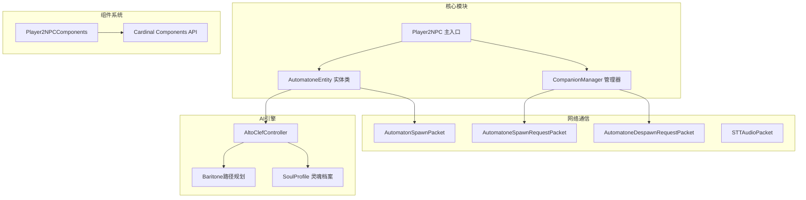
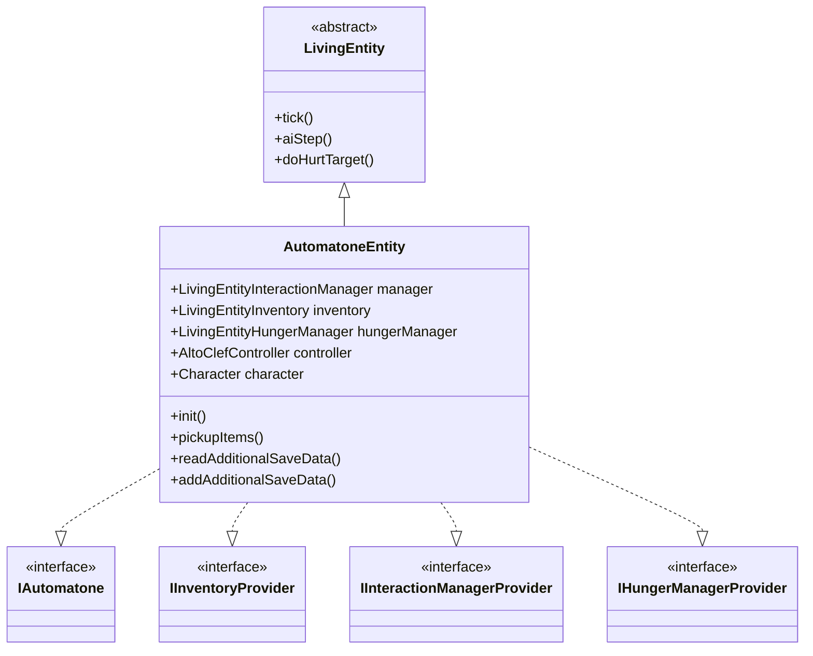
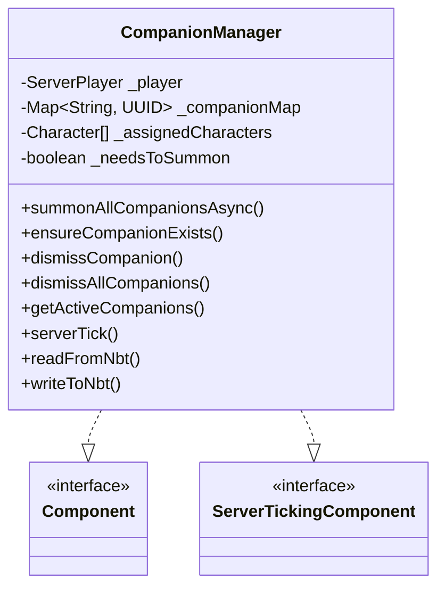
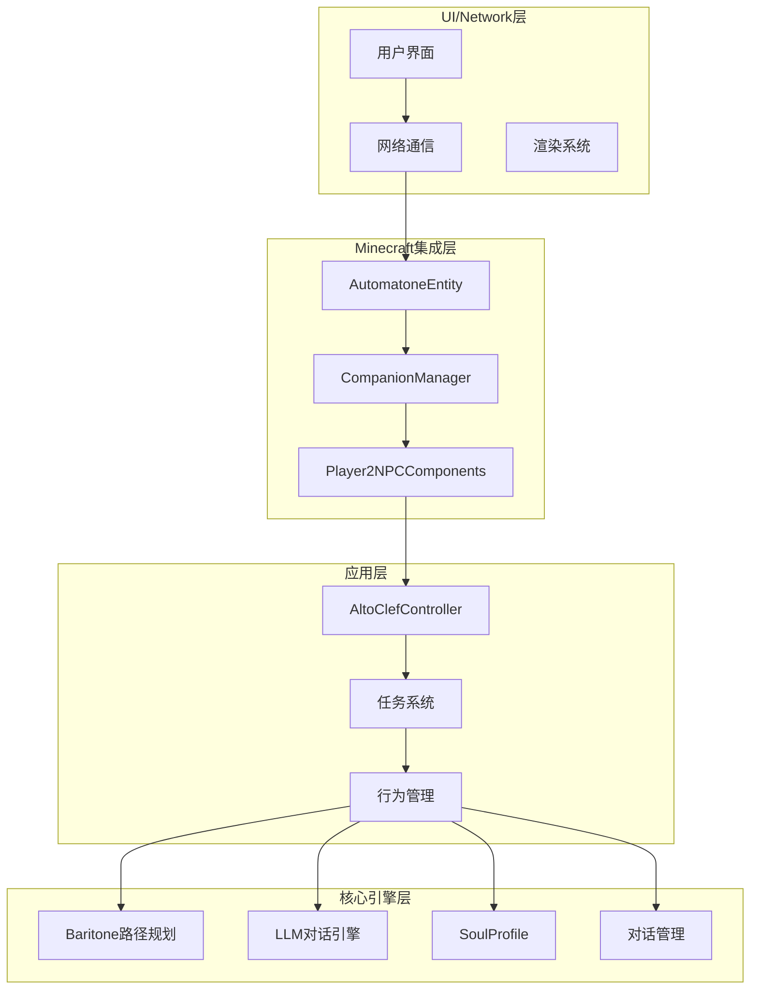
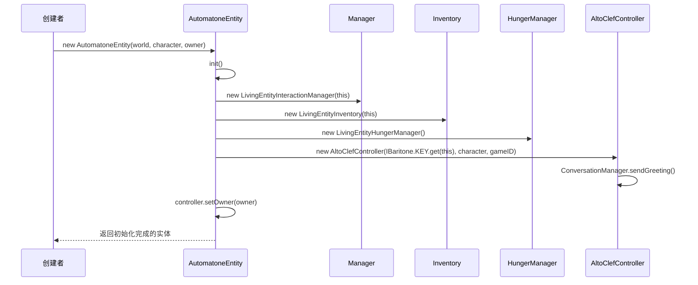
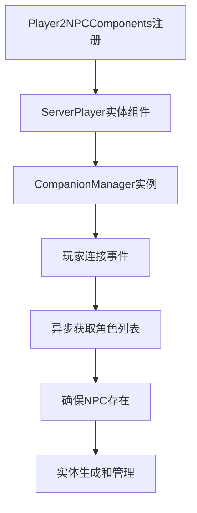
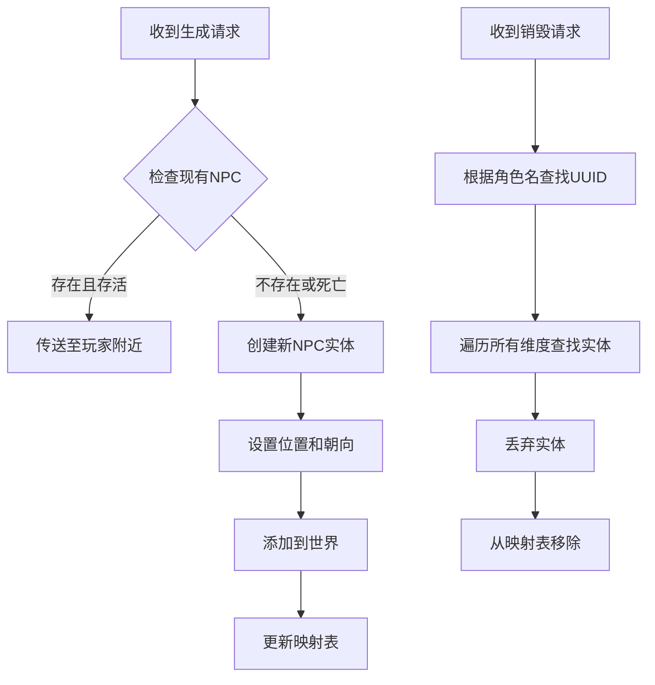
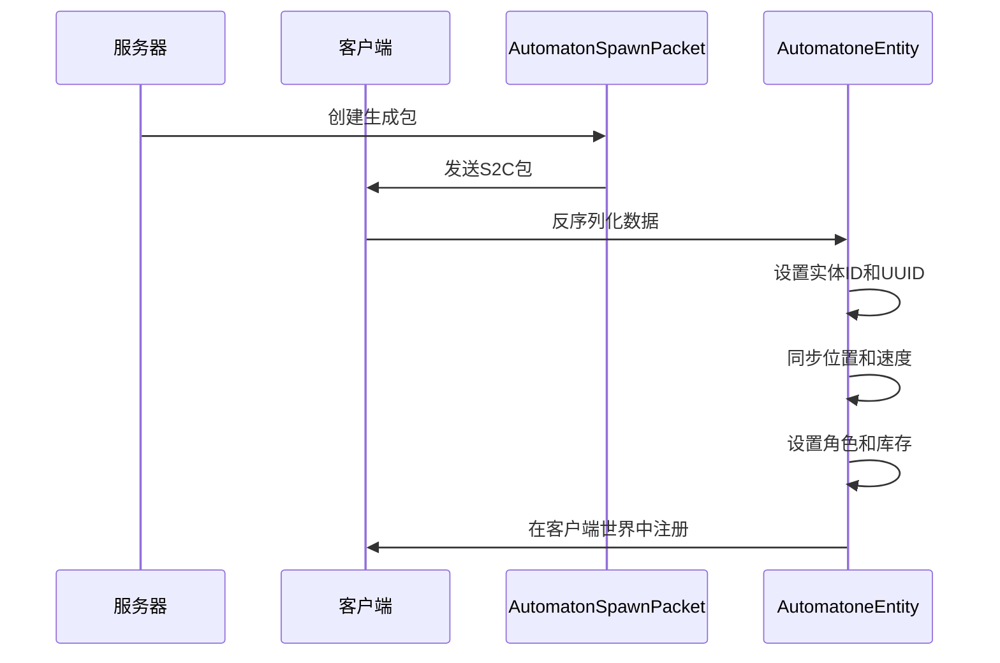
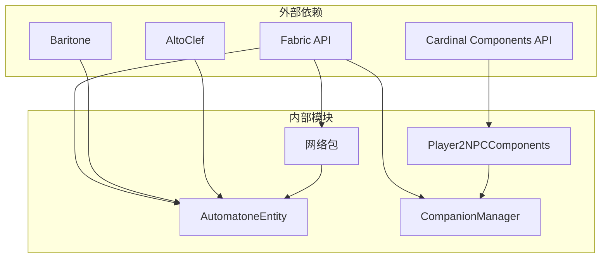

# NPC实体管理系统

<cite>
**本文档引用的文件**
- [AutomatoneEntity.java](file://src/main/java/com/goodbird/player2npc/companion/AutomatoneEntity.java)
- [CompanionManager.java](file://src/main/java/com/goodbird/player2npc/companion/CompanionManager.java)
- [Player2NPCComponents.java](file://src/main/java/com/goodbird/player2npc/Player2NPCComponents.java)
- [AutomatonSpawnPacket.java](file://src/main/java/com/goodbird/player2npc/network/AutomatonSpawnPacket.java)
- [AutomatoneDespawnRequestPacket.java](file://src/main/java/com/goodbird/player2npc/network/AutomatoneDespawnRequestPacket.java)
- [AutomatoneSpawnRequestPacket.java](file://src/main/java/com/goodbird/player2npc/network/AutomatoneSpawnRequestPacket.java)
- [STTAudioPacket.java](file://src/main/java/com/goodbird/player2npc/network/STTAudioPacket.java)
- [Player2NPC.java](file://src/main/java/com/goodbird/player2npc/Player2NPC.java)
- [Character.java](file://src/main/java/adris/altoclef/player2api/Character.java)
- [fabric.mod.json](file://src/main/resources/fabric.mod.json)
</cite>

## 目录
1. [简介](#简介)
2. [项目结构](#项目结构)
3. [核心组件](#核心组件)
4. [架构总览](#架构总览)
5. [详细组件分析](#详细组件分析)
6. [依赖关系分析](#依赖关系分析)
7. [性能考虑](#性能考虑)
8. [故障排除指南](#故障排除指南)
9. [结论](#结论)

## 简介

NPC实体管理系统是一个基于Minecraft Fabric模组的AI NPC实体管理解决方案。该系统允许玩家拥有可控制的AI伙伴实体，这些实体具有完整的AI行为、状态管理和网络同步功能。系统基于Cardinal Components API实现了玩家与NPC的关联机制，并提供了完整的NPC生命周期管理。

## 项目结构

该项目采用模块化设计，主要包含以下核心模块：

**图表来源**
- [Player2NPC.java:25-67](file://src/main/java/com/goodbird/player2npc/Player2NPC.java#L25-L67)
- [AutomatoneEntity.java:50-51](file://src/main/java/com/goodbird/player2npc/companion/AutomatoneEntity.java#L50-L51)
- [CompanionManager.java:28-43](file://src/main/java/com/goodbird/player2npc/companion/CompanionManager.java#L28-L43)

**章节来源**
- [Player2NPC.java:25-67](file://src/main/java/com/goodbird/player2npc/Player2NPC.java#L25-L67)
- [fabric.mod.json:17-47](file://src/main/resources/fabric.mod.json#L17-L47)

## 核心组件

### 实体系统架构

系统的核心是AutomatoneEntity类，它继承自LivingEntity并实现了多个接口来提供完整的NPC功能：

**图表来源**
- [AutomatoneEntity.java:50-51](file://src/main/java/com/goodbird/player2npc/companion/AutomatoneEntity.java#L50-L51)

### 管理器系统

CompanionManager作为Cardinal Components API的核心组件，负责管理玩家与NPC的关联关系：

**图表来源**
- [CompanionManager.java:28-43](file://src/main/java/com/goodbird/player2npc/companion/CompanionManager.java#L28-L43)

**章节来源**
- [AutomatoneEntity.java:50-116](file://src/main/java/com/goodbird/player2npc/companion/AutomatoneEntity.java#L50-L116)
- [CompanionManager.java:28-191](file://src/main/java/com/goodbird/player2npc/companion/CompanionManager.java#L28-L191)

## 架构总览

系统采用分层架构设计，从底层的Minecraft集成到顶层的应用逻辑：

**图表来源**
- [Player2NPC.java:61-64](file://src/main/java/com/goodbird/player2npc/Player2NPC.java#L61-L64)
- [fabric.mod.json:17-47](file://src/main/resources/fabric.mod.json#L17-L47)

## 详细组件分析

### AutomatoneEntity 实体类

AutomatoneEntity是系统的核心实体类，实现了完整的NPC功能：

#### 继承关系和接口实现

实体类继承自LivingEntity并实现了四个关键接口：
- IAutomatone：标记实体为AI自动机类型
- IInventoryProvider：提供类似玩家的库存管理
- IInteractionManagerProvider：提供交互管理器
- IHungerManagerProvider：提供饥饿管理器

#### 初始化流程

**图表来源**
- [AutomatoneEntity.java:73-99](file://src/main/java/com/goodbird/player2npc/companion/AutomatoneEntity.java#L73-L99)

#### 实体属性配置

实体的基础属性在init()方法中设置：
- 最大步进高度：0.6f
- 移动速度：0.4f
- 饥饿管理器：可选启用

#### AI行为集成

实体集成了完整的AI行为系统：
- 自动拾取物品：半径3格范围内的掉落物
- 攻击行为：继承LivingEntity的攻击机制
- 渲染支持：平滑的运动插值和头部旋转同步

**章节来源**
- [AutomatoneEntity.java:78-91](file://src/main/java/com/goodbird/player2npc/companion/AutomatoneEntity.java#L78-L91)
- [AutomatoneEntity.java:191-210](file://src/main/java/com/goodbird/player2npc/companion/AutomatoneEntity.java#L191-L210)
- [AutomatoneEntity.java:213-242](file://src/main/java/com/goodbird/player2npc/companion/AutomatoneEntity.java#L213-L242)

### CompanionManager 管理器

CompanionManager使用Cardinal Components API实现玩家与NPC的关联管理：

#### Cardinal Components API 使用

**图表来源**
- [Player2NPCComponents.java:10-16](file://src/main/java/com/goodbird/player2npc/Player2NPCComponents.java#L10-L16)
- [CompanionManager.java:45-74](file://src/main/java/com/goodbird/player2npc/companion/CompanionManager.java#L45-L74)

#### 玩家与NPC关联机制

管理器维护玩家与NPC的映射关系：
- 使用ConcurrentHashMap存储角色名到实体UUID的映射
- 支持异步角色获取和NPC生成
- 实现了动态添加和移除NPC的功能

#### NPC生成和销毁流程

**图表来源**
- [CompanionManager.java:100-129](file://src/main/java/com/goodbird/player2npc/companion/CompanionManager.java#L100-L129)
- [CompanionManager.java:131-144](file://src/main/java/com/goodbird/player2npc/companion/CompanionManager.java#L131-L144)

**章节来源**
- [CompanionManager.java:100-129](file://src/main/java/com/goodbird/player2npc/companion/CompanionManager.java#L100-L129)
- [CompanionManager.java:131-144](file://src/main/java/com/goodbird/player2npc/companion/CompanionManager.java#L131-L144)

### 网络同步机制

系统实现了完整的网络同步机制，确保客户端和服务器之间的状态一致：

#### 实体生成同步

**图表来源**
- [AutomatonSpawnPacket.java:70-74](file://src/main/java/com/goodbird/player2npc/network/AutomatonSpawnPacket.java#L70-L74)
- [AutomatonSpawnPacket.java:100-119](file://src/main/java/com/goodbird/player2npc/network/AutomatonSpawnPacket.java#L100-L119)

#### 状态持久化

实体支持完整的NBT数据持久化：
- 头部旋转角度
- 库存数据和选中槽位
- 角色信息
- 玩家所有者UUID

**章节来源**
- [AutomatonSpawnPacket.java:26-52](file://src/main/java/com/goodbird/player2npc/network/AutomatonSpawnPacket.java#L26-L52)
- [AutomatonSpawnPacket.java:100-119](file://src/main/java/com/goodbird/player2npc/network/AutomatonSpawnPacket.java#L100-L119)
- [AutomatoneEntity.java:119-162](file://src/main/java/com/goodbird/player2npc/companion/AutomatoneEntity.java#L119-L162)

## 依赖关系分析

系统依赖关系清晰，遵循模块化设计原则：

**图表来源**
- [Player2NPC.java:38-46](file://src/main/java/com/goodbird/player2npc/Player2NPC.java#L38-L46)
- [fabric.mod.json:33-46](file://src/main/resources/fabric.mod.json#L33-L46)

**章节来源**
- [Player2NPC.java:38-46](file://src/main/java/com/goodbird/player2npc/Player2NPC.java#L38-L46)
- [fabric.mod.json:33-46](file://src/main/resources/fabric.mod.json#L33-L46)

## 性能考虑

### 实体跟踪范围优化

系统在实体类型注册时设置了优化参数：
- 跟踪范围：64格方块
- 更新频率：每1个刻度
- 强制速度更新：启用以确保平滑移动

### 内存管理策略

1. **异步处理**：角色获取和NPC生成使用CompletableFuture异步执行
2. **并发安全**：使用ConcurrentHashMap确保线程安全
3. **延迟加载**：AI控制器仅在需要时初始化
4. **资源清理**：断开连接时自动清理所有NPC实体

### 网络带宽优化

1. **压缩传输**：速度数据使用短整型压缩
2. **增量更新**：仅传输必要的实体状态
3. **批量处理**：支持批量NPC生成和销毁

## 故障排除指南

### 常见问题诊断

#### NPC无法生成
- 检查角色服务是否正常运行
- 验证玩家权限和配置
- 查看服务器日志中的错误信息

#### 网络同步问题
- 确认网络包注册是否正确
- 检查客户端版本兼容性
- 验证实体ID分配机制

#### 性能问题
- 监控服务器CPU使用率
- 检查NPC数量限制
- 优化AI行为复杂度

**章节来源**
- [AutomatoneDespawnRequestPacket.java:56-63](file://src/main/java/com/goodbird/player2npc/network/AutomatoneDespawnRequestPacket.java#L56-L63)
- [AutomatoneSpawnRequestPacket.java:57-65](file://src/main/java/com/goodbird/player2npc/network/AutomatoneSpawnRequestPacket.java#L57-L65)

## 结论

NPC实体管理系统是一个功能完整、架构清晰的AI NPC解决方案。系统通过以下关键特性实现了高质量的NPC体验：

1. **完整的AI集成**：基于AltoClef和Baritone的成熟AI框架
2. **优雅的架构设计**：模块化设计，职责分离明确
3. **高效的网络同步**：优化的数据传输和状态管理
4. **灵活的状态持久化**：支持跨世界的数据保存
5. **良好的性能表现**：异步处理和内存优化策略

该系统为Minecraft AI NPC开发提供了坚实的技术基础，可以作为其他AI实体项目的参考实现。