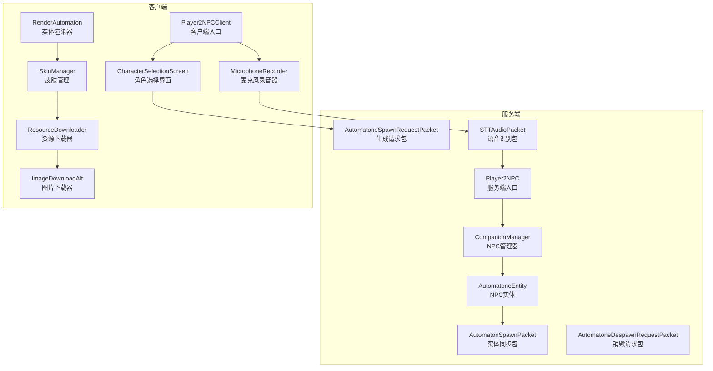
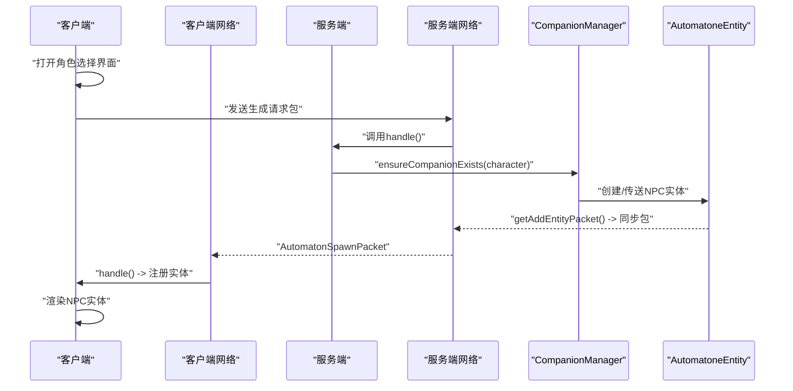
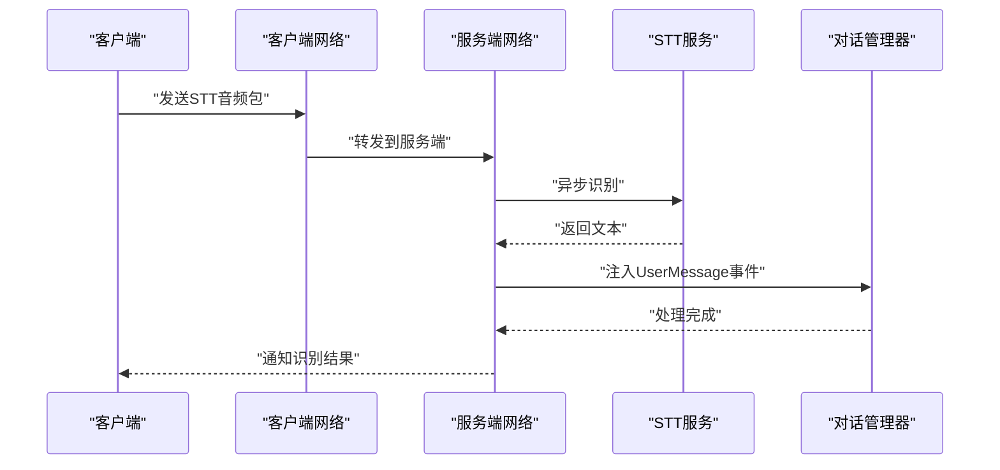
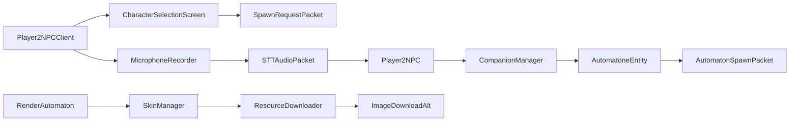

# Player2NPC集成层模块

<cite>
**本文档引用的文件**
- [Player2NPC.java](file://src/main/java/com/goodbird/player2npc/Player2NPC.java)
- [Player2NPCClient.java](file://src/main/java/com/goodbird/player2npc/Player2NPCClient.java)
- [Player2NPCComponents.java](file://src/main/java/com/goodbird/player2npc/Player2NPCComponents.java)
- [AutomatoneEntity.java](file://src/main/java/com/goodbird/player2npc/companion/AutomatoneEntity.java)
- [CompanionManager.java](file://src/main/java/com/goodbird/player2npc/companion/CompanionManager.java)
- [AutomatonSpawnPacket.java](file://src/main/java/com/goodbird/player2npc/network/AutomatonSpawnPacket.java)
- [STTAudioPacket.java](file://src/main/java/com/goodbird/player2npc/network/STTAudioPacket.java)
- [AutomatoneSpawnRequestPacket.java](file://src/main/java/com/goodbird/player2npc/network/AutomatoneSpawnRequestPacket.java)
- [AutomatoneDespawnRequestPacket.java](file://src/main/java/com/goodbird/player2npc/network/AutomatoneDespawnRequestPacket.java)
- [CharacterSelectionScreen.java](file://src/main/java/com/goodbird/player2npc/client/gui/CharacterSelectionScreen.java)
- [CharacterCardWidget.java](file://src/main/java/com/goodbird/player2npc/client/gui/CharacterCardWidget.java)
- [MicrophoneRecorder.java](file://src/main/java/com/goodbird/player2npc/client/audio/MicrophoneRecorder.java)
- [RenderAutomaton.java](file://src/main/java/com/goodbird/player2npc/client/render/RenderAutomaton.java)
- [SkinManager.java](file://src/main/java/com/goodbird/player2npc/client/util/SkinManager.java)
- [ImageDownloadAlt.java](file://src/main/java/com/goodbird/player2npc/client/util/ImageDownloadAlt.java)
- [ResourceDownloader.java](file://src/main/java/com/goodbird/player2npc/client/util/ResourceDownloader.java)
- [fabric.mod.json](file://src/main/resources/fabric.mod.json)
</cite>

## 目录
1. [简介](#简介)
2. [项目结构](#项目结构)
3. [核心组件](#核心组件)
4. [架构总览](#架构总览)
5. [详细组件分析](#详细组件分析)
6. [依赖关系分析](#依赖关系分析)
7. [性能考虑](#性能考虑)
8. [故障排除指南](#故障排除指南)
9. [结论](#结论)
10. [附录](#附录)

## 简介
本文件面向Player2NPC集成层模块，系统性阐述com/goodbird/player2npc包在Fabric模组中的集成架构与实现细节。该模块以Player2NPC为核心入口，通过Fabric模组生命周期管理服务端与客户端初始化；借助Cardinal Components API为玩家实体注入NPC管理能力；基于自定义网络协议实现NPC实体的生成、销毁与语音识别数据传输；同时提供客户端GUI界面与音频录制系统，支撑玩家与AI NPC的交互体验。

## 项目结构
Player2NPC集成层位于com.goodbird.player2npc包下，按职责划分为：
- 服务端入口：Player2NPC（ModInitializer）
- 客户端入口：Player2NPCClient（ClientModInitializer）
- 组件系统：Player2NPCComponents（Cardinal Components注册）
- NPC实体与管理：AutomatoneEntity、CompanionManager
- 网络协议：AutomatonSpawnPacket、STTAudioPacket、Spawn/Despawn请求包
- 客户端GUI与音频：CharacterSelectionScreen、MicrophoneRecorder
- 渲染与资源：RenderAutomaton、SkinManager、ResourceDownloader、ImageDownloadAlt

**图表来源**
- [Player2NPC.java:48-65](file://src/main/java/com/goodbird/player2npc/Player2NPC.java#L48-L65)
- [Player2NPCClient.java:36-124](file://src/main/java/com/goodbird/player2npc/Player2NPCClient.java#L36-L124)
- [Player2NPCComponents.java:10-16](file://src/main/java/com/goodbird/player2npc/Player2NPCComponents.java#L10-L16)
- [AutomatoneEntity.java:50-91](file://src/main/java/com/goodbird/player2npc/companion/AutomatoneEntity.java#L50-L91)
- [CompanionManager.java:28-74](file://src/main/java/com/goodbird/player2npc/companion/CompanionManager.java#L28-L74)
- [AutomatonSpawnPacket.java:26-52](file://src/main/java/com/goodbird/player2npc/network/AutomatonSpawnPacket.java#L26-L52)
- [AutomatoneSpawnRequestPacket.java:24-45](file://src/main/java/com/goodbird/player2npc/network/AutomatoneSpawnRequestPacket.java#L24-L45)
- [AutomatoneDespawnRequestPacket.java:21-44](file://src/main/java/com/goodbird/player2npc/network/AutomatoneDespawnRequestPacket.java#L21-L44)
- [STTAudioPacket.java:28-66](file://src/main/java/com/goodbird/player2npc/network/STTAudioPacket.java#L28-L66)
- [CharacterSelectionScreen.java:13-52](file://src/main/java/com/goodbird/player2npc/client/gui/CharacterSelectionScreen.java#L13-L52)
- [MicrophoneRecorder.java:21-121](file://src/main/java/com/goodbird/player2npc/client/audio/MicrophoneRecorder.java#L21-L121)
- [RenderAutomaton.java:39-50](file://src/main/java/com/goodbird/player2npc/client/render/RenderAutomaton.java#L39-L50)
- [SkinManager.java:10-31](file://src/main/java/com/goodbird/player2npc/client/util/SkinManager.java#L10-L31)
- [ResourceDownloader.java:16-42](file://src/main/java/com/goodbird/player2npc/client/util/ResourceDownloader.java#L16-L42)
- [ImageDownloadAlt.java:23-57](file://src/main/java/com/goodbird/player2npc/client/util/ImageDownloadAlt.java#L23-L57)

**章节来源**
- [fabric.mod.json:17-28](file://src/main/resources/fabric.mod.json#L17-L28)

## 核心组件
- 服务端入口Player2NPC：注册实体类型、网络全局接收器、连接与服务器tick事件，负责NPC实体的注册与生命周期事件处理。
- 客户端入口Player2NPCClient：注册实体渲染器、网络接收器、按键绑定、客户端tick逻辑（PTT/VAD录音与发送）。
- 组件系统Player2NPCComponents：通过Cardinal Components API为ServerPlayer注入CompanionManager组件。
- NPC实体AutomatoneEntity：继承LivingEntity并实现IAutomatone/IInventoryProvider/IInteractionManagerProvider/IHungerManagerProvider接口，提供AI控制器、库存、交互与饥饿管理，并支持NBT持久化与服务端tick。
- NPC管理器CompanionManager：以组件形式管理玩家的AI NPC，负责角色拉取、自动召唤/传送/解散、NBT持久化与服务端tick同步。
- 网络协议：AutomatonSpawnPacket用于服务端向客户端同步NPC实体状态；STTAudioPacket处理客户端语音识别数据上传与服务端异步识别；Spawn/Despawn请求包用于客户端请求生成或销毁特定角色的NPC。
- 客户端GUI：CharacterSelectionScreen提供角色列表加载与卡片展示，CharacterCardWidget渲染角色头像与点击交互。
- 音频系统：MicrophoneRecorder实现16kHz/16bit/Mono的PCM录音、VAD静音检测与最大时长限制。
- 渲染与资源：RenderAutomaton负责NPC模型与装备层渲染、纹理加载与皮肤修复；SkinManager/ResourceDownloader/ImageDownloadAlt负责远程皮肤下载与缓存。

**章节来源**
- [Player2NPC.java:25-67](file://src/main/java/com/goodbird/player2npc/Player2NPC.java#L25-L67)
- [Player2NPCClient.java:23-164](file://src/main/java/com/goodbird/player2npc/Player2NPCClient.java#L23-L164)
- [Player2NPCComponents.java:10-16](file://src/main/java/com/goodbird/player2npc/Player2NPCComponents.java#L10-L16)
- [AutomatoneEntity.java:50-313](file://src/main/java/com/goodbird/player2npc/companion/AutomatoneEntity.java#L50-L313)
- [CompanionManager.java:28-191](file://src/main/java/com/goodbird/player2npc/companion/CompanionManager.java#L28-L191)
- [AutomatonSpawnPacket.java:26-120](file://src/main/java/com/goodbird/player2npc/network/AutomatonSpawnPacket.java#L26-L120)
- [STTAudioPacket.java:28-134](file://src/main/java/com/goodbird/player2npc/network/STTAudioPacket.java#L28-L134)
- [AutomatoneSpawnRequestPacket.java:24-67](file://src/main/java/com/goodbird/player2npc/network/AutomatoneSpawnRequestPacket.java#L24-L67)
- [AutomatoneDespawnRequestPacket.java:21-65](file://src/main/java/com/goodbird/player2npc/network/AutomatoneDespawnRequestPacket.java#L21-L65)
- [CharacterSelectionScreen.java:13-106](file://src/main/java/com/goodbird/player2npc/client/gui/CharacterSelectionScreen.java#L13-L106)
- [CharacterCardWidget.java:14-53](file://src/main/java/com/goodbird/player2npc/client/gui/CharacterCardWidget.java#L14-L53)
- [MicrophoneRecorder.java:21-200](file://src/main/java/com/goodbird/player2npc/client/audio/MicrophoneRecorder.java#L21-L200)
- [RenderAutomaton.java:39-202](file://src/main/java/com/goodbird/player2npc/client/render/RenderAutomaton.java#L39-L202)
- [SkinManager.java:10-57](file://src/main/java/com/goodbird/player2npc/client/util/SkinManager.java#L10-L57)
- [ResourceDownloader.java:16-65](file://src/main/java/com/goodbird/player2npc/client/util/ResourceDownloader.java#L16-L65)
- [ImageDownloadAlt.java:23-158](file://src/main/java/com/goodbird/player2npc/client/util/ImageDownloadAlt.java#L23-L158)

## 架构总览
Player2NPC采用Fabric模组标准入口，结合Cardinal Components组件系统与自定义网络协议，构建“玩家-角色-实体-NPC”的完整链路。服务端负责NPC实体注册、网络消息处理与AI控制器tick；客户端负责渲染、GUI与音频输入；两者通过自定义包格式进行可靠通信。

**图表来源**
- [CharacterSelectionScreen.java:19-52](file://src/main/java/com/goodbird/player2npc/client/gui/CharacterSelectionScreen.java#L19-L52)
- [AutomatoneSpawnRequestPacket.java:57-65](file://src/main/java/com/goodbird/player2npc/network/AutomatoneSpawnRequestPacket.java#L57-L65)
- [AutomatoneEntity.java:298-302](file://src/main/java/com/goodbird/player2npc/companion/AutomatoneEntity.java#L298-L302)
- [AutomatonSpawnPacket.java:70-74](file://src/main/java/com/goodbird/player2npc/network/AutomatonSpawnPacket.java#L70-L74)
- [AutomatonSpawnPacket.java:100-119](file://src/main/java/com/goodbird/player2npc/network/AutomatonSpawnPacket.java#L100-L119)

## 详细组件分析

### 服务端入口：Player2NPC
- 职责
  - 注册实体类型AUTOMATONE
  - 注册全局网络接收器：生成请求、销毁请求、STT音频
  - 处理玩家连接/断开事件：自动召唤/解散所有NPC
  - 每个服务器tick调用AltoClefController静态tick
- 关键点
  - 使用FabricEntityTypeBuilder创建实体类型，设置尺寸、跟踪范围与更新频率
  - 基于ServerPlayNetworking注册全局接收器，确保跨线程安全
  - 在连接加入时异步拉取角色并批量召唤，在断开时清理

**章节来源**
- [Player2NPC.java:38-46](file://src/main/java/com/goodbird/player2npc/Player2NPC.java#L38-L46)
- [Player2NPC.java:52-64](file://src/main/java/com/goodbird/player2npc/Player2NPC.java#L52-L64)

### 客户端入口：Player2NPCClient
- 职责
  - 注册实体渲染器
  - 注册全局网络接收器：实体同步包
  - 注册按键绑定：打开角色选择界面、Push-to-Talk（PTT）
  - 客户端tick中处理PTT/VAD逻辑：开始/停止录音、发送STT包
- 关键点
  - 使用GLFW原始键状态检测PTT，避免KeyMapping在屏幕切换时状态重置
  - 录音最小长度校验与VAD静音检测，防止无效音频上行
  - 发送UTF语言码+变长整型长度+字节流的自定义包格式

**章节来源**
- [Player2NPCClient.java:36-124](file://src/main/java/com/goodbird/player2npc/Player2NPCClient.java#L36-L124)
- [Player2NPCClient.java:150-162](file://src/main/java/com/goodbird/player2npc/Player2NPCClient.java#L150-L162)

### 组件系统：Player2NPCComponents（Cardinal Components）
- 职责
  - 将CompanionManager注册为ServerPlayer的实体组件
  - 通过ComponentKey<CompanionManager>统一访问与持久化
- 关键点
  - 使用EntityComponentFactoryRegistry注册组件工厂
  - 与AltoClef控制器协作，提供NPC生命周期管理

**章节来源**
- [Player2NPCComponents.java:10-16](file://src/main/java/com/goodbird/player2npc/Player2NPCComponents.java#L10-L16)

### NPC实体：AutomatoneEntity
- 职责
  - 实现IAutomatone/IInventoryProvider/IInteractionManagerProvider/IHungerManagerProvider
  - 提供AltoClefController（仅服务端），初始化交互、库存与饥饿管理
  - 支持NBT读写、服务端tick、拾取物品、攻击行为与渲染速度调整
  - 重写getAddEntityPacket()以使用自定义同步包
- 关键点
  - 服务端构造时初始化控制器并发送问候消息
  - 客户端侧通过AutomatonSpawnPacket恢复实体状态与库存

**章节来源**
- [AutomatoneEntity.java:50-117](file://src/main/java/com/goodbird/player2npc/companion/AutomatoneEntity.java#L50-L117)
- [AutomatoneEntity.java:118-162](file://src/main/java/com/goodbird/player2npc/companion/AutomatoneEntity.java#L118-L162)
- [AutomatoneEntity.java:164-177](file://src/main/java/com/goodbird/player2npc/companion/AutomatoneEntity.java#L164-L177)
- [AutomatoneEntity.java:298-311](file://src/main/java/com/goodbird/player2npc/companion/AutomatoneEntity.java#L298-L311)

### NPC管理器：CompanionManager
- 职责
  - 异步拉取玩家分配的角色列表
  - 自动确保每个角色对应一个存活的NPC实体（不存在则生成，存在则传送）
  - 提供dismissAllCompanions/dismissCompanion/getActiveCompanions
  - 通过NBT持久化已存在的NPC UUID映射
- 关键点
  - 使用CompletableFuture异步获取角色，避免阻塞
  - 服务端tick中触发批量召唤逻辑
  - 通过ComponentKey与Player2NPCComponents集成

**章节来源**
- [CompanionManager.java:28-74](file://src/main/java/com/goodbird/player2npc/companion/CompanionManager.java#L28-L74)
- [CompanionManager.java:76-98](file://src/main/java/com/goodbird/player2npc/companion/CompanionManager.java#L76-L98)
- [CompanionManager.java:100-129](file://src/main/java/com/goodbird/player2npc/companion/CompanionManager.java#L100-L129)
- [CompanionManager.java:146-150](file://src/main/java/com/goodbird/player2npc/companion/CompanionManager.java#L146-L150)
- [CompanionManager.java:169-175](file://src/main/java/com/goodbird/player2npc/companion/CompanionManager.java#L169-L175)
- [CompanionManager.java:177-190](file://src/main/java/com/goodbird/player2npc/companion/CompanionManager.java#L177-L190)

### 网络协议设计
- AutomatonSpawnPacket
  - 服务端创建：包含实体ID、UUID、位置、速度、旋转、角色与库存
  - 客户端处理：重建实体、设置状态、放入世界
- STTAudioPacket
  - 客户端发送：UTF语言码+变长长度+音频字节
  - 服务端处理：长度校验、异步STT识别、注入用户消息事件
- Spawn/Despawn请求包
  - 客户端发送：携带角色信息
  - 服务端处理：调用CompanionManager确保生成/销毁

**图表来源**
- [STTAudioPacket.java:39-121](file://src/main/java/com/goodbird/player2npc/network/STTAudioPacket.java#L39-L121)
- [Player2NPCClient.java:150-162](file://src/main/java/com/goodbird/player2npc/Player2NPCClient.java#L150-L162)

**章节来源**
- [AutomatonSpawnPacket.java:26-93](file://src/main/java/com/goodbird/player2npc/network/AutomatonSpawnPacket.java#L26-L93)
- [AutomatonSpawnPacket.java:100-119](file://src/main/java/com/goodbird/player2npc/network/AutomatonSpawnPacket.java#L100-L119)
- [STTAudioPacket.java:28-66](file://src/main/java/com/goodbird/player2npc/network/STTAudioPacket.java#L28-L66)
- [AutomatoneSpawnRequestPacket.java:24-67](file://src/main/java/com/goodbird/player2npc/network/AutomatoneSpawnRequestPacket.java#L24-L67)
- [AutomatoneDespawnRequestPacket.java:21-65](file://src/main/java/com/goodbird/player2npc/network/AutomatoneDespawnRequestPacket.java#L21-L65)

### 客户端GUI界面系统：CharacterSelectionScreen
- 职责
  - 异步加载可用角色列表，渲染角色卡片，支持点击查看详情
  - 加载状态提示与错误处理
- 关键点
  - 使用CompletableFuture在后台线程请求角色，主线程更新UI
  - 角色卡片使用SkinManager渲染头像

**章节来源**
- [CharacterSelectionScreen.java:13-106](file://src/main/java/com/goodbird/player2npc/client/gui/CharacterSelectionScreen.java#L13-L106)
- [CharacterCardWidget.java:14-53](file://src/main/java/com/goodbird/player2npc/client/gui/CharacterCardWidget.java#L14-L53)

### 音频录制系统：MicrophoneRecorder
- 职责
  - 以16kHz/16bit/Mono PCM格式录制音频
  - VAD静音检测：最小录音时间后开始静音阈值判断，连续静音超时自动停止
  - 最大录音时长限制（60秒）
- 关键点
  - 使用AudioSystem.TargetDataLine捕获音频流
  - RMS计算用于音量检测
  - 线程守护与资源释放

**章节来源**
- [MicrophoneRecorder.java:21-200](file://src/main/java/com/goodbird/player2npc/client/audio/MicrophoneRecorder.java#L21-L200)

### 渲染系统：RenderAutomaton与皮肤资源
- 职责
  - 基于PlayerModel渲染NPC实体，叠加盔甲、主手物品、箭矢、头颅等层
  - 从角色配置加载皮肤纹理，支持远程下载与本地缓存
- 关键点
  - SkinManager根据URL生成资源定位符并尝试加载缓存
  - ResourceDownloader与ImageDownloadAlt负责异步下载与纹理上传

**章节来源**
- [RenderAutomaton.java:39-202](file://src/main/java/com/goodbird/player2npc/client/render/RenderAutomaton.java#L39-L202)
- [SkinManager.java:10-57](file://src/main/java/com/goodbird/player2npc/client/util/SkinManager.java#L10-L57)
- [ResourceDownloader.java:16-65](file://src/main/java/com/goodbird/player2npc/client/util/ResourceDownloader.java#L16-L65)
- [ImageDownloadAlt.java:23-158](file://src/main/java/com/goodbird/player2npc/client/util/ImageDownloadAlt.java#L23-L158)

## 依赖关系分析
- Fabric模组生命周期
  - 服务端入口：Player2NPC（ModInitializer）
  - 客户端入口：Player2NPCClient（ClientModInitializer）
  - 组件注册：Player2NPCComponents（cardinal-components）
- 组件耦合
  - CompanionManager依赖AltoClef控制器与角色工具类
  - AutomatoneEntity依赖Baritone接口与AltoClef控制器
  - 客户端渲染依赖SkinManager与ResourceDownloader
- 网络依赖
  - 服务端/客户端均依赖Fabric Networking API
  - 自定义包类型与缓冲区序列化/反序列化

**图表来源**
- [Player2NPC.java:48-65](file://src/main/java/com/goodbird/player2npc/Player2NPC.java#L48-L65)
- [Player2NPCClient.java:36-124](file://src/main/java/com/goodbird/player2npc/Player2NPCClient.java#L36-L124)
- [Player2NPCComponents.java:10-16](file://src/main/java/com/goodbird/player2npc/Player2NPCComponents.java#L10-L16)
- [AutomatoneEntity.java:50-91](file://src/main/java/com/goodbird/player2npc/companion/AutomatoneEntity.java#L50-L91)
- [CompanionManager.java:28-74](file://src/main/java/com/goodbird/player2npc/companion/CompanionManager.java#L28-L74)
- [AutomatonSpawnPacket.java:26-52](file://src/main/java/com/goodbird/player2npc/network/AutomatonSpawnPacket.java#L26-L52)
- [STTAudioPacket.java:28-66](file://src/main/java/com/goodbird/player2npc/network/STTAudioPacket.java#L28-L66)
- [AutomatoneSpawnRequestPacket.java:24-45](file://src/main/java/com/goodbird/player2npc/network/AutomatoneSpawnRequestPacket.java#L24-L45)
- [RenderAutomaton.java:39-50](file://src/main/java/com/goodbird/player2npc/client/render/RenderAutomaton.java#L39-L50)
- [SkinManager.java:10-31](file://src/main/java/com/goodbird/player2npc/client/util/SkinManager.java#L10-L31)
- [ResourceDownloader.java:16-42](file://src/main/java/com/goodbird/player2npc/client/util/ResourceDownloader.java#L16-L42)
- [ImageDownloadAlt.java:23-57](file://src/main/java/com/goodbird/player2npc/client/util/ImageDownloadAlt.java#L23-L57)

**章节来源**
- [fabric.mod.json:17-28](file://src/main/resources/fabric.mod.json#L17-L28)

## 性能考虑
- 网络带宽
  - STT音频默认16kHz/16bit/Mono，建议保持最小有效时长（如0.5秒以上）以提升识别质量并减少无效流量
- 服务器负载
  - STT识别在独立线程执行，避免阻塞服务器主线程；建议合理配置API密钥与模型参数
- 客户端渲染
  - NPC实体渲染包含多层叠加，注意避免过度频繁的纹理刷新；皮肤下载采用异步队列，减少主线程阻塞
- 音频录制
  - VAD静音检测可降低无效录音时长；最大录音时长限制防止内存占用过高

## 故障排除指南
- STT识别失败
  - 检查配置文件中是否启用STT以及API Key是否正确配置
  - 确认音频长度满足最低要求（客户端/服务端均有校验）
- 麦克风不可用
  - 系统权限或驱动问题导致无法打开音频线；检查设备可用性与日志输出
- NPC不显示或不移动
  - 确认服务端已成功创建实体并通过AutomatonSpawnPacket同步至客户端
  - 检查CompanionManager是否正确持久化与恢复NPC UUID映射
- 皮肤加载失败
  - 远程下载异常或缓存损坏；检查网络连通性与缓存目录权限

**章节来源**
- [STTAudioPacket.java:66-90](file://src/main/java/com/goodbird/player2npc/network/STTAudioPacket.java#L66-L90)
- [MicrophoneRecorder.java:49-56](file://src/main/java/com/goodbird/player2npc/client/audio/MicrophoneRecorder.java#L49-L56)
- [AutomatonSpawnPacket.java:100-119](file://src/main/java/com/goodbird/player2npc/network/AutomatonSpawnPacket.java#L100-L119)
- [CompanionManager.java:177-190](file://src/main/java/com/goodbird/player2npc/companion/CompanionManager.java#L177-L190)
- [SkinManager.java:14-31](file://src/main/java/com/goodbird/player2npc/client/util/SkinManager.java#L14-L31)

## 结论
Player2NPC集成层通过清晰的服务端/客户端职责划分、Cardinal Components组件系统与自定义网络协议，实现了从角色选择到NPC生成、语音识别与渲染的完整闭环。模块具备良好的扩展性与可维护性，适合进一步集成更多AI能力与交互特性。

## 附录
- 模组配置
  - fabric.mod.json中声明了entrypoints与cardinal-components自定义标签，确保Player2NPCComponents被正确加载
- 事件处理
  - 服务端通过ServerPlayConnectionEvents与ServerTickEvents进行连接与tick级事件处理
- 渲染系统
  - RenderAutomaton复用Minecraft标准人形模型与层，适配NPC实体的外观与动画

**章节来源**
- [fabric.mod.json:17-46](file://src/main/resources/fabric.mod.json#L17-L46)
- [Player2NPC.java:56-64](file://src/main/java/com/goodbird/player2npc/Player2NPC.java#L56-L64)
- [RenderAutomaton.java:39-50](file://src/main/java/com/goodbird/player2npc/client/render/RenderAutomaton.java#L39-L50)