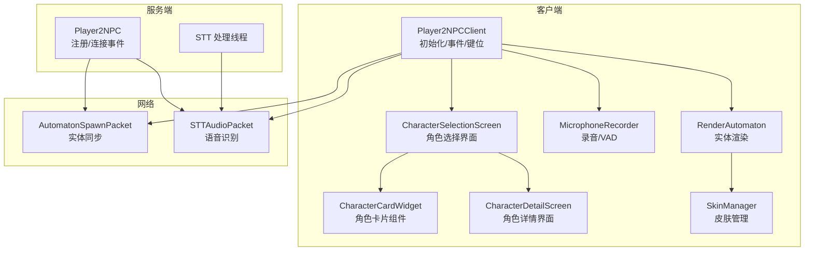
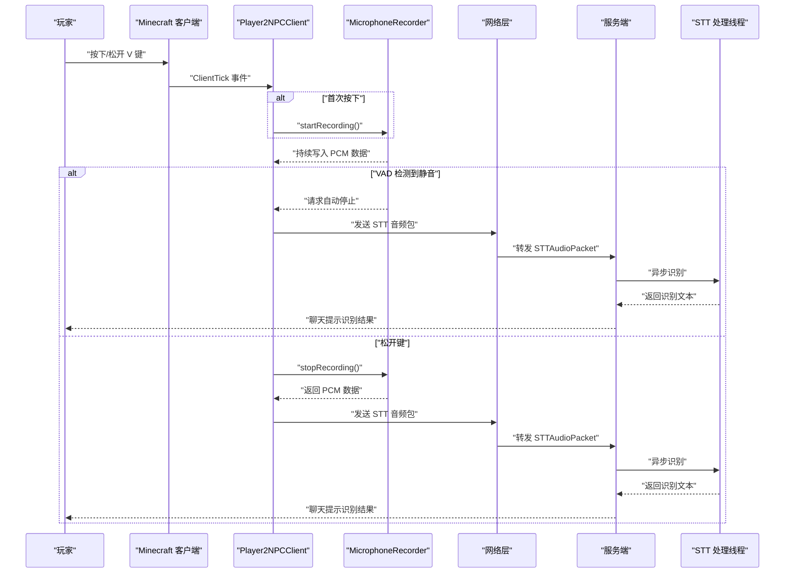
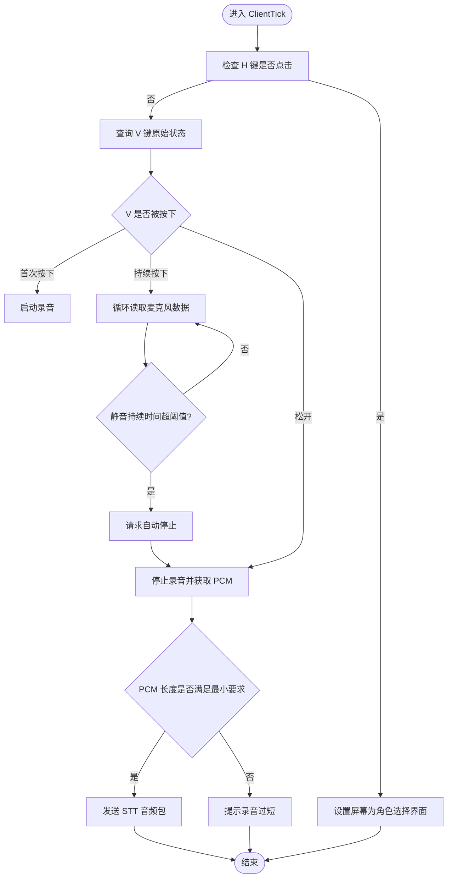
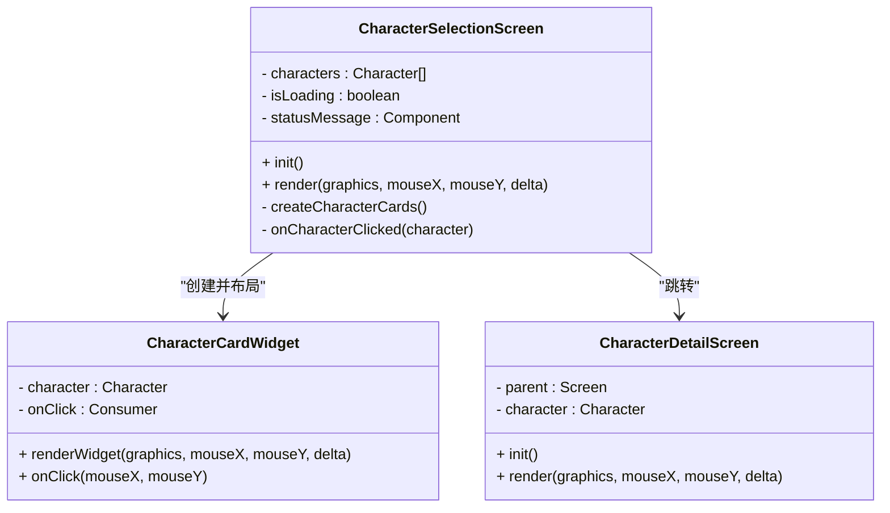
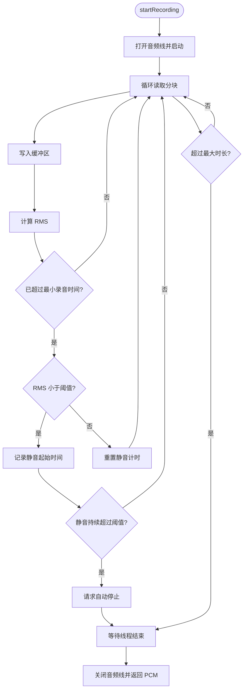
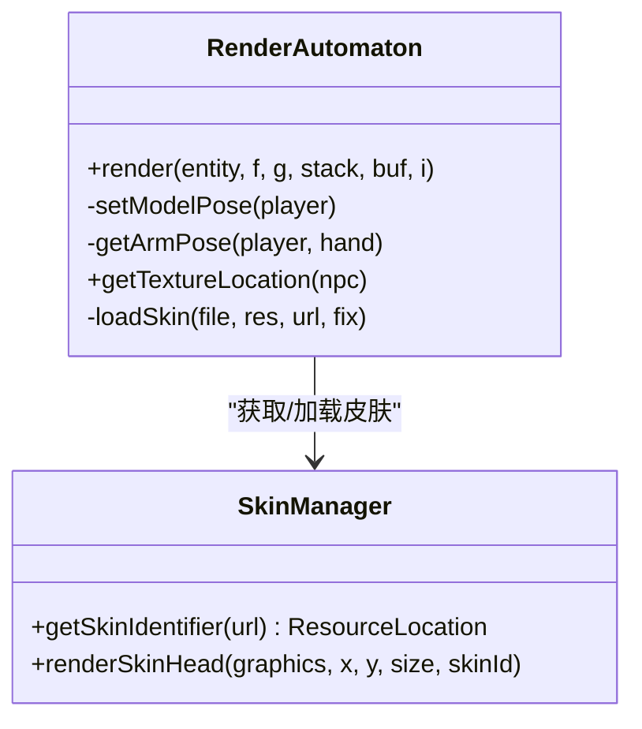
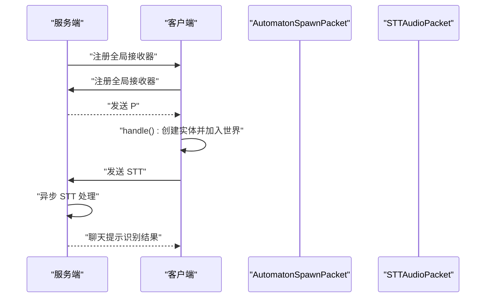
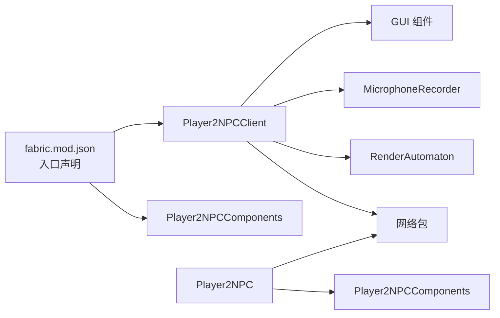

# 客户端集成与界面

<cite>
**本文引用的文件**
- [Player2NPCClient.java](file://src/main/java/com/goodbird/player2npc/Player2NPCClient.java)
- [Player2NPC.java](file://src/main/java/com/goodbird/player2npc/Player2NPC.java)
- [Player2NPCComponents.java](file://src/main/java/com/goodbird/player2npc/Player2NPCComponents.java)
- [CharacterSelectionScreen.java](file://src/main/java/com/goodbird/player2npc/client/gui/CharacterSelectionScreen.java)
- [CharacterCardWidget.java](file://src/main/java/com/goodbird/player2npc/client/gui/CharacterCardWidget.java)
- [CharacterDetailScreen.java](file://src/main/java/com/goodbird/player2npc/client/gui/CharacterDetailScreen.java)
- [MicrophoneRecorder.java](file://src/main/java/com/goodbird/player2npc/client/audio/MicrophoneRecorder.java)
- [RenderAutomaton.java](file://src/main/java/com/goodbird/player2npc/client/render/RenderAutomaton.java)
- [SkinManager.java](file://src/main/java/com/goodbird/player2npc/client/util/SkinManager.java)
- [AutomatonSpawnPacket.java](file://src/main/java/com/goodbird/player2npc/network/AutomatonSpawnPacket.java)
- [STTAudioPacket.java](file://src/main/java/com/goodbird/player2npc/network/STTAudioPacket.java)
- [fabric.mod.json](file://src/main/resources/fabric.mod.json)
</cite>

## 目录
1. [简介](#简介)
2. [项目结构](#项目结构)
3. [核心组件](#核心组件)
4. [架构总览](#架构总览)
5. [详细组件分析](#详细组件分析)
6. [依赖分析](#依赖分析)
7. [性能考虑](#性能考虑)
8. [故障排查指南](#故障排查指南)
9. [结论](#结论)
10. [附录](#附录)

## 简介
本文件聚焦于客户端集成与界面模块，围绕以下目标展开：  
- 深入解释 Player2NPCClient 类的客户端初始化流程、Fabric 客户端事件处理、键位绑定机制。  
- 详细说明 CharacterSelectionScreen 角色选择界面的设计实现，包括 GUI 组件系统、用户交互逻辑、皮肤加载机制。  
- 解释 MicrophoneRecorder 麦克风录音系统的音频处理流程、实时音频流传输、音频格式转换。  
- 提供客户端渲染系统、事件响应、用户体验优化的技术实现细节。

## 项目结构
该模块位于 com.goodbird.player2npc 的客户端子包中，主要包含 GUI、音频、渲染与工具类，以及与服务端通信的网络包定义。入口通过 Fabric 模组入口注册，客户端侧由 Player2NPCClient 负责初始化。

图示来源
- [Player2NPCClient.java:36-124](file://src/main/java/com/goodbird/player2npc/Player2NPCClient.java#L36-L124)
- [CharacterSelectionScreen.java:13-106](file://src/main/java/com/goodbird/player2npc/client/gui/CharacterSelectionScreen.java#L13-L106)
- [CharacterCardWidget.java:14-53](file://src/main/java/com/goodbird/player2npc/client/gui/CharacterCardWidget.java#L14-L53)
- [CharacterDetailScreen.java:18-80](file://src/main/java/com/goodbird/player2npc/client/gui/CharacterDetailScreen.java#L18-L80)
- [MicrophoneRecorder.java:21-200](file://src/main/java/com/goodbird/player2npc/client/audio/MicrophoneRecorder.java#L21-L200)
- [RenderAutomaton.java:39-202](file://src/main/java/com/goodbird/player2npc/client/render/RenderAutomaton.java#L39-L202)
- [SkinManager.java:10-57](file://src/main/java/com/goodbird/player2npc/client/util/SkinManager.java#L10-L57)
- [AutomatonSpawnPacket.java:26-120](file://src/main/java/com/goodbird/player2npc/network/AutomatonSpawnPacket.java#L26-L120)
- [STTAudioPacket.java:28-134](file://src/main/java/com/goodbird/player2npc/network/STTAudioPacket.java#L28-L134)
- [Player2NPC.java:25-67](file://src/main/java/com/goodbird/player2npc/Player2NPC.java#L25-L67)

章节来源
- [fabric.mod.json:17-28](file://src/main/resources/fabric.mod.json#L17-L28)

## 核心组件
- 客户端初始化与事件处理：Player2NPCClient 负责注册实体渲染器、网络全局接收器、按键绑定，并在每 tick 中处理角色界面打开与 PTT 推杆通话逻辑。
- 角色选择界面：CharacterSelectionScreen 加载角色列表，CharacterCardWidget 渲染角色头像与名称，CharacterDetailScreen 展示角色详情并提供召唤/解散操作。
- 麦克风录音系统：MicrophoneRecorder 使用 Java Sound API 录制 16kHz/16bit/Mono PCM，内置 VAD（能量阈值）自动停止检测。
- 客户端渲染：RenderAutomaton 基于玩家模型与层系统渲染 AI NPC 实体，并通过 SkinManager 与 ResourceDownloader 加载皮肤纹理。
- 网络通信：AutomatonSpawnPacket 同步实体位置、朝向、装备与角色信息；STTAudioPacket 接收客户端音频并触发服务端 STT 流程。

章节来源
- [Player2NPCClient.java:36-124](file://src/main/java/com/goodbird/player2npc/Player2NPCClient.java#L36-L124)
- [CharacterSelectionScreen.java:13-106](file://src/main/java/com/goodbird/player2npc/client/gui/CharacterSelectionScreen.java#L13-L106)
- [CharacterCardWidget.java:14-53](file://src/main/java/com/goodbird/player2npc/client/gui/CharacterCardWidget.java#L14-L53)
- [CharacterDetailScreen.java:18-80](file://src/main/java/com/goodbird/player2npc/client/gui/CharacterDetailScreen.java#L18-L80)
- [MicrophoneRecorder.java:21-200](file://src/main/java/com/goodbird/player2npc/client/audio/MicrophoneRecorder.java#L21-L200)
- [RenderAutomaton.java:39-202](file://src/main/java/com/goodbird/player2npc/client/render/RenderAutomaton.java#L39-L202)
- [SkinManager.java:10-57](file://src/main/java/com/goodbird/player2npc/client/util/SkinManager.java#L10-L57)
- [AutomatonSpawnPacket.java:26-120](file://src/main/java/com/goodbird/player2npc/network/AutomatonSpawnPacket.java#L26-L120)
- [STTAudioPacket.java:28-134](file://src/main/java/com/goodbird/player2npc/network/STTAudioPacket.java#L28-L134)

## 架构总览
下图展示从按键输入到语音识别再到实体渲染的关键路径，体现客户端事件驱动、网络同步与服务端处理的协作关系。

图示来源
- [Player2NPCClient.java:56-123](file://src/main/java/com/goodbird/player2npc/Player2NPCClient.java#L56-L123)
- [MicrophoneRecorder.java:62-153](file://src/main/java/com/goodbird/player2npc/client/audio/MicrophoneRecorder.java#L62-L153)
- [STTAudioPacket.java:39-121](file://src/main/java/com/goodbird/player2npc/network/STTAudioPacket.java#L39-L121)

## 详细组件分析

### Player2NPCClient 客户端初始化与事件处理
- 初始化流程
  - 注册实体渲染器：将自定义实体类型与 RenderAutomaton 绑定。
  - 注册网络全局接收器：监听服务端推送的实体生成包。
  - 注册按键绑定：打开角色界面与推杆通话（PTT）。
- 事件处理
  - 在每 tick 结束时检查按键状态，使用 GLFW 直接查询原始键状态以避免 Minecraft KeyMapping 的抖动问题。
  - PTT 模式：按下开始录音，松开或 VAD 自动停止后发送 STT 音频包。
  - 角色界面：按下 H 打开 CharacterSelectionScreen。
- 音频发送
  - 包含语言标识、变长长度与字节流，统一通过 Fabric 网络层发送至服务端指定通道。

图示来源
- [Player2NPCClient.java:56-123](file://src/main/java/com/goodbird/player2npc/Player2NPCClient.java#L56-L123)

章节来源
- [Player2NPCClient.java:36-124](file://src/main/java/com/goodbird/player2npc/Player2NPCClient.java#L36-L124)

### 角色选择界面与交互逻辑
- 角色列表加载
  - 初始化时清空控件，异步拉取角色列表，完成后根据布局动态排列卡片。
- 卡片组件
  - 绘制背景与标题，使用 SkinManager 获取皮肤并渲染头部。
- 详情界面
  - 展示角色描述与头像，提供“召唤”“解散”“返回”按钮，分别对应网络请求与返回上一界面。

图示来源
- [CharacterSelectionScreen.java:13-106](file://src/main/java/com/goodbird/player2npc/client/gui/CharacterSelectionScreen.java#L13-L106)
- [CharacterCardWidget.java:14-53](file://src/main/java/com/goodbird/player2npc/client/gui/CharacterCardWidget.java#L14-L53)
- [CharacterDetailScreen.java:18-80](file://src/main/java/com/goodbird/player2npc/client/gui/CharacterDetailScreen.java#L18-L80)

章节来源
- [CharacterSelectionScreen.java:13-106](file://src/main/java/com/goodbird/player2npc/client/gui/CharacterSelectionScreen.java#L13-L106)
- [CharacterCardWidget.java:14-53](file://src/main/java/com/goodbird/player2npc/client/gui/CharacterCardWidget.java#L14-L53)
- [CharacterDetailScreen.java:18-80](file://src/main/java/com/goodbird/player2npc/client/gui/CharacterDetailScreen.java#L18-L80)

### 麦克风录音系统与音频处理
- 录音参数
  - 采样率 16kHz、16bit、单声道、小端序有符号整数，符合服务端 STT 输入要求。
- 录音线程
  - 以固定分块大小读取 TargetDataLine，写入缓冲区；同时计算最近分块的 RMS 声压级。
- VAD 自动停止
  - 连续静音超过阈值时间后请求自动停止；同时限制最大录音时长防止资源泄漏。
- 输出与校验
  - 停止录音后返回 PCM 字节数组；客户端侧对最短时长进行校验后再发送。

图示来源
- [MicrophoneRecorder.java:62-153](file://src/main/java/com/goodbird/player2npc/client/audio/MicrophoneRecorder.java#L62-L153)

章节来源
- [MicrophoneRecorder.java:21-200](file://src/main/java/com/goodbird/player2npc/client/audio/MicrophoneRecorder.java#L21-L200)

### 客户端渲染系统与皮肤加载
- 渲染器
  - 基于玩家模型与多层（盔甲、主副手物品、头颅、鞘翅、旋转攻击等）组合，按实体状态设置姿态。
- 皮肤加载
  - 若缓存纹理不存在，则通过 ResourceDownloader 异步下载并注册；若失败回退至默认皮肤。
- 实体偏移与变换
  - 根据实体状态（潜行、游泳、飞行）调整渲染偏移与旋转，保证视觉一致性。

图示来源
- [RenderAutomaton.java:39-202](file://src/main/java/com/goodbird/player2npc/client/render/RenderAutomaton.java#L39-L202)
- [SkinManager.java:10-57](file://src/main/java/com/goodbird/player2npc/client/util/SkinManager.java#L10-L57)

章节来源
- [RenderAutomaton.java:39-202](file://src/main/java/com/goodbird/player2npc/client/render/RenderAutomaton.java#L39-L202)
- [SkinManager.java:10-57](file://src/main/java/com/goodbird/player2npc/client/util/SkinManager.java#L10-L57)

### 网络包与事件响应
- 实体生成包
  - 服务端通过 AutomatonSpawnPacket 向客户端广播实体的 ID、位置、速度、朝向、角色与库存信息；客户端在主线程创建实体并加入世界。
- 语音识别包
  - 客户端发送 STTAudioPacket（语言、长度、音频），服务端异步执行 STT 并将识别结果注入对话系统，同时向玩家反馈消息。

图示来源
- [AutomatonSpawnPacket.java:100-119](file://src/main/java/com/goodbird/player2npc/network/AutomatonSpawnPacket.java#L100-L119)
- [STTAudioPacket.java:39-121](file://src/main/java/com/goodbird/player2npc/network/STTAudioPacket.java#L39-L121)

章节来源
- [AutomatonSpawnPacket.java:26-120](file://src/main/java/com/goodbird/player2npc/network/AutomatonSpawnPacket.java#L26-L120)
- [STTAudioPacket.java:28-134](file://src/main/java/com/goodbird/player2npc/network/STTAudioPacket.java#L28-L134)

## 依赖分析
- 入口与组件注册
  - fabric.mod.json 中声明了客户端入口 Player2NPCClient 与 Cardinal Components 注册入口 Player2NPCComponents。
  - Player2NPCComponents 将 CompanionManager 作为实体组件注册到 ServerPlayer。
- 客户端耦合
  - Player2NPCClient 依赖 GUI、音频、渲染与网络包；与 Minecraft 客户端生命周期与网络 API 紧密耦合。
- 服务端耦合
  - Player2NPC 在服务端注册网络接收器与连接事件，负责在连接/断开时管理同伴实体。

图示来源
- [fabric.mod.json:17-28](file://src/main/resources/fabric.mod.json#L17-L28)
- [Player2NPCComponents.java:10-16](file://src/main/java/com/goodbird/player2npc/Player2NPCComponents.java#L10-L16)
- [Player2NPC.java:25-67](file://src/main/java/com/goodbird/player2npc/Player2NPC.java#L25-L67)

章节来源
- [fabric.mod.json:17-28](file://src/main/resources/fabric.mod.json#L17-L28)
- [Player2NPCComponents.java:10-16](file://src/main/java/com/goodbird/player2npc/Player2NPCComponents.java#L10-L16)
- [Player2NPC.java:25-67](file://src/main/java/com/goodbird/player2npc/Player2NPC.java#L25-L67)

## 性能考虑
- 音频处理
  - 录音采用分块读取与后台线程，避免阻塞主线程；建议在设备能力不足时降低分块大小或采样率。
  - VAD 阈值与静音窗口需平衡误触与灵敏度，避免频繁启停导致 CPU 占用。
- 网络传输
  - STT 音频包体积较大，建议在网络层进行压缩或限速策略；客户端侧应避免连续高频发送。
- 渲染与纹理
  - 皮肤下载采用异步缓存，首次加载可能产生卡顿；可预热常用皮肤或延迟加载非当前可见区域。
- UI 响应
  - 角色列表加载使用异步任务，界面保持可交互；建议增加加载进度与错误提示。

## 故障排查指南
- 麦克风不可用
  - 现象：PTT 开始录音时报错或直接提示麦克风不可用。
  - 排查：确认系统权限、驱动与音频格式匹配；检查 isMicrophoneAvailable 返回值。
- 录音过短
  - 现象：发送后提示录音时间过短。
  - 排查：确认客户端最小字节阈值与服务端 STT 最小长度一致；确保按下时间足够。
- VAD 误触发/不触发
  - 现象：静音检测过于敏感或不生效。
  - 排查：调整静音阈值、静音窗口与最小录音时间；测试不同环境噪声。
- 皮肤加载失败
  - 现象：渲染使用默认皮肤而非角色皮肤。
  - 排查：检查皮肤 URL 可达性与缓存文件；确认纹理注册成功。
- 网络异常
  - 现象：角色无法召唤/消失或 STT 无响应。
  - 排查：确认网络通道名一致、服务端已注册接收器、连接可用。

章节来源
- [Player2NPCClient.java:77-118](file://src/main/java/com/goodbird/player2npc/Player2NPCClient.java#L77-L118)
- [MicrophoneRecorder.java:49-56](file://src/main/java/com/goodbird/player2npc/client/audio/MicrophoneRecorder.java#L49-L56)
- [STTAudioPacket.java:57-63](file://src/main/java/com/goodbird/player2npc/network/STTAudioPacket.java#L57-L63)
- [RenderAutomaton.java:140-162](file://src/main/java/com/goodbird/player2npc/client/render/RenderAutomaton.java#L140-L162)

## 结论
本模块通过清晰的职责划分与事件驱动设计，实现了从按键输入到语音识别、从角色选择到实体渲染的完整客户端体验。Player2NPCClient 作为中枢协调 GUI、音频与网络；RenderAutomaton 与 SkinManager 提供高质量的视觉呈现；STTAudioPacket 与 AutomatonSpawnPacket 则保障了跨端数据的一致性与实时性。后续可在音频阈值调优、网络带宽控制与 UI 加载优化方面进一步提升稳定性与用户体验。

## 附录
- 键位绑定
  - H：打开角色选择界面
  - V：推杆通话（PTT），支持 VAD 自动停止
- 音频格式
  - 16kHz、16bit、单声道、小端序有符号整数
- 最小录音时长
  - 客户端：约 0.5 秒（字节数阈值）
  - 服务端：约 1 秒（STT 要求）