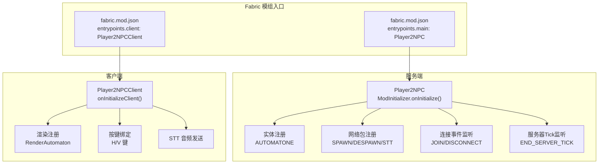
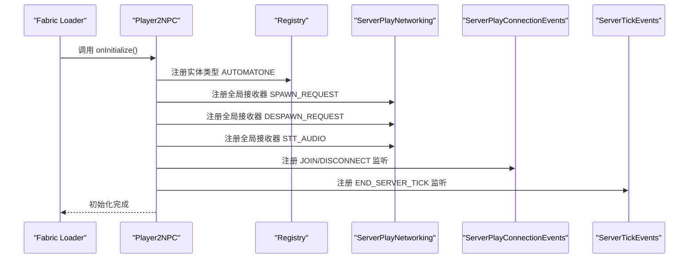
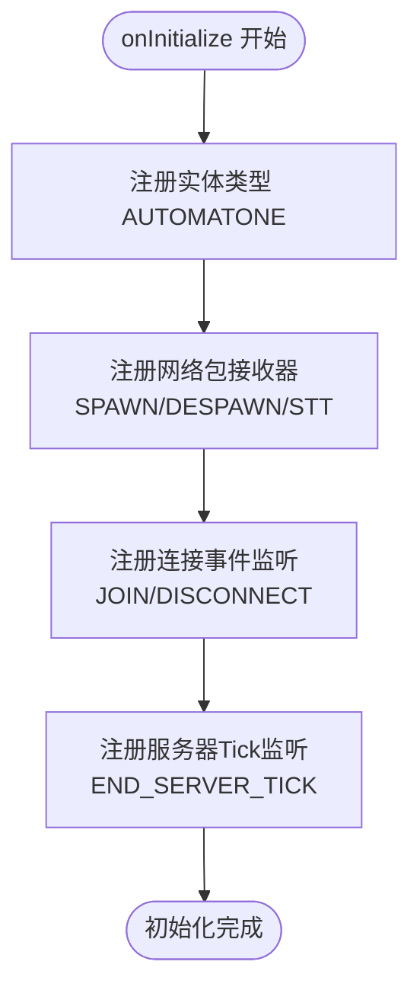
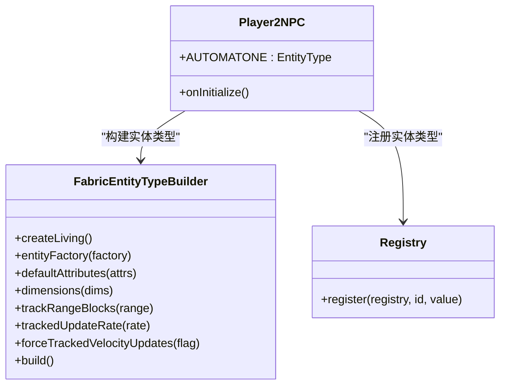
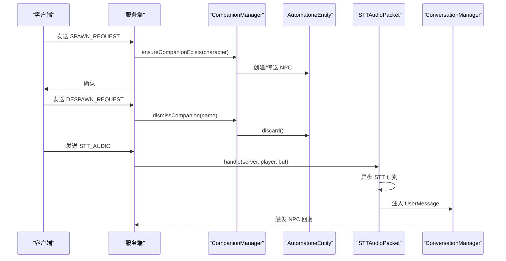
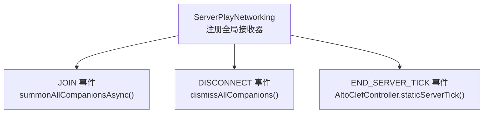
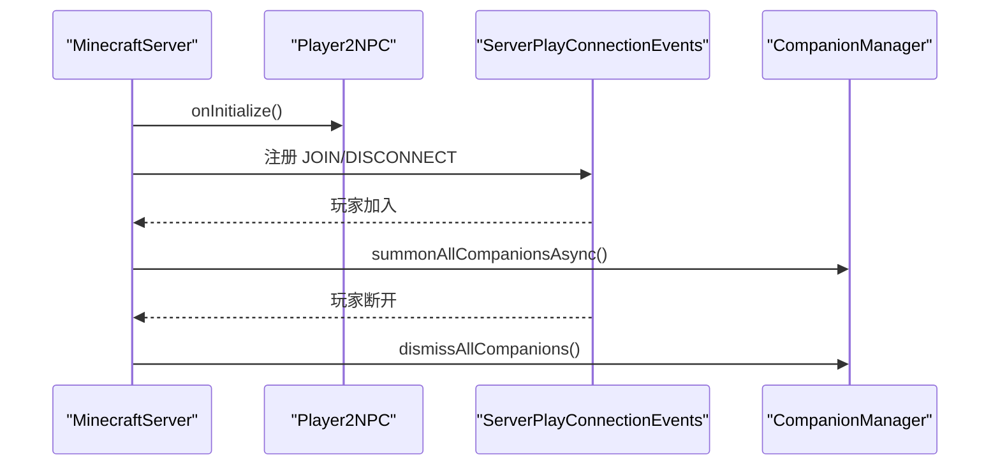
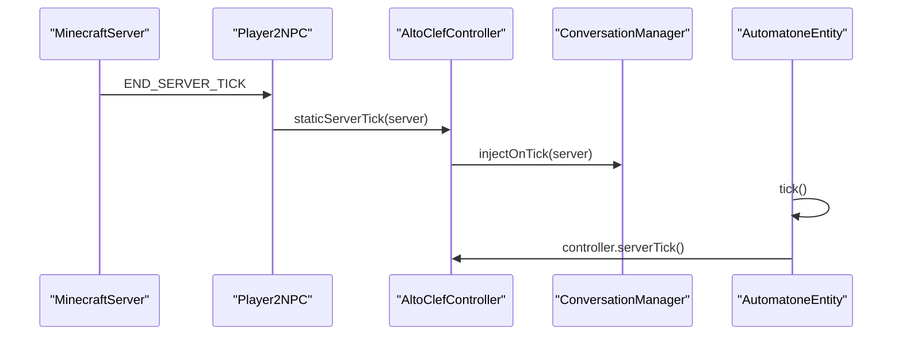
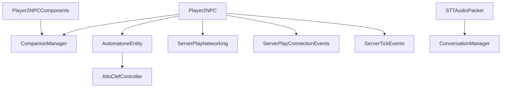

# 服务端初始化与生命周期

<cite>
**本文引用的文件**
- [Player2NPC.java](file://src/main/java/com/goodbird/player2npc/Player2NPC.java)
- [Player2NPCClient.java](file://src/main/java/com/goodbird/player2npc/Player2NPCClient.java)
- [Player2NPCComponents.java](file://src/main/java/com/goodbird/player2npc/Player2NPCComponents.java)
- [CompanionManager.java](file://src/main/java/com/goodbird/player2npc/companion/CompanionManager.java)
- [AutomatoneEntity.java](file://src/main/java/com/goodbird/player2npc/companion/AutomatoneEntity.java)
- [AutomatoneSpawnRequestPacket.java](file://src/main/java/com/goodbird/player2npc/network/AutomatoneSpawnRequestPacket.java)
- [AutomatoneDespawnRequestPacket.java](file://src/main/java/com/goodbird/player2npc/network/AutomatoneDespawnRequestPacket.java)
- [STTAudioPacket.java](file://src/main/java/com/goodbird/player2npc/network/STTAudioPacket.java)
- [AltoClefController.java](file://src/main/java/adris/altoclef/AltoClefController.java)
- [ConversationManager.java](file://src/main/java/adris/altoclef/player2api/manager/ConversationManager.java)
- [fabric.mod.json](file://src/main/resources/fabric.mod.json)
</cite>

## 目录
1. [简介](#简介)
2. [项目结构](#项目结构)
3. [核心组件](#核心组件)
4. [架构总览](#架构总览)
5. [详细组件分析](#详细组件分析)
6. [依赖分析](#依赖分析)
7. [性能考量](#性能考量)
8. [故障排查指南](#故障排查指南)
9. [结论](#结论)

## 简介
本文件聚焦于服务端初始化与生命周期模块，围绕 Player2NPC 作为 Fabric 模组入口点的实现进行深入解析。内容涵盖：
- ModInitializer 接口 onInitialize 方法的执行流程
- 实体类型注册机制
- 网络包注册系统
- 服务器事件监听器注册（ServerPlayNetworking、ServerTickEvents、ServerPlayConnectionEvents）
- 模组如何在服务器启动时完成初始化，以及如何处理玩家连接和断开事件
- 具体的代码示例路径，展示模组生命周期管理的最佳实践

## 项目结构
该模组采用 Fabric 模组结构，入口点分别在服务端与客户端注册。服务端入口负责实体注册、网络包接收器注册、服务器事件监听器注册；客户端入口负责渲染与按键绑定等。

图表来源
- [fabric.mod.json:17-29](file://src/main/resources/fabric.mod.json#L17-L29)
- [Player2NPC.java:48-66](file://src/main/java/com/goodbird/player2npc/Player2NPC.java#L48-L66)
- [Player2NPCClient.java:36-124](file://src/main/java/com/goodbird/player2npc/Player2NPCClient.java#L36-L124)

章节来源
- [fabric.mod.json:17-29](file://src/main/resources/fabric.mod.json#L17-L29)

## 核心组件
- Player2NPC：服务端入口，实现 ModInitializer，负责实体注册、网络包接收器注册、服务器事件监听器注册。
- CompanionManager：基于 Cardinal Components API 的玩家组件，管理 AI NPC 的召唤、消失与持久化。
- AutomatoneEntity：AI NPC 实体，继承 LivingEntity，实现 IAutomatone 等接口，负责服务端 Tick 逻辑。
- 网络包处理器：AutomatoneSpawnRequestPacket、AutomatoneDespawnRequestPacket、STTAudioPacket，分别处理客户端请求与语音识别。
- Player2NPCComponents：注册玩家组件（CompanionManager）。
- Player2NPCClient：客户端入口，负责渲染注册、按键绑定与 STT 音频发送。

章节来源
- [Player2NPC.java:25-66](file://src/main/java/com/goodbird/player2npc/Player2NPC.java#L25-L66)
- [Player2NPCComponents.java:9-16](file://src/main/java/com/goodbird/player2npc/Player2NPCComponents.java#L9-L16)
- [AutomatoneEntity.java:50-313](file://src/main/java/com/goodbird/player2npc/companion/AutomatoneEntity.java#L50-L313)
- [CompanionManager.java:28-191](file://src/main/java/com/goodbird/player2npc/companion/CompanionManager.java#L28-L191)
- [AutomatoneSpawnRequestPacket.java:24-66](file://src/main/java/com/goodbird/player2npc/network/AutomatoneSpawnRequestPacket.java#L24-L66)
- [AutomatoneDespawnRequestPacket.java:21-64](file://src/main/java/com/goodbird/player2npc/network/AutomatoneDespawnRequestPacket.java#L21-L64)
- [STTAudioPacket.java:28-134](file://src/main/java/com/goodbird/player2npc/network/STTAudioPacket.java#L28-L134)
- [Player2NPCClient.java:23-124](file://src/main/java/com/goodbird/player2npc/Player2NPCClient.java#L23-L124)

## 架构总览
服务端初始化流程如下：
- Fabric 加载 fabric.mod.json，调用服务端入口 Player2NPC.onInitialize()
- 注册实体类型 AUTOMATONE
- 注册全局网络包接收器（请求生成、请求消失、STT 音频）
- 注册连接事件监听（JOIN/DISCONNECT）
- 注册服务器 Tick 事件监听（END_SERVER_TICK）

图表来源
- [Player2NPC.java:48-66](file://src/main/java/com/goodbird/player2npc/Player2NPC.java#L48-L66)
- [fabric.mod.json:17-29](file://src/main/resources/fabric.mod.json#L17-L29)

## 详细组件分析

### Player2NPC：服务端入口与生命周期
- 实现 ModInitializer，覆盖 onInitialize 方法
- 注册实体类型 AUTOMATONE 至 BuiltInRegistries.ENTITY_TYPE
- 注册三个全局网络包接收器：
  - SPAWN_REQUEST_PACKET_ID：处理客户端请求生成 AI NPC
  - DESPAWN_REQUEST_PACKET_ID：处理客户端请求消失 AI NPC
  - STT_AUDIO_PACKET_ID：处理客户端发送的语音识别请求
- 注册连接事件：
  - JOIN：为玩家组件调用 summonAllCompanionsAsync，异步拉取角色并生成 NPC
  - DISCONNECT：为玩家组件调用 dismissAllCompanions，清理 NPC
- 注册服务器 Tick 事件：
  - END_SERVER_TICK：调用 AltoClefController.staticServerTick，注入对话系统

图表来源
- [Player2NPC.java:48-66](file://src/main/java/com/goodbird/player2npc/Player2NPC.java#L48-L66)

章节来源
- [Player2NPC.java:25-66](file://src/main/java/com/goodbird/player2npc/Player2NPC.java#L25-L66)

### 实体类型注册机制
- 使用 FabricEntityTypeBuilder 创建实体类型 AUTOMATONE
- 设置实体工厂、属性、尺寸、追踪范围与更新频率
- 在 onInitialize 中通过 Registry.register 将实体类型注册到 BuiltInRegistries.ENTITY_TYPE

图表来源
- [Player2NPC.java:38-46](file://src/main/java/com/goodbird/player2npc/Player2NPC.java#L38-L46)
- [Player2NPC.java:50](file://src/main/java/com/goodbird/player2npc/Player2NPC.java#L50)

章节来源
- [Player2NPC.java:38-50](file://src/main/java/com/goodbird/player2npc/Player2NPC.java#L38-L50)

### 网络包注册系统
- SPAWN_REQUEST_PACKET_ID：客户端请求生成特定角色的 NPC，服务端通过 CompanionManager.ensureCompanionExists 创建或传送现有 NPC
- DESPAWN_REQUEST_PACKET_ID：客户端请求消失指定角色的 NPC，服务端通过 CompanionManager.dismissCompanion 移除
- STT_AUDIO_PACKET_ID：客户端发送语音数据，服务端异步执行 STT，将识别结果注入 ConversationManager，触发 NPC 回复

图表来源
- [AutomatoneSpawnRequestPacket.java:57-65](file://src/main/java/com/goodbird/player2npc/network/AutomatoneSpawnRequestPacket.java#L57-L65)
- [AutomatoneDespawnRequestPacket.java:56-63](file://src/main/java/com/goodbird/player2npc/network/AutomatoneDespawnRequestPacket.java#L56-L63)
- [STTAudioPacket.java:39-121](file://src/main/java/com/goodbird/player2npc/network/STTAudioPacket.java#L39-L121)
- [CompanionManager.java:100-129](file://src/main/java/com/goodbird/player2npc/companion/CompanionManager.java#L100-L129)

章节来源
- [AutomatoneSpawnRequestPacket.java:24-66](file://src/main/java/com/goodbird/player2npc/network/AutomatoneSpawnRequestPacket.java#L24-L66)
- [AutomatoneDespawnRequestPacket.java:21-64](file://src/main/java/com/goodbird/player2npc/network/AutomatoneDespawnRequestPacket.java#L21-L64)
- [STTAudioPacket.java:28-134](file://src/main/java/com/goodbird/player2npc/network/STTAudioPacket.java#L28-L134)

### 服务器事件监听器注册
- ServerPlayNetworking：注册全局接收器，处理 SPAWN/DESPAWN/STT 三种网络包
- ServerPlayConnectionEvents：注册 JOIN/DISCONNECT 监听，分别在连接建立时异步召唤 NPC，在断开时清理 NPC
- ServerTickEvents：注册 END_SERVER_TICK 监听，调用 AltoClefController.staticServerTick，注入对话系统

图表来源
- [Player2NPC.java:52-64](file://src/main/java/com/goodbird/player2npc/Player2NPC.java#L52-L64)
- [AltoClefController.java:152-158](file://src/main/java/adris/altoclef/AltoClefController.java#L152-L158)

章节来源
- [Player2NPC.java:48-66](file://src/main/java/com/goodbird/player2npc/Player2NPC.java#L48-L66)
- [AltoClefController.java:152-158](file://src/main/java/adris/altoclef/AltoClefController.java#L152-L158)

### 服务器启动时的初始化与玩家连接/断开处理
- 服务器启动：Player2NPC.onInitialize() 完成实体注册、网络包接收器注册、事件监听器注册
- 玩家连接：JOIN 事件触发 CompanionManager.summonAllCompanionsAsync，异步拉取角色并生成 NPC
- 玩家断开：DISCONNECT 事件触发 CompanionManager.dismissAllCompanions，清理所有 NPC

图表来源
- [Player2NPC.java:48-66](file://src/main/java/com/goodbird/player2npc/Player2NPC.java#L48-L66)
- [CompanionManager.java:45-74](file://src/main/java/com/goodbird/player2npc/companion/CompanionManager.java#L45-L74)
- [CompanionManager.java:146-150](file://src/main/java/com/goodbird/player2npc/companion/CompanionManager.java#L146-L150)

章节来源
- [Player2NPC.java:48-66](file://src/main/java/com/goodbird/player2npc/Player2NPC.java#L48-L66)
- [CompanionManager.java:45-74](file://src/main/java/com/goodbird/player2npc/companion/CompanionManager.java#L45-L74)
- [CompanionManager.java:146-150](file://src/main/java/com/goodbird/player2npc/companion/CompanionManager.java#L146-L150)

### 服务器 Tick 与 AI 控制器
- Player2NPC 在 END_SERVER_TICK 注册中调用 AltoClefController.staticServerTick
- ConversationManager.injectOnTick 在 Tick 中注入事件队列，维持对话系统运行
- AutomatoneEntity 在服务端 Tick 中调用 controller.serverTick，推进 AI 行为

图表来源
- [Player2NPC.java:62-64](file://src/main/java/com/goodbird/player2npc/Player2NPC.java#L62-L64)
- [AltoClefController.java:156-158](file://src/main/java/adris/altoclef/AltoClefController.java#L156-L158)
- [AutomatoneEntity.java:164-177](file://src/main/java/com/goodbird/player2npc/companion/AutomatoneEntity.java#L164-L177)

章节来源
- [Player2NPC.java:62-64](file://src/main/java/com/goodbird/player2npc/Player2NPC.java#L62-L64)
- [AltoClefController.java:152-158](file://src/main/java/adris/altoclef/AltoClefController.java#L152-L158)
- [AutomatoneEntity.java:164-177](file://src/main/java/com/goodbird/player2npc/companion/AutomatoneEntity.java#L164-L177)

## 依赖分析
- Player2NPCComponents：为 ServerPlayer 注册 CompanionManager 组件，使每个玩家拥有独立的 NPC 管理能力
- Player2NPC：依赖 Fabric API 的 ModInitializer、ServerTickEvents、ServerPlayConnectionEvents、ServerPlayNetworking
- AutomatoneEntity：依赖 Baritone 接口与 AltoClefController，实现 AI 行为与 Tick 逻辑
- 网络包：依赖 Fabric API 的 PacketType、PacketByteBufs、ClientPlayNetworking/ServerPlayNetworking

图表来源
- [Player2NPCComponents.java:12-15](file://src/main/java/com/goodbird/player2npc/Player2NPCComponents.java#L12-L15)
- [Player2NPC.java:48-66](file://src/main/java/com/goodbird/player2npc/Player2NPC.java#L48-L66)
- [AutomatoneEntity.java:50-91](file://src/main/java/com/goodbird/player2npc/companion/AutomatoneEntity.java#L50-L91)
- [STTAudioPacket.java:39-121](file://src/main/java/com/goodbird/player2npc/network/STTAudioPacket.java#L39-L121)

章节来源
- [Player2NPCComponents.java:9-16](file://src/main/java/com/goodbird/player2npc/Player2NPCComponents.java#L9-L16)
- [Player2NPC.java:48-66](file://src/main/java/com/goodbird/player2npc/Player2NPC.java#L48-L66)
- [AutomatoneEntity.java:50-91](file://src/main/java/com/goodbird/player2npc/companion/AutomatoneEntity.java#L50-L91)
- [STTAudioPacket.java:28-134](file://src/main/java/com/goodbird/player2npc/network/STTAudioPacket.java#L28-L134)

## 性能考量
- 异步处理：玩家连接时的 NPC 召唤通过 CompletableFuture 异步执行，避免阻塞服务器线程
- STT 异步：服务端 STTAudioPacket 在独立线程执行识别，完成后通过 server.execute 回到服务器线程注入事件
- Tick 负载：END_SERVER_TICK 注册了多个系统（AltoClefController、ConversationManager），确保 Tick 内部逻辑轻量高效
- 网络包：STT 音频包长度限制与最小录音时长检查，防止过短音频造成无效负载

章节来源
- [CompanionManager.java:45-74](file://src/main/java/com/goodbird/player2npc/companion/CompanionManager.java#L45-L74)
- [STTAudioPacket.java:65-121](file://src/main/java/com/goodbird/player2npc/network/STTAudioPacket.java#L65-L121)
- [AltoClefController.java:152-158](file://src/main/java/adris/altoclef/AltoClefController.java#L152-L158)

## 故障排查指南
- 无法生成 NPC：检查 JOIN 事件是否触发 CompanionManager.summonAllCompanionsAsync，确认 CharacterUtils 能正确拉取角色
- NPC 未消失：检查 DISCONNECT 事件是否触发 CompanionManager.dismissAllCompanions
- STT 无效：检查 STT 配置是否启用、API Key 是否有效、音频长度是否满足最小要求
- 服务器卡顿：检查 END_SERVER_TICK 注册的系统是否过度占用 CPU，必要时拆分 Tick 任务

章节来源
- [CompanionManager.java:146-150](file://src/main/java/com/goodbird/player2npc/companion/CompanionManager.java#L146-L150)
- [STTAudioPacket.java:65-121](file://src/main/java/com/goodbird/player2npc/network/STTAudioPacket.java#L65-L121)
- [Player2NPC.java:62-64](file://src/main/java/com/goodbird/player2npc/Player2NPC.java#L62-L64)

## 结论
Player2NPC 作为服务端入口，通过 ModInitializer.onInitialize 完成了实体注册、网络包接收器注册、连接事件监听与服务器 Tick 监听，实现了模组在服务器启动时的完整初始化。配合玩家组件（CompanionManager）与 AI 控制器（AltoClefController），模组在服务器生命周期内稳定运行，支持玩家连接/断开时的 NPC 生命周期管理，并通过异步处理保证性能与稳定性。