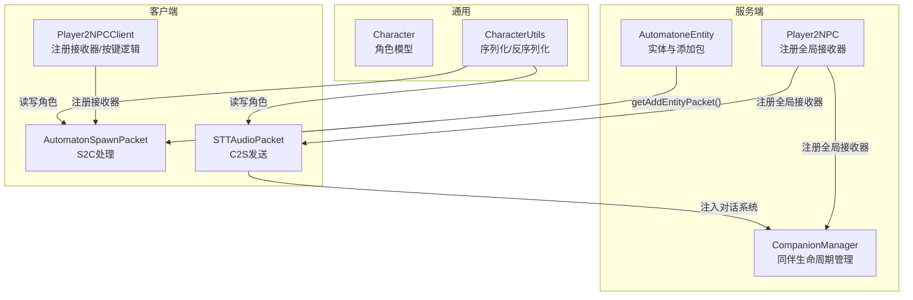
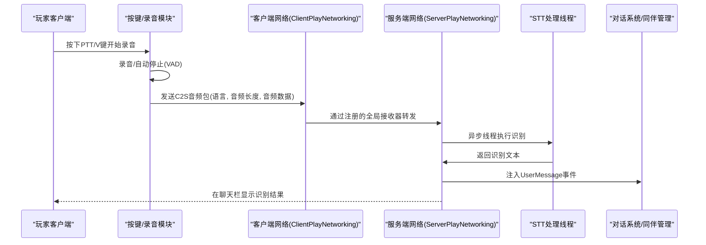
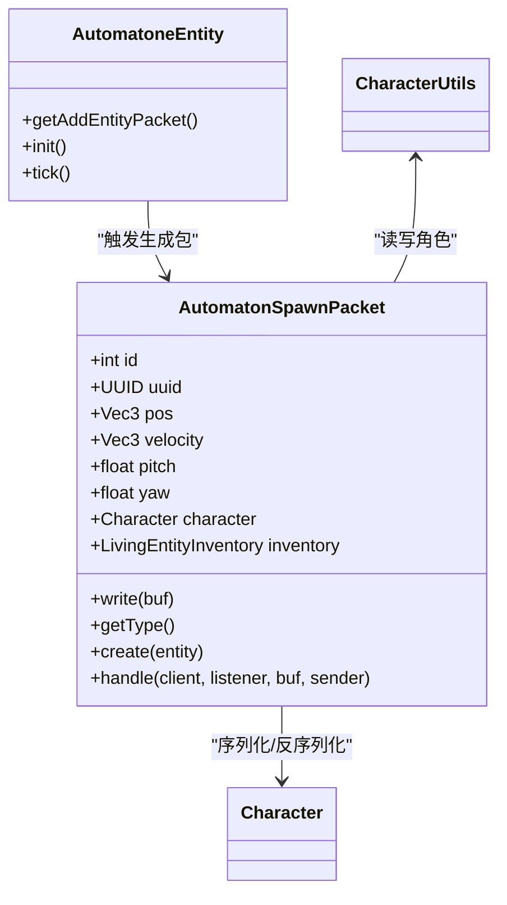
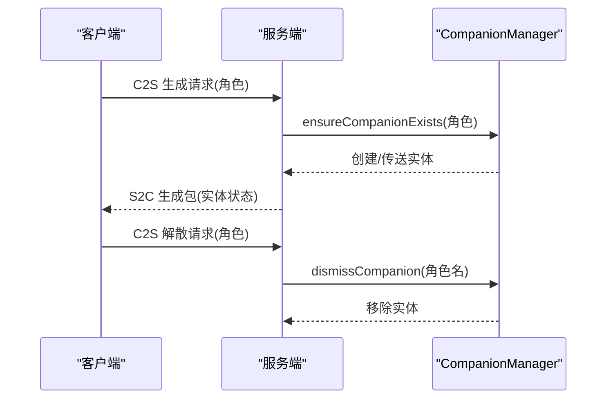
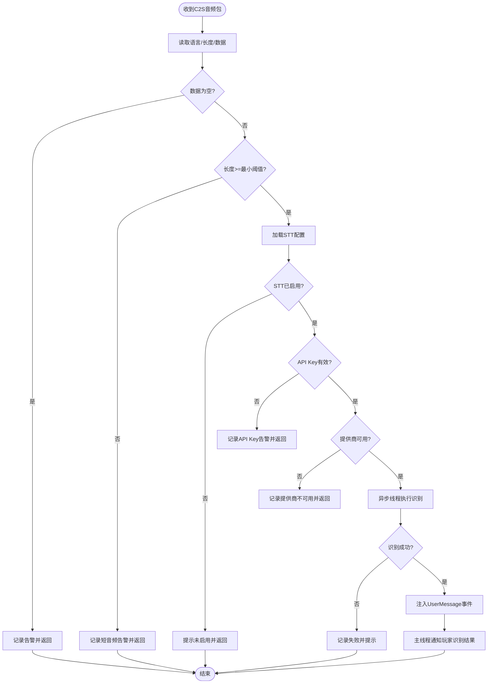
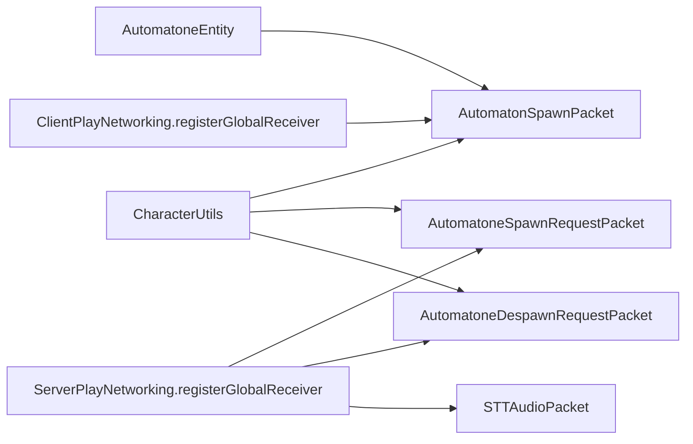

# 网络通信协议

<cite>
**本文引用的文件**
- [AutomatonSpawnPacket.java](file://src/main/java/com/goodbird/player2npc/network/AutomatonSpawnPacket.java)
- [AutomatoneSpawnRequestPacket.java](file://src/main/java/com/goodbird/player2npc/network/AutomatoneSpawnRequestPacket.java)
- [AutomatoneDespawnRequestPacket.java](file://src/main/java/com/goodbird/player2npc/network/AutomatoneDespawnRequestPacket.java)
- [STTAudioPacket.java](file://src/main/java/com/goodbird/player2npc/network/STTAudioPacket.java)
- [Player2NPC.java](file://src/main/java/com/goodbird/player2npc/Player2NPC.java)
- [Player2NPCClient.java](file://src/main/java/com/goodbird/player2npc/Player2NPCClient.java)
- [AutomatoneEntity.java](file://src/main/java/com/goodbird/player2npc/companion/AutomatoneEntity.java)
- [CompanionManager.java](file://src/main/java/com/goodbird/player2npc/companion/CompanionManager.java)
- [Character.java](file://src/main/java/adris/altoclef/player2api/Character.java)
- [CharacterUtils.java](file://src/main/java/adris/altoclef/player2api/utils/CharacterUtils.java)
</cite>

## 目录
1. [简介](#简介)
2. [项目结构](#项目结构)
3. [核心组件](#核心组件)
4. [架构总览](#架构总览)
5. [详细组件分析](#详细组件分析)
6. [依赖分析](#依赖分析)
7. [性能考虑](#性能考虑)
8. [故障排查指南](#故障排查指南)
9. [结论](#结论)
10. [附录](#附录)

## 简介
本文件面向Player2NPC模组的网络通信协议模块，系统性阐述“玩家到NPC”（Player2NPC）子系统的网络包设计与实现，重点覆盖以下方面：
- 协议数据结构：AutomatonSpawnPacket、AutomatoneSpawnRequestPacket、AutomatoneDespawnRequestPacket、STTAudioPacket
- 传输机制与Fabric API使用：包注册、接收器、客户端/服务端网络接口
- 安全与验证：空值校验、最小音频长度限制、配置可用性检查
- 异步通信模式：STT识别线程池化、服务端线程切换
- 客户端与服务器状态同步：实体生成包、连接事件触发的自动召唤
- RPC与事件广播：请求-响应式（C2S）与对话系统注入
- 扩展、性能优化与错误处理建议

## 项目结构
网络通信相关代码主要位于以下位置：
- 服务端与通用网络：com.goodbird.player2npc.network、com.goodbird.player2npc
- 客户端网络与渲染：com.goodbird.player2npc.client、com.goodbird.player2npc.Player2NPCClient
- 实体与同伴管理：com.goodbird.player2npc.companion
- 角色与序列化工具：adris.altoclef.player2api

图表来源
- [Player2NPC.java:48-65](file://src/main/java/com/goodbird/player2npc/Player2NPC.java#L48-L65)
- [Player2NPCClient.java:36-124](file://src/main/java/com/goodbird/player2npc/Player2NPCClient.java#L36-L124)
- [AutomatonSpawnPacket.java:26-120](file://src/main/java/com/goodbird/player2npc/network/AutomatonSpawnPacket.java#L26-L120)
- [STTAudioPacket.java:28-134](file://src/main/java/com/goodbird/player2npc/network/STTAudioPacket.java#L28-L134)
- [AutomatoneEntity.java:298-312](file://src/main/java/com/goodbird/player2npc/companion/AutomatoneEntity.java#L298-L312)

章节来源
- [Player2NPC.java:25-67](file://src/main/java/com/goodbird/player2npc/Player2NPC.java#L25-L67)
- [Player2NPCClient.java:23-164](file://src/main/java/com/goodbird/player2npc/Player2NPCClient.java#L23-L164)

## 核心组件
- 自动机实体与生成包
  - 服务端实体类型注册与追踪参数设置
  - 添加实体时发送S2C生成包，包含实体ID、UUID、位置、速度、朝向、角色与库存
- 同伴请求包
  - 客户端C2S请求生成/解散同伴，携带角色信息
  - 服务端根据请求确保同伴存在或移除
- STT音频包
  - 客户端C2S发送音频字节流，服务端异步识别并回显结果
- 客户端网络
  - 注册S2C接收器处理生成包
  - 推拉式/语音活动检测（VAD）记录音频并通过按键（PTT/V键）发送

章节来源
- [AutomatoneEntity.java:38-46](file://src/main/java/com/goodbird/player2npc/companion/AutomatoneEntity.java#L38-L46)
- [AutomatonSpawnPacket.java:26-120](file://src/main/java/com/goodbird/player2npc/network/AutomatonSpawnPacket.java#L26-L120)
- [AutomatoneSpawnRequestPacket.java:24-67](file://src/main/java/com/goodbird/player2npc/network/AutomatoneSpawnRequestPacket.java#L24-L67)
- [AutomatoneDespawnRequestPacket.java:21-65](file://src/main/java/com/goodbird/player2npc/network/AutomatoneDespawnRequestPacket.java#L21-L65)
- [STTAudioPacket.java:28-134](file://src/main/java/com/goodbird/player2npc/network/STTAudioPacket.java#L28-L134)
- [Player2NPCClient.java:36-164](file://src/main/java/com/goodbird/player2npc/Player2NPCClient.java#L36-L164)

## 架构总览
下图展示从按键触发录音到服务端STT识别再到客户端反馈的完整流程。

图表来源
- [Player2NPCClient.java:64-123](file://src/main/java/com/goodbird/player2npc/Player2NPCClient.java#L64-L123)
- [STTAudioPacket.java:39-121](file://src/main/java/com/goodbird/player2npc/network/STTAudioPacket.java#L39-L121)
- [Player2NPC.java:52-54](file://src/main/java/com/goodbird/player2npc/Player2NPC.java#L52-L54)

## 详细组件分析

### 自动机生成包（S2C：AutomatonSpawnPacket）
- 数据结构要点
  - 基础属性：实体ID、UUID、位置(x,y,z)、速度(dx,dy,dz)
  - 视角：pitch、yaw（以字节编码，范围映射到0-255）
  - 角色：Character（名称、简称、问候语、描述、皮肤URL、声纹ID数组）
  - 库存：LivingEntityInventory（序列化为NBT列表）
- 编解码策略
  - 位置与速度采用定长写入；速度压缩到short范围并限幅
  - 角度量化为byte，反量化时恢复浮点角度
  - 角色与库存通过CharacterUtils与Inventory NBT进行序列化/反序列化
- 处理流程
  - 服务端实体添加时由getAddEntityPacket()触发生成包
  - 客户端接收后在主线程创建本地实体并同步状态

图表来源
- [AutomatonSpawnPacket.java:26-120](file://src/main/java/com/goodbird/player2npc/network/AutomatonSpawnPacket.java#L26-L120)
- [AutomatoneEntity.java:298-312](file://src/main/java/com/goodbird/player2npc/companion/AutomatoneEntity.java#L298-L312)
- [Character.java:5-6](file://src/main/java/adris/altoclef/player2api/Character.java#L5-L6)
- [CharacterUtils.java:83-110](file://src/main/java/adris/altoclef/player2api/utils/CharacterUtils.java#L83-L110)

章节来源
- [AutomatonSpawnPacket.java:26-120](file://src/main/java/com/goodbird/player2npc/network/AutomatonSpawnPacket.java#L26-L120)
- [AutomatoneEntity.java:298-312](file://src/main/java/com/goodbird/player2npc/companion/AutomatoneEntity.java#L298-L312)
- [CharacterUtils.java:83-110](file://src/main/java/adris/altoclef/player2api/utils/CharacterUtils.java#L83-L110)

### 同伴生成/解散请求包（C2S：AutomatoneSpawnRequestPacket、AutomatoneDespawnRequestPacket）
- 请求包格式
  - 携带Character对象（UTF字符串字段+声纹ID数组）
- 处理流程
  - 服务端注册全局接收器，解析包体后在服务端线程执行
  - 生成请求：确保同伴存在（若不存在则生成并加入世界）
  - 解散请求：按角色名移除对应同伴实体
- 安全与验证
  - 对空角色进行日志告警并跳过处理
  - 使用CompanionManager维护角色名到UUID的映射，避免重复生成

图表来源
- [AutomatoneSpawnRequestPacket.java:57-65](file://src/main/java/com/goodbird/player2npc/network/AutomatoneSpawnRequestPacket.java#L57-L65)
- [AutomatoneDespawnRequestPacket.java:56-63](file://src/main/java/com/goodbird/player2npc/network/AutomatoneDespawnRequestPacket.java#L56-L63)
- [CompanionManager.java:100-129](file://src/main/java/com/goodbird/player2npc/companion/CompanionManager.java#L100-L129)

章节来源
- [AutomatoneSpawnRequestPacket.java:24-67](file://src/main/java/com/goodbird/player2npc/network/AutomatoneSpawnRequestPacket.java#L24-L67)
- [AutomatoneDespawnRequestPacket.java:21-65](file://src/main/java/com/goodbird/player2npc/network/AutomatoneDespawnRequestPacket.java#L21-L65)
- [CompanionManager.java:100-144](file://src/main/java/com/goodbird/player2npc/companion/CompanionManager.java#L100-L144)

### STT音频包（C2S：STTAudioPacket）
- 包格式
  - 语言（UTF，最大长度16）、音频长度（VarInt）、音频数据（字节数组）
- 处理流程
  - 服务端在网络线程读取包体，立即进行基础校验（空数据、最小长度）
  - 异步线程执行STT识别（加载配置、校验API Key、调用提供商）
  - 识别完成后在服务端主线程注入UserMessage事件并通知玩家
- 安全与验证
  - 最小音频长度阈值（约1秒），短音频直接告警并返回提示
  - 配置禁用或未配置API Key时拒绝处理
  - 提供商不可用时告警并提示

图表来源
- [STTAudioPacket.java:39-121](file://src/main/java/com/goodbird/player2npc/network/STTAudioPacket.java#L39-L121)

章节来源
- [STTAudioPacket.java:28-134](file://src/main/java/com/goodbird/player2npc/network/STTAudioPacket.java#L28-L134)

### 客户端网络与按键逻辑（Player2NPCClient）
- 接收器注册
  - 注册S2C生成包接收器，处理AutomatonSpawnPacket
- 按键逻辑
  - H键打开角色选择界面
  - V键（PTT）按下开始录音，松开或VAD自动停止后发送音频包
- 关键点
  - 使用GLFW直接查询按键状态，绕过Minecraft按键映射的不稳定性
  - 发送前进行最小音频长度校验，避免无效数据

章节来源
- [Player2NPCClient.java:36-164](file://src/main/java/com/goodbird/player2npc/Player2NPCClient.java#L36-L164)

## 依赖分析
- Fabric API网络接口
  - 服务端：ServerPlayNetworking.registerGlobalReceiver用于注册全局接收器
  - 客户端：ClientPlayNetworking.registerGlobalReceiver用于注册S2C接收器
  - 包类型：PacketType.create绑定自定义ID与构造函数
- 组件耦合
  - AutomatoneEntity与AutomatonSpawnPacket强耦合（通过getAddEntityPacket触发）
  - CompanionManager与请求包解耦，仅通过角色名与UUID映射管理实体生命周期
  - STTAudioPacket与对话系统解耦，通过事件注入实现广播式处理
- 外部依赖
  - Character/CharacterUtils负责角色序列化
  - STT提供商（阿里云）与配置（STTConfig）在服务端异步线程中使用

图表来源
- [Player2NPC.java:52-54](file://src/main/java/com/goodbird/player2npc/Player2NPC.java#L52-L54)
- [Player2NPCClient.java:40](file://src/main/java/com/goodbird/player2npc/Player2NPCClient.java#L40)
- [AutomatonSpawnPacket.java:28-31](file://src/main/java/com/goodbird/player2npc/network/AutomatonSpawnPacket.java#L28-L31)
- [AutomatoneSpawnRequestPacket.java:26-29](file://src/main/java/com/goodbird/player2npc/network/AutomatoneSpawnRequestPacket.java#L26-L29)
- [AutomatoneDespawnRequestPacket.java:25-28](file://src/main/java/com/goodbird/player2npc/network/AutomatoneDespawnRequestPacket.java#L25-L28)

章节来源
- [Player2NPC.java:48-65](file://src/main/java/com/goodbird/player2npc/Player2NPC.java#L48-L65)
- [Player2NPCClient.java:36-41](file://src/main/java/com/goodbird/player2npc/Player2NPCClient.java#L36-L41)

## 性能考虑
- 异步处理
  - STT识别在独立线程执行，避免阻塞服务端主线程与网络线程
- 线程切换
  - 识别完成后通过server.execute回到主线程进行消息推送与事件注入
- 数据压缩
  - 速度与角度采用定点数压缩，减少带宽占用
- 连接事件
  - 登录/断开时触发同伴自动召唤/解散，降低手动操作成本
- 建议
  - 可引入音频分片与重传机制，提升长语音鲁棒性
  - 对频繁请求进行速率限制与队列化，防止风暴式流量
  - 将STT提供商抽象为可插拔实现，支持多源与降级策略

## 故障排查指南
- STT相关
  - 现象：未识别到语音内容或服务不可用
  - 排查：确认STT配置启用、API Key有效、提供商可用；检查最小音频长度
- 生成包异常
  - 现象：客户端未显示实体或显示异常
  - 排查：检查角色序列化是否正确、库存NBT是否完整、角度/速度编码是否越界
- 请求包无效
  - 现象：生成/解散请求无效果
  - 排查：确认角色非空、服务端线程执行正常、CompanionManager映射一致
- 客户端按键无响应
  - 现象：V键无法录音或H键无法打开界面
  - 排查：确认按键绑定、GLFW查询路径、录音设备可用性

章节来源
- [STTAudioPacket.java:51-63](file://src/main/java/com/goodbird/player2npc/network/STTAudioPacket.java#L51-L63)
- [AutomatonSpawnPacket.java:65-68](file://src/main/java/com/goodbird/player2npc/network/AutomatonSpawnPacket.java#L65-L68)
- [AutomatoneSpawnRequestPacket.java:62-64](file://src/main/java/com/goodbird/player2npc/network/AutomatoneSpawnRequestPacket.java#L62-L64)
- [Player2NPCClient.java:131-144](file://src/main/java/com/goodbird/player2npc/Player2NPCClient.java#L131-L144)

## 结论
该网络协议模块围绕“实体生成、同伴生命周期管理、语音识别”三大场景构建，采用Fabric API的全局接收器与包类型机制，结合异步与线程切换策略，在保证低延迟的同时兼顾了安全性与可扩展性。通过角色与库存的稳定序列化、最小音频长度约束以及连接事件驱动的状态同步，实现了较为完整的客户端-服务端通信闭环。

## 附录
- 协议扩展建议
  - 新增包类型：定义PacketType与双向处理方法，分别在客户端/服务端注册
  - 角色/库存扩展：在CharacterUtils中增加字段读写，保持前后兼容
  - STT增强：支持多语言、分片识别与结果缓存
- 错误处理最佳实践
  - 对所有外部依赖（配置、网络、设备）进行显式校验与降级
  - 使用server.execute确保UI与事件在主线程更新
  - 记录详细日志，区分警告与错误级别，便于定位问题