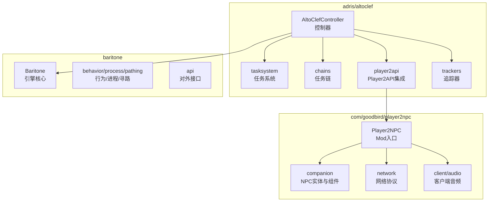
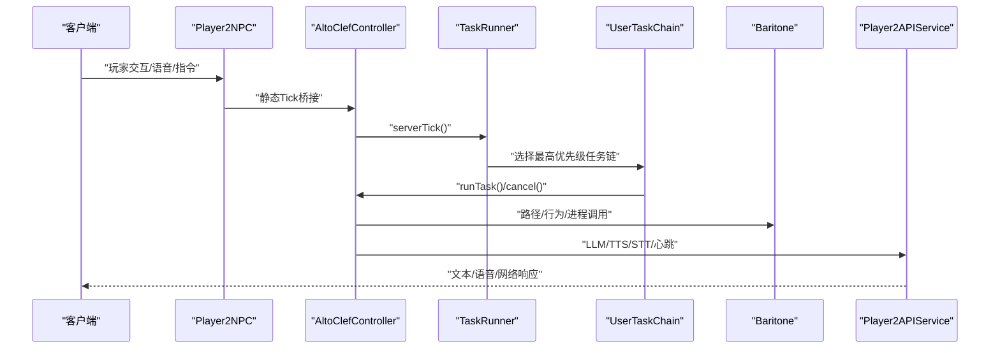
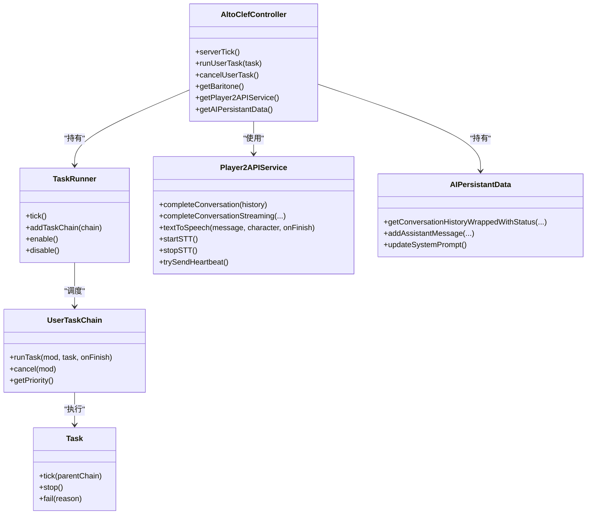
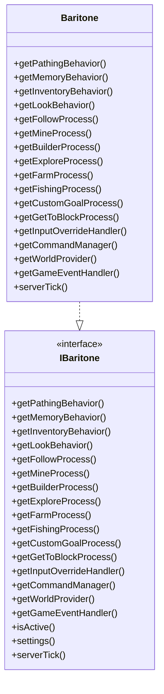
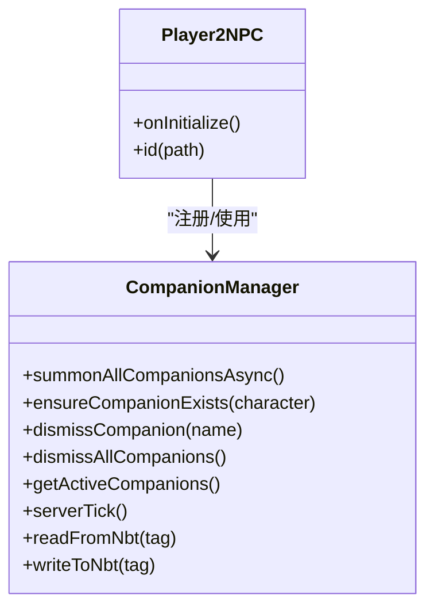
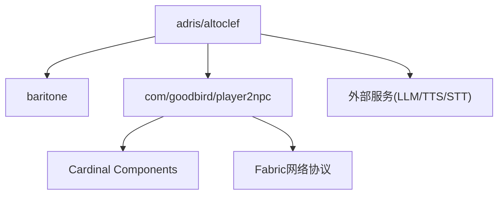

# 模块化组织结构

<cite>
**本文引用的文件**
- [AltoClefController.java](file://src/main/java/adris/altoclef/AltoClefController.java)
- [Baritone.java](file://src/main/java/baritone/Baritone.java)
- [IBaritone.java](file://src/main/java/baritone/api/IBaritone.java)
- [Player2NPC.java](file://src/main/java/com/goodbird/player2npc/Player2NPC.java)
- [TaskRunner.java](file://src/main/java/adris/altoclef/tasksystem/TaskRunner.java)
- [Task.java](file://src/main/java/adris/altoclef/tasksystem/Task.java)
- [UserTaskChain.java](file://src/main/java/adris/altoclef/chains/UserTaskChain.java)
- [Player2APIService.java](file://src/main/java/adris/altoclef/player2api/Player2APIService.java)
- [AIPersistantData.java](file://src/main/java/adris/altoclef/player2api/AIPersistantData.java)
- [CompanionManager.java](file://src/main/java/com/goodbird/player2npc/companion/CompanionManager.java)
- [playerengine-llm-default.json](file://src/main/resources/playerengine-llm-default.json)
- [fabric.mod.json](file://src/main/resources/fabric.mod.json)
- [build.gradle](file://build.gradle)
- [settings.gradle](file://settings.gradle)
- [README.md](file://README.md)
</cite>

## 目录
1. [引言](#引言)
2. [项目结构](#项目结构)
3. [核心组件](#核心组件)
4. [架构总览](#架构总览)
5. [详细组件分析](#详细组件分析)
6. [依赖分析](#依赖分析)
7. [性能考虑](#性能考虑)
8. [故障排查指南](#故障排查指南)
9. [结论](#结论)
10. [附录](#附录)

## 引言
本文件面向AI NPC系统，系统性梳理模块化组织结构，重点阐述以下三大模块的设计理念与协作方式：
- adris/altoclef（AI任务执行系统）：负责NPC行为编排、任务链调度、与Baritone寻路引擎的集成、以及与Player2NPC集成层的通信。
- baritone（路径规划引擎）：提供寻路、行为、进程、输入覆盖等能力，是AI任务执行系统的核心基础设施。
- com/goodbird/player2npc（Player2NPC集成层）：负责NPC实体生命周期、玩家侧组件（Cardinal Components）、网络协议与客户端交互。

文档还提供模块依赖图、包结构图、扩展指南与最佳实践，帮助读者快速理解并安全地对系统进行扩展与维护。

## 项目结构
项目采用按领域分层的模块化布局，核心包结构如下：
- adris/altoclef：AI任务执行系统，包含任务系统、任务链、控制器、追踪器、Player2API集成等。
- baritone：寻路引擎核心，包含行为、进程、路径计算、命令系统等。
- com/goodbird/player2npc：集成层，包含NPC实体、组件系统、网络协议、客户端音频等。

图表来源
- [AltoClefController.java:53-134](file://src/main/java/adris/altoclef/AltoClefController.java#L53-L134)
- [Baritone.java:34-79](file://src/main/java/baritone/Baritone.java#L34-L79)
- [Player2NPC.java:25-66](file://src/main/java/com/goodbird/player2npc/Player2NPC.java#L25-L66)

章节来源
- [fabric.mod.json:17-29](file://src/main/resources/fabric.mod.json#L17-L29)
- [README.md:531-562](file://README.md#L531-L562)

## 核心组件
本节聚焦三大模块的关键组件及其职责边界与协作关系。

- adris/altoclef（AI任务执行系统）
  - AltoClefController：模块总控，负责初始化任务链、追踪器、Baritone设置、命令系统、心跳与持久化数据管理。
  - TaskRunner：任务链调度器，按优先级选择并驱动当前活跃任务链。
  - Task/TaskChain：任务抽象与链式组合，支持嵌套、中断、优先级与超时控制。
  - player2api：与外部服务（LLM/TTS/STT）交互的服务层，封装HTTP请求、流式对话、TTS/STT调用与心跳。
  - AIPersistantData：AI持久化数据容器，管理对话历史、角色与灵魂档案、系统提示更新。

- baritone（路径规划引擎）
  - Baritone：引擎核心，聚合行为、进程、输入覆盖、命令管理与事件总线。
  - IBaritone：对外统一接口，暴露路径行为、行为、进程、输入覆盖、设置等能力。

- com/goodbird/player2npc（Player2NPC集成层）
  - Player2NPC：Mod入口，注册实体类型、网络包、服务器Tick事件，桥接AltoClefController静态Tick。
  - CompanionManager：基于Cardinal Components的玩家侧组件，负责NPC实体的召唤、传送、解散与状态持久化。
  - network：网络协议，处理NPC生成/消失请求与STT音频包。

章节来源
- [AltoClefController.java:53-134](file://src/main/java/adris/altoclef/AltoClefController.java#L53-L134)
- [TaskRunner.java:9-98](file://src/main/java/adris/altoclef/tasksystem/TaskRunner.java#L9-L98)
- [Task.java:8-181](file://src/main/java/adris/altoclef/tasksystem/Task.java#L8-L181)
- [UserTaskChain.java:14-223](file://src/main/java/adris/altoclef/chains/UserTaskChain.java#L14-L223)
- [Player2APIService.java:35-274](file://src/main/java/adris/altoclef/player2api/Player2APIService.java#L35-L274)
- [AIPersistantData.java:12-71](file://src/main/java/adris/altoclef/player2api/AIPersistantData.java#L12-L71)
- [Baritone.java:34-187](file://src/main/java/baritone/Baritone.java#L34-L187)
- [IBaritone.java:29-104](file://src/main/java/baritone/api/IBaritone.java#L29-L104)
- [Player2NPC.java:25-66](file://src/main/java/com/goodbird/player2npc/Player2NPC.java#L25-L66)
- [CompanionManager.java:28-191](file://src/main/java/com/goodbird/player2npc/companion/CompanionManager.java#L28-L191)

## 架构总览
系统采用“控制器-任务链-引擎-集成层”的分层架构。AI任务执行系统通过AltoClefController协调任务链与Baritone寻路引擎；Player2APIService负责与外部服务交互；Player2NPC集成层负责NPC实体生命周期与网络通信；CompanionManager通过Cardinal Components为玩家侧提供NPC状态管理。

图表来源
- [Player2NPC.java:48-65](file://src/main/java/com/goodbird/player2npc/Player2NPC.java#L48-L65)
- [AltoClefController.java:136-150](file://src/main/java/adris/altoclef/AltoClefController.java#L136-L150)
- [TaskRunner.java:22-58](file://src/main/java/adris/altoclef/tasksystem/TaskRunner.java#L22-L58)
- [UserTaskChain.java:133-168](file://src/main/java/adris/altoclef/chains/UserTaskChain.java#L133-L168)
- [Baritone.java:179-185](file://src/main/java/baritone/Baritone.java#L179-L185)
- [Player2APIService.java:258-273](file://src/main/java/adris/altoclef/player2api/Player2APIService.java#L258-L273)

## 详细组件分析

### AI任务执行系统（adris/altoclef）
- AltoClefController
  - 职责：初始化任务链、追踪器、Baritone设置；提供统一访问器；处理心跳与日志；持有AI持久化数据与Player2API服务。
  - 关键交互：与TaskRunner协作驱动任务链；与Baritone交互执行路径与行为；与Player2APIService交互LLM/TTS/STT。
- TaskRunner
  - 职责：按优先级选择当前任务链并驱动其tick；启用/禁用任务系统；记录状态报告。
- Task/TaskChain
  - 职责：抽象任务生命周期（start/tick/stop）、嵌套子任务、中断策略、调试状态与超时判断。
- UserTaskChain
  - 职责：用户任务链，负责任务优先级、完成回调、空闲态切换、与所有者距离监控与自动回归。
- Player2APIService
  - 职责：封装LLM对话（含流式）、TTS合成（本地/远程）、STT启动/停止、心跳上报。
- AIPersistantData
  - 职责：管理对话历史、角色与灵魂档案、系统提示更新。

图表来源
- [AltoClefController.java:53-134](file://src/main/java/adris/altoclef/AltoClefController.java#L53-L134)
- [TaskRunner.java:9-98](file://src/main/java/adris/altoclef/tasksystem/TaskRunner.java#L9-L98)
- [Task.java:8-181](file://src/main/java/adris/altoclef/tasksystem/Task.java#L8-L181)
- [UserTaskChain.java:14-223](file://src/main/java/adris/altoclef/chains/UserTaskChain.java#L14-L223)
- [Player2APIService.java:35-274](file://src/main/java/adris/altoclef/player2api/Player2APIService.java#L35-L274)
- [AIPersistantData.java:12-71](file://src/main/java/adris/altoclef/player2api/AIPersistantData.java#L12-L71)

章节来源
- [AltoClefController.java:83-134](file://src/main/java/adris/altoclef/AltoClefController.java#L83-L134)
- [TaskRunner.java:22-98](file://src/main/java/adris/altoclef/tasksystem/TaskRunner.java#L22-L98)
- [Task.java:17-181](file://src/main/java/adris/altoclef/tasksystem/Task.java#L17-L181)
- [UserTaskChain.java:133-223](file://src/main/java/adris/altoclef/chains/UserTaskChain.java#L133-L223)
- [Player2APIService.java:48-274](file://src/main/java/adris/altoclef/player2api/Player2APIService.java#L48-L274)
- [AIPersistantData.java:22-71](file://src/main/java/adris/altoclef/player2api/AIPersistantData.java#L22-L71)

### 路径规划引擎（baritone）
- Baritone
  - 职责：聚合路径行为、行为、进程、输入覆盖、命令管理与事件总线；提供统一设置与上下文。
- IBaritone
  - 职责：对外统一接口，暴露路径行为、行为、进程、输入覆盖、设置与事件总线。

图表来源
- [Baritone.java:34-187](file://src/main/java/baritone/Baritone.java#L34-L187)
- [IBaritone.java:29-104](file://src/main/java/baritone/api/IBaritone.java#L29-L104)

章节来源
- [Baritone.java:58-187](file://src/main/java/baritone/Baritone.java#L58-L187)
- [IBaritone.java:29-104](file://src/main/java/baritone/api/IBaritone.java#L29-L104)

### Player2NPC集成层（com/goodbird/player2npc）
- Player2NPC
  - 职责：注册实体类型、全局网络包接收、服务器连接事件、服务器Tick桥接至AltoClefController。
- CompanionManager
  - 职责：基于Cardinal Components为玩家侧提供NPC组件，负责NPC的批量召唤、传送、解散与状态持久化。
- network
  - 职责：处理NPC生成/消失请求与STT音频包，驱动服务端逻辑。

图表来源
- [Player2NPC.java:25-66](file://src/main/java/com/goodbird/player2npc/Player2NPC.java#L25-L66)
- [CompanionManager.java:28-191](file://src/main/java/com/goodbird/player2npc/companion/CompanionManager.java#L28-L191)

章节来源
- [Player2NPC.java:48-66](file://src/main/java/com/goodbird/player2npc/Player2NPC.java#L48-L66)
- [CompanionManager.java:45-191](file://src/main/java/com/goodbird/player2npc/companion/CompanionManager.java#L45-L191)

## 依赖分析
- 模块间依赖
  - adris/altoclef 依赖 baritone（通过IBaritone接口与Baritone实现）。
  - adris/altoclef 依赖 com/goodbird/player2npc（通过Player2NPC入口与网络协议桥接）。
  - com/goodbird/player2npc 依赖 Cardinal Components（通过fabric.mod.json声明）。
- 外部依赖
  - Jackson、DashScope SDK、Fabric API、Cardinal Components等在build.gradle中声明。

图表来源
- [AltoClefController.java:34-40](file://src/main/java/adris/altoclef/AltoClefController.java#L34-L40)
- [Player2NPC.java:9-13](file://src/main/java/com/goodbird/player2npc/Player2NPC.java#L9-L13)
- [fabric.mod.json:33-46](file://src/main/resources/fabric.mod.json#L33-L46)
- [build.gradle:43-69](file://build.gradle#L43-L69)

章节来源
- [build.gradle:43-69](file://build.gradle#L43-L69)
- [fabric.mod.json:33-46](file://src/main/resources/fabric.mod.json#L33-L46)

## 性能考虑
- 任务链调度
  - TaskRunner按优先级选择链，避免多链并发冲突；建议合理设置任务优先级，减少频繁切换带来的抖动。
- 寻路与输入覆盖
  - Baritone设置中禁用部分高开销行为（如跳跃、对角下降等），有助于稳定帧率；根据场景动态调整设置。
- 网络与外部服务
  - LLM/TTS/STT调用建议异步化与缓存策略，避免阻塞服务器Tick；Player2APIService已提供流式接口与心跳节流。
- 组件持久化
  - CompanionManager使用异步拉取角色列表与批量处理，避免阻塞服务器Tick。

## 故障排查指南
- LLM/TTS/STT配置
  - 检查playerengine-llm-default.json中的提供商、模型、密钥与代理设置；确保网络可达。
- 任务链与行为
  - 若NPC卡在某个任务，查看TaskRunner状态报告与UserTaskChain的完成回调；必要时通过cancelUserTask强制停止。
- 寻路异常
  - 检查Baritone设置与Extra设置（如避免放置/破坏）；确认路径行为是否被强制取消。
- 网络与心跳
  - 若心跳失败，检查Player2APIService的请求与异常日志；确认Fabric网络包是否正确注册。
- NPC实体与组件
  - 若NPC未出现或消失，检查CompanionManager的召唤/传送逻辑与玩家侧组件状态。

章节来源
- [playerengine-llm-default.json:1-89](file://src/main/resources/playerengine-llm-default.json#L1-L89)
- [TaskRunner.java:17-98](file://src/main/java/adris/altoclef/tasksystem/TaskRunner.java#L17-L98)
- [UserTaskChain.java:116-201](file://src/main/java/adris/altoclef/chains/UserTaskChain.java#L116-L201)
- [Player2APIService.java:258-273](file://src/main/java/adris/altoclef/player2api/Player2APIService.java#L258-L273)
- [CompanionManager.java:45-191](file://src/main/java/com/goodbird/player2npc/companion/CompanionManager.java#L45-L191)

## 结论
该系统通过清晰的模块划分与接口约束，实现了AI任务执行、路径规划与集成层的解耦。adris/altoclef提供强大的任务编排与AI服务集成，baritone提供稳定的寻路能力，com/goodbird/player2npc负责NPC实体与网络协议。模块间通过接口与事件进行协作，具备良好的可维护性与可扩展性。

## 附录

### 模块扩展指南
- 接入新的LLM模型
  - 实现Provider并注册到LLMProviderRegistry；在配置文件中启用并设置参数；通过Player2APIService路由到新Provider。
- 替换TTS/STT服务
  - 实现对应的Provider接口，修改Player2APIService中的实例化逻辑；在配置文件中更新相关参数。
- 新增任务链
  - 继承TaskChain并实现优先级与任务选择逻辑；通过TaskRunner注册；在AltoClefController中初始化。
- 新增NPC行为
  - 在UserTaskChain中增加距离监控与语音反馈策略；必要时扩展TaskRunner的调度策略。

章节来源
- [README.md:564-680](file://README.md#L564-L680)
- [Player2APIService.java:109-118](file://src/main/java/adris/altoclef/player2api/Player2APIService.java#L109-L118)
- [UserTaskChain.java:133-223](file://src/main/java/adris/altoclef/chains/UserTaskChain.java#L133-L223)

### 最佳实践
- 保持接口稳定：对外接口（如IBaritone）尽量保持稳定，避免破坏模块间契约。
- 异步化外部调用：LLM/TTS/STT尽量异步化，避免阻塞主线程。
- 合理设置优先级：任务链优先级应反映业务重要性，避免频繁切换。
- 组件化与可配置：通过配置文件与注册表实现可插拔扩展，便于热切换与灰度发布。
- 日志与可观测性：为关键路径添加日志与状态报告，便于定位问题。