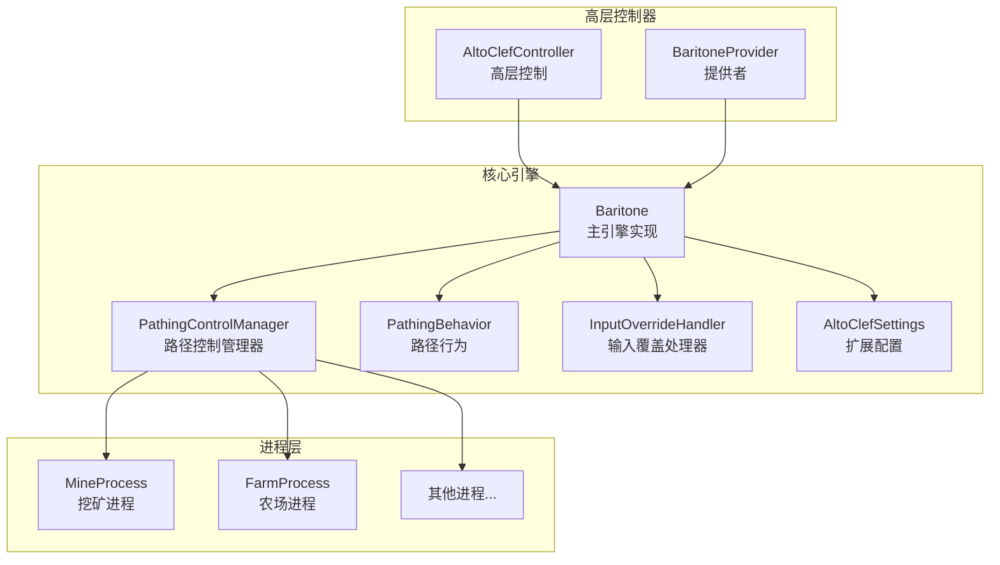
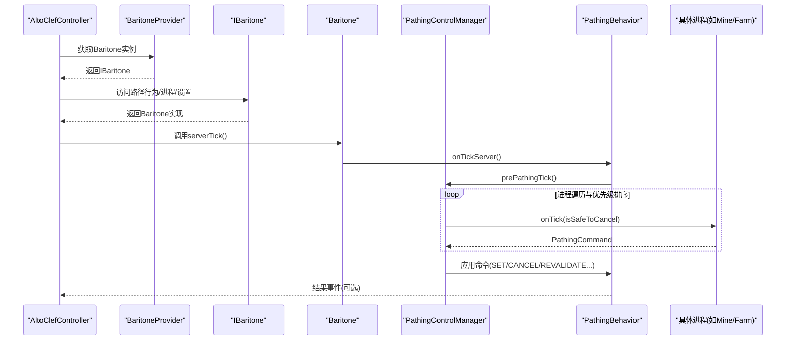
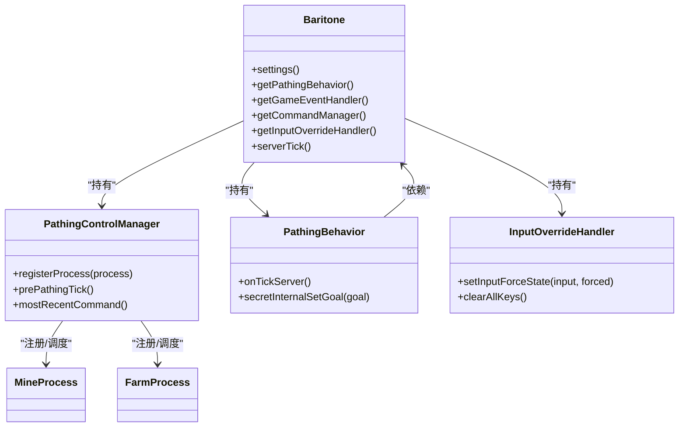
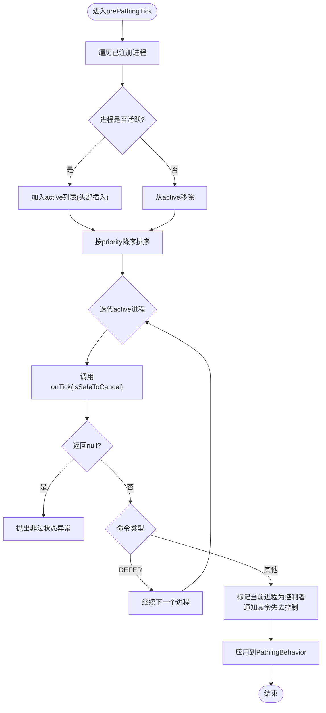
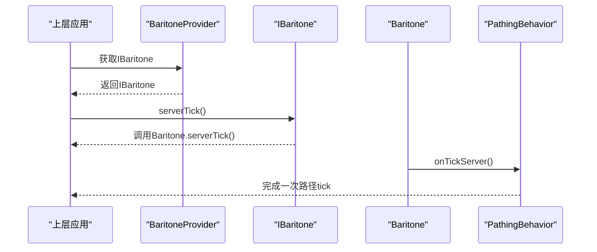
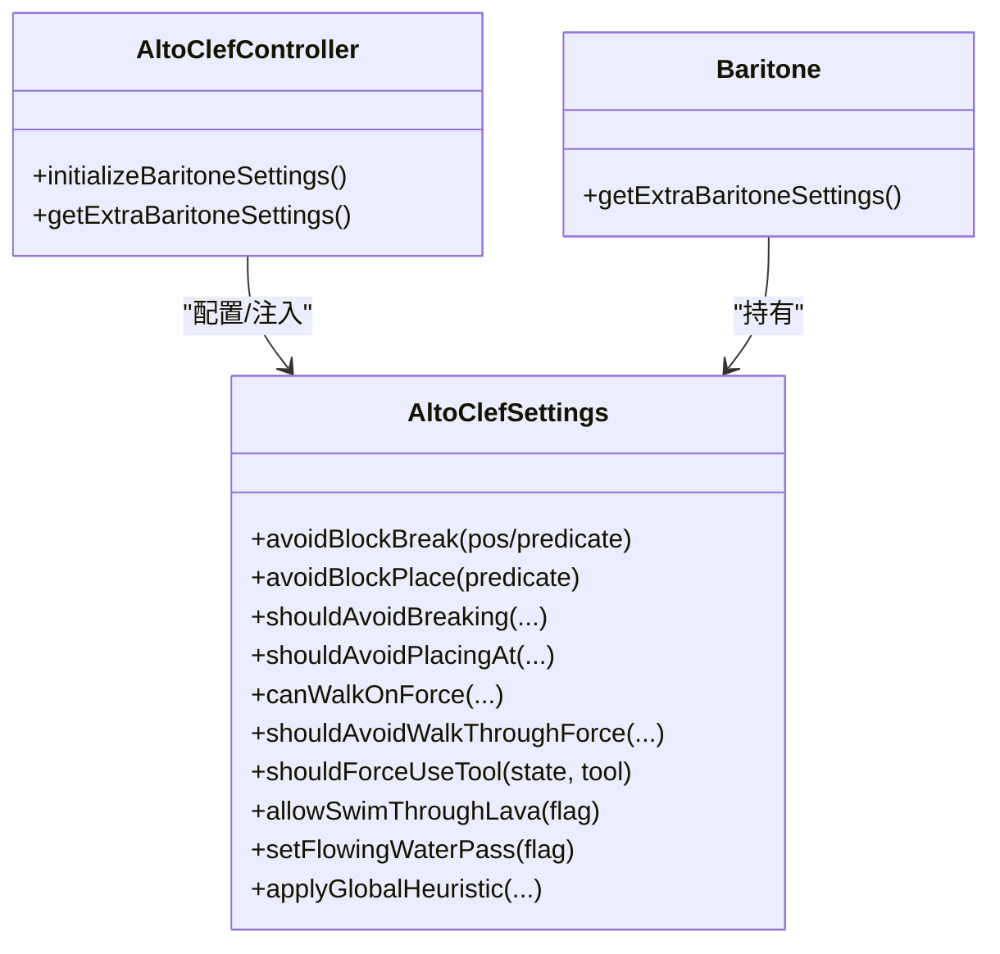
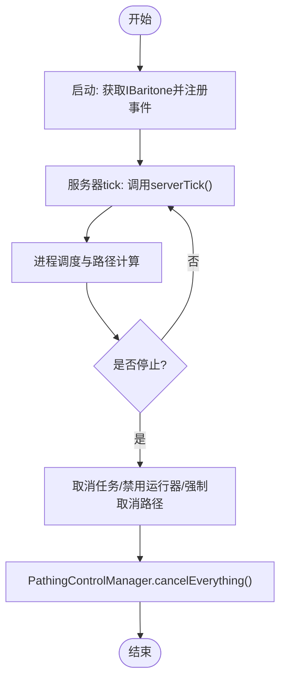
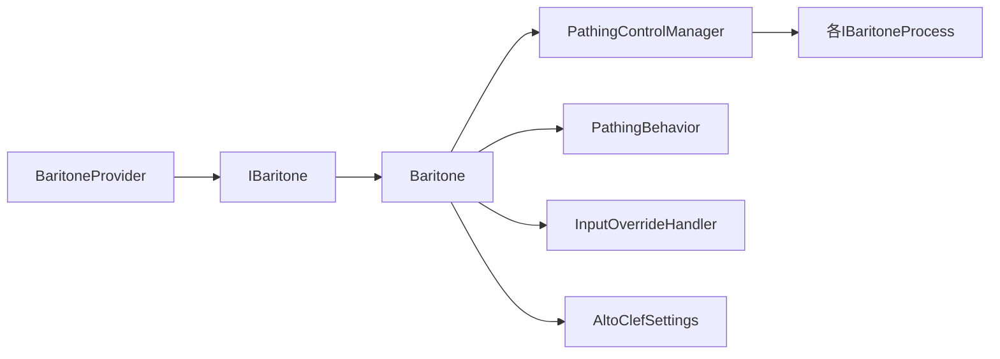

# 核心引擎

<cite>
**本文引用的文件**
- [Baritone.java](file://src/main/java/baritone/Baritone.java)
- [PathingControlManager.java](file://src/main/java/baritone/utils/PathingControlManager.java)
- [AltoClefSettings.java](file://src/main/java/baritone/autoclef/AltoClefSettings.java)
- [AltoClefController.java](file://src/main/java/adris/altoclef/AltoClefController.java)
- [IBaritone.java](file://src/main/java/baritone/api/IBaritone.java)
- [BaritoneProvider.java](file://src/main/java/baritone/BaritoneProvider.java)
- [PathingBehavior.java](file://src/main/java/baritone/behavior/PathingBehavior.java)
- [InputOverrideHandler.java](file://src/main/java/baritone/utils/InputOverrideHandler.java)
- [FarmProcess.java](file://src/main/java/baritone/process/FarmProcess.java)
- [MineProcess.java](file://src/main/java/baritone/process/MineProcess.java)
- [PlayerEngine.java](file://src/main/java/baritone/PlayerEngine.java)
</cite>

## 目录
1. [简介](#简介)
2. [项目结构](#项目结构)
3. [核心组件](#核心组件)
4. [架构总览](#架构总览)
5. [详细组件分析](#详细组件分析)
6. [依赖关系分析](#依赖关系分析)
7. [性能考量](#性能考量)
8. [故障排查指南](#故障排查指南)
9. [结论](#结论)
10. [附录](#附录)

## 简介
本文件面向“核心引擎”模块，聚焦于Baritone主引擎的架构与初始化流程，系统性解析以下主题：
- 构造函数中各组件的初始化顺序与依赖关系
- 路径控制管理器（PathingControlManager）的进程注册、激活控制与优先级管理机制
- IBaritone接口的设计理念与实现细节（方法调用流程、状态管理与生命周期）
- AltoClefSettings扩展配置的作用与使用场景
- 引擎启动、停止、重置等关键操作的实现细节与最佳实践

## 项目结构
核心引擎位于baritone包下，围绕IBaritone接口与Baritone实现展开；同时在adris.altoclef包下提供高层控制器AltoClefController，负责整合任务链、追踪器与AI服务，并通过BaritoneProvider对外暴露统一入口。

图表来源
- [Baritone.java:58-79](file://src/main/java/baritone/Baritone.java#L58-L79)
- [PathingControlManager.java:42-45](file://src/main/java/baritone/utils/PathingControlManager.java#L42-L45)
- [AltoClefController.java:83-134](file://src/main/java/adris/altoclef/AltoClefController.java#L83-L134)
- [BaritoneProvider.java:24-31](file://src/main/java/baritone/BaritoneProvider.java#L24-L31)

章节来源
- [Baritone.java:58-79](file://src/main/java/baritone/Baritone.java#L58-L79)
- [AltoClefController.java:83-134](file://src/main/java/adris/altoclef/AltoClefController.java#L83-L134)
- [BaritoneProvider.java:24-31](file://src/main/java/baritone/BaritoneProvider.java#L24-L31)

## 核心组件
- 主引擎 Baritone：实现IBaritone，负责聚合所有子系统（行为、进程、命令、世界缓存等），并在构造时完成组件初始化与进程注册。
- 路径控制管理器 PathingControlManager：集中调度多个IBaritoneProcess，按优先级选择当前控制者，生成PathingCommand并驱动PathingBehavior。
- IBaritone 接口：定义对外能力边界（路径行为、进程访问、事件总线、设置、日志、服务器tick等）。
- AltoClefSettings 扩展配置：提供对破坏/放置避让、行走属性、工具策略、全局启发式等的细粒度控制。
- 高层控制器 AltoClefController：在服务器tick中协调输入、追踪、任务链与Baritone主引擎，封装启动/停止/重置逻辑。
- BaritoneProvider 提供者：统一获取IBaritone实例，提供全局设置与系统组件。

章节来源
- [IBaritone.java:29-103](file://src/main/java/baritone/api/IBaritone.java#L29-L103)
- [Baritone.java:34-83](file://src/main/java/baritone/Baritone.java#L34-L83)
- [AltoClefSettings.java:14-237](file://src/main/java/baritone/autoclef/AltoClefSettings.java#L14-L237)
- [AltoClefController.java:53-134](file://src/main/java/adris/altoclef/AltoClefController.java#L53-L134)
- [BaritoneProvider.java:16-62](file://src/main/java/baritone/BaritoneProvider.java#L16-L62)

## 架构总览
下图展示从高层控制器到主引擎、再到路径控制与具体进程的调用链路，以及扩展配置的注入点。

图表来源
- [AltoClefController.java:136-150](file://src/main/java/adris/altoclef/AltoClefController.java#L136-L150)
- [BaritoneProvider.java:24-31](file://src/main/java/baritone/BaritoneProvider.java#L24-L31)
- [Baritone.java:178-181](file://src/main/java/baritone/Baritone.java#L178-L181)
- [PathingBehavior.java:66-74](file://src/main/java/baritone/behavior/PathingBehavior.java#L66-L74)
- [PathingControlManager.java:71-114](file://src/main/java/baritone/utils/PathingControlManager.java#L71-L114)

## 详细组件分析

### Baritone主引擎初始化与组件关系
- 初始化顺序要点
  - 设置与事件总线：先创建Settings与GameEventHandler，确保后续组件可订阅事件。
  - 实体上下文：构建EntityContext，作为所有行为/进程共享的实体视图。
  - 行为层：依次初始化PathingBehavior、LookBehavior、MemoryBehavior、InventoryBehavior。
  - 输入覆盖：初始化InputOverrideHandler，用于强制输入状态与辅助交互。
  - 路径控制管理器：创建PathingControlManager，并注册各类进程（Follow、Mine、CustomGoal、GetToBlock、Builder、Explore、Backfill、Farm、Fishing）。
  - 命令系统：初始化BaritoneCommandManager，并注册执行控制进程。
- 关键依赖
  - PathingControlManager依赖GameEventHandler进行每tick回调。
  - 各进程依赖Baritone提供的行为与工具（LookBehavior、InventoryBehavior、InputOverrideHandler等）。
  - IBaritone接口由Baritone实现，向上暴露统一能力。

图表来源
- [Baritone.java:58-79](file://src/main/java/baritone/Baritone.java#L58-L79)
- [PathingControlManager.java:29-39](file://src/main/java/baritone/utils/PathingControlManager.java#L29-L39)
- [PathingBehavior.java:48-50](file://src/main/java/baritone/behavior/PathingBehavior.java#L48-L50)
- [InputOverrideHandler.java:17-21](file://src/main/java/baritone/utils/InputOverrideHandler.java#L17-L21)

章节来源
- [Baritone.java:58-79](file://src/main/java/baritone/Baritone.java#L58-L79)
- [Baritone.java:81-186](file://src/main/java/baritone/Baritone.java#L81-L186)

### PathingControlManager：进程注册、激活控制与优先级管理
- 进程注册
  - registerProcess会先调用进程的onLostControl，然后加入内部集合，等待激活状态变化时参与调度。
- 激活控制
  - prePathingTick中，遍历所有进程，维护active列表（仅活跃且非临时进程），按priority降序排序。
  - 对每个进程调用onTick，若返回非DEFER的命令，则该进程成为当前控制者（inControlThisTick），并通知其余进程失去控制。
- 命令应用
  - 根据PathingCommandType分派到PathingBehavior：REQUEST_PAUSE、CANCEL_AND_SET_GOAL、FORCE_REVALIDATE_GOAL_AND_PATH、REVALIDATE_GOAL_AND_PATH、SET_GOAL_AND_PATH。
  - postPathingTick中处理需要重新验证目标或强制重算路径的情况。
- 目标有效性校验
  - forceRevalidate与revalidateGoal用于判断是否需要软取消或重新规划路径。

图表来源
- [PathingControlManager.java:159-194](file://src/main/java/baritone/utils/PathingControlManager.java#L159-L194)
- [PathingControlManager.java:71-114](file://src/main/java/baritone/utils/PathingControlManager.java#L71-L114)
- [PathingControlManager.java:116-135](file://src/main/java/baritone/utils/PathingControlManager.java#L116-L135)

章节来源
- [PathingControlManager.java:41-199](file://src/main/java/baritone/utils/PathingControlManager.java#L41-L199)

### IBaritone接口：设计理念与实现细节
- 设计理念
  - 以最小必要接口暴露能力，屏蔽内部复杂性；通过行为与进程解耦，便于扩展与测试。
  - 统一日志输出与事件总线，便于上层集成与调试。
- 方法调用流程
  - 上层通过BaritoneProvider获取IBaritone实例。
  - 高层控制器AltoClefController在每tick调用IBaritone.serverTick()，进而触发PathingBehavior.onTickServer()。
  - PathingBehavior再委托PathingControlManager.prePathingTick()，完成进程调度与命令生成。
- 生命周期控制
  - isActive()基于PathingControlManager的活跃状态。
  - shutdown()由PathingBehavior提供，用于安全清理当前路径与控制权。

图表来源
- [BaritoneProvider.java:24-31](file://src/main/java/baritone/BaritoneProvider.java#L24-L31)
- [IBaritone.java:102](file://src/main/java/baritone/api/IBaritone.java#L102)
- [Baritone.java:178-181](file://src/main/java/baritone/Baritone.java#L178-L181)
- [PathingBehavior.java:66-74](file://src/main/java/baritone/behavior/PathingBehavior.java#L66-L74)

章节来源
- [IBaritone.java:29-103](file://src/main/java/baritone/api/IBaritone.java#L29-L103)
- [BaritoneProvider.java:33-36](file://src/main/java/baritone/BaritoneProvider.java#L33-L36)
- [PathingBehavior.java:76-79](file://src/main/java/baritone/behavior/PathingBehavior.java#L76-L79)

### AltoClefSettings扩展配置：作用与使用场景
- 功能范围
  - 破坏/放置避让：支持按位置或谓词避免破坏/放置。
  - 行走属性：允许在特定条件下改变地形可行走性（如末地传送门、灵魂沙等）。
  - 工具策略：针对特定方块/工具组合强制使用或保存工具。
  - 全局启发式：提供可叠加的全局启发式调整。
  - 交互暂停与水/岩浆特性：控制交互暂停、流动水穿行、游泳穿过岩浆等。
- 使用场景
  - 在AltoClefController初始化阶段，将用户追踪器与实体卡位检测注入到扩展配置，从而影响路径规划与交互决策。
  - 通过Baritone主引擎的settings()与getExtraBaritoneSettings()在运行期动态调整策略。

图表来源
- [AltoClefSettings.java:39-163](file://src/main/java/baritone/autoclef/AltoClefSettings.java#L39-L163)
- [AltoClefController.java:171-193](file://src/main/java/adris/altoclef/AltoClefController.java#L171-L193)
- [Baritone.java:169-171](file://src/main/java/baritone/Baritone.java#L169-L171)

章节来源
- [AltoClefSettings.java:14-237](file://src/main/java/baritone/autoclef/AltoClefSettings.java#L14-L237)
- [AltoClefController.java:171-193](file://src/main/java/adris/altoclef/AltoClefController.java#L171-L193)

### 引擎启动、停止、重置：实现细节与最佳实践
- 启动
  - 通过BaritoneProvider.getBaritone(entity)获取IBaritone实例。
  - 在服务器tick中调用IBaritone.serverTick()，驱动路径行为与进程调度。
  - 高层控制器AltoClefController在每tick同步输入、追踪、任务链与Baritone。
- 停止
  - 调用高层控制器stop()：取消用户任务链、禁用任务运行器、强制取消路径、清空输入覆盖。
  - 也可通过PathingBehavior.shutdown()进行更彻底的清理。
- 重置
  - 通过PathingControlManager.cancelEverything()清空控制权与活动进程，确保安全重置。
  - 重新注册所需进程并设置新的目标。

图表来源
- [AltoClefController.java:160-169](file://src/main/java/adris/altoclef/AltoClefController.java#L160-L169)
- [PathingBehavior.java:76-79](file://src/main/java/baritone/behavior/PathingBehavior.java#L76-L79)
- [PathingControlManager.java:47-59](file://src/main/java/baritone/utils/PathingControlManager.java#L47-L59)

章节来源
- [AltoClefController.java:136-150](file://src/main/java/adris/altoclef/AltoClefController.java#L136-L150)
- [AltoClefController.java:160-169](file://src/main/java/adris/altoclef/AltoClefController.java#L160-L169)
- [PathingBehavior.java:76-79](file://src/main/java/baritone/behavior/PathingBehavior.java#L76-L79)
- [PathingControlManager.java:47-59](file://src/main/java/baritone/utils/PathingControlManager.java#L47-L59)

## 依赖关系分析
- 组件内聚与耦合
  - Baritone内部高度内聚，通过构造函数集中初始化，降低外部耦合。
  - PathingControlManager与各进程之间为弱耦合，通过接口与优先级排序实现松散绑定。
- 外部依赖
  - 高层控制器AltoClefController依赖BaritoneProvider与IBaritone接口，形成清晰的抽象边界。
  - 扩展配置AltoClefSettings通过注入式API融入引擎，不影响核心路径算法。

图表来源
- [BaritoneProvider.java:24-31](file://src/main/java/baritone/BaritoneProvider.java#L24-L31)
- [IBaritone.java:30](file://src/main/java/baritone/api/IBaritone.java#L30)
- [Baritone.java:58-79](file://src/main/java/baritone/Baritone.java#L58-L79)
- [PathingControlManager.java:29-39](file://src/main/java/baritone/utils/PathingControlManager.java#L29-L39)

章节来源
- [BaritoneProvider.java:16-62](file://src/main/java/baritone/BaritoneProvider.java#L16-L62)
- [IBaritone.java:29-103](file://src/main/java/baritone/api/IBaritone.java#L29-L103)
- [Baritone.java:34-83](file://src/main/java/baritone/Baritone.java#L34-L83)

## 性能考量
- 并发与线程池
  - PlayerEngine提供全局线程池，用于异步扫描与路径规划任务，建议将耗时操作提交至该线程池，避免阻塞主循环。
- 路径规划与事件
  - PathingBehavior在每tick中进行事件分发与路径片段拼接，注意合理设置规划前瞻与拼接策略，减少重复计算。
- 输入覆盖与交互
  - InputOverrideHandler在每tick根据强制状态更新实体输入，应避免频繁切换强制状态，减少不必要的实体状态变更。

章节来源
- [PlayerEngine.java:43-57](file://src/main/java/baritone/PlayerEngine.java#L43-L57)
- [PathingBehavior.java:99-193](file://src/main/java/baritone/behavior/PathingBehavior.java#L99-L193)
- [InputOverrideHandler.java:50-88](file://src/main/java/baritone/utils/InputOverrideHandler.java#L50-L88)

## 故障排查指南
- 进程未返回命令
  - 若某进程处于活跃但返回null，PathingControlManager会在调度时抛出非法状态异常。检查进程的isActive与onTick实现。
- 控制权频繁切换
  - 当新旧控制者非临时且命令类型不为REQUEST_PAUSE时，会触发安全取消。确认进程优先级与命令类型设置是否合理。
- 路径无法到达目标
  - 检查PathingBehavior的revalidate与forceRevalidate逻辑，必要时调整目标或启用强制重算。
- 输入覆盖冲突
  - InputOverrideHandler会互斥左右键，若出现异常移动/跳跃，检查是否有多个进程同时强制输入。

章节来源
- [PathingControlManager.java:173-182](file://src/main/java/baritone/utils/PathingControlManager.java#L173-L182)
- [PathingBehavior.java:116-157](file://src/main/java/baritone/behavior/PathingBehavior.java#L116-L157)
- [InputOverrideHandler.java:23-47](file://src/main/java/baritone/utils/InputOverrideHandler.java#L23-L47)

## 结论
本核心引擎以IBaritone为统一接口，Baritone为主实现，结合PathingControlManager完成多进程的优先级调度与命令应用；AltoClefSettings提供灵活的扩展配置，AltoClefController在高层协调任务与AI服务。通过合理的初始化顺序、清晰的生命周期与严格的错误处理，系统实现了稳定、可扩展的路径与行为控制框架。

## 附录
- 关键API速览
  - IBaritone：路径行为、进程访问、事件总线、设置、日志、服务器tick。
  - PathingControlManager：进程注册、激活控制、优先级排序、命令应用。
  - AltoClefSettings：破坏/放置避让、行走属性、工具策略、全局启发式。
  - BaritoneProvider：统一获取IBaritone实例与全局设置。

章节来源
- [IBaritone.java:29-103](file://src/main/java/baritone/api/IBaritone.java#L29-L103)
- [PathingControlManager.java:21-199](file://src/main/java/baritone/utils/PathingControlManager.java#L21-L199)
- [AltoClefSettings.java:14-237](file://src/main/java/baritone/autoclef/AltoClefSettings.java#L14-L237)
- [BaritoneProvider.java:16-62](file://src/main/java/baritone/BaritoneProvider.java#L16-L62)