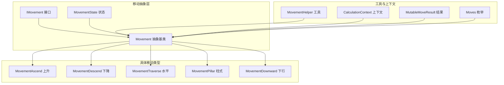
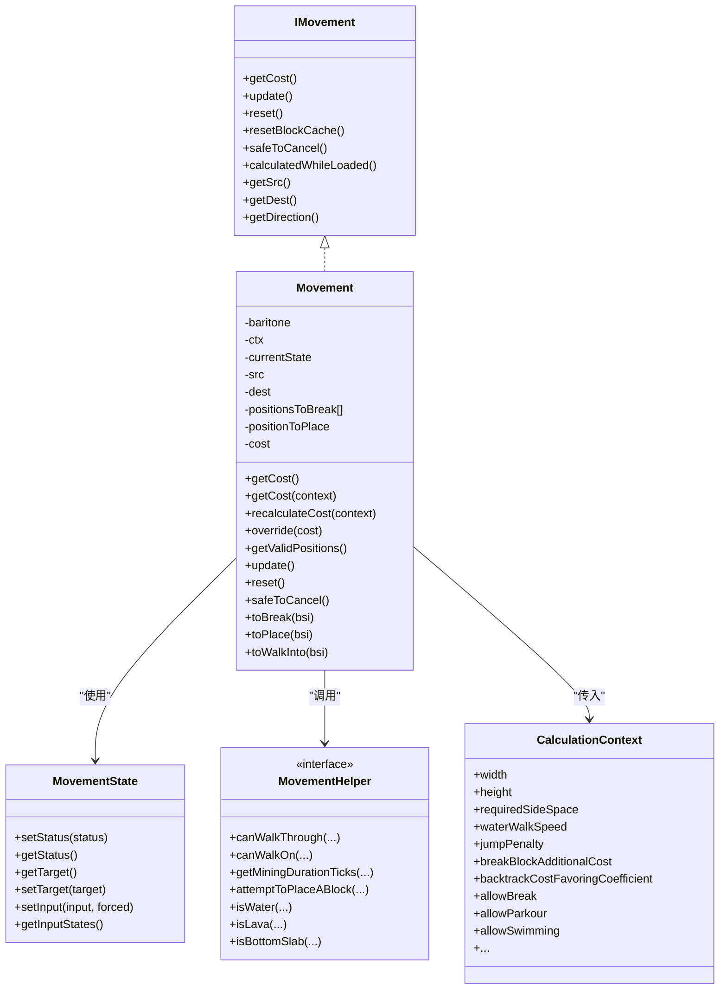
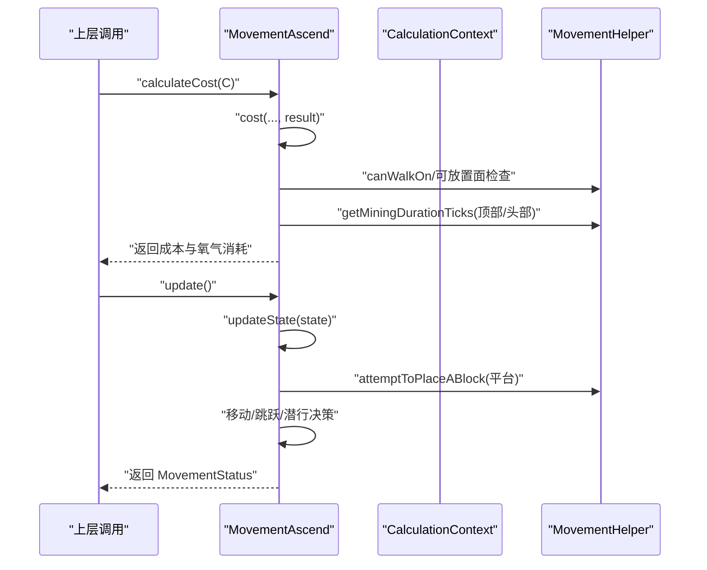
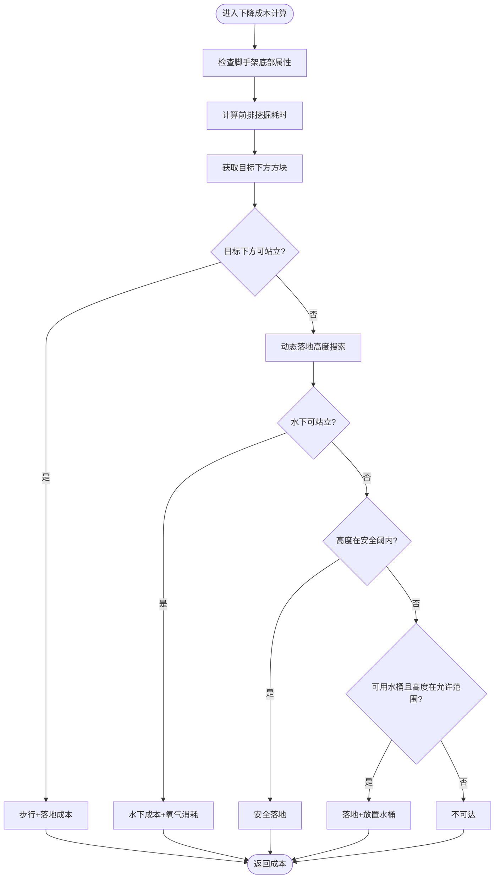
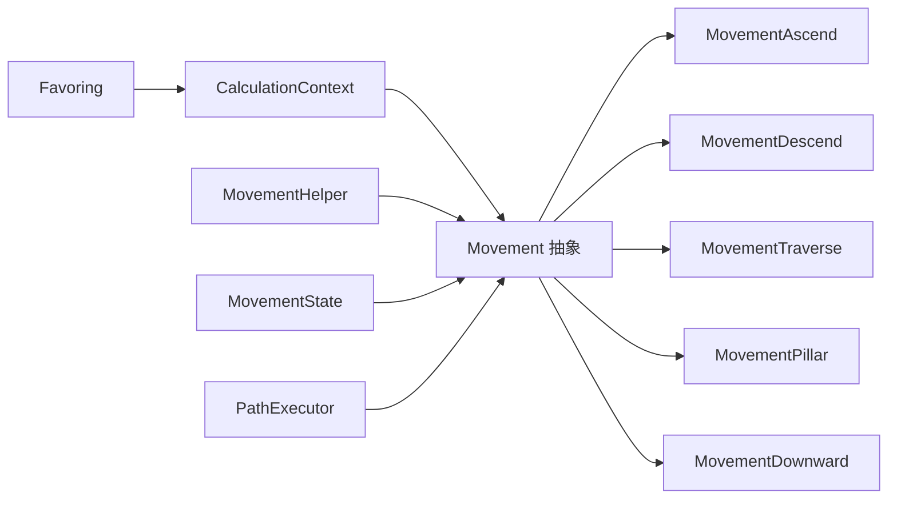

# 移动系统

<cite>
**本文引用的文件**
- [Movement.java](file://src/main/java/baritone/pathing/movement/Movement.java)
- [MovementHelper.java](file://src/main/java/baritone/pathing/movement/MovementHelper.java)
- [CalculationContext.java](file://src/main/java/baritone/pathing/movement/CalculationContext.java)
- [MovementState.java](file://src/main/java/baritone/pathing/movement/MovementState.java)
- [MovementAscend.java](file://src/main/java/baritone/pathing/movement/movements/MovementAscend.java)
- [MovementDescend.java](file://src/main/java/baritone/pathing/movement/movements/MovementDescend.java)
- [MovementTraverse.java](file://src/main/java/baritone/pathing/movement/movements/MovementTraverse.java)
- [MovementDownward.java](file://src/main/java/baritone/pathing/movement/movements/MovementDownward.java)
- [MovementPillar.java](file://src/main/java/baritone/pathing/movement/movements/MovementPillar.java)
- [IMovement.java](file://src/main/java/baritone/api/pathing/movement/IMovement.java)
- [MovementStatus.java](file://src/main/java/baritone/api/pathing/movement/MovementStatus.java)
- [MutableMoveResult.java](file://src/main/java/baritone/utils/pathing/MutableMoveResult.java)
- [Moves.java](file://src/main/java/baritone/pathing/movement/Moves.java)
- [PathExecutor.java](file://src/main/java/baritone/pathing/path/PathExecutor.java)
- [Favoring.java](file://src/main/java/baritone/utils/pathing/Favoring.java)
</cite>

## 目录
1. [简介](#简介)
2. [项目结构](#项目结构)
3. [核心组件](#核心组件)
4. [架构总览](#架构总览)
5. [详细组件分析](#详细组件分析)
6. [依赖关系分析](#依赖关系分析)
7. [性能考量](#性能考量)
8. [故障排查指南](#故障排查指南)
9. [结论](#结论)
10. [附录：扩展与自定义开发指南](#附录扩展与自定义开发指南)

## 简介
本文件系统性梳理并解读移动系统的设计与实现，覆盖以下主题：
- Movement 基类的设计模式与移动类型分类（上升、下降、水平、下行、柱式等）
- 移动状态机与执行条件
- 成本计算与权重、优先级、冲突处理
- MovementHelper 工具类的辅助能力（验证、碰撞、放置、氧气消耗等）
- CalculationContext 计算上下文的数据传递与配置
- 典型移动类型的物理模拟与执行逻辑
- 扩展开发与自定义移动类型的实现建议

## 项目结构
移动系统位于 baritone.pathing.movement 包及其子包中，采用“抽象基类 + 多种具体移动类型”的分层设计，并通过 CalculationContext 提供统一的成本与环境参数注入。

图示来源
- [Movement.java:25-276](file://src/main/java/baritone/pathing/movement/Movement.java#L25-L276)
- [MovementHelper.java:64-517](file://src/main/java/baritone/pathing/movement/MovementHelper.java#L64-L517)
- [CalculationContext.java:29-197](file://src/main/java/baritone/pathing/movement/CalculationContext.java#L29-L197)
- [MovementState.java:10-64](file://src/main/java/baritone/pathing/movement/MovementState.java#L10-L64)
- [MovementAscend.java:24-263](file://src/main/java/baritone/pathing/movement/movements/MovementAscend.java#L24-L263)
- [MovementDescend.java:28-272](file://src/main/java/baritone/pathing/movement/movements/MovementDescend.java#L28-L272)
- [MovementTraverse.java:35-460](file://src/main/java/baritone/pathing/movement/movements/MovementTraverse.java#L35-L460)
- [MovementPillar.java:39-301](file://src/main/java/baritone/pathing/movement/movements/MovementPillar.java#L39-L301)
- [MovementDownward.java:23-141](file://src/main/java/baritone/pathing/movement/movements/MovementDownward.java#L23-L141)
- [MutableMoveResult.java:5-26](file://src/main/java/baritone/utils/pathing/MutableMoveResult.java#L5-L26)
- [Moves.java:15-189](file://src/main/java/baritone/pathing/movement/Moves.java#L15-L189)

章节来源
- [Movement.java:25-276](file://src/main/java/baritone/pathing/movement/Movement.java#L25-L276)
- [MovementHelper.java:64-517](file://src/main/java/baritone/pathing/movement/MovementHelper.java#L64-L517)
- [CalculationContext.java:29-197](file://src/main/java/baritone/pathing/movement/CalculationContext.java#L29-L197)
- [MovementState.java:10-64](file://src/main/java/baritone/pathing/movement/MovementState.java#L10-L64)
- [MovementAscend.java:24-263](file://src/main/java/baritone/pathing/movement/movements/MovementAscend.java#L24-L263)
- [MovementDescend.java:28-272](file://src/main/java/baritone/pathing/movement/movements/MovementDescend.java#L28-L272)
- [MovementTraverse.java:35-460](file://src/main/java/baritone/pathing/movement/movements/MovementTraverse.java#L35-L460)
- [MovementPillar.java:39-301](file://src/main/java/baritone/pathing/movement/movements/MovementPillar.java#L39-L301)
- [MovementDownward.java:23-141](file://src/main/java/baritone/pathing/movement/movements/MovementDownward.java#L23-L141)
- [MutableMoveResult.java:5-26](file://src/main/java/baritone/utils/pathing/MutableMoveResult.java#L5-L26)
- [Moves.java:15-189](file://src/main/java/baritone/pathing/movement/Moves.java#L15-L189)

## 核心组件
- Movement 抽象基类：定义移动的生命周期、状态机、输入控制、缓存策略与通用成本计算框架；提供 valid positions、toBreak/toPlace/toWalkInto 的缓存与重用。
- MovementHelper 工具集：封装可行走性、可放置面、流体判定、挖掘耗时、放置尝试、氧气消耗等通用逻辑。
- CalculationContext 上下文：集中承载实体尺寸、世界边界、工具与物品可用性、设置项系数（跳跃惩罚、步行速度修正、回溯倾向系数等）。
- MovementState 状态机：封装当前目标旋转、强制旋转标记、输入映射，驱动 Movement 的状态流转。
- 具体移动类型：围绕 Movement 抽象派生出 Ascend/Descend/Traverse/Pillar/Downward 等，各自实现 cost 与 updateState。
- IMovement/MovementStatus：对外暴露的接口与状态枚举。

章节来源
- [Movement.java:25-276](file://src/main/java/baritone/pathing/movement/Movement.java#L25-L276)
- [MovementHelper.java:64-517](file://src/main/java/baritone/pathing/movement/MovementHelper.java#L64-L517)
- [CalculationContext.java:29-197](file://src/main/java/baritone/pathing/movement/CalculationContext.java#L29-L197)
- [MovementState.java:10-64](file://src/main/java/baritone/pathing/movement/MovementState.java#L10-L64)
- [IMovement.java:6-25](file://src/main/java/baritone/api/pathing/movement/IMovement.java#L6-L25)
- [MovementStatus.java:3-22](file://src/main/java/baritone/api/pathing/movement/MovementStatus.java#L3-L22)

## 架构总览
移动系统以 Movement 抽象为核心，通过 CalculationContext 注入环境参数，借助 MovementHelper 进行可行走性与放置可行性判断，最终由 MovementState 驱动输入与旋转，完成从准备到运行再到成功或不可达的状态转换。

图示来源
- [IMovement.java:6-25](file://src/main/java/baritone/api/pathing/movement/IMovement.java#L6-L25)
- [MovementState.java:10-64](file://src/main/java/baritone/pathing/movement/MovementState.java#L10-L64)
- [Movement.java:25-276](file://src/main/java/baritone/pathing/movement/Movement.java#L25-L276)
- [MovementHelper.java:64-517](file://src/main/java/baritone/pathing/movement/MovementHelper.java#L64-L517)
- [CalculationContext.java:29-197](file://src/main/java/baritone/pathing/movement/CalculationContext.java#L29-L197)

## 详细组件分析

### Movement 基类与状态机
- 生命周期与状态：PREPPING → WAITING → RUNNING；SUCCESS/UNREACHABLE/FAILED/CANCELED 作为终止态。
- 输入控制：通过 MovementState 的输入映射与 LookBehavior、InputOverrideHandler 协作，按需设置移动、跳跃、潜行、点击等。
- 位置与缓存：valid positions、toBreak/toPlace/toWalkInto 缓存减少重复计算；支持重置与重新计算。
- 成本计算：延迟计算并缓存；支持外部覆盖；结合 CalculationContext 与 MovementHelper 完成成本分解（步行、跳跃、放置、挖掘、氧气消耗）。

章节来源
- [Movement.java:25-276](file://src/main/java/baritone/pathing/movement/Movement.java#L25-L276)
- [MovementState.java:10-64](file://src/main/java/baritone/pathing/movement/MovementState.java#L10-L64)
- [MovementStatus.java:3-22](file://src/main/java/baritone/api/pathing/movement/MovementStatus.java#L3-L22)

### MovementHelper 工具集
- 可行走性与可放置面：canWalkThrough/canWalkOn/canPlaceAgainst 综合考虑方块类型、液体、楼梯、半砖、门、栅栏门、雪层、可替换性等。
- 挖掘耗时：getMiningDurationTicks 考虑工具效率、破坏倍率、是否避免破坏、掉落物影响等。
- 放置尝试：attemptToPlaceABlock 自动寻找合适面、可达性、射线追踪、选择物品槽位，返回就绪/尝试中/无选项。
- 流体与氧气：isWater/isLava/isLiquid、oxygenCost 将水下呼吸与头部/脚部状态纳入成本。
- 其他：isBottomSlab、isBlockNormalCube、isDoorPassable/isGatePassable 等辅助判断。

章节来源
- [MovementHelper.java:64-517](file://src/main/java/baritone/pathing/movement/MovementHelper.java#L64-L517)

### CalculationContext 计算上下文
- 关键字段：实体尺寸（宽/高/所需侧向空间）、世界边界、跳跃/游泳/攀爬开关、步行速度修正、跳跃惩罚、回溯倾向系数、放置/破坏成本、水桶/替代物可用性等。
- 方法：costOfPlacingAt/breakCostMultiplierAt、canPlaceAgainst/isProtected、oxygenCost 等，为各移动类型的 cost 计算提供统一入口。

章节来源
- [CalculationContext.java:29-197](file://src/main/java/baritone/pathing/movement/CalculationContext.java#L29-L197)

### MovementAscend 上升移动
- 目标：在目标点上方放置方块以形成可站立平台，必要时清理顶部与墙体阻碍。
- 成本：综合步行成本、跳跃成本、放置成本、挖掘成本、氧气消耗；对底部与目标平台是否为底部半砖进行分支处理。
- 执行：若平台未就位则尝试放置；到达目标后根据步态与头撞判定决定是否继续跳跃；支持安全取消。

图示来源
- [MovementAscend.java:62-180](file://src/main/java/baritone/pathing/movement/movements/MovementAscend.java#L62-L180)
- [MovementHelper.java:306-344](file://src/main/java/baritone/pathing/movement/MovementHelper.java#L306-L344)
- [CalculationContext.java:151-177](file://src/main/java/baritone/pathing/movement/CalculationContext.java#L151-L177)

章节来源
- [MovementAscend.java:24-263](file://src/main/java/baritone/pathing/movement/movements/MovementAscend.java#L24-L263)

### MovementDescend 下降移动
- 目标：从起点安全下降至目标层，优先考虑可支撑面与梯子/藤蔓。
- 成本：动态计算落地高度与保护（水桶/最大安全高度），区分普通落地、水下落地、梯子/藤蔓落地。
- 执行：若前方有障碍先挖掘；在安全模式下调整朝向与潜行；必要时跳过直接上升。

图示来源
- [MovementDescend.java:60-189](file://src/main/java/baritone/pathing/movement/movements/MovementDescend.java#L60-L189)
- [MovementHelper.java:306-344](file://src/main/java/baritone/pathing/movement/MovementHelper.java#L306-L344)
- [CalculationContext.java:151-177](file://src/main/java/baritone/pathing/movement/CalculationContext.java#L151-L177)

章节来源
- [MovementDescend.java:28-272](file://src/main/java/baritone/pathing/movement/movements/MovementDescend.java#L28-L272)

### MovementTraverse 水平移动
- 目标：在 XZ 平面横向移动，必要时在脚下放置方块形成桥。
- 成本：步行速度与地面材质修正、水下步行速度、挖掘耗时、放置成本；考虑冲刺修正与氧气消耗。
- 执行：若桥已存在则正常前进；否则尝试放置桥面并处理门/栅栏门开启；注意避免走入危险方块。

章节来源
- [MovementTraverse.java:35-460](file://src/main/java/baritone/pathing/movement/movements/MovementTraverse.java#L35-L460)
- [MovementHelper.java:306-344](file://src/main/java/baritone/pathing/movement/MovementHelper.java#L306-L344)
- [CalculationContext.java:151-177](file://src/main/java/baritone/pathing/movement/CalculationContext.java#L151-L177)

### MovementPillar 柱式移动
- 目标：垂直向上攀爬，利用梯子/藤蔓或放置方块形成支撑。
- 成本：根据是否可攀爬/水下/需要放置进行分支；考虑放置成本与跳跃惩罚。
- 执行：若可攀爬则移动到支撑点并跳跃；否则尝试放置并处理挖掘/放置冲突。

章节来源
- [MovementPillar.java:39-301](file://src/main/java/baritone/pathing/movement/movements/MovementPillar.java#L39-L301)
- [MovementHelper.java:306-344](file://src/main/java/baritone/pathing/movement/MovementHelper.java#L306-L344)
- [CalculationContext.java:151-177](file://src/main/java/baritone/pathing/movement/CalculationContext.java#L151-L177)

### MovementDownward 下行移动
- 目标：向下移动至目标层，优先考虑可站立面与脚手架。
- 成本：根据下方是否为水/可站立面计算落地成本与挖掘成本；水下步行速度修正。
- 执行：接近目标时根据脚手架与水下状态决定潜行与移动。

章节来源
- [MovementDownward.java:23-141](file://src/main/java/baritone/pathing/movement/movements/MovementDownward.java#L23-L141)
- [MovementHelper.java:306-344](file://src/main/java/baritone/pathing/movement/MovementHelper.java#L306-L344)
- [CalculationContext.java:151-177](file://src/main/java/baritone/pathing/movement/CalculationContext.java#L151-L177)

### Moves 枚举与移动类型生成
- Moves 枚举将方向偏移与移动类型绑定，统一生成 Movement 实例并应用成本计算，便于路径规划器批量生成候选移动。

章节来源
- [Moves.java:15-189](file://src/main/java/baritone/pathing/movement/Moves.java#L15-L189)

## 依赖关系分析
- Movement 对 CalculationContext 与 MovementHelper 存在强依赖，用于成本与可行性判断。
- MovementState 作为输入与旋转的载体，贯穿 Movement 的 update 生命周期。
- PathExecutor 在执行路径时复用 Movement 的 toBreak/toPlace/toWalkInto 缓存，减少重复计算。
- Favoring 通过回溯倾向系数与避让区域对路径成本进行加权，间接影响移动权重排序。

图示来源
- [Movement.java:25-276](file://src/main/java/baritone/pathing/movement/Movement.java#L25-L276)
- [MovementHelper.java:64-517](file://src/main/java/baritone/pathing/movement/MovementHelper.java#L64-L517)
- [CalculationContext.java:29-197](file://src/main/java/baritone/pathing/movement/CalculationContext.java#L29-L197)
- [MovementState.java:10-64](file://src/main/java/baritone/pathing/movement/MovementState.java#L10-L64)
- [PathExecutor.java:124-150](file://src/main/java/baritone/pathing/path/PathExecutor.java#L124-L150)
- [Favoring.java:10-38](file://src/main/java/baritone/utils/pathing/Favoring.java#L10-L38)

章节来源
- [PathExecutor.java:124-150](file://src/main/java/baritone/pathing/path/PathExecutor.java#L124-L150)
- [Favoring.java:10-38](file://src/main/java/baritone/utils/pathing/Favoring.java#L10-L38)

## 性能考量
- 成本缓存：Movement 对 cost 与 valid positions、toBreak/toPlace/toWalkInto 进行缓存，避免重复计算。
- 延迟计算：仅在首次访问时计算成本，后续复用；必要时通过 recalculateCost 强制刷新。
- 成本分解：将步行、跳跃、放置、挖掘、氧气消耗拆分为独立部分，便于统计与调试。
- 回溯倾向：通过 Favoring 与 CalculationContext 的 backtrackCostFavoringCoefficient 影响路径回溯偏好，平衡探索与保守。

## 故障排查指南
- 不可到达（UNREACHABLE）常见原因
  - 目标位置不可站立或无法放置桥面
  - 需要破坏的方块无法被工具有效破坏或被避免破坏策略阻止
  - 水下/水面上的站立条件不满足
- 执行中断
  - Movement.safeToCancel 返回 false 时不应随意打断
  - Movement.update 中若 isInWall 或被掉落方块阻断，会暂停准备阶段
- 路径执行异常
  - PathExecutor 会根据 toBreak/toPlace/toWalkInto 的变化触发重新计算，确认缓存一致性

章节来源
- [Movement.java:96-178](file://src/main/java/baritone/pathing/movement/Movement.java#L96-L178)
- [MovementHelper.java:306-344](file://src/main/java/baritone/pathing/movement/MovementHelper.java#L306-L344)
- [PathExecutor.java:124-150](file://src/main/java/baritone/pathing/path/PathExecutor.java#L124-L150)

## 结论
该移动系统以 Movement 抽象为核心，通过 CalculationContext 提供一致的成本与环境参数，借助 MovementHelper 完成复杂的可行走性与放置判定，配合 MovementState 驱动输入与旋转，形成稳定、可扩展的移动执行框架。具体移动类型在统一的成本模型与状态机下实现差异化行为，既保证了通用性，又保留了灵活性。

## 附录：扩展与自定义开发指南
- 新增移动类型步骤
  - 继承 Movement，实现 calculateCost 与 updateState
  - 在 Moves 中注册新的方向/偏移组合，绑定新移动类型
  - 使用 CalculationContext 获取所需参数（尺寸、跳跃/游泳/攀爬开关、放置/破坏许可等）
  - 利用 MovementHelper 完成可行走性、放置可行性、挖掘耗时、氧气消耗等计算
  - 在 MovementState 中设置目标旋转与输入，确保与 Movement.update 生命周期协同
- 权重与优先级
  - 通过 CalculationContext 的 jumpPenalty、walkOnWaterOnePenalty、backtrackCostFavoringCoefficient 等参数微调成本
  - 使用 Favoring 对回溯路径进行加权，提升或抑制特定节点的优先级
- 冲突解决
  - Movement.safeToCancel 控制打断安全性
  - Movement.update 中对掉落方块、墙体、液体等进行条件判断，避免冲突

章节来源
- [Movement.java:25-276](file://src/main/java/baritone/pathing/movement/Movement.java#L25-L276)
- [MovementHelper.java:64-517](file://src/main/java/baritone/pathing/movement/MovementHelper.java#L64-L517)
- [CalculationContext.java:29-197](file://src/main/java/baritone/pathing/movement/CalculationContext.java#L29-L197)
- [Favoring.java:10-38](file://src/main/java/baritone/utils/pathing/Favoring.java#L10-L38)
- [Moves.java:15-189](file://src/main/java/baritone/pathing/movement/Moves.java#L15-L189)