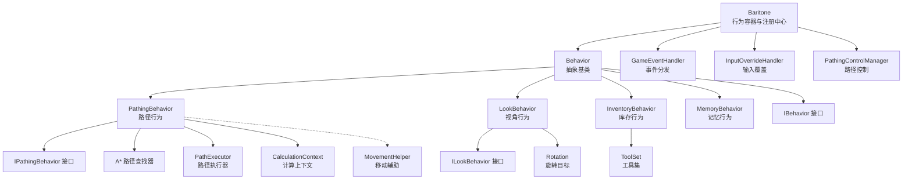
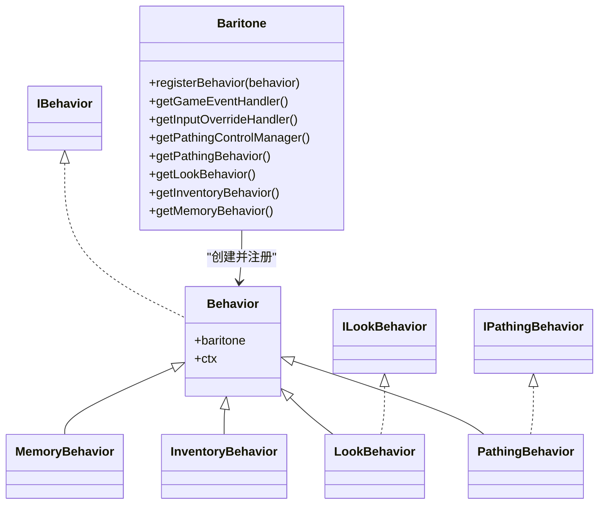
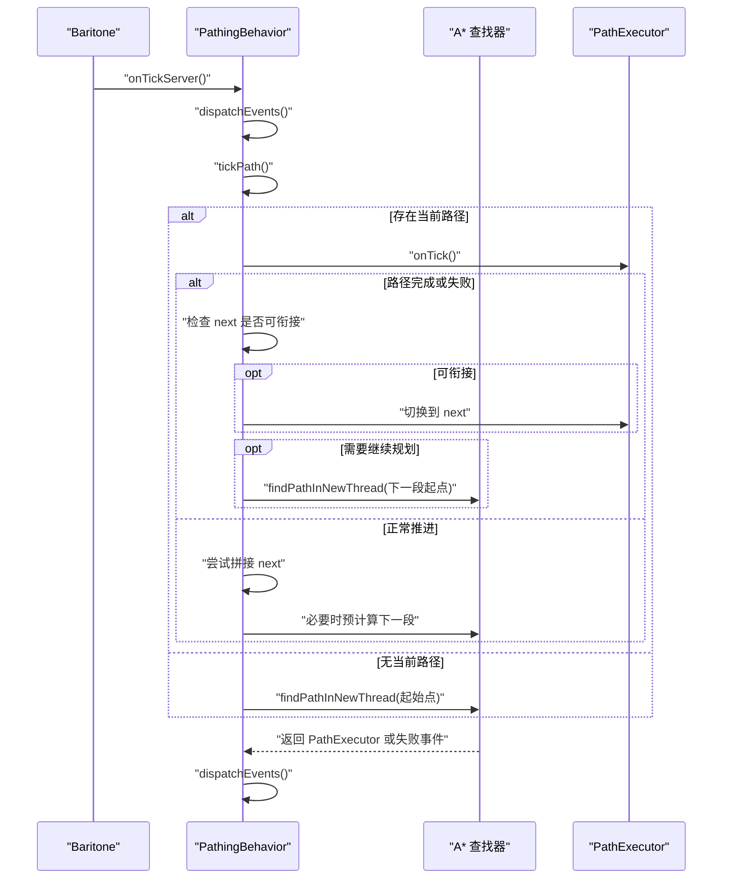
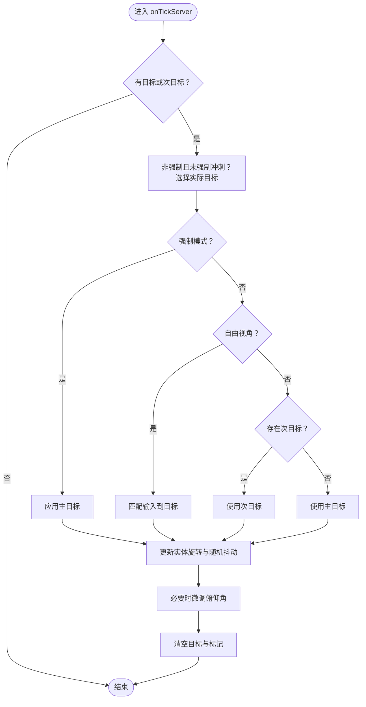
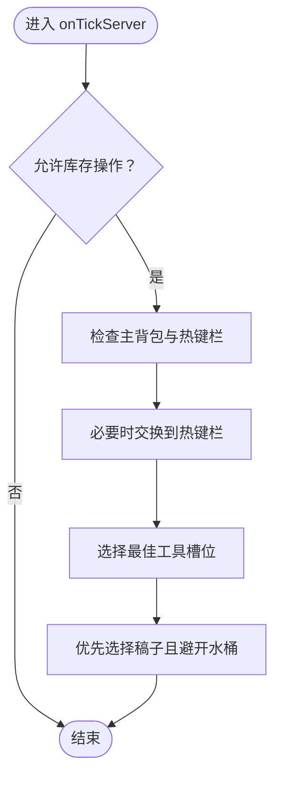
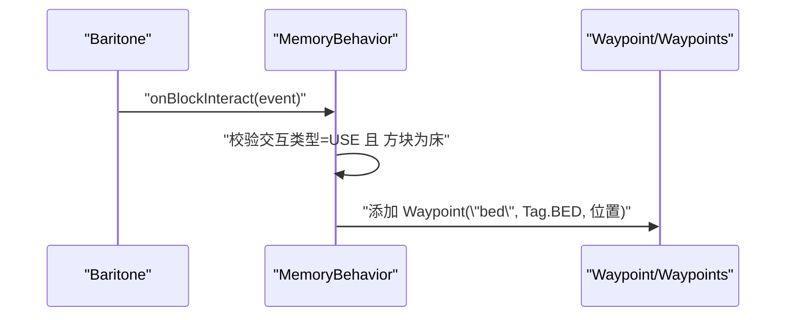

# 行为管理系统

<cite>
**本文引用的文件**
- [Behavior.java](file://src/main/java/baritone/behavior/Behavior.java)
- [PathingBehavior.java](file://src/main/java/baritone/behavior/PathingBehavior.java)
- [LookBehavior.java](file://src/main/java/baritone/behavior/LookBehavior.java)
- [InventoryBehavior.java](file://src/main/java/baritone/behavior/InventoryBehavior.java)
- [MemoryBehavior.java](file://src/main/java/baritone/behavior/MemoryBehavior.java)
- [IBehavior.java](file://src/main/java/baritone/api/behavior/IBehavior.java)
- [IPathingBehavior.java](file://src/main/java/baritone/api/behavior/IPathingBehavior.java)
- [ILookBehavior.java](file://src/main/java/baritone/api/behavior/ILookBehavior.java)
- [Baritone.java](file://src/main/java/baritone/Baritone.java)
- [AbstractGameEventListener.java](file://src/main/java/baritone/api/event/listener/AbstractGameEventListener.java)
- [Settings.java](file://src/main/java/baritone/api/Settings.java)
- [ToolSet.java](file://src/main/java/baritone/utils/ToolSet.java)
- [MovementHelper.java](file://src/main/java/baritone/pathing/movement/MovementHelper.java)
</cite>

## 目录
1. [简介](#简介)
2. [项目结构](#项目结构)
3. [核心组件](#核心组件)
4. [架构总览](#架构总览)
5. [详细组件分析](#详细组件分析)
6. [依赖关系分析](#依赖关系分析)
7. [性能考量](#性能考量)
8. [故障排查指南](#故障排查指南)
9. [结论](#结论)
10. [附录：扩展开发指南与示例](#附录扩展开发指南与示例)

## 简介
本文件系统性梳理行为管理系统的设计与实现，重点覆盖以下方面：
- Behavior 基类的设计模式与扩展机制（事件监听、状态管理、行为注册）
- PathingBehavior 路径行为：目标计算、路径生成、移动控制、拼接与取消策略
- LookBehavior 视角行为：旋转计算、目标锁定、自由视角与强制视角切换
- InventoryBehavior 库存行为：物品选择、使用时机、热键栏调度与优化策略
- MemoryBehavior 记忆行为：数据存储与检索机制（以床坐标为例）
- 扩展开发指南与自定义行为实现示例

## 项目结构
行为系统位于 baritone/behavior 包中，围绕统一的 Behavior 抽象基类构建，通过 Baritone 容器集中注册与调度。各行为实现遵循相同的生命周期与事件模型。

**图表来源**
- [Baritone.java:58-79](file://src/main/java/baritone/Baritone.java#L58-L79)
- [Behavior.java:7-16](file://src/main/java/baritone/behavior/Behavior.java#L7-L16)
- [PathingBehavior.java:29-50](file://src/main/java/baritone/behavior/PathingBehavior.java#L29-L50)
- [LookBehavior.java:14-21](file://src/main/java/baritone/behavior/LookBehavior.java#L14-L21)
- [InventoryBehavior.java:29-32](file://src/main/java/baritone/behavior/InventoryBehavior.java#L29-L32)
- [MemoryBehavior.java:11-14](file://src/main/java/baritone/behavior/MemoryBehavior.java#L11-L14)

**章节来源**
- [Baritone.java:58-79](file://src/main/java/baritone/Baritone.java#L58-L79)
- [Behavior.java:7-16](file://src/main/java/baritone/behavior/Behavior.java#L7-L16)

## 核心组件
- Behavior 抽象基类：统一持有 Baritone 引擎与实体上下文，并在构造时完成行为注册，使行为成为事件监听者。
- IBehavior/ILookBehavior/IPathingBehavior 接口：定义行为的最小能力集合与生命周期回调。
- Baritone 容器：集中创建并注册所有行为，提供事件分发、输入覆盖、路径控制等基础设施。

关键点：
- 事件监听：行为实现均继承自抽象事件监听接口，默认空实现，按需覆盖。
- 注册机制：通过 Baritone.registerBehavior 将行为加入 GameEventHandler 的监听列表。
- 生命周期：行为在服务器 Tick 中被调用 onTickServer，执行各自的状态推进与动作输出。

**章节来源**
- [Behavior.java:7-16](file://src/main/java/baritone/behavior/Behavior.java#L7-L16)
- [IBehavior.java:5-6](file://src/main/java/baritone/api/behavior/IBehavior.java#L5-L6)
- [AbstractGameEventListener.java:6-18](file://src/main/java/baritone/api/event/listener/AbstractGameEventListener.java#L6-L18)
- [Baritone.java:85-87](file://src/main/java/baritone/Baritone.java#L85-L87)

## 架构总览
行为系统采用“容器 + 多行为”的架构。Baritone 作为全局容器，负责：
- 创建并注册行为（Pathing、Look、Inventory、Memory）
- 统一事件分发（GameEventHandler）
- 输入覆盖（InputOverrideHandler）
- 路径控制（PathingControlManager）

**图表来源**
- [Baritone.java:58-79](file://src/main/java/baritone/Baritone.java#L58-L79)
- [Behavior.java:7-16](file://src/main/java/baritone/behavior/Behavior.java#L7-L16)
- [PathingBehavior.java:29](file://src/main/java/baritone/behavior/PathingBehavior.java#L29)
- [LookBehavior.java:14](file://src/main/java/baritone/behavior/LookBehavior.java#L14)
- [InventoryBehavior.java:29](file://src/main/java/baritone/behavior/InventoryBehavior.java#L29)
- [MemoryBehavior.java:11](file://src/main/java/baritone/behavior/MemoryBehavior.java#L11)
- [IBehavior.java:5](file://src/main/java/baritone/api/behavior/IBehavior.java#L5)
- [IPathingBehavior.java:11](file://src/main/java/baritone/api/behavior/IPathingBehavior.java#L11)
- [ILookBehavior.java:5](file://src/main/java/baritone/api/behavior/ILookBehavior.java#L5)

## 详细组件分析

### Behavior 基类与扩展机制
- 设计要点
  - 统一持有 Baritone 与 IEntityContext，便于访问世界、实体与设置。
  - 在构造函数中调用 Baritone.registerBehavior，自动完成事件监听注册。
  - 通过抽象事件监听接口，行为可按需覆盖 onTickServer、onBlockInteract、onPathEvent 等。
- 扩展建议
  - 新行为继承 Behavior 并在 Baritone 容器中注册。
  - 使用 Baritone.settings 读取配置，使用 ctx/world/entity 获取运行时状态。
  - 通过 GameEventHandler 分发自定义事件或订阅现有事件。

**章节来源**
- [Behavior.java:7-16](file://src/main/java/baritone/behavior/Behavior.java#L7-L16)
- [AbstractGameEventListener.java:6-18](file://src/main/java/baritone/api/event/listener/AbstractGameEventListener.java#L6-L18)
- [Baritone.java:85-87](file://src/main/java/baritone/Baritone.java#L85-L87)

### PathingBehavior 路径行为
- 目标计算与路径生成
  - 通过 Goal 与 CalculationContext 驱动 A* 路径查找器，支持简化未加载区域 Y 坐标的 GoalXZ 变换。
  - 使用 LinkedBlockingQueue 队列收集 PathEvent，异步线程计算完成后入队并统一派发。
- 移动控制与状态管理
  - 当前路径段 current 与预规划下一段 next，支持拼接与提前切入。
  - 提供安全取消与软取消逻辑，避免打断危险动作。
  - 支持暂停/恢复、强制取消、估计剩余到达时间等。
- 关键流程（节选）
  - 每 Tick：派发事件 → 计算期望 segment 起点 → 预处理 → tickPath → 增加计数 → 再次派发事件
  - tickPath：根据 pause/cancel 状态与当前路径状态推进；必要时启动新路径或预计算下一段
  - findPathInNewThread：在独立线程中执行路径搜索，完成后写入 PathExecutor 或丢弃孤儿段

**图表来源**
- [PathingBehavior.java:67-74](file://src/main/java/baritone/behavior/PathingBehavior.java#L67-L74)
- [PathingBehavior.java:81-193](file://src/main/java/baritone/behavior/PathingBehavior.java#L81-L193)
- [PathingBehavior.java:404-502](file://src/main/java/baritone/behavior/PathingBehavior.java#L404-L502)

**章节来源**
- [PathingBehavior.java:29-50](file://src/main/java/baritone/behavior/PathingBehavior.java#L29-L50)
- [PathingBehavior.java:67-193](file://src/main/java/baritone/behavior/PathingBehavior.java#L67-L193)
- [PathingBehavior.java:404-502](file://src/main/java/baritone/behavior/PathingBehavior.java#L404-L502)
- [IPathingBehavior.java:11-53](file://src/main/java/baritone/api/behavior/IPathingBehavior.java#L11-L53)

### LookBehavior 视角行为
- 功能概述
  - 更新主/次目标旋转，支持随机抖动与强制视角。
  - 自由视角模式下直接匹配输入，非自由视角下优先次目标（如锁定）。
  - 在移动方向与视角之间进行协调，避免冲突。
- 关键流程
  - 每 Tick：若存在目标则更新视角；随后清空目标与标记。
  - 非强制模式下根据输入状态决定实际目标；自由视角直接应用目标。
  - 对俯仰角进行微调，保持自然表现。

**图表来源**
- [LookBehavior.java:44-52](file://src/main/java/baritone/behavior/LookBehavior.java#L44-L52)
- [LookBehavior.java:54-98](file://src/main/java/baritone/behavior/LookBehavior.java#L54-L98)
- [LookBehavior.java:106-128](file://src/main/java/baritone/behavior/LookBehavior.java#L106-L128)

**章节来源**
- [LookBehavior.java:14-21](file://src/main/java/baritone/behavior/LookBehavior.java#L14-L21)
- [LookBehavior.java:44-128](file://src/main/java/baritone/behavior/LookBehavior.java#L44-L128)
- [ILookBehavior.java:5-9](file://src/main/java/baritone/api/behavior/ILookBehavior.java#L5-L9)

### InventoryBehavior 库存行为
- 功能概述
  - 在允许库存操作的前提下，维护热键栏与主背包的物品调度。
  - 选择最佳工具（如最高等级的稿子）用于挖掘，考虑耐久度与附魔。
  - 根据可丢弃物品清单与放置需求，选择合适的方块物品用于放置。
- 关键流程
  - 每 Tick：若允许库存操作，检查主背包与热键栏，必要时交换槽位。
  - 选择最佳工具：遍历热键栏，比较破坏速度，优先附魔与耐久策略。
  - 丢弃/选择物品：优先匹配可丢弃清单，其次匹配放置需求，最后回退到合适物品。

**图表来源**
- [InventoryBehavior.java:35-53](file://src/main/java/baritone/behavior/InventoryBehavior.java#L35-L53)
- [InventoryBehavior.java:105-124](file://src/main/java/baritone/behavior/InventoryBehavior.java#L105-L124)
- [ToolSet.java:49-89](file://src/main/java/baritone/utils/ToolSet.java#L49-L89)

**章节来源**
- [InventoryBehavior.java:29-53](file://src/main/java/baritone/behavior/InventoryBehavior.java#L29-L53)
- [InventoryBehavior.java:105-202](file://src/main/java/baritone/behavior/InventoryBehavior.java#L105-L202)
- [ToolSet.java:19-146](file://src/main/java/baritone/utils/ToolSet.java#L19-L146)

### MemoryBehavior 记忆行为
- 功能概述
  - 监听方块交互事件，在满足条件（如右击床）时记录位置为“床”锚点。
  - 使用 Waypoint 与 IWaypoint.Tag.BED 进行存储，便于后续导航或任务参考。
- 关键流程
  - 监听 BlockInteractEvent，判断交互类型与方块是否为床。
  - 若满足条件，向当前世界添加 Waypoint。

**图表来源**
- [MemoryBehavior.java:17-25](file://src/main/java/baritone/behavior/MemoryBehavior.java#L17-L25)

**章节来源**
- [MemoryBehavior.java:11-26](file://src/main/java/baritone/behavior/MemoryBehavior.java#L11-L26)

## 依赖关系分析
- 行为与容器
  - Behavior 依赖 Baritone 与 IEntityContext；Baritone 在构造时创建并注册所有行为。
- 路径行为内部依赖
  - PathingBehavior 依赖 A* 路径查找器、PathExecutor、CalculationContext、MovementHelper 等。
  - 通过 Settings 控制超时、拼接、简化策略等。
- 视角行为依赖
  - LookBehavior 依赖 Rotation、InputOverrideHandler、Settings 的自由视角与随机视角参数。
- 库存行为依赖
  - InventoryBehavior 依赖 ToolSet、Settings 的工具选择与丢弃策略。
- 事件与监听
  - 所有行为实现 AbstractGameEventListener 的默认空方法，按需覆盖；由 Baritone 的 GameEventHandler 统一分发。

```mermaid
graph LR
Baro["Baritone"] --> Beh["Behavior"]
Beh --> PB["PathingBehavior"]
Beh --> LB["LookBehavior"]
Beh --> IB["InventoryBehavior"]
Beh --> MB["MemoryBehavior"]
PB --> PF["A* 查找器"]
PB --> PE["PathExecutor"]
PB --> CTX["CalculationContext"]
PB --> MH["MovementHelper"]
LB --> ROT["Rotation"]
LB --> IOH["InputOverrideHandler"]
IB --> TS["ToolSet"]
Baro --> EH["GameEventHandler"]
Baro --> IOH
Baro --> PCM["PathingControlManager"]
PB --> ST["Settings"]
LB --> ST
IB --> ST
```

**图表来源**
- [Baritone.java:58-79](file://src/main/java/baritone/Baritone.java#L58-L79)
- [PathingBehavior.java:14-20](file://src/main/java/baritone/behavior/PathingBehavior.java#L14-L20)
- [LookBehavior.java:3-7](file://src/main/java/baritone/behavior/LookBehavior.java#L3-L7)
- [InventoryBehavior.java:3-6](file://src/main/java/baritone/behavior/InventoryBehavior.java#L3-L6)
- [Settings.java:27-200](file://src/main/java/baritone/api/Settings.java#L27-L200)

**章节来源**
- [Baritone.java:58-79](file://src/main/java/baritone/Baritone.java#L58-L79)
- [PathingBehavior.java:14-20](file://src/main/java/baritone/behavior/PathingBehavior.java#L14-L20)
- [LookBehavior.java:3-7](file://src/main/java/baritone/behavior/LookBehavior.java#L3-L7)
- [InventoryBehavior.java:3-6](file://src/main/java/baritone/behavior/InventoryBehavior.java#L3-L6)
- [Settings.java:27-200](file://src/main/java/baritone/api/Settings.java#L27-L200)

## 性能考量
- 路径计算
  - 使用独立线程执行路径搜索，避免阻塞主循环；通过队列统一派发事件。
  - 支持路径拼接与预计算，减少频繁重算带来的开销。
- 工具选择
  - ToolSet 缓存破坏强度，结合药水效果与附魔系数，降低重复计算成本。
- 视角更新
  - 随机抖动幅度受 Settings 控制，避免过度扰动导致的输入冲突。
- 设置项影响
  - 关键设置项包括：拼接路径、简化未加载区域、超时阈值、随机视角等，直接影响性能与稳定性。

[本节为通用指导，不直接分析具体文件]

## 故障排查指南
- 路径无法生成或频繁失败
  - 检查超时设置与失败阈值；确认 Goal 是否正确、是否需要简化为 GoalXZ。
  - 关注 PathEvent.CALC_FAILED 与 NEXT_CALC_FAILED 的派发与日志。
- 路径段不连续或被丢弃
  - 核对 segment 起点与当前位置一致性；确保 orphan 段不会被错误保留。
- 视角异常或卡顿
  - 检查自由视角与强制视角切换逻辑；确认输入覆盖状态与移动方向冲突。
- 库存操作无效
  - 确认 Settings.allowInventory 开启；检查可丢弃物品清单与放置需求匹配。

**章节来源**
- [PathingBehavior.java:52-64](file://src/main/java/baritone/behavior/PathingBehavior.java#L52-L64)
- [PathingBehavior.java:448-468](file://src/main/java/baritone/behavior/PathingBehavior.java#L448-L468)
- [LookBehavior.java:54-98](file://src/main/java/baritone/behavior/LookBehavior.java#L54-L98)
- [Settings.java:31-64](file://src/main/java/baritone/api/Settings.java#L31-L64)

## 结论
行为管理系统以 Behavior 为基座，通过 Baritone 容器统一注册与调度，形成高内聚、低耦合的行为模块。PathingBehavior 提供稳健的路径规划与执行，LookBehavior 实现自然的视角控制，InventoryBehavior 保障工具与物品的高效利用，MemoryBehavior 则为导航记忆提供基础。借助 Settings 与事件系统，系统具备良好的可扩展性与可配置性。

[本节为总结性内容，不直接分析具体文件]

## 附录：扩展开发指南与示例
- 自定义行为开发步骤
  - 继承 Behavior，构造时完成必要的初始化。
  - 在 Baritone 容器中创建实例并注册（参考 Baritone 构造函数中的注册方式）。
  - 实现所需生命周期方法（如 onTickServer），按需覆盖事件回调。
  - 通过 Settings 读取配置，使用 ctx/world/entity 获取状态。
- 示例思路
  - 新增一个“采集行为”：在每 Tick 检查周围资源，选择最优工具并发起交互。
  - 新增一个“聊天行为”：监听特定事件，通过 GameEventHandler 发送消息。
  - 新增一个“寻路增强行为”：基于 PathingBehavior 的接口扩展，提供更精细的目标变换或路径后处理。
- 最佳实践
  - 使用 InputOverrideHandler 进行输入覆盖时，注意安全取消与打断保护。
  - 合理使用 Settings 的开关与阈值，避免过度计算与不必要操作。
  - 将复杂逻辑拆分为小函数，便于测试与维护。

[本节为概念性指导，不直接分析具体文件]