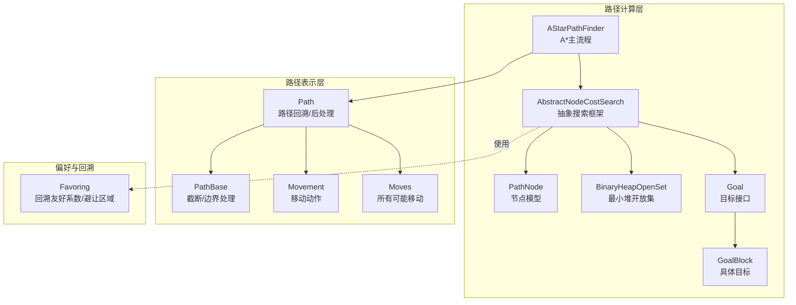
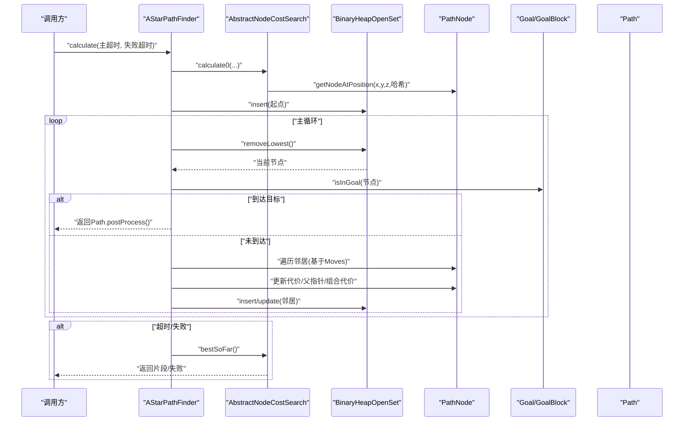
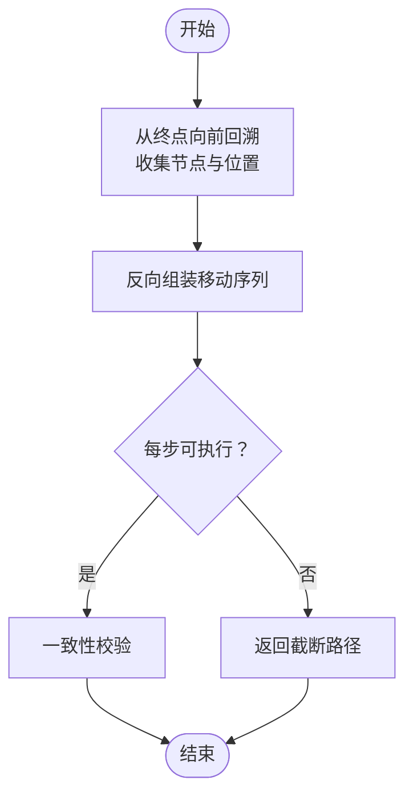
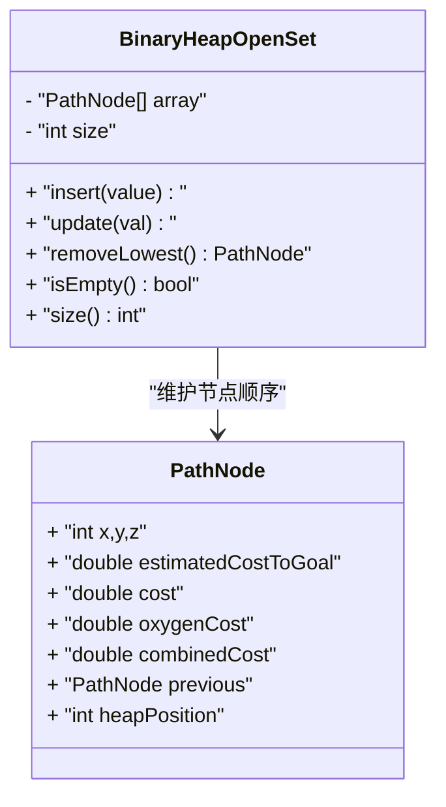
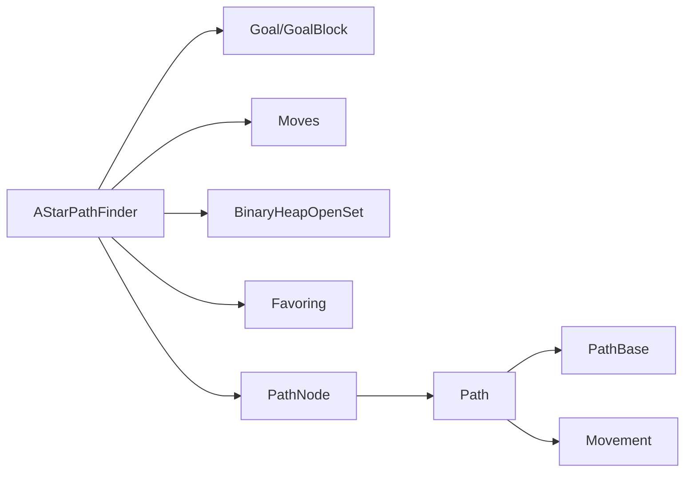

# 路径寻找算法

<cite>
**本文引用的文件**
- [AStarPathFinder.java](file://src/main/java/baritone/pathing/calc/AStarPathFinder.java)
- [AbstractNodeCostSearch.java](file://src/main/java/baritone/pathing/calc/AbstractNodeCostSearch.java)
- [Path.java](file://src/main/java/baritone/pathing/calc/Path.java)
- [PathNode.java](file://src/main/java/baritone/pathing/calc/PathNode.java)
- [BinaryHeapOpenSet.java](file://src/main/java/baritone/pathing/calc/openset/BinaryHeapOpenSet.java)
- [Goal.java](file://src/main/java/baritone/api/pathing/goals/Goal.java)
- [GoalBlock.java](file://src/main/java/baritone/api/pathing/goals/GoalBlock.java)
- [Moves.java](file://src/main/java/baritone/pathing/movement/Moves.java)
- [Movement.java](file://src/main/java/baritone/pathing/movement/Movement.java)
- [PathBase.java](file://src/main/java/baritone/utils/pathing/PathBase.java)
- [Favoring.java](file://src/main/java/baritone/utils/pathing/Favoring.java)
</cite>

## 目录
1. [引言](#引言)
2. [项目结构](#项目结构)
3. [核心组件](#核心组件)
4. [架构总览](#架构总览)
5. [详细组件分析](#详细组件分析)
6. [依赖关系分析](#依赖关系分析)
7. [性能考量](#性能考量)
8. [故障排查指南](#故障排查指南)
9. [结论](#结论)
10. [附录：参数调优与优化建议](#附录参数调优与优化建议)

## 引言
本文件面向“路径寻找算法”，聚焦于A*寻路在Minecraft环境中的实现细节，涵盖启发式函数设计、节点评估、路径回溯与后处理、开放集数据结构、异步/超时控制、内存与缓存策略、以及可调参数与性能优化建议。读者无需深入的算法背景即可理解并使用这些机制。

## 项目结构
与路径寻找直接相关的代码主要位于以下包与类中：
- 计算入口与A*主流程：AStarPathFinder、AbstractNodeCostSearch
- 路径表示与回溯：Path、PathBase
- 节点模型：PathNode
- 开放集：BinaryHeapOpenSet（最小堆）
- 目标接口与具体目标：Goal、GoalBlock
- 步进与移动成本：Moves、Movement
- 偏好/回溯友好系数：Favoring

图示来源
- [AStarPathFinder.java:16-168](file://src/main/java/baritone/pathing/calc/AStarPathFinder.java#L16-L168)
- [AbstractNodeCostSearch.java:16-190](file://src/main/java/baritone/pathing/calc/AbstractNodeCostSearch.java#L16-L190)
- [Path.java:17-135](file://src/main/java/baritone/pathing/calc/Path.java#L17-L135)
- [PathNode.java:7-48](file://src/main/java/baritone/pathing/calc/PathNode.java#L7-L48)
- [BinaryHeapOpenSet.java:6-104](file://src/main/java/baritone/pathing/calc/openset/BinaryHeapOpenSet.java#L6-L104)
- [Goal.java:5-22](file://src/main/java/baritone/api/pathing/goals/Goal.java#L5-L22)
- [GoalBlock.java:7-51](file://src/main/java/baritone/api/pathing/goals/GoalBlock.java#L7-L51)
- [PathBase.java:10-39](file://src/main/java/baritone/utils/pathing/PathBase.java#L10-L39)
- [Favoring.java:10-39](file://src/main/java/baritone/utils/pathing/Favoring.java#L10-L39)

章节来源
- [AStarPathFinder.java:16-168](file://src/main/java/baritone/pathing/calc/AStarPathFinder.java#L16-L168)
- [AbstractNodeCostSearch.java:16-190](file://src/main/java/baritone/pathing/calc/AbstractNodeCostSearch.java#L16-L190)
- [Path.java:17-135](file://src/main/java/baritone/pathing/calc/Path.java#L17-L135)
- [PathNode.java:7-48](file://src/main/java/baritone/pathing/calc/PathNode.java#L7-L48)
- [BinaryHeapOpenSet.java:6-104](file://src/main/java/baritone/pathing/calc/openset/BinaryHeapOpenSet.java#L6-L104)
- [Goal.java:5-22](file://src/main/java/baritone/api/pathing/goals/Goal.java#L5-L22)
- [GoalBlock.java:7-51](file://src/main/java/baritone/api/pathing/goals/GoalBlock.java#L7-L51)
- [PathBase.java:10-39](file://src/main/java/baritone/utils/pathing/PathBase.java#L10-L39)
- [Favoring.java:10-39](file://src/main/java/baritone/utils/pathing/Favoring.java#L10-L39)

## 核心组件
- AStarPathFinder：A*主流程，负责初始化起点、设置启发式代价、维护开放集、遍历邻居节点、更新节点代价与父指针，并在超时或取消时返回最优片段。
- AbstractNodeCostSearch：抽象基类，提供节点映射表、最短距离统计、最佳路径片段提取、取消与完成状态管理、路径截断与静态裁剪。
- Path：路径对象，从终点向起点回溯生成路径序列与移动序列，进行后处理校验与加载边界截断。
- PathNode：节点模型，包含坐标、启发式代价、实际代价、氧气消耗、组合代价、父节点与堆内位置索引。
- BinaryHeapOpenSet：最小堆开放集，支持插入、更新、删除最小元素，按combinedCost排序。
- Goal/GoalBlock：目标接口与具体目标，提供启发式估计与目标判定。
- Moves/Movement：所有可能的移动类型与单步移动成本计算，用于扩展邻居与生成最终移动序列。
- Favoring：回溯友好系数与避让区域权重，影响移动成本。

章节来源
- [AStarPathFinder.java:16-168](file://src/main/java/baritone/pathing/calc/AStarPathFinder.java#L16-L168)
- [AbstractNodeCostSearch.java:16-190](file://src/main/java/baritone/pathing/calc/AbstractNodeCostSearch.java#L16-L190)
- [Path.java:17-135](file://src/main/java/baritone/pathing/calc/Path.java#L17-L135)
- [PathNode.java:7-48](file://src/main/java/baritone/pathing/calc/PathNode.java#L7-L48)
- [BinaryHeapOpenSet.java:6-104](file://src/main/java/baritone/pathing/calc/openset/BinaryHeapOpenSet.java#L6-L104)
- [Goal.java:5-22](file://src/main/java/baritone/api/pathing/goals/Goal.java#L5-L22)
- [GoalBlock.java:7-51](file://src/main/java/baritone/api/pathing/goals/GoalBlock.java#L7-L51)
- [Moves.java:15-325](file://src/main/java/baritone/pathing/movement/Moves.java#L15-L325)
- [Movement.java:25-276](file://src/main/java/baritone/pathing/movement/Movement.java#L25-L276)
- [Favoring.java:10-39](file://src/main/java/baritone/utils/pathing/Favoring.java#L10-L39)

## 架构总览
下图展示A*在Minecraft环境中的端到端流程：从起点开始，通过最小堆选择最有希望的节点，评估邻居移动的成本与可行性，更新节点代价并回填父指针；当到达目标或超时，生成路径并进行后处理与边界截断。

图示来源
- [AStarPathFinder.java:26-166](file://src/main/java/baritone/pathing/calc/AStarPathFinder.java#L26-L166)
- [AbstractNodeCostSearch.java:47-95](file://src/main/java/baritone/pathing/calc/AbstractNodeCostSearch.java#L47-L95)
- [BinaryHeapOpenSet.java:24-102](file://src/main/java/baritone/pathing/calc/openset/BinaryHeapOpenSet.java#L24-L102)
- [GoalBlock.java:22-33](file://src/main/java/baritone/api/pathing/goals/GoalBlock.java#L22-L33)
- [Path.java:28-104](file://src/main/java/baritone/pathing/calc/Path.java#L28-L104)

## 详细组件分析

### A* 寻路主流程（AStarPathFinder）
- 初始化：以起点创建节点，设置起点cost=0、oxygenCost为初始呼吸值、combinedCost=启发式；构建最小堆并插入起点。
- 主循环：周期性检查超时与取消；根据设置决定是否延迟；弹出lowest节点；若到达目标则构造Path并返回；否则对每个Moves生成邻居，计算动作成本与氧气消耗，更新邻居代价与父指针，插入或更新开放集。
- 最佳片段：在失败阶段维护多个系数下的最佳节点，超过阈值距离即返回片段路径。
- 取消与日志：支持取消请求；记录节点数、移动数、每秒节点数等指标。

章节来源
- [AStarPathFinder.java:20-166](file://src/main/java/baritone/pathing/calc/AStarPathFinder.java#L20-L166)

### 抽象搜索框架（AbstractNodeCostSearch）
- 节点映射：使用长整型哈希定位节点，避免重复创建；提供最短距离平方计算辅助。
- 路径片段：bestSoFar根据多系数启发式维护最佳节点，达到一定距离阈值即返回片段。
- 后处理：统一的calculate方法包装calculate0结果，进行加载边界截断与静态截断，区分成功/片段/失败/异常。

章节来源
- [AbstractNodeCostSearch.java:32-170](file://src/main/java/baritone/pathing/calc/AbstractNodeCostSearch.java#L32-L170)

### 路径表示与回溯（Path 与 PathBase）
- 回溯：从终点向前回溯，收集路径节点与位置列表；再反向组装为移动序列。
- 后处理：运行反向匹配，确保每一步移动能从源位置精确到达目的位置；若某步不可行则返回截断路径；最后进行一致性校验。
- 截断：PathBase提供两种截断策略：加载边界截断（遇到未加载区块即截断）与静态截断（按长度与因子裁剪）。

图示来源
- [Path.java:35-104](file://src/main/java/baritone/pathing/calc/Path.java#L35-L104)
- [PathBase.java:11-37](file://src/main/java/baritone/utils/pathing/PathBase.java#L11-L37)

章节来源
- [Path.java:17-135](file://src/main/java/baritone/pathing/calc/Path.java#L17-L135)
- [PathBase.java:10-39](file://src/main/java/baritone/utils/pathing/PathBase.java#L10-L39)

### 节点模型（PathNode）
- 字段：坐标、启发式代价、实际代价、氧气消耗、组合代价、父节点、堆内位置索引。
- 等价与哈希：基于位置哈希，便于映射表快速查找。
- 开放标记：heapPosition非-1表示在堆中。

章节来源
- [PathNode.java:7-48](file://src/main/java/baritone/pathing/calc/PathNode.java#L7-L48)

### 开放集（BinaryHeapOpenSet）
- 结构：数组实现的二叉最小堆，按combinedCost升序排列。
- 操作：插入时上滤；更新时根据父子关系交换；删除最小元素时下滤。
- 性能：插入/更新/删除均为O(logN)，适合大规模A*搜索。

图示来源
- [BinaryHeapOpenSet.java:6-104](file://src/main/java/baritone/pathing/calc/openset/BinaryHeapOpenSet.java#L6-L104)
- [PathNode.java:7-48](file://src/main/java/baritone/pathing/calc/PathNode.java#L7-L48)

章节来源
- [BinaryHeapOpenSet.java:6-104](file://src/main/java/baritone/pathing/calc/openset/BinaryHeapOpenSet.java#L6-L104)

### 目标与启发式（Goal 与 GoalBlock）
- Goal接口：提供目标判断与启发式估计。
- GoalBlock：基于三维差值计算启发式，结合Y轴与XZ平面分量。

章节来源
- [Goal.java:5-22](file://src/main/java/baritone/api/pathing/goals/Goal.java#L5-L22)
- [GoalBlock.java:22-49](file://src/main/java/baritone/api/pathing/goals/GoalBlock.java#L22-L49)

### 移动与成本（Moves 与 Movement）
- Moves枚举：定义所有可能的移动方向与偏移，区分动态XZ/Y与静态XZ/Y；提供apply与apply0两种接口。
- Movement：抽象移动类，封装源/目的位置、破坏/放置方块、旋转与输入控制、成本缓存与有效性集合。

章节来源
- [Moves.java:15-325](file://src/main/java/baritone/pathing/movement/Moves.java#L15-L325)
- [Movement.java:25-276](file://src/main/java/baritone/pathing/movement/Movement.java#L25-L276)

### 偏好与回溯友好（Favoring）
- 回溯友好：对先前路径上的位置赋予更小的成本系数，鼓励回溯重用。
- 避让区域：对需要避开的区域施加惩罚系数，提升安全性。

章节来源
- [Favoring.java:10-39](file://src/main/java/baritone/utils/pathing/Favoring.java#L10-L39)

## 依赖关系分析
- AStarPathFinder依赖：Goal启发式、Moves动作、CalculationContext上下文、Favoring偏好、BinaryHeapOpenSet开放集。
- Path依赖：PathNode回溯、Movement生成、PathBase截断。
- AbstractNodeCostSearch作为桥梁，连接A*主流程与路径后处理，提供通用的节点映射与最佳片段提取。

图示来源
- [AStarPathFinder.java:16-168](file://src/main/java/baritone/pathing/calc/AStarPathFinder.java#L16-L168)
- [GoalBlock.java:7-51](file://src/main/java/baritone/api/pathing/goals/GoalBlock.java#L7-L51)
- [Moves.java:15-325](file://src/main/java/baritone/pathing/movement/Moves.java#L15-L325)
- [BinaryHeapOpenSet.java:6-104](file://src/main/java/baritone/pathing/calc/openset/BinaryHeapOpenSet.java#L6-L104)
- [Favoring.java:10-39](file://src/main/java/baritone/utils/pathing/Favoring.java#L10-L39)
- [PathNode.java:7-48](file://src/main/java/baritone/pathing/calc/PathNode.java#L7-L48)
- [Path.java:17-135](file://src/main/java/baritone/pathing/calc/Path.java#L17-L135)
- [PathBase.java:10-39](file://src/main/java/baritone/utils/pathing/PathBase.java#L10-L39)
- [Movement.java:25-276](file://src/main/java/baritone/pathing/movement/Movement.java#L25-L276)

## 性能考量
- 时间复杂度：A*在无冲突启发式下通常优于广搜；最小堆操作为O(logN)。实际表现受启发式质量、邻居数量与世界边界限制影响。
- 内存占用：节点映射表按需增长；堆大小随搜索扩展；可通过合理设置超时与截断减少峰值内存。
- I/O与边界：跨区块加载与世界边界检查会增加开销；启用加载边界截断可避免无效路径延伸至未加载区域。
- 成本系数：多系数启发式有助于在失败时快速返回可行片段，但过高系数可能导致次优路径。

## 故障排查指南
- 路径为空或被截断
  - 检查加载边界截断与静态截断设置；确认目标是否在已加载区域内。
  - 关注日志输出的“在已加载区域内/在边界处截断”提示。
- 路径不可行
  - 后处理阶段若无法从源位置精确到达目的位置，将返回截断路径；检查移动合法性与地形变化。
- 超时或失败
  - 调整主超时与失败超时；必要时开启慢路径模式以降低CPU占用。
- 成本异常
  - 动作成本为负或NaN将触发异常；检查移动成本计算逻辑与世界状态。

章节来源
- [Path.java:84-104](file://src/main/java/baritone/pathing/calc/Path.java#L84-L104)
- [AStarPathFinder.java:64-166](file://src/main/java/baritone/pathing/calc/AStarPathFinder.java#L64-L166)
- [AbstractNodeCostSearch.java:47-95](file://src/main/java/baritone/pathing/calc/AbstractNodeCostSearch.java#L47-L95)

## 结论
该实现以A*为核心，结合启发式目标、最小堆开放集、路径回溯与后处理、加载边界与静态截断策略，形成一套适用于Minecraft复杂地形的路径规划系统。通过多系数启发式与偏好/回溯友好机制，能够在失败时快速返回可用片段，兼顾稳定性与效率。

## 附录：参数调优与优化建议
- 启发式与目标
  - 目标启发式应尽量贴近真实代价，避免高估导致非最优；GoalBlock的XZ与Y分量组合可按需求调整。
- 开放集与搜索范围
  - 最小堆性能稳定；如节点数量巨大，可考虑增大初始容量或减少不必要的邻居探索。
- 超时与节流
  - 主超时与失败超时影响响应速度与成功率；慢路径模式可降低CPU占用但增加延迟。
- 加载边界与静态截断
  - 启用加载边界截断可避免无效路径；静态截断因子与最小长度需平衡路径完整度与执行效率。
- 成本系数与回溯友好
  - 多系数启发式有助于在失败时返回片段；回溯友好系数过低可能导致反复绕路，过高可能引入不必要路径。
- 偏好与避让
  - 对先前路径与避让区域施加权重，可在安全与效率间取得平衡。

章节来源
- [AStarPathFinder.java:46-53](file://src/main/java/baritone/pathing/calc/AStarPathFinder.java#L46-L53)
- [PathBase.java:11-37](file://src/main/java/baritone/utils/pathing/PathBase.java#L11-L37)
- [Favoring.java:23-37](file://src/main/java/baritone/utils/pathing/Favoring.java#L23-L37)
- [AbstractNodeCostSearch.java:126-170](file://src/main/java/baritone/pathing/calc/AbstractNodeCostSearch.java#L126-L170)