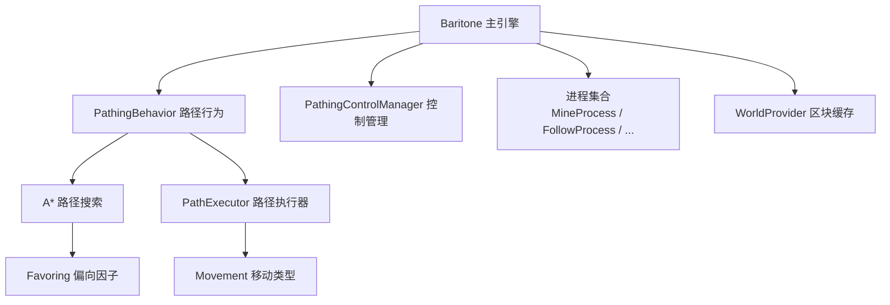
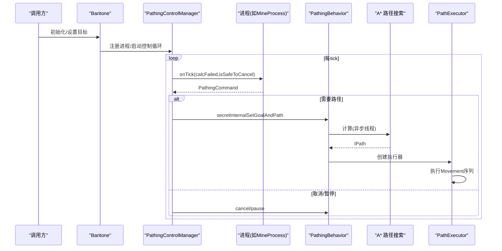
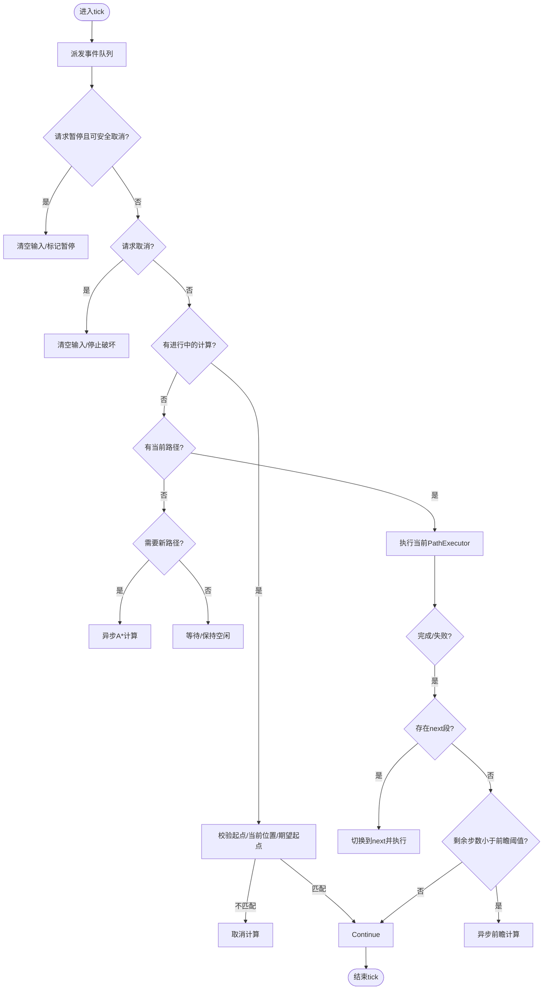
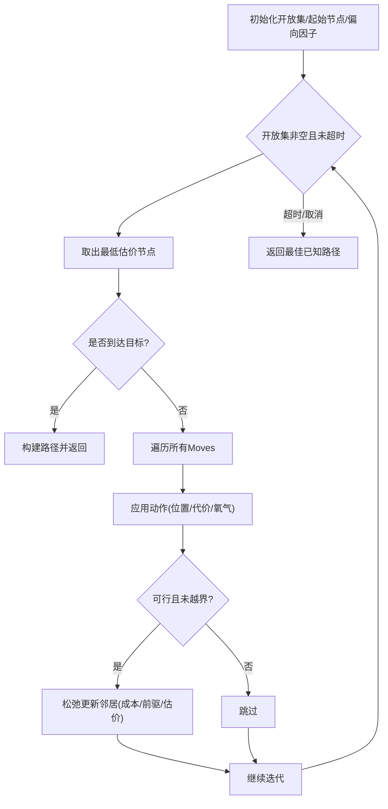
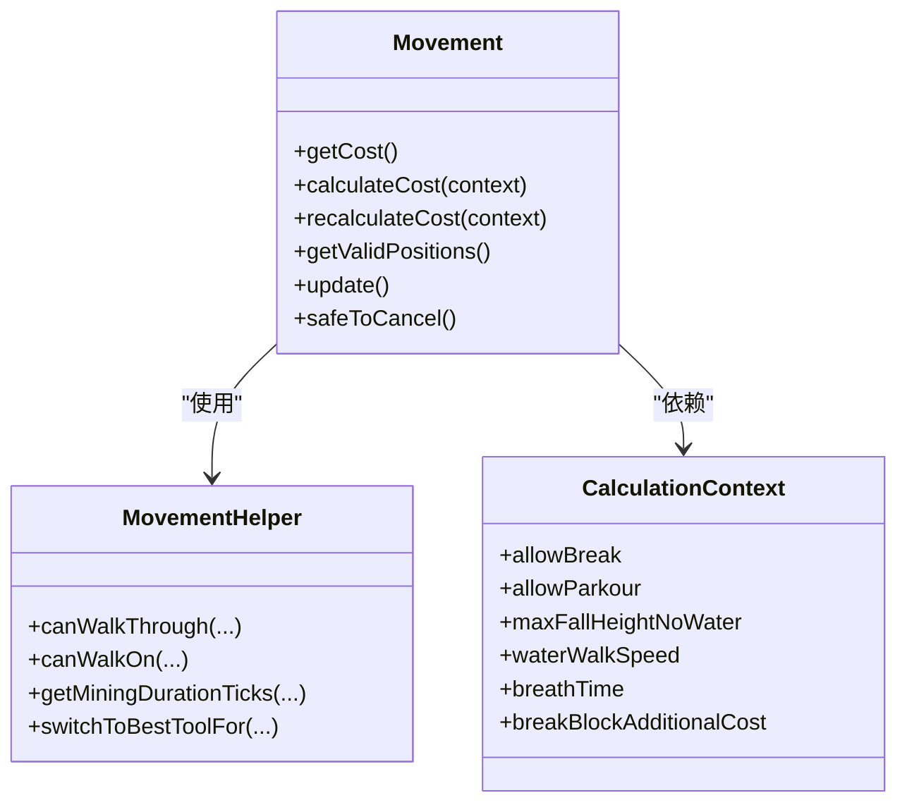
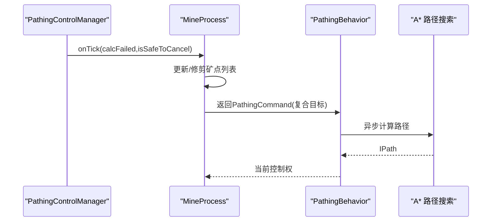
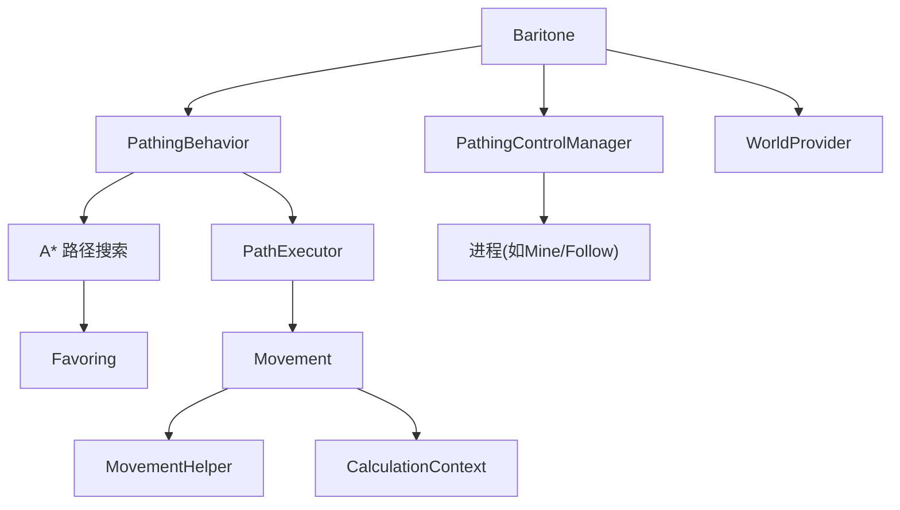

# 路径规划引擎模块

<cite>
**本文引用的文件**
- [Baritone.java](file://src/main/java/baritone/Baritone.java)
- [PathingBehavior.java](file://src/main/java/baritone/behavior/PathingBehavior.java)
- [CustomGoalProcess.java](file://src/main/java/baritone/process/CustomGoalProcess.java)
- [PathExecutor.java](file://src/main/java/baritone/pathing/path/PathExecutor.java)
- [AStarPathFinder.java](file://src/main/java/baritone/pathing/calc/AStarPathFinder.java)
- [CalculationContext.java](file://src/main/java/baritone/pathing/movement/CalculationContext.java)
- [Movement.java](file://src/main/java/baritone/pathing/movement/Movement.java)
- [MovementHelper.java](file://src/main/java/baritone/pathing/movement/MovementHelper.java)
- [PathingControlManager.java](file://src/main/java/baritone/utils/PathingControlManager.java)
- [Favoring.java](file://src/main/java/baritone/utils/pathing/Favoring.java)
- [MineProcess.java](file://src/main/java/baritone/process/MineProcess.java)
- [FollowProcess.java](file://src/main/java/baritone/process/FollowProcess.java)
- [WorldProvider.java](file://src/main/java/baritone/cache/WorldProvider.java)
- [BaritoneProcessHelper.java](file://src/main/java/baritone/utils/BaritoneProcessHelper.java)
</cite>

## 目录
1. [简介](#简介)
2. [项目结构](#项目结构)
3. [核心组件](#核心组件)
4. [架构总览](#架构总览)
5. [详细组件分析](#详细组件分析)
6. [依赖关系分析](#依赖关系分析)
7. [性能考量](#性能考量)
8. [故障排查指南](#故障排查指南)
9. [结论](#结论)
10. [附录](#附录)

## 简介
本文件面向路径规划引擎模块，聚焦于baritone包作为Minecraft路径规划核心引擎的架构与实现。内容涵盖：
- Baritone主引擎初始化流程
- PathingBehavior路径行为管理器功能与工作流
- CustomGoalProcess自定义目标处理机制
- A*寻路算法实现细节
- Movement移动类型分类与权重系统
- PathExecutor路径执行器工作原理
- 进程系统（MineProcess、FollowProcess等）设计模式与应用
- 性能优化策略、异步路径计算机制、区块缓存系统等关键技术

## 项目结构
baritone包采用分层与职责分离的组织方式：
- 核心入口：Baritone负责装配各子系统并对外暴露统一接口
- 行为层：PathingBehavior、InventoryBehavior、LookBehavior、MemoryBehavior等
- 控制层：PathingControlManager协调多个进程（Process）与路径行为
- 寻路层：A*路径搜索、启发式与代价计算
- 执行层：PathExecutor驱动Movement序列执行
- 进程层：MineProcess、FollowProcess等具体任务进程
- 工具与上下文：CalculationContext、MovementHelper、Favoring、WorldProvider等

图表来源
- [Baritone.java:58-79](file://src/main/java/baritone/Baritone.java#L58-L79)
- [PathingBehavior.java:48-50](file://src/main/java/baritone/behavior/PathingBehavior.java#L48-L50)
- [PathingControlManager.java:29-39](file://src/main/java/baritone/utils/PathingControlManager.java#L29-L39)
- [AStarPathFinder.java:20-24](file://src/main/java/baritone/pathing/calc/AStarPathFinder.java#L20-L24)
- [PathExecutor.java:57-62](file://src/main/java/baritone/pathing/path/PathExecutor.java#L57-L62)
- [Movement.java:25-50](file://src/main/java/baritone/pathing/movement/Movement.java#L25-L50)
- [Favoring.java:10-29](file://src/main/java/baritone/utils/pathing/Favoring.java#L10-L29)
- [WorldProvider.java:6-16](file://src/main/java/baritone/cache/WorldProvider.java#L6-L16)

章节来源
- [Baritone.java:58-79](file://src/main/java/baritone/Baritone.java#L58-L79)
- [PathingControlManager.java:21-39](file://src/main/java/baritone/utils/PathingControlManager.java#L21-L39)

## 核心组件
- Baritone主引擎：负责装配设置、事件处理器、行为组件、进程注册、命令系统与世界提供者
- PathingBehavior：路径行为中枢，协调目标设定、路径计算、执行与拼接、暂停与取消
- PathingControlManager：进程调度器，按优先级选择当前控制进程并下发PathingCommand
- A*路径搜索器：基于启发式与代价的图搜索，支持动态X/Z移动、氧气代价、世界边界约束
- PathExecutor：路径执行器，逐段驱动Movement序列，具备回溯检测、超时与越界处理
- Movement与MovementHelper：移动抽象与工具集，定义移动代价、可达性、放置/破坏逻辑
- CalculationContext：寻路上下文，封装实体尺寸、工具、水桶、跳跃/下潜限制、氧气消耗等
- Favoring：对回溯路径与避让区域进行加权/偏向调整
- 进程系统：如MineProcess（挖矿）、FollowProcess（跟随）等，以进程形式参与控制循环

章节来源
- [Baritone.java:34-187](file://src/main/java/baritone/Baritone.java#L34-L187)
- [PathingBehavior.java:29-526](file://src/main/java/baritone/behavior/PathingBehavior.java#L29-L526)
- [PathingControlManager.java:21-200](file://src/main/java/baritone/utils/PathingControlManager.java#L21-L200)
- [AStarPathFinder.java:16-168](file://src/main/java/baritone/pathing/calc/AStarPathFinder.java#L16-L168)
- [PathExecutor.java:38-632](file://src/main/java/baritone/pathing/path/PathExecutor.java#L38-L632)
- [Movement.java:25-276](file://src/main/java/baritone/pathing/movement/Movement.java#L25-L276)
- [MovementHelper.java:64-517](file://src/main/java/baritone/pathing/movement/MovementHelper.java#L64-L517)
- [CalculationContext.java:29-197](file://src/main/java/baritone/pathing/movement/CalculationContext.java#L29-L197)
- [Favoring.java:10-39](file://src/main/java/baritone/utils/pathing/Favoring.java#L10-L39)
- [MineProcess.java:47-447](file://src/main/java/baritone/process/MineProcess.java#L47-447)
- [FollowProcess.java:18-97](file://src/main/java/baritone/process/FollowProcess.java#L18-97)
- [WorldProvider.java:6-17](file://src/main/java/baritone/cache/WorldProvider.java#L6-L17)
- [BaritoneProcessHelper.java:9-35](file://src/main/java/baritone/utils/BaritoneProcessHelper.java#L9-L35)

## 架构总览
下图展示从Baritone到路径执行的关键交互：

图表来源
- [Baritone.java:58-79](file://src/main/java/baritone/Baritone.java#L58-L79)
- [PathingControlManager.java:71-114](file://src/main/java/baritone/utils/PathingControlManager.java#L71-L114)
- [PathingBehavior.java:404-502](file://src/main/java/baritone/behavior/PathingBehavior.java#L404-L502)
- [AStarPathFinder.java:27-84](file://src/main/java/baritone/pathing/calc/AStarPathFinder.java#L27-L84)
- [PathExecutor.java:68-224](file://src/main/java/baritone/pathing/path/PathExecutor.java#L68-L224)

## 详细组件分析

### Baritone主引擎初始化流程
- 设置与上下文：构造Settings、EntityContext、GameEventHandler
- 行为组件：PathingBehavior、LookBehavior、MemoryBehavior、InventoryBehavior、InputOverrideHandler
- 进程注册：PathingControlManager注册Follow、Mine、CustomGoal、GetToBlock、Builder、Explore、Backfill、Farm、Fishing等进程
- 命令系统：BaritoneCommandManager与默认控制命令
- 提供世界数据：通过WorldProvider绑定当前维度的WorldData

章节来源
- [Baritone.java:58-79](file://src/main/java/baritone/Baritone.java#L58-L79)
- [WorldProvider.java:6-16](file://src/main/java/baritone/cache/WorldProvider.java#L6-L16)

### PathingBehavior路径行为管理器
- 目标与上下文：持有Goal、CalculationContext、当前/下一路径段
- 生命周期：每tick派发事件、检查暂停/取消、维护安全取消标志、估计剩余时间
- 路径计算：在独立线程中执行A*，支持“当前段+前瞻段”两段规划；丢弃不匹配起点的孤儿段
- 执行与拼接：PathExecutor.onTick返回状态，支持提前拼接到next段或切片裁剪历史
- 事件与日志：通过队列分发CALC_STARTED/CALC_FINISHED等事件，记录节点数与耗时

图表来源
- [PathingBehavior.java:67-193](file://src/main/java/baritone/behavior/PathingBehavior.java#L67-L193)
- [PathingBehavior.java:404-502](file://src/main/java/baritone/behavior/PathingBehavior.java#L404-L502)

章节来源
- [PathingBehavior.java:29-526](file://src/main/java/baritone/behavior/PathingBehavior.java#L29-L526)

### CustomGoalProcess自定义目标处理机制
- 状态机：NONE → GOAL_SET → PATH_REQUESTED → EXECUTING
- 行为：根据状态返回不同PathingCommand类型，驱动PathingBehavior设定/重验证目标与路径
- 完成条件：到达目标或设置取消命令；支持桌面通知与断开连接

章节来源
- [CustomGoalProcess.java:11-98](file://src/main/java/baritone/process/CustomGoalProcess.java#L11-L98)

### A*寻路算法实现细节
- 启动节点：设置初始成本与氧气代价，插入开放集
- 主循环：按启发式+代价最小弹出节点，遍历所有Moves生成邻居
- 代价与约束：动作代价、氧气消耗、世界边界、动态/静态X/Z移动、是否加载区块
- 偏向因子：Favoring对回溯路径与避让区域进行系数加权
- 超时与回退：慢路径模式、失败/主超时控制、记录最佳已知解

图表来源
- [AStarPathFinder.java:27-166](file://src/main/java/baritone/pathing/calc/AStarPathFinder.java#L27-L166)
- [Favoring.java:10-39](file://src/main/java/baritone/utils/pathing/Favoring.java#L10-L39)

章节来源
- [AStarPathFinder.java:16-168](file://src/main/java/baritone/pathing/calc/AStarPathFinder.java#L16-L168)
- [Favoring.java:10-39](file://src/main/java/baritone/utils/pathing/Favoring.java#L10-L39)

### Movement移动类型与权重系统
- 抽象基类：Movement定义src/dest、有效位置集合、代价缓存、破坏/放置/行走列表缓存
- 代价计算：getCost/calculateCost/recalculateCost，支持override覆盖
- 可达性与工具：MovementHelper提供canWalkThrough/canWalkOn/canPlaceAgainst、挖掘耗时、切换最优工具
- 执行状态：PREPPING/WAITING/RUNNING/SUCCESS/FAILED/UNREACHABLE，由Movement.update驱动
- 上下文影响：CalculationContext提供跳跃惩罚、步行/游泳速度、最大跌落高度、氧气消耗等

图表来源
- [Movement.java:25-276](file://src/main/java/baritone/pathing/movement/Movement.java#L25-L276)
- [MovementHelper.java:64-517](file://src/main/java/baritone/pathing/movement/MovementHelper.java#L64-L517)
- [CalculationContext.java:29-197](file://src/main/java/baritone/pathing/movement/CalculationContext.java#L29-L197)

章节来源
- [Movement.java:25-276](file://src/main/java/baritone/pathing/movement/Movement.java#L25-L276)
- [MovementHelper.java:64-517](file://src/main/java/baritone/pathing/movement/MovementHelper.java#L64-L517)
- [CalculationContext.java:29-197](file://src/main/java/baritone/pathing/movement/CalculationContext.java#L29-L197)

### PathExecutor路径执行器工作原理
- 位置推进：按movements顺序执行，若偏离路径则尝试跳步至最近有效位置
- 越界与回溯检测：距离阈值与持续时间阈值触发取消；对未来移动进行代价验证
- 加载区保护：目的地不在已加载区块边缘时才继续
- 成功/失败/不可达：根据Movement状态推进或取消
- 拼接与裁剪：trySplice与cutIfTooLong避免历史过长导致内存压力

章节来源
- [PathExecutor.java:38-632](file://src/main/java/baritone/pathing/path/PathExecutor.java#L38-L632)

### 进程系统设计模式与应用
- 设计模式：进程继承BaritoneProcessHelper，实现IBaritoneProcess接口，通过PathingControlManager统一调度
- MineProcess：维护矿石位置列表、黑名单、掉落物预期、合法挖矿模式；周期性扫描世界缓存与实时扫描
- FollowProcess：根据过滤器扫描实体，合成复合目标（GoalComposite），围绕跟随目标移动

图表来源
- [MineProcess.java:68-221](file://src/main/java/baritone/process/MineProcess.java#L68-L221)
- [PathingControlManager.java:159-194](file://src/main/java/baritone/utils/PathingControlManager.java#L159-L194)

章节来源
- [MineProcess.java:47-447](file://src/main/java/baritone/process/MineProcess.java#L47-L447)
- [FollowProcess.java:18-97](file://src/main/java/baritone/process/FollowProcess.java#L18-L97)
- [BaritoneProcessHelper.java:9-35](file://src/main/java/baritone/utils/BaritoneProcessHelper.java#L9-L35)

## 依赖关系分析

图表来源
- [Baritone.java:58-79](file://src/main/java/baritone/Baritone.java#L58-L79)
- [PathingBehavior.java:48-50](file://src/main/java/baritone/behavior/PathingBehavior.java#L48-L50)
- [PathingControlManager.java:21-39](file://src/main/java/baritone/utils/PathingControlManager.java#L21-L39)
- [AStarPathFinder.java:20-24](file://src/main/java/baritone/pathing/calc/AStarPathFinder.java#L20-L24)
- [PathExecutor.java:57-62](file://src/main/java/baritone/pathing/path/PathExecutor.java#L57-L62)
- [Movement.java:25-50](file://src/main/java/baritone/pathing/movement/Movement.java#L25-L50)
- [MovementHelper.java:64](file://src/main/java/baritone/pathing/movement/MovementHelper.java#L64)
- [CalculationContext.java:29](file://src/main/java/baritone/pathing/movement/CalculationContext.java#L29)
- [Favoring.java:10](file://src/main/java/baritone/utils/pathing/Favoring.java#L10)
- [WorldProvider.java:6](file://src/main/java/baritone/cache/WorldProvider.java#L6)

章节来源
- [PathingControlManager.java:21-200](file://src/main/java/baritone/utils/PathingControlManager.java#L21-L200)
- [PathingBehavior.java:29-526](file://src/main/java/baritone/behavior/PathingBehavior.java#L29-L526)

## 性能考量
- 异步路径计算：PathingBehavior在独立线程中执行A*，避免阻塞主循环；通过队列分发事件
- 分段规划与拼接：当前段接近终点时提前计算next段，减少停顿；支持拼接与裁剪历史避免内存膨胀
- 代价验证与回溯：对未来的高代价移动进行验证，必要时取消；对回溯路径施加偏向系数
- 超时与慢路径：支持慢路径模式与不同阶段的超时阈值，平衡精度与实时性
- 区块加载与边界：动态X/Z移动仅在相邻区块已加载时生效；世界边界与最大加载边界限制搜索范围
- 工具与氧气：自动切换工具、考虑氧气消耗与最大跌落高度，减少无效尝试

[本节为通用指导，无需特定文件引用]

## 故障排查指南
- 路径无法找到/频繁失败
  - 检查CalculationContext配置（允许破坏、游泳、跳跃、下潜等）
  - 查看PathingBehavior事件队列与日志输出
  - 关注PathExecutor的“越界/超时/不可达/失败”分支
- 路径执行中断
  - 确认Movement.safeToCancel与当前段代价变化
  - 检查目的地是否处于未加载区块边缘
- 进程冲突
  - PathingControlManager会清理非临时进程的控制权转移，确保进程返回非DEFER命令
- 进程丢失控制
  - CustomGoalProcess/进程在目标达成或失败后调用onLostControl重置状态

章节来源
- [PathingBehavior.java:52-64](file://src/main/java/baritone/behavior/PathingBehavior.java#L52-L64)
- [PathExecutor.java:178-224](file://src/main/java/baritone/pathing/path/PathExecutor.java#L178-L224)
- [PathingControlManager.java:174-190](file://src/main/java/baritone/utils/PathingControlManager.java#L174-L190)
- [CustomGoalProcess.java:81-84](file://src/main/java/baritone/process/CustomGoalProcess.java#L81-L84)

## 结论
baritone路径规划引擎通过清晰的分层与职责划分，实现了从目标设定、A*异步计算、路径执行到进程调度的完整闭环。其关键优势包括：
- 异步路径计算与分段拼接，提升响应性与鲁棒性
- 丰富的Movement与CalculationContext配置，适配复杂地形与规则
- 进程系统与控制管理器协同，支持多任务并发与优先级调度
- 偏向因子与代价验证机制，兼顾效率与安全性

[本节为总结，无需特定文件引用]

## 附录
- 关键API与扩展点
  - IBaritone、IPathingBehavior、IBaritoneProcess、IPath、IMovement
  - Settings与AltoClefSettings扩展配置项
- 常见问题定位清单
  - 超时/失败事件日志
  - 未加载区块导致的提前暂停
  - 回溯代价过高触发的取消
  - 进程返回null或DEFER导致的异常

[本节为补充信息，无需特定文件引用]