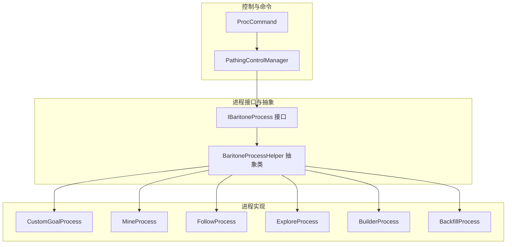
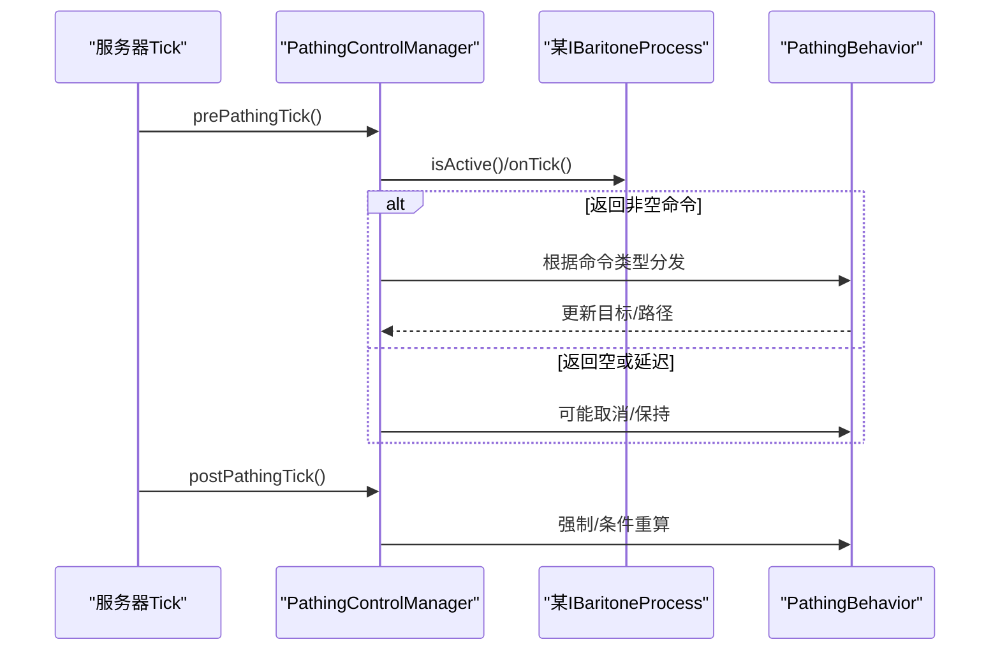
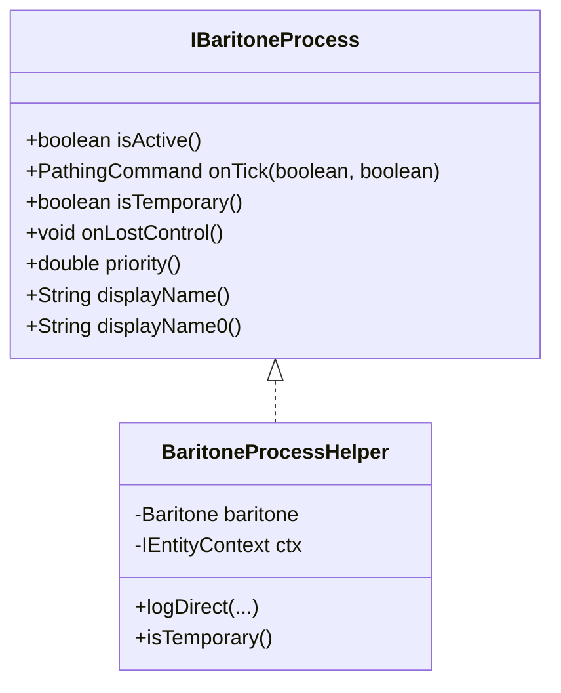
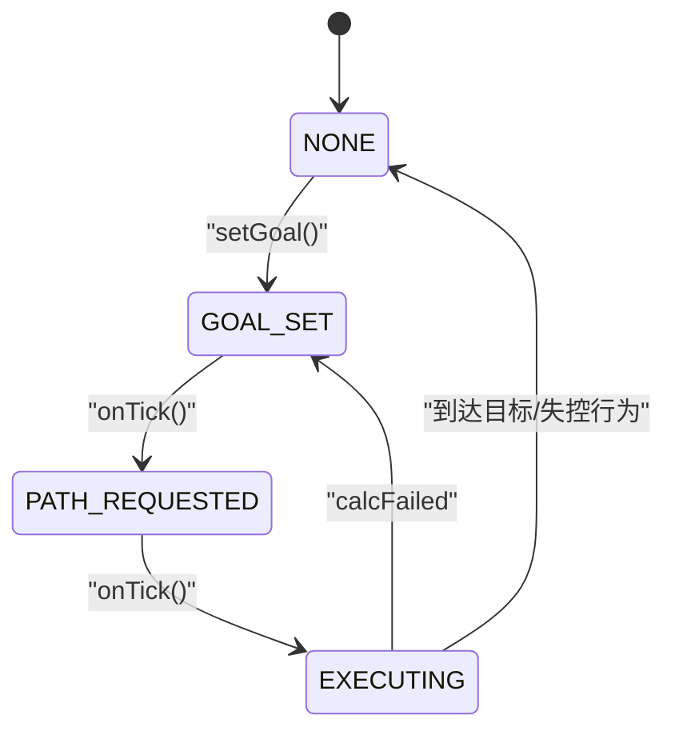
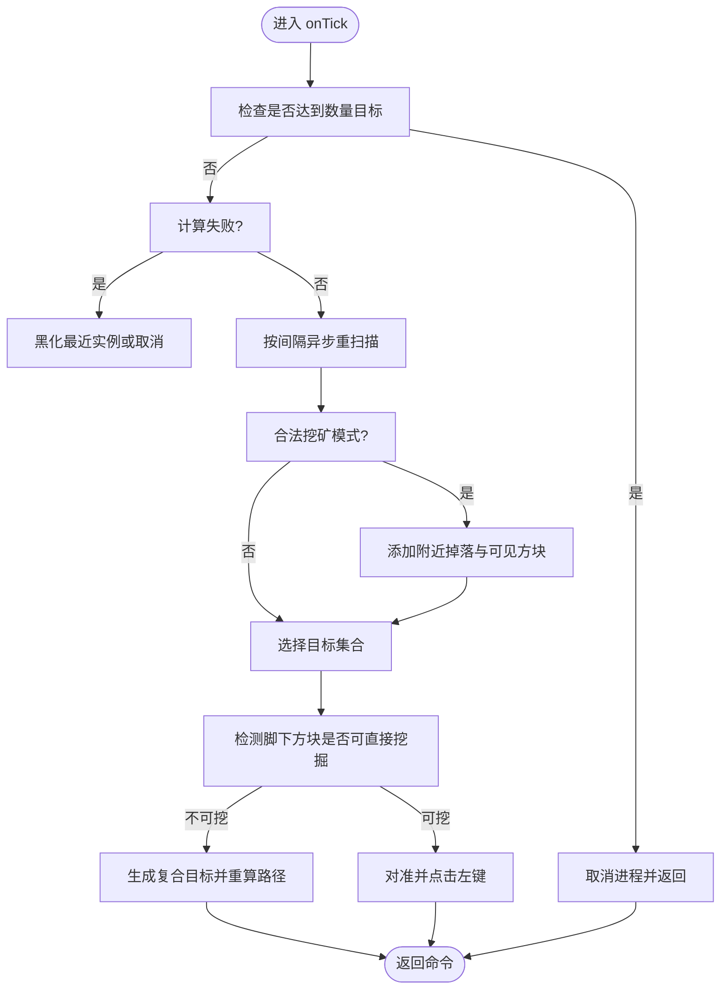
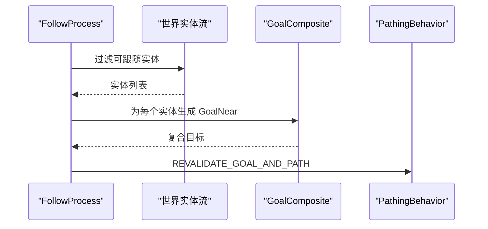
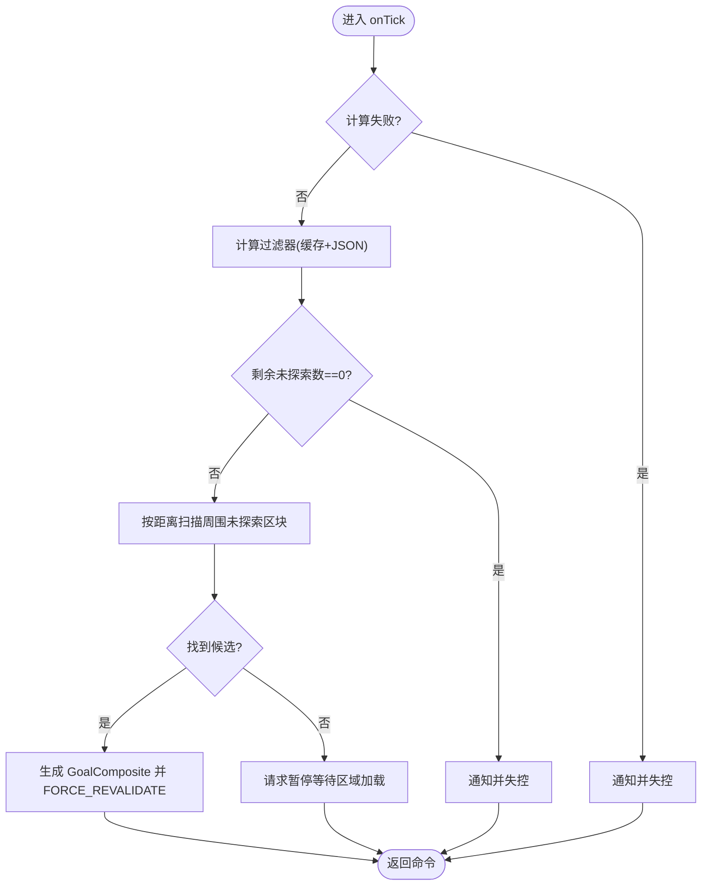
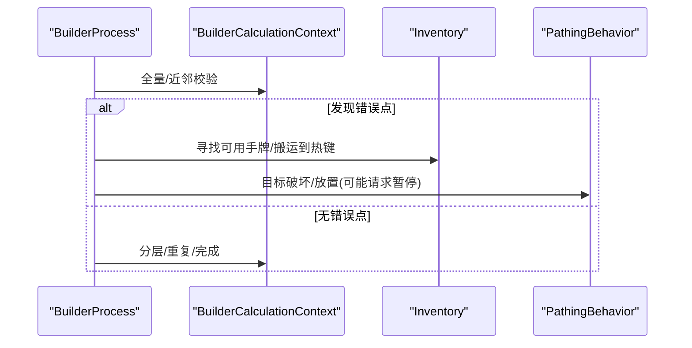
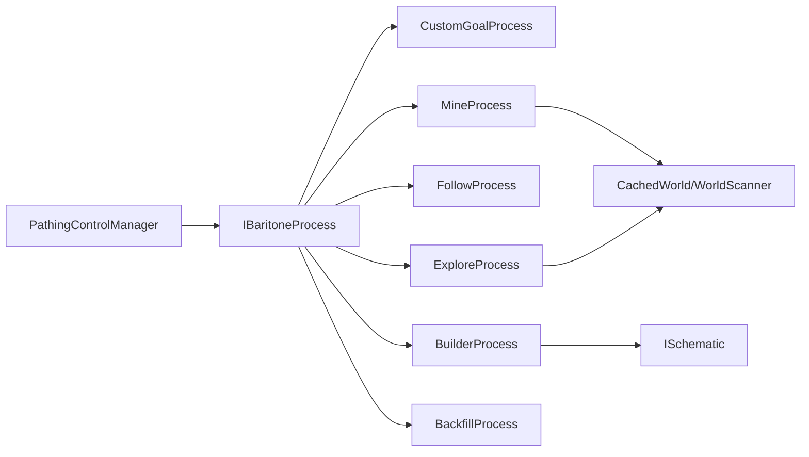

# 进程系统

<cite>
**本文引用的文件列表**
- [IBaritoneProcess.java](file://src/main/java/baritone/api/process/IBaritoneProcess.java)
- [BaritoneProcessHelper.java](file://src/main/java/baritone/utils/BaritoneProcessHelper.java)
- [PathingControlManager.java](file://src/main/java/baritone/utils/PathingControlManager.java)
- [CustomGoalProcess.java](file://src/main/java/baritone/process/CustomGoalProcess.java)
- [MineProcess.java](file://src/main/java/baritone/process/MineProcess.java)
- [FollowProcess.java](file://src/main/java/baritone/process/FollowProcess.java)
- [ExploreProcess.java](file://src/main/java/baritone/process/ExploreProcess.java)
- [BuilderProcess.java](file://src/main/java/baritone/process/BuilderProcess.java)
- [BackfillProcess.java](file://src/main/java/baritone/process/BackfillProcess.java)
- [ProcCommand.java](file://src/main/java/baritone/command/defaults/ProcCommand.java)
</cite>

## 目录
1. [简介](#简介)
2. [项目结构](#项目结构)
3. [核心组件](#核心组件)
4. [架构总览](#架构总览)
5. [详细组件分析](#详细组件分析)
6. [依赖关系分析](#依赖关系分析)
7. [性能与复杂度](#性能与复杂度)
8. [故障排查指南](#故障排查指南)
9. [结论](#结论)
10. [附录：扩展开发指南](#附录扩展开发指南)

## 简介
本文件系统性梳理了进程系统（Process System）的设计与实现，围绕以下主题展开：
- IBaritoneProcess 接口的设计理念与生命周期、状态转换、优先级管理
- 自定义目标进程 CustomGoalProcess 的目标类型、评估与执行策略
- 矿物采集进程 MineProcess 的方块选择、挖掘顺序与安全检查
- 跟随进程 FollowProcess 的行为模式与路径规划策略
- 探索进程 ExploreProcess 的覆盖算法与边界处理机制
- 建造进程 BuilderProcess 的结构规划与执行流程
- 提供扩展开发指南与自定义进程实现示例

## 项目结构
进程系统位于 baritone/process 与 baritone/api/process 下，配合路径控制管理器与基础抽象类共同工作：
- 接口层：IBaritoneProcess 定义进程契约
- 抽象层：BaritoneProcessHelper 提供通用上下文与日志能力
- 控制层：PathingControlManager 负责进程注册、优先级排序与命令分发
- 具体进程：CustomGoalProcess、MineProcess、FollowProcess、ExploreProcess、BuilderProcess 等

图表来源
- [IBaritoneProcess.java:1-24](file://src/main/java/baritone/api/process/IBaritoneProcess.java#L1-L24)
- [BaritoneProcessHelper.java:1-34](file://src/main/java/baritone/utils/BaritoneProcessHelper.java#L1-L34)
- [PathingControlManager.java:1-200](file://src/main/java/baritone/utils/PathingControlManager.java#L1-L200)
- [CustomGoalProcess.java:1-98](file://src/main/java/baritone/process/CustomGoalProcess.java#L1-L98)
- [MineProcess.java:1-447](file://src/main/java/baritone/process/MineProcess.java#L1-L447)
- [FollowProcess.java:1-97](file://src/main/java/baritone/process/FollowProcess.java#L1-L97)
- [ExploreProcess.java:1-274](file://src/main/java/baritone/process/ExploreProcess.java#L1-L274)
- [BuilderProcess.java:1-917](file://src/main/java/baritone/process/BuilderProcess.java#L1-L917)
- [BackfillProcess.java:1-131](file://src/main/java/baritone/process/BackfillProcess.java#L1-L131)
- [ProcCommand.java:1-64](file://src/main/java/baritone/command/defaults/ProcCommand.java#L1-L64)

章节来源
- [IBaritoneProcess.java:1-24](file://src/main/java/baritone/api/process/IBaritoneProcess.java#L1-L24)
- [BaritoneProcessHelper.java:1-34](file://src/main/java/baritone/utils/BaritoneProcessHelper.java#L1-L34)
- [PathingControlManager.java:1-200](file://src/main/java/baritone/utils/PathingControlManager.java#L1-L200)

## 核心组件
- IBaritoneProcess：定义进程的生命周期方法、优先级、显示名与临时性标记
- BaritoneProcessHelper：继承 IBaritoneProcess，提供实体上下文、日志输出与通用能力
- PathingControlManager：维护进程集合、按优先级排序、在每tick选择“在控”进程并下发 PathingCommand

关键点
- 生命周期：isActive → onTick → onLostControl
- 优先级：priority() 决定进程竞争权；默认 -1，具体进程可覆盖
- 临时性：isTemporary() 用于低优先级或短时进程（如暂停控制）
- 命令类型：由 onTick 返回的 PathingCommand 指示下一步行为（请求暂停、取消并设目标、强制重算、重算并设路径、设目标并路径）

章节来源
- [IBaritoneProcess.java:1-24](file://src/main/java/baritone/api/process/IBaritoneProcess.java#L1-L24)
- [BaritoneProcessHelper.java:1-34](file://src/main/java/baritone/utils/BaritoneProcessHelper.java#L1-L34)
- [PathingControlManager.java:159-194](file://src/main/java/baritone/utils/PathingControlManager.java#L159-L194)

## 架构总览
进程系统通过 PathingControlManager 统一调度多个 IBaritoneProcess 实现。每个进程在每tick根据自身状态与外部条件返回 PathingCommand，控制器据此更新 PathingBehavior 的目标与路径。

图表来源
- [PathingControlManager.java:71-135](file://src/main/java/baritone/utils/PathingControlManager.java#L71-L135)

章节来源
- [PathingControlManager.java:71-135](file://src/main/java/baritone/utils/PathingControlManager.java#L71-L135)

## 详细组件分析

### IBaritoneProcess 接口与 BaritoneProcessHelper 抽象类
- 设计要点
  - 生命周期：isActive/onTick/onLostControl
  - 显示名：displayName() 默认基于 isActive，内部使用 displayName0()
  - 优先级：priority() 默认 -1，子类可覆盖
  - 临时性：isTemporary() 用于短时或高优先级抢占
- BaritoneProcessHelper
  - 持有 Baritone 与 IEntityContext
  - 提供日志输出与通用能力，简化进程实现

图表来源
- [IBaritoneProcess.java:1-24](file://src/main/java/baritone/api/process/IBaritoneProcess.java#L1-L24)
- [BaritoneProcessHelper.java:1-34](file://src/main/java/baritone/utils/BaritoneProcessHelper.java#L1-L34)

章节来源
- [IBaritoneProcess.java:1-24](file://src/main/java/baritone/api/process/IBaritoneProcess.java#L1-L24)
- [BaritoneProcessHelper.java:1-34](file://src/main/java/baritone/utils/BaritoneProcessHelper.java#L1-L34)

### CustomGoalProcess 自定义目标处理
- 目标类型
  - 使用 Goal 表达目标区域/位置
- 状态机
  - NONE → GOAL_SET → PATH_REQUESTED → EXECUTING
  - 在 GOAL_SET 时请求“取消并设目标”
  - 在 PATH_REQUESTED 时请求“强制重算目标与路径”，进入 EXECUTING
  - EXECUTING 中若计算失败则失控行为；到达目标后可断开连接与通知
- 执行策略
  - 根据状态返回不同 PathingCommandType
  - 到达目标后清理状态

图表来源
- [CustomGoalProcess.java:47-78](file://src/main/java/baritone/process/CustomGoalProcess.java#L47-L78)

章节来源
- [CustomGoalProcess.java:1-98](file://src/main/java/baritone/process/CustomGoalProcess.java#L1-L98)

### MineProcess 矿物采集进程
- 方块选择
  - 支持缓存扫描 CachedWorld 与世界扫描 WorldScanner
  - drop 物品拾取点参与合并，避免重复
  - 黑名单 blacklist 与“已掉落但未刷新”的预期掉落时间窗口
- 挖掘顺序
  - 优先暴露矿石（可选），按距离排序
  - 支持“垂直竖井”与“两格目标”等目标形式
  - 合理剪枝：不在加载区块内且未被观察到的点会被剔除
- 安全检查
  - 非法目标（如基岩层）过滤
  - 工具切换、视线对准、安全取消标志
  - 失败时可黑化最近不可达实例或直接取消
- 任务完成
  - 达成数量目标后取消
  - 可选“合法挖矿”模式下在固定 Y 层附近游走

图表来源
- [MineProcess.java:68-148](file://src/main/java/baritone/process/MineProcess.java#L68-L148)
- [MineProcess.java:177-221](file://src/main/java/baritone/process/MineProcess.java#L177-L221)
- [MineProcess.java:223-241](file://src/main/java/baritone/process/MineProcess.java#L223-L241)
- [MineProcess.java:272-287](file://src/main/java/baritone/process/MineProcess.java#L272-L287)
- [MineProcess.java:343-369](file://src/main/java/baritone/process/MineProcess.java#L343-L369)

章节来源
- [MineProcess.java:1-447](file://src/main/java/baritone/process/MineProcess.java#L1-L447)

### FollowProcess 跟随进程
- 行为模式
  - 从世界实体流中筛选可跟随实体（存活、非自身、存在）
  - 支持偏移方向与半径，生成 GoalNear
- 路径规划
  - 每tick重新扫描并构建 GoalComposite
  - 依据设置决定是否使用偏移坐标

图表来源
- [FollowProcess.java:27-31](file://src/main/java/baritone/process/FollowProcess.java#L27-L31)
- [FollowProcess.java:33-45](file://src/main/java/baritone/process/FollowProcess.java#L33-L45)

章节来源
- [FollowProcess.java:1-97](file://src/main/java/baritone/process/FollowProcess.java#L1-L97)

### ExploreProcess 探索进程
- 覆盖算法
  - 以中心点为中心，按曼哈顿距离向外扩展
  - 优先选择“未知”区域，结合 Json 过滤器与缓存过滤
  - 分批生成 GoalXZ 并用 GoalComposite 聚合
- 边界处理
  - 若全部已探索或失败，结束
  - 未加载区域等待磁盘加载，请求暂停
- 维护 Y 层
  - 可选维持固定 Y 层，通过 GoalYLevel 调整启发式

图表来源
- [ExploreProcess.java:63-92](file://src/main/java/baritone/process/ExploreProcess.java#L63-L92)
- [ExploreProcess.java:94-155](file://src/main/java/baritone/process/ExploreProcess.java#L94-L155)
- [ExploreProcess.java:157-164](file://src/main/java/baritone/process/ExploreProcess.java#L157-L164)

章节来源
- [ExploreProcess.java:1-274](file://src/main/java/baritone/process/ExploreProcess.java#L1-L274)

### BuilderProcess 建造进程
- 结构规划
  - 以 ISchematic 为蓝图，origin 为起点，支持分层与重复构建
  - 通过 BuilderCalculationContext 计算期望状态与当前状态差异
- 执行流程
  - 递归校验：先全量校验，再局部近邻校验
  - 优先破坏不正确方块，再放置缺失方块
  - 智能寻找可放置面与朝向，射线检测与手牌验证
  - 可跳过失败层或暂停等待材料
- 安全与优化
  - 距离修剪，仅保留附近错误点
  - 允许忽略现有/空气/水等特殊规则
  - 与路径行为联动，必要时请求暂停

图表来源
- [BuilderProcess.java:339-523](file://src/main/java/baritone/process/BuilderProcess.java#L339-L523)
- [BuilderProcess.java:525-548](file://src/main/java/baritone/process/BuilderProcess.java#L525-L548)
- [BuilderProcess.java:609-664](file://src/main/java/baritone/process/BuilderProcess.java#L609-L664)

章节来源
- [BuilderProcess.java:1-917](file://src/main/java/baritone/process/BuilderProcess.java#L1-L917)

### BackfillProcess 短时填充进程
- 用途：在允许回填的前提下，自动填补当前移动路径上的空洞
- 优先级：较高（5.0），临时性
- 触发：当设置开启且不允许连跳时启用

章节来源
- [BackfillProcess.java:1-131](file://src/main/java/baritone/process/BackfillProcess.java#L1-L131)

## 依赖关系分析
- 进程注册与调度
  - PathingControlManager 维护所有进程，按 priority 降序选择在控进程
  - 每tick调用进程 onTick，根据返回命令更新 PathingBehavior
- 进程间耦合
  - 各进程相对独立，通过 PathingBehavior 的目标与路径进行解耦
  - BuilderProcess 与 Inventory/BlockStateInterface 等有较强耦合
- 外部依赖
  - 缓存系统 CachedWorld 与 WorldScanner 用于 Mine/Explore
  - 设置项影响行为（如 allowBreak、legitMine、buildInLayers 等）

图表来源
- [PathingControlManager.java:159-194](file://src/main/java/baritone/utils/PathingControlManager.java#L159-L194)
- [MineProcess.java:289-316](file://src/main/java/baritone/process/MineProcess.java#L289-L316)
- [ExploreProcess.java:181-195](file://src/main/java/baritone/process/ExploreProcess.java#L181-L195)
- [BuilderProcess.java:64-80](file://src/main/java/baritone/process/BuilderProcess.java#L64-L80)

章节来源
- [PathingControlManager.java:1-200](file://src/main/java/baritone/utils/PathingControlManager.java#L1-L200)
- [MineProcess.java:289-316](file://src/main/java/baritone/process/MineProcess.java#L289-L316)
- [ExploreProcess.java:181-195](file://src/main/java/baritone/process/ExploreProcess.java#L181-L195)
- [BuilderProcess.java:64-80](file://src/main/java/baritone/process/BuilderProcess.java#L64-L80)

## 性能与复杂度
- MineProcess
  - 世界扫描与缓存查询：复杂度与扫描半径、缓存命中率相关
  - 目标剪枝与排序：O(n log n)，n 为目标数量
  - 合理的 mineGoalUpdateInterval 与 ORE_LOCATIONS_COUNT 限制可显著降低开销
- ExploreProcess
  - 按曼哈顿距离扩展，复杂度与探索半径平方相关
  - Json/缓存过滤减少无效扫描
- BuilderProcess
  - 全量/近邻校验：O(V)，V 为错误点数量上限
  - 放置/破坏目标生成：与错误点规模线性相关
  - distanceTrim 与 incorrectSize 限制可控制复杂度
- PathingControlManager
  - 每tick对所有活跃进程排序与遍历，复杂度 O(k)，k 为活跃进程数

[本节为通用性能讨论，无需列出章节来源]

## 故障排查指南
- 进程无响应
  - 使用 proc 命令查看当前在控进程与最后命令
  - 检查进程是否返回 null 或 DEFER
- 计算失败
  - Explore/Mine/Builder 在 calcFailed 时会请求暂停或取消
  - 查看设置项 cancelOnGoalInvalidation 与 notificationOnExploreFinished 等
- 目标无法到达
  - CustomGoalProcess 在 EXECUTING 且计算失败时会失控行为
  - MineProcess 可能因 allowBreak=false 或黑名单过多导致失败
- 材料不足
  - BuilderProcess 在缺少材料时会暂停并记录缺失清单
- 路径冲突
  - 多进程竞争时，高优先级进程会取消低优先级进程的路径段

章节来源
- [ProcCommand.java:22-41](file://src/main/java/baritone/command/defaults/ProcCommand.java#L22-L41)
- [PathingControlManager.java:175-194](file://src/main/java/baritone/utils/PathingControlManager.java#L175-L194)
- [CustomGoalProcess.java:56-71](file://src/main/java/baritone/process/CustomGoalProcess.java#L56-L71)
- [MineProcess.java:80-98](file://src/main/java/baritone/process/MineProcess.java#L80-L98)
- [BuilderProcess.java:509-513](file://src/main/java/baritone/process/BuilderProcess.java#L509-L513)

## 结论
进程系统通过统一的接口与抽象类，结合 PathingControlManager 的调度，实现了模块化、可扩展的路径行为体系。各进程在职责清晰的前提下，通过 PathingCommand 与 PathingBehavior 解耦协作，既保证了灵活性，也便于调试与优化。

[本节为总结性内容，无需列出章节来源]

## 附录：扩展开发指南

### 自定义进程实现步骤
- 实现 IBaritoneProcess 或继承 BaritoneProcessHelper
- 在构造函数中调用父类构造，获取上下文
- 实现 isActive/onTick/onLostControl/displayName0
- 在 PathingControlManager 注册进程（通常由框架或命令负责）
- 在 onTick 中返回合适的 PathingCommandType

参考实现
- [BaritoneProcessHelper.java:1-34](file://src/main/java/baritone/utils/BaritoneProcessHelper.java#L1-L34)
- [IBaritoneProcess.java:1-24](file://src/main/java/baritone/api/process/IBaritoneProcess.java#L1-L24)

### 优先级与竞争
- 通过 priority() 返回数值，数值越高越容易成为在控进程
- 临时进程（isTemporary=true）可在非临时进程之上短暂抢占
- BackfillProcess 展示了高优先级与临时性的典型用法

章节来源
- [BackfillProcess.java:123-131](file://src/main/java/baritone/process/BackfillProcess.java#L123-L131)
- [PathingControlManager.java:170-171](file://src/main/java/baritone/utils/PathingControlManager.java#L170-L171)

### 常见问题与建议
- onTick 必须始终返回非空命令或显式 DEFER
- 对于需要持续执行的目标，尽量使用复合目标与重算命令
- 合理使用设置项（如 mineGoalUpdateInterval、buildInLayers、allowBreak 等）平衡性能与效果
- 在复杂场景下，考虑将进程拆分为多个阶段，使用状态机管理

[本节为实践建议，无需列出章节来源]