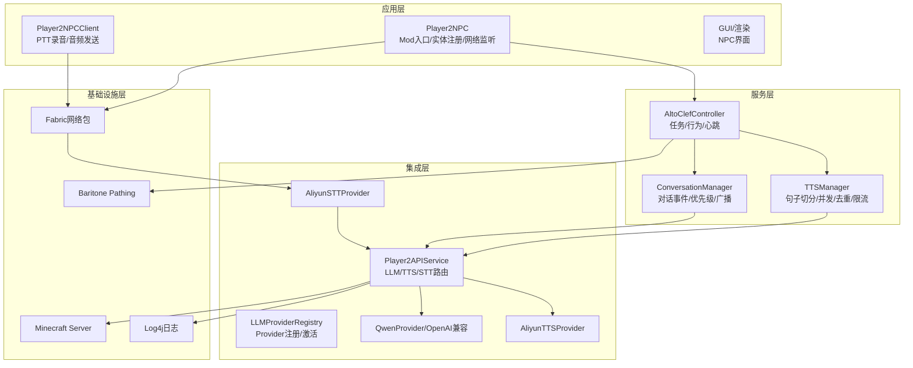
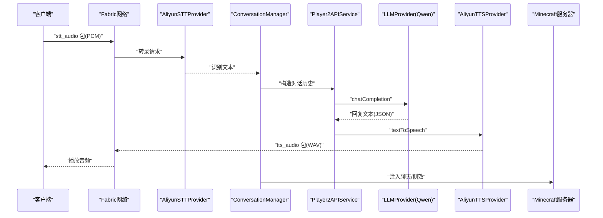
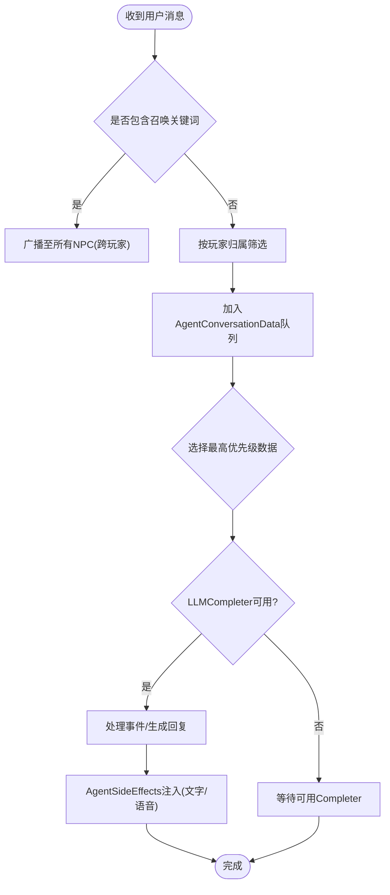
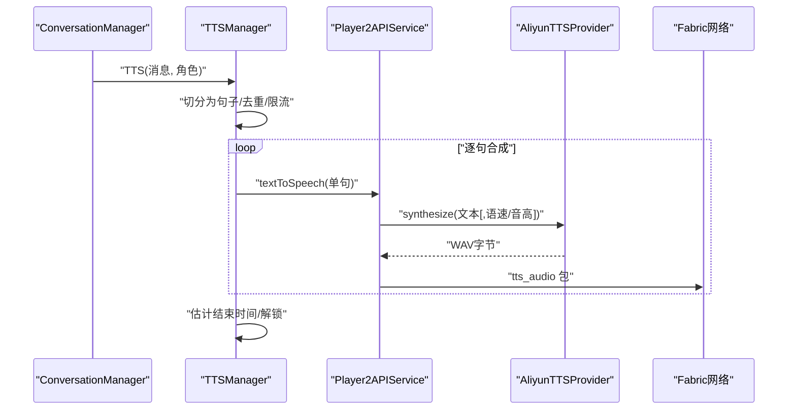
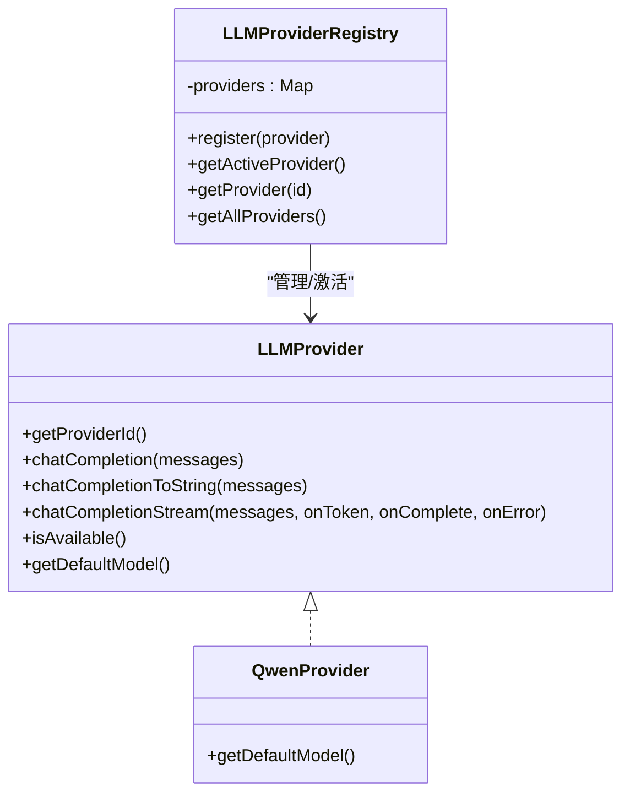
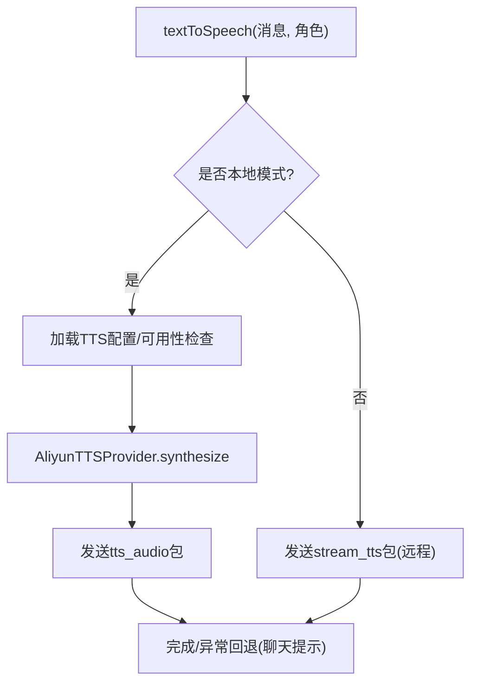
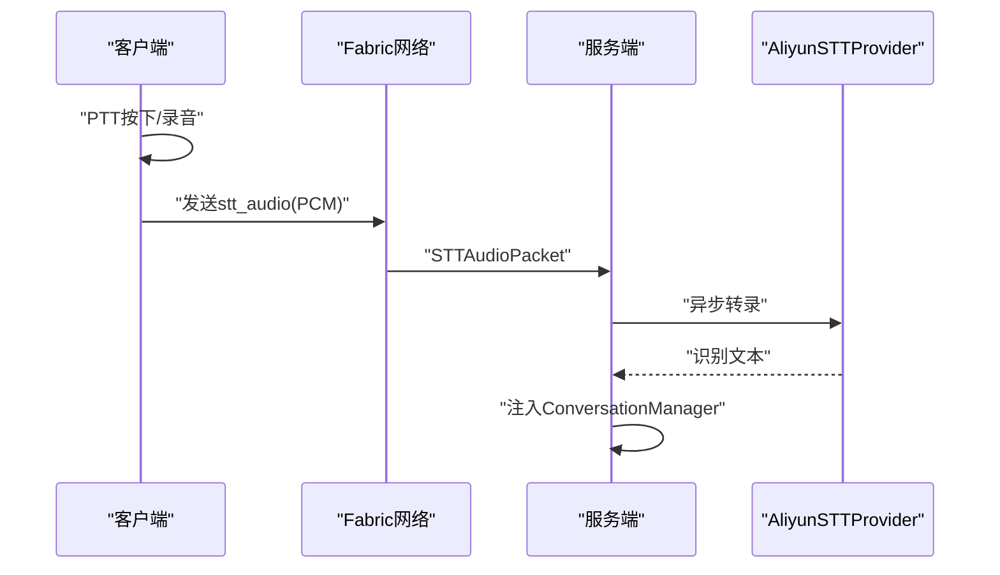
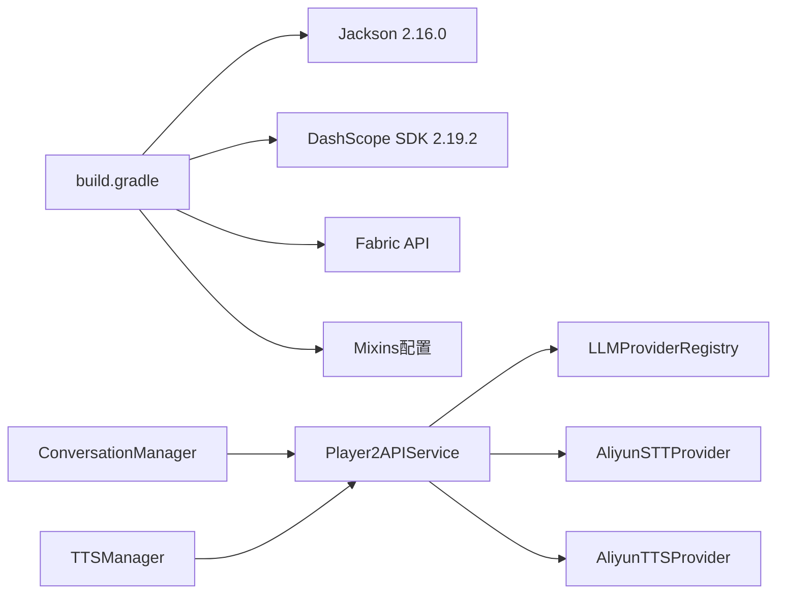

# 系统架构设计

<cite>
**本文引用的文件**
- [README.md](file://README.md)
- [build.gradle](file://build.gradle)
- [settings.gradle](file://settings.gradle)
- [fabric.mod.json](file://src/main/resources/fabric.mod.json)
- [Player2NPC.java](file://src/main/java/com/goodbird/player2npc/Player2NPC.java)
- [Player2APIService.java](file://src/main/java/adris/altoclef/player2api/Player2APIService.java)
- [LLMProvider.java](file://src/main/java/adris/altoclef/player2api/llm/LLMProvider.java)
- [LLMProviderRegistry.java](file://src/main/java/adris/altoclef/player2api/llm/LLMProviderRegistry.java)
- [QwenProvider.java](file://src/main/java/adris/altoclef/player2api/llm/impl/QwenProvider.java)
- [ConversationManager.java](file://src/main/java/adris/altoclef/player2api/manager/ConversationManager.java)
- [TTSManager.java](file://src/main/java/adris/altoclef/player2api/manager/TTSManager.java)
- [AliyunTTSProvider.java](file://src/main/java/adris/altoclef/player2api/tts/AliyunTTSProvider.java)
- [AliyunSTTProvider.java](file://src/main/java/adris/altoclef/player2api/stt/AliyunSTTProvider.java)
- [AltoClefController.java](file://src/main/java/adris/altoclef/AltoClefController.java)
</cite>

## 目录
1. [引言](#引言)
2. [项目结构](#项目结构)
3. [核心组件](#核心组件)
4. [架构总览](#架构总览)
5. [详细组件分析](#详细组件分析)
6. [依赖分析](#依赖分析)
7. [性能考量](#性能考量)
8. [故障排查指南](#故障排查指南)
9. [结论](#结论)
10. [附录](#附录)

## 引言
本文件面向AI NPC系统，提供四层架构设计（应用层、服务层、集成层、基础设施层）、核心设计模式（策略模式、责任链模式、观察者模式）与模块化组织结构的系统化说明。文档覆盖组件交互关系、数据流、集成模式、技术决策与权衡、基础设施需求、可扩展性与部署拓扑，并补充安全、监控与灾难恢复等横切关注点。

## 项目结构
项目采用分层与模块化组织：
- 应用层：Minecraft Fabric Mod入口、NPC实体与网络交互、客户端音频录制与播放。
- 服务层：对话管理、任务调度、行为编排、持久化数据与心跳。
- 集成层：LLM Provider策略注册与路由、TTS/STT提供商封装、HTTP API适配。
- 基础设施层：Minecraft服务器、Baritone寻路引擎、日志与网络协议。

**图表来源**
- [Player2NPC.java:48-65](file://src/main/java/com/goodbird/player2npc/Player2NPC.java#L48-L65)
- [Player2APIService.java:35-274](file://src/main/java/adris/altoclef/player2api/Player2APIService.java#L35-L274)
- [LLMProviderRegistry.java:16-79](file://src/main/java/adris/altoclef/player2api/llm/LLMProviderRegistry.java#L16-L79)
- [QwenProvider.java:11-21](file://src/main/java/adris/altoclef/player2api/llm/impl/QwenProvider.java#L11-L21)
- [ConversationManager.java:27-180](file://src/main/java/adris/altoclef/player2api/manager/ConversationManager.java#L27-L180)
- [TTSManager.java:35-168](file://src/main/java/adris/altoclef/player2api/manager/TTSManager.java#L35-L168)
- [AliyunTTSProvider.java:19-113](file://src/main/java/adris/altoclef/player2api/tts/AliyunTTSProvider.java#L19-L113)
- [AliyunSTTProvider.java:23-172](file://src/main/java/adris/altoclef/player2api/stt/AliyunSTTProvider.java#L23-L172)
- [AltoClefController.java:53-158](file://src/main/java/adris/altoclef/AltoClefController.java#L53-L158)

**章节来源**
- [README.md:496-562](file://README.md#L496-L562)
- [fabric.mod.json:17-28](file://src/main/resources/fabric.mod.json#L17-L28)

## 核心组件
- 应用层
  - Mod入口与实体注册：负责NPC实体类型注册、全局网络包监听、玩家加入/离线事件与服务端tick集成。
  - 客户端录音与网络：PTT按键触发录音，PCM音频打包并通过网络发送至服务端。
- 服务层
  - 对话管理：统一接收用户消息，按玩家归属与距离广播，协调LLM生成与TTS播放。
  - TTS管理：句子级切分、序列号去重、全局限流与锁释放，保障播放顺序与体验。
  - 控制器：任务链、行为编排、心跳、持久化数据与Baritone集成。
- 集成层
  - LLM Provider策略：接口抽象、注册表、默认Provider（Qwen）与OpenAI兼容实现。
  - TTS/STT提供商：阿里云CosyVoice与Gummy封装，WebSocket流式传输，参数化配置。
  - API服务：统一路由LLM/TTS/STT调用，网络包收发与回退策略。
- 基础设施层
  - Minecraft服务器与Fabric网络协议。
  - Baritone寻路引擎与任务系统。
  - 日志系统与配置文件（playerengine-llm.json等）。

**章节来源**
- [Player2NPC.java:25-65](file://src/main/java/com/goodbird/player2npc/Player2NPC.java#L25-L65)
- [AltoClefController.java:53-158](file://src/main/java/adris/altoclef/AltoClefController.java#L53-L158)
- [Player2APIService.java:35-274](file://src/main/java/adris/altoclef/player2api/Player2APIService.java#L35-L274)
- [LLMProvider.java:11-66](file://src/main/java/adris/altoclef/player2api/llm/LLMProvider.java#L11-L66)
- [LLMProviderRegistry.java:16-79](file://src/main/java/adris/altoclef/player2api/llm/LLMProviderRegistry.java#L16-L79)
- [QwenProvider.java:11-21](file://src/main/java/adris/altoclef/player2api/llm/impl/QwenProvider.java#L11-L21)
- [AliyunTTSProvider.java:19-113](file://src/main/java/adris/altoclef/player2api/tts/AliyunTTSProvider.java#L19-L113)
- [AliyunSTTProvider.java:23-172](file://src/main/java/adris/altoclef/player2api/stt/AliyunSTTProvider.java#L23-L172)
- [ConversationManager.java:27-180](file://src/main/java/adris/altoclef/player2api/manager/ConversationManager.java#L27-L180)
- [TTSManager.java:35-168](file://src/main/java/adris/altoclef/player2api/manager/TTSManager.java#L35-L168)

## 架构总览
系统采用“事件驱动 + 策略路由”的分层架构：
- 应用层通过Fabric网络与客户端交互，服务层统一编排业务逻辑，集成层以Provider模式解耦第三方服务，基础设施层提供运行环境与引擎能力。
- 数据流贯穿：用户输入（文字/语音）→ 事件捕获 → 对话管理 → LLM生成 → TTS合成与播放 → 客户端反馈；同时支持NPC间消息传播与距离过滤。

**图表来源**
- [Player2NPC.java:52-54](file://src/main/java/com/goodbird/player2npc/Player2NPC.java#L52-L54)
- [AliyunSTTProvider.java:47-154](file://src/main/java/adris/altoclef/player2api/stt/AliyunSTTProvider.java#L47-L154)
- [ConversationManager.java:99-114](file://src/main/java/adris/altoclef/player2api/manager/ConversationManager.java#L99-L114)
- [Player2APIService.java:48-103](file://src/main/java/adris/altoclef/player2api/Player2APIService.java#L48-L103)
- [QwenProvider.java:11-21](file://src/main/java/adris/altoclef/player2api/llm/impl/QwenProvider.java#L11-L21)
- [AliyunTTSProvider.java:50-104](file://src/main/java/adris/altoclef/player2api/tts/AliyunTTSProvider.java#L50-L104)

## 详细组件分析

### 组件A：对话管理（观察者/责任链）
- 观察者模式：订阅Fabric聊天事件，统一接收用户消息；NPC间消息传播基于距离与归属过滤。
- 责任链模式：按优先级与可用性调度LLMCompleter，确保高优先级队列优先处理。
- 关键点：召唤关键词广播、玩家归属匹配、距离阈值、错误回调与侧效注入。

**图表来源**
- [ConversationManager.java:99-165](file://src/main/java/adris/altoclef/player2api/manager/ConversationManager.java#L99-L165)

**章节来源**
- [ConversationManager.java:27-180](file://src/main/java/adris/altoclef/player2api/manager/ConversationManager.java#L27-L180)

### 组件B：TTS管理（策略/并发/去重）
- 策略：根据配置决定本地TTS或远程流式TTS；情绪状态动态调整语速/音高。
- 并发：单线程串行合成句子，避免乱序；序列号去重，防止旧消息抢占。
- 限流：全局冷却与重复消息去重窗口，降低语音风暴风险；估计播放时长释放锁。

**图表来源**
- [TTSManager.java:94-153](file://src/main/java/adris/altoclef/player2api/manager/TTSManager.java#L94-L153)
- [Player2APIService.java:120-231](file://src/main/java/adris/altoclef/player2api/Player2APIService.java#L120-L231)
- [AliyunTTSProvider.java:50-104](file://src/main/java/adris/altoclef/player2api/tts/AliyunTTSProvider.java#L50-L104)

**章节来源**
- [TTSManager.java:35-168](file://src/main/java/adris/altoclef/player2api/manager/TTSManager.java#L35-L168)
- [Player2APIService.java:120-231](file://src/main/java/adris/altoclef/player2api/Player2APIService.java#L120-L231)
- [AliyunTTSProvider.java:19-113](file://src/main/java/adris/altoclef/player2api/tts/AliyunTTSProvider.java#L19-L113)

### 组件C：LLM Provider策略（策略/注册表）
- 策略接口：统一chatCompletion与流式接口，支持默认模型与可用性判断。
- 注册表：内置Provider注册与激活逻辑，支持回退到首个可用Provider。
- 扩展：新增Provider仅需实现接口并注册，配置文件中启用即可。

**图表来源**
- [LLMProvider.java:11-66](file://src/main/java/adris/altoclef/player2api/llm/LLMProvider.java#L11-L66)
- [LLMProviderRegistry.java:16-79](file://src/main/java/adris/altoclef/player2api/llm/LLMProviderRegistry.java#L16-L79)
- [QwenProvider.java:11-21](file://src/main/java/adris/altoclef/player2api/llm/impl/QwenProvider.java#L11-L21)

**章节来源**
- [LLMProvider.java:11-66](file://src/main/java/adris/altoclef/player2api/llm/LLMProvider.java#L11-L66)
- [LLMProviderRegistry.java:16-79](file://src/main/java/adris/altoclef/player2api/llm/LLMProviderRegistry.java#L16-L79)
- [QwenProvider.java:11-21](file://src/main/java/adris/altoclef/player2api/llm/impl/QwenProvider.java#L11-L21)

### 组件D：API服务（路由/心跳/回退）
- 路由：根据配置选择本地/远程TTS模式；本地模式直接调用阿里云SDK；远程模式通过网络包推送。
- 心跳：周期性健康检查，异常时记录日志并回退。
- 回退：TTS合成失败时回退到聊天消息提示，保证信息可达。

**图表来源**
- [Player2APIService.java:120-231](file://src/main/java/adris/altoclef/player2api/Player2APIService.java#L120-L231)
- [AliyunTTSProvider.java:109-112](file://src/main/java/adris/altoclef/player2api/tts/AliyunTTSProvider.java#L109-L112)

**章节来源**
- [Player2APIService.java:35-274](file://src/main/java/adris/altoclef/player2api/Player2APIService.java#L35-L274)

### 组件E：客户端录音与网络（PTT/STT）
- 客户端：GLFW按键检测，录音PCM数据，发送stt_audio包。
- 服务端：STTAudioPacket接收音频，异步转录，注入对话管理器。

**图表来源**
- [Player2NPC.java:52-54](file://src/main/java/com/goodbird/player2npc/Player2NPC.java#L52-L54)
- [AliyunSTTProvider.java:47-154](file://src/main/java/adris/altoclef/player2api/stt/AliyunSTTProvider.java#L47-L154)

**章节来源**
- [Player2NPC.java:25-65](file://src/main/java/com/goodbird/player2npc/Player2NPC.java#L25-L65)
- [AliyunSTTProvider.java:23-172](file://src/main/java/adris/altoclef/player2api/stt/AliyunSTTProvider.java#L23-L172)

## 依赖分析
- 技术栈与版本
  - Java 17、Fabric Loom、Minecraft 1.20.1、Baritone分支、Jackson JSON、DashScope SDK 2.19.2。
  - Gradle Wrapper、Shadow Jar、Mixins配置。
- 外部依赖与集成
  - 阿里云DashScope：Qwen LLM、CosyVoice TTS、Gummy STT。
  - Fabric API：网络、消息、生命周期事件。
- 内部耦合
  - ConversationManager与Player2APIService强耦合；TTSManager与Player2APIService弱耦合；LLMProviderRegistry集中管理Provider。

**图表来源**
- [build.gradle:43-69](file://build.gradle#L43-L69)
- [fabric.mod.json:17-28](file://src/main/resources/fabric.mod.json#L17-L28)

**章节来源**
- [build.gradle:1-135](file://build.gradle#L1-L135)
- [fabric.mod.json:1-48](file://src/main/resources/fabric.mod.json#L1-L48)

## 性能考量
- 异步与并发
  - STT转录与TTS合成采用异步与单线程串行，避免主线程阻塞。
  - LLM调用通过独立线程池执行（注释说明已在独立线程池）。
- 流式与回退
  - LLM支持流式回调，首token即可见；Provider默认回退非流式实现。
  - TTS失败回退到聊天消息，保证信息可达。
- 限流与去重
  - TTSManager提供全局冷却、重复消息去重与序列号去重，降低资源浪费与音频风暴。
- 网络与I/O
  - STT按约100ms分片发送，平衡CPU占用与延迟；TTS音频通过网络包传输，WAV格式便于播放。

[本节为通用性能讨论，无需特定文件分析]

## 故障排查指南
- 常见问题定位
  - API Key无效/未配置：检查playerengine-llm.json中的qwen/stt/tts配置，确认DashScope控制台状态。
  - TTS静音/失败：检查TTS可用性与音频包发送；查看日志中“TTS disabled/合成失败/无法发送”等关键字。
  - STT识别为空：检查录音时长（≥0.5秒）、VAD断句、距离限制（64格内）。
  - LLM无响应：确认Provider可用性与网络连通；查看“Routing”、“complete conversation”相关日志。
- 日志关键词
  - LLM：LLM config loaded、Routing chat completion、Finished complete conversation
  - TTS：Synthesizing text、Synthesis successful、TTS audio sent to client、TTS disabled
  - STT：Starting recording、Stopping recording、Received audio packet、Final result、Recognition returned empty
- 建议步骤
  - 核对配置文件与API Key；重置配置后重启；检查网络代理与防火墙；查看latest.log定位异常。

**章节来源**
- [README.md:456-491](file://README.md#L456-L491)

## 结论
本系统通过清晰的四层架构与策略/责任链/观察者等设计模式，实现了可插拔的LLM Provider、稳定的TTS/STT集成与可靠的事件驱动对话管理。模块化组织与Fabric生态结合，既满足Minecraft场景下的实时性与可玩性，又为扩展新Provider与服务提供了良好边界。建议持续完善监控与告警、增强容灾与灰度发布机制，以提升生产稳定性。

[本节为总结性内容，无需特定文件分析]

## 附录
- 部署拓扑
  - 客户端：Minecraft 1.20.1 + Fabric客户端，运行时加载Player2NPC与PlayerEngine。
  - 服务端：Minecraft服务器，承载NPC实体、对话管理、LLM/TTS/STT调用与心跳。
  - 第三方：阿里云DashScope（Qwen、CosyVoice、Gummy）。
- 安全与合规
  - API Key管理：建议使用密钥轮换与最小权限；避免明文存储在配置文件中。
  - 数据隐私：STT音频与对话历史建议本地化存储与加密；提供清理与导出接口。
- 监控与可观测性
  - 建议引入指标埋点（请求时延、成功率、错误码分布）、日志分级与聚合、告警阈值与通知。
- 灾难恢复
  - 配置文件备份与版本化；Provider回退策略与降级开关；TTS失败回退到聊天提示，确保基本可用。

[本节为概念性内容，无需特定文件分析]