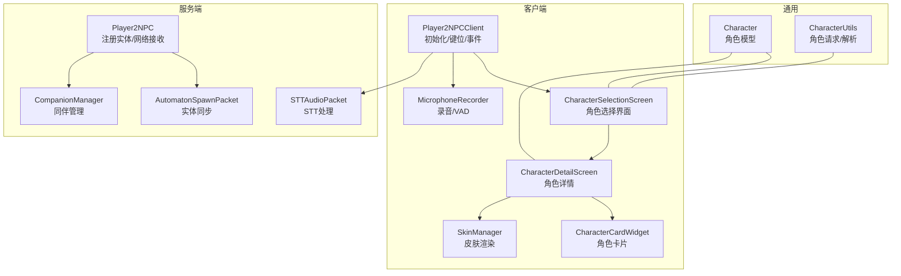
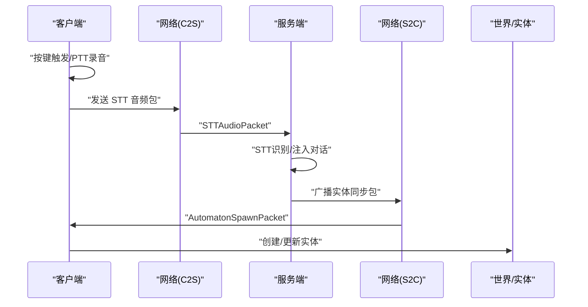
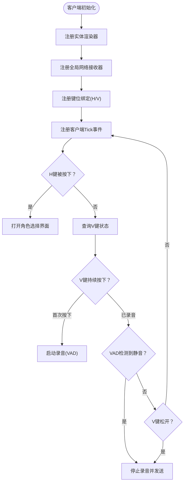
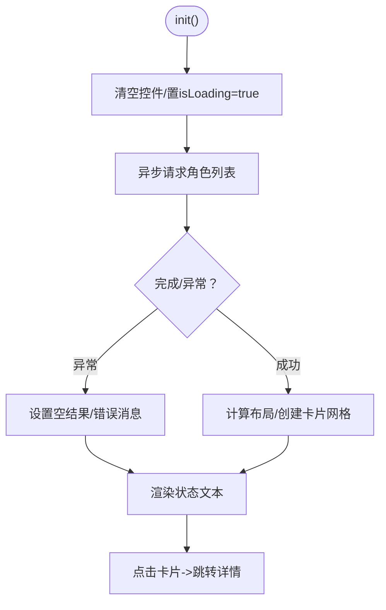
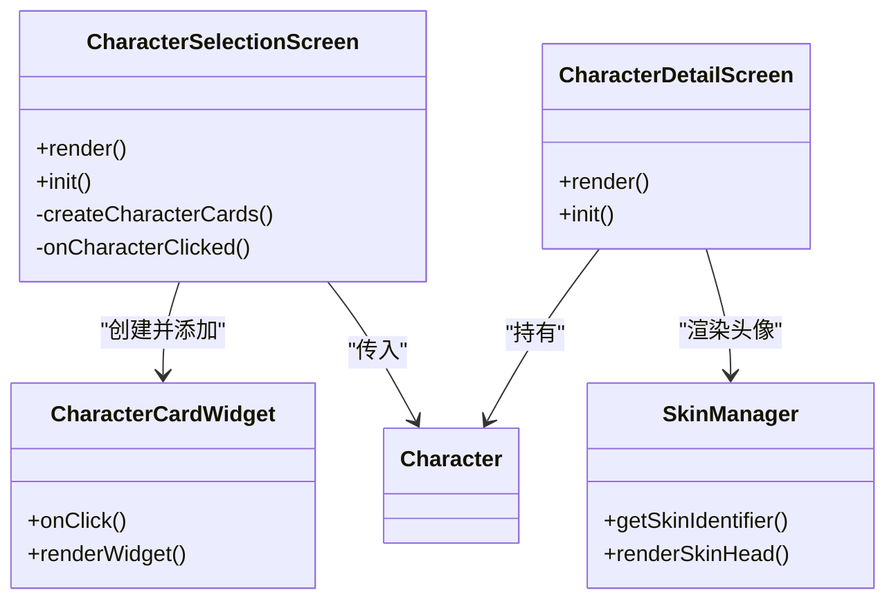
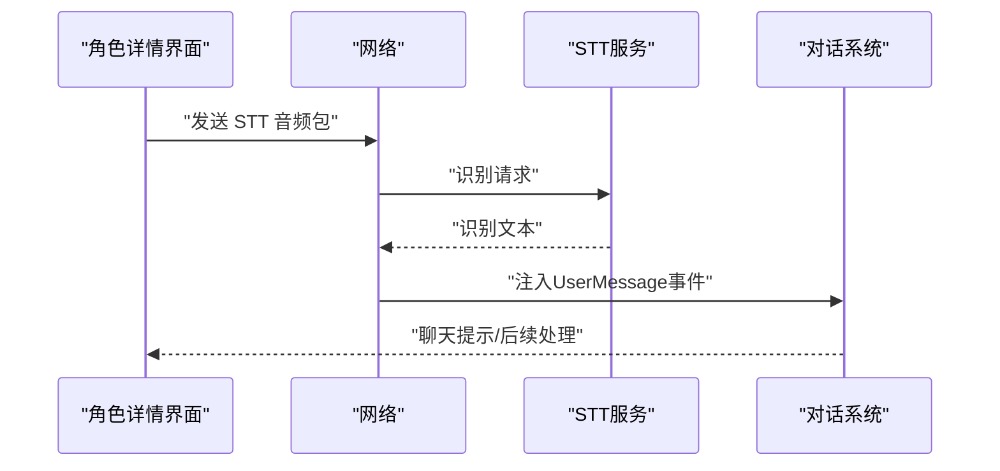
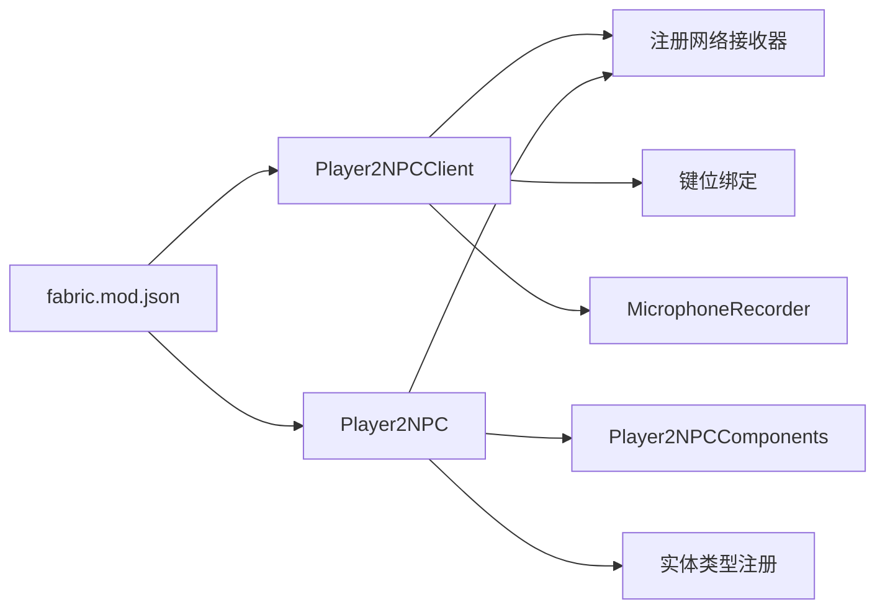

# 客户端集成

<cite>
**本文引用的文件**   
- [Player2NPCClient.java](file://src/main/java/com/goodbird/player2npc/Player2NPCClient.java)
- [Player2NPC.java](file://src/main/java/com/goodbird/player2npc/Player2NPC.java)
- [Player2NPCComponents.java](file://src/main/java/com/goodbird/player2npc/Player2NPCComponents.java)
- [CharacterSelectionScreen.java](file://src/main/java/com/goodbird/player2npc/client/gui/CharacterSelectionScreen.java)
- [CharacterDetailScreen.java](file://src/main/java/com/goodbird/player2npc/client/gui/CharacterDetailScreen.java)
- [CharacterCardWidget.java](file://src/main/java/com/goodbird/player2npc/client/gui/CharacterCardWidget.java)
- [SkinManager.java](file://src/main/java/com/goodbird/player2npc/client/util/SkinManager.java)
- [MicrophoneRecorder.java](file://src/main/java/com/goodbird/player2npc/client/audio/MicrophoneRecorder.java)
- [STTAudioPacket.java](file://src/main/java/com/goodbird/player2npc/network/STTAudioPacket.java)
- [AutomatonSpawnPacket.java](file://src/main/java/com/goodbird/player2npc/network/AutomatonSpawnPacket.java)
- [Character.java](file://src/main/java/adris/altoclef/player2api/Character.java)
- [CharacterUtils.java](file://src/main/java/adris/altoclef/player2api/utils/CharacterUtils.java)
- [ConversationManager.java](file://src/main/java/adris/altoclef/player2api/manager/ConversationManager.java)
- [Player2APIService.java](file://src/main/java/adris/altoclef/player2api/Player2APIService.java)
- [fabric.mod.json](file://src/main/resources/fabric.mod.json)
</cite>

## 目录
1. [简介](#简介)
2. [项目结构](#项目结构)
3. [核心组件](#核心组件)
4. [架构总览](#架构总览)
5. [详细组件分析](#详细组件分析)
6. [依赖分析](#依赖分析)
7. [性能考虑](#性能考虑)
8. [故障排查指南](#故障排查指南)
9. [结论](#结论)
10. [附录](#附录)

## 简介
本技术文档聚焦于客户端集成功能，围绕以下目标展开：
- 深入解释 Player2NPCClient 的初始化流程、键位绑定机制与事件处理系统
- 详细说明 CharacterSelectionScreen 角色选择界面的实现，包括 GUI 组件、用户交互与数据验证
- 阐述 CharacterDetailScreen 角色详情展示与 CharacterCardWidget 角色卡片组件的设计
- 解释客户端与服务器的同步机制、状态管理与错误处理
- 提供客户端配置选项、界面定制与用户体验优化方案（按键绑定、界面布局、视觉效果）
- 解决常见客户端问题（界面卡顿、内存泄漏、兼容性）

## 项目结构
该模块采用 Fabric/Mod 架构，客户端与服务端通过自定义网络协议进行通信；客户端负责渲染实体、处理输入与语音识别，服务端负责实体生成与对话注入。

**图表来源**
- [Player2NPCClient.java:36-124](file://src/main/java/com/goodbird/player2npc/Player2NPCClient.java#L36-L124)
- [CharacterSelectionScreen.java:13-106](file://src/main/java/com/goodbird/player2npc/client/gui/CharacterSelectionScreen.java#L13-L106)
- [CharacterDetailScreen.java:18-80](file://src/main/java/com/goodbird/player2npc/client/gui/CharacterDetailScreen.java#L18-L80)
- [CharacterCardWidget.java:14-53](file://src/main/java/com/goodbird/player2npc/client/gui/CharacterCardWidget.java#L14-L53)
- [SkinManager.java:10-57](file://src/main/java/com/goodbird/player2npc/client/util/SkinManager.java#L10-L57)
- [MicrophoneRecorder.java:21-200](file://src/main/java/com/goodbird/player2npc/client/audio/MicrophoneRecorder.java#L21-L200)
- [Player2NPC.java:25-66](file://src/main/java/com/goodbird/player2npc/Player2NPC.java#L25-L66)
- [STTAudioPacket.java:28-134](file://src/main/java/com/goodbird/player2npc/network/STTAudioPacket.java#L28-L134)
- [AutomatonSpawnPacket.java:26-120](file://src/main/java/com/goodbird/player2npc/network/AutomatonSpawnPacket.java#L26-L120)
- [Character.java:5-21](file://src/main/java/adris/altoclef/player2api/Character.java#L5-L21)
- [CharacterUtils.java:65-72](file://src/main/java/adris/altoclef/player2api/utils/CharacterUtils.java#L65-L72)

**章节来源**
- [fabric.mod.json:17-28](file://src/main/resources/fabric.mod.json#L17-L28)

## 核心组件
- 客户端初始化与键位绑定：在客户端初始化中注册实体渲染器、全局网络接收器与两个键位映射（打开角色选择屏、PTT 推杆讲）。
- 角色选择界面：异步加载角色列表，动态布局卡片网格，点击进入详情。
- 角色详情界面：显示头像、描述文本，提供召唤/解散按钮。
- 录音与语音识别：基于 VAD 的自动停止、最小时长校验、发送 STT 请求。
- 服务器同步：服务端接收 STT 音频并注入对话，客户端接收实体同步包并在世界中生成实体。

**章节来源**
- [Player2NPCClient.java:36-124](file://src/main/java/com/goodbird/player2npc/Player2NPCClient.java#L36-L124)
- [CharacterSelectionScreen.java:24-100](file://src/main/java/com/goodbird/player2npc/client/gui/CharacterSelectionScreen.java#L24-L100)
- [CharacterDetailScreen.java:29-79](file://src/main/java/com/goodbird/player2npc/client/gui/CharacterDetailScreen.java#L29-L79)
- [CharacterCardWidget.java:14-53](file://src/main/java/com/goodbird/player2npc/client/gui/CharacterCardWidget.java#L14-L53)
- [SkinManager.java:14-57](file://src/main/java/com/goodbird/player2npc/client/util/SkinManager.java#L14-L57)
- [MicrophoneRecorder.java:49-175](file://src/main/java/com/goodbird/player2npc/client/audio/MicrophoneRecorder.java#L49-L175)
- [STTAudioPacket.java:39-121](file://src/main/java/com/goodbird/player2npc/network/STTAudioPacket.java#L39-L121)
- [AutomatonSpawnPacket.java:100-119](file://src/main/java/com/goodbird/player2npc/network/AutomatonSpawnPacket.java#L100-L119)

## 架构总览
客户端与服务端通过 Fabric 网络层通信，使用自定义包 ID 进行消息分发。客户端负责输入与渲染，服务端负责业务逻辑与状态同步。

**图表来源**
- [Player2NPCClient.java:150-162](file://src/main/java/com/goodbird/player2npc/Player2NPCClient.java#L150-L162)
- [STTAudioPacket.java:39-121](file://src/main/java/com/goodbird/player2npc/network/STTAudioPacket.java#L39-L121)
- [AutomatonSpawnPacket.java:100-119](file://src/main/java/com/goodbird/player2npc/network/AutomatonSpawnPacket.java#L100-L119)

## 详细组件分析

### 初始化流程与键位绑定
- 注册实体渲染器：在客户端初始化中注册自定义实体渲染器。
- 注册网络接收器：注册全局接收器以处理服务端推送的实体同步包。
- 键位绑定：
  - 打开角色选择屏：默认绑定 H 键，点击后在客户端切换到角色选择界面。
  - PTT 推杆讲：默认绑定 V 键，使用原生 GLFW 查询按键状态，避免 Minecraft 键映射在屏幕切换或焦点丢失时重置的问题。
- 客户端 Tick 事件：在每帧末尾检查键位状态，处理录音开始/自动停止/手动停止与发送逻辑。

**图表来源**
- [Player2NPCClient.java:36-124](file://src/main/java/com/goodbird/player2npc/Player2NPCClient.java#L36-L124)

**章节来源**
- [Player2NPCClient.java:36-124](file://src/main/java/com/goodbird/player2npc/Player2NPCClient.java#L36-L124)

### 角色选择界面（CharacterSelectionScreen）
- 异步加载：在初始化时通过 CharacterUtils 向服务端请求角色列表，完成后清理旧控件并创建角色卡片网格。
- 布局算法：根据窗口宽度计算每行卡片数与总宽度，逐行从左至右填充，支持空状态提示。
- 用户交互：点击任意卡片进入角色详情界面；界面非暂停模式，不中断游戏。

**图表来源**
- [CharacterSelectionScreen.java:24-100](file://src/main/java/com/goodbird/player2npc/client/gui/CharacterSelectionScreen.java#L24-L100)
- [CharacterUtils.java:65-72](file://src/main/java/adris/altoclef/player2api/utils/CharacterUtils.java#L65-L72)

**章节来源**
- [CharacterSelectionScreen.java:13-106](file://src/main/java/com/goodbird/player2npc/client/gui/CharacterSelectionScreen.java#L13-L106)
- [CharacterUtils.java:65-72](file://src/main/java/adris/altoclef/player2api/utils/CharacterUtils.java#L65-L72)

### 角色详情界面（CharacterDetailScreen）与卡片组件（CharacterCardWidget）
- 角色详情：
  - 渲染角色头像（皮肤），居中显示名称与描述文本（自动换行）。
  - 提供“返回”、“召唤”、“解散”按钮，分别用于导航、请求生成实体与移除实体。
- 卡片组件：
  - 绘制浅色背景与顶部高亮条，居中绘制角色头像与短名。
  - 点击回调传递角色对象给父界面。

**图表来源**
- [CharacterSelectionScreen.java:13-106](file://src/main/java/com/goodbird/player2npc/client/gui/CharacterSelectionScreen.java#L13-L106)
- [CharacterDetailScreen.java:18-80](file://src/main/java/com/goodbird/player2npc/client/gui/CharacterDetailScreen.java#L18-L80)
- [CharacterCardWidget.java:14-53](file://src/main/java/com/goodbird/player2npc/client/gui/CharacterCardWidget.java#L14-L53)
- [SkinManager.java:14-57](file://src/main/java/com/goodbird/player2npc/client/util/SkinManager.java#L14-L57)
- [Character.java:5-21](file://src/main/java/adris/altoclef/player2api/Character.java#L5-L21)

**章节来源**
- [CharacterDetailScreen.java:18-80](file://src/main/java/com/goodbird/player2npc/client/gui/CharacterDetailScreen.java#L18-L80)
- [CharacterCardWidget.java:14-53](file://src/main/java/com/goodbird/player2npc/client/gui/CharacterCardWidget.java#L14-L53)
- [SkinManager.java:14-57](file://src/main/java/com/goodbird/player2npc/client/util/SkinManager.java#L14-L57)
- [Character.java:5-21](file://src/main/java/adris/altoclef/player2api/Character.java#L5-L21)

### 语音识别与客户端同步机制
- 录音与 VAD：
  - 使用标准 PCM 参数（16kHz、16bit、单声道）录制音频。
  - VAD：在达到最小录音时间后，若连续静音超过阈值则自动停止。
  - 最大录音时长限制，防止无限录制。
- 发送 STT 包：
  - 客户端打包语言、音频长度与字节流并通过自定义通道发送。
  - 服务端接收后进行 STT 处理，将识别结果作为用户消息注入对话系统。
- 实体同步：
  - 服务端向客户端广播实体同步包，客户端在渲染线程中创建实体并写入位置、速度、朝向与角色信息。

**图表来源**
- [Player2NPCClient.java:150-162](file://src/main/java/com/goodbird/player2npc/Player2NPCClient.java#L150-L162)
- [STTAudioPacket.java:39-121](file://src/main/java/com/goodbird/player2npc/network/STTAudioPacket.java#L39-L121)
- [ConversationManager.java:36-57](file://src/main/java/adris/altoclef/player2api/manager/ConversationManager.java#L36-L57)

**章节来源**
- [MicrophoneRecorder.java:49-175](file://src/main/java/com/goodbird/player2npc/client/audio/MicrophoneRecorder.java#L49-L175)
- [Player2NPCClient.java:150-162](file://src/main/java/com/goodbird/player2npc/Player2NPCClient.java#L150-L162)
- [STTAudioPacket.java:39-121](file://src/main/java/com/goodbird/player2npc/network/STTAudioPacket.java#L39-L121)
- [AutomatonSpawnPacket.java:100-119](file://src/main/java/com/goodbird/player2npc/network/AutomatonSpawnPacket.java#L100-L119)

## 依赖分析
- 客户端入口与注册：
  - Player2NPCClient 在客户端入口注册渲染器、网络接收器与键位绑定。
  - fabric.mod.json 指定客户端入口为 Player2NPCClient。
- 服务端入口与注册：
  - Player2NPC 在服务端入口注册实体类型、网络接收器与连接事件。
  - Player2NPCComponents 将 CompanionManager 注册为玩家实体组件。
- 界面与工具：
  - CharacterSelectionScreen 依赖 CharacterUtils 进行角色拉取。
  - CharacterDetailScreen 依赖 SkinManager 进行皮肤渲染。
  - STTAudioPacket 依赖 STT 配置与 Provider 进行识别。

**图表来源**
- [fabric.mod.json:17-28](file://src/main/resources/fabric.mod.json#L17-L28)
- [Player2NPCClient.java:36-124](file://src/main/java/com/goodbird/player2npc/Player2NPCClient.java#L36-L124)
- [Player2NPC.java:48-66](file://src/main/java/com/goodbird/player2npc/Player2NPC.java#L48-L66)
- [Player2NPCComponents.java:10-16](file://src/main/java/com/goodbird/player2npc/Player2NPCComponents.java#L10-L16)

**章节来源**
- [fabric.mod.json:17-28](file://src/main/resources/fabric.mod.json#L17-L28)
- [Player2NPCClient.java:36-124](file://src/main/java/com/goodbird/player2npc/Player2NPCClient.java#L36-L124)
- [Player2NPC.java:48-66](file://src/main/java/com/goodbird/player2npc/Player2NPC.java#L48-L66)
- [Player2NPCComponents.java:10-16](file://src/main/java/com/goodbird/player2npc/Player2NPCComponents.java#L10-L16)

## 性能考虑
- 异步加载与渲染：角色列表加载使用异步任务，避免阻塞 UI；界面渲染仅在必要时重建。
- VAD 采样粒度：每次读取固定大小的音频块进行 RMS 计算，降低 CPU 开销。
- 网络传输：STT 包含语言标识、变长整型长度与原始字节，尽量减少额外封装。
- 实体同步：服务端对速度与角度进行压缩编码，客户端解码还原，减少带宽占用。
- 资源缓存：皮肤下载与缓存由 SkinManager 管理，避免重复下载。

[本节为通用建议，无需列出具体文件来源]

## 故障排查指南
- PTT 无法录音
  - 检查麦克风可用性与权限；确认键位绑定未与其他冲突。
  - 若 KeyMapping.isDown 不可靠，客户端使用 GLFW 直接查询按键状态。
- 录音过短被拒绝
  - 客户端与服务端均要求最小时长；请延长按压时间或确保环境噪声充足。
- STT 未启用/失败
  - 检查 STT 配置是否启用、API Key 是否正确配置；查看服务端日志中的错误提示。
- 角色列表为空
  - 确认网络连通与服务端接口可用；检查 CharacterUtils 的请求与解析逻辑。
- 实体未显示
  - 检查服务端是否成功广播同步包，客户端是否收到并创建实体。
- 内存与卡顿
  - 避免在渲染线程做重型操作；确保录音线程安全退出与资源释放。

**章节来源**
- [Player2NPCClient.java:64-123](file://src/main/java/com/goodbird/player2npc/Player2NPCClient.java#L64-L123)
- [STTAudioPacket.java:57-121](file://src/main/java/com/goodbird/player2npc/network/STTAudioPacket.java#L57-L121)
- [MicrophoneRecorder.java:107-153](file://src/main/java/com/goodbird/player2npc/client/audio/MicrophoneRecorder.java#L107-L153)

## 结论
该客户端集成功能通过清晰的职责划分与稳定的网络协议实现了角色选择、语音识别与实体同步的完整闭环。通过异步加载、VAD 自动停止与严格的最小时长校验，提升了用户体验与稳定性。建议在实际部署中关注 STT 配置与网络环境，结合界面与按键绑定的可定制化选项进一步优化交互体验。

[本节为总结性内容，无需列出具体文件来源]

## 附录

### 客户端配置与界面定制
- 按键绑定配置
  - 打开角色选择屏：默认 H 键，可在客户端键位设置中修改。
  - PTT 推杆讲：默认 V 键，使用原生 GLFW 查询按键状态，避免键映射抖动。
- 界面布局调整
  - 角色卡片网格：根据窗口宽度动态计算每行数量与总宽度，支持空状态提示。
  - 文本换行：详情界面使用字体拆分器按宽度换行，提升可读性。
- 视觉效果定制
  - 皮肤渲染：支持自定义皮肤 URL，缓存与回退到默认皮肤。
  - 卡片样式：浅色背景与顶部高亮条，头像尺寸与居中对齐。

**章节来源**
- [CharacterSelectionScreen.java:54-78](file://src/main/java/com/goodbird/player2npc/client/gui/CharacterSelectionScreen.java#L54-L78)
- [CharacterDetailScreen.java:60-79](file://src/main/java/com/goodbird/player2npc/client/gui/CharacterDetailScreen.java#L60-L79)
- [SkinManager.java:14-57](file://src/main/java/com/goodbird/player2npc/client/util/SkinManager.java#L14-L57)

### 状态管理与错误处理
- 会话锁与超时：对话系统具备等待响应锁与超时释放机制，避免死锁。
- 心跳与健康上报：通过 Player2APIService 发送心跳，维持连接有效性。
- 错误日志：统一使用 Log4j 输出，便于定位问题。

**章节来源**
- [ConversationManager.java:36-57](file://src/main/java/adris/altoclef/player2api/manager/ConversationManager.java#L36-L57)
- [Player2APIService.java:258-274](file://src/main/java/adris/altoclef/player2api/Player2APIService.java#L258-L274)