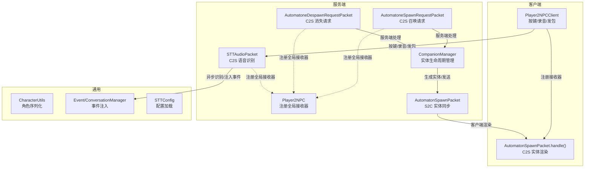
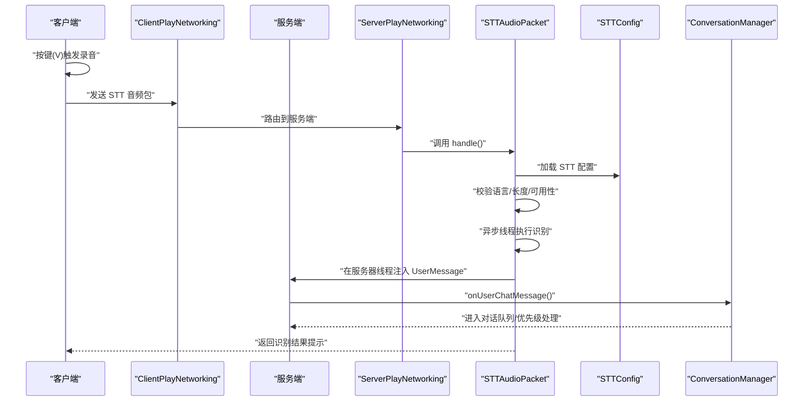
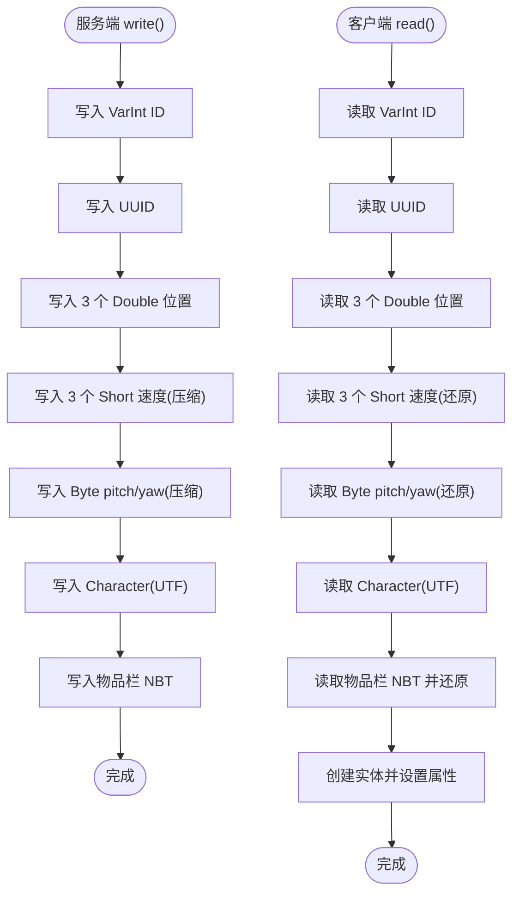
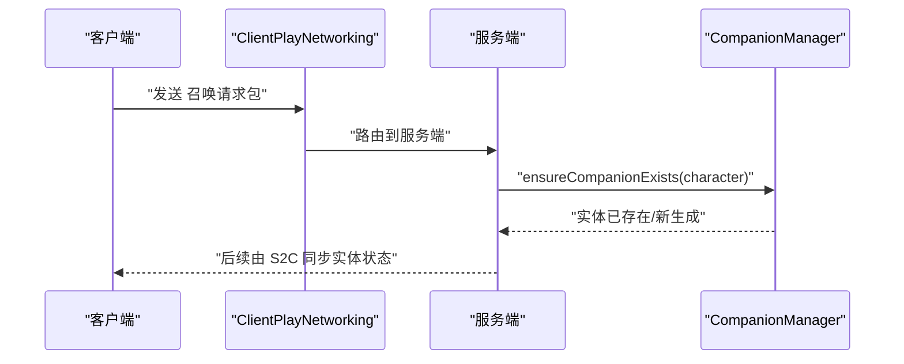
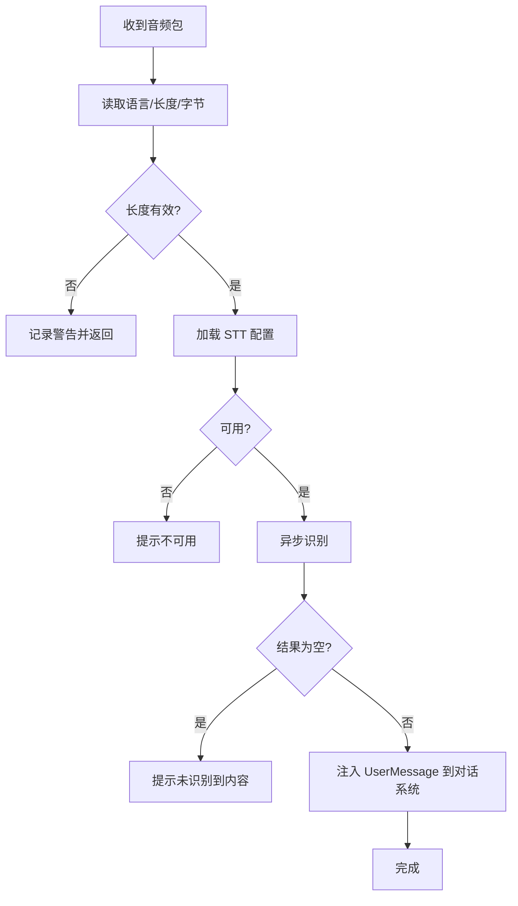
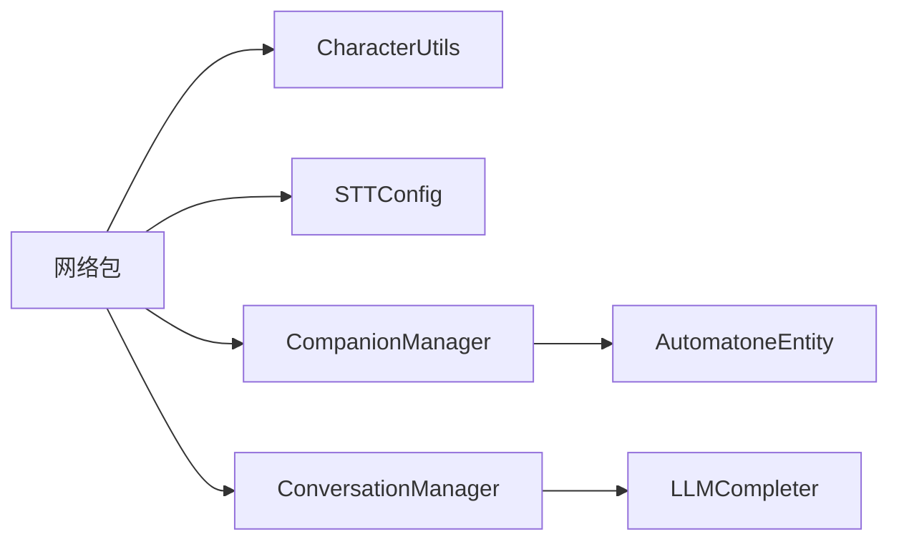

# 网络包协议

<cite>
**本文引用的文件**
- [AutomatonSpawnPacket.java](file://src/main/java/com/goodbird/player2npc/network/AutomatonSpawnPacket.java)
- [AutomatoneSpawnRequestPacket.java](file://src/main/java/com/goodbird/player2npc/network/AutomatoneSpawnRequestPacket.java)
- [AutomatoneDespawnRequestPacket.java](file://src/main/java/com/goodbird/player2npc/network/AutomatoneDespawnRequestPacket.java)
- [STTAudioPacket.java](file://src/main/java/com/goodbird/player2npc/network/STTAudioPacket.java)
- [Player2NPC.java](file://src/main/java/com/goodbird/player2npc/Player2NPC.java)
- [Player2NPCClient.java](file://src/main/java/com/goodbird/player2npc/Player2NPCClient.java)
- [CharacterUtils.java](file://src/main/java/adris/altoclef/player2api/utils/CharacterUtils.java)
- [CompanionManager.java](file://src/main/java/com/goodbird/player2npc/companion/CompanionManager.java)
- [STTConfig.java](file://src/main/java/adris/altoclef/player2api/stt/STTConfig.java)
- [Event.java](file://src/main/java/adris/altoclef/player2api/Event.java)
- [ConversationManager.java](file://src/main/java/adris/altoclef/player2api/manager/ConversationManager.java)
</cite>

## 目录
1. [简介](#简介)
2. [项目结构](#项目结构)
3. [核心组件](#核心组件)
4. [架构总览](#架构总览)
5. [详细组件分析](#详细组件分析)
6. [依赖分析](#依赖分析)
7. [性能考虑](#性能考虑)
8. [故障排查指南](#故障排查指南)
9. [结论](#结论)
10. [附录](#附录)

## 简介
本文件面向网络包协议系统，围绕以下核心网络包展开：AutomatonSpawnPacket、AutomatoneSpawnRequestPacket、AutomatoneDespawnRequestPacket、STTAudioPacket。文档将系统性说明：
- FabricPacket 接口与 PacketType 的注册与处理流程
- 数据序列化与反序列化（FriendlyByteBuf 读写、NBT 数据格式、字符编码）
- 客户端-服务器通信协议规范与发送/接收示例路径
- 数据压缩、精度控制与性能优化策略
- 常见传输问题（丢失、乱序、重复）的应对建议

## 项目结构
网络包协议相关代码主要位于以下模块：
- 服务端与通用协议定义：com.goodbird.player2npc
- 客户端交互与按键触发：com.goodbird.player2npc.client
- 角色与对话系统：adris.altoclef.player2api

图表来源
- [Player2NPC.java:48-65](file://src/main/java/com/goodbird/player2npc/Player2NPC.java#L48-L65)
- [Player2NPCClient.java:36-124](file://src/main/java/com/goodbird/player2npc/Player2NPCClient.java#L36-L124)
- [AutomatonSpawnPacket.java:26-120](file://src/main/java/com/goodbird/player2npc/network/AutomatonSpawnPacket.java#L26-L120)
- [AutomatoneSpawnRequestPacket.java:24-67](file://src/main/java/com/goodbird/player2npc/network/AutomatoneSpawnRequestPacket.java#L24-L67)
- [AutomatoneDespawnRequestPacket.java:21-65](file://src/main/java/com/goodbird/player2npc/network/AutomatoneDespawnRequestPacket.java#L21-L65)
- [STTAudioPacket.java:28-134](file://src/main/java/com/goodbird/player2npc/network/STTAudioPacket.java#L28-L134)
- [CompanionManager.java:28-191](file://src/main/java/com/goodbird/player2npc/companion/CompanionManager.java#L28-L191)
- [CharacterUtils.java:83-110](file://src/main/java/adris/altoclef/player2api/utils/CharacterUtils.java#L83-L110)
- [ConversationManager.java:99-114](file://src/main/java/adris/altoclef/player2api/manager/ConversationManager.java#L99-L114)
- [STTConfig.java:31-59](file://src/main/java/adris/altoclef/player2api/stt/STTConfig.java#L31-L59)

章节来源
- [Player2NPC.java:25-67](file://src/main/java/com/goodbird/player2npc/Player2NPC.java#L25-L67)
- [Player2NPCClient.java:23-164](file://src/main/java/com/goodbird/player2npc/Player2NPCClient.java#L23-L164)

## 核心组件
本节概述四大网络包的职责与协作关系。

- 自动人偶实体同步（S2C）
  - 服务端向客户端推送自动人偶实体的状态（位置、速度、朝向、角色信息、物品栏），用于渲染与同步。
  - 关键实现：AutomatonSpawnPacket（序列化/反序列化、类型注册、客户端处理）

- 召唤请求（C2S）
  - 客户端请求服务端生成对应角色的自动人偶；服务端通过 CompanionManager 确保实体存在并加入世界。

- 消失请求（C2S）
  - 客户端请求服务端移除对应角色的自动人偶；服务端从世界中丢弃实体。

- 语音转文本（C2S）
  - 客户端以按键触发录音，将音频数据发送至服务端；服务端异步进行语音识别，将结果作为用户消息注入对话系统。

章节来源
- [AutomatonSpawnPacket.java:26-120](file://src/main/java/com/goodbird/player2npc/network/AutomatonSpawnPacket.java#L26-L120)
- [AutomatoneSpawnRequestPacket.java:24-67](file://src/main/java/com/goodbird/player2npc/network/AutomatoneSpawnRequestPacket.java#L24-L67)
- [AutomatoneDespawnRequestPacket.java:21-65](file://src/main/java/com/goodbird/player2npc/network/AutomatoneDespawnRequestPacket.java#L21-L65)
- [STTAudioPacket.java:28-134](file://src/main/java/com/goodbird/player2npc/network/STTAudioPacket.java#L28-L134)
- [CompanionManager.java:100-129](file://src/main/java/com/goodbird/player2npc/companion/CompanionManager.java#L100-L129)

## 架构总览
下图展示从按键触发录音到语音识别完成注入对话系统的完整时序。

图表来源
- [Player2NPCClient.java:64-123](file://src/main/java/com/goodbird/player2npc/Player2NPCClient.java#L64-L123)
- [Player2NPC.java:52-54](file://src/main/java/com/goodbird/player2npc/Player2NPC.java#L52-L54)
- [STTAudioPacket.java:39-121](file://src/main/java/com/goodbird/player2npc/network/STTAudioPacket.java#L39-L121)
- [STTConfig.java:31-59](file://src/main/java/adris/altoclef/player2api/stt/STTConfig.java#L31-L59)
- [ConversationManager.java:99-114](file://src/main/java/adris/altoclef/player2api/manager/ConversationManager.java#L99-L114)

## 详细组件分析

### FabricPacket 接口与 PacketType 注册
- Packet 类型注册
  - 服务端通过 ServerPlayNetworking.registerGlobalReceiver 将 PacketType 绑定到处理器。
  - 示例路径：
    - [Player2NPC.java:52-54](file://src/main/java/com/goodbird/player2npc/Player2NPC.java#L52-L54)
    - [AutomatoneSpawnRequestPacket.java:26-29](file://src/main/java/com/goodbird/player2npc/network/AutomatoneSpawnRequestPacket.java#L26-L29)
    - [AutomatoneDespawnRequestPacket.java:25-28](file://src/main/java/com/goodbird/player2npc/network/AutomatoneDespawnRequestPacket.java#L25-L28)
    - [STTAudioPacket.java:28-30](file://src/main/java/com/goodbird/player2npc/network/STTAudioPacket.java#L28-L30)

- 客户端接收器注册
  - 客户端通过 ClientPlayNetworking.registerGlobalReceiver 注册 S2C 包处理。
  - 示例路径：
    - [Player2NPCClient.java:40](file://src/main/java/com/goodbird/player2npc/Player2NPCClient.java#L40)
    - [AutomatonSpawnPacket.java:100-119](file://src/main/java/com/goodbird/player2npc/network/AutomatonSpawnPacket.java#L100-L119)

- 处理流程
  - 服务端：PacketType.create(...) 创建类型，构造函数参数为解码器；在 handle(...) 中解析缓冲区并执行业务逻辑。
  - 客户端：PacketType 用于标识包类型，handle(...) 在客户端线程中执行渲染或状态更新。

章节来源
- [Player2NPC.java:29-36](file://src/main/java/com/goodbird/player2npc/Player2NPC.java#L29-L36)
- [Player2NPC.java:52-54](file://src/main/java/com/goodbird/player2npc/Player2NPC.java#L52-L54)
- [Player2NPCClient.java:40](file://src/main/java/com/goodbird/player2npc/Player2NPCClient.java#L40)
- [AutomatoneSpawnRequestPacket.java:26-29](file://src/main/java/com/goodbird/player2npc/network/AutomatoneSpawnRequestPacket.java#L26-L29)
- [AutomatoneDespawnRequestPacket.java:25-28](file://src/main/java/com/goodbird/player2npc/network/AutomatoneDespawnRequestPacket.java#L25-L28)
- [STTAudioPacket.java:28-30](file://src/main/java/com/goodbird/player2npc/network/STTAudioPacket.java#L28-L30)

### AutomatonSpawnPacket（实体同步）
- 序列化字段
  - 整数 ID、UUID、Vec3 位置、Vec3 速度、浮点 pitch/yaw、角色 Character、物品栏 NBT。
- 读写细节
  - 位置：double 三个分量
  - 速度：短整型压缩（[-3.9, 3.9] 范围内按 8000 缩放）
  - 朝向：字节压缩（[0, 360) 映射到 [0, 256)）
  - 角色：通过 CharacterUtils.writeToBuf/readFromBuf
  - 物品栏：CompoundTag 包含 ListTag，使用 writeNbt/readNbt
- 客户端处理
  - 在客户端线程中创建实体、设置属性、放入世界

图表来源
- [AutomatonSpawnPacket.java:54-93](file://src/main/java/com/goodbird/player2npc/network/AutomatonSpawnPacket.java#L54-L93)
- [CharacterUtils.java:83-110](file://src/main/java/adris/altoclef/player2api/utils/CharacterUtils.java#L83-L110)

章节来源
- [AutomatonSpawnPacket.java:26-120](file://src/main/java/com/goodbird/player2npc/network/AutomatonSpawnPacket.java#L26-L120)
- [CharacterUtils.java:83-110](file://src/main/java/adris/altoclef/player2api/utils/CharacterUtils.java#L83-L110)

### AutomatoneSpawnRequestPacket（C2S 召唤）
- 协议要点
  - 客户端发送 Character 到服务端
  - 服务端通过 CompanionManager.ensureCompanionExists 确保存在并加入世界
- 处理流程
  - 客户端：create(...) 构造包并发送
  - 服务端：handle(...) 解析 Character，确保实体存在

图表来源
- [AutomatoneSpawnRequestPacket.java:41-65](file://src/main/java/com/goodbird/player2npc/network/AutomatoneSpawnRequestPacket.java#L41-L65)
- [CompanionManager.java:100-129](file://src/main/java/com/goodbird/player2npc/companion/CompanionManager.java#L100-L129)

章节来源
- [AutomatoneSpawnRequestPacket.java:24-67](file://src/main/java/com/goodbird/player2npc/network/AutomatoneSpawnRequestPacket.java#L24-L67)
- [CompanionManager.java:100-129](file://src/main/java/com/goodbird/player2npc/companion/CompanionManager.java#L100-L129)

### AutomatoneDespawnRequestPacket（C2S 消失）
- 协议要点
  - 客户端发送 Character 名称到服务端
  - 服务端通过 CompanionManager.dismissCompanion 移除实体
- 处理流程
  - 客户端：create(...) 构造包并发送
  - 服务端：handle(...) 解析 Character，移除对应实体

章节来源
- [AutomatoneDespawnRequestPacket.java:21-65](file://src/main/java/com/goodbird/player2npc/network/AutomatoneDespawnRequestPacket.java#L21-L65)
- [CompanionManager.java:131-143](file://src/main/java/com/goodbird/player2npc/companion/CompanionManager.java#L131-L143)

### STTAudioPacket（C2S 语音识别）
- 协议格式（C2S）
  - UTF 语言字符串（固定长度上限）、VarInt 音频长度、字节数组
- 处理流程
  - 服务端在网络线程读取缓冲区
  - 进行长度与可用性校验
  - 异步线程执行 STT 识别
  - 识别完成后在服务器线程注入 UserMessage，交由 ConversationManager 处理

图表来源
- [STTAudioPacket.java:39-121](file://src/main/java/com/goodbird/player2npc/network/STTAudioPacket.java#L39-L121)
- [STTConfig.java:31-59](file://src/main/java/adris/altoclef/player2api/stt/STTConfig.java#L31-L59)
- [ConversationManager.java:99-114](file://src/main/java/adris/altoclef/player2api/manager/ConversationManager.java#L99-L114)

章节来源
- [STTAudioPacket.java:28-134](file://src/main/java/com/goodbird/player2npc/network/STTAudioPacket.java#L28-L134)
- [Player2NPCClient.java:146-162](file://src/main/java/com/goodbird/player2npc/Player2NPCClient.java#L146-L162)

## 依赖分析
- 组件耦合
  - Packet 层仅依赖 Fabric API 与 Minecraft Netty 缓冲区，保持低耦合
  - 业务层（CompanionManager、ConversationManager）通过事件注入与组件化设计解耦
- 外部依赖
  - STT 提供商（阿里云）与配置文件（LLMConfig/STTConfig）
- 潜在循环
  - 未发现直接循环依赖；事件通过回调注入，避免强耦合

图表来源
- [CharacterUtils.java:83-110](file://src/main/java/adris/altoclef/player2api/utils/CharacterUtils.java#L83-L110)
- [STTConfig.java:31-59](file://src/main/java/adris/altoclef/player2api/stt/STTConfig.java#L31-L59)
- [CompanionManager.java:100-129](file://src/main/java/com/goodbird/player2npc/companion/CompanionManager.java#L100-L129)
- [ConversationManager.java:56](file://src/main/java/adris/altoclef/player2api/manager/ConversationManager.java#L56)

章节来源
- [CharacterUtils.java:1-142](file://src/main/java/adris/altoclef/player2api/utils/CharacterUtils.java#L1-L142)
- [STTConfig.java:1-78](file://src/main/java/adris/altoclef/player2api/stt/STTConfig.java#L1-L78)
- [CompanionManager.java:1-191](file://src/main/java/com/goodbird/player2npc/companion/CompanionManager.java#L1-L191)
- [ConversationManager.java:1-180](file://src/main/java/adris/altoclef/player2api/manager/ConversationManager.java#L1-L180)

## 性能考虑
- 速度压缩
  - 速度分量采用短整型压缩（±3.9 范围内按 8000 缩放），减少带宽占用并保留足够精度
  - 朝向采用字节压缩（0–360 映射到 0–256），满足视觉需求的同时降低开销
- 音频阈值
  - 客户端与服务端均设置最小音频长度阈值，避免无效识别与资源浪费
- 异步处理
  - STT 识别在独立线程执行，避免阻塞网络线程与服务器主线程
- 批量与去重
  - 通过实体 UUID 与角色名映射，避免重复生成与无效刷新

章节来源
- [AutomatonSpawnPacket.java:83-87](file://src/main/java/com/goodbird/player2npc/network/AutomatonSpawnPacket.java#L83-L87)
- [Player2NPCClient.java:27-28](file://src/main/java/com/goodbird/player2npc/Player2NPCClient.java#L27-L28)
- [STTAudioPacket.java:32-33](file://src/main/java/com/goodbird/player2npc/network/STTAudioPacket.java#L32-L33)

## 故障排查指南
- 数据丢失
  - 检查客户端是否正确注册接收器与服务端是否注册全局接收器
  - 确认 PacketType 常量一致且未被修改
  - 参考路径：
    - [Player2NPCClient.java:40](file://src/main/java/com/goodbird/player2npc/Player2NPCClient.java#L40)
    - [Player2NPC.java:52-54](file://src/main/java/com/goodbird/player2npc/Player2NPC.java#L52-L54)
- 乱序与重复
  - 使用 UUID 与 VarInt ID 标识实体，客户端按最新包覆盖状态
  - 对于 STT，单次识别完成后才允许下一次录音，避免并发冲突
  - 参考路径：
    - [AutomatonSpawnPacket.java:100-119](file://src/main/java/com/goodbird/player2npc/network/AutomatonSpawnPacket.java#L100-L119)
- 识别失败
  - 检查 STT 配置是否启用、API Key 是否配置、提供商是否可用
  - 查看服务端日志输出，确认最小长度阈值与提示信息
  - 参考路径：
    - [STTConfig.java:31-59](file://src/main/java/adris/altoclef/player2api/stt/STTConfig.java#L31-L59)
    - [STTAudioPacket.java:56-63](file://src/main/java/com/goodbird/player2npc/network/STTAudioPacket.java#L56-L63)
    - [STTAudioPacket.java:70-81](file://src/main/java/com/goodbird/player2npc/network/STTAudioPacket.java#L70-L81)
    - [STTAudioPacket.java:86-90](file://src/main/java/com/goodbird/player2npc/network/STTAudioPacket.java#L86-L90)

## 结论
本网络包协议体系以 FabricPacket 为核心，结合 PacketType 注册与处理，实现了从客户端按键触发录音、服务端异步识别到对话系统注入的完整链路。通过速度/朝向压缩、最小音频阈值与异步线程等策略，在保证体验的同时兼顾性能与稳定性。建议在扩展新包时遵循现有序列化模式与错误处理规范，确保一致性与可维护性。

## 附录

### 发送与接收示例（路径指引）
- 客户端按键触发录音并发送 STT 包
  - [Player2NPCClient.java:64-123](file://src/main/java/com/goodbird/player2npc/Player2NPCClient.java#L64-L123)
  - [Player2NPCClient.java:146-162](file://src/main/java/com/goodbird/player2npc/Player2NPCClient.java#L146-L162)
- 服务端注册全局接收器与处理
  - [Player2NPC.java:52-54](file://src/main/java/com/goodbird/player2npc/Player2NPC.java#L52-L54)
  - [STTAudioPacket.java:39-121](file://src/main/java/com/goodbird/player2npc/network/STTAudioPacket.java#L39-L121)
- 客户端接收 S2C 实体同步并渲染
  - [Player2NPCClient.java:40](file://src/main/java/com/goodbird/player2npc/Player2NPCClient.java#L40)
  - [AutomatonSpawnPacket.java:100-119](file://src/main/java/com/goodbird/player2npc/network/AutomatonSpawnPacket.java#L100-L119)

### 数据序列化与反序列化要点
- FriendlyByteBuf
  - 整数：VarInt/VarLong
  - 浮点：Double/Short（压缩）
  - 字符串：UTF（CharacterUtils 内封装）
  - 字节数组：VarInt 长度 + Bytes
- NBT 数据
  - 物品栏使用 CompoundTag 包裹 ListTag，序列化后写入/读取
- 字符编码
  - UTF-8（Minecraft 默认），CharacterUtils 统一封装读写

章节来源
- [AutomatonSpawnPacket.java:54-93](file://src/main/java/com/goodbird/player2npc/network/AutomatonSpawnPacket.java#L54-L93)
- [CharacterUtils.java:83-110](file://src/main/java/adris/altoclef/player2api/utils/CharacterUtils.java#L83-L110)