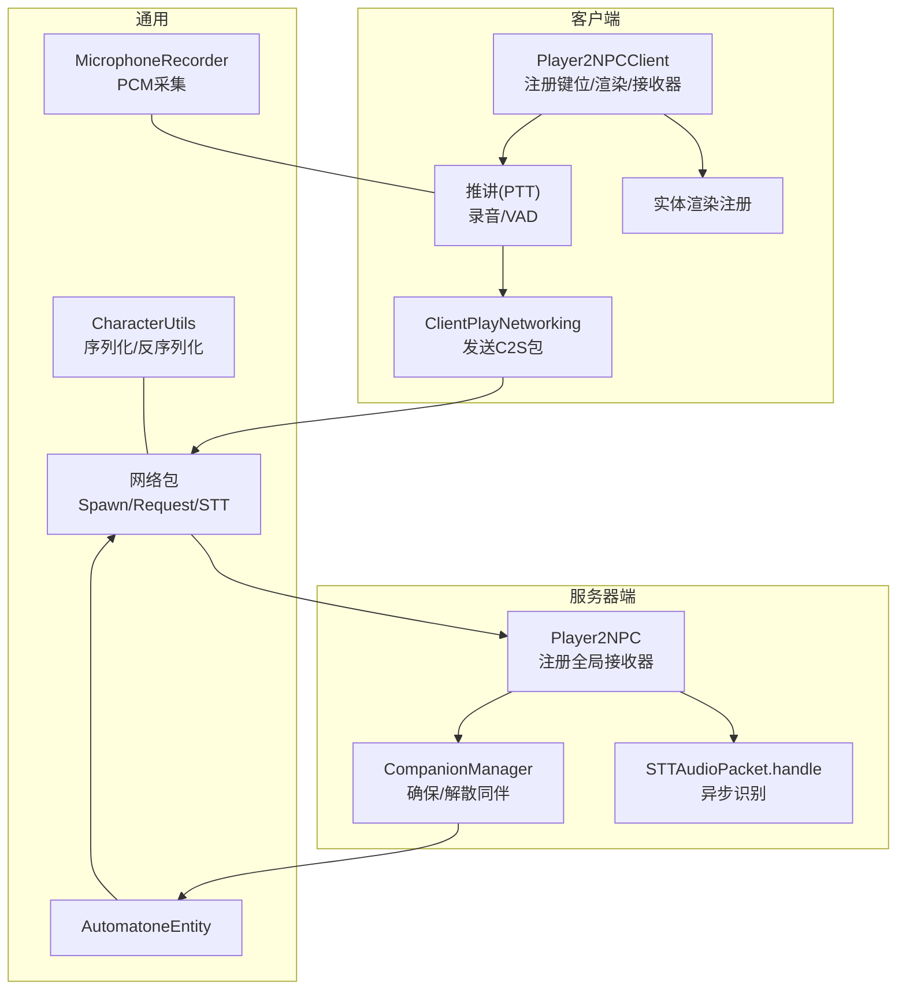
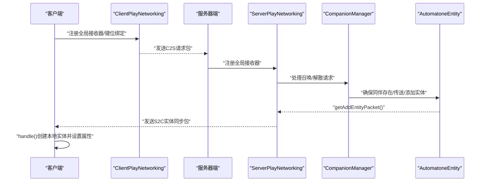
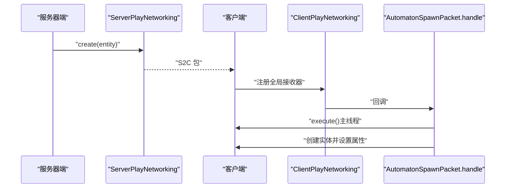
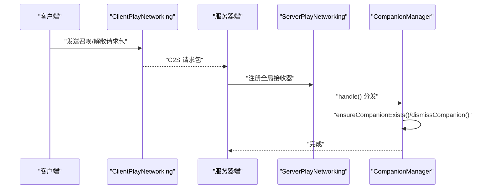
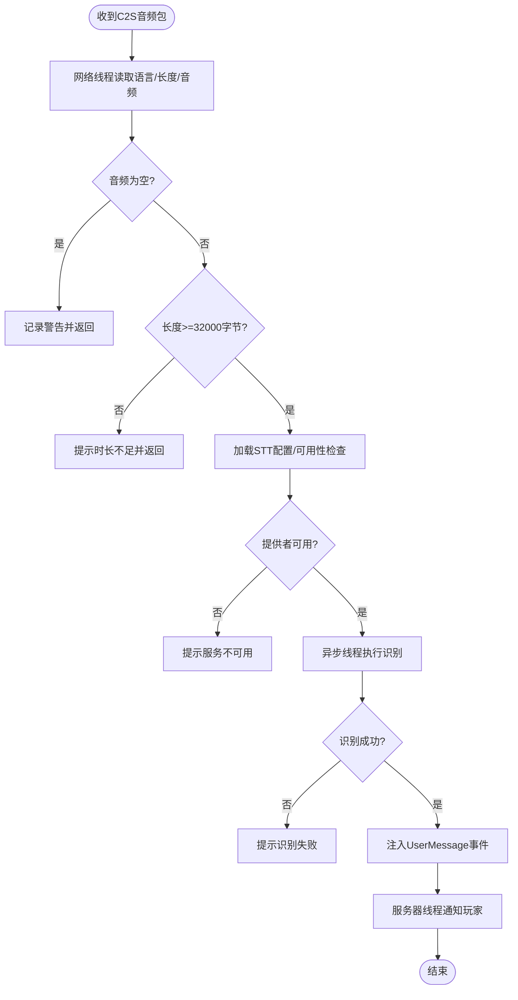
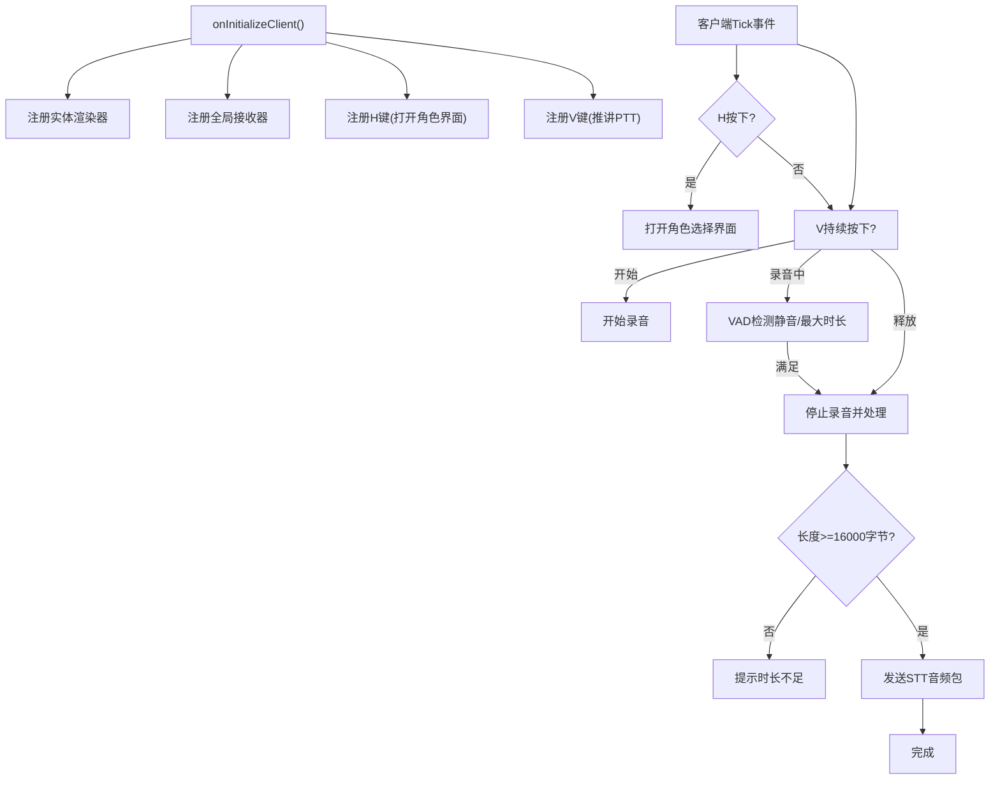
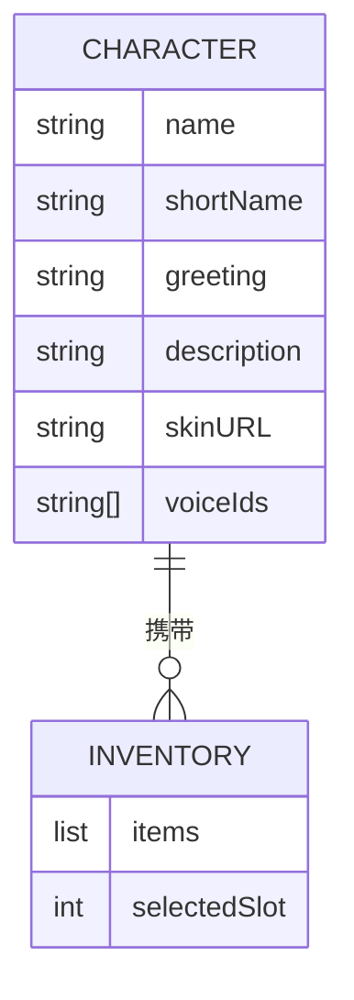
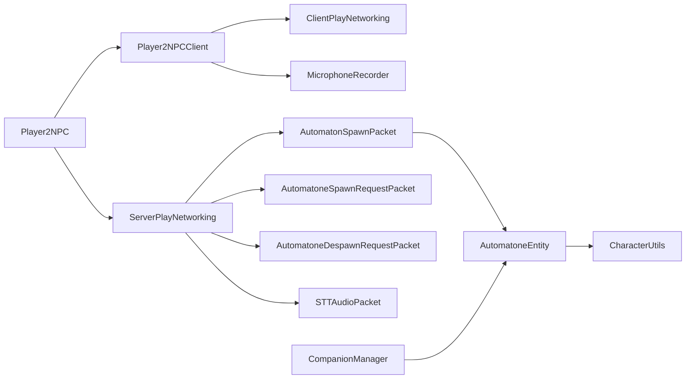

# 网络通信

<cite>
**本文引用的文件**
- [Player2NPC.java](file://src/main/java/com/goodbird/player2npc/Player2NPC.java)
- [Player2NPCClient.java](file://src/main/java/com/goodbird/player2npc/Player2NPCClient.java)
- [AutomatonSpawnPacket.java](file://src/main/java/com/goodbird/player2npc/network/AutomatonSpawnPacket.java)
- [AutomatoneSpawnRequestPacket.java](file://src/main/java/com/goodbird/player2npc/network/AutomatoneSpawnRequestPacket.java)
- [AutomatoneDespawnRequestPacket.java](file://src/main/java/com/goodbird/player2npc/network/AutomatoneDespawnRequestPacket.java)
- [STTAudioPacket.java](file://src/main/java/com/goodbird/player2npc/network/STTAudioPacket.java)
- [CompanionManager.java](file://src/main/java/com/goodbird/player2npc/companion/CompanionManager.java)
- [AutomatoneEntity.java](file://src/main/java/com/goodbird/player2npc/companion/AutomatoneEntity.java)
- [CharacterUtils.java](file://src/main/java/adris/altoclef/player2api/utils/CharacterUtils.java)
- [MicrophoneRecorder.java](file://src/main/java/com/goodbird/player2npc/client/audio/MicrophoneRecorder.java)
</cite>

## 目录
1. [简介](#简介)
2. [项目结构](#项目结构)
3. [核心组件](#核心组件)
4. [架构总览](#架构总览)
5. [详细组件分析](#详细组件分析)
6. [依赖关系分析](#依赖关系分析)
7. [性能考量](#性能考量)
8. [故障排查指南](#故障排查指南)
9. [结论](#结论)
10. [附录](#附录)

## 简介
本技术文档围绕网络通信系统展开，重点覆盖以下方面：
- 网络包协议与实现：以 AutomatonSpawnPacket 为代表的实体同步包、以 AutomatoneSpawnRequestPacket/DespawnRequestPacket 为代表的请求包，以及以 STTAudioPacket 为代表的语音识别数据包。
- 客户端集成 Player2NPCClient 的工作机制：键位绑定（H 打开角色选择界面；V 推讲 PTT）、事件处理流程（录音、自动停止、发送）、渲染注册与网络接收器注册。
- 协议规范与数据传输格式：各包字段定义、序列化/反序列化策略、最小长度阈值与安全校验。
- 安全性考虑：鉴权与令牌管理（由外部模块提供，本节概述其接入点）、网络线程与异步处理边界。
- 调试工具与诊断：日志记录、最小音频长度提示、错误反馈。
- 性能优化建议：压缩/量化策略、批量/合并策略、帧率与更新频率调优。

## 项目结构
该系统采用 Fabric API 的网络层进行客户端-服务器通信，并通过自定义网络包实现 AI NPC 的实体同步与语音识别功能。核心文件分布如下：
- 服务器端入口与实体类型注册：Player2NPC
- 客户端入口与键位绑定：Player2NPCClient
- 网络包定义与处理：
  - AutomatonSpawnPacket（S2C 实体同步）
  - AutomatoneSpawnRequestPacket（C2S 召唤请求）
  - AutomatoneDespawnRequestPacket（C2S 消失请求）
  - STTAudioPacket（C2S 音频流，S2S 处理）
- 实体与同伴管理：AutomatoneEntity、CompanionManager
- 序列化工具：CharacterUtils
- 音频采集：MicrophoneRecorder

图表来源
- [Player2NPCClient.java:36-124](file://src/main/java/com/goodbird/player2npc/Player2NPCClient.java#L36-L124)
- [Player2NPC.java:48-65](file://src/main/java/com/goodbird/player2npc/Player2NPC.java#L48-L65)
- [AutomatonSpawnPacket.java:26-120](file://src/main/java/com/goodbird/player2npc/network/AutomatonSpawnPacket.java#L26-L120)
- [AutomatoneSpawnRequestPacket.java:24-67](file://src/main/java/com/goodbird/player2npc/network/AutomatoneSpawnRequestPacket.java#L24-L67)
- [AutomatoneDespawnRequestPacket.java:21-65](file://src/main/java/com/goodbird/player2npc/network/AutomatoneDespawnRequestPacket.java#L21-L65)
- [STTAudioPacket.java:28-134](file://src/main/java/com/goodbird/player2npc/network/STTAudioPacket.java#L28-L134)
- [AutomatoneEntity.java:50-313](file://src/main/java/com/goodbird/player2npc/companion/AutomatoneEntity.java#L50-L313)
- [CompanionManager.java:28-191](file://src/main/java/com/goodbird/player2npc/companion/CompanionManager.java#L28-L191)
- [CharacterUtils.java:83-142](file://src/main/java/adris/altoclef/player2api/utils/CharacterUtils.java#L83-L142)
- [MicrophoneRecorder.java:21-200](file://src/main/java/com/goodbird/player2npc/client/audio/MicrophoneRecorder.java#L21-L200)

章节来源
- [Player2NPC.java:25-67](file://src/main/java/com/goodbird/player2npc/Player2NPC.java#L25-L67)
- [Player2NPCClient.java:23-164](file://src/main/java/com/goodbird/player2npc/Player2NPCClient.java#L23-L164)

## 核心组件
- 网络包与协议
  - AutomatonSpawnPacket：服务器向客户端广播 AI NPC 的位置、朝向、速度与角色信息，用于实体同步与显示。
  - AutomatoneSpawnRequestPacket / AutomatoneDespawnRequestPacket：客户端向服务器请求召唤或解散指定角色的同伴。
  - STTAudioPacket：客户端上传音频数据，服务器异步进行语音转文本并注入对话系统。
- 客户端集成
  - Player2NPCClient：注册实体渲染、网络接收器、键位绑定（H 打开角色选择；V 推讲），并负责录音与发送。
- 实体与同伴管理
  - AutomatoneEntity：AI NPC 实体，支持库存、交互、饥饿等接口，负责读写 NBT 与服务端控制器初始化。
  - CompanionManager：为每个玩家维护同伴映射，按分配的角色集合确保同伴存在或解散。
- 序列化工具
  - CharacterUtils：Character 对象在网络与 NBT 之间的序列化/反序列化。
- 音频采集
  - MicrophoneRecorder：按 16kHz、16bit、Mono 采集 PCM 音频，支持 VAD 自动停止与最大时长限制。

章节来源
- [AutomatonSpawnPacket.java:26-120](file://src/main/java/com/goodbird/player2npc/network/AutomatonSpawnPacket.java#L26-L120)
- [AutomatoneSpawnRequestPacket.java:24-67](file://src/main/java/com/goodbird/player2npc/network/AutomatoneSpawnRequestPacket.java#L24-L67)
- [AutomatoneDespawnRequestPacket.java:21-65](file://src/main/java/com/goodbird/player2npc/network/AutomatoneDespawnRequestPacket.java#L21-L65)
- [STTAudioPacket.java:28-134](file://src/main/java/com/goodbird/player2npc/network/STTAudioPacket.java#L28-L134)
- [Player2NPCClient.java:23-164](file://src/main/java/com/goodbird/player2npc/Player2NPCClient.java#L23-L164)
- [AutomatoneEntity.java:50-313](file://src/main/java/com/goodbird/player2npc/companion/AutomatoneEntity.java#L50-L313)
- [CompanionManager.java:28-191](file://src/main/java/com/goodbird/player2npc/companion/CompanionManager.java#L28-L191)
- [CharacterUtils.java:83-142](file://src/main/java/adris/altoclef/player2api/utils/CharacterUtils.java#L83-L142)
- [MicrophoneRecorder.java:21-200](file://src/main/java/com/goodbird/player2npc/client/audio/MicrophoneRecorder.java#L21-L200)

## 架构总览
客户端-服务器通信通过 Fabric 的 ServerPlayNetworking/ClientPlayNetworking 注册全局接收器，网络包使用 FriendlyByteBuf 进行序列化，实体同步包通过实体自身的 addEntityPacket 钩子发送。语音识别包在服务器端异步处理，避免阻塞网络线程。

图表来源
- [Player2NPC.java:52-54](file://src/main/java/com/goodbird/player2npc/Player2NPC.java#L52-L54)
- [AutomatoneSpawnRequestPacket.java:57-65](file://src/main/java/com/goodbird/player2npc/network/AutomatoneSpawnRequestPacket.java#L57-L65)
- [AutomatoneDespawnRequestPacket.java:56-63](file://src/main/java/com/goodbird/player2npc/network/AutomatoneDespawnRequestPacket.java#L56-L63)
- [AutomatoneEntity.java:298-302](file://src/main/java/com/goodbird/player2npc/companion/AutomatoneEntity.java#L298-L302)
- [AutomatonSpawnPacket.java:100-119](file://src/main/java/com/goodbird/player2npc/network/AutomatonSpawnPacket.java#L100-L119)

## 详细组件分析

### 网络包协议与处理机制

#### AutomatonSpawnPacket（S2C 实体同步）
- 设计目标：将服务器端 AI NPC 的状态（ID、UUID、位置、速度、朝向、角色、库存）打包下发至客户端，用于渲染与交互。
- 关键字段与序列化：
  - 整型 ID、UUID、三轴坐标（双精度）、三轴速度（短整型量化，回传时还原）、字节表示的 pitch/yaw（0-255 映射 0-360）。
  - 角色信息通过 CharacterUtils 的网络序列化方法写入/读取。
  - 库存通过 NBT 列表写入/读取。
- 客户端处理：
  - 在客户端主线程中创建本地实体，设置位置、朝向、速度与库存，最终 putNonPlayerEntity 注入世界。
- 性能与精度：
  - 速度采用 1/8000 的量化因子，限制 [-3.9, 3.9]，兼顾带宽与表现力。
  - 朝向采用 256 等分（1/256 圆）映射，减少冗余位。

图表来源
- [AutomatonSpawnPacket.java:70-93](file://src/main/java/com/goodbird/player2npc/network/AutomatonSpawnPacket.java#L70-L93)
- [AutomatonSpawnPacket.java:100-119](file://src/main/java/com/goodbird/player2npc/network/AutomatonSpawnPacket.java#L100-L119)

章节来源
- [AutomatonSpawnPacket.java:26-120](file://src/main/java/com/goodbird/player2npc/network/AutomatonSpawnPacket.java#L26-L120)

#### AutomatoneSpawnRequestPacket / AutomatoneDespawnRequestPacket（C2S 请求）
- 设计目标：客户端向服务器请求“召唤/解散”指定角色的同伴。
- 数据结构：仅包含 Character，通过 CharacterUtils 网络序列化。
- 服务器处理：
  - 召唤：CompanionManager.ensureCompanionExists，若已有则传送，否则创建并加入世界。
  - 解散：CompanionManager.dismissCompanion，按名称移除并丢弃实体。
- 错误处理：当 Character 为空时记录警告日志。

图表来源
- [AutomatoneSpawnRequestPacket.java:57-65](file://src/main/java/com/goodbird/player2npc/network/AutomatoneSpawnRequestPacket.java#L57-L65)
- [AutomatoneDespawnRequestPacket.java:56-63](file://src/main/java/com/goodbird/player2npc/network/AutomatoneDespawnRequestPacket.java#L56-L63)
- [CompanionManager.java:100-144](file://src/main/java/com/goodbird/player2npc/companion/CompanionManager.java#L100-L144)

章节来源
- [AutomatoneSpawnRequestPacket.java:24-67](file://src/main/java/com/goodbird/player2npc/network/AutomatoneSpawnRequestPacket.java#L24-L67)
- [AutomatoneDespawnRequestPacket.java:21-65](file://src/main/java/com/goodbird/player2npc/network/AutomatoneDespawnRequestPacket.java#L21-L65)
- [CompanionManager.java:28-191](file://src/main/java/com/goodbird/player2npc/companion/CompanionManager.java#L28-L191)

#### STTAudioPacket（C2S 音频识别）
- 协议格式（C2S）：UTF 语言字符串（最大长度 16）、VarInt 音频长度、字节数组。
- 客户端发送：Player2NPCClient 将录音结果写入缓冲区并发送。
- 服务器处理：
  - 网络线程读取基础字段后，立即启动异步线程执行 STT。
  - 异常与配置检查：禁用、未配置 API Key、服务不可用、音频过短（最小 32000 字节，约 1 秒）。
  - 成功后在服务器线程注入用户消息事件并通知玩家。

图表来源
- [STTAudioPacket.java:39-121](file://src/main/java/com/goodbird/player2npc/network/STTAudioPacket.java#L39-L121)

章节来源
- [STTAudioPacket.java:28-134](file://src/main/java/com/goodbird/player2npc/network/STTAudioPacket.java#L28-L134)
- [Player2NPCClient.java:150-162](file://src/main/java/com/goodbird/player2npc/Player2NPCClient.java#L150-L162)

### 客户端集成 Player2NPCClient
- 渲染注册：注册 AI NPC 实体渲染器。
- 键位绑定：
  - H：打开角色选择界面（CharacterSelectionScreen）。
  - V：推讲（PTT）。使用 GLFW 原生按键状态检测，绕过 Minecraft KeyMapping 的不稳定状态。
- 录音与发送：
  - MicrophoneRecorder：16kHz、16bit、Mono，支持 VAD 自动停止与最大时长限制。
  - 发送：写入 UTF 语言、VarInt 长度、字节数组，通过 ClientPlayNetworking 发送。

图表来源
- [Player2NPCClient.java:36-124](file://src/main/java/com/goodbird/player2npc/Player2NPCClient.java#L36-L124)
- [MicrophoneRecorder.java:62-153](file://src/main/java/com/goodbird/player2npc/client/audio/MicrophoneRecorder.java#L62-L153)

章节来源
- [Player2NPCClient.java:23-164](file://src/main/java/com/goodbird/player2npc/Player2NPCClient.java#L23-L164)
- [MicrophoneRecorder.java:21-200](file://src/main/java/com/goodbird/player2npc/client/audio/MicrophoneRecorder.java#L21-L200)

### 数据模型与序列化
- Character 对象在网络与 NBT 之间双向序列化，字段包括名称、简称、问候语、描述、皮肤 URL、声音 ID 数组。
- 库存序列化：通过 LivingEntityInventory.writeNbt/readNbt 的 ListTag 结构保存。

图表来源
- [CharacterUtils.java:83-142](file://src/main/java/adris/altoclef/player2api/utils/CharacterUtils.java#L83-L142)
- [AutomatoneEntity.java:118-162](file://src/main/java/com/goodbird/player2npc/companion/AutomatoneEntity.java#L118-L162)

章节来源
- [CharacterUtils.java:83-142](file://src/main/java/adris/altoclef/player2api/utils/CharacterUtils.java#L83-L142)
- [AutomatoneEntity.java:118-162](file://src/main/java/com/goodbird/player2npc/companion/AutomatoneEntity.java#L118-L162)

## 依赖关系分析
- 组件耦合
  - Player2NPC 作为入口，注册网络接收器与实体类型，耦合 CompanionManager 与网络包。
  - Player2NPCClient 依赖 MicrophoneRecorder、ClientPlayNetworking、键位系统。
  - AutomatoneEntity 依赖 CharacterUtils、AltoClefController、ConversationManager。
  - 网络包依赖 CharacterUtils 与 LivingEntityInventory 的序列化能力。
- 外部依赖
  - Fabric API 的 ServerPlayNetworking/ClientPlayNetworking。
  - Minecraft 的 FriendlyByteBuf、Packet、Entity 系统。
  - 日志框架 Log4j。

图表来源
- [Player2NPC.java:48-65](file://src/main/java/com/goodbird/player2npc/Player2NPC.java#L48-L65)
- [Player2NPCClient.java:36-124](file://src/main/java/com/goodbird/player2npc/Player2NPCClient.java#L36-L124)
- [AutomatonSpawnPacket.java:26-120](file://src/main/java/com/goodbird/player2npc/network/AutomatonSpawnPacket.java#L26-L120)
- [AutomatoneSpawnRequestPacket.java:24-67](file://src/main/java/com/goodbird/player2npc/network/AutomatoneSpawnRequestPacket.java#L24-L67)
- [AutomatoneDespawnRequestPacket.java:21-65](file://src/main/java/com/goodbird/player2npc/network/AutomatoneDespawnRequestPacket.java#L21-L65)
- [STTAudioPacket.java:28-134](file://src/main/java/com/goodbird/player2npc/network/STTAudioPacket.java#L28-L134)
- [AutomatoneEntity.java:50-313](file://src/main/java/com/goodbird/player2npc/companion/AutomatoneEntity.java#L50-L313)
- [CharacterUtils.java:83-142](file://src/main/java/adris/altoclef/player2api/utils/CharacterUtils.java#L83-L142)
- [CompanionManager.java:28-191](file://src/main/java/com/goodbird/player2npc/companion/CompanionManager.java#L28-L191)

章节来源
- [Player2NPC.java:25-67](file://src/main/java/com/goodbird/player2npc/Player2NPC.java#L25-L67)
- [Player2NPCClient.java:23-164](file://src/main/java/com/goodbird/player2npc/Player2NPCClient.java#L23-L164)

## 性能考量
- 速率与更新频率
  - 实体追踪范围与更新频率已在实体类型注册中设定，可通过参数调整以平衡性能与体验。
- 量化与带宽
  - 速度采用短整型量化（1/8000），朝向采用 0-255 映射，有效降低包体积。
- 异步处理
  - STT 识别在独立线程执行，避免阻塞网络线程与服务器主线程。
- I/O 与缓冲
  - 音频以块（约 100ms）读取，VAD 与最大时长限制减少无效数据传输。
- 建议
  - 可引入帧率控制与状态变更触发（仅在变化时发送）以进一步降低带宽。
  - 对频繁更新的状态（如库存）可考虑批量合并或差量更新。

[本节为通用性能讨论，无需具体文件引用]

## 故障排查指南
- 连接与握手
  - 若无法建立连接，请确认服务器已注册对应接收器与实体类型。
- 音频识别失败
  - 服务器端会检查配置是否启用、API Key 是否配置、服务是否可用；同时对过短音频给出明确提示。
  - 客户端最小长度阈值不同（PTT 为 16000 字节，STT 处理端为 32000 字节），请根据实际需求调整。
- PTT 无法录音
  - 确认麦克风可用性；若不可用，客户端会提示“麦克风不可用”。
  - 使用 GLFW 原生按键状态检测，避免因屏幕切换或焦点丢失导致的按键状态异常。
- 实体未显示
  - 确认服务器端已通过 getAddEntityPacket() 发送同步包，且客户端已注册接收器。
  - 检查角色分配与同伴管理逻辑，确保 ensureCompanionExists 已执行。
- 日志定位
  - 服务器端与客户端均使用 Log4j 记录关键事件与错误，便于快速定位问题。

章节来源
- [STTAudioPacket.java:39-121](file://src/main/java/com/goodbird/player2npc/network/STTAudioPacket.java#L39-L121)
- [Player2NPCClient.java:68-122](file://src/main/java/com/goodbird/player2npc/Player2NPCClient.java#L68-L122)
- [AutomatonSpawnPacket.java:100-119](file://src/main/java/com/goodbird/player2npc/network/AutomatonSpawnPacket.java#L100-L119)
- [CompanionManager.java:100-144](file://src/main/java/com/goodbird/player2npc/companion/CompanionManager.java#L100-L144)

## 结论
本网络通信系统通过 Fabric API 提供稳定可靠的客户端-服务器通道，结合自定义网络包实现了 AI NPC 的实体同步与语音识别功能。系统在协议设计上注重带宽与精度的平衡，在处理流程上强调异步与线程边界，配合完善的日志与错误提示，能够较好地支撑在 Minecraft 环境中的实时交互需求。后续可在状态变更触发、批量更新与配置化参数等方面继续优化。

[本节为总结性内容，无需具体文件引用]

## 附录

### 协议规范与数据传输格式
- AutomatonSpawnPacket（S2C）
  - 字段：varInt id、UUID、三轴 double 坐标、三个 short 速度（量化 1/8000）、两个 byte 朝向（0-255 映射 0-360）、角色对象（网络序列化）、NBT 库存列表。
- AutomatoneSpawnRequestPacket / AutomatoneDespawnRequestPacket（C2S）
  - 字段：角色对象（网络序列化）。
- STTAudioPacket（C2S）
  - 字段：UTF 语言（最大 16）、VarInt 长度、字节数组。
- 最小长度阈值
  - 客户端：PTT 最小 16000 字节（约 0.5 秒）。
  - 服务器端：STT 最小 32000 字节（约 1 秒）。

章节来源
- [AutomatonSpawnPacket.java:54-93](file://src/main/java/com/goodbird/player2npc/network/AutomatonSpawnPacket.java#L54-L93)
- [AutomatoneSpawnRequestPacket.java:36-49](file://src/main/java/com/goodbird/player2npc/network/AutomatoneSpawnRequestPacket.java#L36-L49)
- [AutomatoneDespawnRequestPacket.java:36-48](file://src/main/java/com/goodbird/player2npc/network/AutomatoneDespawnRequestPacket.java#L36-L48)
- [STTAudioPacket.java:42-45](file://src/main/java/com/goodbird/player2npc/network/STTAudioPacket.java#L42-L45)
- [Player2NPCClient.java:27-28](file://src/main/java/com/goodbird/player2npc/Player2NPCClient.java#L27-L28)

### 安全性考虑
- 鉴权与令牌管理：由外部模块提供认证流程与令牌存储，本系统通过 HTTP 工具类与令牌存储进行对接。
- 网络线程边界：STT 识别在独立线程执行，避免阻塞网络线程；服务器端通过 server.execute 回到主线程进行消息注入与通知。
- 输入校验：对空音频、过短音频、配置缺失等情况进行严格校验与提示。

章节来源
- [STTAudioPacket.java:66-121](file://src/main/java/com/goodbird/player2npc/network/STTAudioPacket.java#L66-L121)
- [Player2NPCClient.java:150-162](file://src/main/java/com/goodbird/player2npc/Player2NPCClient.java#L150-L162)