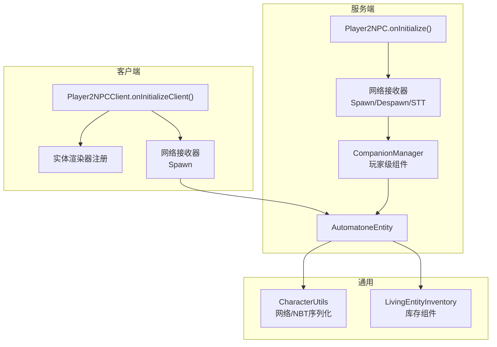
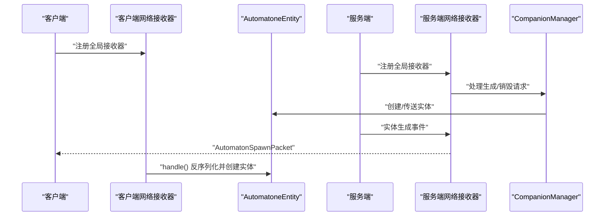
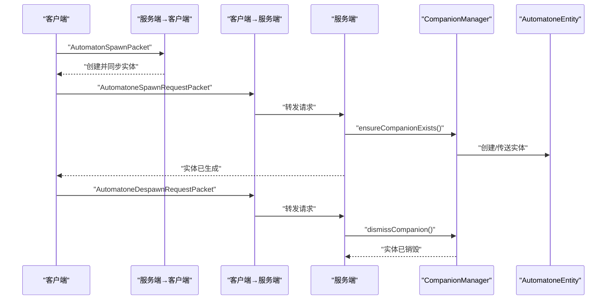
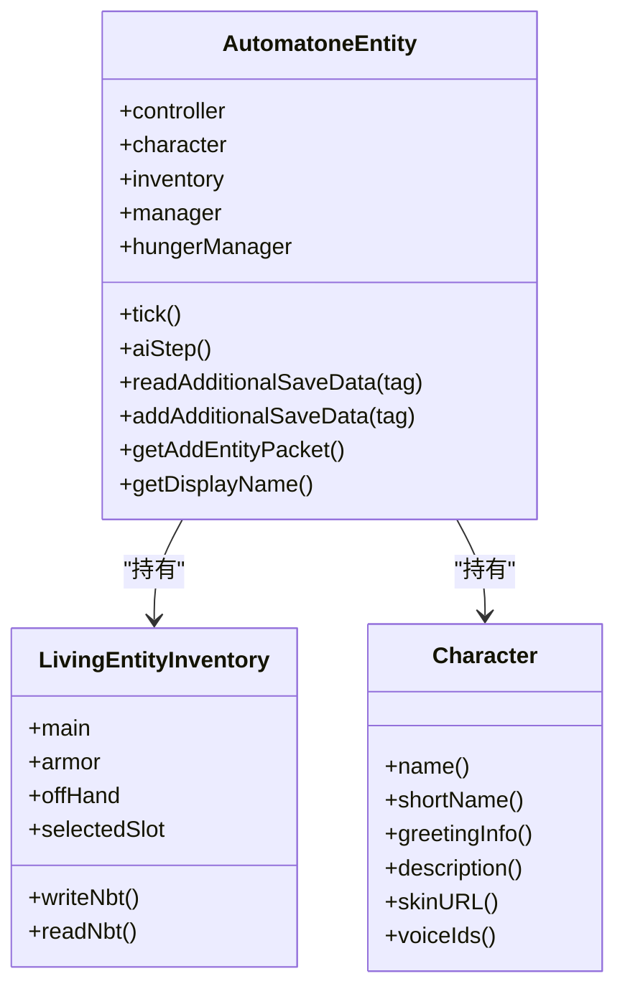
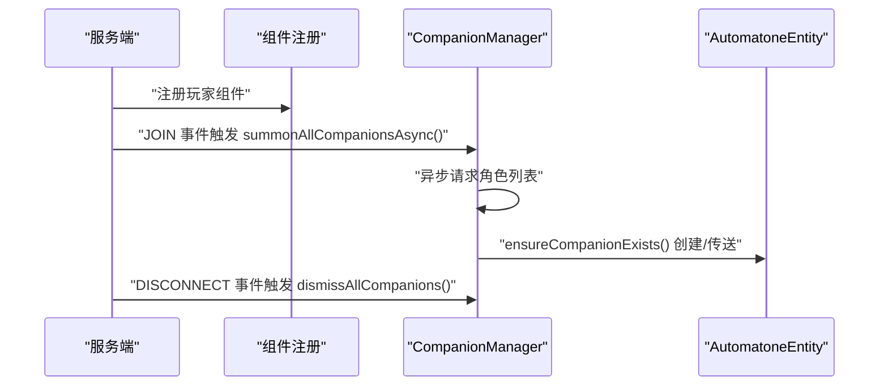
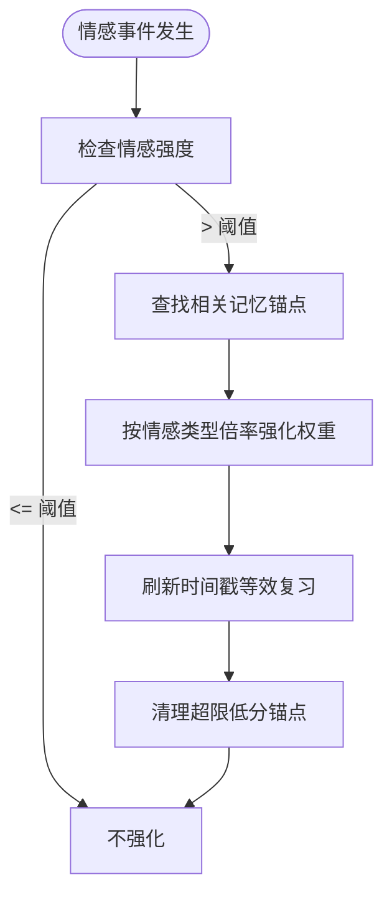
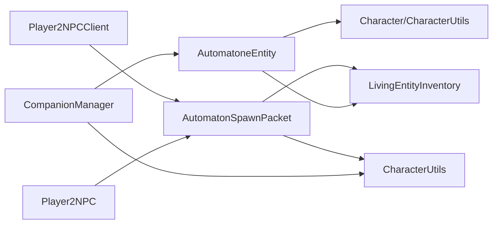

# 实体组件网络传输

<cite>
**本文引用的文件**
- [Player2NPC.java](file://src/main/java/com/goodbird/player2npc/Player2NPC.java)
- [Player2NPCClient.java](file://src/main/java/com/goodbird/player2npc/Player2NPCClient.java)
- [AutomatoneEntity.java](file://src/main/java/com/goodbird/player2npc/companion/AutomatoneEntity.java)
- [AutomatonSpawnPacket.java](file://src/main/java/com/goodbird/player2npc/network/AutomatonSpawnPacket.java)
- [AutomatoneSpawnRequestPacket.java](file://src/main/java/com/goodbird/player2npc/network/AutomatoneSpawnRequestPacket.java)
- [AutomatoneDespawnRequestPacket.java](file://src/main/java/com/goodbird/player2npc/network/AutomatoneDespawnRequestPacket.java)
- [STTAudioPacket.java](file://src/main/java/com/goodbird/player2npc/network/STTAudioPacket.java)
- [Player2NPCComponents.java](file://src/main/java/com/goodbird/player2npc/Player2NPCComponents.java)
- [CompanionManager.java](file://src/main/java/com/goodbird/player2npc/companion/CompanionManager.java)
- [CharacterUtils.java](file://src/main/java/adris/altoclef/player2api/utils/CharacterUtils.java)
- [LivingEntityInventory.java](file://src/main/java/baritone/api/entity/LivingEntityInventory.java)
- [EntityComponentKey.java](file://src/main/java/baritone/api/component/EntityComponentKey.java)
- [WorldComponentKey.java](file://src/main/java/baritone/api/component/WorldComponentKey.java)
- [AI_NPC项目整体架构概览.md](file://docs/AI_NPC项目整体架构概览.md)
- [AI_NPC灵魂特质交互优化方案.md](file://docs/AI_NPC灵魂特质交互优化方案.md)
</cite>

## 目录
1. [简介](#简介)
2. [项目结构](#项目结构)
3. [核心组件](#核心组件)
4. [架构总览](#架构总览)
5. [详细组件分析](#详细组件分析)
6. [依赖分析](#依赖分析)
7. [性能考量](#性能考量)
8. [故障排查指南](#故障排查指南)
9. [结论](#结论)
10. [附录](#附录)

## 简介
本技术文档聚焦“实体组件网络传输”，围绕 Cardinal Components API 在网络中的应用，系统阐述以下主题：
- 实体组件的序列化与反序列化机制
- 网络传输的数据格式与协议
- 状态同步策略与增量更新思路
- AutomatoneEntity 的组件系统设计（灵魂档案、情感状态、记忆锚点的网络传输与持久化）
- 组件注册的网络协议、数据变更通知机制、跨网络的一致性保障
- 自定义实体组件添加网络支持的方法、增量同步实现、网络冲突与数据竞争处理
- 性能优化策略与数据安全考虑

## 项目结构
本项目采用 Fabric + Cardinal Components API（CCA）的实体组件体系，结合自定义网络包实现 NPC 实体与玩家之间的网络同步。关键模块如下：
- 网络层：定义并注册网络包类型，负责客户端与服务端的消息收发
- 实体层：AutomatoneEntity 作为实体载体，承载控制器、角色、库存等组件
- 组件层：CompanionManager 作为玩家级组件，管理实体生命周期与持久化
- 序列化工具：CharacterUtils 提供 Character 的网络与 NBT 序列化
- 客户端渲染与交互：注册实体渲染器、按键绑定、全局网络接收器

**图表来源**
- [Player2NPC.java:48-66](file://src/main/java/com/goodbird/player2npc/Player2NPC.java#L48-L66)
- [Player2NPCClient.java:36-62](file://src/main/java/com/goodbird/player2npc/Player2NPCClient.java#L36-L62)
- [AutomatoneEntity.java:50-116](file://src/main/java/com/goodbird/player2npc/companion/AutomatoneEntity.java#L50-L116)
- [AutomatonSpawnPacket.java:26-98](file://src/main/java/com/goodbird/player2npc/network/AutomatonSpawnPacket.java#L26-L98)
- [AutomatoneSpawnRequestPacket.java:24-65](file://src/main/java/com/goodbird/player2npc/network/AutomatoneSpawnRequestPacket.java#L24-L65)
- [AutomatoneDespawnRequestPacket.java:21-64](file://src/main/java/com/goodbird/player2npc/network/AutomatoneDespawnRequestPacket.java#L21-L64)
- [STTAudioPacket.java:28-134](file://src/main/java/com/goodbird/player2npc/network/STTAudioPacket.java#L28-L134)
- [CharacterUtils.java:83-141](file://src/main/java/adris/altoclef/player2api/utils/CharacterUtils.java#L83-L141)
- [LivingEntityInventory.java:29-47](file://src/main/java/baritone/api/entity/LivingEntityInventory.java#L29-L47)

**章节来源**
- [Player2NPC.java:25-66](file://src/main/java/com/goodbird/player2npc/Player2NPC.java#L25-L66)
- [Player2NPCClient.java:30-62](file://src/main/java/com/goodbird/player2npc/Player2NPCClient.java#L30-L62)
- [AI_NPC项目整体架构概览.md:812-844](file://docs/AI_NPC项目整体架构概览.md#L812-L844)

## 核心组件
- 网络包与协议
  - SPAWN_PACKET_ID：服务端向客户端发送实体生成通知
  - SPAWN_REQUEST_PACKET_ID：客户端请求生成实体
  - DESPAWN_REQUEST_PACKET_ID：客户端请求销毁实体
  - STT_AUDIO_PACKET_ID：客户端上传音频，服务端进行语音转写
- 实体与组件
  - AutomatoneEntity：继承 LivingEntity，实现 IAutomatone/IInventoryProvider/IInteractionManagerProvider/IHungerManagerProvider，内置控制器、角色、库存与饥饿管理
  - CompanionManager：玩家级组件，管理实体的生成、传送、销毁与持久化
  - CharacterUtils：提供 Character 的网络与 NBT 序列化/反序列化
  - LivingEntityInventory：实体库存容器，支持读写 NBT、变更计数
- 组件注册
  - Player2NPCComponents：注册玩家级组件，使用 CCA 的 EntityComponentKey

**章节来源**
- [Player2NPC.java:29-36](file://src/main/java/com/goodbird/player2npc/Player2NPC.java#L29-L36)
- [AutomatoneEntity.java:50-116](file://src/main/java/com/goodbird/player2npc/companion/AutomatoneEntity.java#L50-L116)
- [CompanionManager.java:28-43](file://src/main/java/com/goodbird/player2npc/companion/CompanionManager.java#L28-L43)
- [CharacterUtils.java:83-141](file://src/main/java/adris/altoclef/player2api/utils/CharacterUtils.java#L83-L141)
- [LivingEntityInventory.java:29-47](file://src/main/java/baritone/api/entity/LivingEntityInventory.java#L29-L47)
- [Player2NPCComponents.java:10-16](file://src/main/java/com/goodbird/player2npc/Player2NPCComponents.java#L10-L16)

## 架构总览
网络传输以 Fabric 的 Packet API 为核心，服务端与客户端分别注册全局接收器；实体同步通过自定义网络包完成，组件状态通过 NBT 与 Character 的序列化实现持久化与跨会话恢复。

**图表来源**
- [Player2NPC.java:52-54](file://src/main/java/com/goodbird/player2npc/Player2NPC.java#L52-L54)
- [Player2NPCClient.java:40](file://src/main/java/com/goodbird/player2npc/Player2NPCClient.java#L40)
- [AutomatonSpawnPacket.java:100-119](file://src/main/java/com/goodbird/player2npc/network/AutomatonSpawnPacket.java#L100-L119)
- [AutomatoneSpawnRequestPacket.java:57-65](file://src/main/java/com/goodbird/player2npc/network/AutomatoneSpawnRequestPacket.java#L57-L65)
- [AutomatoneDespawnRequestPacket.java:56-63](file://src/main/java/com/goodbird/player2npc/network/AutomatoneDespawnRequestPacket.java#L56-L63)
- [CompanionManager.java:100-129](file://src/main/java/com/goodbird/player2npc/companion/CompanionManager.java#L100-L129)

## 详细组件分析

### 网络包与序列化机制
- AutomatonSpawnPacket
  - 服务端在实体生成时构造包，包含实体 ID、UUID、位置、速度、朝向、角色与库存
  - 客户端接收后反序列化，设置实体属性并放入世界
- AutomatoneSpawnRequestPacket / AutomatoneDespawnRequestPacket
  - 客户端向服务端发起生成/销毁请求，携带 Character 信息
  - 服务端在后台线程中调用 CompanionManager 确保实体存在或移除
- STTAudioPacket
  - 客户端上传音频字节流，服务端异步进行语音转写，并将结果注入对话系统

**图表来源**
- [AutomatonSpawnPacket.java:70-98](file://src/main/java/com/goodbird/player2npc/network/AutomatonSpawnPacket.java#L70-L98)
- [AutomatoneSpawnRequestPacket.java:40-54](file://src/main/java/com/goodbird/player2npc/network/AutomatoneSpawnRequestPacket.java#L40-L54)
- [AutomatoneDespawnRequestPacket.java:40-54](file://src/main/java/com/goodbird/player2npc/network/AutomatoneDespawnRequestPacket.java#L40-L54)
- [CompanionManager.java:100-129](file://src/main/java/com/goodbird/player2npc/companion/CompanionManager.java#L100-L129)

**章节来源**
- [AutomatonSpawnPacket.java:26-119](file://src/main/java/com/goodbird/player2npc/network/AutomatonSpawnPacket.java#L26-L119)
- [AutomatoneSpawnRequestPacket.java:24-65](file://src/main/java/com/goodbird/player2npc/network/AutomatoneSpawnRequestPacket.java#L24-L65)
- [AutomatoneDespawnRequestPacket.java:21-64](file://src/main/java/com/goodbird/player2npc/network/AutomatoneDespawnRequestPacket.java#L21-L64)
- [STTAudioPacket.java:39-121](file://src/main/java/com/goodbird/player2npc/network/STTAudioPacket.java#L39-L121)

### AutomatoneEntity 组件系统设计
- 组件接口实现
  - IAutomatone/IInventoryProvider/IInteractionManagerProvider/IHungerManagerProvider：为实体提供 AI 控制、库存、交互与饥饿管理能力
- 数据持久化
  - NBT 读写：保存头Yaw、库存、选中槽位、角色、所有者 UUID
  - 名称显示：优先使用角色短名
- 网络同步
  - getAddEntityPacket：重写为自定义 Spawn 包，确保客户端收到完整初始状态

**图表来源**
- [AutomatoneEntity.java:50-312](file://src/main/java/com/goodbird/player2npc/companion/AutomatoneEntity.java#L50-L312)
- [LivingEntityInventory.java:29-47](file://src/main/java/baritone/api/entity/LivingEntityInventory.java#L29-L47)
- [CharacterUtils.java:112-141](file://src/main/java/adris/altoclef/player2api/utils/CharacterUtils.java#L112-L141)

**章节来源**
- [AutomatoneEntity.java:78-162](file://src/main/java/com/goodbird/player2npc/companion/AutomatoneEntity.java#L78-L162)
- [AutomatoneEntity.java:298-312](file://src/main/java/com/goodbird/player2npc/companion/AutomatoneEntity.java#L298-L312)

### 组件注册与生命周期
- 组件注册
  - Player2NPCComponents 将 CompanionManager 注册为 ServerPlayer 的实体组件
- 生命周期事件
  - 登录：CompanionManager.summonAllCompanionsAsync() 异步拉取角色并生成实体
  - 断开：dismissAllCompanions() 清理实体
  - 服务器 Tick：驱动控制器与对话系统

**图表来源**
- [Player2NPCComponents.java:12-15](file://src/main/java/com/goodbird/player2npc/Player2NPCComponents.java#L12-L15)
- [Player2NPC.java:56-61](file://src/main/java/com/goodbird/player2npc/Player2NPC.java#L56-L61)
- [CompanionManager.java:45-74](file://src/main/java/com/goodbird/player2npc/companion/CompanionManager.java#L45-L74)
- [CompanionManager.java:100-129](file://src/main/java/com/goodbird/player2npc/companion/CompanionManager.java#L100-L129)
- [CompanionManager.java:146-150](file://src/main/java/com/goodbird/player2npc/companion/CompanionManager.java#L146-L150)

**章节来源**
- [Player2NPCComponents.java:10-16](file://src/main/java/com/goodbird/player2npc/Player2NPCComponents.java#L10-L16)
- [Player2NPC.java:48-66](file://src/main/java/com/goodbird/player2npc/Player2NPC.java#L48-L66)
- [CompanionManager.java:28-43](file://src/main/java/com/goodbird/player2npc/companion/CompanionManager.java#L28-L43)

### 灵魂档案与情感状态同步
- 灵魂档案（PersonaMatrix、Emotions、BehaviorSignature、MemoryAnchors、Relationships）
  - 通过 Character 与 SoulProfile 的组合在网络中传输与持久化
  - MemoryAnchor 支持情感权重、时间戳、永久锚点等字段，用于记忆强化与遗忘控制
- 情感强化机制
  - 高强度情感事件对相关记忆进行强化，提升记忆持久度

**图表来源**
- [AI_NPC灵魂特质交互优化方案.md:118-152](file://docs/AI_NPC灵魂特质交互优化方案.md#L118-L152)
- [AI_NPC灵魂特质交互优化方案.md:376-395](file://docs/AI_NPC灵魂特质交互优化方案.md#L376-L395)

**章节来源**
- [AI_NPC灵魂特质交互优化方案.md:118-152](file://docs/AI_NPC灵魂特质交互优化方案.md#L118-L152)
- [AI_NPC灵魂特质交互优化方案.md:376-395](file://docs/AI_NPC灵魂特质交互优化方案.md#L376-L395)

### 数据格式与协议细节
- AutomatonSpawnPacket 字段
  - VarInt: 实体 ID
  - UUID: 实体 UUID
  - 三个 Double: 位置坐标
  - 三个 Short: 速度分量（压缩）
  - 两个 Byte: 俯仰角、偏航角（压缩）
  - Character: 通过 CharacterUtils 序列化
  - Inventory: 通过 LivingEntityInventory 的 NBT 列表序列化
- AutomatoneSpawnRequestPacket / AutomatoneDespawnRequestPacket
  - 仅包含 Character，服务端据此操作实体生命周期
- STTAudioPacket
  - UTF: 语言
  - VarInt: 音频长度
  - Bytes: 音频数据

**章节来源**
- [AutomatonSpawnPacket.java:54-93](file://src/main/java/com/goodbird/player2npc/network/AutomatonSpawnPacket.java#L54-L93)
- [AutomatoneSpawnRequestPacket.java:36-49](file://src/main/java/com/goodbird/player2npc/network/AutomatoneSpawnRequestPacket.java#L36-L49)
- [AutomatoneDespawnRequestPacket.java:36-49](file://src/main/java/com/goodbird/player2npc/network/AutomatoneDespawnRequestPacket.java#L36-L49)
- [STTAudioPacket.java:19-27](file://src/main/java/com/goodbird/player2npc/network/STTAudioPacket.java#L19-L27)

### 组件注册的网络协议与一致性
- 组件注册
  - 使用 CCA 的 EntityComponentKey 与 ComponentRegistry，按玩家维度隔离组件状态
- 一致性保障
  - 服务端在 Tick 中处理组件状态变更，客户端通过 Spawn 包一次性同步初始状态
  - 对于库存等高频变更，建议引入增量同步（见后续章节）

**章节来源**
- [Player2NPCComponents.java:12-15](file://src/main/java/com/goodbird/player2npc/Player2NPCComponents.java#L12-L15)
- [EntityComponentKey.java:12-44](file://src/main/java/baritone/api/component/EntityComponentKey.java#L12-L44)
- [WorldComponentKey.java:9-20](file://src/main/java/baritone/api/component/WorldComponentKey.java#L9-L20)

## 依赖分析
- 组件耦合
  - AutomatoneEntity 依赖 LivingEntityInventory、Character、控制器
  - CompanionManager 依赖 CharacterUtils、Entity 生成/传送
  - 网络包依赖 CharacterUtils 与 LivingEntityInventory 的序列化
- 外部依赖
  - Fabric Networking API：PacketType、ServerPlayNetworking、ClientPlayNetworking
  - Cardinal Components API：EntityComponentKey、ComponentRegistry
  - Baritone：LivingEntityInventory、IAutomatone 等接口

**图表来源**
- [AutomatoneEntity.java:50-116](file://src/main/java/com/goodbird/player2npc/companion/AutomatoneEntity.java#L50-L116)
- [LivingEntityInventory.java:29-47](file://src/main/java/baritone/api/entity/LivingEntityInventory.java#L29-L47)
- [CharacterUtils.java:83-141](file://src/main/java/adris/altoclef/player2api/utils/CharacterUtils.java#L83-L141)
- [AutomatonSpawnPacket.java:26-98](file://src/main/java/com/goodbird/player2npc/network/AutomatonSpawnPacket.java#L26-L98)
- [Player2NPC.java:48-66](file://src/main/java/com/goodbird/player2npc/Player2NPC.java#L48-L66)
- [Player2NPCClient.java:36-62](file://src/main/java/com/goodbird/player2npc/Player2NPCClient.java#L36-L62)

**章节来源**
- [Player2NPC.java:48-66](file://src/main/java/com/goodbird/player2npc/Player2NPC.java#L48-L66)
- [Player2NPCClient.java:36-62](file://src/main/java/com/goodbird/player2npc/Player2NPCClient.java#L36-L62)
- [AutomatonSpawnPacket.java:26-98](file://src/main/java/com/goodbird/player2npc/network/AutomatonSpawnPacket.java#L26-L98)

## 性能考量
- 网络带宽优化
  - 速度与朝向采用压缩存储（Short/Byte），减少包体积
  - 音频最小长度校验，避免无效数据传输
- 异步处理
  - STT 转写在独立线程执行，避免阻塞网络线程
  - 组件加载与实体生成使用异步任务队列
- 内存与 GC
  - 避免频繁创建大型对象，复用 FriendlyByteBuf
  - 合理使用 NBT 结构，减少嵌套层级
- 同步频率
  - 服务端 Tick 设置为每 1 步一次，降低同步压力
  - 对高频状态（如库存）建议实现增量同步策略

[本节为通用指导，无需特定文件引用]

## 故障排查指南
- STT 识别失败
  - 检查配置文件是否启用 STT、API Key 是否正确
  - 确认音频长度满足最小要求（约 1 秒）
- 实体未生成
  - 确认客户端已注册网络接收器
  - 检查服务端是否成功创建实体并发送 Spawn 包
- 组件未持久化
  - 确认 NBT 读写方法是否正确调用
  - 检查玩家断开连接事件是否触发清理逻辑

**章节来源**
- [STTAudioPacket.java:39-121](file://src/main/java/com/goodbird/player2npc/network/STTAudioPacket.java#L39-L121)
- [Player2NPCClient.java:40](file://src/main/java/com/goodbird/player2npc/Player2NPCClient.java#L40)
- [Player2NPC.java:56-61](file://src/main/java/com/goodbird/player2npc/Player2NPC.java#L56-L61)
- [AutomatoneEntity.java:118-162](file://src/main/java/com/goodbird/player2npc/companion/AutomatoneEntity.java#L118-L162)
- [CompanionManager.java:177-191](file://src/main/java/com/goodbird/player2npc/companion/CompanionManager.java#L177-L191)

## 结论
本项目通过 Fabric 网络包与 Cardinal Components API，实现了 NPC 实体的高效网络传输与状态同步。核心要点包括：
- 使用自定义网络包承载实体初始状态与角色信息
- 通过 NBT 与 CharacterUtils 实现跨会话持久化
- 以组件化方式管理实体生命周期与行为
- 采用异步与压缩策略优化网络性能
未来可在库存与行为状态上引入增量同步与冲突解决机制，进一步提升大规模场景下的稳定性与性能。

[本节为总结，无需特定文件引用]

## 附录

### 如何为自定义实体组件添加网络支持
- 定义网络包
  - 实现 FabricPacket，包含序列化/反序列化方法
  - 在服务端注册全局接收器，在客户端注册全局接收器
- 组件注册
  - 使用 CCA 的 EntityComponentKey 与 ComponentRegistry 注册组件
- 状态同步
  - 在 Tick 或事件中收集变更，构造增量包发送
  - 客户端接收后应用到本地组件

**章节来源**
- [AutomatonSpawnPacket.java:26-98](file://src/main/java/com/goodbird/player2npc/network/AutomatonSpawnPacket.java#L26-L98)
- [Player2NPC.java:52-54](file://src/main/java/com/goodbird/player2npc/Player2NPC.java#L52-L54)
- [Player2NPCClient.java:40](file://src/main/java/com/goodbird/player2npc/Player2NPCClient.java#L40)
- [Player2NPCComponents.java:12-15](file://src/main/java/com/goodbird/player2npc/Player2NPCComponents.java#L12-L15)

### 如何实现组件数据的增量同步
- 变更追踪
  - 为组件维护变更计数或版本号
- 增量包
  - 仅发送变更字段，客户端合并应用
- 冲突解决
  - 基于时间戳或版本号的向量时钟策略
  - 服务端仲裁，客户端回滚或重放

[本节为通用指导，无需特定文件引用]

### 如何处理网络冲突与数据竞争
- 幂等性
  - 服务端对接收的操作进行幂等校验
- 顺序与确认
  - 为关键操作引入序列号与确认机制
- 回滚与重放
  - 客户端记录快照，必要时回滚到最近一致状态

[本节为通用指导，无需特定文件引用]

### 数据安全考虑
- 音频与隐私
  - STT 仅在启用且配置正确的前提下处理
  - 音频长度阈值防止滥用
- 认证与授权
  - 网络包处理中验证来源玩家身份
- 配置保护
  - API Key 等敏感信息避免明文泄露

**章节来源**
- [STTAudioPacket.java:66-90](file://src/main/java/com/goodbird/player2npc/network/STTAudioPacket.java#L66-L90)
- [STTAudioPacket.java:126-132](file://src/main/java/com/goodbird/player2npc/network/STTAudioPacket.java#L126-L132)