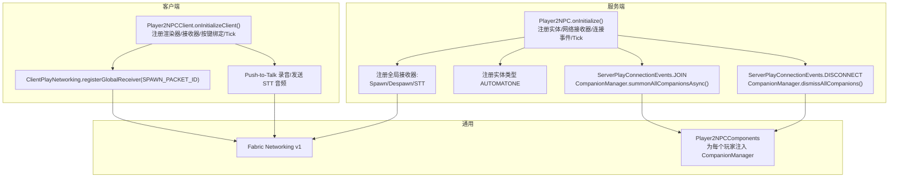
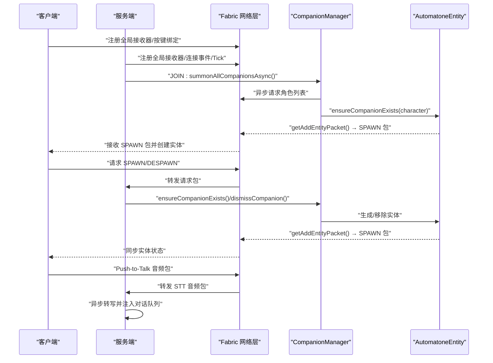
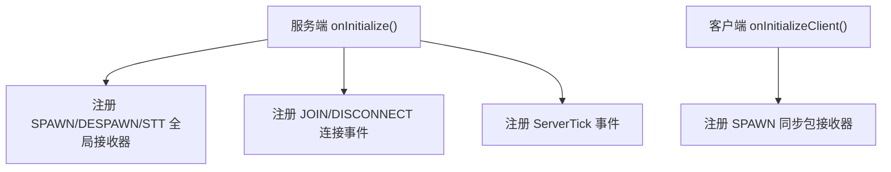
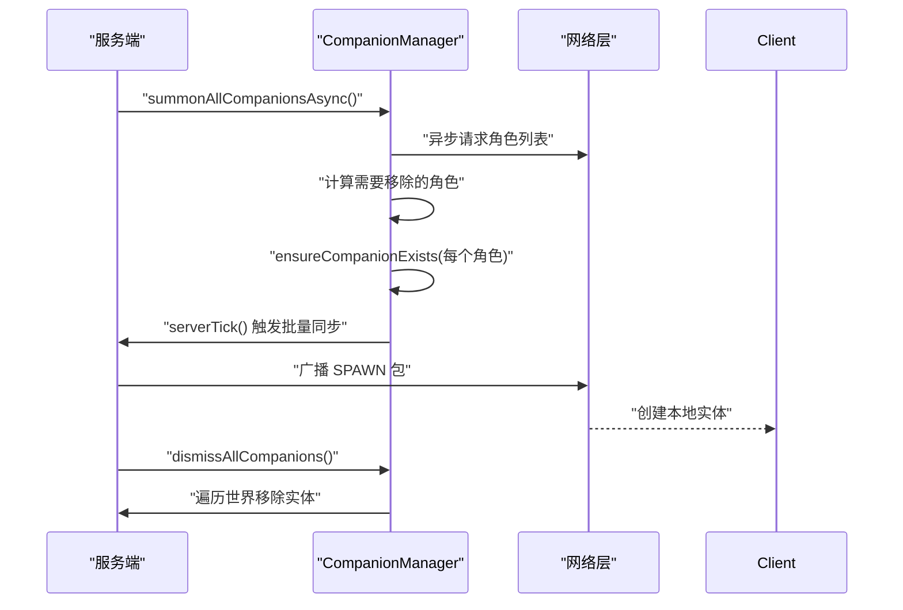
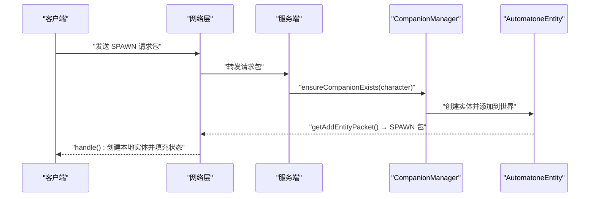
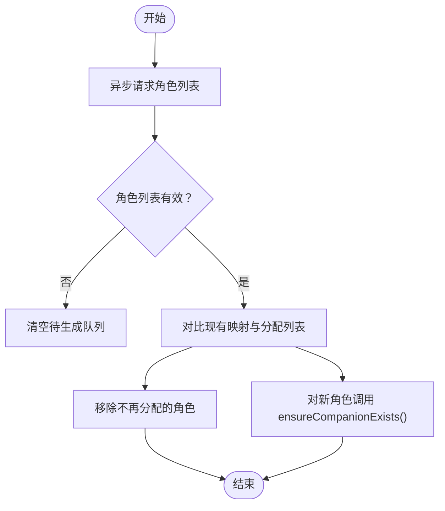
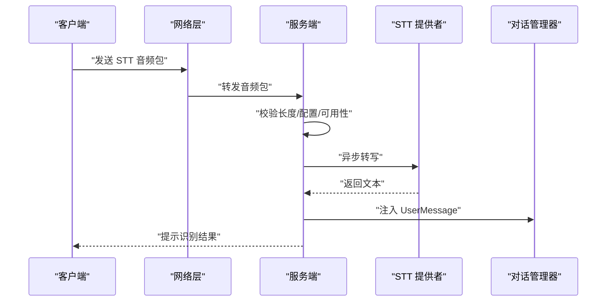
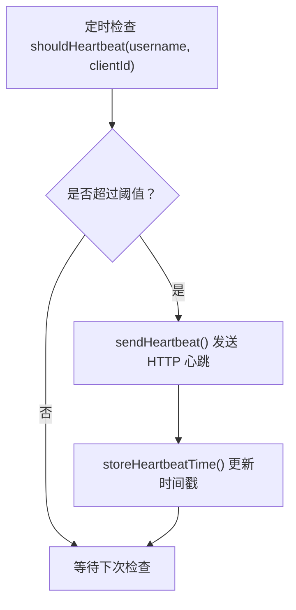
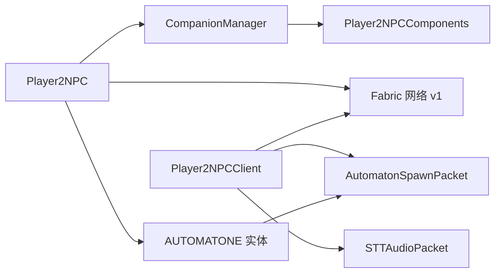

# 客户端-服务端同步机制

<cite>
**本文引用的文件**
- [Player2NPC.java](file://src/main/java/com/goodbird/player2npc/Player2NPC.java)
- [Player2NPCClient.java](file://src/main/java/com/goodbird/player2npc/Player2NPCClient.java)
- [AutomatonSpawnPacket.java](file://src/main/java/com/goodbird/player2npc/network/AutomatonSpawnPacket.java)
- [AutomatoneSpawnRequestPacket.java](file://src/main/java/com/goodbird/player2npc/network/AutomatoneSpawnRequestPacket.java)
- [AutomatoneDespawnRequestPacket.java](file://src/main/java/com/goodbird/player2npc/network/AutomatoneDespawnRequestPacket.java)
- [STTAudioPacket.java](file://src/main/java/com/goodbird/player2npc/network/STTAudioPacket.java)
- [CompanionManager.java](file://src/main/java/com/goodbird/player2npc/companion/CompanionManager.java)
- [AutomatoneEntity.java](file://src/main/java/com/goodbird/player2npc/companion/AutomatoneEntity.java)
- [Player2NPCComponents.java](file://src/main/java/com/goodbird/player2npc/Player2NPCComponents.java)
- [HeartbeatManager.java](file://src/main/java/adris/altoclef/player2api/manager/HeartbeatManager.java)
- [Player2APIService.java](file://src/main/java/adris/altoclef/player2api/Player2APIService.java)
- [ClientConnectionAccessor.java](file://src/main/java/adris/altoclef/mixins/ClientConnectionAccessor.java)
- [AI_NPC项目整体架构概览.md](file://docs/AI_NPC项目整体架构概览.md)
</cite>

## 目录
1. [引言](#引言)
2. [项目结构](#项目结构)
3. [核心组件](#核心组件)
4. [架构总览](#架构总览)
5. [详细组件分析](#详细组件分析)
6. [依赖分析](#依赖分析)
7. [性能考虑](#性能考虑)
8. [故障排查指南](#故障排查指南)
9. [结论](#结论)
10. [附录](#附录)

## 引言
本文件面向希望理解并实现可靠客户端-服务端同步机制的开发者，围绕 Fabric 网络系统在本项目中的应用进行深入解析。重点涵盖：
- 全局接收器的注册与管理
- 连接事件（JOIN/DISCONNECT）的处理机制
- 状态同步（实体出生/移动/装备/对话）的实现策略
- 玩家连接与断开时的同步流程（JOIN/DISCONNECT 事件、NPC 自动召唤与移除）
- 心跳包与连接超时处理
- 网络异常恢复机制
- 性能优化建议与故障排查

## 项目结构
本项目采用 Fabric 生态的模块化组织方式，服务端与客户端分别通过各自的入口初始化网络接收器、实体注册与连接事件监听；同时通过 CCA（Custom Component API）为每个玩家注入独立的同伴管理器，确保多玩家隔离与可扩展性。

图表来源
- [Player2NPC.java:48-66](file://src/main/java/com/goodbird/player2npc/Player2NPC.java#L48-L66)
- [Player2NPCClient.java:36-124](file://src/main/java/com/goodbird/player2npc/Player2NPCClient.java#L36-L124)
- [Player2NPCComponents.java:10-16](file://src/main/java/com/goodbird/player2npc/Player2NPCComponents.java#L10-L16)

章节来源
- [Player2NPC.java:48-66](file://src/main/java/com/goodbird/player2npc/Player2NPC.java#L48-L66)
- [Player2NPCClient.java:36-124](file://src/main/java/com/goodbird/player2npc/Player2NPCClient.java#L36-L124)
- [Player2NPCComponents.java:10-16](file://src/main/java/com/goodbird/player2npc/Player2NPCComponents.java#L10-L16)

## 核心组件
- 网络包与协议
  - SPAWN 请求包：客户端请求服务端生成 NPC 实体
  - DESPAWN 请求包：客户端请求服务端移除 NPC 实体
  - SPAWN 同步包：服务端向客户端广播 NPC 实体的完整状态
  - STT 音频包：客户端向服务端发送音频，服务端异步转写并注入对话队列
- 实体与状态
  - AUTOMATONE 实体：承载控制器、库存、交互与饥饿管理，负责服务端 Tick 与客户端渲染
  - CompanionManager：按玩家维度管理已拥有的 NPC 列表，负责召唤/移除/持久化
- 事件与生命周期
  - JOIN/DISCONNECT：连接建立/断开时触发 NPC 的批量同步与清理
  - ServerTick：服务端每 tick 调用主控制器以推进任务与对话
- 健康与心跳
  - HeartbeatManager：基于用户名+clientId 的键空间记录上次心跳时间，周期性触发心跳
  - Player2APIService：封装 HTTP 心跳调用与错误处理

章节来源
- [AutomatoneSpawnRequestPacket.java:24-66](file://src/main/java/com/goodbird/player2npc/network/AutomatoneSpawnRequestPacket.java#L24-L66)
- [AutomatoneDespawnRequestPacket.java:21-65](file://src/main/java/com/goodbird/player2npc/network/AutomatoneDespawnRequestPacket.java#L21-L65)
- [AutomatonSpawnPacket.java:26-120](file://src/main/java/com/goodbird/player2npc/network/AutomatonSpawnPacket.java#L26-L120)
- [STTAudioPacket.java:28-134](file://src/main/java/com/goodbird/player2npc/network/STTAudioPacket.java#L28-L134)
- [AutomatoneEntity.java:50-313](file://src/main/java/com/goodbird/player2npc/companion/AutomatoneEntity.java#L50-L313)
- [CompanionManager.java:28-191](file://src/main/java/com/goodbird/player2npc/companion/CompanionManager.java#L28-L191)
- [HeartbeatManager.java:22-46](file://src/main/java/adris/altoclef/player2api/manager/HeartbeatManager.java#L22-L46)
- [Player2APIService.java:258-274](file://src/main/java/adris/altoclef/player2api/Player2APIService.java#L258-L274)

## 架构总览
下图展示了从玩家连接到实体同步、再到语音识别与心跳的整体流程。

图表来源
- [Player2NPC.java:48-66](file://src/main/java/com/goodbird/player2npc/Player2NPC.java#L48-L66)
- [Player2NPCClient.java:36-124](file://src/main/java/com/goodbird/player2npc/Player2NPCClient.java#L36-L124)
- [AutomatonSpawnPacket.java:26-120](file://src/main/java/com/goodbird/player2npc/network/AutomatonSpawnPacket.java#L26-L120)
- [AutomatoneSpawnRequestPacket.java:24-66](file://src/main/java/com/goodbird/player2npc/network/AutomatoneSpawnRequestPacket.java#L24-L66)
- [AutomatoneDespawnRequestPacket.java:21-65](file://src/main/java/com/goodbird/player2npc/network/AutomatoneDespawnRequestPacket.java#L21-L65)
- [STTAudioPacket.java:28-134](file://src/main/java/com/goodbird/player2npc/network/STTAudioPacket.java#L28-L134)
- [CompanionManager.java:45-191](file://src/main/java/com/goodbird/player2npc/companion/CompanionManager.java#L45-L191)
- [AutomatoneEntity.java:298-312](file://src/main/java/com/goodbird/player2npc/companion/AutomatoneEntity.java#L298-L312)

## 详细组件分析

### 全局接收器注册与管理
- 服务端在初始化时注册三类全局接收器：
  - SPAWN 请求包：用于客户端请求生成 NPC
  - DESPAWN 请求包：用于客户端请求移除 NPC
  - STT 音频包：用于客户端上传音频并触发服务端转写
- 客户端注册 SPAWN 同步包接收器，用于在服务端同步实体状态时创建本地实体

图表来源
- [Player2NPC.java:48-66](file://src/main/java/com/goodbird/player2npc/Player2NPC.java#L48-L66)
- [Player2NPCClient.java:36-124](file://src/main/java/com/goodbird/player2npc/Player2NPCClient.java#L36-L124)

章节来源
- [Player2NPC.java:48-66](file://src/main/java/com/goodbird/player2npc/Player2NPC.java#L48-L66)
- [Player2NPCClient.java:36-124](file://src/main/java/com/goodbird/player2npc/Player2NPCClient.java#L36-L124)

### 连接事件处理：JOIN 与 DISCONNECT
- JOIN：服务端在连接建立后，异步拉取该玩家的角色列表，并根据分配的角色批量生成对应 NPC 实体；若角色列表为空或拉取失败，则清空待生成队列
- DISCONNECT：服务端在连接断开时，移除该玩家的所有 NPC 实体，避免残留

图表来源
- [Player2NPC.java:56-61](file://src/main/java/com/goodbird/player2npc/Player2NPC.java#L56-L61)
- [CompanionManager.java:45-191](file://src/main/java/com/goodbird/player2npc/companion/CompanionManager.java#L45-L191)

章节来源
- [Player2NPC.java:56-61](file://src/main/java/com/goodbird/player2npc/Player2NPC.java#L56-L61)
- [CompanionManager.java:45-191](file://src/main/java/com/goodbird/player2npc/companion/CompanionManager.java#L45-L191)

### 状态同步：实体出生、移动与装备
- SPAWN 请求包（C2S）：客户端发送角色信息，服务端确保实体存在并生成
- SPAWN 同步包（S2C）：服务端在实体创建后，通过 getAddEntityPacket() 返回 SPAWN 包，客户端据此创建本地实体并设置位置、朝向、速度、角色与库存
- 实体状态压缩：位置使用双精度，速度按固定比例量化，朝向以字节编码，库存使用 NBT 列表

图表来源
- [AutomatoneSpawnRequestPacket.java:57-66](file://src/main/java/com/goodbird/player2npc/network/AutomatoneSpawnRequestPacket.java#L57-L66)
- [AutomatonSpawnPacket.java:100-120](file://src/main/java/com/goodbird/player2npc/network/AutomatonSpawnPacket.java#L100-L120)
- [AutomatoneEntity.java:298-302](file://src/main/java/com/goodbird/player2npc/companion/AutomatoneEntity.java#L298-L302)

章节来源
- [AutomatoneSpawnRequestPacket.java:24-66](file://src/main/java/com/goodbird/player2npc/network/AutomatoneSpawnRequestPacket.java#L24-L66)
- [AutomatonSpawnPacket.java:26-120](file://src/main/java/com/goodbird/player2npc/network/AutomatonSpawnPacket.java#L26-L120)
- [AutomatoneEntity.java:298-312](file://src/main/java/com/goodbird/player2npc/companion/AutomatoneEntity.java#L298-L312)

### NPC 自动召唤与移除机制
- 角色分配：通过 CharacterUtils 异步请求角色列表，服务端在回调中更新分配结果
- 召唤策略：对每个角色调用 ensureCompanionExists，若实体已存在且存活则传送至玩家附近，否则新建实体并添加到世界
- 移除策略：对不在分配列表中的角色执行 dismissCompanion，遍历所有世界查找并丢弃实体

图表来源
- [CompanionManager.java:45-98](file://src/main/java/com/goodbird/player2npc/companion/CompanionManager.java#L45-L98)

章节来源
- [CompanionManager.java:45-191](file://src/main/java/com/goodbird/player2npc/companion/CompanionManager.java#L45-L191)

### 语音识别与对话注入（STT）
- 客户端 Push-to-Talk：长按 V 键录音，满足最小长度阈值后发送音频包
- 服务端处理：读取语言、长度与音频数据，校验长度与配置，异步调用 STT 提供者进行转写
- 对话注入：将识别结果作为用户消息注入对话管理器，通知玩家并在聊天中显示

图表来源
- [Player2NPCClient.java:150-162](file://src/main/java/com/goodbird/player2npc/Player2NPCClient.java#L150-L162)
- [STTAudioPacket.java:39-121](file://src/main/java/com/goodbird/player2npc/network/STTAudioPacket.java#L39-L121)

章节来源
- [Player2NPCClient.java:64-123](file://src/main/java/com/goodbird/player2npc/Player2NPCClient.java#L64-L123)
- [STTAudioPacket.java:28-134](file://src/main/java/com/goodbird/player2npc/network/STTAudioPacket.java#L28-L134)

### 心跳包与连接超时处理
- 心跳触发：HeartbeatManager 使用“用户名:clientId”作为键，记录上次心跳时间；当当前时间与上次时间差超过阈值（约 60 秒）时触发
- 心跳发送：Player2APIService 调用 HTTP 接口发送心跳，成功后更新存储的时间戳
- 连接超时：可通过心跳失败次数或外部监控策略判定超时；建议结合网络层的连接状态与日志进行综合判断

图表来源
- [HeartbeatManager.java:30-41](file://src/main/java/adris/altoclef/player2api/manager/HeartbeatManager.java#L30-L41)
- [Player2APIService.java:258-274](file://src/main/java/adris/altoclef/player2api/Player2APIService.java#L258-L274)

章节来源
- [HeartbeatManager.java:22-46](file://src/main/java/adris/altoclef/player2api/manager/HeartbeatManager.java#L22-L46)
- [Player2APIService.java:258-274](file://src/main/java/adris/altoclef/player2api/Player2APIService.java#L258-L274)

### 网络异常恢复机制
- STT 失败处理：服务端捕获异常并回显错误信息给玩家，避免阻塞网络线程
- 音频长度校验：短音频直接拒绝并提示，减少无效负载
- 异步处理：STT 在独立线程执行，完成后通过 server.execute 回到服务器线程注入消息
- 建议：在网络异常时，客户端可重试发送 STT 包或延迟重连；服务端可增加失败计数与退避策略

章节来源
- [STTAudioPacket.java:113-121](file://src/main/java/com/goodbird/player2npc/network/STTAudioPacket.java#L113-L121)
- [Player2NPCClient.java:83-98](file://src/main/java/com/goodbird/player2npc/Player2NPCClient.java#L83-L98)

## 依赖分析
- 组件耦合
  - Player2NPC 作为服务端入口，集中注册网络接收器与连接事件，依赖 CompanionManager 与实体类型
  - Player2NPCClient 作为客户端入口，注册渲染器与接收器，依赖 AutomatonSpawnPacket 与 STT 发送
  - CompanionManager 通过 CCA 注入到每个 ServerPlayer，持有玩家专属的 NPC 映射
  - AutomatoneEntity 仅在服务端构造控制器与推进任务，在客户端仅负责渲染
- 外部依赖
  - Fabric Networking v1：全局接收器、C2S/S2C 包收发
  - CCA（Custom Component API）：为玩家注入 CompanionManager
  - Mixin：访问底层连接 tick 计数（用于调试/诊断）

图表来源
- [Player2NPC.java:48-66](file://src/main/java/com/goodbird/player2npc/Player2NPC.java#L48-L66)
- [Player2NPCClient.java:36-124](file://src/main/java/com/goodbird/player2npc/Player2NPCClient.java#L36-L124)
- [Player2NPCComponents.java:10-16](file://src/main/java/com/goodbird/player2npc/Player2NPCComponents.java#L10-L16)
- [AutomatonSpawnPacket.java:26-120](file://src/main/java/com/goodbird/player2npc/network/AutomatonSpawnPacket.java#L26-L120)
- [STTAudioPacket.java:28-134](file://src/main/java/com/goodbird/player2npc/network/STTAudioPacket.java#L28-L134)

章节来源
- [Player2NPC.java:48-66](file://src/main/java/com/goodbird/player2npc/Player2NPC.java#L48-L66)
- [Player2NPCClient.java:36-124](file://src/main/java/com/goodbird/player2npc/Player2NPCClient.java#L36-L124)
- [Player2NPCComponents.java:10-16](file://src/main/java/com/goodbird/player2npc/Player2NPCComponents.java#L10-L16)
- [AutomatonSpawnPacket.java:26-120](file://src/main/java/com/goodbird/player2npc/network/AutomatonSpawnPacket.java#L26-L120)
- [STTAudioPacket.java:28-134](file://src/main/java/com/goodbird/player2npc/network/STTAudioPacket.java#L28-L134)

## 性能考虑
- 网络包体积控制
  - 速度与朝向采用量化/缩放编码，减少带宽占用
  - 库存使用 NBT 列表，建议在高并发场景下限制同步频率或分批传输
- 异步处理
  - STT 在独立线程执行，避免阻塞服务器线程
  - 角色列表拉取与实体批量生成使用 CompletableFuture，降低主线程压力
- Tick 与事件
  - 服务端每 tick 调用主控制器推进任务与对话，建议在控制器内部做增量更新与缓存
- 客户端渲染
  - SPAWN 包仅包含必要字段，客户端创建实体后立即同步，减少额外同步轮次

## 故障排查指南
- STT 无法识别
  - 检查音频长度是否低于阈值，确认语言参数与 STT 配置可用
  - 查看服务端日志中“STT provider not available”或“API Key 未配置”的提示
- 音频发送失败
  - 客户端检查麦克风可用性与按键绑定状态
  - 服务端确认网络接收器已注册且未被其他模块覆盖
- 实体不同步
  - 确认 SPAWN 请求包与 SPAWN 同步包均被正确注册
  - 检查服务端实体添加逻辑与客户端 handle() 中的实体创建流程
- 连接抖动导致的心跳失败
  - 增加心跳失败计数与退避策略，结合网络层连接状态进行降级处理
- 连接超时定位
  - 使用 ClientConnectionAccessor 获取底层连接 tick 计数，辅助判断网络层异常

章节来源
- [STTAudioPacket.java:66-121](file://src/main/java/com/goodbird/player2npc/network/STTAudioPacket.java#L66-L121)
- [Player2NPCClient.java:64-123](file://src/main/java/com/goodbird/player2npc/Player2NPCClient.java#L64-L123)
- [AutomatonSpawnPacket.java:100-120](file://src/main/java/com/goodbird/player2npc/network/AutomatonSpawnPacket.java#L100-L120)
- [HeartbeatManager.java:30-41](file://src/main/java/adris/altoclef/player2api/manager/HeartbeatManager.java#L30-L41)
- [ClientConnectionAccessor.java:7-11](file://src/main/java/adris/altoclef/mixins/ClientConnectionAccessor.java#L7-L11)

## 结论
本项目的客户端-服务端同步机制以 Fabric 网络层为核心，通过全局接收器、连接事件与实体包实现可靠的跨端状态同步；配合心跳与异步处理保障了在不稳定网络环境下的鲁棒性。通过 CCA 为每个玩家注入独立的同伴管理器，实现了多玩家隔离与可扩展的 NPC 生命周期管理。建议在生产环境中进一步完善失败重试、限流与缓存策略，以提升整体性能与稳定性。

## 附录
- 启动与连接流程参考：[AI_NPC项目整体架构概览.md](file://docs/AI_NPC项目整体架构概览.md)，其中包含服务端/客户端入口、网络接收器注册、连接事件与 Tick 注册的详细时序说明

章节来源
- [AI_NPC项目整体架构概览.md:951-1025](file://docs/AI_NPC项目整体架构概览.md#L951-L1025)