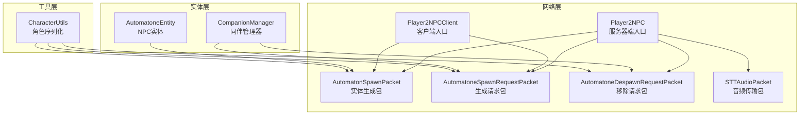
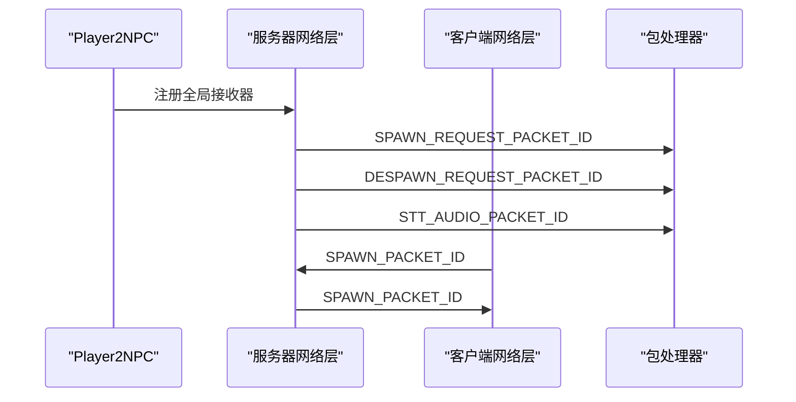
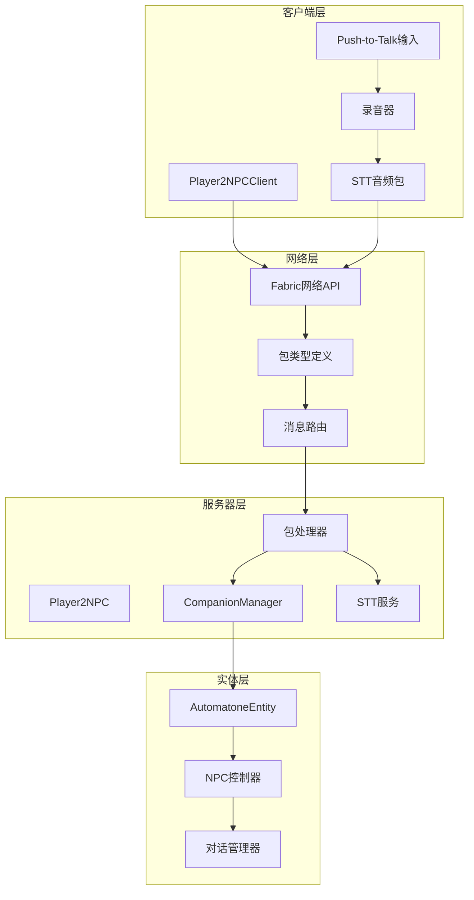
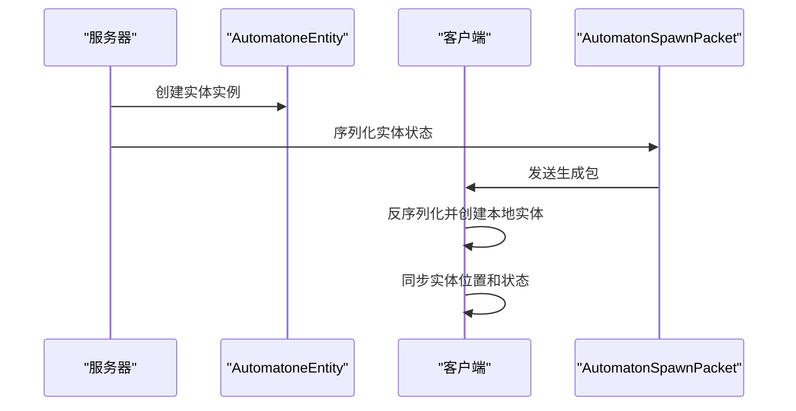
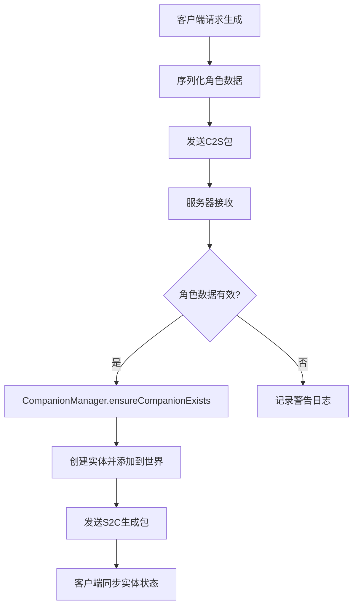
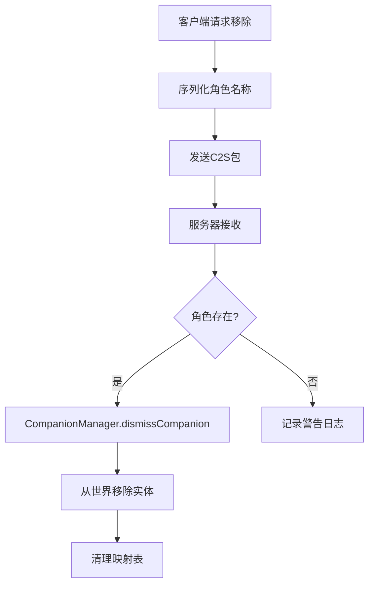
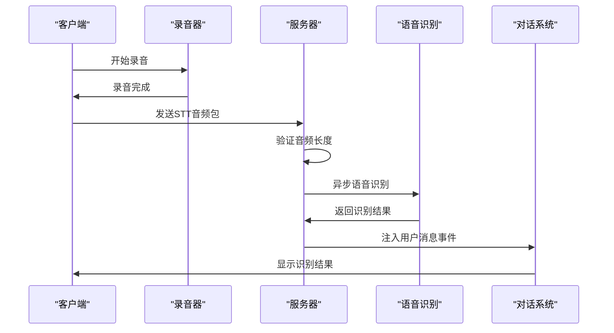
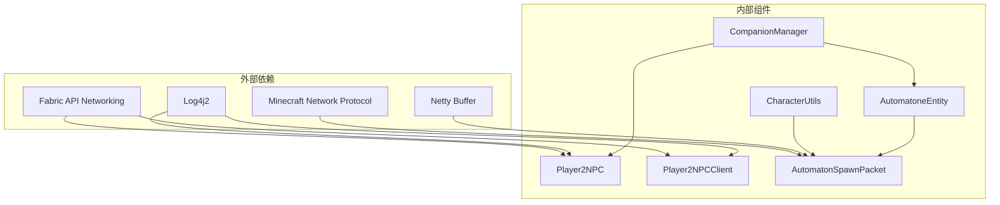

# 网络包设计与实现

<cite>
**本文档引用的文件**
- [AutomatonSpawnPacket.java](file://src/main/java/com/goodbird/player2npc/network/AutomatonSpawnPacket.java)
- [AutomatoneSpawnRequestPacket.java](file://src/main/java/com/goodbird/player2npc/network/AutomatoneSpawnRequestPacket.java)
- [AutomatoneDespawnRequestPacket.java](file://src/main/java/com/goodbird/player2npc/network/AutomatoneDespawnRequestPacket.java)
- [STTAudioPacket.java](file://src/main/java/com/goodbird/player2npc/network/STTAudioPacket.java)
- [Player2NPC.java](file://src/main/java/com/goodbird/player2npc/Player2NPC.java)
- [Player2NPCClient.java](file://src/main/java/com/goodbird/player2npc/Player2NPCClient.java)
- [AutomatoneEntity.java](file://src/main/java/com/goodbird/player2npc/companion/AutomatoneEntity.java)
- [CompanionManager.java](file://src/main/java/com/goodbird/player2npc/companion/CompanionManager.java)
- [CharacterUtils.java](file://src/main/java/adris/altoclef/player2api/utils/CharacterUtils.java)
</cite>

## 目录
1. [简介](#简介)
2. [项目结构](#项目结构)
3. [核心组件](#核心组件)
4. [架构概览](#架构概览)
5. [详细组件分析](#详细组件分析)
6. [依赖关系分析](#依赖关系分析)
7. [性能考虑](#性能考虑)
8. [故障排除指南](#故障排除指南)
9. [结论](#结论)
10. [附录](#附录)

## 简介

本技术文档深入解析了基于 Fabric 的网络包设计与实现，重点涵盖四种核心网络包的功能实现：AutomatonSpawnPacket 的 NPC 实体生成流程、AutomatoneSpawnRequestPacket 的请求响应机制、AutomatoneDespawnRequestPacket 的实体移除逻辑、STTAudioPacket 的音频数据传输协议。文档详细说明了网络包的生命周期、序列化机制、数据传输格式、注册机制、消息路由、错误处理等核心技术，并提供了具体的代码示例路径和性能优化策略。

## 项目结构

该项目采用模块化设计，网络通信相关的核心文件分布如下：

**图表来源**
- [Player2NPC.java:25-66](file://src/main/java/com/goodbird/player2npc/Player2NPC.java#L25-L66)
- [Player2NPCClient.java:23-164](file://src/main/java/com/goodbird/player2npc/Player2NPCClient.java#L23-L164)

**章节来源**
- [Player2NPC.java:1-67](file://src/main/java/com/goodbird/player2npc/Player2NPC.java#L1-L67)
- [Player2NPCClient.java:1-164](file://src/main/java/com/goodbird/player2npc/Player2NPCClient.java#L1-L164)

## 核心组件

### 网络包注册机制

项目使用 Fabric API 的网络框架进行包注册和消息路由：

**图表来源**
- [Player2NPC.java:52-54](file://src/main/java/com/goodbird/player2npc/Player2NPC.java#L52-L54)
- [Player2NPCClient.java:40](file://src/main/java/com/goodbird/player2npc/Player2NPCClient.java#L40)

### 数据传输格式

所有网络包均实现 FabricPacket 接口，采用统一的序列化机制：

| 字段 | 类型 | 序列化方式 | 备注 |
|------|------|------------|------|
| id | 整数 | VarInt | 实体唯一标识 |
| uuid | UUID | UUID编码 | 实体全局唯一标识 |
| position | Vec3 | 三个Double | 位置坐标(x,y,z) |
| velocity | Vec3 | 三个Short | 速度向量(压缩) |
| rotation | Byte | 角度编码 | pitch/yaw角度 |
| character | Character | UTF字符串数组 | 角色信息序列化 |
| inventory | ListTag | NBT列表 | 物品栏数据 |

**章节来源**
- [AutomatonSpawnPacket.java:76-93](file://src/main/java/com/goodbird/player2npc/network/AutomatonSpawnPacket.java#L76-L93)
- [CharacterUtils.java:83-110](file://src/main/java/adris/altoclef/player2api/utils/CharacterUtils.java#L83-L110)

## 架构概览

**图表来源**
- [Player2NPCClient.java:37-124](file://src/main/java/com/goodbird/player2npc/Player2NPCClient.java#L37-L124)
- [Player2NPC.java:48-65](file://src/main/java/com/goodbird/player2npc/Player2NPC.java#L48-L65)

## 详细组件分析

### AutomatonSpawnPacket - NPC实体生成包

#### 生命周期流程

**图表来源**
- [AutomatonSpawnPacket.java:42-52](file://src/main/java/com/goodbird/player2npc/network/AutomatonSpawnPacket.java#L42-L52)
- [AutomatonSpawnPacket.java:100-119](file://src/main/java/com/goodbird/player2npc/network/AutomatonSpawnPacket.java#L100-L119)

#### 序列化机制

实体状态压缩策略：
- 位置坐标：直接存储Double值
- 速度向量：压缩为Short类型，范围限制[-3.9, 3.9]
- 角度信息：Byte编码，精度转换为256级
- 角色数据：UTF字符串序列化
- 物品栏：NBT格式存储

**章节来源**
- [AutomatonSpawnPacket.java:26-120](file://src/main/java/com/goodbird/player2npc/network/AutomatonSpawnPacket.java#L26-L120)

### AutomatoneSpawnRequestPacket - 生成请求包

#### 请求响应机制

**图表来源**
- [AutomatoneSpawnRequestPacket.java:57-65](file://src/main/java/com/goodbird/player2npc/network/AutomatoneSpawnRequestPacket.java#L57-L65)
- [CompanionManager.java:100-129](file://src/main/java/com/goodbird/player2npc/companion/CompanionManager.java#L100-L129)

#### 错误处理策略

- 空角色数据：记录警告并忽略请求
- 服务器上下文缺失：跳过处理
- 实体创建失败：重试机制

**章节来源**
- [AutomatoneSpawnRequestPacket.java:24-67](file://src/main/java/com/goodbird/player2npc/network/AutomatoneSpawnRequestPacket.java#L24-L67)

### AutomatoneDespawnRequestPacket - 移除请求包

#### 实体移除逻辑

**图表来源**
- [AutomatoneDespawnRequestPacket.java:56-63](file://src/main/java/com/goodbird/player2npc/network/AutomatoneDespawnRequestPacket.java#L56-L63)
- [CompanionManager.java:131-144](file://src/main/java/com/goodbird/player2npc/companion/CompanionManager.java#L131-L144)

**章节来源**
- [AutomatoneDespawnRequestPacket.java:21-65](file://src/main/java/com/goodbird/player2npc/network/AutomatoneDespawnRequestPacket.java#L21-L65)

### STTAudioPacket - 音频数据传输协议

#### 音频传输流程

**图表来源**
- [Player2NPCClient.java:72-122](file://src/main/java/com/goodbird/player2npc/Player2NPCClient.java#L72-L122)
- [STTAudioPacket.java:39-121](file://src/main/java/com/goodbird/player2npc/network/STTAudioPacket.java#L39-L121)

#### 协议规范

包格式：`[UTF语言代码][VarInt音频长度][字节数组]`

最小音频要求：
- STT识别：32,000字节（约1秒）
- 客户端验证：16,000字节（约0.5秒）

**章节来源**
- [STTAudioPacket.java:16-27](file://src/main/java/com/goodbird/player2npc/network/STTAudioPacket.java#L16-L27)
- [Player2NPCClient.java:27-28](file://src/main/java/com/goodbird/player2npc/Player2NPCClient.java#L27-L28)

## 依赖关系分析

**图表来源**
- [Player2NPC.java:10-13](file://src/main/java/com/goodbird/player2npc/Player2NPC.java#L10-L13)
- [Player2NPCClient.java:8-13](file://src/main/java/com/goodbird/player2npc/Player2NPCClient.java#L8-L13)

**章节来源**
- [Player2NPC.java:1-67](file://src/main/java/com/goodbird/player2npc/Player2NPC.java#L1-L67)
- [Player2NPCClient.java:1-164](file://src/main/java/com/goodbird/player2npc/Player2NPCClient.java#L1-L164)

## 性能考虑

### 压缩策略

1. **速度向量压缩**：将浮点数速度压缩为Short类型，减少带宽占用
2. **角度编码**：使用Byte类型存储角度，精度损失可控
3. **字符串优化**：使用UTF编码，支持多语言字符

### 异步处理

1. **STT识别异步化**：避免阻塞服务器主线程
2. **实体生成异步化**：Character数据获取异步处理
3. **网络I/O优化**：使用Netty缓冲区管理

### 缓存机制

1. **实体映射缓存**：CompanionManager维护角色到UUID的映射
2. **配置缓存**：STT配置一次性加载
3. **渲染缓存**：实体纹理资源缓存

## 故障排除指南

### 常见问题诊断

#### 网络包序列化错误

**症状**：客户端无法显示NPC实体
**排查步骤**：
1. 检查Character序列化是否正确
2. 验证NBT数据完整性
3. 确认包格式版本兼容性

#### STT识别失败

**症状**：语音识别无响应或报错
**排查步骤**：
1. 检查API密钥配置
2. 验证音频长度阈值
3. 确认网络连接状态

#### 实体同步延迟

**症状**：NPC位置与实际不符
**排查步骤**：
1. 检查网络延迟
2. 验证包发送频率
3. 确认客户端渲染线程

**章节来源**
- [STTAudioPacket.java:56-63](file://src/main/java/com/goodbird/player2npc/network/STTAudioPacket.java#L56-L63)
- [AutomatonSpawnPacket.java:100-119](file://src/main/java/com/goodbird/player2npc/network/AutomatonSpawnPacket.java#L100-L119)

## 结论

该网络包系统通过精心设计的序列化机制、异步处理策略和错误处理方案，实现了高效稳定的跨客户端-服务器通信。四种核心网络包各司其职：生成包负责实体状态同步，请求包处理业务逻辑，音频包实现语音识别功能。系统采用模块化设计，便于扩展和维护，为AI NPC项目的网络通信奠定了坚实基础。

## 附录

### 自定义网络包开发指南

#### 创建步骤

1. **定义包类**：继承FabricPacket接口
2. **实现序列化**：编写write和构造函数
3. **注册处理器**：在Player2NPC中注册
4. **测试验证**：使用单元测试验证功能

#### 最佳实践

- 使用VarInt进行可变长度整数编码
- 对于浮点数使用固定精度压缩
- 实现完整的错误处理和日志记录
- 考虑网络异常情况下的重试机制