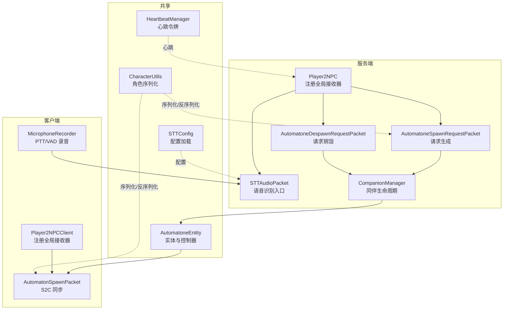
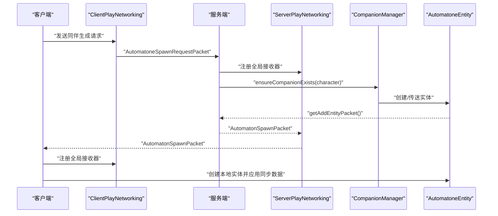
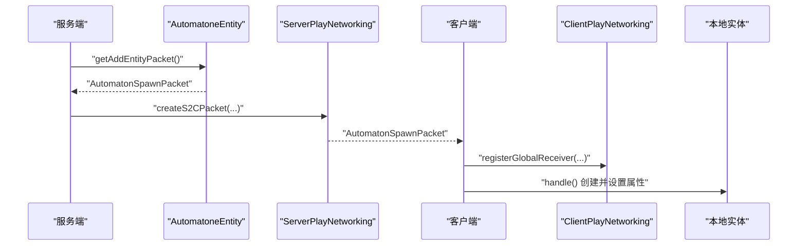
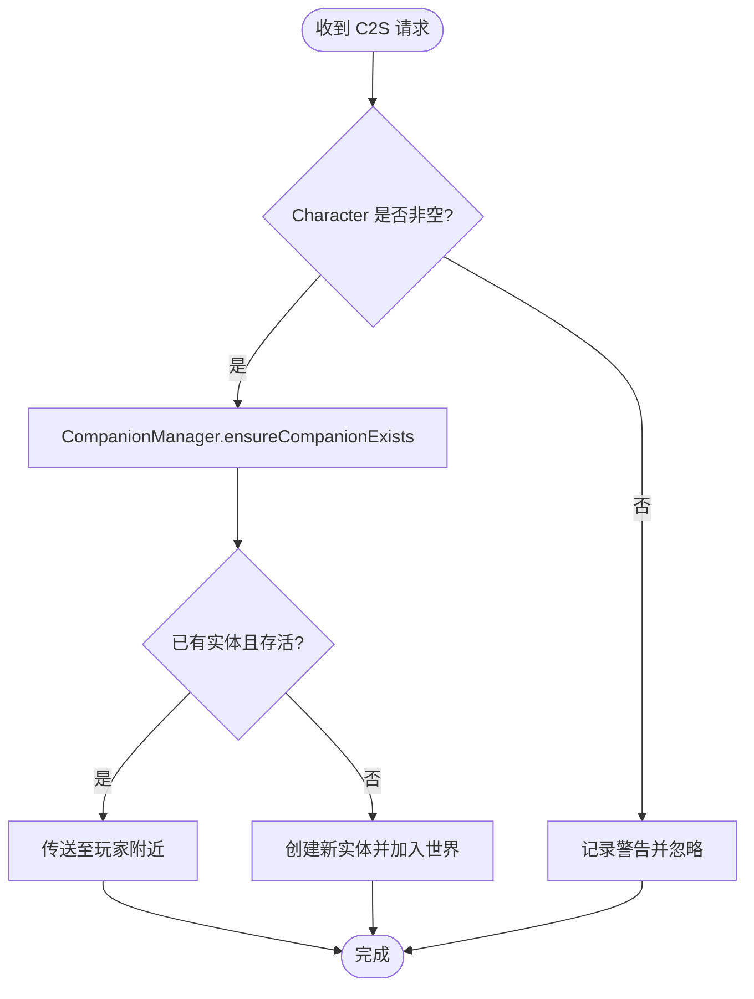
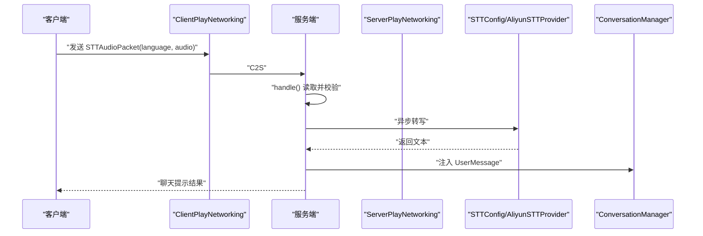
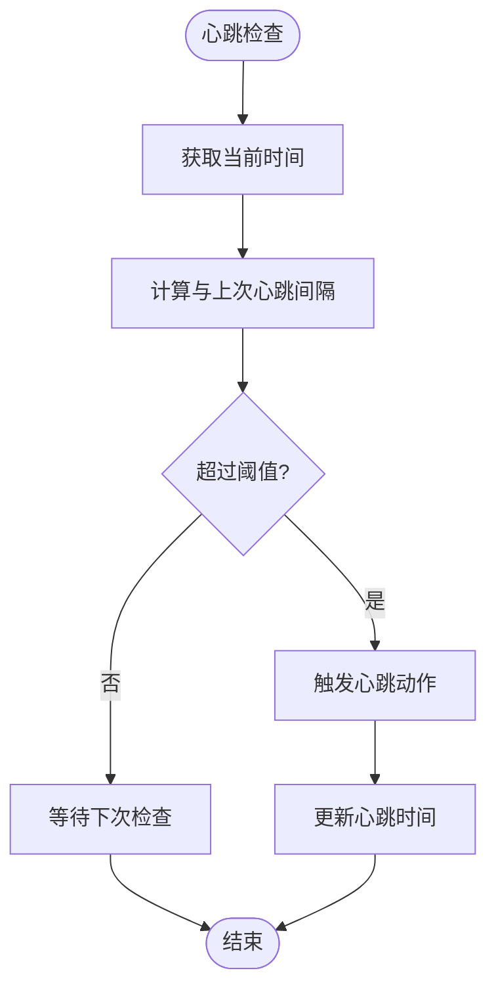
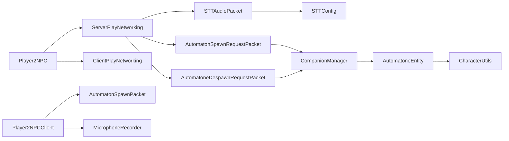

# 网络通信系统

<cite>
**本文引用的文件**
- [Player2NPC.java](file://src/main/java/com/goodbird/player2npc/Player2NPC.java)
- [Player2NPCClient.java](file://src/main/java/com/goodbird/player2npc/Player2NPCClient.java)
- [AutomatonSpawnPacket.java](file://src/main/java/com/goodbird/player2npc/network/AutomatonSpawnPacket.java)
- [AutomatoneSpawnRequestPacket.java](file://src/main/java/com/goodbird/player2npc/network/AutomatoneSpawnRequestPacket.java)
- [AutomatoneDespawnRequestPacket.java](file://src/main/java/com/goodbird/player2npc/network/AutomatoneDespawnRequestPacket.java)
- [STTAudioPacket.java](file://src/main/java/com/goodbird/player2npc/network/STTAudioPacket.java)
- [AutomatoneEntity.java](file://src/main/java/com/goodbird/player2npc/companion/AutomatoneEntity.java)
- [CompanionManager.java](file://src/main/java/com/goodbird/player2npc/companion/CompanionManager.java)
- [CharacterUtils.java](file://src/main/java/adris/altoclef/player2api/utils/CharacterUtils.java)
- [STTConfig.java](file://src/main/java/adris/altoclef/player2api/stt/STTConfig.java)
- [HeartbeatManager.java](file://src/main/java/adris/altoclef/player2api/manager/HeartbeatManager.java)
- [MicrophoneRecorder.java](file://src/main/java/com/goodbird/player2npc/client/audio/MicrophoneRecorder.java)
</cite>

## 目录
1. [简介](#简介)
2. [项目结构](#项目结构)
3. [核心组件](#核心组件)
4. [架构总览](#架构总览)
5. [详细组件分析](#详细组件分析)
6. [依赖分析](#依赖分析)
7. [性能考量](#性能考量)
8. [故障排查指南](#故障排查指南)
9. [结论](#结论)
10. [附录](#附录)

## 简介
本文件面向网络通信系统，聚焦于 Fabric 环境下的客户端-服务端通信设计与实现，涵盖以下主题：
- 客户端-服务端数据同步：实体（NPC）生成、销毁与位置/状态同步
- 实体组件系统在网络中的传输：角色信息、库存、交互管理器等
- 状态管理同步策略：连接建立时的同伴实体恢复、断开时的清理
- 关键网络包详解：AutomatonSpawnPacket 的 NPC 实体生成、STTAudioPacket 的语音数据传输、心跳包的连接维持
- 安全性与数据完整性：最小音频长度校验、配置驱动的鉴权与可用性检查
- 异常处理与可靠性：异步 STT 处理、线程隔离、日志记录与回退提示
- 性能优化与排障：带宽压缩、采样率与帧大小、VAD 自动停止、并发与线程模型

## 项目结构
网络相关模块主要位于 player2npc 模块下，采用 Fabric API 的注册与收发机制；同时通过 Baritone 的组件体系承载 AI 控制器与交互能力。

**图表来源**
- [Player2NPC.java:48-65](file://src/main/java/com/goodbird/player2npc/Player2NPC.java#L48-L65)
- [Player2NPCClient.java:36-124](file://src/main/java/com/goodbird/player2npc/Player2NPCClient.java#L36-L124)
- [AutomatoneSpawnRequestPacket.java:57-65](file://src/main/java/com/goodbird/player2npc/network/AutomatoneSpawnRequestPacket.java#L57-L65)
- [AutomatoneDespawnRequestPacket.java:56-63](file://src/main/java/com/goodbird/player2npc/network/AutomatoneDespawnRequestPacket.java#L56-L63)
- [STTAudioPacket.java:39-121](file://src/main/java/com/goodbird/player2npc/network/STTAudioPacket.java#L39-L121)
- [AutomatonSpawnPacket.java:100-119](file://src/main/java/com/goodbird/player2npc/network/AutomatonSpawnPacket.java#L100-L119)
- [AutomatoneEntity.java:298-302](file://src/main/java/com/goodbird/player2npc/companion/AutomatoneEntity.java#L298-L302)
- [CharacterUtils.java:83-110](file://src/main/java/adris/altoclef/player2api/utils/CharacterUtils.java#L83-L110)
- [STTConfig.java:31-59](file://src/main/java/adris/altoclef/player2api/stt/STTConfig.java#L31-L59)
- [HeartbeatManager.java:30-41](file://src/main/java/adris/altoclef/player2api/manager/HeartbeatManager.java#L30-L41)

**章节来源**
- [Player2NPC.java:29-36](file://src/main/java/com/goodbird/player2npc/Player2NPC.java#L29-L36)
- [Player2NPCClient.java:40](file://src/main/java/com/goodbird/player2npc/Player2NPCClient.java#L40)

## 核心组件
- 网络入口与注册
  - 服务端：注册全局接收器，处理同伴生成/销毁请求与 STT 音频
  - 客户端：注册全局接收器，处理同伴实体同步与 PTT/VAD 录音
- 实体与同伴管理
  - AutomatoneEntity：作为 AI NPC 实体，承载控制器、库存、交互管理器
  - CompanionManager：基于玩家组件的同伴生命周期管理，支持异步拉取角色并生成实体
- 角色与序列化
  - CharacterUtils：角色对象在网络与 NBT 中的序列化/反序列化
- 语音识别与配置
  - STTAudioPacket：C2S 接收音频，异步转写并注入对话系统
  - STTConfig：从 LLM 配置中加载 STT 开关、模型、语言与密钥
- 音频采集
  - MicrophoneRecorder：PTT/VAD 录音，输出 16kHz/16bit/Mono PCM 数据
- 心跳管理
  - HeartbeatManager：按用户名+clientId 记录心跳时间，周期性触发

**章节来源**
- [AutomatoneEntity.java:50-91](file://src/main/java/com/goodbird/player2npc/companion/AutomatoneEntity.java#L50-L91)
- [CompanionManager.java:28-74](file://src/main/java/com/goodbird/player2npc/companion/CompanionManager.java#L28-L74)
- [CharacterUtils.java:83-110](file://src/main/java/adris/altoclef/player2api/utils/CharacterUtils.java#L83-L110)
- [STTAudioPacket.java:28-121](file://src/main/java/com/goodbird/player2npc/network/STTAudioPacket.java#L28-L121)
- [STTConfig.java:31-59](file://src/main/java/adris/altoclef/player2api/stt/STTConfig.java#L31-L59)
- [MicrophoneRecorder.java:21-121](file://src/main/java/com/goodbird/player2npc/client/audio/MicrophoneRecorder.java#L21-L121)
- [HeartbeatManager.java:22-41](file://src/main/java/adris/altoclef/player2api/manager/HeartbeatManager.java#L22-L41)

## 架构总览
Fabric 网络层负责消息编解码与路由，服务端/客户端分别注册接收器与发送器。AI 控制器与实体逻辑位于共享模块，通过网络包进行状态同步与控制命令下发。

**图表来源**
- [Player2NPC.java:52-54](file://src/main/java/com/goodbird/player2npc/Player2NPC.java#L52-L54)
- [AutomatoneSpawnRequestPacket.java:57-65](file://src/main/java/com/goodbird/player2npc/network/AutomatoneSpawnRequestPacket.java#L57-L65)
- [AutomatoneEntity.java:298-302](file://src/main/java/com/goodbird/player2npc/companion/AutomatoneEntity.java#L298-L302)
- [AutomatonSpawnPacket.java:70-74](file://src/main/java/com/goodbird/player2npc/network/AutomatonSpawnPacket.java#L70-L74)
- [AutomatonSpawnPacket.java:100-119](file://src/main/java/com/goodbird/player2npc/network/AutomatonSpawnPacket.java#L100-L119)

## 详细组件分析

### AutomatonSpawnPacket：NPC 实体生成与同步
- 设计要点
  - 服务端在实体添加时构造包，客户端收到后重建本地实体并应用位置、朝向、速度与角色/库存信息
  - 使用 VarInt/Short/Byte 编码压缩位置、速度与旋转，降低带宽占用
- 关键流程
  - 服务端：实体 getAddEntityPacket 调用创建包，使用 ServerPlayNetworking 发送
  - 客户端：注册接收器，解析包并创建本地实体，设置 ID、UUID、位置、朝向、速度、角色与库存
- 数据结构与复杂度
  - 包含 id、uuid、Vec3 位置与速度、pitch/yaw、Character、Inventory 列表
  - 写入/读取均为 O(n)（n 为物品栏项数），受 Inventory 大小影响
- 错误处理
  - 客户端在 execute 中确保渲染线程安全
  - 若世界或实体为空则跳过

**图表来源**
- [AutomatoneEntity.java:298-302](file://src/main/java/com/goodbird/player2npc/companion/AutomatoneEntity.java#L298-L302)
- [AutomatonSpawnPacket.java:70-93](file://src/main/java/com/goodbird/player2npc/network/AutomatonSpawnPacket.java#L70-L93)
- [AutomatonSpawnPacket.java:100-119](file://src/main/java/com/goodbird/player2npc/network/AutomatonSpawnPacket.java#L100-L119)

**章节来源**
- [AutomatonSpawnPacket.java:26-119](file://src/main/java/com/goodbird/player2npc/network/AutomatonSpawnPacket.java#L26-L119)
- [AutomatoneEntity.java:298-302](file://src/main/java/com/goodbird/player2npc/companion/AutomatoneEntity.java#L298-L302)

### AutomatoneSpawnRequestPacket / AutomatoneDespawnRequestPacket：同伴生命周期请求
- 设计要点
  - 客户端发送 C2S 请求，携带 Character；服务端在服务器线程中调用 CompanionManager
  - 生成：ensureCompanionExists(character)，若存在则传送，否则创建并加入世界
  - 销毁：dismissCompanion(character.name())，遍历所有世界查找并丢弃实体
- 流程图

**图表来源**
- [AutomatoneSpawnRequestPacket.java:57-65](file://src/main/java/com/goodbird/player2npc/network/AutomatoneSpawnRequestPacket.java#L57-L65)
- [AutomatoneDespawnRequestPacket.java:56-63](file://src/main/java/com/goodbird/player2npc/network/AutomatoneDespawnRequestPacket.java#L56-L63)
- [CompanionManager.java:100-129](file://src/main/java/com/goodbird/player2npc/companion/CompanionManager.java#L100-L129)

**章节来源**
- [AutomatoneSpawnRequestPacket.java:24-65](file://src/main/java/com/goodbird/player2npc/network/AutomatoneSpawnRequestPacket.java#L24-L65)
- [AutomatoneDespawnRequestPacket.java:21-63](file://src/main/java/com/goodbird/player2npc/network/AutomatoneDespawnRequestPacket.java#L21-L63)
- [CompanionManager.java:100-149](file://src/main/java/com/goodbird/player2npc/companion/CompanionManager.java#L100-L149)

### STTAudioPacket：语音数据传输与转写
- 协议格式（C2S）
  - UTF 语言字符串（最大长度限制）、VarInt 音频长度、字节数组
- 处理流程
  - 读取语言、长度与音频数据
  - 校验最小长度（默认 1 秒，约 32000 字节）
  - 异步线程加载 STT 配置、校验 API Key 与可用性
  - 调用 Provider 进行转写，成功后在服务器线程注入用户消息事件并通知玩家
- 安全与完整性
  - 最小音频长度校验防止无效输入
  - 配置驱动的开关与密钥检查
  - 日志记录错误与回退提示

**图表来源**
- [Player2NPCClient.java:150-162](file://src/main/java/com/goodbird/player2npc/Player2NPCClient.java#L150-L162)
- [STTAudioPacket.java:39-121](file://src/main/java/com/goodbird/player2npc/network/STTAudioPacket.java#L39-L121)
- [STTConfig.java:31-59](file://src/main/java/adris/altoclef/player2api/stt/STTConfig.java#L31-L59)

**章节来源**
- [STTAudioPacket.java:16-134](file://src/main/java/com/goodbird/player2npc/network/STTAudioPacket.java#L16-L134)
- [Player2NPCClient.java:146-162](file://src/main/java/com/goodbird/player2npc/Player2NPCClient.java#L146-L162)
- [STTConfig.java:13-77](file://src/main/java/adris/altoclef/player2api/stt/STTConfig.java#L13-L77)

### 心跳包与连接维持
- 心跳策略
  - 基于用户名与客户端标识的键，记录上次心跳时间
  - 超过阈值（约 60 秒）触发心跳
- 适用场景
  - 用于维持会话、触发定期任务或清理资源
- 注意事项
  - 心跳频率需平衡保活与网络负载
  - 可结合服务端 Tick 事件统一调度

**图表来源**
- [HeartbeatManager.java:30-41](file://src/main/java/adris/altoclef/player2api/manager/HeartbeatManager.java#L30-L41)

**章节来源**
- [HeartbeatManager.java:22-46](file://src/main/java/adris/altoclef/player2api/manager/HeartbeatManager.java#L22-L46)

### 音频采集与 PTT/VAD
- 采集参数
  - 16kHz、16bit、单声道、小端序，符合 Gummy STT 要求
- PTT 与 VAD
  - PTT：按键按下开始录音，松开或自动停止时发送
  - VAD：静音检测（RMS 小于阈值持续一段时间）触发自动停止
- 安全与质量
  - 最大录音时长限制，避免超限
  - 客户端对最短录音时长进行校验并提示

**章节来源**
- [MicrophoneRecorder.java:21-198](file://src/main/java/com/goodbird/player2npc/client/audio/MicrophoneRecorder.java#L21-L198)
- [Player2NPCClient.java:64-123](file://src/main/java/com/goodbird/player2npc/Player2NPCClient.java#L64-L123)

## 依赖分析
- 组件耦合
  - Player2NPC 作为入口，集中注册网络接收器与生命周期事件
  - AutomatoneEntity 依赖 CharacterUtils 进行角色序列化，依赖 Fabric API 发送添加包
  - CompanionManager 依赖 CharacterUtils 拉取角色列表，并在服务器线程中创建/销毁实体
  - STTAudioPacket 依赖 STTConfig 与 Provider，异步处理避免阻塞
- 外部依赖
  - Fabric Networking API：PacketType、ServerPlayNetworking、ClientPlayNetworking
  - Baritone 组件：IBaritone、IAutomatone、IInventoryProvider 等接口
  - Java Sound API：音频采集与 PCM 处理

**图表来源**
- [Player2NPC.java:52-54](file://src/main/java/com/goodbird/player2npc/Player2NPC.java#L52-L54)
- [AutomatoneSpawnRequestPacket.java:57-65](file://src/main/java/com/goodbird/player2npc/network/AutomatoneSpawnRequestPacket.java#L57-L65)
- [AutomatoneDespawnRequestPacket.java:56-63](file://src/main/java/com/goodbird/player2npc/network/AutomatoneDespawnRequestPacket.java#L56-L63)
- [STTAudioPacket.java:39-121](file://src/main/java/com/goodbird/player2npc/network/STTAudioPacket.java#L39-L121)
- [AutomatonSpawnPacket.java:100-119](file://src/main/java/com/goodbird/player2npc/network/AutomatonSpawnPacket.java#L100-L119)
- [AutomatoneEntity.java:298-302](file://src/main/java/com/goodbird/player2npc/companion/AutomatoneEntity.java#L298-L302)
- [CharacterUtils.java:83-110](file://src/main/java/adris/altoclef/player2api/utils/CharacterUtils.java#L83-L110)
- [STTConfig.java:31-59](file://src/main/java/adris/altoclef/player2api/stt/STTConfig.java#L31-L59)
- [Player2NPCClient.java:40](file://src/main/java/com/goodbird/player2npc/Player2NPCClient.java#L40)
- [MicrophoneRecorder.java:21-121](file://src/main/java/com/goodbird/player2npc/client/audio/MicrophoneRecorder.java#L21-L121)

**章节来源**
- [Player2NPC.java:48-65](file://src/main/java/com/goodbird/player2npc/Player2NPC.java#L48-L65)
- [AutomatoneEntity.java:50-91](file://src/main/java/com/goodbird/player2npc/companion/AutomatoneEntity.java#L50-L91)
- [CompanionManager.java:28-74](file://src/main/java/com/goodbird/player2npc/companion/CompanionManager.java#L28-L74)

## 性能考量
- 带宽压缩
  - 位置与速度采用 Short/Byte 编码，限制范围以减少字节数
  - 语言字段使用 UTF 且长度有限，避免冗余
- 异步处理
  - STT 在独立线程执行，避免阻塞网络线程与服务器主线程
- 采样与帧大小
  - 16kHz/16bit/Mono 已为常见低延迟格式；帧大小（约 100ms）平衡实时性与 CPU 占用
- 并发与线程模型
  - 服务器线程仅做轻量调度与事件注入，重活交由专用线程池
- 缓存与复用
  - 心跳令牌按用户+clientId 存储，避免重复计算

[本节为通用性能建议，不直接分析具体文件]

## 故障排查指南
- STT 无法识别
  - 检查 STT 配置是否启用、API Key 是否正确、服务是否可用
  - 确认录音时长是否满足最小要求（默认 1 秒）
- 麦克风不可用
  - 系统权限或设备占用导致 LineUnavailableException
  - 使用 MicrophoneRecorder.isMicrophoneAvailable() 进行预检
- 录音过短
  - 客户端与服务端均对最短录音时长进行校验并给出提示
- 同步异常
  - 客户端 handle 中使用 Minecraft.getInstance().execute() 确保渲染线程安全
  - 若实体未找到或世界为空，客户端跳过处理
- 心跳未触发
  - 检查 HeartbeatManager.shouldHeartbeat 返回值与存储的上次心跳时间

**章节来源**
- [STTAudioPacket.java:51-63](file://src/main/java/com/goodbird/player2npc/network/STTAudioPacket.java#L51-L63)
- [Player2NPCClient.java:73-81](file://src/main/java/com/goodbird/player2npc/Player2NPCClient.java#L73-L81)
- [MicrophoneRecorder.java:49-56](file://src/main/java/com/goodbird/player2npc/client/audio/MicrophoneRecorder.java#L49-L56)
- [AutomatonSpawnPacket.java:100-119](file://src/main/java/com/goodbird/player2npc/network/AutomatonSpawnPacket.java#L100-L119)
- [HeartbeatManager.java:30-41](file://src/main/java/adris/altoclef/player2api/manager/HeartbeatManager.java#L30-L41)

## 结论
该网络通信系统以 Fabric API 为基础，围绕 AI NPC 的同伴生命周期与语音交互构建了清晰的消息流与职责边界：
- 通过 AutomatonSpawnPacket 实现实体的可靠同步
- 通过 Spawn/Despawn Request Packet 实现生命周期控制
- 通过 STTAudioPacket 与异步 STT 提供语音交互能力
- 通过 HeartbeatManager 支持连接维持与周期性任务
- 通过 CharacterUtils 与 Fabric 序列化机制保障角色与状态在网络中的可移植性

[本节为总结性内容，不直接分析具体文件]

## 附录

### 如何创建新的网络包类型
- 定义包类
  - 实现 FabricPacket 接口，定义 PacketType 与构造函数
  - 提供 write/read 方法进行编解码
- 注册接收器
  - 服务端：使用 ServerPlayNetworking.registerGlobalReceiver
  - 客户端：使用 ClientPlayNetworking.registerGlobalReceiver
- 发送与接收
  - 服务端：使用 ServerPlayNetworking.createS2CPacket
  - 客户端：使用 ClientPlayNetworking.send

**章节来源**
- [AutomatonSpawnPacket.java:26-98](file://src/main/java/com/goodbird/player2npc/network/AutomatonSpawnPacket.java#L26-L98)
- [AutomatoneSpawnRequestPacket.java:24-54](file://src/main/java/com/goodbird/player2npc/network/AutomatoneSpawnRequestPacket.java#L24-L54)
- [AutomatoneDespawnRequestPacket.java:21-53](file://src/main/java/com/goodbird/player2npc/network/AutomatoneDespawnRequestPacket.java#L21-L53)
- [Player2NPC.java:52-54](file://src/main/java/com/goodbird/player2npc/Player2NPC.java#L52-L54)
- [Player2NPCClient.java:40](file://src/main/java/com/goodbird/player2npc/Player2NPCClient.java#L40)

### 如何处理网络事件
- 服务端事件
  - 在 Player2NPC.onInitialize 中注册全局接收器
  - 在连接加入/断开时调用 CompanionManager 的恢复/清理方法
- 客户端事件
  - 在 Player2NPCClient.onInitialize 中注册接收器
  - 在 ClientTickEvents 中处理 PTT/VAD 逻辑与消息显示

**章节来源**
- [Player2NPC.java:48-65](file://src/main/java/com/goodbird/player2npc/Player2NPC.java#L48-L65)
- [Player2NPCClient.java:36-124](file://src/main/java/com/goodbird/player2npc/Player2NPCClient.java#L36-L124)

### 如何实现可靠的客户端-服务端通信
- 使用异步处理避免阻塞网络线程
- 对关键配置（如 API Key）进行存在性与有效性检查
- 对最小输入长度进行校验并提示用户
- 在客户端使用 Minecraft.getInstance().execute() 确保渲染线程安全

**章节来源**
- [STTAudioPacket.java:65-121](file://src/main/java/com/goodbird/player2npc/network/STTAudioPacket.java#L65-L121)
- [AutomatonSpawnPacket.java:100-119](file://src/main/java/com/goodbird/player2npc/network/AutomatonSpawnPacket.java#L100-L119)