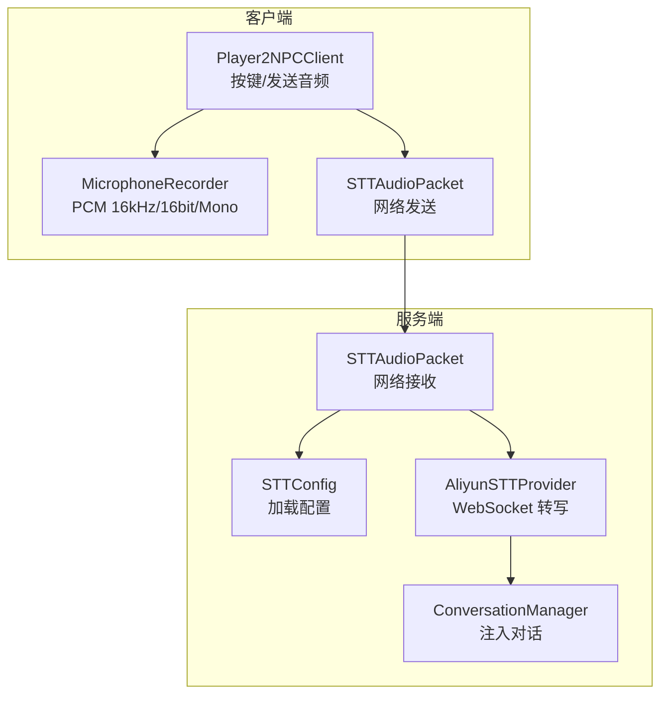
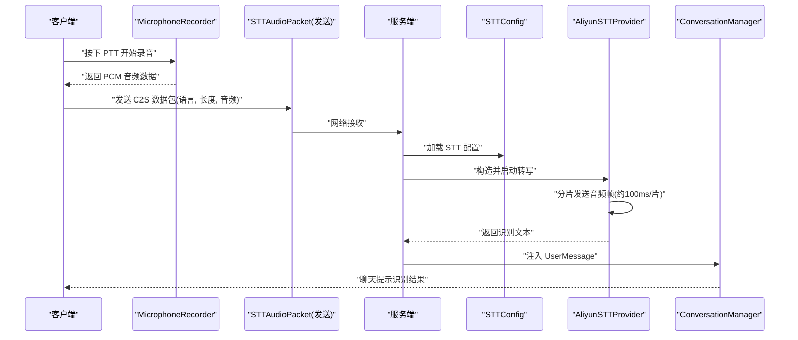
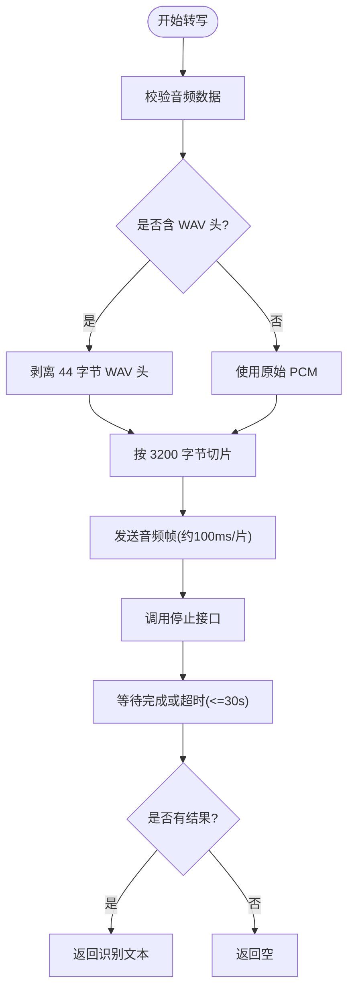
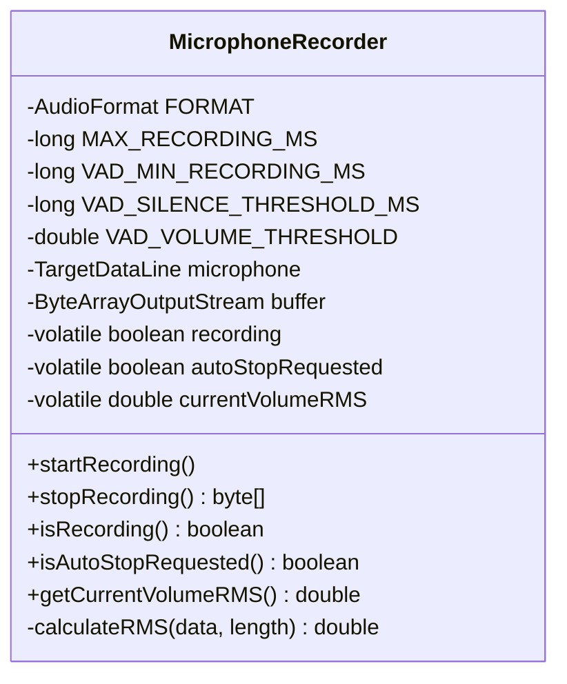
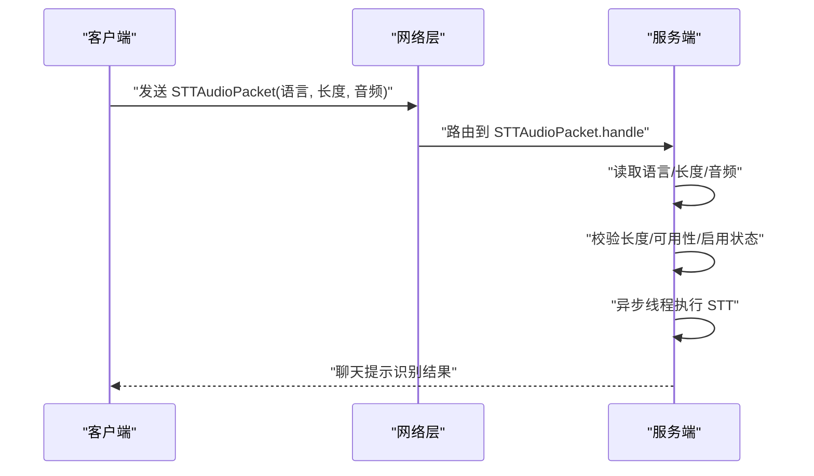
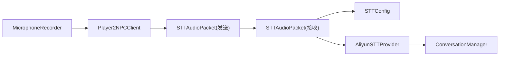

# STT 语音识别

<cite>
**本文引用的文件列表**
- [AliyunSTTProvider.java](file://src/main/java/adris/altoclef/player2api/stt/AliyunSTTProvider.java)
- [STTConfig.java](file://src/main/java/adris/altoclef/player2api/stt/STTConfig.java)
- [STTAudioPacket.java](file://src/main/java/com/goodbird/player2npc/network/STTAudioPacket.java)
- [MicrophoneRecorder.java](file://src/main/java/com/goodbird/player2npc/client/audio/MicrophoneRecorder.java)
- [Player2NPCClient.java](file://src/main/java/com/goodbird/player2npc/Player2NPCClient.java)
- [ConversationManager.java](file://src/main/java/adris/altoclef/player2api/manager/ConversationManager.java)
- [AudioUtils.java](file://src/main/java/adris/altoclef/player2api/utils/AudioUtils.java)
- [playerengine-llm-default.json](file://src/main/resources/playerengine-llm-default.json)
- [README.md](file://README.md)
</cite>

## 目录
1. [简介](#简介)
2. [项目结构](#项目结构)
3. [核心组件](#核心组件)
4. [架构总览](#架构总览)
5. [详细组件分析](#详细组件分析)
6. [依赖关系分析](#依赖关系分析)
7. [性能与优化](#性能与优化)
8. [故障排查指南](#故障排查指南)
9. [结论](#结论)
10. [附录](#附录)

## 简介
本技术文档面向 STT 语音识别系统，聚焦于阿里云语音识别服务在该项目中的实现与集成。文档从系统架构、WebSocket 通信协议、音频数据格式处理、实时转录流程等方面进行深入解析，并结合客户端录音器、网络传输包、服务端处理链路与错误处理机制，提供可操作的配置示例与优化建议，帮助开发者快速理解并部署 STT 功能。

## 项目结构
STT 相关代码主要分布在以下模块：
- 客户端录音与按键逻辑：com.goodbird.player2npc.client.audio.MicrophoneRecorder、com.goodbird.player2npc.Player2NPCClient
- 网络传输：com.goodbird.player2npc.network.STTAudioPacket
- 服务端处理与转写：adris.altoclef.player2api.stt.AliyunSTTProvider、adris.altoclef.player2api.stt.STTConfig
- 对话注入：adris.altoclef.player2api.manager.ConversationManager
- 辅助工具：adris.altoclef.player2api.utils.AudioUtils
- 配置文件：playerengine-llm-default.json

图表来源
- [Player2NPCClient.java:64-163](file://src/main/java/com/goodbird/player2npc/Player2NPCClient.java#L64-L163)
- [MicrophoneRecorder.java:12-200](file://src/main/java/com/goodbird/player2npc/client/audio/MicrophoneRecorder.java#L12-L200)
- [STTAudioPacket.java:16-134](file://src/main/java/com/goodbird/player2npc/network/STTAudioPacket.java#L16-L134)
- [STTConfig.java:8-78](file://src/main/java/adris/altoclef/player2api/stt/STTConfig.java#L8-L78)
- [AliyunSTTProvider.java:17-172](file://src/main/java/adris/altoclef/player2api/stt/AliyunSTTProvider.java#L17-L172)
- [ConversationManager.java:27-201](file://src/main/java/adris/altoclef/player2api/manager/ConversationManager.java#L27-L201)

章节来源
- [Player2NPCClient.java:64-163](file://src/main/java/com/goodbird/player2npc/Player2NPCClient.java#L64-L163)
- [MicrophoneRecorder.java:12-200](file://src/main/java/com/goodbird/player2npc/client/audio/MicrophoneRecorder.java#L12-L200)
- [STTAudioPacket.java:16-134](file://src/main/java/com/goodbird/player2npc/network/STTAudioPacket.java#L16-L134)
- [STTConfig.java:8-78](file://src/main/java/adris/altoclef/player2api/stt/STTConfig.java#L8-L78)
- [AliyunSTTProvider.java:17-172](file://src/main/java/adris/altoclef/player2api/stt/AliyunSTTProvider.java#L17-L172)
- [ConversationManager.java:27-201](file://src/main/java/adris/altoclef/player2api/manager/ConversationManager.java#L27-L201)

## 核心组件
- 阿里云 STT 提供者：负责通过 DashScope WebSocket 进行实时语音转写，支持 PCM/WAV 输入（16kHz、16bit、Mono），并以分片方式发送音频帧。
- STT 配置：从配置文件中读取启用状态、模型、语言与 API Key；若未单独配置 STT Key，则回退到 LLM Provider 的 API Key。
- 客户端录音器：以固定音频格式（16kHz、16bit、Mono）录制音频，内置 VAD 自动停止与最大录制时长保护。
- 网络传输包：定义 C2S 数据包格式（语言、音频长度、音频字节），客户端发送，服务端接收并异步处理。
- 对话注入：服务端将识别结果作为用户消息注入对话管理器，进入后续对话与 LLM 流水线。

章节来源
- [AliyunSTTProvider.java:17-172](file://src/main/java/adris/altoclef/player2api/stt/AliyunSTTProvider.java#L17-L172)
- [STTConfig.java:8-78](file://src/main/java/adris/altoclef/player2api/stt/STTConfig.java#L8-L78)
- [MicrophoneRecorder.java:12-200](file://src/main/java/com/goodbird/player2npc/client/audio/MicrophoneRecorder.java#L12-L200)
- [STTAudioPacket.java:16-134](file://src/main/java/com/goodbird/player2npc/network/STTAudioPacket.java#L16-L134)
- [ConversationManager.java:27-201](file://src/main/java/adris/altoclef/player2api/manager/ConversationManager.java#L27-L201)

## 架构总览
下图展示了从按键触发录音到服务端转写并注入对话的整体流程。

图表来源
- [Player2NPCClient.java:64-163](file://src/main/java/com/goodbird/player2npc/Player2NPCClient.java#L64-L163)
- [STTAudioPacket.java:39-121](file://src/main/java/com/goodbird/player2npc/network/STTAudioPacket.java#L39-L121)
- [STTConfig.java:31-59](file://src/main/java/adris/altoclef/player2api/stt/STTConfig.java#L31-L59)
- [AliyunSTTProvider.java:47-154](file://src/main/java/adris/altoclef/player2api/stt/AliyunSTTProvider.java#L47-L154)
- [ConversationManager.java:115-130](file://src/main/java/adris/altoclef/player2api/manager/ConversationManager.java#L115-L130)

## 详细组件分析

### 阿里云 STT 提供者（WebSocket 实时转写）
- WebSocket 地址：在静态初始化块中设置为 DashScope 中国区 WebSocket 入口，与 TTS 使用相同地址。
- 参数配置：模型、格式（pcm）、采样率（16000）、是否启用转写、翻译关闭。
- 音频预处理：若输入为 WAV（含 44 字节头），自动剥离头部，仅保留 PCM 数据。
- 分片发送：以约 100ms 片长（3200 字节）发送音频帧，期间进行速率限制避免 CPU 过载。
- 结束信号：调用停止接口并等待完成回调或超时（最多 30 秒）。
- 可用性检查：API Key 非空且不为占位符时视为可用。

图表来源
- [AliyunSTTProvider.java:47-154](file://src/main/java/adris/altoclef/player2api/stt/AliyunSTTProvider.java#L47-L154)

章节来源
- [AliyunSTTProvider.java:17-172](file://src/main/java/adris/altoclef/player2api/stt/AliyunSTTProvider.java#L17-L172)

### STT 配置加载
- 从 LLM 配置文件的 stt 段读取启用状态、模型、语言。
- 若未单独配置 STT API Key，则回退到 qwen Provider 的 API Key。
- 默认模型为 gummy-chat-v1，语言默认 zh。

章节来源
- [STTConfig.java:8-78](file://src/main/java/adris/altoclef/player2api/stt/STTConfig.java#L8-L78)

### 客户端录音器（音频采集与 VAD）
- 音频格式：16kHz、16bit、单声道、有符号、小端序，严格符合 Gummy STT 要求。
- 录制参数：最大录制时长 60 秒；VAD 静音阈值（RMS 小于 150 视为静音）、静音持续 1200ms 自动停止。
- 采样策略：每次读取约 100ms 的音频块（3200 字节），计算 RMS 并进行静音检测。
- 输出：返回 PCM 字节数组，供网络发送。

图表来源
- [MicrophoneRecorder.java:12-200](file://src/main/java/com/goodbird/player2npc/client/audio/MicrophoneRecorder.java#L12-L200)

章节来源
- [MicrophoneRecorder.java:12-200](file://src/main/java/com/goodbird/player2npc/client/audio/MicrophoneRecorder.java#L12-L200)

### 网络传输包（C2S 数据包）
- 数据包格式：UTF 语言字符串 + VarInt 音频长度 + 字节流音频数据。
- 客户端发送：按键触发录音，停止后发送至服务端。
- 服务端接收：读取语言、长度与音频字节；对过短音频（< 32000 字节，约 1 秒）进行拒绝并提示。
- 异步处理：在独立工作线程中执行 STT，避免阻塞服务器主线程。
- 错误处理：禁用、API Key 未配置、不可用、识别失败等情况均记录日志并通知玩家。

图表来源
- [STTAudioPacket.java:16-134](file://src/main/java/com/goodbird/player2npc/network/STTAudioPacket.java#L16-L134)
- [Player2NPCClient.java:146-163](file://src/main/java/com/goodbird/player2npc/Player2NPCClient.java#L146-L163)

章节来源
- [STTAudioPacket.java:16-134](file://src/main/java/com/goodbird/player2npc/network/STTAudioPacket.java#L16-L134)
- [Player2NPCClient.java:146-163](file://src/main/java/com/goodbird/player2npc/Player2NPCClient.java#L146-L163)

### 对话注入与后续处理
- 服务端将识别结果封装为 UserMessage 事件，注入 ConversationManager。
- ConversationManager 将消息分发给对应玩家的 NPC，进入后续 LLM 处理流水线。

章节来源
- [ConversationManager.java:115-130](file://src/main/java/adris/altoclef/player2api/manager/ConversationManager.java#L115-L130)

## 依赖关系分析
- 客户端依赖：MicrophoneRecorder 依赖 Java Sound API 进行音频采集；Player2NPCClient 负责按键监听与网络发送。
- 服务端依赖：STTAudioPacket 依赖 STTConfig 与 AliyunSTTProvider；AliyunSTTProvider 依赖 DashScope SDK。
- 配置依赖：STTConfig 依赖 LLM 配置文件；默认配置位于资源目录。

图表来源
- [Player2NPCClient.java:64-163](file://src/main/java/com/goodbird/player2npc/Player2NPCClient.java#L64-L163)
- [STTAudioPacket.java:39-121](file://src/main/java/com/goodbird/player2npc/network/STTAudioPacket.java#L39-L121)
- [STTConfig.java:31-59](file://src/main/java/adris/altoclef/player2api/stt/STTConfig.java#L31-L59)
- [AliyunSTTProvider.java:35-39](file://src/main/java/adris/altoclef/player2api/stt/AliyunSTTProvider.java#L35-L39)
- [ConversationManager.java:115-130](file://src/main/java/adris/altoclef/player2api/manager/ConversationManager.java#L115-L130)

章节来源
- [Player2NPCClient.java:64-163](file://src/main/java/com/goodbird/player2npc/Player2NPCClient.java#L64-L163)
- [STTAudioPacket.java:39-121](file://src/main/java/com/goodbird/player2npc/network/STTAudioPacket.java#L39-L121)
- [STTConfig.java:31-59](file://src/main/java/adris/altoclef/player2api/stt/STTConfig.java#L31-L59)
- [AliyunSTTProvider.java:35-39](file://src/main/java/adris/altoclef/player2api/stt/AliyunSTTProvider.java#L35-L39)
- [ConversationManager.java:115-130](file://src/main/java/adris/altoclef/player2api/manager/ConversationManager.java#L115-L130)

## 性能与优化
- 音频分片与速率控制：每片约 3200 字节，发送间隔约 20ms，平衡实时性与 CPU 占用。
- VAD 自动停止：静音超过 1200ms 自动结束录音，减少无效音频传输。
- 最大录制时长：防止过长音频占用资源。
- 异步处理：服务端 STT 在独立线程执行，避免阻塞网络线程。
- 配置复用：STT API Key 可复用 LLM Provider 的 Key，简化配置。

章节来源
- [AliyunSTTProvider.java:109-127](file://src/main/java/adris/altoclef/player2api/stt/AliyunSTTProvider.java#L109-L127)
- [MicrophoneRecorder.java:79-114](file://src/main/java/com/goodbird/player2npc/client/audio/MicrophoneRecorder.java#L79-L114)
- [STTAudioPacket.java:65-121](file://src/main/java/com/goodbird/player2npc/network/STTAudioPacket.java#L65-L121)

## 故障排查指南
- API Key 未配置或占位符：服务端会拒绝处理并提示“未配置”。
- STT 已禁用：直接忽略音频并提示“未启用”。
- 音频过短：客户端与服务端均对短音频进行拒绝，提示“录音时间太短”。
- 转写超时：服务端等待最多 30 秒，超时返回空结果。
- 微麦克风不可用：客户端提示“麦克风不可用”，检查系统权限与设备。
- WebSocket 连接异常：确认网络可达 DashScope 中国区 WebSocket 地址。

章节来源
- [STTAudioPacket.java:66-121](file://src/main/java/com/goodbird/player2npc/network/STTAudioPacket.java#L66-L121)
- [AliyunSTTProvider.java:133-154](file://src/main/java/adris/altoclef/player2api/stt/AliyunSTTProvider.java#L133-L154)
- [MicrophoneRecorder.java:117-121](file://src/main/java/com/goodbird/player2npc/client/audio/MicrophoneRecorder.java#L117-L121)

## 结论
本系统基于阿里云 DashScope 的 WebSocket 实时语音转写能力，采用严格的音频格式（16kHz、16bit、Mono）与合理的分片策略，实现了从客户端录音、网络传输到服务端异步转写与对话注入的完整链路。通过配置文件集中管理模型、语言与 API Key，系统具备良好的可维护性与扩展性。建议在生产环境中结合网络状况与设备性能，适当调整分片大小与静音阈值，以获得更佳的识别效果与用户体验。

## 附录

### 配置示例（来自默认配置文件）
- STT 启用：enabled=true
- 模型：gummy-chat-v1（中文对话优化）
- 语言：zh（中文）
- API Key：留空则复用 qwen Provider 的 Key

章节来源
- [playerengine-llm-default.json:69-77](file://src/main/resources/playerengine-llm-default.json#L69-L77)
- [README.md:126-158](file://README.md#L126-L158)

### 关键常量与参数
- 音频格式：16kHz、16bit、单声道、小端序
- 分片大小：约 3200 字节（100ms）
- 最小有效录音时长：约 1 秒（32000 字节）
- 最大录制时长：60 秒
- 静音阈值：RMS < 150，持续 1200ms 自动停止

章节来源
- [MicrophoneRecorder.java:24-35](file://src/main/java/com/goodbird/player2npc/client/audio/MicrophoneRecorder.java#L24-L35)
- [AliyunSTTProvider.java:109-127](file://src/main/java/adris/altoclef/player2api/stt/AliyunSTTProvider.java#L109-L127)
- [STTAudioPacket.java:32-63](file://src/main/java/com/goodbird/player2npc/network/STTAudioPacket.java#L32-L63)