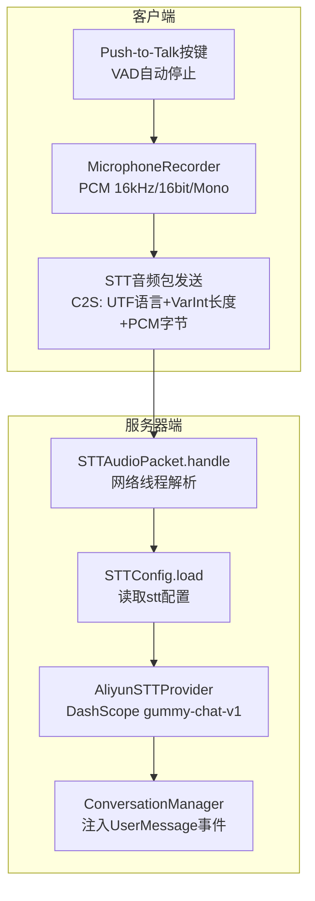
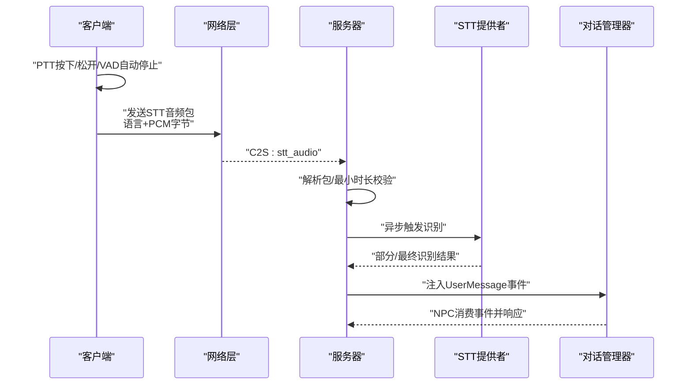
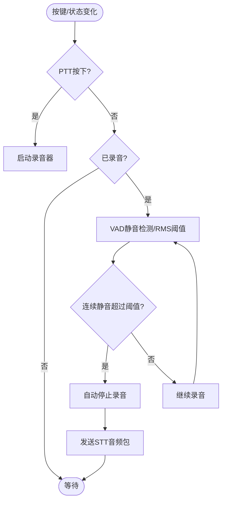
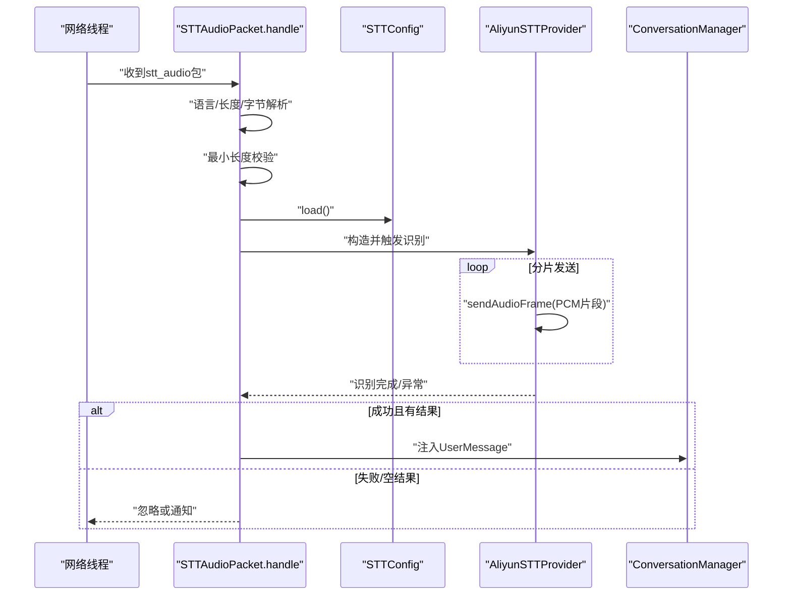
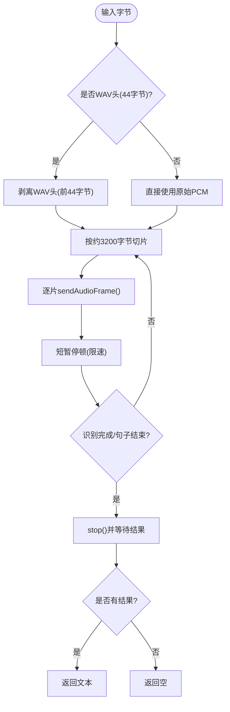
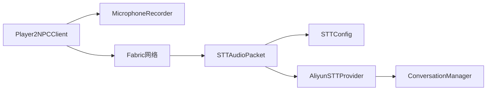

# STT语音识别

<cite>
**本文引用的文件**
- [AliyunSTTProvider.java](file://src/main/java/adris/altoclef/player2api/stt/AliyunSTTProvider.java)
- [STTConfig.java](file://src/main/java/adris/altoclef/player2api/stt/STTConfig.java)
- [STTAudioPacket.java](file://src/main/java/com/goodbird/player2npc/network/STTAudioPacket.java)
- [MicrophoneRecorder.java](file://src/main/java/com/goodbird/player2npc/client/audio/MicrophoneRecorder.java)
- [Player2NPCClient.java](file://src/main/java/com/goodbird/player2npc/Player2NPCClient.java)
- [ConversationManager.java](file://src/main/java/adris/altoclef/player2api/manager/ConversationManager.java)
- [playerengine-llm.json](file://run/config/playerengine-llm.json)
</cite>

## 目录
1. [简介](#简介)
2. [项目结构](#项目结构)
3. [核心组件](#核心组件)
4. [架构总览](#架构总览)
5. [组件详解](#组件详解)
6. [依赖关系分析](#依赖关系分析)
7. [性能考量](#性能考量)
8. [故障排查指南](#故障排查指南)
9. [结论](#结论)
10. [附录](#附录)

## 简介
本文件面向STT（语音转文本）子系统，聚焦于阿里云DashScope Gummy实时语音识别（gummy-chat-v1）在Minecraft模组中的实现。文档从客户端麦克风采集、网络传输协议、服务器端实时识别到结果注入对话系统进行全链路讲解，并给出配置参数、API调用路径、错误处理与性能优化建议。

## 项目结构
围绕STT的关键模块分布如下：
- 客户端
  - Push-to-Talk按键逻辑与VAD自动停止
  - 麦克风录制器：PCM/WAV格式、采样率16kHz、16bit、单声道
  - 录音数据打包并通过Fabric网络发送至服务器
- 服务器端
  - 网络包解析与鉴权校验
  - 异步触发阿里云STT识别
  - 将识别结果注入对话系统，再由NPC消费
- 配置
  - playerengine-llm.json中stt段落控制开关、模型与语言
  - STTConfig读取配置并回退到LLM提供商的API Key

**图示来源**
- [Player2NPCClient.java:64-124](file://src/main/java/com/goodbird/player2npc/Player2NPCClient.java#L64-L124)
- [MicrophoneRecorder.java:24-25](file://src/main/java/com/goodbird/player2npc/client/audio/MicrophoneRecorder.java#L24-L25)
- [STTAudioPacket.java:39-121](file://src/main/java/com/goodbird/player2npc/network/STTAudioPacket.java#L39-L121)
- [STTConfig.java:31-59](file://src/main/java/adris/altoclef/player2api/stt/STTConfig.java#L31-L59)
- [AliyunSTTProvider.java:47-154](file://src/main/java/adris/altoclef/player2api/stt/AliyunSTTProvider.java#L47-L154)
- [ConversationManager.java:99-114](file://src/main/java/adris/altoclef/player2api/manager/ConversationManager.java#L99-L114)

**章节来源**
- [Player2NPCClient.java:1-164](file://src/main/java/com/goodbird/player2npc/Player2NPCClient.java#L1-L164)
- [MicrophoneRecorder.java:1-200](file://src/main/java/com/goodbird/player2npc/client/audio/MicrophoneRecorder.java#L1-L200)
- [STTAudioPacket.java:1-134](file://src/main/java/com/goodbird/player2npc/network/STTAudioPacket.java#L1-L134)
- [STTConfig.java:1-78](file://src/main/java/adris/altoclef/player2api/stt/STTConfig.java#L1-L78)
- [AliyunSTTProvider.java:1-172](file://src/main/java/adris/altoclef/player2api/stt/AliyunSTTProvider.java#L1-L172)
- [ConversationManager.java:1-180](file://src/main/java/adris/altoclef/player2api/manager/ConversationManager.java#L1-L180)
- [playerengine-llm.json:69-78](file://run/config/playerengine-llm.json#L69-L78)

## 核心组件
- 阿里云Gummy STT提供者：封装DashScope WebSocket实时识别，支持PCM或WAV输入，自动剥离WAV头，按约100ms分片发送，支持部分/最终结果回调。
- STT配置加载器：从playerengine-llm.json读取stt段落，支持启用开关、模型、语言与API Key回退策略。
- 客户端录音器：以16kHz、16bit、单声道PCM录制，内置VAD静音检测与最大时长限制，输出原始PCM字节数组。
- 网络包处理器：服务器端接收C2S音频包，进行最小时长校验、异步识别、结果注入对话系统。
- 对话管理器：统一接收UserMessage事件，按拥有者与距离规则分发给NPC。

**章节来源**
- [AliyunSTTProvider.java:23-172](file://src/main/java/adris/altoclef/player2api/stt/AliyunSTTProvider.java#L23-L172)
- [STTConfig.java:13-78](file://src/main/java/adris/altoclef/player2api/stt/STTConfig.java#L13-L78)
- [MicrophoneRecorder.java:21-200](file://src/main/java/com/goodbird/player2npc/client/audio/MicrophoneRecorder.java#L21-L200)
- [STTAudioPacket.java:28-134](file://src/main/java/com/goodbird/player2npc/network/STTAudioPacket.java#L28-L134)
- [ConversationManager.java:27-180](file://src/main/java/adris/altoclef/player2api/manager/ConversationManager.java#L27-L180)

## 架构总览
下图展示从按键触发录音到识别结果注入NPC对话的完整流程。

**图示来源**
- [Player2NPCClient.java:64-124](file://src/main/java/com/goodbird/player2npc/Player2NPCClient.java#L64-L124)
- [STTAudioPacket.java:39-121](file://src/main/java/com/goodbird/player2npc/network/STTAudioPacket.java#L39-L121)
- [AliyunSTTProvider.java:47-154](file://src/main/java/adris/altoclef/player2api/stt/AliyunSTTProvider.java#L47-L154)
- [ConversationManager.java:99-114](file://src/main/java/adris/altoclef/player2api/manager/ConversationManager.java#L99-L114)

## 组件详解

### 客户端录音与传输
- 录音格式与参数
  - 采样率：16kHz
  - 位深度：16bit
  - 声道：单声道
  - 编码：PCM（小端序）
- 录音策略
  - PTT按下开始录音；松开或VAD检测到持续静音自动停止
  - 最大录音时长限制，避免过长音频
  - 录音期间基于RMS能量阈值进行静音检测
- 网络传输
  - 包格式：UTF编码的语言字符串（如"zh"）+ VarInt长度 + PCM字节
  - 发送通道：C2S stt_audio

**图示来源**
- [Player2NPCClient.java:64-124](file://src/main/java/com/goodbird/player2npc/Player2NPCClient.java#L64-L124)
- [MicrophoneRecorder.java:79-114](file://src/main/java/com/goodbird/player2npc/client/audio/MicrophoneRecorder.java#L79-L114)

**章节来源**
- [Player2NPCClient.java:27-164](file://src/main/java/com/goodbird/player2npc/Player2NPCClient.java#L27-L164)
- [MicrophoneRecorder.java:21-200](file://src/main/java/com/goodbird/player2npc/client/audio/MicrophoneRecorder.java#L21-L200)

### 服务器端识别与注入
- 包解析与校验
  - 读取语言、长度与PCM字节
  - 最小时长校验（至少约1秒，否则提示）
- 异步识别
  - 加载STT配置（模型、语言、API Key）
  - 初始化阿里云STT提供者并触发识别
  - 分片发送PCM（约100ms片段），带速率限制
  - 支持部分/最终结果回调
- 结果注入
  - 识别完成后在服务器线程内注入UserMessage事件
  - 由对话管理器按拥有者与距离规则分发给NPC

**图示来源**
- [STTAudioPacket.java:39-121](file://src/main/java/com/goodbird/player2npc/network/STTAudioPacket.java#L39-L121)
- [STTConfig.java:31-59](file://src/main/java/adris/altoclef/player2api/stt/STTConfig.java#L31-L59)
- [AliyunSTTProvider.java:47-154](file://src/main/java/adris/altoclef/player2api/stt/AliyunSTTProvider.java#L47-L154)
- [ConversationManager.java:99-114](file://src/main/java/adris/altoclef/player2api/manager/ConversationManager.java#L99-L114)

**章节来源**
- [STTAudioPacket.java:28-134](file://src/main/java/com/goodbird/player2npc/network/STTAudioPacket.java#L28-L134)
- [AliyunSTTProvider.java:47-154](file://src/main/java/adris/altoclef/player2api/stt/AliyunSTTProvider.java#L47-L154)
- [ConversationManager.java:99-114](file://src/main/java/adris/altoclef/player2api/manager/ConversationManager.java#L99-L114)

### 阿里云Gummy STT识别器
- 模型与参数
  - 模型：gummy-chat-v1（中文对话优化）
  - 输入格式：pcm
  - 采样率：16000Hz
  - 语言：由客户端传入（如"zh"）
- WebSocket与分片
  - WebSocket地址在类初始化时设定
  - 以约3200字节为一片（对应约100ms），循环发送
  - 每片间短暂休眠以限速CPU占用
- WAV头剥离
  - 若输入以RIFF/WAVE开头，则自动剥离前44字节WAV头，仅保留PCM
- 回调与超时
  - 支持部分/最终识别结果回调
  - 识别完成后等待最多30秒，超时返回空

**图示来源**
- [AliyunSTTProvider.java:99-137](file://src/main/java/adris/altoclef/player2api/stt/AliyunSTTProvider.java#L99-L137)

**章节来源**
- [AliyunSTTProvider.java:23-172](file://src/main/java/adris/altoclef/player2api/stt/AliyunSTTProvider.java#L23-L172)

### 配置参数说明
- 启用开关：stt.enabled（默认true）
- 模型：stt.model（默认gummy-chat-v1）
- 语言：stt.language（默认zh）
- API Key：优先使用stt段落下的apiKey，若为空则回退到qwen提供商的apiKey
- 其他：playerengine-llm.json中还包含tts等其他模块配置

**章节来源**
- [STTConfig.java:31-71](file://src/main/java/adris/altoclef/player2api/stt/STTConfig.java#L31-L71)
- [playerengine-llm.json:69-78](file://run/config/playerengine-llm.json#L69-L78)

### API调用示例（路径）
- 客户端发送STT音频包
  - [Player2NPCClient.java:150-162](file://src/main/java/com/goodbird/player2npc/Player2NPCClient.java#L150-L162)
- 服务器端接收并处理
  - [STTAudioPacket.java:39-121](file://src/main/java/com/goodbird/player2npc/network/STTAudioPacket.java#L39-L121)
- 识别与分片发送
  - [AliyunSTTProvider.java:109-131](file://src/main/java/adris/altoclef/player2api/stt/AliyunSTTProvider.java#L109-L131)
- 配置加载
  - [STTConfig.java:31-59](file://src/main/java/adris/altoclef/player2api/stt/STTConfig.java#L31-L59)
- 对话注入
  - [ConversationManager.java:99-114](file://src/main/java/adris/altoclef/player2api/manager/ConversationManager.java#L99-L114)

## 依赖关系分析
- 客户端依赖
  - MicrophoneRecorder负责PCM采集与VAD
  - Player2NPCClient负责按键监听、VAD触发与网络发送
- 服务器端依赖
  - STTAudioPacket负责网络解析与异步识别调度
  - STTConfig负责配置读取与API Key回退
  - AliyunSTTProvider负责DashScope识别
  - ConversationManager负责事件注入与NPC分发
- 关键耦合点
  - 客户端与服务器端通过Fabric网络通道"player2npc:stt_audio"通信
  - 识别结果经ConversationManager统一进入NPC对话管线

**图示来源**
- [Player2NPCClient.java:33-164](file://src/main/java/com/goodbird/player2npc/Player2NPCClient.java#L33-L164)
- [MicrophoneRecorder.java:21-200](file://src/main/java/com/goodbird/player2npc/client/audio/MicrophoneRecorder.java#L21-L200)
- [STTAudioPacket.java:28-134](file://src/main/java/com/goodbird/player2npc/network/STTAudioPacket.java#L28-L134)
- [STTConfig.java:13-78](file://src/main/java/adris/altoclef/player2api/stt/STTConfig.java#L13-L78)
- [AliyunSTTProvider.java:23-172](file://src/main/java/adris/altoclef/player2api/stt/AliyunSTTProvider.java#L23-L172)
- [ConversationManager.java:27-180](file://src/main/java/adris/altoclef/player2api/manager/ConversationManager.java#L27-L180)

**章节来源**
- [Player2NPCClient.java:1-164](file://src/main/java/com/goodbird/player2npc/Player2NPCClient.java#L1-L164)
- [STTAudioPacket.java:1-134](file://src/main/java/com/goodbird/player2npc/network/STTAudioPacket.java#L1-L134)
- [AliyunSTTProvider.java:1-172](file://src/main/java/adris/altoclef/player2api/stt/AliyunSTTProvider.java#L1-L172)
- [STTConfig.java:1-78](file://src/main/java/adris/altoclef/player2api/stt/STTConfig.java#L1-L78)
- [ConversationManager.java:1-180](file://src/main/java/adris/altoclef/player2api/manager/ConversationManager.java#L1-L180)

## 性能考量
- 分片大小与传输速率
  - 建议维持约3200字节/片（100ms），兼顾延迟与CPU占用
  - 片间短暂停顿（如20ms）可有效抑制CPU飙升
- 超时与稳定性
  - 识别等待上限30秒，超时返回空；可根据网络状况调整
  - 服务器端识别线程为守护线程，避免主线程阻塞
- 麦克风与VAD
  - VAD静音阈值与静默窗口需结合实际环境调优
  - 最大录音时长限制避免过大音频导致识别超时
- 网络与并发
  - 网络线程仅做轻量解析，重活丢到工作线程
  - 多玩家并发场景建议评估服务器CPU与网络带宽

[本节为通用性能建议，不直接分析具体文件]

## 故障排查指南
- 麦克风权限与可用性
  - 客户端检查麦克风可用性失败时会提示不可用
  - 建议确认系统麦克风权限与驱动正常
  - 参考：[Player2NPCClient.java:73-80](file://src/main/java/com/goodbird/player2npc/Player2NPCClient.java#L73-L80)，[MicrophoneRecorder.java:49-56](file://src/main/java/com/goodbird/player2npc/client/audio/MicrophoneRecorder.java#L49-L56)
- 网络连接中断
  - 客户端发送STT包异常会记录错误日志
  - 建议检查网络连通性与服务器状态
  - 参考：[Player2NPCClient.java:150-162](file://src/main/java/com/goodbird/player2npc/Player2NPCClient.java#L150-L162)
- 音频质量不佳
  - 确认客户端录音格式为PCM 16kHz/16bit/单声道
  - 避免背景噪音过大，适当提高VAD阈值
  - 参考：[MicrophoneRecorder.java:24-25](file://src/main/java/com/goodbird/player2npc/client/audio/MicrophoneRecorder.java#L24-L25)
- 识别结果为空或超时
  - 确认音频时长至少约1秒
  - 检查stt.enabled与API Key配置
  - 参考：[STTAudioPacket.java:56-63](file://src/main/java/com/goodbird/player2npc/network/STTAudioPacket.java#L56-L63)，[STTConfig.java:31-59](file://src/main/java/adris/altoclef/player2api/stt/STTConfig.java#L31-L59)
- 识别服务不可用
  - API Key未配置或处于占位符状态
  - 参考：[STTAudioPacket.java:76-81](file://src/main/java/com/goodbird/player2npc/network/STTAudioPacket.java#L76-L81)，[STTConfig.java:61-71](file://src/main/java/adris/altoclef/player2api/stt/STTConfig.java#L61-L71)

**章节来源**
- [Player2NPCClient.java:73-80](file://src/main/java/com/goodbird/player2npc/Player2NPCClient.java#L73-L80)
- [MicrophoneRecorder.java:49-56](file://src/main/java/com/goodbird/player2npc/client/audio/MicrophoneRecorder.java#L49-L56)
- [Player2NPCClient.java:150-162](file://src/main/java/com/goodbird/player2npc/Player2NPCClient.java#L150-L162)
- [STTAudioPacket.java:56-63](file://src/main/java/com/goodbird/player2npc/network/STTAudioPacket.java#L56-L63)
- [STTConfig.java:61-71](file://src/main/java/adris/altoclef/player2api/stt/STTConfig.java#L61-L71)

## 结论
本STT系统以简洁可靠的客户端录音+服务器端异步识别为核心，采用DashScope Gummy模型与合理的分片策略，在保证识别质量的同时兼顾性能与稳定性。通过配置文件灵活切换模型与语言，配合对话系统无缝接入NPC行为链路，形成从语音到动作的闭环。

[本节为总结性内容，不直接分析具体文件]

## 附录
- 配置文件位置与关键项
  - [playerengine-llm.json:69-78](file://run/config/playerengine-llm.json#L69-L78)
- 网络通道
  - 客户端发送：stt_audio
  - 服务器接收：同上
  - 参考：[AI_NPC项目整体架构概览.md:814-824](file://docs/AI_NPC项目整体架构概览.md#L814-L824)

**章节来源**
- [playerengine-llm.json:69-78](file://run/config/playerengine-llm.json#L69-L78)
- [docs/AI_NPC项目整体架构概览.md:814-824](file://docs/AI_NPC项目整体架构概览.md#L814-L824)