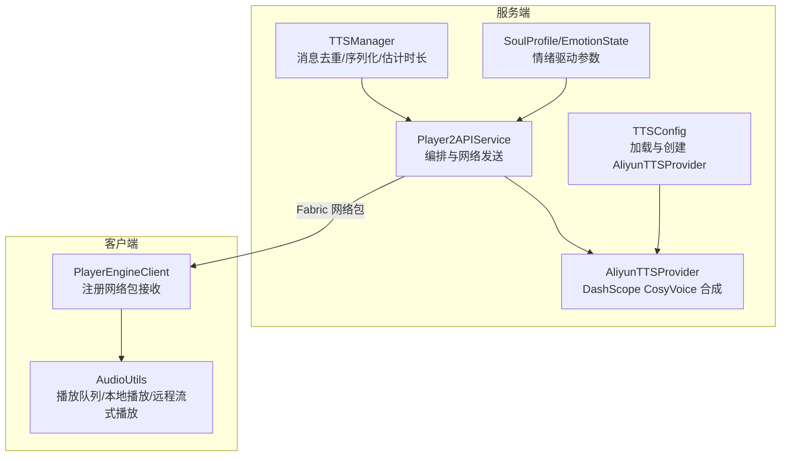
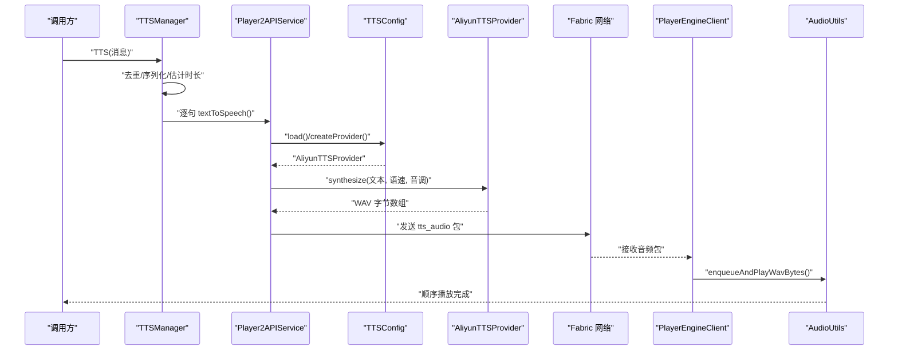
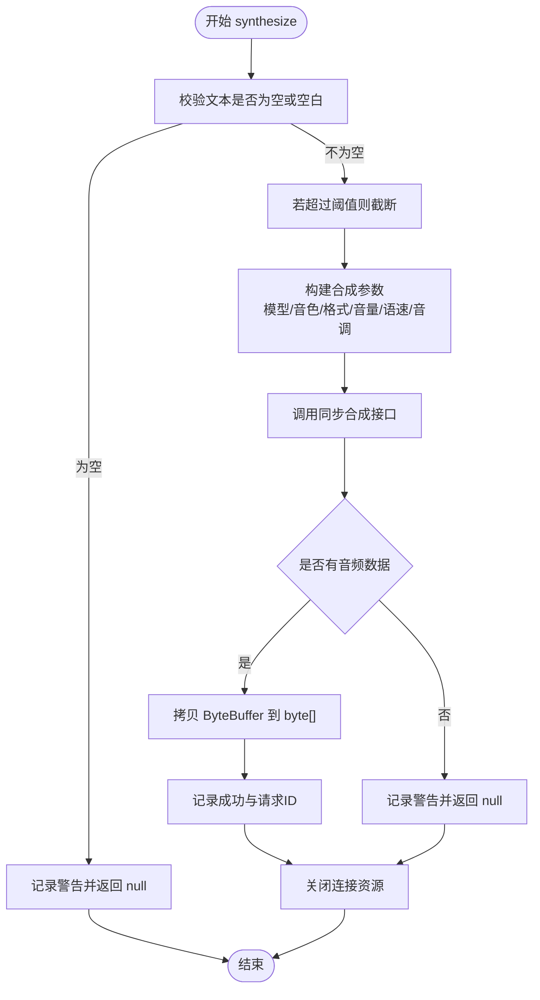
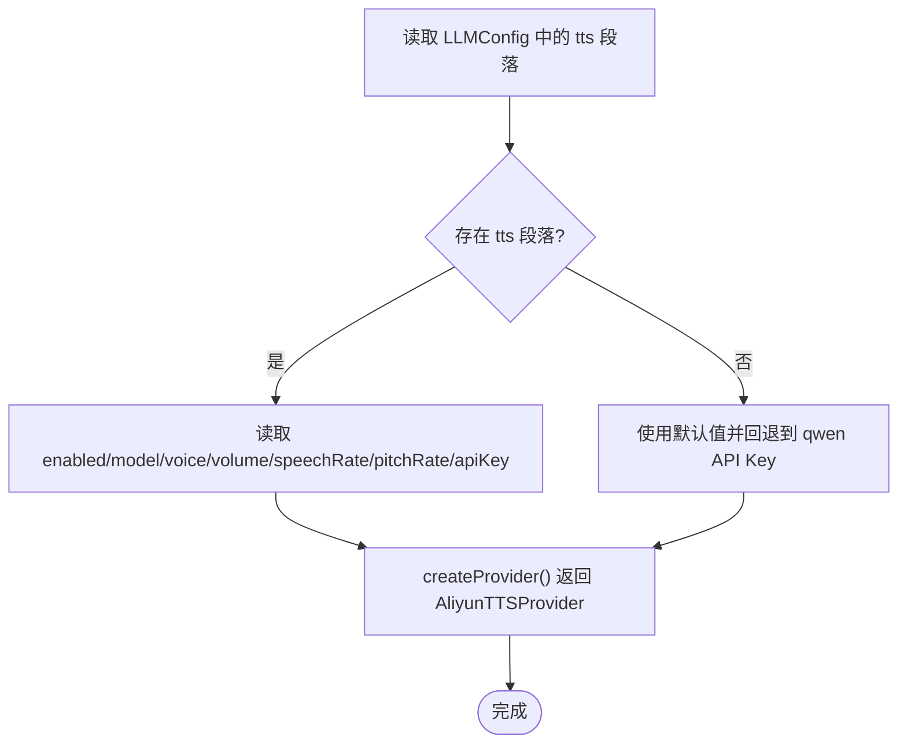
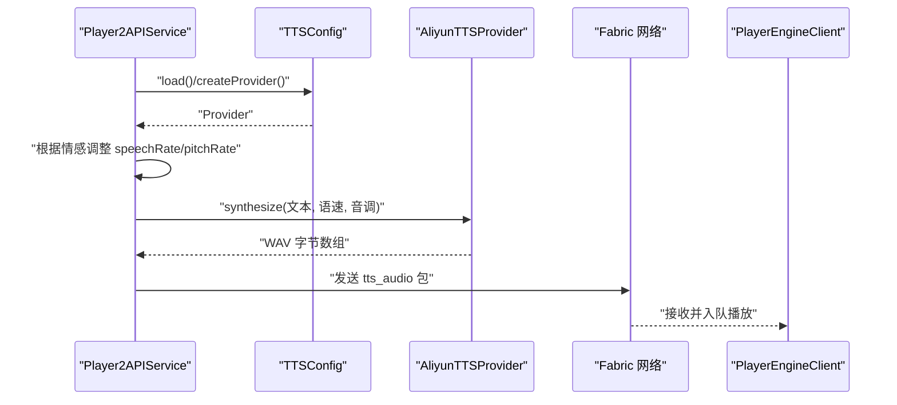
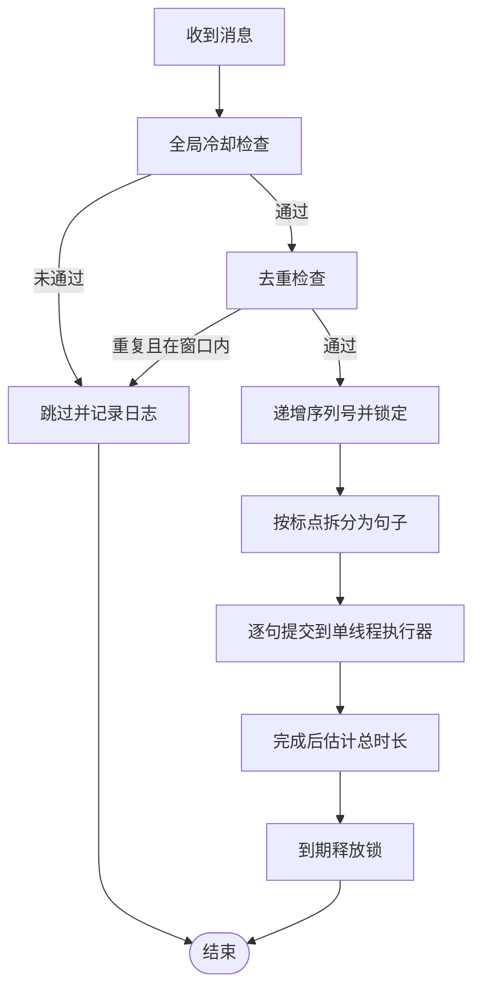
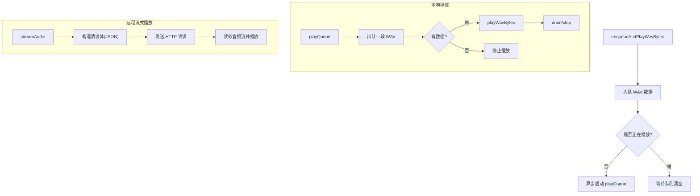
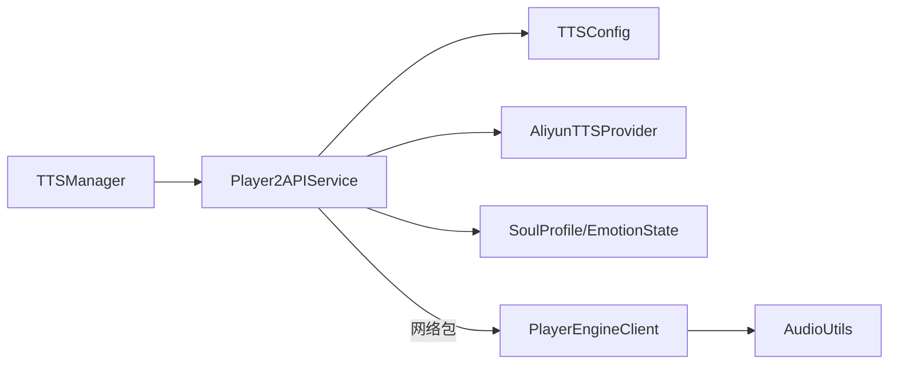

# TTS 语音合成

<cite>
**本文引用的文件**
- [AliyunTTSProvider.java](file://src/main/java/adris/altoclef/player2api/tts/AliyunTTSProvider.java)
- [TTSConfig.java](file://src/main/java/adris/altoclef/player2api/tts/TTSConfig.java)
- [AudioUtils.java](file://src/main/java/adris/altoclef/player2api/utils/AudioUtils.java)
- [Player2APIService.java](file://src/main/java/adris/altoclef/player2api/Player2APIService.java)
- [TTSManager.java](file://src/main/java/adris/altoclef/player2api/manager/TTSManager.java)
- [playerengine-llm-default.json](file://src/main/resources/playerengine-llm-default.json)
- [EmotionState.java](file://src/main/java/adris/altoclef/player2api/soul/EmotionState.java)
- [SoulProfile.java](file://src/main/java/adris/altoclef/player2api/soul/SoulProfile.java)
- [Character.java](file://src/main/java/adris/altoclef/player2api/Character.java)
- [PlayerEngineClient.java](file://src/main/java/adris/altoclef/PlayerEngineClient.java)
</cite>

## 目录
1. [简介](#简介)
2. [项目结构](#项目结构)
3. [核心组件](#核心组件)
4. [架构总览](#架构总览)
5. [详细组件分析](#详细组件分析)
6. [依赖关系分析](#依赖关系分析)
7. [性能考量](#性能考量)
8. [故障排查指南](#故障排查指南)
9. [结论](#结论)
10. [附录](#附录)

## 简介
本文件面向 TTS 语音合成系统，聚焦于阿里云语音合成服务的实现与集成，涵盖以下主题：
- AliyunTTSProvider 的音频生成流程与参数配置
- 文本转语音处理机制与音频数据格式化
- 音频数据的处理管道：文本预处理、语音参数配置、音频流生成
- AudioUtils 工具类在播放队列、格式化播放与远程流式播放中的作用
- 具体配置示例：合成参数、语音类型、语速与音调调整
- 音频播放优化策略、网络传输效率与音频质量控制

## 项目结构
围绕 TTS 的相关模块主要分布在以下路径：
- 阿里云 TTS 提供者与配置：player2api/tts
- 音频工具与播放：player2api/utils
- 服务编排与网络发送：player2api
- 情感系统与情绪驱动的语音参数：player2api/soul
- 客户端接收与播放：PlayerEngineClient
- 默认配置文件：resources/playerengine-llm-default.json

图表来源
- [Player2APIService.java:120-231](file://src/main/java/adris/altoclef/player2api/Player2APIService.java#L120-L231)
- [TTSManager.java:94-153](file://src/main/java/adris/altoclef/player2api/manager/TTSManager.java#L94-L153)
- [TTSConfig.java:38-92](file://src/main/java/adris/altoclef/player2api/tts/TTSConfig.java#L38-L92)
- [AliyunTTSProvider.java:50-104](file://src/main/java/adris/altoclef/player2api/tts/AliyunTTSProvider.java#L50-L104)
- [PlayerEngineClient.java:36-63](file://src/main/java/adris/altoclef/PlayerEngineClient.java#L36-L63)
- [AudioUtils.java:49-104](file://src/main/java/adris/altoclef/player2api/utils/AudioUtils.java#L49-L104)

章节来源
- [Player2APIService.java:120-231](file://src/main/java/adris/altoclef/player2api/Player2APIService.java#L120-L231)
- [TTSManager.java:94-153](file://src/main/java/adris/altoclef/player2api/manager/TTSManager.java#L94-L153)
- [TTSConfig.java:38-92](file://src/main/java/adris/altoclef/player2api/tts/TTSConfig.java#L38-L92)
- [AliyunTTSProvider.java:50-104](file://src/main/java/adris/altoclef/player2api/tts/AliyunTTSProvider.java#L50-L104)
- [PlayerEngineClient.java:36-63](file://src/main/java/adris/altoclef/PlayerEngineClient.java#L36-L63)
- [AudioUtils.java:49-104](file://src/main/java/adris/altoclef/player2api/utils/AudioUtils.java#L49-L104)

## 核心组件
- AliyunTTSProvider：封装阿里云 DashScope CosyVoice 的文本转语音能力，输出 WAV 格式的音频字节流，支持音量、语速、音调参数，并进行请求清理与错误处理。
- TTSConfig：从配置文件读取 TTS 设置，支持回退到 LLM 提供者的 API Key，生成 AliyunTTSProvider 实例。
- Player2APIService：在本地模式下触发 Aliyun 合成，结合 NPC 情绪系统动态调整语速与音调，通过 Fabric 网络包将音频发送至客户端。
- TTSManager：对消息进行去重、序列化拆句、全局冷却与估计结束时间，确保客户端串行播放与低延迟。
- AudioUtils：负责本地 WAV 播放队列、顺序播放、以及远程流式播放（player2-remote 模式）。
- 情感系统：SoulProfile 与 EmotionState 提供情绪状态，驱动语速与音调的微调，使语音更贴合 NPC 当前情感。

章节来源
- [AliyunTTSProvider.java:19-113](file://src/main/java/adris/altoclef/player2api/tts/AliyunTTSProvider.java#L19-L113)
- [TTSConfig.java:13-102](file://src/main/java/adris/altoclef/player2api/tts/TTSConfig.java#L13-L102)
- [Player2APIService.java:120-231](file://src/main/java/adris/altoclef/player2api/Player2APIService.java#L120-L231)
- [TTSManager.java:35-168](file://src/main/java/adris/altoclef/player2api/manager/TTSManager.java#L35-L168)
- [AudioUtils.java:37-170](file://src/main/java/adris/altoclef/player2api/utils/AudioUtils.java#L37-L170)
- [EmotionState.java:6-128](file://src/main/java/adris/altoclef/player2api/soul/EmotionState.java#L6-L128)
- [SoulProfile.java:15-226](file://src/main/java/adris/altoclef/player2api/soul/SoulProfile.java#L15-L226)

## 架构总览
下面的时序图展示了从消息到客户端播放的完整链路，包括服务端合成、网络传输与客户端播放：

图表来源
- [TTSManager.java:94-153](file://src/main/java/adris/altoclef/player2api/manager/TTSManager.java#L94-L153)
- [Player2APIService.java:120-200](file://src/main/java/adris/altoclef/player2api/Player2APIService.java#L120-L200)
- [TTSConfig.java:89-92](file://src/main/java/adris/altoclef/player2api/tts/TTSConfig.java#L89-L92)
- [AliyunTTSProvider.java:50-104](file://src/main/java/adris/altoclef/player2api/tts/AliyunTTSProvider.java#L50-L104)
- [PlayerEngineClient.java:36-45](file://src/main/java/adris/altoclef/PlayerEngineClient.java#L36-L45)
- [AudioUtils.java:49-68](file://src/main/java/adris/altoclef/player2api/utils/AudioUtils.java#L49-L68)

## 详细组件分析

### AliyunTTSProvider 组件分析
- 功能职责
  - 使用 DashScope CosyVoice 进行文本转语音，返回 WAV 格式字节数组。
  - 支持音量、语速、音调参数，以及文本长度截断保护。
  - 提供可用性检查，避免未配置 API Key 时的无效调用。
- 关键流程
  - 构建 SpeechSynthesisParam，指定模型、音色、采样率、位深、音量、语速、音调。
  - 调用同步合成接口，读取 ByteBuffer 并转换为 byte[]。
  - 记录请求 ID 与音频大小，异常捕获与资源关闭。
- 错误处理
  - 空文本跳过；超长文本截断；异常记录并返回空结果；连接清理。

图表来源
- [AliyunTTSProvider.java:50-104](file://src/main/java/adris/altoclef/player2api/tts/AliyunTTSProvider.java#L50-L104)

章节来源
- [AliyunTTSProvider.java:19-113](file://src/main/java/adris/altoclef/player2api/tts/AliyunTTSProvider.java#L19-L113)

### TTSConfig 组件分析
- 功能职责
  - 从配置文件读取 TTS 开关、模型、音色、音量、语速、音调等参数。
  - 若未单独配置 TTS API Key，则回退到 LLM 提供者（如 qwen）的 API Key。
  - 创建 AliyunTTSProvider 实例。
- 关键流程
  - 读取 tts 段落；缺失字段使用默认值；优先使用独立 API Key。
  - 输出日志包含开关、模型、音色与密钥片段，便于核对。

图表来源
- [TTSConfig.java:38-92](file://src/main/java/adris/altoclef/player2api/tts/TTSConfig.java#L38-L92)

章节来源
- [TTSConfig.java:13-102](file://src/main/java/adris/altoclef/player2api/tts/TTSConfig.java#L13-L102)
- [playerengine-llm-default.json:52-67](file://src/main/resources/playerengine-llm-default.json#L52-L67)

### Player2APIService 组件分析
- 功能职责
  - 在本地模式下，根据 NPC 情绪动态调整语速与音调，调用 AliyunTTSProvider 合成音频。
  - 将合成后的 WAV 字节通过 Fabric 网络包发送到客户端。
  - 若合成失败，回退显示聊天消息提示。
- 关键流程
  - 读取配置并创建 Provider。
  - 从 SoulProfile 获取主导情绪与强度，映射到语速与音调的微调。
  - 发送网络包并记录日志；失败时回退到聊天消息。

图表来源
- [Player2APIService.java:120-200](file://src/main/java/adris/altoclef/player2api/Player2APIService.java#L120-L200)
- [TTSConfig.java:89-92](file://src/main/java/adris/altoclef/player2api/tts/TTSConfig.java#L89-L92)
- [AliyunTTSProvider.java:50-104](file://src/main/java/adris/altoclef/player2api/tts/AliyunTTSProvider.java#L50-L104)

章节来源
- [Player2APIService.java:120-231](file://src/main/java/adris/altoclef/player2api/Player2APIService.java#L120-L231)
- [SoulProfile.java:15-226](file://src/main/java/adris/altoclef/player2api/soul/SoulProfile.java#L15-L226)
- [EmotionState.java:68-90](file://src/main/java/adris/altoclef/player2api/soul/EmotionState.java#L68-L90)

### TTSManager 组件分析
- 功能职责
  - 对传入消息进行去重、按句号/感叹号/问号等标点拆分为句子，提交到单线程队列顺序执行。
  - 全局冷却与序列号机制，防止旧消息抢占新消息的播放。
  - 基于字符数估算播放时长，释放锁以允许后续逻辑继续推进。
- 关键流程
  - splitIntoSentences：保留标点并去除多余空白。
  - 为每个句子提交到单线程执行器，保证串行合成与播放。
  - 估计总时长并在合适时机释放锁。

图表来源
- [TTSManager.java:94-153](file://src/main/java/adris/altoclef/player2api/manager/TTSManager.java#L94-L153)

章节来源
- [TTSManager.java:35-168](file://src/main/java/adris/altoclef/player2api/manager/TTSManager.java#L35-L168)

### AudioUtils 组件分析
- 功能职责
  - 本地播放：维护一个队列，顺序播放多个 WAV 片段，避免重叠。
  - 远程流式播放：在 player2-remote 模式下，向远端 API 发起流式请求并直接播放。
- 关键流程
  - enqueueAndPlayWavBytes：入队并异步串行播放。
  - playWavBytes：使用 Java Sound API 打开 SourceDataLine 并写入缓冲区。
  - streamAudio：构造 JSON 请求体，发送到远端 API 并播放返回的音频流。

图表来源
- [AudioUtils.java:49-104](file://src/main/java/adris/altoclef/player2api/utils/AudioUtils.java#L49-L104)
- [AudioUtils.java:110-168](file://src/main/java/adris/altoclef/player2api/utils/AudioUtils.java#L110-L168)

章节来源
- [AudioUtils.java:37-170](file://src/main/java/adris/altoclef/player2api/utils/AudioUtils.java#L37-L170)

### 情感驱动的语音参数
- 情绪到参数映射
  - 当主导情绪强度高于阈值时，对 speechRate 与 pitchRate 进行温和调整，避免突变。
  - 不同情绪对应不同的语速与音调微调，增强表现力。
- 参数范围与稳定性
  - 语速与音调为倍率参数，建议保持在合理范围内，避免过度夸张导致失真。

章节来源
- [Player2APIService.java:132-155](file://src/main/java/adris/altoclef/player2api/Player2APIService.java#L132-L155)
- [EmotionState.java:68-90](file://src/main/java/adris/altoclef/player2api/soul/EmotionState.java#L68-L90)

## 依赖关系分析
- 服务端依赖
  - Player2APIService 依赖 TTSConfig、AliyunTTSProvider、SoulProfile/EmotionState。
  - TTSManager 依赖 Player2APIService 的 textToSpeech 回调。
- 客户端依赖
  - PlayerEngineClient 注册网络包接收器，将服务器发送的音频字节交给 AudioUtils 播放。
- 外部依赖
  - 阿里云 DashScope SDK（CosyVoice）、Java Sound API、Fabric 网络库。

图表来源
- [Player2APIService.java:120-231](file://src/main/java/adris/altoclef/player2api/Player2APIService.java#L120-L231)
- [TTSManager.java:94-153](file://src/main/java/adris/altoclef/player2api/manager/TTSManager.java#L94-L153)
- [PlayerEngineClient.java:36-63](file://src/main/java/adris/altoclef/PlayerEngineClient.java#L36-L63)
- [AudioUtils.java:49-104](file://src/main/java/adris/altoclef/player2api/utils/AudioUtils.java#L49-L104)

章节来源
- [Player2APIService.java:120-231](file://src/main/java/adris/altoclef/player2api/Player2APIService.java#L120-L231)
- [TTSManager.java:94-153](file://src/main/java/adris/altoclef/player2api/manager/TTSManager.java#L94-L153)
- [PlayerEngineClient.java:36-63](file://src/main/java/adris/altoclef/PlayerEngineClient.java#L36-L63)
- [AudioUtils.java:49-104](file://src/main/java/adris/altoclef/player2api/utils/AudioUtils.java#L49-L104)

## 性能考量
- 合成性能
  - 采用同步（非流式）合成，适合中短文本；长文本会被截断，避免超限。
  - 通过 TTSManager 将长消息拆分为句子，减少单次合成压力并降低首包延迟。
- 播放性能
  - AudioUtils 使用固定大小缓冲区（约 4KB）顺序写入，平衡内存占用与吞吐。
  - 播放队列串行化，避免多段音频重叠造成撕裂与卡顿。
- 网络传输
  - 本地模式下，音频以二进制包形式发送，包头包含模式标识与长度，减少额外解析成本。
  - 远程模式下，直接播放远端流式音频，避免本地解码与编码开销。
- 资源管理
  - 合成器在 finally 中关闭连接，避免资源泄漏。
  - 全局冷却与去重策略防止频繁触发与重复播放。

## 故障排查指南
- 合成失败
  - 现象：返回空音频或记录错误日志。
  - 排查：确认 API Key 是否配置正确且未处于占位符状态；检查文本是否为空或过长；查看日志中的请求 ID 以便定位。
- 播放异常
  - 现象：无法播放或播放中断。
  - 排查：确认客户端已注册网络包接收器；检查 AudioUtils 的播放流程与缓冲区写入；验证音频格式兼容性（WAV 22050Hz Mono 16bit）。
- 网络发送失败
  - 现象：客户端未收到音频包。
  - 排查：确认服务端玩家对象有效且为 ServerPlayer；检查网络包通道名称与读写顺序一致；查看服务端日志中的发送记录。
- 情绪参数未生效
  - 现象：语音未随情绪变化。
  - 排查：确认 NPC 情绪强度超过阈值；检查情绪映射逻辑是否被覆盖；验证合成参数传递路径。

章节来源
- [AliyunTTSProvider.java:94-103](file://src/main/java/adris/altoclef/player2api/tts/AliyunTTSProvider.java#L94-L103)
- [Player2APIService.java:160-191](file://src/main/java/adris/altoclef/player2api/Player2APIService.java#L160-L191)
- [AudioUtils.java:76-104](file://src/main/java/adris/altoclef/player2api/utils/AudioUtils.java#L76-L104)
- [PlayerEngineClient.java:36-45](file://src/main/java/adris/altoclef/PlayerEngineClient.java#L36-L45)

## 结论
该 TTS 系统以阿里云 DashScope CosyVoice 为核心，结合情感驱动的参数调整、消息序列化与播放队列，实现了低延迟、稳定的本地语音合成与播放。通过合理的配置与参数映射，系统能够在不同情绪状态下自然地调整语速与音调，提升 NPC 表现力。同时，完善的错误处理与资源管理保障了运行稳定性。

## 附录

### 配置示例与说明
- 配置文件位置与结构
  - 默认配置文件位于 resources/playerengine-llm-default.json，包含 tts 段落与各参数说明。
- 常用参数
  - enabled：是否启用 TTS。
  - model：模型版本（如 cosyvoice-v3-flash）。
  - voice：音色 ID（如 longanhuan）。
  - volume：音量（0~100）。
  - speechRate：语速倍率（>1 加快，<1 减慢）。
  - pitchRate：音调倍率（>1 升高，<1 降低）。
  - apiKey：TTS 专用 API Key；若留空则回退到 LLM 提供者的 API Key。
- 参考路径
  - [playerengine-llm-default.json:52-67](file://src/main/resources/playerengine-llm-default.json#L52-L67)

章节来源
- [playerengine-llm-default.json:52-67](file://src/main/resources/playerengine-llm-default.json#L52-L67)
- [TTSConfig.java:38-72](file://src/main/java/adris/altoclef/player2api/tts/TTSConfig.java#L38-L72)

### 音频播放优化策略
- 播放队列
  - 使用并发队列与单线程异步播放，避免重叠与撕裂。
- 缓冲区大小
  - 固定大小缓冲区（约 4KB）平衡内存与吞吐。
- 格式兼容
  - 使用 WAV 22050Hz Mono 16bit，确保 javax.sound 兼容性。
- 参考路径
  - [AudioUtils.java:49-104](file://src/main/java/adris/altoclef/player2api/utils/AudioUtils.java#L49-L104)

章节来源
- [AudioUtils.java:49-104](file://src/main/java/adris/altoclef/player2api/utils/AudioUtils.java#L49-L104)

### 网络传输效率提升
- 本地模式
  - 以二进制包发送音频，包头包含模式标识与长度，减少解析开销。
- 远程模式
  - 直接播放远端流式音频，避免本地解码与编码。
- 参考路径
  - [Player2APIService.java:160-177](file://src/main/java/adris/altoclef/player2api/Player2APIService.java#L160-L177)
  - [PlayerEngineClient.java:36-45](file://src/main/java/adris/altoclef/PlayerEngineClient.java#L36-L45)
  - [AudioUtils.java:110-168](file://src/main/java/adris/altoclef/player2api/utils/AudioUtils.java#L110-L168)

章节来源
- [Player2APIService.java:160-177](file://src/main/java/adris/altoclef/player2api/Player2APIService.java#L160-L177)
- [PlayerEngineClient.java:36-45](file://src/main/java/adris/altoclef/PlayerEngineClient.java#L36-L45)
- [AudioUtils.java:110-168](file://src/main/java/adris/altoclef/player2api/utils/AudioUtils.java#L110-L168)

### 音频质量控制
- 参数控制
  - 语速与音调为倍率参数，建议在合理范围内微调，避免过度夸张导致失真。
- 情绪驱动
  - 当主导情绪强度较高时，适度调整语速与音调，增强表现力但保持自然。
- 参考路径
  - [Player2APIService.java:132-155](file://src/main/java/adris/altoclef/player2api/Player2APIService.java#L132-L155)
  - [EmotionState.java:68-90](file://src/main/java/adris/altoclef/player2api/soul/EmotionState.java#L68-L90)

章节来源
- [Player2APIService.java:132-155](file://src/main/java/adris/altoclef/player2api/Player2APIService.java#L132-L155)
- [EmotionState.java:68-90](file://src/main/java/adris/altoclef/player2api/soul/EmotionState.java#L68-L90)