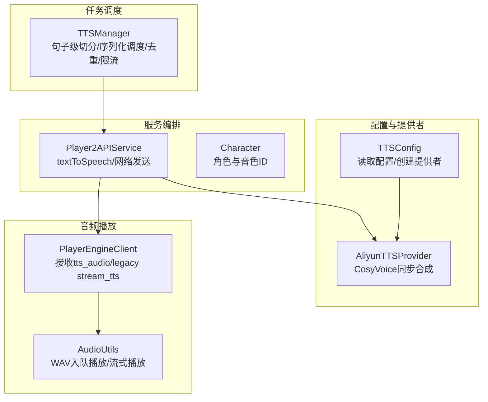
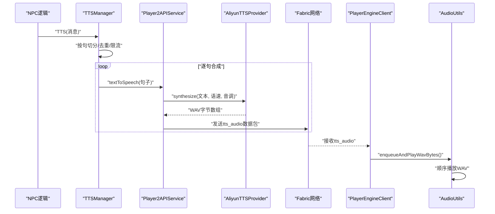
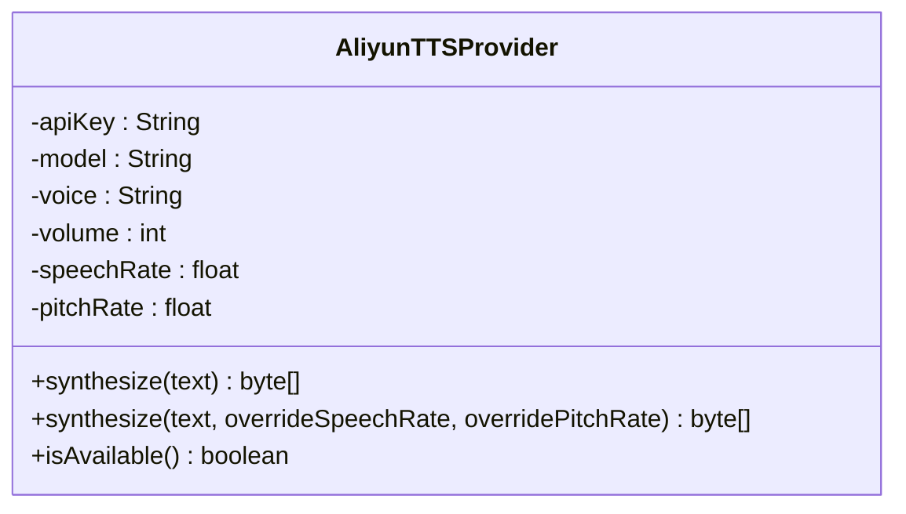
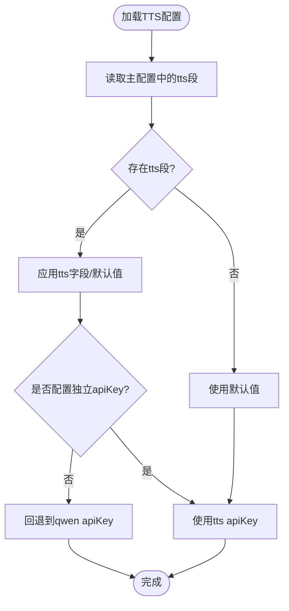
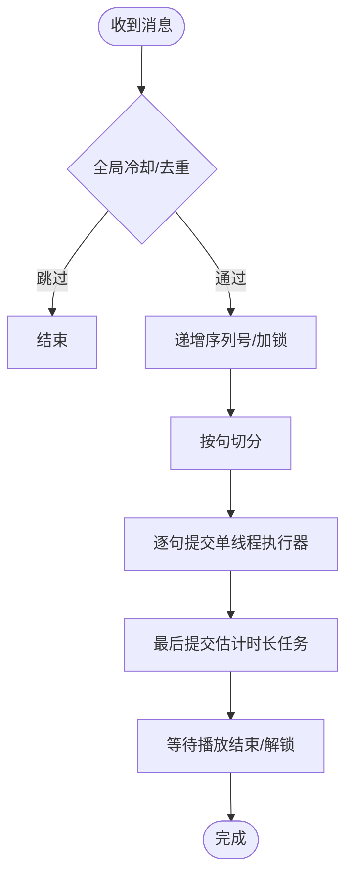
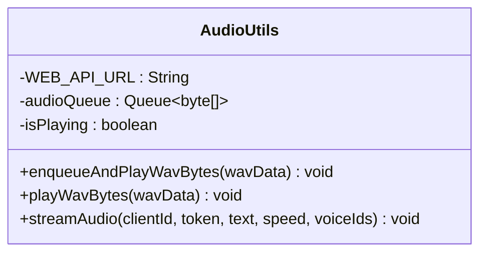
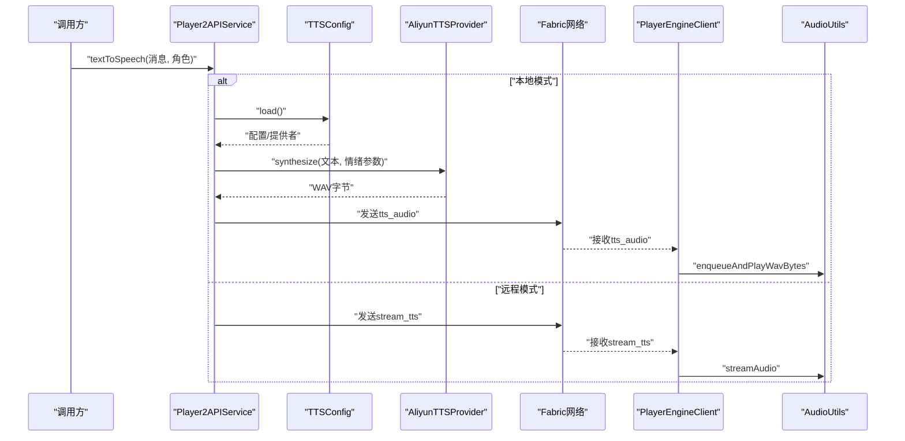
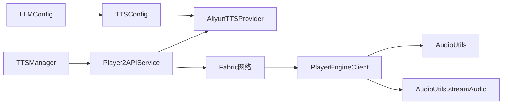

# TTS语音合成

<cite>
**本文引用的文件**
- [AliyunTTSProvider.java](file://src/main/java/adris/altoclef/player2api/tts/AliyunTTSProvider.java)
- [TTSConfig.java](file://src/main/java/adris/altoclef/player2api/tts/TTSConfig.java)
- [TTSManager.java](file://src/main/java/adris/altoclef/player2api/manager/TTSManager.java)
- [AudioUtils.java](file://src/main/java/adris/altoclef/player2api/utils/AudioUtils.java)
- [Player2APIService.java](file://src/main/java/adris/altoclef/player2api/Player2APIService.java)
- [Character.java](file://src/main/java/adris/altoclef/player2api/Character.java)
- [playerengine-llm-default.json](file://src/main/resources/playerengine-llm-default.json)
- [PlayerEngineClient.java](file://src/main/java/adris/altoclef/PlayerEngineClient.java)
- [HttpApiException.java](file://src/main/java/adris/altoclef/player2api/utils/HttpApiException.java)
- [MicrophoneRecorder.java](file://src/main/java/com/goodbird/player2npc/client/audio/MicrophoneRecorder.java)
- [STTAudioPacket.java](file://src/main/java/com/goodbird/player2npc/network/STTAudioPacket.java)
</cite>

## 目录
1. [简介](#简介)
2. [项目结构](#项目结构)
3. [核心组件](#核心组件)
4. [架构总览](#架构总览)
5. [详细组件分析](#详细组件分析)
6. [依赖关系分析](#依赖关系分析)
7. [性能考量](#性能考量)
8. [故障排查指南](#故障排查指南)
9. [结论](#结论)
10. [附录](#附录)

## 简介
本文件面向“AI NPC语音合成系统”，围绕阿里云CosyVoice TTS合成器的实现进行深入技术说明，涵盖文本预处理、语音合成与音频输出的完整流程；解释TTS配置参数（音色、语速、音量等）；阐述TTSManager的任务调度与音频队列管理；详述AudioUtils的音频格式转换、播放控制与缓冲机制；并提供API调用示例、配置项说明、错误处理策略、延迟优化、音质控制与多线程处理建议，以及常见问题的解决方案。

## 项目结构
TTS相关代码主要分布在以下模块：
- 配置与提供者：TTSConfig、AliyunTTSProvider
- 任务调度与文本切分：TTSManager
- 音频播放与流式播放：AudioUtils
- 服务编排与网络发送：Player2APIService、PlayerEngineClient
- 配置文件：playerengine-llm-default.json
- 相关工具与异常：HttpApiException、MicrophoneRecorder、STTAudioPacket

图示来源
- [TTSConfig.java:38-92](file://src/main/java/adris/altoclef/player2api/tts/TTSConfig.java#L38-L92)
- [AliyunTTSProvider.java:50-104](file://src/main/java/adris/altoclef/player2api/tts/AliyunTTSProvider.java#L50-L104)
- [TTSManager.java:94-153](file://src/main/java/adris/altoclef/player2api/manager/TTSManager.java#L94-L153)
- [AudioUtils.java:49-104](file://src/main/java/adris/altoclef/player2api/utils/AudioUtils.java#L49-L104)
- [Player2APIService.java:120-231](file://src/main/java/adris/altoclef/player2api/Player2APIService.java#L120-L231)
- [PlayerEngineClient.java:36-63](file://src/main/java/adris/altoclef/PlayerEngineClient.java#L36-L63)

章节来源
- [TTSConfig.java:1-102](file://src/main/java/adris/altoclef/player2api/tts/TTSConfig.java#L1-L102)
- [AliyunTTSProvider.java:1-113](file://src/main/java/adris/altoclef/player2api/tts/AliyunTTSProvider.java#L1-L113)
- [TTSManager.java:1-168](file://src/main/java/adris/altoclef/player2api/manager/TTSManager.java#L1-L168)
- [AudioUtils.java:1-170](file://src/main/java/adris/altoclef/player2api/utils/AudioUtils.java#L1-L170)
- [Player2APIService.java:35-274](file://src/main/java/adris/altoclef/player2api/Player2APIService.java#L35-L274)
- [PlayerEngineClient.java:36-63](file://src/main/java/adris/altoclef/PlayerEngineClient.java#L36-L63)

## 核心组件
- 配置加载与回退：从主配置文件中读取TTS段落，若未单独配置API Key则回退至qwen提供商的密钥。
- 提供者实现：基于DashScope CosyVoice的同步合成，输出WAV格式（22050Hz、Mono、16bit），直接兼容javax.sound播放。
- 任务调度：将长文本按句切分，通过单线程串行队列逐句合成与发送，防止旧消息抢占与播放堆积。
- 音频播放：客户端侧维护WAV字节队列，顺序播放，避免重叠；同时保留原始远程流式播放路径以兼容旧模式。

章节来源
- [TTSConfig.java:38-92](file://src/main/java/adris/altoclef/player2api/tts/TTSConfig.java#L38-L92)
- [AliyunTTSProvider.java:50-104](file://src/main/java/adris/altoclef/player2api/tts/AliyunTTSProvider.java#L50-L104)
- [TTSManager.java:94-153](file://src/main/java/adris/altoclef/player2api/manager/TTSManager.java#L94-L153)
- [AudioUtils.java:49-104](file://src/main/java/adris/altoclef/player2api/utils/AudioUtils.java#L49-L104)

## 架构总览
下图展示从NPC触发TTS到客户端播放的关键交互链路，包括本地CosyVoice合成与Fabric网络传输。

图示来源
- [TTSManager.java:94-153](file://src/main/java/adris/altoclef/player2api/manager/TTSManager.java#L94-L153)
- [Player2APIService.java:120-200](file://src/main/java/adris/altoclef/player2api/Player2APIService.java#L120-L200)
- [AliyunTTSProvider.java:50-104](file://src/main/java/adris/altoclef/player2api/tts/AliyunTTSProvider.java#L50-L104)
- [PlayerEngineClient.java:36-45](file://src/main/java/adris/altoclef/PlayerEngineClient.java#L36-L45)
- [AudioUtils.java:49-104](file://src/main/java/adris/altoclef/player2api/utils/AudioUtils.java#L49-L104)

## 详细组件分析

### 组件A：AliyunTTSProvider（CosyVoice同步合成）
- 功能要点
  - 使用DashScope SDK进行CosyVoice同步合成，返回WAV字节。
  - 支持音量、语速、音调参数传入，支持按需覆盖。
  - 对超长文本进行截断保护，避免超出模型限制。
  - 输出WAV格式（22050Hz、Mono、16bit），可直接由javax.sound播放。
- 错误处理
  - 空文本或合成结果为空时返回空，捕获异常并记录日志。
  - 显式关闭底层连接，避免资源泄漏。
- 性能与兼容性
  - 输出格式固定，兼容性强；适合本地合成与客户端直放直播。
  - 通过外部配置控制语速/音调，满足情绪化表达需求。

图示来源
- [AliyunTTSProvider.java:19-113](file://src/main/java/adris/altoclef/player2api/tts/AliyunTTSProvider.java#L19-L113)

章节来源
- [AliyunTTSProvider.java:50-104](file://src/main/java/adris/altoclef/player2api/tts/AliyunTTSProvider.java#L50-L104)

### 组件B：TTSConfig（配置加载与回退）
- 功能要点
  - 从主配置文件读取“tts”段落，缺省值来自常量。
  - 若未单独配置apiKey，则回退到qwen提供商的apiKey。
  - 提供createProvider()工厂方法，便于上层快速创建提供者实例。
- 可配置项
  - enabled：是否启用TTS
  - model：模型版本（cosyvoice-v3-flash等）
  - voice：音色ID（中文/英文多音色）
  - volume：音量（0~100）
  - speechRate：语速倍率（>1加快，<1减慢）
  - pitchRate：音调倍率（>1升高，<1降低）

图示来源
- [TTSConfig.java:38-92](file://src/main/java/adris/altoclef/player2api/tts/TTSConfig.java#L38-L92)

章节来源
- [TTSConfig.java:38-92](file://src/main/java/adris/altoclef/player2api/tts/TTSConfig.java#L38-L92)
- [playerengine-llm-default.json:52-67](file://src/main/resources/playerengine-llm-default.json#L52-L67)

### 组件C：TTSManager（任务调度与队列管理）
- 功能要点
  - 将长文本按句切分（支持中英文标点），逐句提交到单线程执行器串行处理。
  - 通过序列号currentSequence实现“新消息覆盖旧队列”的去重策略，避免旧回复抢占。
  - 全局冷却与消息去重窗口，防止刷屏与重复播报。
  - 基于字符数估算播放结束时间，配合锁释放逻辑，确保播放阶段正确性。
- 并发与稳定性
  - 单线程执行器保证合成与发送的顺序性，降低客户端播放重叠风险。
  - 通过原子序号与过期检查，避免过时任务继续执行。

图示来源
- [TTSManager.java:94-153](file://src/main/java/adris/altoclef/player2api/manager/TTSManager.java#L94-L153)

章节来源
- [TTSManager.java:94-153](file://src/main/java/adris/altoclef/player2api/manager/TTSManager.java#L94-L153)

### 组件D：AudioUtils（音频播放与缓冲）
- 功能要点
  - enqueueAndPlayWavBytes：将WAV字节入队，首次播放启动异步播放循环。
  - playWavBytes：使用AudioSystem读取WAV并经由SourceDataLine播放，采用4096字节缓冲。
  - streamAudio：远程流式播放（兼容旧模式），从player2.game拉取WAV并播放。
- 缓冲与并发
  - 使用ConcurrentLinkedQueue实现无锁入队，volatile标志位避免重复启动播放线程。
  - 播放循环在独立线程中顺序出队播放，避免主线程阻塞。

图示来源
- [AudioUtils.java:37-104](file://src/main/java/adris/altoclef/player2api/utils/AudioUtils.java#L37-L104)

章节来源
- [AudioUtils.java:49-104](file://src/main/java/adris/altoclef/player2api/utils/AudioUtils.java#L49-L104)

### 组件E：Player2APIService（服务编排与网络发送）
- 功能要点
  - textToSpeech：根据是否为本地模式（非player2-remote）选择CosyVoice合成或远程流式。
  - 情绪感知：根据角色情感状态动态调整语速/音调，增强表现力。
  - 网络发送：将WAV字节封装为Fabric数据包发送至客户端。
  - 失败回退：合成失败时向玩家显示提示文本，保证信息可达。
- 关键路径
  - 本地模式：TTSConfig → AliyunTTSProvider → Fabric网络 → 客户端播放。
  - 远程模式：构造参数并通过Fabric发送到客户端，由客户端发起HTTP流式播放。

图示来源
- [Player2APIService.java:120-231](file://src/main/java/adris/altoclef/player2api/Player2APIService.java#L120-L231)
- [TTSConfig.java:89-92](file://src/main/java/adris/altoclef/player2api/tts/TTSConfig.java#L89-L92)
- [AliyunTTSProvider.java:50-104](file://src/main/java/adris/altoclef/player2api/tts/AliyunTTSProvider.java#L50-L104)
- [PlayerEngineClient.java:36-63](file://src/main/java/adris/altoclef/PlayerEngineClient.java#L36-L63)
- [AudioUtils.java:49-104](file://src/main/java/adris/altoclef/player2api/utils/AudioUtils.java#L49-L104)

章节来源
- [Player2APIService.java:120-231](file://src/main/java/adris/altoclef/player2api/Player2APIService.java#L120-L231)

### 组件F：PlayerEngineClient（客户端接收与播放）
- 功能要点
  - 注册tts_audio数据包接收器：读取模式标识、长度与字节，入队播放。
  - 注册legacy stream_tts接收器：在客户端发起HTTP流式播放。
- 与AudioUtils协作：通过enqueueAndPlayWavBytes实现顺序播放，避免重叠。

章节来源
- [PlayerEngineClient.java:36-63](file://src/main/java/adris/altoclef/PlayerEngineClient.java#L36-L63)
- [AudioUtils.java:49-104](file://src/main/java/adris/altoclef/player2api/utils/AudioUtils.java#L49-L104)

### 组件G：配置文件与参数说明
- 主配置文件位置与关键段落
  - 文件：playerengine-llm-default.json
  - 关键段落：tts（启用、模型、音色、音量、语速、音调）、stt（语音识别）、progressVoice（进度播报）
- TTS参数说明
  - enabled：是否启用NPC语音
  - model：模型版本（cosyvoice-v3-flash等）
  - voice：音色ID（中文/英文多音色）
  - volume：音量（0~100）
  - speechRate：语速倍率（>1加快，<1减慢）
  - pitchRate：音调倍率（>1升高，<1降低）

章节来源
- [playerengine-llm-default.json:52-67](file://src/main/resources/playerengine-llm-default.json#L52-L67)

### 组件H：角色与音色ID
- 角色对象包含voiceIds数组，用于远程模式下的音色选择。
- 本地CosyVoice合成由TTSConfig中的voice决定，不依赖该数组。

章节来源
- [Character.java:5-6](file://src/main/java/adris/altoclef/player2api/Character.java#L5-L6)

## 依赖关系分析
- TTSConfig依赖LLMConfig读取主配置，支持回退到qwen的API Key。
- Player2APIService依赖TTSConfig与AliyunTTSProvider，负责合成与网络发送。
- TTSManager作为调度器，串联文本切分、序列号管理与单线程执行。
- PlayerEngineClient与AudioUtils共同完成客户端侧播放。
- 远程模式下，PlayerEngineClient通过HTTP流式播放AudioUtils.streamAudio。

图示来源
- [TTSConfig.java:38-92](file://src/main/java/adris/altoclef/player2api/tts/TTSConfig.java#L38-L92)
- [Player2APIService.java:120-231](file://src/main/java/adris/altoclef/player2api/Player2APIService.java#L120-L231)
- [TTSManager.java:94-153](file://src/main/java/adris/altoclef/player2api/manager/TTSManager.java#L94-L153)
- [PlayerEngineClient.java:36-63](file://src/main/java/adris/altoclef/PlayerEngineClient.java#L36-L63)
- [AudioUtils.java:49-104](file://src/main/java/adris/altoclef/player2api/utils/AudioUtils.java#L49-L104)

章节来源
- [TTSConfig.java:38-92](file://src/main/java/adris/altoclef/player2api/tts/TTSConfig.java#L38-L92)
- [Player2APIService.java:120-231](file://src/main/java/adris/altoclef/player2api/Player2APIService.java#L120-L231)
- [TTSManager.java:94-153](file://src/main/java/adris/altoclef/player2api/manager/TTSManager.java#L94-L153)
- [PlayerEngineClient.java:36-63](file://src/main/java/adris/altoclef/PlayerEngineClient.java#L36-L63)
- [AudioUtils.java:49-104](file://src/main/java/adris/altoclef/player2api/utils/AudioUtils.java#L49-L104)

## 性能考量
- 文本切分与串行合成
  - 通过句子级切分与单线程执行，降低客户端播放重叠与卡顿风险。
  - 建议：对超长文本进行合理分段，避免单句过长导致播放时延。
- 播放缓冲与线程模型
  - 播放缓冲区大小为4096字节，适合大多数场景；可根据设备性能微调。
  - 客户端播放采用异步队列+顺序播放，避免主线程阻塞。
- 延迟优化
  - TTSManager基于字符数估算播放结束时间，结合锁释放逻辑，减少等待。
  - 建议：在UI层显示“正在合成/播放”状态，提升感知速度。
- 音质与格式
  - 固定WAV格式（22050Hz、Mono、16bit）兼容性最佳；如需更高音质可考虑升级模型或客户端解码能力。
- 多线程处理
  - 服务端合成与网络发送分离；客户端播放在独立线程执行，避免阻塞主循环。

[本节为通用性能建议，不直接分析具体文件]

## 故障排查指南
- 设备权限与音频不可用
  - 症状：播放异常或无声。
  - 排查：确认系统音频设备可用；检查Java Sound是否可打开目标数据行。
- 音频格式不支持
  - 症状：播放报错或无声。
  - 排查：确认WAV格式头完整且采样率/声道匹配；客户端AudioUtils已自动解析WAV头。
- 播放卡顿
  - 症状：播放断断续续。
  - 排查：检查缓冲区大小与CPU占用；适当增大缓冲或降低并发；确保队列未被大量旧消息堆积。
- API Key未配置或无效
  - 症状：TTS不可用或静默。
  - 排查：确认主配置中tts段的apiKey已填写；若未单独配置，需确保qwen段的apiKey有效。
- 远程模式无法播放
  - 症状：legacy stream_tts无法播放。
  - 排查：确认客户端网络连通性与鉴权头正确；检查服务端是否成功下发数据包。
- 合成失败回退
  - 症状：无音频但有提示。
  - 排查：查看服务端日志；确认DashScope接口可用与额度充足。

章节来源
- [HttpApiException.java:22-33](file://src/main/java/adris/altoclef/player2api/utils/HttpApiException.java#L22-L33)
- [AudioUtils.java:76-104](file://src/main/java/adris/altoclef/player2api/utils/AudioUtils.java#L76-L104)
- [Player2APIService.java:181-191](file://src/main/java/adris/altoclef/player2api/Player2APIService.java#L181-L191)

## 结论
本系统以阿里云CosyVoice为核心，结合本地配置与情绪感知参数，实现了稳定、可扩展的TTS语音合成方案。通过句子级切分与单线程串行调度，有效降低了播放重叠与卡顿风险；客户端采用顺序队列播放，进一步提升了用户体验。配合完善的错误回退与日志记录，系统具备良好的可维护性与可诊断性。

[本节为总结性内容，不直接分析具体文件]

## 附录

### API调用示例（路径引用）
- 启动TTS（服务端）
  - [Player2APIService.textToSpeech:120-231](file://src/main/java/adris/altoclef/player2api/Player2APIService.java#L120-L231)
- 创建TTS提供者（服务端）
  - [TTSConfig.createProvider:89-92](file://src/main/java/adris/altoclef/player2api/tts/TTSConfig.java#L89-L92)
- 同步合成（服务端）
  - [AliyunTTSProvider.synthesize:50-104](file://src/main/java/adris/altoclef/player2api/tts/AliyunTTSProvider.java#L50-L104)
- 客户端接收与播放
  - [PlayerEngineClient.tts_audio接收器:36-45](file://src/main/java/adris/altoclef/PlayerEngineClient.java#L36-L45)
  - [AudioUtils.enqueueAndPlayWavBytes:49-57](file://src/main/java/adris/altoclef/player2api/utils/AudioUtils.java#L49-L57)
  - [AudioUtils.playWavBytes:76-104](file://src/main/java/adris/altoclef/player2api/utils/AudioUtils.java#L76-L104)

### 配置文件参数说明（路径引用）
- TTS段落
  - [playerengine-llm-default.json.tts:52-67](file://src/main/resources/playerengine-llm-default.json#L52-L67)
- STT段落
  - [playerengine-llm-default.json.stt:69-77](file://src/main/resources/playerengine-llm-default.json#L69-L77)
- 进度语音反馈
  - [playerengine-llm-default.json.progressVoice:79-87](file://src/main/resources/playerengine-llm-default.json#L79-L87)

### 音频格式与设备适配
- 格式要求
  - CosyVoice输出WAV（22050Hz、Mono、16bit），客户端可直接播放。
  - 远程模式使用player2.game流式WAV。
- 设备适配
  - 使用javax.sound.sampled，跨平台兼容；若设备不支持特定格式，建议在客户端增加格式转换层。
- 录音与STT适配
  - STT录音格式：16kHz、16bit、Mono，客户端VAD自动停止阈值可调。
  - 参考：[MicrophoneRecorder:21-199](file://src/main/java/com/goodbird/player2npc/client/audio/MicrophoneRecorder.java#L21-L199)
  - 参考：[STTAudioPacket最小字节数:32-54](file://src/main/java/com/goodbird/player2npc/network/STTAudioPacket.java#L32-L54)