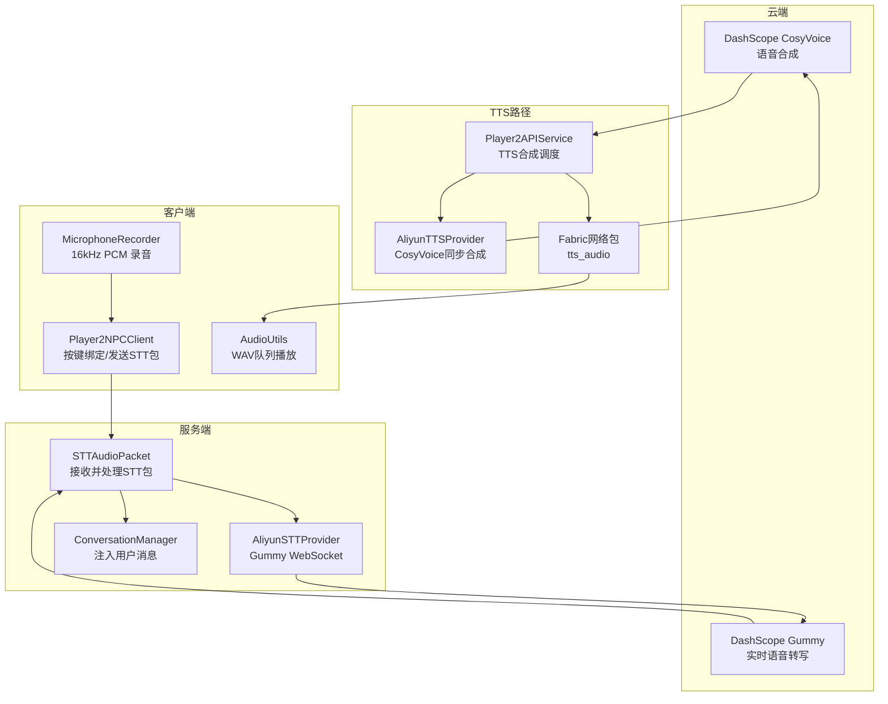
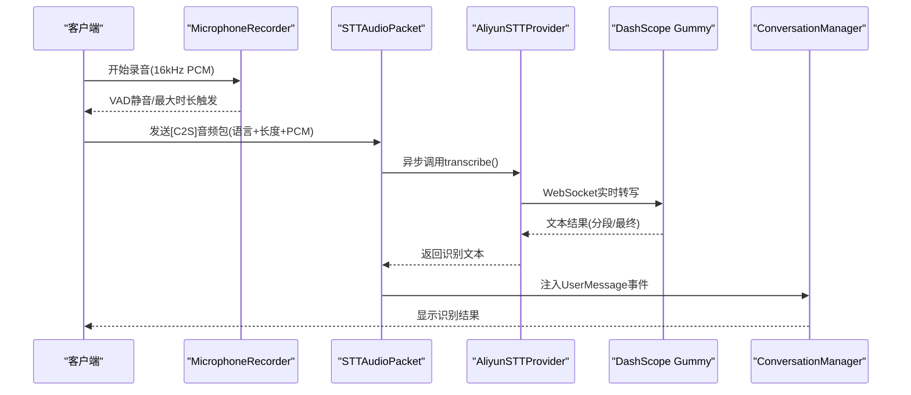
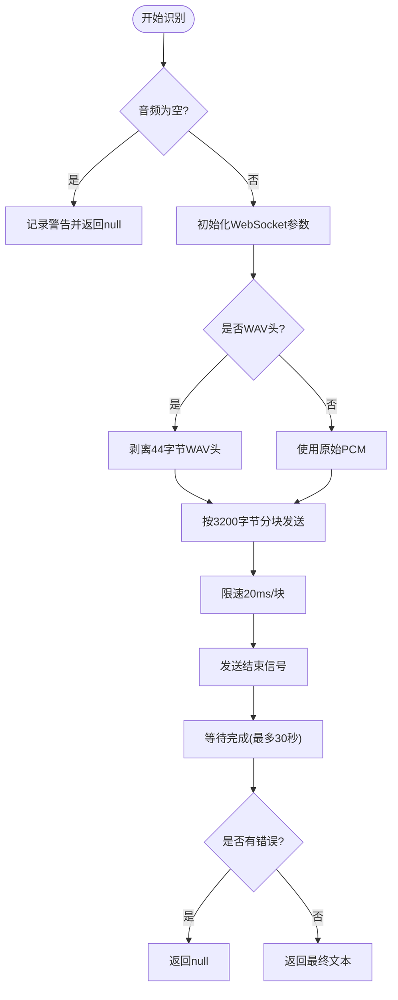
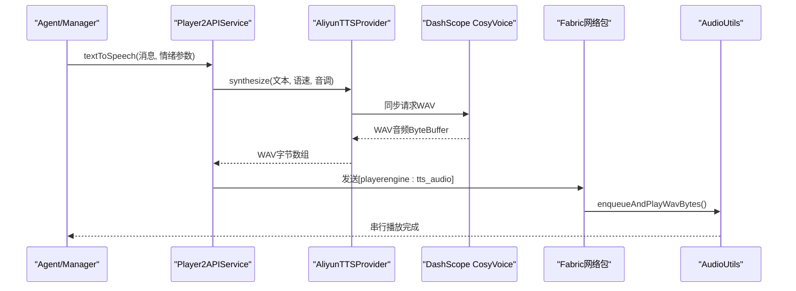
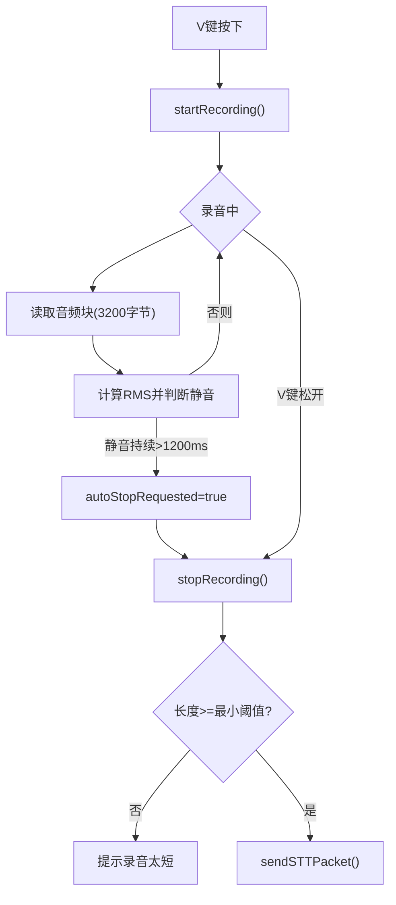
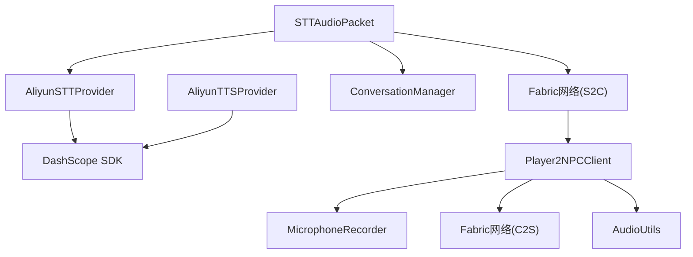

# 语音交互系统

<cite>
**本文档引用的文件**
- [AliyunSTTProvider.java](file://src/main/java/adris/altoclef/player2api/stt/AliyunSTTProvider.java)
- [AliyunTTSProvider.java](file://src/main/java/adris/altoclef/player2api/tts/AliyunTTSProvider.java)
- [STTConfig.java](file://src/main/java/adris/altoclef/player2api/stt/STTConfig.java)
- [TTSConfig.java](file://src/main/java/adris/altoclef/player2api/tts/TTSConfig.java)
- [AudioUtils.java](file://src/main/java/adris/altoclef/player2api/utils/AudioUtils.java)
- [TTSManager.java](file://src/main/java/adris/altoclef/player2api/manager/TTSManager.java)
- [STTAudioPacket.java](file://src/main/java/com/goodbird/player2npc/network/STTAudioPacket.java)
- [MicrophoneRecorder.java](file://src/main/java/com/goodbird/player2npc/client/audio/MicrophoneRecorder.java)
- [Player2NPCClient.java](file://src/main/java/com/goodbird/player2npc/Player2NPCClient.java)
- [Player2APIService.java](file://src/main/java/adris/altoclef/player2api/Player2APIService.java)
- [playerengine-llm-default.json](file://src/main/resources/playerengine-llm-default.json)
- [AI_NPC项目整体架构概览.md](file://docs/AI_NPC项目整体架构概览.md)
</cite>

## 目录
1. [简介](#简介)
2. [项目结构](#项目结构)
3. [核心组件](#核心组件)
4. [架构总览](#架构总览)
5. [详细组件分析](#详细组件分析)
6. [依赖关系分析](#依赖关系分析)
7. [性能考虑](#性能考虑)
8. [故障排除指南](#故障排除指南)
9. [结论](#结论)
10. [附录](#附录)

## 简介
本文件为语音交互系统的全面技术文档，涵盖STT语音识别与TTS语音合成的实现架构、数据流、网络通信协议以及音频处理流程。系统基于阿里云DashScope服务，采用Gummy实时语音转写（STT）与CosyVoice语音合成（TTS），结合客户端麦克风录音、VAD静音检测、Fabric网络包传输与服务端异步处理，形成完整的语音输入输出闭环。

## 项目结构
语音交互系统主要由以下模块组成：
- 客户端：麦克风录音与按键绑定、VAD静音检测、网络包发送
- 服务端：网络包接收、STT识别、结果注入对话系统
- 云端服务：阿里云DashScope Gummy（STT）与CosyVoice（TTS）
- 音频工具：WAV播放队列与串行播放、远程流式TTS支持

**图表来源**
- [MicrophoneRecorder.java:1-199](file://src/main/java/com/goodbird/player2npc/client/audio/MicrophoneRecorder.java#L1-L199)
- [Player2NPCClient.java:80-164](file://src/main/java/com/goodbird/player2npc/Player2NPCClient.java#L80-L164)
- [STTAudioPacket.java:1-134](file://src/main/java/com/goodbird/player2npc/network/STTAudioPacket.java#L1-L134)
- [AliyunSTTProvider.java:1-172](file://src/main/java/adris/altoclef/player2api/stt/AliyunSTTProvider.java#L1-L172)
- [Player2APIService.java:130-200](file://src/main/java/adris/altoclef/player2api/Player2APIService.java#L130-L200)
- [AliyunTTSProvider.java:1-113](file://src/main/java/adris/altoclef/player2api/tts/AliyunTTSProvider.java#L1-L113)
- [AudioUtils.java:1-170](file://src/main/java/adris/altoclef/player2api/utils/AudioUtils.java#L1-L170)

**章节来源**
- [playerengine-llm-default.json:1-89](file://src/main/resources/playerengine-llm-default.json#L1-L89)
- [AI_NPC项目整体架构概览.md:625-692](file://docs/AI_NPC项目整体架构概览.md#L625-L692)

## 核心组件
- STT识别组件：阿里云Gummy（gummy-chat-v1），支持WebSocket实时转写，输入PCM/WAV（16kHz、16bit、Mono），输出中文文本。
- TTS合成组件：阿里云CosyVoice（cosyvoice-v3-flash等），同步返回WAV（22050Hz、Mono、16bit），兼容javax.sound播放。
- 配置管理：STTConfig与TTSConfig从LLM配置文件读取参数，支持回退到qwen提供商的API Key。
- 音频工具：AudioUtils提供WAV队列串行播放与远程流式TTS支持。
- TTS管理：TTSManager负责去重、全局冷却、序列号淘汰与句子级流水线合成。
- 客户端录音：MicrophoneRecorder提供16kHz PCM录音、VAD静音检测与最大时长限制。
- 网络包：STTAudioPacket定义C2S音频包格式，服务端异步处理并注入对话系统。

**章节来源**
- [AliyunSTTProvider.java:17-172](file://src/main/java/adris/altoclef/player2api/stt/AliyunSTTProvider.java#L17-L172)
- [AliyunTTSProvider.java:12-113](file://src/main/java/adris/altoclef/player2api/tts/AliyunTTSProvider.java#L12-L113)
- [STTConfig.java:8-78](file://src/main/java/adris/altoclef/player2api/stt/STTConfig.java#L8-L78)
- [TTSConfig.java:8-102](file://src/main/java/adris/altoclef/player2api/tts/TTSConfig.java#L8-L102)
- [AudioUtils.java:37-170](file://src/main/java/adris/altoclef/player2api/utils/AudioUtils.java#L37-L170)
- [TTSManager.java:35-168](file://src/main/java/adris/altoclef/player2api/manager/TTSManager.java#L35-L168)
- [MicrophoneRecorder.java:12-199](file://src/main/java/com/goodbird/player2npc/client/audio/MicrophoneRecorder.java#L12-L199)
- [STTAudioPacket.java:16-134](file://src/main/java/com/goodbird/player2npc/network/STTAudioPacket.java#L16-L134)

## 架构总览
语音交互系统采用“客户端录音+服务端识别+云端模型+客户端播放”的分层架构。客户端通过按键触发录音，采用VAD静音检测与最大时长限制，将音频以网络包形式发送至服务端。服务端异步调用阿里云STT进行转写，并将结果注入对话系统。服务端侧TTS合成通过CosyVoice完成，将WAV音频通过Fabric网络包发送给客户端，客户端使用AudioUtils进行队列化串行播放。

**图表来源**
- [Player2NPCClient.java:83-122](file://src/main/java/com/goodbird/player2npc/Player2NPCClient.java#L83-L122)
- [STTAudioPacket.java:39-121](file://src/main/java/com/goodbird/player2npc/network/STTAudioPacket.java#L39-L121)
- [AliyunSTTProvider.java:47-154](file://src/main/java/adris/altoclef/player2api/stt/AliyunSTTProvider.java#L47-L154)

**章节来源**
- [AI_NPC项目整体架构概览.md:625-655](file://docs/AI_NPC项目整体架构概览.md#L625-L655)

## 详细组件分析

### STT组件分析（阿里云Gummy）
- 输入格式：PCM或WAV（16kHz、16bit、Mono）。若为WAV则剥离44字节头部后使用PCM数据。
- 分块发送：按约100ms（3200字节）分块发送至WebSocket，避免CPU过载。
- 结果处理：监听分段与最终结果，记录日志并返回文本。
- 可用性校验：API Key非空且不为占位符时视为可用。

**图表来源**
- [AliyunSTTProvider.java:47-154](file://src/main/java/adris/altoclef/player2api/stt/AliyunSTTProvider.java#L47-L154)

**章节来源**
- [AliyunSTTProvider.java:17-172](file://src/main/java/adris/altoclef/player2api/stt/AliyunSTTProvider.java#L17-L172)

### TTS组件分析（阿里云CosyVoice）
- 同步合成：直接返回完整WAV音频（22050Hz、Mono、16bit）。
- 参数控制：支持音量、语速、音调覆盖，文本长度限制（超过10000字符截断）。
- 网络传输：通过Fabric网络包“playerengine:tts_audio”发送至客户端，客户端队列播放。

**图表来源**
- [Player2APIService.java:130-200](file://src/main/java/adris/altoclef/player2api/Player2APIService.java#L130-L200)
- [AliyunTTSProvider.java:50-104](file://src/main/java/adris/altoclef/player2api/tts/AliyunTTSProvider.java#L50-L104)
- [AudioUtils.java:49-104](file://src/main/java/adris/altoclef/player2api/utils/AudioUtils.java#L49-L104)

**章节来源**
- [AliyunTTSProvider.java:12-113](file://src/main/java/adris/altoclef/player2api/tts/AliyunTTSProvider.java#L12-L113)
- [Player2APIService.java:130-200](file://src/main/java/adris/altoclef/player2api/Player2APIService.java#L130-L200)
- [AudioUtils.java:37-170](file://src/main/java/adris/altoclef/player2api/utils/AudioUtils.java#L37-L170)

### 配置与参数
- STT配置：模型（默认gummy-chat-v1）、语言（默认zh）、API Key回退策略。
- TTS配置：模型（默认cosyvoice-v3-flash）、音色（默认longanhuan）、音量（默认50）、语速/音调（默认1.0）。
- 共享API Key：若单独配置缺失，则回退到qwen提供商的API Key。

**章节来源**
- [STTConfig.java:8-78](file://src/main/java/adris/altoclef/player2api/stt/STTConfig.java#L8-L78)
- [TTSConfig.java:8-102](file://src/main/java/adris/altoclef/player2api/tts/TTSConfig.java#L8-L102)
- [playerengine-llm-default.json:52-87](file://src/main/resources/playerengine-llm-default.json#L52-L87)

### 客户端录音与按键处理
- 录音格式：16kHz、16bit、Mono PCM，符合Gummy要求。
- VAD策略：最小录音时间500ms后开始静音检测，连续静默1200ms自动停止；最大录音时长60秒。
- 按键绑定：V键PTT（按住说话），松开或VAD触发即停止录音并发送音频包。
- 最小时长保护：PTT释放时若录音不足0.5秒提示；VAD自动停止时若不足1秒提示。

**图表来源**
- [MicrophoneRecorder.java:62-153](file://src/main/java/com/goodbird/player2npc/client/audio/MicrophoneRecorder.java#L62-L153)
- [Player2NPCClient.java:83-122](file://src/main/java/com/goodbird/player2npc/Player2NPCClient.java#L83-L122)

**章节来源**
- [MicrophoneRecorder.java:12-199](file://src/main/java/com/goodbird/player2npc/client/audio/MicrophoneRecorder.java#L12-L199)
- [Player2NPCClient.java:80-164](file://src/main/java/com/goodbird/player2npc/Player2NPCClient.java#L80-L164)

### 服务端STT处理与对话注入
- 包格式：UTF语言字符串 + VarInt长度 + 字节流音频数据。
- 最小长度校验：小于32000字节（约1秒）直接拒绝并提示。
- 异步处理：在独立线程中加载配置、校验可用性、调用STT并注入UserMessage事件。
- 结果通知：在服务器线程中向玩家显示识别文本。

**章节来源**
- [STTAudioPacket.java:16-134](file://src/main/java/com/goodbird/player2npc/network/STTAudioPacket.java#L16-L134)

### TTS管理与句子级流水线
- 去重与全局冷却：相同消息在5秒内跳过，整体TTS频率限制2秒一次。
- 序列号淘汰：新消息产生时递增序列号，旧队列任务自动跳过。
- 句子分割：按中文句号、感叹号、问号及英文句点、换行符分割，保留标点。
- 串行合成：逐句提交单线程执行，实现句子级流水线与最小延迟。

**章节来源**
- [TTSManager.java:35-168](file://src/main/java/adris/altoclef/player2api/manager/TTSManager.java#L35-L168)

### 音频播放与远程流式TTS
- 本地播放：AudioUtils维护WAV队列，串行播放多段音频，避免重叠。
- 远程流式TTS：player2-remote模式下，通过HTTP接口直接拉取WAV流并播放。
- 客户端接收：注册“playerengine:tts_audio”网络包，收到WAV后入队播放。

**章节来源**
- [AudioUtils.java:37-170](file://src/main/java/adris/altoclef/player2api/utils/AudioUtils.java#L37-L170)
- [Player2NPCClient.java:36-64](file://src/main/java/adris/altoclef/PlayerEngineClient.java#L36-L64)

## 依赖关系分析
- 组件耦合
  - STT：依赖阿里云SDK（DashScope）WebSocket接口，内部封装分块发送与回调处理。
  - TTS：依赖阿里云SDK同步接口，返回WAV ByteBuffer，再经网络包下发。
  - 客户端：依赖Java Sound API进行PCM录音与WAV播放。
  - 服务端：依赖Fabric网络API接收C2S音频包，异步处理后注入对话系统。
- 外部依赖
  - 阿里云DashScope：Gummy（STT）与CosyVoice（TTS）WebSocket/同步接口。
  - Java Sound：javax.sound.sampled用于音频格式转换与播放。
  - Fabric网络：自定义资源定位符“player2npc:stt_audio”、“playerengine:tts_audio”。

**图表来源**
- [AliyunSTTProvider.java:1-172](file://src/main/java/adris/altoclef/player2api/stt/AliyunSTTProvider.java#L1-L172)
- [AliyunTTSProvider.java:1-113](file://src/main/java/adris/altoclef/player2api/tts/AliyunTTSProvider.java#L1-L113)
- [STTAudioPacket.java:1-134](file://src/main/java/com/goodbird/player2npc/network/STTAudioPacket.java#L1-L134)
- [Player2NPCClient.java:146-164](file://src/main/java/com/goodbird/player2npc/Player2NPCClient.java#L146-L164)
- [AudioUtils.java:37-170](file://src/main/java/adris/altoclef/player2api/utils/AudioUtils.java#L37-L170)

**章节来源**
- [AliyunSTTProvider.java:1-172](file://src/main/java/adris/altoclef/player2api/stt/AliyunSTTProvider.java#L1-L172)
- [AliyunTTSProvider.java:1-113](file://src/main/java/adris/altoclef/player2api/tts/AliyunTTSProvider.java#L1-L113)
- [STTAudioPacket.java:1-134](file://src/main/java/com/goodbird/player2npc/network/STTAudioPacket.java#L1-L134)
- [Player2NPCClient.java:146-164](file://src/main/java/com/goodbird/player2npc/Player2NPCClient.java#L146-L164)
- [AudioUtils.java:37-170](file://src/main/java/adris/altoclef/player2api/utils/AudioUtils.java#L37-L170)

## 性能考虑
- STT分块发送与限速：每块约3200字节，发送间隔20ms，平衡实时性与CPU占用。
- 服务端异步处理：避免阻塞网络线程，提升并发能力。
- TTS句子级流水线：逐句合成与播放，减少首包延迟，提高用户体验。
- 队列串行播放：防止音频重叠与撕裂，保证播放稳定性。
- 配置参数优化：根据场景调整语速、音调与音量，兼顾清晰度与自然度。

[本节为通用性能建议，不直接分析具体文件]

## 故障排除指南
- 麦克风权限与可用性
  - 现象：无法录音或报错“麦克风不可用”
  - 排查：确认系统麦克风权限已授予，检查音频格式匹配（16kHz、16bit、Mono）
  - 参考：录音器初始化与异常捕获逻辑
- 网络连接问题
  - 现象：STT识别失败或超时
  - 排查：检查API Key配置、网络连通性、DashScope服务状态
  - 参考：STTProvider可用性校验与超时处理
- 音频播放问题
  - 现象：播放卡顿、破音或无声
  - 排查：确认WAV格式正确（22050Hz、Mono、16bit），检查队列是否被阻塞
  - 参考：AudioUtils播放流程与异常捕获
- 配置参数错误
  - 现象：TTS/STT未生效或报错
  - 排查：核对playerengine-llm-default.json中的enabled、apiKey、model、voice等字段
  - 参考：STTConfig/TTSConfig加载逻辑与回退策略

**章节来源**
- [MicrophoneRecorder.java:117-121](file://src/main/java/com/goodbird/player2npc/client/audio/MicrophoneRecorder.java#L117-L121)
- [STTAudioPacket.java:76-81](file://src/main/java/com/goodbird/player2npc/network/STTAudioPacket.java#L76-L81)
- [AudioUtils.java:100-103](file://src/main/java/adris/altoclef/player2api/utils/AudioUtils.java#L100-L103)
- [STTConfig.java:41-53](file://src/main/java/adris/altoclef/player2api/stt/STTConfig.java#L41-L53)
- [TTSConfig.java:51-66](file://src/main/java/adris/altoclef/player2api/tts/TTSConfig.java#L51-L66)

## 结论
该语音交互系统通过明确的职责划分与稳健的实现，实现了从麦克风录音、网络传输、云端识别与合成到客户端播放的完整链路。STT采用Gummy的WebSocket实时转写，TTS采用CosyVoice同步合成，配合VAD静音检测与句子级流水线，有效降低了延迟并提升了用户体验。配置灵活、可扩展性强，便于后续接入更多模型与功能。

[本节为总结性内容，不直接分析具体文件]

## 附录

### API与配置参考
- STT配置项
  - enabled：是否启用
  - model：模型名称（默认gummy-chat-v1）
  - language：识别语言（默认zh）
  - apiKey：API密钥（可回退到qwen提供商）
- TTS配置项
  - enabled：是否启用
  - model：模型名称（默认cosyvoice-v3-flash）
  - voice：音色ID（默认longanhuan）
  - volume：音量（0-100，默认50）
  - speechRate：语速倍率（默认1.0）
  - pitchRate：音调倍率（默认1.0）
  - apiKey：API密钥（可回退到qwen提供商）

**章节来源**
- [playerengine-llm-default.json:52-87](file://src/main/resources/playerengine-llm-default.json#L52-L87)
- [STTConfig.java:26-59](file://src/main/java/adris/altoclef/player2api/stt/STTConfig.java#L26-L59)
- [TTSConfig.java:33-72](file://src/main/java/adris/altoclef/player2api/tts/TTSConfig.java#L33-L72)