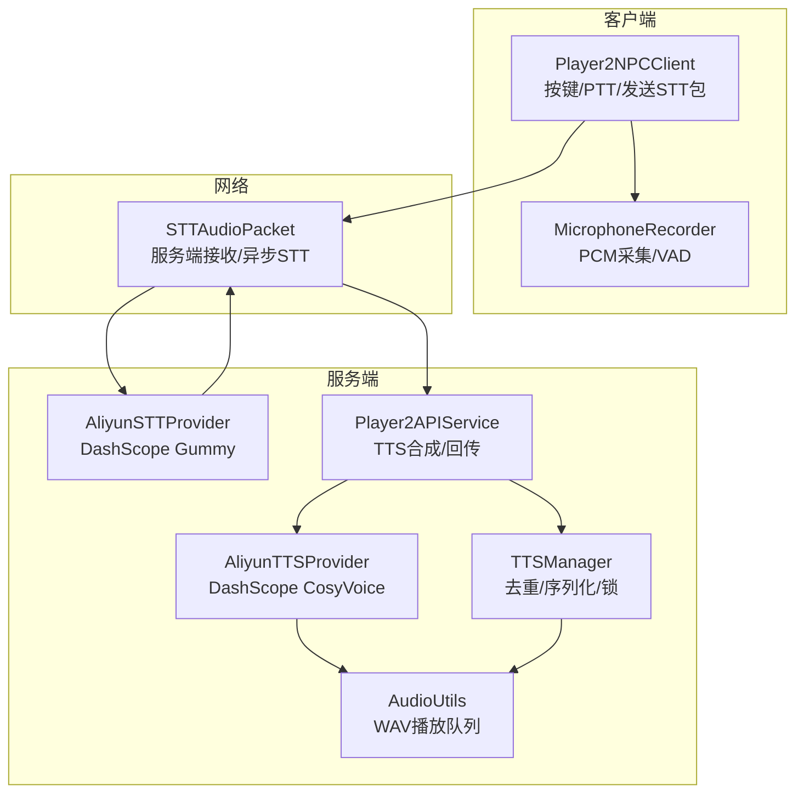
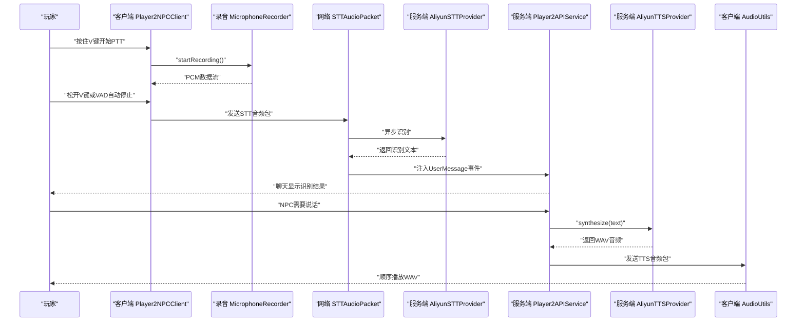
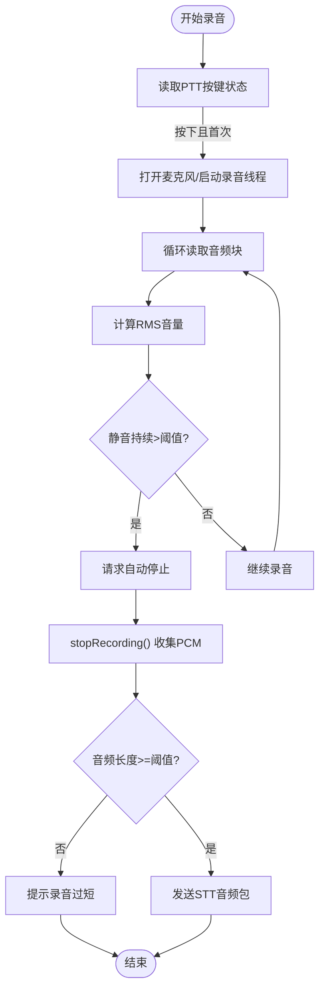
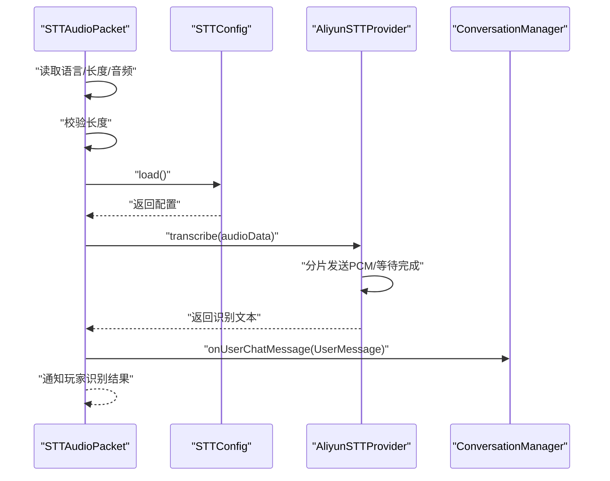
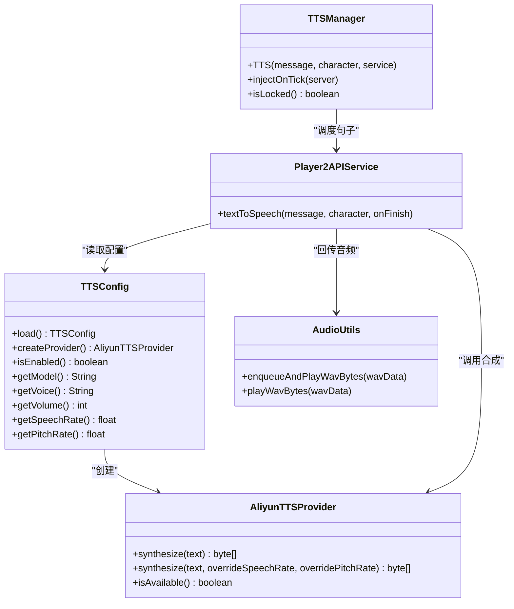
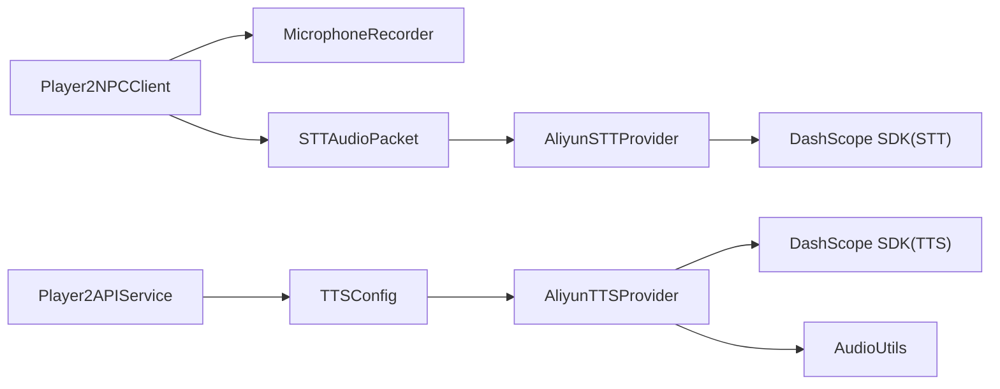

# 语音交互系统

<cite>
**本文引用的文件**
- [Player2NPCClient.java](file://src/main/java/com/goodbird/player2npc/Player2NPCClient.java)
- [MicrophoneRecorder.java](file://src/main/java/com/goodbird/player2npc/client/audio/MicrophoneRecorder.java)
- [STTAudioPacket.java](file://src/main/java/com/goodbird/player2npc/network/STTAudioPacket.java)
- [AliyunSTTProvider.java](file://src/main/java/adris/altoclef/player2api/stt/AliyunSTTProvider.java)
- [STTConfig.java](file://src/main/java/adris/altoclef/player2api/stt/STTConfig.java)
- [AliyunTTSProvider.java](file://src/main/java/adris/altoclef/player2api/tts/AliyunTTSProvider.java)
- [TTSConfig.java](file://src/main/java/adris/altoclef/player2api/tts/TTSConfig.java)
- [AudioUtils.java](file://src/main/java/adris/altoclef/player2api/utils/AudioUtils.java)
- [TTSManager.java](file://src/main/java/adris/altoclef/player2api/manager/TTSManager.java)
- [Player2APIService.java](file://src/main/java/adris/altoclef/player2api/Player2APIService.java)
- [playerengine-llm-default.json](file://src/main/resources/playerengine-llm-default.json)
</cite>

## 目录
1. [简介](#简介)
2. [项目结构](#项目结构)
3. [核心组件](#核心组件)
4. [架构总览](#架构总览)
5. [详细组件分析](#详细组件分析)
6. [依赖关系分析](#依赖关系分析)
7. [性能考量](#性能考量)
8. [故障排查指南](#故障排查指南)
9. [结论](#结论)
10. [附录](#附录)

## 简介
本文件面向“语音交互系统”的全面技术文档，围绕双向语音交互（STT 语音识别 + TTS 语音合成）进行深入解析。系统采用客户端录音与服务端识别/合成的分层设计：客户端负责麦克风采集、推拉式通话（PTT）与网络传输；服务端负责 STT 识别、消息注入与 TTS 合成，并通过 Fabric 网络协议回传音频或文本。文档涵盖架构、数据流、处理逻辑、实时性与质量控制、配置示例、性能优化与故障排查等内容。

## 项目结构
语音相关模块主要分布在以下位置：
- 客户端录音与按键绑定：com.goodbird.player2npc.client.audio 与 com.goodbird.player2npc
- 网络包与服务端处理：com.goodbird.player2npc.network
- STT/TTS 提供商与配置：adris.altoclef.player2api.stt、adris.altoclef.player2api.tts
- 音频播放与队列：adris.altoclef.player2api.utils
- TTS 管理与情绪参数：adris.altoclef.player2api.manager、adris.altoclef.player2api

图表来源
- [Player2NPCClient.java:36-124](file://src/main/java/com/goodbird/player2npc/Player2NPCClient.java#L36-L124)
- [MicrophoneRecorder.java:62-121](file://src/main/java/com/goodbird/player2npc/client/audio/MicrophoneRecorder.java#L62-L121)
- [STTAudioPacket.java:39-121](file://src/main/java/com/goodbird/player2npc/network/STTAudioPacket.java#L39-L121)
- [AliyunSTTProvider.java:47-154](file://src/main/java/adris/altoclef/player2api/stt/AliyunSTTProvider.java#L47-L154)
- [Player2APIService.java:120-200](file://src/main/java/adris/altoclef/player2api/Player2APIService.java#L120-L200)
- [AliyunTTSProvider.java:50-104](file://src/main/java/adris/altoclef/player2api/tts/AliyunTTSProvider.java#L50-L104)
- [TTSManager.java:94-153](file://src/main/java/adris/altoclef/player2api/manager/TTSManager.java#L94-L153)
- [AudioUtils.java:49-104](file://src/main/java/adris/altoclef/player2api/utils/AudioUtils.java#L49-L104)

章节来源
- [Player2NPCClient.java:36-124](file://src/main/java/com/goodbird/player2npc/Player2NPCClient.java#L36-L124)
- [STTAudioPacket.java:39-121](file://src/main/java/com/goodbird/player2npc/network/STTAudioPacket.java#L39-L121)

## 核心组件
- 客户端录音与按键
  - MicrophoneRecorder：以 16kHz、16bit、Mono PCM 录制音频，支持 VAD 自动停止与最大时长保护。
  - Player2NPCClient：注册 PTT 键位，处理按下/松开与 VAD 自动停止，封装并发送 STT 音频包。
- 网络与服务端处理
  - STTAudioPacket：服务端接收客户端 STT 音频包，异步执行 STT 并将结果注入对话系统。
- STT 与 TTS 提供商
  - AliyunSTTProvider：DashScope Gummy 实时语音转写，支持分片发送与 WebSocket。
  - AliyunTTSProvider：DashScope CosyVoice 同步合成，返回 WAV（22050Hz、Mono、16bit）。
- 配置与管理
  - STTConfig/TTSConfig：从统一配置文件读取 STT/TTS 参数，支持回退到 LLM 提供商的 API Key。
  - TTSManager：句子级流水线、全局冷却、重复抑制、序列号去旧。
  - AudioUtils：WAV 队列顺序播放。
- 入口与集成
  - Player2APIService：根据是否本地模式选择 TTS 合成路径，回传音频包给客户端。

章节来源
- [MicrophoneRecorder.java:24-56](file://src/main/java/com/goodbird/player2npc/client/audio/MicrophoneRecorder.java#L24-L56)
- [Player2NPCClient.java:68-122](file://src/main/java/com/goodbird/player2npc/Player2NPCClient.java#L68-L122)
- [STTAudioPacket.java:39-121](file://src/main/java/com/goodbird/player2npc/network/STTAudioPacket.java#L39-L121)
- [AliyunSTTProvider.java:47-154](file://src/main/java/adris/altoclef/player2api/stt/AliyunSTTProvider.java#L47-L154)
- [AliyunTTSProvider.java:50-104](file://src/main/java/adris/altoclef/player2api/tts/AliyunTTSProvider.java#L50-L104)
- [STTConfig.java:31-71](file://src/main/java/adris/altoclef/player2api/stt/STTConfig.java#L31-L71)
- [TTSConfig.java:38-92](file://src/main/java/adris/altoclef/player2api/tts/TTSConfig.java#L38-L92)
- [TTSManager.java:94-153](file://src/main/java/adris/altoclef/player2api/manager/TTSManager.java#L94-L153)
- [AudioUtils.java:49-104](file://src/main/java/adris/altoclef/player2api/utils/AudioUtils.java#L49-L104)
- [Player2APIService.java:120-200](file://src/main/java/adris/altoclef/player2api/Player2APIService.java#L120-L200)

## 架构总览
双向语音交互的关键流程：
- 客户端：PTT/VAD 触发录音，达到阈值后发送 STT 音频包至服务端。
- 服务端：异步执行 STT，将识别结果作为用户消息注入对话系统。
- 服务端：当 NPC 需要说话时，触发 TTS 合成，将 WAV 音频回传客户端。
- 客户端：顺序播放队列中的音频，保证句子不重叠。

图表来源
- [Player2NPCClient.java:68-122](file://src/main/java/com/goodbird/player2npc/Player2NPCClient.java#L68-L122)
- [MicrophoneRecorder.java:79-121](file://src/main/java/com/goodbird/player2npc/client/audio/MicrophoneRecorder.java#L79-L121)
- [STTAudioPacket.java:66-121](file://src/main/java/com/goodbird/player2npc/network/STTAudioPacket.java#L66-L121)
- [AliyunSTTProvider.java:47-154](file://src/main/java/adris/altoclef/player2api/stt/AliyunSTTProvider.java#L47-L154)
- [Player2APIService.java:120-200](file://src/main/java/adris/altoclef/player2api/Player2APIService.java#L120-L200)
- [AliyunTTSProvider.java:50-104](file://src/main/java/adris/altoclef/player2api/tts/AliyunTTSProvider.java#L50-L104)
- [AudioUtils.java:49-104](file://src/main/java/adris/altoclef/player2api/utils/AudioUtils.java#L49-L104)

## 详细组件分析

### 客户端：Push-to-Talk 与录音
- PTT 检测：使用 GLFW 直接查询按键状态，避免 Minecraft KeyMapping 在界面切换/焦点丢失时的状态重置问题。
- 录音格式：16kHz、16bit、Mono PCM，满足 Gummy STT 要求。
- VAD 自动停止：基于 RMS 峰均值与静音窗口阈值，超过静音时间自动停止录音。
- 最大时长：限制最长录音时长，防止超时。
- 发送策略：PTT 松开或 VAD 自动停止时，若音频长度足够则发送 STT 音频包。

图表来源
- [Player2NPCClient.java:68-122](file://src/main/java/com/goodbird/player2npc/Player2NPCClient.java#L68-L122)
- [MicrophoneRecorder.java:79-121](file://src/main/java/com/goodbird/player2npc/client/audio/MicrophoneRecorder.java#L79-L121)

章节来源
- [Player2NPCClient.java:68-122](file://src/main/java/com/goodbird/player2npc/Player2NPCClient.java#L68-L122)
- [MicrophoneRecorder.java:24-56](file://src/main/java/com/goodbird/player2npc/client/audio/MicrophoneRecorder.java#L24-L56)
- [MicrophoneRecorder.java:79-121](file://src/main/java/com/goodbird/player2npc/client/audio/MicrophoneRecorder.java#L79-L121)

### 服务端：STT 识别流程
- 网络包接收：服务端在独立线程中读取语言、长度与音频字节。
- 长度校验：小于最小阈值（约 1 秒）直接拒绝并提示。
- 异步识别：加载 STT 配置，实例化 AliyunSTTProvider，分片发送 PCM 数据，等待回调返回最终文本。
- 结果注入：在服务器主线程中注入 UserMessage 事件，并向玩家回显识别文本。

图表来源
- [STTAudioPacket.java:39-121](file://src/main/java/com/goodbird/player2npc/network/STTAudioPacket.java#L39-L121)
- [STTConfig.java:31-71](file://src/main/java/adris/altoclef/player2api/stt/STTConfig.java#L31-L71)
- [AliyunSTTProvider.java:47-154](file://src/main/java/adris/altoclef/player2api/stt/AliyunSTTProvider.java#L47-L154)

章节来源
- [STTAudioPacket.java:39-121](file://src/main/java/com/goodbird/player2npc/network/STTAudioPacket.java#L39-L121)
- [AliyunSTTProvider.java:47-154](file://src/main/java/adris/altoclef/player2api/stt/AliyunSTTProvider.java#L47-L154)

### STT 提供商：AliyunSTTProvider
- 模型与格式：使用 DashScope Gummy（gummy-chat-v1），输入 PCM（16kHz、16bit、Mono）。
- 分片发送：每约 100ms 一块（3200 字节），避免一次性发送导致的阻塞。
- WebSocket：设置基础 WebSocket 地址为 DashScope 中国区地址。
- WAV 自动剥离：若输入为 WAV（含 44 字节头），自动去除头部仅保留 PCM。
- 超时与错误：等待最多 30 秒，捕获异常并关闭连接。

章节来源
- [AliyunSTTProvider.java:23-172](file://src/main/java/adris/altoclef/player2api/stt/AliyunSTTProvider.java#L23-L172)

### TTS 管理与合成
- 配置加载：TTSConfig 从统一配置文件读取模型、音色、音量、语速、音高等参数，支持回退到 LLM 提供商 API Key。
- Provider 创建：TTSConfig.createProvider() 返回 AliyunTTSProvider 实例。
- 合成流程：Player2APIService 根据是否本地模式选择 DashScope CosyVoice 合成，返回 WAV（22050Hz、Mono、16bit）。
- 回传与播放：服务端将 WAV 通过网络包发送至客户端，AudioUtils 以队列方式顺序播放，避免重叠。
- TTSManager：句子级拆分、全局冷却、重复抑制、序列号去旧，确保新回复打断旧队列。

图表来源
- [TTSConfig.java:38-92](file://src/main/java/adris/altoclef/player2api/tts/TTSConfig.java#L38-L92)
- [AliyunTTSProvider.java:50-104](file://src/main/java/adris/altoclef/player2api/tts/AliyunTTSProvider.java#L50-L104)
- [Player2APIService.java:120-200](file://src/main/java/adris/altoclef/player2api/Player2APIService.java#L120-L200)
- [TTSManager.java:94-153](file://src/main/java/adris/altoclef/player2api/manager/TTSManager.java#L94-L153)
- [AudioUtils.java:49-104](file://src/main/java/adris/altoclef/player2api/utils/AudioUtils.java#L49-L104)

章节来源
- [TTSConfig.java:38-92](file://src/main/java/adris/altoclef/player2api/tts/TTSConfig.java#L38-L92)
- [AliyunTTSProvider.java:50-104](file://src/main/java/adris/altoclef/player2api/tts/AliyunTTSProvider.java#L50-L104)
- [Player2APIService.java:120-200](file://src/main/java/adris/altoclef/player2api/Player2APIService.java#L120-L200)
- [TTSManager.java:94-153](file://src/main/java/adris/altoclef/player2api/manager/TTSManager.java#L94-L153)
- [AudioUtils.java:49-104](file://src/main/java/adris/altoclef/player2api/utils/AudioUtils.java#L49-L104)

## 依赖关系分析
- 客户端依赖
  - MicrophoneRecorder 依赖 Java Sound API 进行 PCM 录制。
  - Player2NPCClient 依赖 Fabric 网络 API 发送 STT 音频包。
- 服务端依赖
  - STTAudioPacket 依赖 Fabric 网络 API 接收 STT 音频包。
  - AliyunSTTProvider 依赖 DashScope SDK（TranslationRecognizerChat）。
  - Player2APIService 依赖 LLMConfig 与 TTSConfig。
  - AliyunTTSProvider 依赖 DashScope SDK（SpeechSynthesizer）。
  - AudioUtils 依赖 Java Sound API 播放 WAV。
- 配置依赖
  - STTConfig/TTSConfig 从统一 JSON 配置文件读取参数，支持回退到 LLM 提供商的 API Key。

图表来源
- [Player2NPCClient.java:36-124](file://src/main/java/com/goodbird/player2npc/Player2NPCClient.java#L36-L124)
- [MicrophoneRecorder.java:62-121](file://src/main/java/com/goodbird/player2npc/client/audio/MicrophoneRecorder.java#L62-L121)
- [STTAudioPacket.java:39-121](file://src/main/java/com/goodbird/player2npc/network/STTAudioPacket.java#L39-L121)
- [AliyunSTTProvider.java:23-172](file://src/main/java/adris/altoclef/player2api/stt/AliyunSTTProvider.java#L23-L172)
- [Player2APIService.java:120-200](file://src/main/java/adris/altoclef/player2api/Player2APIService.java#L120-L200)
- [AliyunTTSProvider.java:19-113](file://src/main/java/adris/altoclef/player2api/tts/AliyunTTSProvider.java#L19-L113)
- [AudioUtils.java:49-104](file://src/main/java/adris/altoclef/player2api/utils/AudioUtils.java#L49-L104)

章节来源
- [playerengine-llm-default.json:1-89](file://src/main/resources/playerengine-llm-default.json#L1-L89)

## 性能考量
- 实时性与延迟
  - 客户端分片发送（约 100ms/片）与服务端异步识别，减少阻塞。
  - TTSManager 使用单线程队列与序列号去旧，避免旧消息堆积。
  - AudioUtils 队列顺序播放，避免重叠与卡顿。
- 音频质量与格式
  - STT 输入：16kHz、16bit、Mono PCM，满足 Gummy 要求。
  - TTS 输出：WAV（22050Hz、Mono、16bit），兼容 javax.sound.sampled。
- 网络与并发
  - 服务端 STT 在独立线程执行，避免阻塞主服务器线程。
  - 配置加载与可用性检查前置，减少无效调用。
- 资源控制
  - VAD 静音阈值与最大录音时长，防止无效音频与资源浪费。
  - 全局冷却与重复抑制，避免语音风暴。

[本节为通用性能讨论，不直接分析具体文件]

## 故障排查指南
- STT 无法识别
  - 检查客户端录音时长是否低于最小阈值（约 1 秒）。
  - 确认服务端 STT 配置已启用且 API Key 正确。
  - 查看服务端日志中识别完成/错误回调与超时信息。
- TTS 无法播放
  - 确认服务端 TTS 已启用且 API Key 正确。
  - 检查客户端是否收到音频包并进入播放队列。
  - 若出现空音频，确认文本长度未超过上限并检查异常日志。
- 麦克风不可用
  - 系统提示麦克风不可用时，检查设备权限与驱动。
  - 确认录音格式匹配（16kHz、16bit、Mono）。
- 网络异常
  - 检查 DashScope WebSocket 地址与网络连通性。
  - 关注分片发送与连接关闭逻辑，避免资源泄漏。

章节来源
- [STTAudioPacket.java:56-121](file://src/main/java/com/goodbird/player2npc/network/STTAudioPacket.java#L56-L121)
- [AliyunSTTProvider.java:47-154](file://src/main/java/adris/altoclef/player2api/stt/AliyunSTTProvider.java#L47-L154)
- [AliyunTTSProvider.java:50-104](file://src/main/java/adris/altoclef/player2api/tts/AliyunTTSProvider.java#L50-L104)
- [MicrophoneRecorder.java:49-56](file://src/main/java/com/goodbird/player2npc/client/audio/MicrophoneRecorder.java#L49-L56)

## 结论
该语音交互系统通过清晰的客户端-服务端分工与 Fabric 网络协议，实现了稳定的双向语音能力。客户端负责高质量、低延迟的音频采集与传输，服务端负责异步识别与合成，并通过队列与去重策略保障用户体验。配置文件集中管理 API Key 与参数，便于扩展与维护。后续可在网络优化、模型选择与情绪参数自适应方面进一步提升稳定性与自然度。

[本节为总结性内容，不直接分析具体文件]

## 附录

### 配置示例与说明
- 统一配置文件位置与结构
  - 文件路径：resources/playerengine-llm-default.json
  - 关键段落：
    - providers.activeProvider：当前 LLM 提供商（可选 qwen_local/qwen/openai/player2-remote）
    - tts：TTS 配置段，包含 enabled、apiKey、model、voice、volume、speechRate、pitchRate
    - stt：STT 配置段，包含 enabled、model、language
    - progressVoice：NPC 任务进度语音播报间隔
- STT 配置要点
  - enabled：是否启用玩家语音输入
  - model：推荐 gummy-chat-v1（中文对话优化）
  - language：可选 zh/en/ja/ko/auto
  - apiKey：可单独配置，否则回退到 qwen 提供商的 apiKey
- TTS 配置要点
  - enabled：是否启用 NPC 语音说话
  - model：可选 cosyvoice-v3-flash（默认）、cosyvoice-v3、cosyvoice-v2
  - voice：可选 longanhuan（默认中文女声）、longdanv2、longshu、longyue、longjingwen
  - volume：0~100
  - speechRate/pitchRate：语速/音调倍率，NPC 情绪系统会自动覆盖
- 配置加载与回退
  - STTConfig/TTSConfig 会在未设置专用 apiKey 时回退到 activeProvider 或 qwen 的 apiKey

章节来源
- [playerengine-llm-default.json:1-89](file://src/main/resources/playerengine-llm-default.json#L1-L89)
- [STTConfig.java:31-71](file://src/main/java/adris/altoclef/player2api/stt/STTConfig.java#L31-L71)
- [TTSConfig.java:38-92](file://src/main/java/adris/altoclef/player2api/tts/TTSConfig.java#L38-L92)