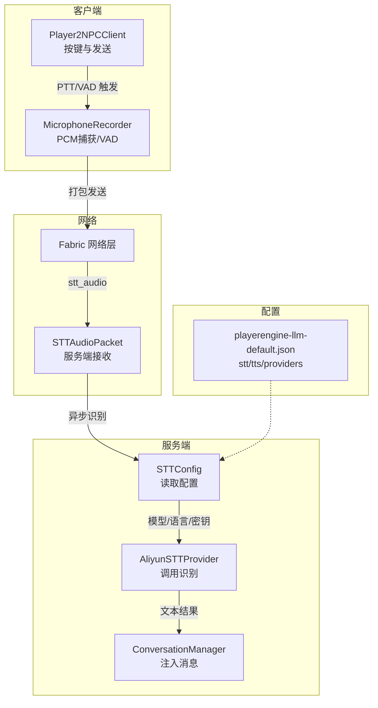
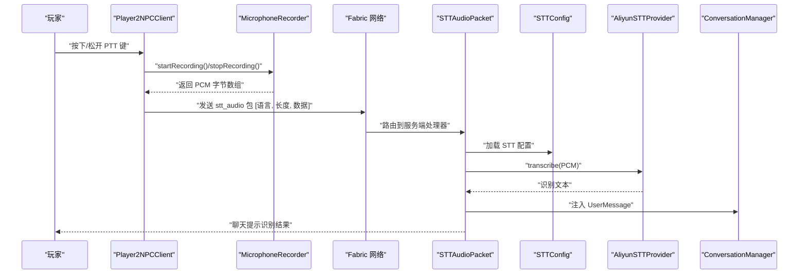
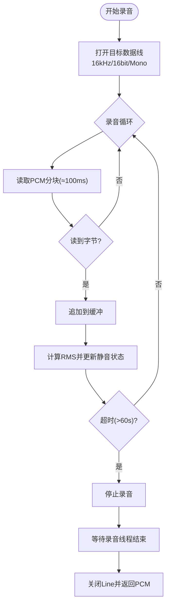
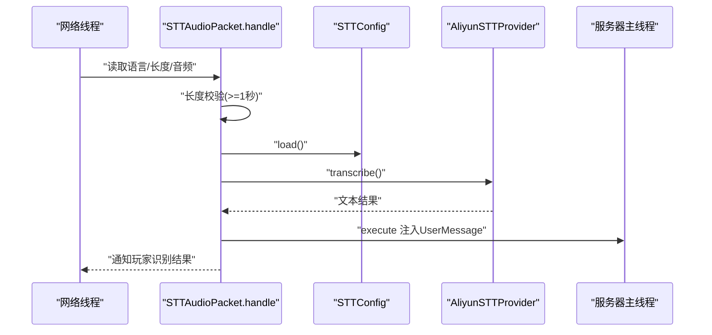
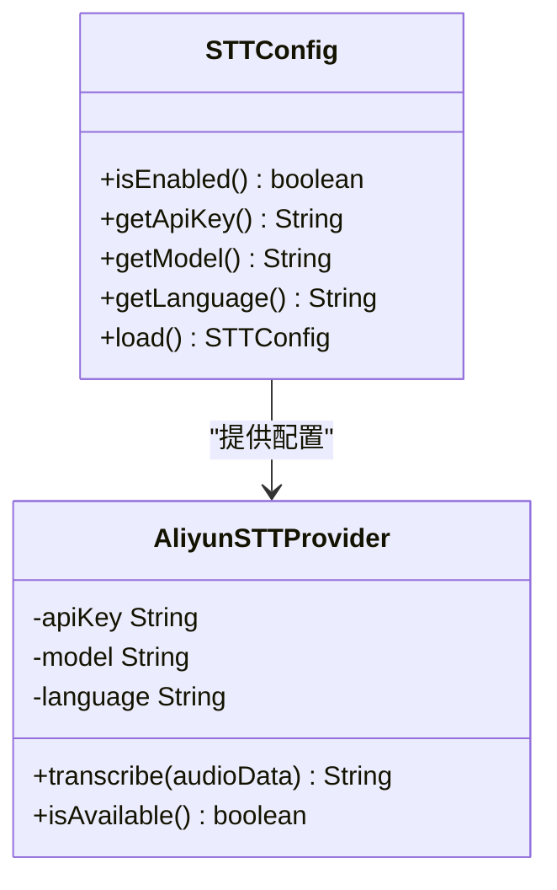
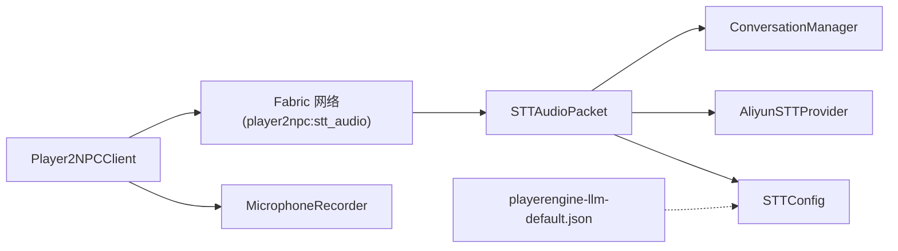

# 语音处理管道

<cite>
**本文引用的文件**
- [MicrophoneRecorder.java](file://src/main/java/com/goodbird/player2npc/client/audio/MicrophoneRecorder.java)
- [AudioUtils.java](file://src/main/java/adris/altoclef/player2api/utils/AudioUtils.java)
- [STTAudioPacket.java](file://src/main/java/com/goodbird/player2npc/network/STTAudioPacket.java)
- [AliyunSTTProvider.java](file://src/main/java/adris/altoclef/player2api/stt/AliyunSTTProvider.java)
- [STTConfig.java](file://src/main/java/adris/altoclef/player2api/stt/STTConfig.java)
- [Player2NPCClient.java](file://src/main/java/com/goodbird/player2npc/Player2NPCClient.java)
- [Player2NPC.java](file://src/main/java/com/goodbird/player2npc/Player2NPC.java)
- [playerengine-llm-default.json](file://src/main/resources/playerengine-llm-default.json)
</cite>

## 目录
1. [简介](#简介)
2. [项目结构](#项目结构)
3. [核心组件](#核心组件)
4. [架构总览](#架构总览)
5. [详细组件分析](#详细组件分析)
6. [依赖关系分析](#依赖关系分析)
7. [性能考虑](#性能考虑)
8. [故障排查指南](#故障排查指南)
9. [结论](#结论)
10. [附录：配置参考](#附录配置参考)

## 简介
本文件面向“语音处理管道”的技术文档，覆盖从音频录制、实时处理、网络传输到语音识别的完整链路。重点解析以下模块的协作机制与实现细节：
- MicrophoneRecorder：实时麦克风 PCM 捕获、VAD 自动停止、缓冲区管理与线程安全
- AudioUtils：TTS 音频播放队列与回放（用于对比理解音频管线）
- STTAudioPacket：服务端接收与处理 STT 音频包、异步识别与消息注入
- AliyunSTTProvider：STT 识别调用、参数校验与可用性检查
- STTConfig：从配置文件加载 STT 参数（模型、语言、密钥）
- 客户端与服务端网络协议：PTT 触发、VAD 自动停止、音频打包发送
- 配置文件：playerengine-llm-default.json 中的 STT/TTS/LLM 参数

## 项目结构
围绕语音处理的关键文件组织如下：
- 客户端录音与按键逻辑：Player2NPCClient、MicrophoneRecorder
- 服务端接收与识别：STTAudioPacket、AliyunSTTProvider、STTConfig
- 配置来源：playerengine-llm-default.json
- 网络注册与常量：Player2NPC

图表来源
- [Player2NPCClient.java:56-124](file://src/main/java/com/goodbird/player2npc/Player2NPCClient.java#L56-L124)
- [MicrophoneRecorder.java:62-121](file://src/main/java/com/goodbird/player2npc/client/audio/MicrophoneRecorder.java#L62-L121)
- [STTAudioPacket.java:39-121](file://src/main/java/com/goodbird/player2npc/network/STTAudioPacket.java#L39-L121)
- [STTConfig.java:31-59](file://src/main/java/adris/altoclef/player2api/stt/STTConfig.java#L31-L59)
- [AliyunSTTProvider.java:47-90](file://src/main/java/adris/altoclef/player2api/stt/AliyunSTTProvider.java#L47-L90)
- [playerengine-llm-default.json:69-77](file://src/main/resources/playerengine-llm-default.json#L69-L77)

章节来源
- [Player2NPCClient.java:1-164](file://src/main/java/com/goodbird/player2npc/Player2NPCClient.java#L1-L164)
- [Player2NPC.java:25-67](file://src/main/java/com/goodbird/player2npc/Player2NPC.java#L25-L67)

## 核心组件
- MicrophoneRecorder：负责以 16kHz、16bit、Mono 的 PCM 格式从系统麦克风采集音频，采用分块读取与缓冲拼接，支持 VAD（静音检测）自动停止与最大时长保护。
- STTAudioPacket：服务端网络处理器，读取客户端发送的音频字节流，进行长度校验、异步识别、结果注入聊天事件并通知玩家。
- AliyunSTTProvider：封装 STT 识别调用，支持模型、采样率、格式等参数配置，并对空数据与可用性进行检查。
- STTConfig：从配置文件读取 STT 开关、模型、语言与 API Key，必要时回退到 LLM Provider 的密钥。
- Player2NPCClient：负责按键监听（GLFW 直读状态）、触发录音、VAD 自动停止、发送音频包。
- Player2NPC：注册网络通道与全局接收器，暴露 stt_audio 的资源路径。

章节来源
- [MicrophoneRecorder.java:21-199](file://src/main/java/com/goodbird/player2npc/client/audio/MicrophoneRecorder.java#L21-L199)
- [STTAudioPacket.java:28-134](file://src/main/java/com/goodbird/player2npc/network/STTAudioPacket.java#L28-L134)
- [AliyunSTTProvider.java:35-171](file://src/main/java/adris/altoclef/player2api/stt/AliyunSTTProvider.java#L35-L171)
- [STTConfig.java:13-78](file://src/main/java/adris/altoclef/player2api/stt/STTConfig.java#L13-L78)
- [Player2NPCClient.java:23-164](file://src/main/java/com/goodbird/player2npc/Player2NPCClient.java#L23-L164)
- [Player2NPC.java:25-67](file://src/main/java/com/goodbird/player2npc/Player2NPC.java#L25-L67)

## 架构总览
下图展示了从按键触发到识别完成的消息流：

图表来源
- [Player2NPCClient.java:68-123](file://src/main/java/com/goodbird/player2npc/Player2NPCClient.java#L68-L123)
- [MicrophoneRecorder.java:62-153](file://src/main/java/com/goodbird/player2npc/client/audio/MicrophoneRecorder.java#L62-L153)
- [STTAudioPacket.java:39-121](file://src/main/java/com/goodbird/player2npc/network/STTAudioPacket.java#L39-L121)
- [STTConfig.java:31-59](file://src/main/java/adris/altoclef/player2api/stt/STTConfig.java#L31-L59)
- [AliyunSTTProvider.java:47-93](file://src/main/java/adris/altoclef/player2api/stt/AliyunSTTProvider.java#L47-L93)

## 详细组件分析

### MicrophoneRecorder 组件分析
- 录音格式与约束
  - 使用 16kHz、16bit、Mono、有符号、小端序的 AudioFormat
  - 最大录音时长限制为 60 秒（符合 Gummy STT 的上限）
- 分块读取与缓冲
  - 每次读取约 100ms 的 PCM 数据（3200 字节），写入 ByteArrayOutputStream
  - 通过同步方法 startRecording/stopRecording 保证线程安全
- VAD 自动停止
  - 计算最近音频块的 RMS 声压级，低于阈值则开始计时静音窗口
  - 连续静音超过阈值后请求自动停止，避免无效音频上行
- 安全保护
  - 超过最大时长强制停止
  - 录音线程设为守护线程，主线程结束时自动回收

图表来源
- [MicrophoneRecorder.java:62-153](file://src/main/java/com/goodbird/player2npc/client/audio/MicrophoneRecorder.java#L62-L153)

章节来源
- [MicrophoneRecorder.java:21-199](file://src/main/java/com/goodbird/player2npc/client/audio/MicrophoneRecorder.java#L21-L199)

### STTAudioPacket 组件分析
- 接收与解包
  - 读取 UTF 语言字符串、VarInt 长度、随后的音频字节数组
- 长度校验与短音频提示
  - 小于最小字节数（约 1 秒）直接拒绝并提示
- 异步识别
  - 在独立线程中加载 STTConfig、校验可用性、调用 AliyunSTTProvider
  - 识别成功后在服务器主线程注入 UserMessage 并通知玩家
- 错误处理
  - 空数据、禁用、密钥未配置、识别失败均记录日志并反馈

图表来源
- [STTAudioPacket.java:39-121](file://src/main/java/com/goodbird/player2npc/network/STTAudioPacket.java#L39-L121)
- [STTConfig.java:31-59](file://src/main/java/adris/altoclef/player2api/stt/STTConfig.java#L31-L59)
- [AliyunSTTProvider.java:47-93](file://src/main/java/adris/altoclef/player2api/stt/AliyunSTTProvider.java#L47-L93)

章节来源
- [STTAudioPacket.java:28-134](file://src/main/java/com/goodbird/player2npc/network/STTAudioPacket.java#L28-L134)

### AliyunSTTProvider 组件分析
- 输入要求
  - 支持 PCM 或 WAV 音频（内部对 WAV 头进行判断）
  - 固定采样率 16kHz，格式 pcm
- 可用性检查
  - API Key 非空且不为占位符时才认为可用
- 识别流程
  - 构造识别参数（模型、语言、采样率等）
  - 发起识别并返回文本；空或异常时返回 null

图表来源
- [STTConfig.java:13-78](file://src/main/java/adris/altoclef/player2api/stt/STTConfig.java#L13-L78)
- [AliyunSTTProvider.java:35-171](file://src/main/java/adris/altoclef/player2api/stt/AliyunSTTProvider.java#L35-L171)

章节来源
- [AliyunSTTProvider.java:35-171](file://src/main/java/adris/altoclef/player2api/stt/AliyunSTTProvider.java#L35-L171)

### STTConfig 组件分析
- 配置来源
  - 从 LLMConfig 的 “stt” 段落读取
  - 若未单独配置 API Key，则回退到 qwen Provider 的密钥
- 默认值
  - 模型：gummy-chat-v1
  - 语言：zh
  - 启用：true

章节来源
- [STTConfig.java:13-78](file://src/main/java/adris/altoclef/player2api/stt/STTConfig.java#L13-L78)

### 客户端按键与发送逻辑
- 按键检测
  - 使用 GLFW 直读键状态，绕过 Minecraft KeyMapping 的不稳定行为
- 录音控制
  - 按下 PTT：启动录音
  - VAD 自动停止：录音过程中检测到长时间静音自动结束
  - 松开 PTT：结束录音并发送
- 发送协议
  - 包格式：UTF 语言 + VarInt 长度 + 字节流
  - 通道名：player2npc:stt_audio

章节来源
- [Player2NPCClient.java:56-124](file://src/main/java/com/goodbird/player2npc/Player2NPCClient.java#L56-L124)
- [Player2NPCClient.java:131-162](file://src/main/java/com/goodbird/player2npc/Player2NPCClient.java#L131-L162)
- [Player2NPC.java:29-36](file://src/main/java/com/goodbird/player2npc/Player2NPC.java#L29-L36)

## 依赖关系分析
- 客户端依赖
  - Player2NPCClient 依赖 MicrophoneRecorder 进行录音
  - 通过 Fabric 网络向服务端发送 STTAudioPacket
- 服务端依赖
  - STTAudioPacket 依赖 STTConfig 与 AliyunSTTProvider
  - 识别完成后通过 ConversationManager 注入消息
- 配置依赖
  - STTConfig 依赖 LLMConfig（来自外部模块）读取 stt 段

图表来源
- [Player2NPCClient.java:33-34](file://src/main/java/com/goodbird/player2npc/Player2NPCClient.java#L33-L34)
- [STTAudioPacket.java:39-121](file://src/main/java/com/goodbird/player2npc/network/STTAudioPacket.java#L39-L121)
- [STTConfig.java:31-59](file://src/main/java/adris/altoclef/player2api/stt/STTConfig.java#L31-L59)
- [AliyunSTTProvider.java:83-84](file://src/main/java/adris/altoclef/player2api/stt/AliyunSTTProvider.java#L83-L84)
- [playerengine-llm-default.json:69-77](file://src/main/resources/playerengine-llm-default.json#L69-L77)

章节来源
- [Player2NPCClient.java:1-164](file://src/main/java/com/goodbird/player2npc/Player2NPCClient.java#L1-L164)
- [Player2NPC.java:25-67](file://src/main/java/com/goodbird/player2npc/Player2NPC.java#L25-L67)

## 性能考虑
- 实时性保障
  - 客户端分块读取（约 100ms）降低单次阻塞时间
  - 服务端识别在独立线程执行，避免阻塞网络线程与服务器主线程
- 缓冲区管理
  - 使用 ByteArrayOutputStream 顺序拼接，避免频繁扩容
  - 录音线程结束后统一返回字节数组，减少锁持有时间
- 识别前置校验
  - 服务端先做长度校验与配置可用性检查，避免无效请求进入识别流程
- 音频格式与带宽
  - 固定 16kHz PCM，避免额外编码开销
  - 仅传输原始 PCM，未采用压缩，适合局域网或低延迟场景

[本节为通用性能讨论，不直接分析具体文件]

## 故障排查指南
- 录音不可用
  - 现象：PTT 提示麦克风不可用
  - 排查：确认系统麦克风可用；检查 MicrophoneRecorder.isMicrophoneAvailable 返回值
  - 参考
    - [Player2NPCClient.java:73-81](file://src/main/java/com/goodbird/player2npc/Player2NPCClient.java#L73-L81)
    - [MicrophoneRecorder.java:49-56](file://src/main/java/com/goodbird/player2npc/client/audio/MicrophoneRecorder.java#L49-L56)
- 录音太短被拒绝
  - 现象：识别前提示录音时间过短
  - 排查：确保按住 PTT 至少 0.5–1 秒；检查客户端 MIN_STT_AUDIO_BYTES 与服务端 MIN_AUDIO_BYTES
  - 参考
    - [Player2NPCClient.java:87-118](file://src/main/java/com/goodbird/player2npc/Player2NPCClient.java#L87-L118)
    - [STTAudioPacket.java:57-63](file://src/main/java/com/goodbird/player2npc/network/STTAudioPacket.java#L57-L63)
- 识别失败或无结果
  - 现象：识别失败或返回空文本
  - 排查：确认 STT 已启用、API Key 配置正确且非占位符；检查 AliyunSTTProvider.isAvailable
  - 参考
    - [STTConfig.java:61-71](file://src/main/java/adris/altoclef/player2api/stt/STTConfig.java#L61-L71)
    - [STTAudioPacket.java:70-81](file://src/main/java/com/goodbird/player2npc/network/STTAudioPacket.java#L70-L81)
    - [AliyunSTTProvider.java:168-170](file://src/main/java/adris/altoclef/player2api/stt/AliyunSTTProvider.java#L168-L170)
- 网络发送失败
  - 现象：发送 STT 包报错
  - 排查：检查通道名与网络注册；确认客户端发送逻辑与服务端接收器一致
  - 参考
    - [Player2NPCClient.java:150-162](file://src/main/java/com/goodbird/player2npc/Player2NPCClient.java#L150-L162)
    - [Player2NPC.java:54-54](file://src/main/java/com/goodbird/player2npc/Player2NPC.java#L54-L54)

章节来源
- [Player2NPCClient.java:73-118](file://src/main/java/com/goodbird/player2npc/Player2NPCClient.java#L73-L118)
- [STTAudioPacket.java:57-121](file://src/main/java/com/goodbird/player2npc/network/STTAudioPacket.java#L57-L121)
- [STTConfig.java:61-71](file://src/main/java/adris/altoclef/player2api/stt/STTConfig.java#L61-L71)
- [AliyunSTTProvider.java:168-170](file://src/main/java/adris/altoclef/player2api/stt/AliyunSTTProvider.java#L168-L170)
- [Player2NPC.java:54-54](file://src/main/java/com/goodbird/player2npc/Player2NPC.java#L54-L54)

## 结论
该语音处理管道以简洁可靠的分层设计实现了从麦克风捕获到服务端识别的闭环：
- 客户端侧通过分块读取与 VAD 自动停止，兼顾实时性与有效性
- 服务端侧通过异步识别与严格前置校验，提升吞吐与稳定性
- 配置集中化，便于在不同提供商与模型间切换
后续可在保持现有架构稳定性的前提下，探索音频压缩、批量传输与更精细的 VAD 参数调优，以进一步降低带宽与提升识别鲁棒性。

[本节为总结性内容，不直接分析具体文件]

## 附录：配置参考
- STT 配置段落
  - enabled：是否启用 STT
  - model：识别模型（默认 gummy-chat-v1）
  - language：识别语言（默认 zh）
- 密钥回退规则
  - 若 stt 段未配置 apiKey，则回退到 qwen Provider 的 apiKey
- 典型字段定位
  - STT 段落：resources/playerengine-llm-default.json 第 69–77 行
  - Provider 回退逻辑：STTConfig.load() 第 42–46 行

章节来源
- [playerengine-llm-default.json:69-77](file://src/main/resources/playerengine-llm-default.json#L69-L77)
- [STTConfig.java:31-59](file://src/main/java/adris/altoclef/player2api/stt/STTConfig.java#L31-L59)