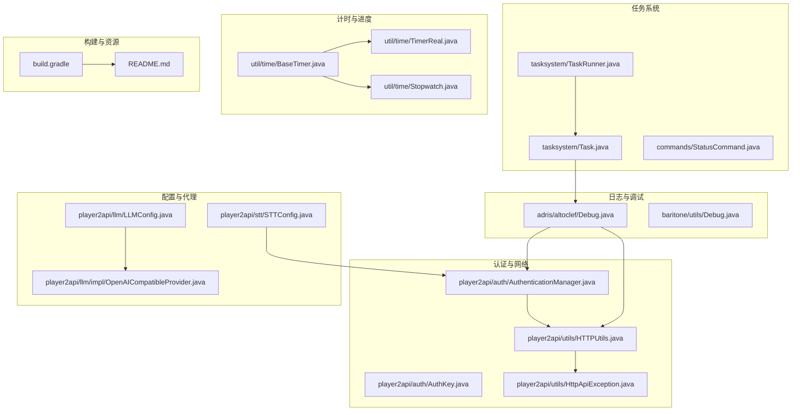
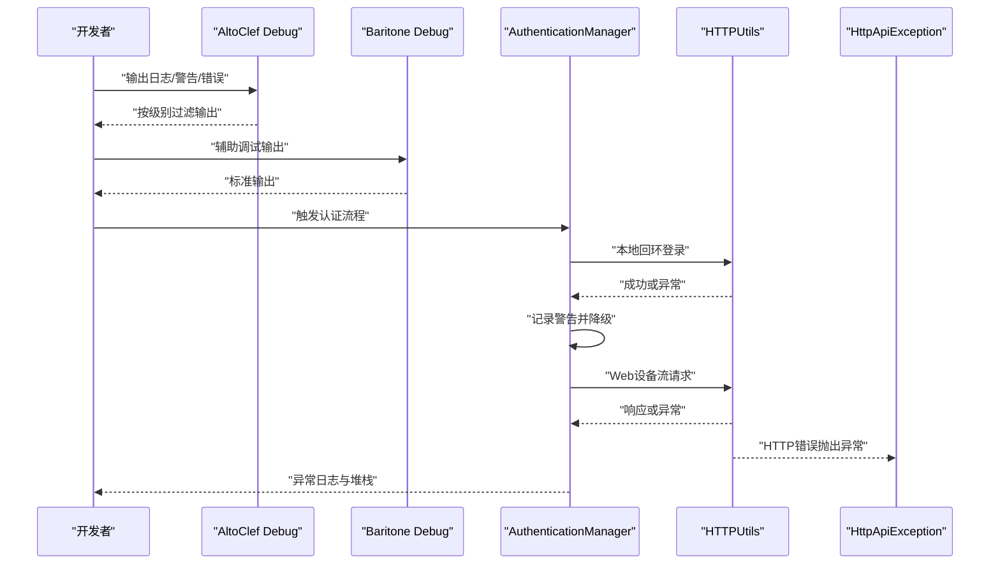
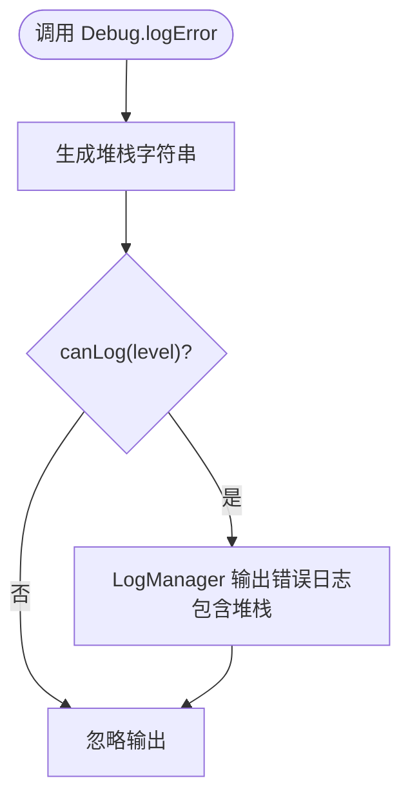
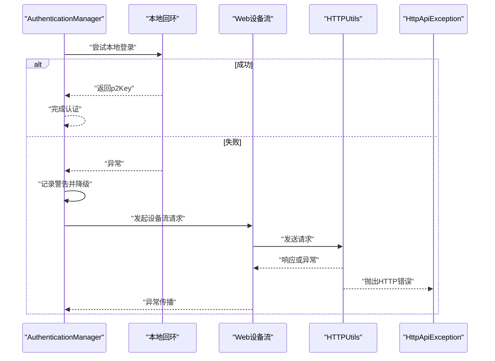
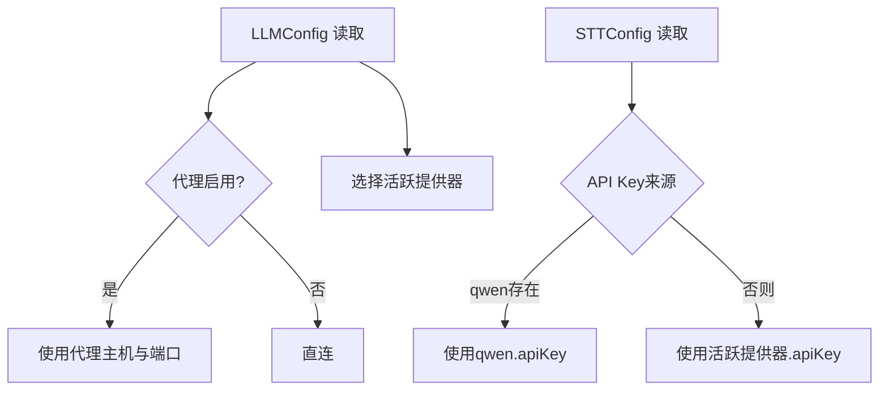
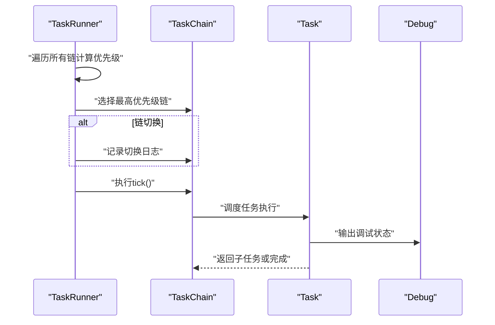
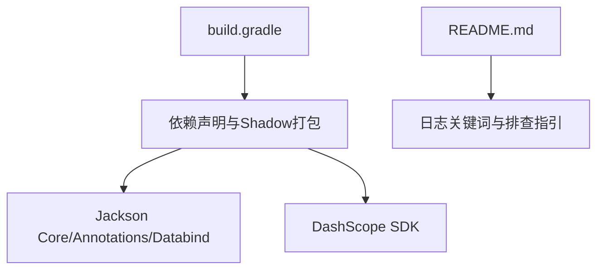

# 调试与故障排除

<cite>
**本文引用的文件**
- [Debug.java](file://src/main/java/adris/altoclef/Debug.java)
- [Debug.java](file://src/main/java/baritone/utils/Debug.java)
- [AuthenticationManager.java](file://src/main/java/adris/altoclef/player2api/auth/AuthenticationManager.java)
- [AuthKey.java](file://src/main/java/adris/altoclef/player2api/auth/AuthKey.java)
- [LLMConfig.java](file://src/main/java/adris/altoclef/player2api/llm/LLMConfig.java)
- [STTConfig.java](file://src/main/java/adris/altoclef/player2api/stt/STTConfig.java)
- [OpenAICompatibleProvider.java](file://src/main/java/adris/altoclef/player2api/llm/impl/OpenAICompatibleProvider.java)
- [HttpApiException.java](file://src/main/java/adris/altoclef/player2api/utils/HttpApiException.java)
- [HTTPUtils.java](file://src/main/java/adris/altoclef/player2api/utils/HTTPUtils.java)
- [BaseTimer.java](file://src/main/java/adris/altoclef/util/time/BaseTimer.java)
- [TimerReal.java](file://src/main/java/adris/altoclef/util/time/TimerReal.java)
- [Stopwatch.java](file://src/main/java/adris/altoclef/util/time/Stopwatch.java)
- [ConfigHelper.java](file://src/main/java/adris/altoclef/util/helpers/ConfigHelper.java)
- [TaskRunner.java](file://src/main/java/adris/altoclef/tasksystem/TaskRunner.java)
- [Task.java](file://src/main/java/adris/altoclef/tasksystem/Task.java)
- [StatusCommand.java](file://src/main/java/adris/altoclef/commands/StatusCommand.java)
- [build.gradle](file://build.gradle)
- [README.md](file://README.md)
</cite>

## 目录
1. [简介](#简介)
2. [项目结构](#项目结构)
3. [核心组件](#核心组件)
4. [架构总览](#架构总览)
5. [详细组件分析](#详细组件分析)
6. [依赖分析](#依赖分析)
7. [性能考虑](#性能考虑)
8. [故障排除指南](#故障排除指南)
9. [结论](#结论)
10. [附录](#附录)

## 简介
本指南面向开发者与运维人员，聚焦于调试与故障排除。内容涵盖：
- Debug日志系统的使用方法与日志级别控制
- 错误追踪机制与异常类型
- 性能监控技巧与计时器工具
- 常见问题诊断：API Key配置、网络连接、性能优化
- 开发与生产环境的调试工具、问题排查与监控告警
- 常见错误的解决方案、预防措施与最佳实践

## 项目结构
围绕调试与故障排除的关键模块包括：
- 日志系统：AltoClef统一日志与Baritone辅助日志
- 认证与网络：设备流认证、HTTP请求封装与异常
- 配置与代理：LLM/TTS/STT配置与代理设置
- 任务系统：任务执行与状态报告
- 计时与进度：基础计时器与进度检查器
- 构建与打包：Gradle配置与Shadow打包



**图表来源**
- [Debug.java:1-103](file://src/main/java/adris/altoclef/Debug.java#L1-L103)
- [Debug.java:1-20](file://src/main/java/baritone/utils/Debug.java#L1-L20)
- [AuthenticationManager.java:1-79](file://src/main/java/adris/altoclef/player2api/auth/AuthenticationManager.java#L1-L79)
- [AuthKey.java:1-5](file://src/main/java/adris/altoclef/player2api/auth/AuthKey.java#L1-L5)
- [HTTPUtils.java:1-88](file://src/main/java/adris/altoclef/player2api/utils/HTTPUtils.java#L1-L88)
- [HttpApiException.java:1-33](file://src/main/java/adris/altoclef/player2api/utils/HttpApiException.java#L1-L33)
- [LLMConfig.java:79-103](file://src/main/java/adris/altoclef/player2api/llm/LLMConfig.java#L79-L103)
- [STTConfig.java:61-77](file://src/main/java/adris/altoclef/player2api/stt/STTConfig.java#L61-L77)
- [OpenAICompatibleProvider.java:1-45](file://src/main/java/adris/altoclef/player2api/llm/impl/OpenAICompatibleProvider.java#L1-L45)
- [TaskRunner.java:1-98](file://src/main/java/adris/altoclef/tasksystem/TaskRunner.java#L1-L98)
- [Task.java:1-180](file://src/main/java/adris/altoclef/tasksystem/Task.java#L1-L180)
- [StatusCommand.java:1-25](file://src/main/java/adris/altoclef/commands/StatusCommand.java#L1-L25)
- [BaseTimer.java:1-40](file://src/main/java/adris/altoclef/util/time/BaseTimer.java#L1-L40)
- [TimerReal.java:1-12](file://src/main/java/adris/altoclef/util/time/TimerReal.java#L1-L12)
- [Stopwatch.java:1-19](file://src/main/java/adris/altoclef/util/time/Stopwatch.java#L1-L19)
- [build.gradle:1-135](file://build.gradle#L1-L135)
- [README.md:1-686](file://README.md#L1-L686)

**章节来源**
- [build.gradle:1-135](file://build.gradle#L1-L135)
- [README.md:1-686](file://README.md#L1-L686)

## 核心组件
- Debug日志系统：提供内部日志、警告、错误与堆栈打印能力，并支持日志级别过滤。
- 认证与网络：设备流认证、本地回环降级、Web认证与轮询；HTTP请求封装与错误包装。
- 配置与代理：LLM/TTS/STT配置读取与代理参数；STT API Key解析优先级。
- 任务系统：任务链调度、优先级选择、状态报告与中断处理。
- 计时与进度：基础计时器、实时计时器与秒表；线性进度检查器。
- 构建与资源：Gradle依赖与Shadow打包配置。

**章节来源**
- [Debug.java:1-103](file://src/main/java/adris/altoclef/Debug.java#L1-L103)
- [AuthenticationManager.java:1-79](file://src/main/java/adris/altoclef/player2api/auth/AuthenticationManager.java#L1-L79)
- [HTTPUtils.java:1-88](file://src/main/java/adris/altoclef/player2api/utils/HTTPUtils.java#L1-L88)
- [LLMConfig.java:79-103](file://src/main/java/adris/altoclef/player2api/llm/LLMConfig.java#L79-L103)
- [STTConfig.java:61-77](file://src/main/java/adris/altoclef/player2api/stt/STTConfig.java#L61-L77)
- [TaskRunner.java:1-98](file://src/main/java/adris/altoclef/tasksystem/TaskRunner.java#L1-L98)
- [Task.java:1-180](file://src/main/java/adris/altoclef/tasksystem/Task.java#L1-L180)
- [BaseTimer.java:1-40](file://src/main/java/adris/altoclef/util/time/BaseTimer.java#L1-L40)
- [TimerReal.java:1-12](file://src/main/java/adris/altoclef/util/time/TimerReal.java#L1-L12)
- [Stopwatch.java:1-19](file://src/main/java/adris/altoclef/util/time/Stopwatch.java#L1-L19)

## 架构总览
调试与故障排除贯穿以下链路：
- 日志：统一由AltoClef Debug输出，Baritone Debug作为辅助输出
- 认证：本地回环优先，失败后走Web设备流，带轮询与异常记录
- 网络：HTTP请求封装，错误抛出HttpApiException，便于上层捕获
- 配置：LLM/TTS/STT配置集中管理，支持代理与API Key优先级
- 任务：任务链优先级调度，状态报告便于定位卡顿与中断
- 计时：基础计时器与进度检查器用于性能瓶颈定位



**图表来源**
- [Debug.java:1-103](file://src/main/java/adris/altoclef/Debug.java#L1-L103)
- [Debug.java:1-20](file://src/main/java/baritone/utils/Debug.java#L1-L20)
- [AuthenticationManager.java:1-79](file://src/main/java/adris/altoclef/player2api/auth/AuthenticationManager.java#L1-L79)
- [HTTPUtils.java:1-88](file://src/main/java/adris/altoclef/player2api/utils/HTTPUtils.java#L1-L88)
- [HttpApiException.java:1-33](file://src/main/java/adris/altoclef/player2api/utils/HttpApiException.java#L1-L33)

## 详细组件分析

### Debug日志系统
- 功能要点
  - 内部日志、用户消息、字符消息输出
  - 警告与错误输出，错误包含堆栈信息
  - 日志级别过滤：NONE/ALL/NORMAL/WARN/ERROR
- 使用建议
  - 开发阶段可开启ALL查看详细流程
  - 生产环境建议使用NORMAL/WARN，避免过多日志噪声
  - 错误场景务必保留堆栈，便于定位



**图表来源**
- [Debug.java:59-101](file://src/main/java/adris/altoclef/Debug.java#L59-L101)

**章节来源**
- [Debug.java:1-103](file://src/main/java/adris/altoclef/Debug.java#L1-L103)

### 认证与网络
- 认证流程
  - 优先尝试本地回环登录，失败则进行Web设备流
  - 记录警告并降级，保证可用性
- 网络请求
  - 统一封装HTTP请求，设置JSON头与可选额外头
  - 非200响应抛出HttpApiException，包含状态码
- 异常处理
  - 上层捕获异常并记录，结合日志级别输出



**图表来源**
- [AuthenticationManager.java:60-79](file://src/main/java/adris/altoclef/player2api/auth/AuthenticationManager.java#L60-L79)
- [HTTPUtils.java:23-87](file://src/main/java/adris/altoclef/player2api/utils/HTTPUtils.java#L23-L87)
- [HttpApiException.java:22-33](file://src/main/java/adris/altoclef/player2api/utils/HttpApiException.java#L22-L33)

**章节来源**
- [AuthenticationManager.java:1-79](file://src/main/java/adris/altoclef/player2api/auth/AuthenticationManager.java#L1-L79)
- [AuthKey.java:1-5](file://src/main/java/adris/altoclef/player2api/auth/AuthKey.java#L1-L5)
- [HTTPUtils.java:1-88](file://src/main/java/adris/altoclef/player2api/utils/HTTPUtils.java#L1-L88)
- [HttpApiException.java:1-33](file://src/main/java/adris/altoclef/player2api/utils/HttpApiException.java#L1-L33)

### 配置与代理
- LLM配置
  - 代理开关、主机与端口默认值
  - 提供器配置读取与活跃提供器选择
- STT配置
  - API Key解析优先级：优先qwen配置，其次活跃提供器
  - 启用状态、模型、语言参数
- Provider实现
  - OpenAI兼容Provider支持任意遵循OpenAI格式的API



**图表来源**
- [LLMConfig.java:88-103](file://src/main/java/adris/altoclef/player2api/llm/LLMConfig.java#L88-L103)
- [STTConfig.java:61-77](file://src/main/java/adris/altoclef/player2api/stt/STTConfig.java#L61-L77)
- [OpenAICompatibleProvider.java:1-45](file://src/main/java/adris/altoclef/player2api/llm/impl/OpenAICompatibleProvider.java#L1-L45)

**章节来源**
- [LLMConfig.java:79-103](file://src/main/java/adris/altoclef/player2api/llm/LLMConfig.java#L79-L103)
- [STTConfig.java:61-77](file://src/main/java/adris/altoclef/player2api/stt/STTConfig.java#L61-L77)
- [OpenAICompatibleProvider.java:1-45](file://src/main/java/adris/altoclef/player2api/llm/impl/OpenAICompatibleProvider.java#L1-L45)

### 任务系统与状态
- 任务链调度
  - 选择最高优先级任务链执行
  - 切换链时记录日志，便于定位频繁切换
- 任务状态
  - 任务开始/停止/失败时输出调试信息
  - 状态命令可快速查看当前任务
- 建议
  - 高频切换通常意味着优先级计算或条件判断不稳定
  - 失败任务需结合堆栈与上下文日志定位



**图表来源**
- [TaskRunner.java:22-58](file://src/main/java/adris/altoclef/tasksystem/TaskRunner.java#L22-L58)
- [Task.java:17-49](file://src/main/java/adris/altoclef/tasksystem/Task.java#L17-L49)
- [StatusCommand.java:14-24](file://src/main/java/adris/altoclef/commands/StatusCommand.java#L14-L24)

**章节来源**
- [TaskRunner.java:1-98](file://src/main/java/adris/altoclef/tasksystem/TaskRunner.java#L1-L98)
- [Task.java:1-180](file://src/main/java/adris/altoclef/tasksystem/Task.java#L1-L180)
- [StatusCommand.java:1-25](file://src/main/java/adris/altoclef/commands/StatusCommand.java#L1-L25)

### 计时与进度
- 基础计时器
  - 提供间隔设置、已过时间、是否到期、重置
- 实时计时器
  - 基于System.currentTimeMillis
- 秒表
  - 开始计时、获取时间差
- 线性进度检查器
  - 超时与最小进度阈值判定失败

```mermaid
flowchart TD
Start(["开始计时"]) --> Begin["begin() 记录起点"]
Begin --> Loop{"循环tick"}
Loop --> |elapsed() > interval| Check["计算进度增量"]
Check --> Improvement{"增量 < minProgress?"}
Improvement --> |是| Fail["标记失败"]
Improvement --> |否| Reset["重置计时与进度"]
Reset --> Loop
Fail --> End(["结束"])
```

**图表来源**
- [Stopwatch.java:11-18](file://src/main/java/adris/altoclef/util/time/Stopwatch.java#L11-L18)
- [BaseTimer.java:19-25](file://src/main/java/adris/altoclef/util/time/BaseTimer.java#L19-L25)
- [LinearProgressChecker.java:19-35](file://src/main/java/adris/altoclef/util/progresscheck/LinearProgressChecker.java#L19-L35)

**章节来源**
- [BaseTimer.java:1-40](file://src/main/java/adris/altoclef/util/time/BaseTimer.java#L1-L40)
- [TimerReal.java:1-12](file://src/main/java/adris/altoclef/util/time/TimerReal.java#L1-L12)
- [Stopwatch.java:1-19](file://src/main/java/adris/altoclef/util/time/Stopwatch.java#L1-L19)
- [LinearProgressChecker.java:1-49](file://src/main/java/adris/altoclef/util/progresscheck/LinearProgressChecker.java#L1-L49)

## 依赖分析
- 构建与打包
  - Gradle 8.x、Java 17、Fabric Loom、Shadow打包
  - Jackson与DashScope SDK依赖
- 运行时日志
  - README提供日志关键词与常见问题排查方向



**图表来源**
- [build.gradle:43-69](file://build.gradle#L43-L69)
- [README.md:456-491](file://README.md#L456-L491)

**章节来源**
- [build.gradle:1-135](file://build.gradle#L1-L135)
- [README.md:456-491](file://README.md#L456-L491)

## 性能考虑
- 任务链优先级与频繁切换
  - 通过状态报告定位频繁切换，优化优先级计算或条件判断
- 网络调用
  - 使用代理降低延迟（若网络受限）
  - 避免在主线程阻塞调用LLM/TTS接口（当前已在线程池中执行）
- 计时与进度
  - 使用Stopwatch与LinearProgressChecker监控瓶颈
- 配置热加载
  - 配置解析失败时记录错误并回退默认值，避免崩溃

**章节来源**
- [TaskRunner.java:40-54](file://src/main/java/adris/altoclef/tasksystem/TaskRunner.java#L40-L54)
- [LLMConfig.java:88-103](file://src/main/java/adris/altoclef/player2api/llm/LLMConfig.java#L88-L103)
- [Stopwatch.java:1-19](file://src/main/java/adris/altoclef/util/time/Stopwatch.java#L1-L19)
- [LinearProgressChecker.java:1-49](file://src/main/java/adris/altoclef/util/progresscheck/LinearProgressChecker.java#L1-L49)
- [ConfigHelper.java:64-93](file://src/main/java/adris/altoclef/util/helpers/ConfigHelper.java#L64-L93)

## 故障排除指南

### API Key配置问题
- 症状
  - LLM/STT/TTS返回401/403
- 排查步骤
  - 确认playerengine-llm.json中的providers.qwen.apiKey正确
  - 若STT未单独配置apiKey，则自动复用qwen.apiKey
  - 检查DashScope控制台权限与配额
- 解决方案
  - 更新API Key并重启
  - 如需单独STT Key，补充stt.apiKey字段
- 预防措施
  - 将API Key纳入安全配置管理，避免硬编码
  - 定期轮换Key并测试连通性

**章节来源**
- [LLMConfig.java:79-103](file://src/main/java/adris/altoclef/player2api/llm/LLMConfig.java#L79-L103)
- [STTConfig.java:61-77](file://src/main/java/adris/altoclef/player2api/stt/STTConfig.java#L61-L77)
- [README.md:480-491](file://README.md#L480-L491)

### 网络连接问题
- 症状
  - 本地回环登录失败，认证降级至Web设备流
  - HTTP 4xx/5xx错误
- 排查步骤
  - 检查本地回环地址可达性
  - 使用代理配置（proxy.enabled/host/port）
  - 查看HttpApiException状态码与响应体
- 解决方案
  - 修复本地服务或禁用本地回环
  - 配置代理或更换网络环境
- 预防措施
  - 在认证流程中增加重试与降级策略
  - 记录详细错误日志与堆栈

**章节来源**
- [AuthenticationManager.java:60-79](file://src/main/java/adris/altoclef/player2api/auth/AuthenticationManager.java#L60-L79)
- [HTTPUtils.java:57-87](file://src/main/java/adris/altoclef/player2api/utils/HTTPUtils.java#L57-L87)
- [HttpApiException.java:22-33](file://src/main/java/adris/altoclef/player2api/utils/HttpApiException.java#L22-L33)
- [LLMConfig.java:88-103](file://src/main/java/adris/altoclef/player2api/llm/LLMConfig.java#L88-L103)

### 性能优化建议
- 任务系统
  - 降低任务链数量或优化优先级计算
  - 使用状态命令定期检查当前任务
- 计时与监控
  - 使用Stopwatch测量关键路径耗时
  - 使用LinearProgressChecker检测停滞
- 配置与缓存
  - 避免频繁重载配置
  - 在LLM调用处增加幂等与缓存策略（如相同输入复用）

**章节来源**
- [TaskRunner.java:40-54](file://src/main/java/adris/altoclef/tasksystem/TaskRunner.java#L40-L54)
- [StatusCommand.java:14-24](file://src/main/java/adris/altoclef/commands/StatusCommand.java#L14-L24)
- [Stopwatch.java:1-19](file://src/main/java/adris/altoclef/util/time/Stopwatch.java#L1-L19)
- [LinearProgressChecker.java:1-49](file://src/main/java/adris/altoclef/util/progresscheck/LinearProgressChecker.java#L1-L49)

### 开发与生产环境调试工具
- 开发环境
  - 使用ALL日志级别观察全流程
  - 通过Baritone Debug辅助定位底层行为
  - 使用Gradle构建与Shadow打包验证依赖
- 生产环境
  - 使用NORMAL/WARN日志级别，避免日志风暴
  - 通过状态命令与任务链日志定位问题
  - 配置代理与网络监控，确保外部服务可用

**章节来源**
- [Debug.java:86-101](file://src/main/java/adris/altoclef/Debug.java#L86-L101)
- [Debug.java:1-20](file://src/main/java/baritone/utils/Debug.java#L1-L20)
- [build.gradle:71-94](file://build.gradle#L71-L94)
- [README.md:456-491](file://README.md#L456-L491)

### 常见错误与解决方案
- 401/403
  - 检查API Key有效性与权限
- TTS合成失败
  - 确认TTS启用与API Key权限
- STT识别为空
  - 检查录音时长与麦克风权限
- 任务频繁切换
  - 优化优先级计算与条件判断

**章节来源**
- [README.md:480-491](file://README.md#L480-L491)

## 结论
本指南提供了从日志、认证、网络、配置到任务与计时的全链路调试与故障排除方法。建议在开发阶段使用ALL日志级别与Baritone辅助输出，在生产阶段采用NORMAL/WARN并结合状态命令与计时器工具进行持续监控。针对API Key与网络问题，建立代理与重试机制；针对性能问题，优化任务链与引入缓存与监控。

## 附录
- 关键日志关键词与排查方向可参考README中的“日志排查”章节
- 构建与依赖配置可参考build.gradle

**章节来源**
- [README.md:456-491](file://README.md#L456-L491)
- [build.gradle:1-135](file://build.gradle#L1-L135)