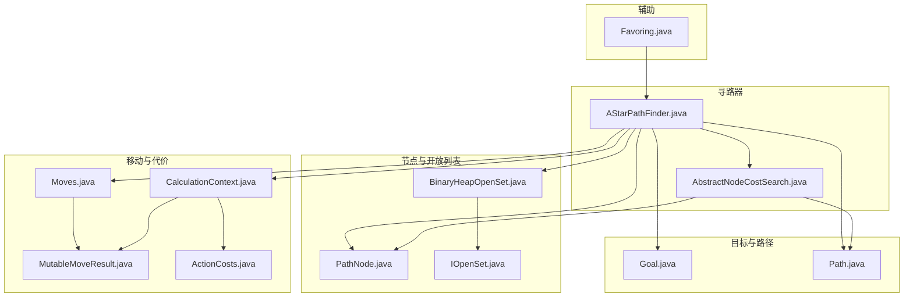
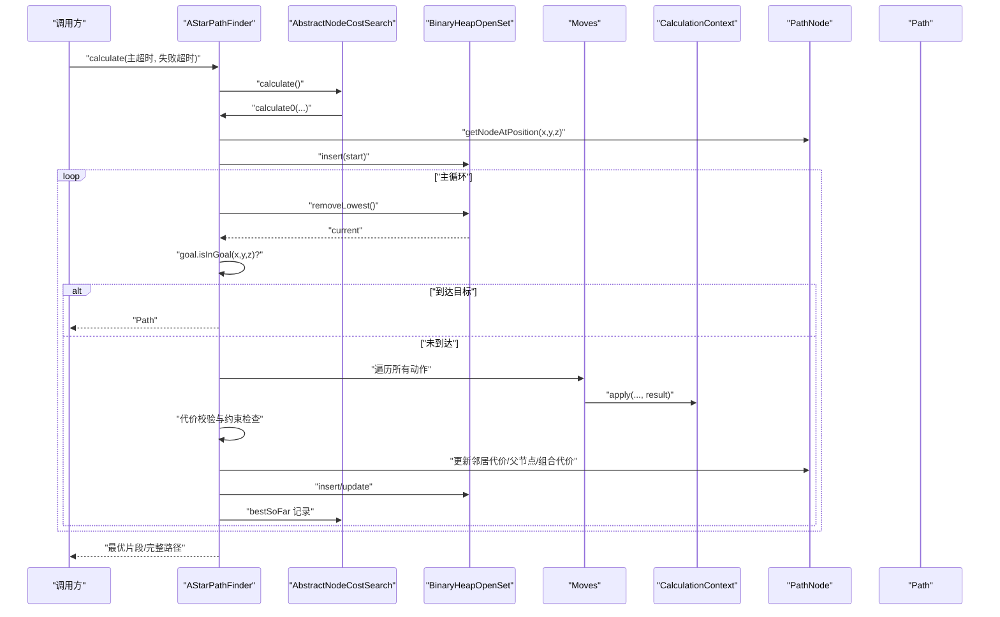
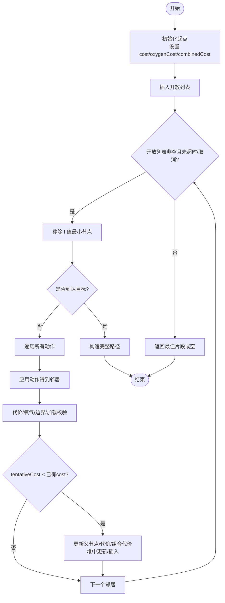
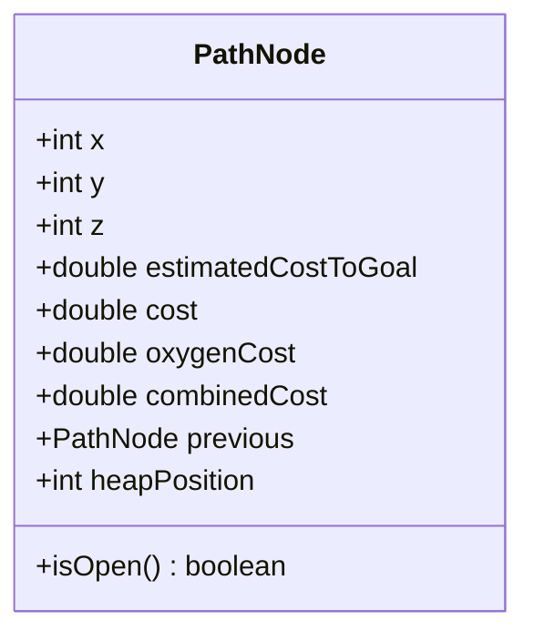
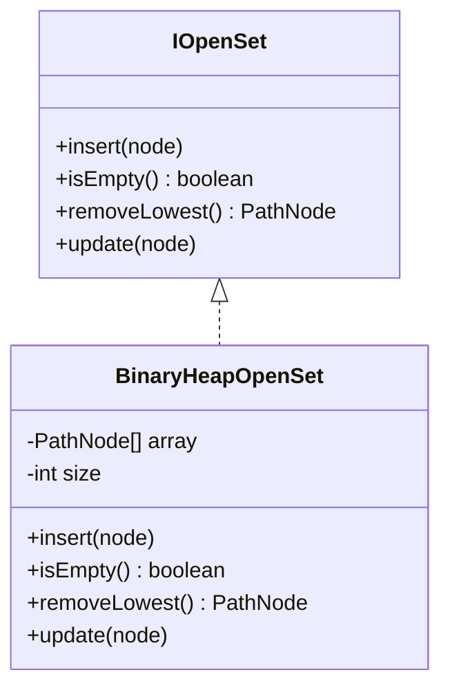
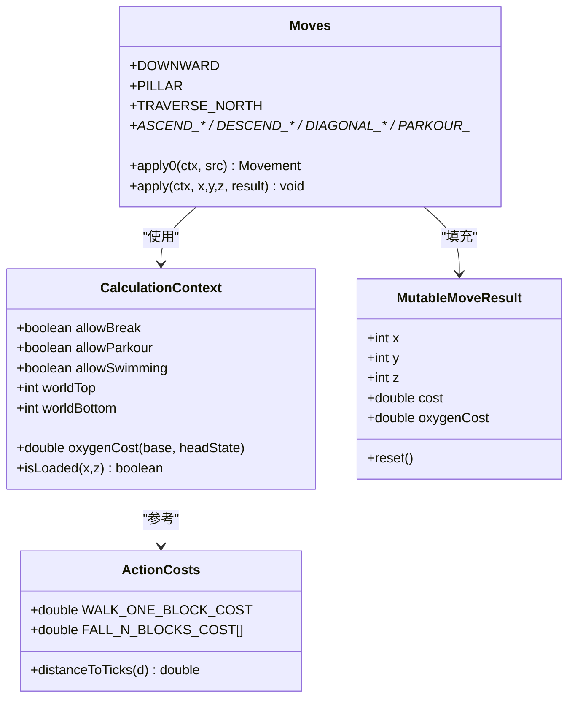
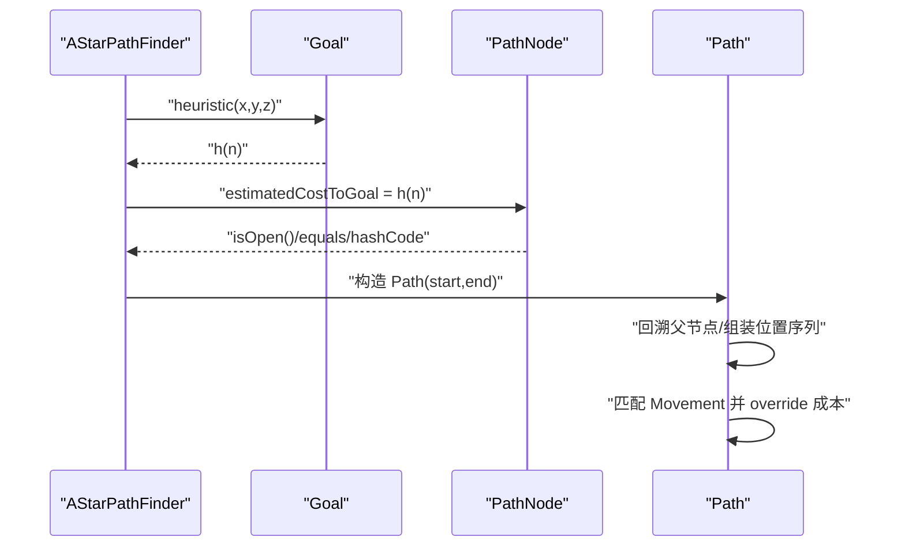
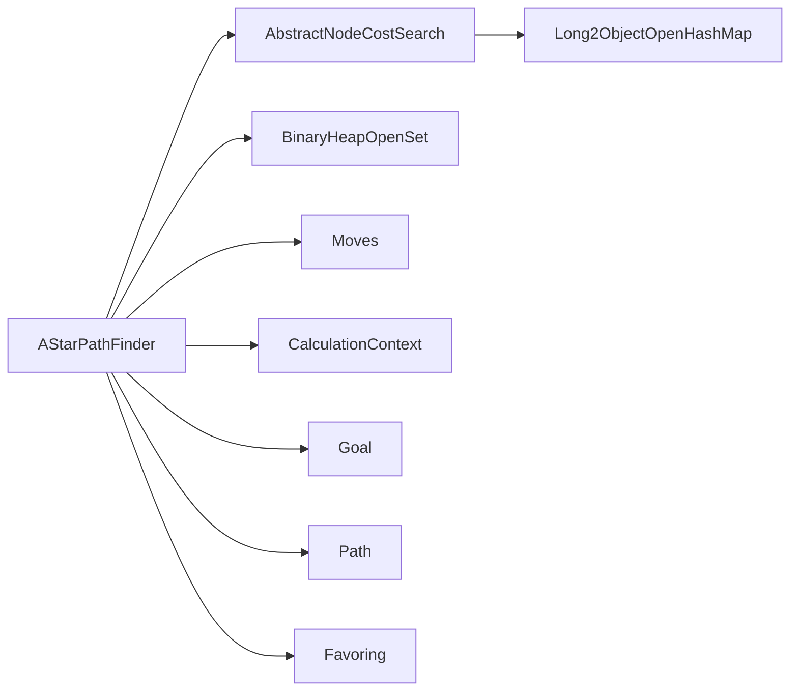

# A* 寻路算法

<cite>
**本文引用的文件**
- [AStarPathFinder.java](file://src/main/java/baritone/pathing/calc/AStarPathFinder.java)
- [AbstractNodeCostSearch.java](file://src/main/java/baritone/pathing/calc/AbstractNodeCostSearch.java)
- [PathNode.java](file://src/main/java/baritone/pathing/calc/PathNode.java)
- [BinaryHeapOpenSet.java](file://src/main/java/baritone/pathing/calc/openset/BinaryHeapOpenSet.java)
- [IOpenSet.java](file://src/main/java/baritone/pathing/calc/openset/IOpenSet.java)
- [Path.java](file://src/main/java/baritone/pathing/calc/Path.java)
- [Moves.java](file://src/main/java/baritone/pathing/movement/Moves.java)
- [CalculationContext.java](file://src/main/java/baritone/pathing/movement/CalculationContext.java)
- [Goal.java](file://src/main/java/baritone/api/pathing/goals/Goal.java)
- [MutableMoveResult.java](file://src/main/java/baritone/utils/pathing/MutableMoveResult.java)
- [Favoring.java](file://src/main/java/baritone/utils/pathing/Favoring.java)
- [ActionCosts.java](file://src/main/java/baritone/api/pathing/movement/ActionCosts.java)
</cite>

## 目录
1. [引言](#引言)
2. [项目结构](#项目结构)
3. [核心组件](#核心组件)
4. [架构总览](#架构总览)
5. [详细组件分析](#详细组件分析)
6. [依赖分析](#依赖分析)
7. [性能考量](#性能考量)
8. [故障排查指南](#故障排查指南)
9. [结论](#结论)
10. [附录：调优与实践技巧](#附录调优与实践技巧)

## 引言
本文件围绕 A* 寻路算法在项目中的实现进行深入技术说明，重点覆盖以下方面：
- AStarPathFinder 的算法流程与关键实现细节（启发式函数、开放列表管理、代价计算、节点评估）
- 路径节点 PathNode 的数据结构设计（状态、父子关系、代价属性、可达性约束）
- 开放列表实现（二叉堆）的性能特征与选择依据
- 复杂地形与动态约束（如氧气限制、世界边界、加载区块）的处理方式
- 实战调优建议（启发式参数、地形处理、路径质量与缓存）

## 项目结构
本仓库中与 A* 寻路直接相关的核心模块位于 baritone.pathing 包下，主要由“寻路器”“节点与开放列表”“移动与代价”“目标与上下文”四类文件组成。

图表来源
- [AStarPathFinder.java:1-168](file://src/main/java/baritone/pathing/calc/AStarPathFinder.java#L1-L168)
- [AbstractNodeCostSearch.java:1-190](file://src/main/java/baritone/pathing/calc/AbstractNodeCostSearch.java#L1-L190)
- [PathNode.java:1-48](file://src/main/java/baritone/pathing/calc/PathNode.java#L1-L48)
- [BinaryHeapOpenSet.java:1-104](file://src/main/java/baritone/pathing/calc/openset/BinaryHeapOpenSet.java#L1-L104)
- [IOpenSet.java:1-14](file://src/main/java/baritone/pathing/calc/openset/IOpenSet.java#L1-L14)
- [Path.java:1-135](file://src/main/java/baritone/pathing/calc/Path.java#L1-L135)
- [Moves.java:1-325](file://src/main/java/baritone/pathing/movement/Moves.java#L1-L325)
- [CalculationContext.java:1-197](file://src/main/java/baritone/pathing/movement/CalculationContext.java#L1-L197)
- [Goal.java:1-22](file://src/main/java/baritone/api/pathing/goals/Goal.java#L1-L22)
- [MutableMoveResult.java:1-25](file://src/main/java/baritone/utils/pathing/MutableMoveResult.java#L1-L25)
- [Favoring.java:1-38](file://src/main/java/baritone/utils/pathing/Favoring.java#L1-L38)
- [ActionCosts.java:1-55](file://src/main/java/baritone/api/pathing/movement/ActionCosts.java#L1-L55)

章节来源
- [AStarPathFinder.java:1-168](file://src/main/java/baritone/pathing/calc/AStarPathFinder.java#L1-L168)
- [AbstractNodeCostSearch.java:1-190](file://src/main/java/baritone/pathing/calc/AbstractNodeCostSearch.java#L1-L190)

## 核心组件
- AStarPathFinder：A* 寻路主实现，负责初始化起点、构建开放列表、迭代扩展节点、更新代价与回溯路径，并在超时或取消时返回最优片段。
- AbstractNodeCostSearch：抽象基类，统一管理节点映射、最佳已知路径记录、超时控制、结果后处理与截断。
- PathNode：路径节点，保存坐标、启发式代价、实际代价、组合代价、父节点指针以及在堆中的位置索引。
- BinaryHeapOpenSet：基于数组的二叉堆，按 combinedCost 维持最小堆性质，支持插入、更新、删除最小值。
- Path：从终点回溯到起点的路径表示，负责将节点序列转换为可执行的 IMovement 序列。
- Moves/CalculationContext/MutableMoveResult：定义所有可能的移动动作及其代价计算，封装当前实体状态、世界边界、氧气限制、工具与规则等上下文信息。
- Goal：目标接口，提供目标判定与启发式估算。
- Favoring：对回溯路径与避让区域进行代价加权，提升路径质量与安全性。

章节来源
- [AStarPathFinder.java:16-167](file://src/main/java/baritone/pathing/calc/AStarPathFinder.java#L16-L167)
- [AbstractNodeCostSearch.java:16-190](file://src/main/java/baritone/pathing/calc/AbstractNodeCostSearch.java#L16-L190)
- [PathNode.java:7-47](file://src/main/java/baritone/pathing/calc/PathNode.java#L7-L47)
- [BinaryHeapOpenSet.java:6-104](file://src/main/java/baritone/pathing/calc/openset/BinaryHeapOpenSet.java#L6-L104)
- [Path.java:17-135](file://src/main/java/baritone/pathing/calc/Path.java#L17-L135)
- [Moves.java:15-325](file://src/main/java/baritone/pathing/movement/Moves.java#L15-L325)
- [CalculationContext.java:29-197](file://src/main/java/baritone/pathing/movement/CalculationContext.java#L29-L197)
- [Goal.java:5-22](file://src/main/java/baritone/api/pathing/goals/Goal.java#L5-L22)
- [Favoring.java:10-38](file://src/main/java/baritone/utils/pathing/Favoring.java#L10-L38)

## 架构总览
A* 寻路的整体流程如下：

图表来源
- [AStarPathFinder.java:26-166](file://src/main/java/baritone/pathing/calc/AStarPathFinder.java#L26-L166)
- [AbstractNodeCostSearch.java:46-95](file://src/main/java/baritone/pathing/calc/AbstractNodeCostSearch.java#L46-L95)
- [BinaryHeapOpenSet.java:24-102](file://src/main/java/baritone/pathing/calc/openset/BinaryHeapOpenSet.java#L24-L102)
- [Moves.java:15-325](file://src/main/java/baritone/pathing/movement/Moves.java#L15-L325)
- [CalculationContext.java:139-141](file://src/main/java/baritone/pathing/movement/CalculationContext.java#L139-L141)
- [Path.java:28-104](file://src/main/java/baritone/pathing/calc/Path.java#L28-L104)

## 详细组件分析

### AStarPathFinder：A* 算法实现与流程
- 初始化与起点设置：将起点节点加入开放列表，并初始化其 cost、oxygenCost、combinedCost。
- 超时与慢速模式：支持慢速路径模式与超时控制，便于调试与低负载运行。
- 主循环：每次从开放列表取出 f 值最小的节点，若命中目标则构造路径；否则对每个动作生成邻居节点并更新代价。
- 代价更新策略：比较 tentativeCost 与已有 cost，若更优则更新父节点、代价与组合代价，并在堆中上滤或插入。
- 最佳片段记录：通过多系数启发式记录“最佳已知路径”，在一定距离阈值后可提前返回片段以保证实时性。
- 取消与日志：支持取消请求与性能统计输出。

图表来源
- [AStarPathFinder.java:26-166](file://src/main/java/baritone/pathing/calc/AStarPathFinder.java#L26-L166)

章节来源
- [AStarPathFinder.java:26-166](file://src/main/java/baritone/pathing/calc/AStarPathFinder.java#L26-L166)

### PathNode：路径节点数据结构
- 字段含义
  - 坐标：x, y, z
  - 启发式代价：estimatedCostToGoal（来自 Goal.heuristic）
  - 实际代价：cost（从起点累计）
  - 组合代价：combinedCost = cost + estimatedCostToGoal
  - 父节点：previous（用于回溯）
  - 堆位置：heapPosition（二叉堆索引）
- 状态判断：isOpen() 通过 heapPosition 判断是否在堆中
- 哈希与相等：基于坐标长整型哈希，确保在映射中唯一定位

图表来源
- [PathNode.java:7-47](file://src/main/java/baritone/pathing/calc/PathNode.java#L7-L47)

章节来源
- [PathNode.java:7-47](file://src/main/java/baritone/pathing/calc/PathNode.java#L7-L47)

### 开放列表：二叉堆实现
- 接口 IOpenSet：定义 insert、isEmpty、removeLowest、update 四个操作
- BinaryHeapOpenSet：
  - 数组存储，大小不足时扩容
  - 插入后上滤，更新时沿父节点上滤
  - 删除最小值后下滤，维护堆序
  - 使用 PathNode.combinedCost 作为堆序键

图表来源
- [IOpenSet.java:5-13](file://src/main/java/baritone/pathing/calc/openset/IOpenSet.java#L5-L13)
- [BinaryHeapOpenSet.java:6-104](file://src/main/java/baritone/pathing/calc/openset/BinaryHeapOpenSet.java#L6-L104)

章节来源
- [IOpenSet.java:5-13](file://src/main/java/baritone/pathing/calc/openset/IOpenSet.java#L5-L13)
- [BinaryHeapOpenSet.java:6-104](file://src/main/java/baritone/pathing/calc/openset/BinaryHeapOpenSet.java#L6-L104)

### 移动与代价：动作枚举与上下文
- Moves：定义所有可能的动作（上下、前后左右、斜坡、跳跃、攀爬等），每种动作提供 apply0 与 apply 两个入口，后者填充 MutableMoveResult，包含新坐标与代价。
- CalculationContext：封装实体尺寸、世界边界、工具集、是否允许破/放/游泳/下潜等规则，以及氧气消耗计算。
- MutableMoveResult：临时承载一次动作的结果（新坐标、代价、氧气消耗）。
- ActionCosts：提供基础移动代价常量与掉落公式等静态方法。

图表来源
- [Moves.java:15-325](file://src/main/java/baritone/pathing/movement/Moves.java#L15-L325)
- [CalculationContext.java:29-197](file://src/main/java/baritone/pathing/movement/CalculationContext.java#L29-L197)
- [MutableMoveResult.java:5-25](file://src/main/java/baritone/utils/pathing/MutableMoveResult.java#L5-L25)
- [ActionCosts.java:1-55](file://src/main/java/baritone/api/pathing/movement/ActionCosts.java#L1-L55)

章节来源
- [Moves.java:15-325](file://src/main/java/baritone/pathing/movement/Moves.java#L15-L325)
- [CalculationContext.java:29-197](file://src/main/java/baritone/pathing/movement/CalculationContext.java#L29-L197)
- [MutableMoveResult.java:5-25](file://src/main/java/baritone/utils/pathing/MutableMoveResult.java#L5-L25)
- [ActionCosts.java:1-55](file://src/main/java/baritone/api/pathing/movement/ActionCosts.java#L1-L55)

### 目标与路径：启发式与后处理
- Goal：提供 isInGoal 与 heuristic 两个核心接口，启发式必须满足可接受性（在本项目中会进行 NaN 校验）。
- Path：从终点回溯起点，组装 BetterBlockPos 序列与 Movement 序列；在 postProcess 中尝试匹配具体动作并进行裁剪与校验。

图表来源
- [Goal.java:5-22](file://src/main/java/baritone/api/pathing/goals/Goal.java#L5-L22)
- [PathNode.java:19-31](file://src/main/java/baritone/pathing/calc/PathNode.java#L19-L31)
- [Path.java:28-104](file://src/main/java/baritone/pathing/calc/Path.java#L28-L104)

章节来源
- [Goal.java:5-22](file://src/main/java/baritone/api/pathing/goals/Goal.java#L5-L22)
- [PathNode.java:19-31](file://src/main/java/baritone/pathing/calc/PathNode.java#L19-L31)
- [Path.java:28-104](file://src/main/java/baritone/pathing/calc/Path.java#L28-L104)

### 路径后处理与质量优化
- AbstractNodeCostSearch 在计算完成后对路径进行“裁剪至已加载区块边缘”和“静态截断”，并在必要时返回“成功片段”而非完整路径。
- Favoring 对回溯路径与避让区域进行加权，降低重复探索与危险区域穿越。

章节来源
- [AbstractNodeCostSearch.java:46-95](file://src/main/java/baritone/pathing/calc/AbstractNodeCostSearch.java#L46-L95)
- [Favoring.java:10-38](file://src/main/java/baritone/utils/pathing/Favoring.java#L10-L38)

## 依赖分析
- AStarPathFinder 依赖：
  - 抽象基类 AbstractNodeCostSearch（共享节点映射、最佳片段记录、超时与后处理）
  - 二叉堆开放列表 BinaryHeapOpenSet
  - 动作枚举 Moves 与 CalculationContext
  - 目标接口 Goal
  - 路径实现 Path
  - 辅助 Favoring
- 数据结构耦合：
  - PathNode 与 BinaryHeapOpenSet 通过 combinedCost 与 heapPosition 紧密耦合
  - Moves 与 CalculationContext 通过 MutableMoveResult 解耦代价计算
- 外部依赖：
  - fastutil 的 Long2ObjectOpenHashMap 用于节点映射
  - Settings 与 Baritone 日志/通知系统

图表来源
- [AStarPathFinder.java:16-24](file://src/main/java/baritone/pathing/calc/AStarPathFinder.java#L16-L24)
- [AbstractNodeCostSearch.java:22-40](file://src/main/java/baritone/pathing/calc/AbstractNodeCostSearch.java#L22-L40)

章节来源
- [AStarPathFinder.java:16-24](file://src/main/java/baritone/pathing/calc/AStarPathFinder.java#L16-L24)
- [AbstractNodeCostSearch.java:22-40](file://src/main/java/baritone/pathing/calc/AbstractNodeCostSearch.java#L22-L40)

## 性能考量
- 时间复杂度
  - A* 主循环次数取决于有效扩展节点数，典型为 O(b^d)，其中 b 为分支因子，d 为解深度
  - 二叉堆插入/更新/删除均为 O(log N)，N 为堆大小
- 内存使用
  - 节点映射采用 Long2ObjectOpenHashMap，初始容量与负载因子受设置控制
  - PathNode 对象数量随扩展规模增长，需结合超时与片段返回策略控制峰值内存
- 开放列表选择
  - 二叉堆在“最小 f 值优先”的场景下具有稳定的 O(log N) 操作，适合 A* 的主循环
  - 若追求常数级常量与小规模数据，链表可在插入/删除较少时简化实现；但对大范围搜索，堆的对数级优势明显
- 代价与启发式
  - 启发式必须可接受，避免回溯路径劣化
  - 多系数启发式（COEFFICIENTS）用于在不同权重下快速产出候选路径，提高实时性
- 地形与约束
  - 世界边界、加载区块、氧气限制、工具可用性等均在代价计算阶段严格过滤，减少无效扩展
- 调优方向
  - 启发式权重：通过 Favoring 与 COEFFICIENTS 调整对回溯与危险区的规避程度
  - 动作代价：根据 ActionCosts 与 CalculationContext 规则微调步行/奔跑/跳跃/下潜等成本
  - 超时策略：结合 slowPath 与失败超时，平衡实时性与路径质量

[本节为通用性能讨论，不直接分析具体文件]

## 故障排查指南
- 启发式异常
  - 若启发式返回 NaN，构造 PathNode 时会抛出非法状态异常，需检查 Goal.heuristic 的实现
- 代价异常
  - 动作代价为无穷大或负值会导致路径不可行；若出现负代价或 NaN，需检查 CalculationContext 与 Moves 的 apply 实现
- 超时与取消
  - 超时后返回“最佳片段”或空；取消请求会中断计算并返回取消结果类型
- 路径后处理失败
  - 若无法匹配具体动作，Path.postProcess 将返回裁剪后的路径；可检查 Movement 生成逻辑与目标邻接关系

章节来源
- [PathNode.java:23-25](file://src/main/java/baritone/pathing/calc/PathNode.java#L23-L25)
- [AStarPathFinder.java:102-113](file://src/main/java/baritone/pathing/calc/AStarPathFinder.java#L102-L113)
- [AbstractNodeCostSearch.java:85-89](file://src/main/java/baritone/pathing/calc/AbstractNodeCostSearch.java#L85-L89)
- [Path.java:80-90](file://src/main/java/baritone/pathing/calc/Path.java#L80-L90)

## 结论
该实现以 A* 为核心，结合二叉堆开放列表、可接受启发式与严格的地形/代价约束，提供了高效且可调的寻路能力。通过多系数启发式与最佳片段返回策略，在复杂地形与动态环境下仍能保持较好的实时性与路径质量。进一步优化可聚焦于启发式权重、动作代价模型与内存占用控制。

[本节为总结性内容，不直接分析具体文件]

## 附录：调优与实践技巧
- 启发式参数调优
  - 通过 Favoring 对回溯路径与避让区域施加系数，降低重复探索与危险穿越
  - 调整 COEFFICIENTS 以在不同权重下快速产出候选路径，提升实时性
- 复杂地形处理
  - 利用 CalculationContext 的氧气消耗、世界边界、加载区块等约束，提前过滤不可行扩展
  - 对下潜/游泳/攀爬等动作的成本进行精细调整，以适配不同生物群系与装备
- 路径质量优化
  - 在 AbstractNodeCostSearch 后处理阶段启用“裁剪至已加载区块边缘”与“静态截断”
  - 对 Movement 进行 override 以修正后处理阶段的成本估计误差
- 路径缓存与复用
  - 对频繁查询的起点-目标对，可考虑在上层逻辑中缓存 Path 或片段，减少重复计算
  - 结合慢速模式与超时策略，平衡首次计算与后续复用的收益

[本节为实践建议，不直接分析具体文件]