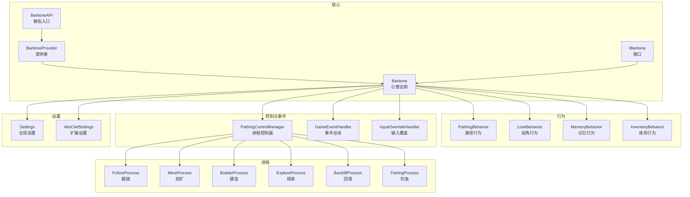
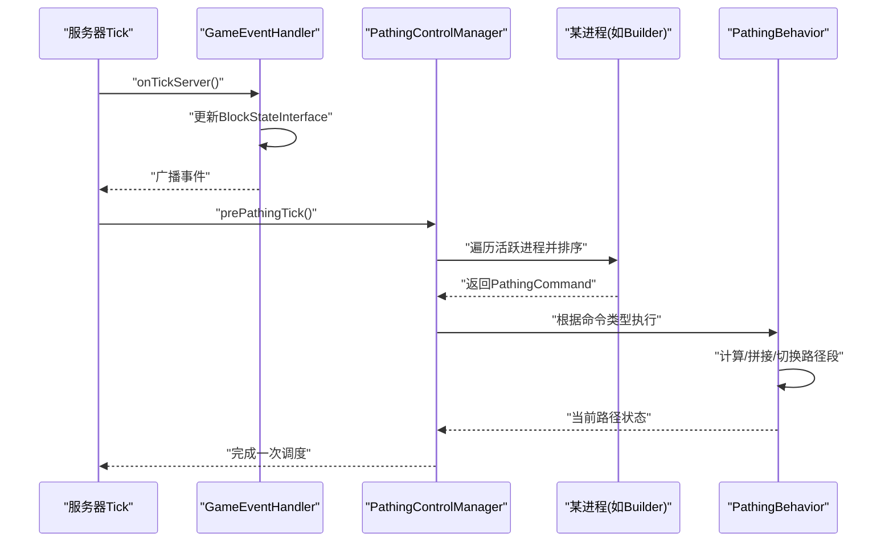
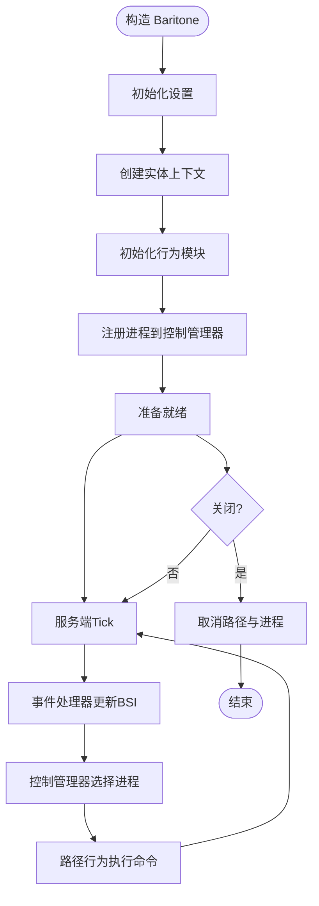
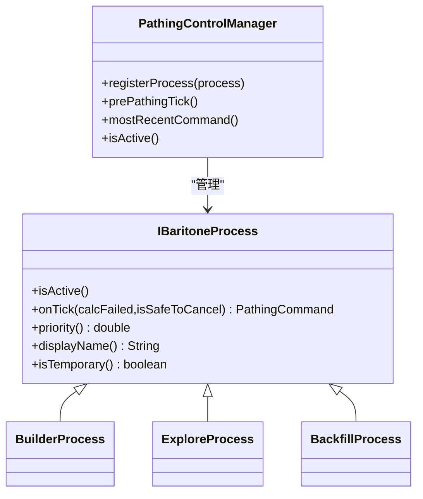
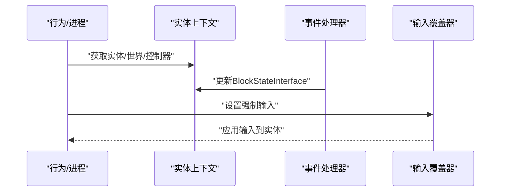
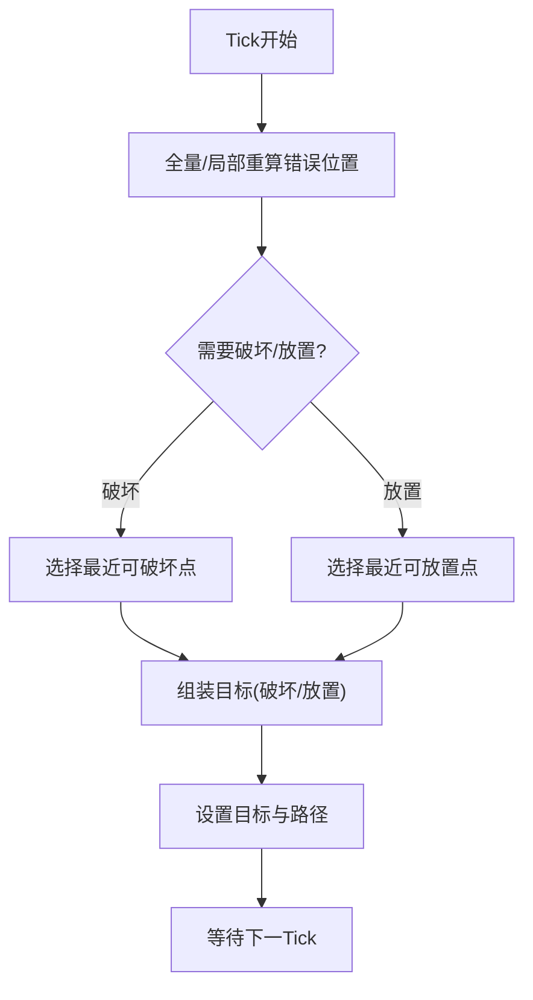
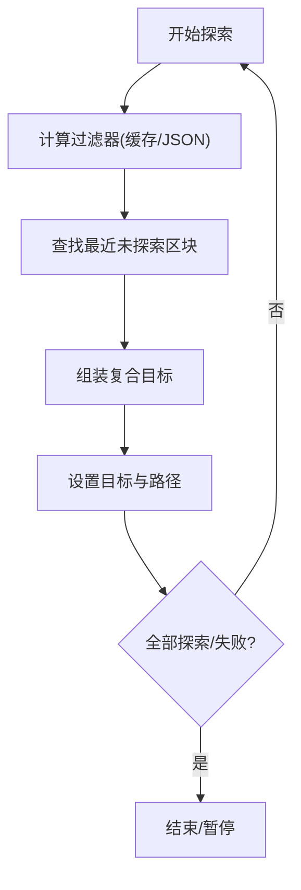
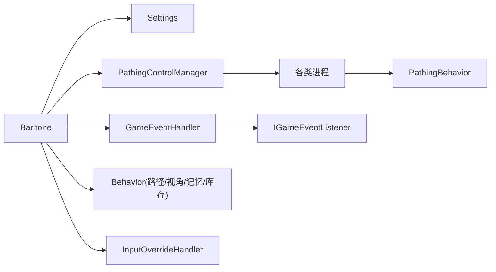

# Baritone 引擎集成

<cite>
**本文引用的文件**
- [Baritone.java](file://src/main/java/baritone/Baritone.java)
- [BaritoneProvider.java](file://src/main/java/baritone/BaritoneProvider.java)
- [IBaritone.java](file://src/main/java/baritone/api/IBaritone.java)
- [BaritoneAPI.java](file://src/main/java/baritone/api/BaritoneAPI.java)
- [PlayerEngine.java](file://src/main/java/baritone/PlayerEngine.java)
- [Behavior.java](file://src/main/java/baritone/behavior/Behavior.java)
- [PathingBehavior.java](file://src/main/java/baritone/behavior/PathingBehavior.java)
- [BackfillProcess.java](file://src/main/java/baritone/process/BackfillProcess.java)
- [BuilderProcess.java](file://src/main/java/baritone/process/BuilderProcess.java)
- [ExploreProcess.java](file://src/main/java/baritone/process/ExploreProcess.java)
- [PathingControlManager.java](file://src/main/java/baritone/utils/PathingControlManager.java)
- [GameEventHandler.java](file://src/main/java/baritone/event/GameEventHandler.java)
- [InputOverrideHandler.java](file://src/main/java/baritone/utils/InputOverrideHandler.java)
- [Settings.java](file://src/main/java/baritone/api/Settings.java)
- [AltoClefSettings.java](file://src/main/java/baritone/autoclef/AltoClefSettings.java)
</cite>

## 目录
1. [简介](#简介)
2. [项目结构](#项目结构)
3. [核心组件](#核心组件)
4. [架构总览](#架构总览)
5. [详细组件分析](#详细组件分析)
6. [依赖分析](#依赖分析)
7. [性能考量](#性能考量)
8. [故障排查指南](#故障排查指南)
9. [结论](#结论)
10. [附录](#附录)

## 简介
本文件面向在 Minecraft Fabric 环境中集成 Baritone 引擎的开发者，系统性阐述 Baritone 的核心架构、生命周期管理、与游戏世界的集成方式，并提供可操作的初始化、配置与异常处理示例路径，以及扩展与定制的最佳实践。

## 项目结构
- 核心入口与提供者
  - Baritone 提供者负责按实体维度创建与获取 Baritone 实例，并暴露全局设置与系统组件。
  - Baritone 接口定义了对外能力边界（行为、进程、输入覆盖、事件总线等）。
- 行为层
  - 路径行为、视角行为、记忆行为、库存行为等，均通过统一基类进行事件注册与上下文绑定。
- 进程层
  - 各类具体任务进程（跟随、挖矿、建造、探索、钓鱼等），由进程控制器统一调度。
- 控制与事件
  - 事件处理器集中处理服务端 Tick 与事件分发；路径控制管理器协调多进程优先级与命令流转。
- 设置与扩展
  - 全局设置对象与额外设置对象用于参数化行为；提供扩展钩子以增强策略。

图表来源
- [BaritoneProvider.java:16-62](file://src/main/java/baritone/BaritoneProvider.java#L16-L62)
- [Baritone.java:34-79](file://src/main/java/baritone/Baritone.java#L34-L79)
- [IBaritone.java:29-103](file://src/main/java/baritone/api/IBaritone.java#L29-L103)
- [BaritoneAPI.java:8-39](file://src/main/java/baritone/api/BaritoneAPI.java#L8-L39)
- [PathingBehavior.java:29-74](file://src/main/java/baritone/behavior/PathingBehavior.java#L29-L74)
- [PathingControlManager.java:21-194](file://src/main/java/baritone/utils/PathingControlManager.java#L21-L194)
- [GameEventHandler.java:13-47](file://src/main/java/baritone/event/GameEventHandler.java#L13-L47)
- [InputOverrideHandler.java:11-93](file://src/main/java/baritone/utils/InputOverrideHandler.java#L11-L93)
- [Settings.java:27-327](file://src/main/java/baritone/api/Settings.java#L27-L327)
- [AltoClefSettings.java:14-237](file://src/main/java/baritone/autoclef/AltoClefSettings.java#L14-L237)

章节来源
- [BaritoneProvider.java:16-62](file://src/main/java/baritone/BaritoneProvider.java#L16-L62)
- [Baritone.java:34-79](file://src/main/java/baritone/Baritone.java#L34-L79)
- [IBaritone.java:29-103](file://src/main/java/baritone/api/IBaritone.java#L29-L103)
- [BaritoneAPI.java:8-39](file://src/main/java/baritone/api/BaritoneAPI.java#L8-L39)

## 核心组件
- Baritone 提供者与引擎
  - 提供者负责读取全局设置、按实体创建 Baritone 实例、提供世界扫描器、命令系统与结构图系统。
  - 引擎在构造函数中完成设置、事件、行为、进程、命令系统的初始化，并向事件总线注册自身行为。
- 行为与进程
  - 行为基类统一注入实体上下文并注册到事件总线；进程通过优先级与状态驱动路径计算与执行。
- 控制与事件
  - 路径控制管理器在服务端 Tick 中调度进程，生成 PathingCommand 并交由路径行为执行。
  - 事件处理器在每 Tick 更新 BlockStateInterface 并广播事件给监听者。
- 输入覆盖
  - 输入覆盖器在服务端 Tick 中根据强制状态更新实体输入，协调破坏与放置辅助逻辑。

章节来源
- [BaritoneProvider.java:16-62](file://src/main/java/baritone/BaritoneProvider.java#L16-L62)
- [Baritone.java:58-79](file://src/main/java/baritone/Baritone.java#L58-L79)
- [Behavior.java:7-16](file://src/main/java/baritone/behavior/Behavior.java#L7-L16)
- [PathingControlManager.java:21-194](file://src/main/java/baritone/utils/PathingControlManager.java#L21-L194)
- [GameEventHandler.java:13-47](file://src/main/java/baritone/event/GameEventHandler.java#L13-L47)
- [InputOverrideHandler.java:11-93](file://src/main/java/baritone/utils/InputOverrideHandler.java#L11-L93)

## 架构总览
下图展示了 Baritone 在服务端 Tick 中的典型调用链：事件总线触发、路径控制管理器选择最高优先级进程、进程返回命令、路径行为执行并更新路径段。

图表来源
- [GameEventHandler.java:21-31](file://src/main/java/baritone/event/GameEventHandler.java#L21-L31)
- [PathingControlManager.java:71-114](file://src/main/java/baritone/utils/PathingControlManager.java#L71-L114)
- [PathingBehavior.java:67-74](file://src/main/java/baritone/behavior/PathingBehavior.java#L67-L74)

## 详细组件分析

### Baritone 引擎与生命周期
- 构造阶段
  - 初始化设置、事件处理器、实体上下文、行为模块与输入覆盖器。
  - 注册所有进程到路径控制管理器，并创建命令系统与执行控制进程。
- 运行阶段
  - 每 Tick 通过事件处理器更新 BlockStateInterface，路径控制管理器选择最高优先级进程，进程返回命令后由路径行为执行。
- 关闭阶段
  - 路径行为与控制管理器协同取消当前路径与所有进程控制权。

图表来源
- [Baritone.java:58-79](file://src/main/java/baritone/Baritone.java#L58-L79)
- [GameEventHandler.java:21-31](file://src/main/java/baritone/event/GameEventHandler.java#L21-L31)
- [PathingControlManager.java:71-114](file://src/main/java/baritone/utils/PathingControlManager.java#L71-L114)
- [PathingBehavior.java:76-79](file://src/main/java/baritone/behavior/PathingBehavior.java#L76-L79)

章节来源
- [Baritone.java:58-79](file://src/main/java/baritone/Baritone.java#L58-L79)
- [PathingBehavior.java:67-74](file://src/main/java/baritone/behavior/PathingBehavior.java#L67-L74)

### 进程管理器与进程注册机制
- 注册流程
  - 进程在构造时调用 onLostControl 重置状态，随后被加入集合并在每次 Tick 由控制管理器激活。
- 优先级与命令
  - 控制管理器对活跃进程按优先级降序排列，首个非 DEFER 命令即为当前控制权归属。
  - 不同命令类型驱动路径行为的不同执行分支（请求暂停、设置目标与路径、重新验证等）。

图表来源
- [PathingControlManager.java:41-194](file://src/main/java/baritone/utils/PathingControlManager.java#L41-L194)
- [BuilderProcess.java:64-121](file://src/main/java/baritone/process/BuilderProcess.java#L64-L121)
- [ExploreProcess.java:26-38](file://src/main/java/baritone/process/ExploreProcess.java#L26-L38)
- [BackfillProcess.java:23-54](file://src/main/java/baritone/process/BackfillProcess.java#L23-L54)

章节来源
- [PathingControlManager.java:41-194](file://src/main/java/baritone/utils/PathingControlManager.java#L41-L194)

### 与 Minecraft 游戏世界的集成
- 实体上下文与世界数据访问
  - 通过实体上下文获取实体、玩家控制器、世界与方块状态接口，支持路径计算与交互。
- 事件处理机制
  - 事件处理器在服务端 Tick 中更新 BlockStateInterface，并向所有监听者广播事件。
- 输入覆盖与交互
  - 输入覆盖器在 Tick 中根据强制状态更新实体移动、跳跃、潜行与左右摇摆，并协调破坏与放置辅助。

图表来源
- [Behavior.java:7-16](file://src/main/java/baritone/behavior/Behavior.java#L7-L16)
- [GameEventHandler.java:21-31](file://src/main/java/baritone/event/GameEventHandler.java#L21-L31)
- [InputOverrideHandler.java:50-88](file://src/main/java/baritone/utils/InputOverrideHandler.java#L50-L88)

章节来源
- [Behavior.java:7-16](file://src/main/java/baritone/behavior/Behavior.java#L7-L16)
- [GameEventHandler.java:21-31](file://src/main/java/baritone/event/GameEventHandler.java#L21-L31)
- [InputOverrideHandler.java:50-88](file://src/main/java/baritone/utils/InputOverrideHandler.java#L50-L88)

### 典型进程：建造（Builder）
- 功能要点
  - 解析/加载结构图、按层/重复参数构建、近似可放置列表、断面/放置决策、目标组装与路径重算。
- 关键流程
  - 每 Tick 计算错误位置集合，基于近似可放置列表决定破坏或放置，必要时重置/跳过层或暂停等待材料。

图表来源
- [BuilderProcess.java:339-523](file://src/main/java/baritone/process/BuilderProcess.java#L339-L523)

章节来源
- [BuilderProcess.java:339-523](file://src/main/java/baritone/process/BuilderProcess.java#L339-L523)

### 典型进程：探索（Explore）
- 功能要点
  - 围绕中心点按距离扩展搜索未缓存区块，支持 JSON 过滤与桌面通知。
- 关键流程
  - 计算最近未探索区块集合，返回复合目标；若全部已探索则结束；失败时可暂停或结束。

图表来源
- [ExploreProcess.java:63-92](file://src/main/java/baritone/process/ExploreProcess.java#L63-L92)

章节来源
- [ExploreProcess.java:63-92](file://src/main/java/baritone/process/ExploreProcess.java#L63-L92)

### 典型进程：回填（Backfill）
- 功能要点
  - 当允许回填且不与攀爬冲突时，检测选中方块并记录待回填区域，按距离排序优先回填空洞。
- 关键流程
  - 每 Tick 清理无效位置、尝试放置，若无法放置则请求暂停并等待下一 Tick。

章节来源
- [BackfillProcess.java:30-81](file://src/main/java/baritone/process/BackfillProcess.java#L30-L81)

## 依赖分析
- 组件耦合
  - Baritone 作为聚合根，持有设置、事件、行为、进程、命令与输入覆盖器。
  - 路径控制管理器依赖进程集合与路径行为；路径行为依赖事件总线与计算上下文。
- 外部依赖
  - Fabric 生态（Mod 初始化、实体类型注册）、Minecraft 世界与实体 API。
- 循环依赖
  - 通过接口与事件总线解耦，避免直接循环引用。

图表来源
- [Baritone.java:34-79](file://src/main/java/baritone/Baritone.java#L34-L79)
- [PathingControlManager.java:21-39](file://src/main/java/baritone/utils/PathingControlManager.java#L21-L39)
- [GameEventHandler.java:13-47](file://src/main/java/baritone/event/GameEventHandler.java#L13-L47)

章节来源
- [Baritone.java:34-79](file://src/main/java/baritone/Baritone.java#L34-L79)
- [PathingControlManager.java:21-39](file://src/main/java/baritone/utils/PathingControlManager.java#L21-L39)
- [GameEventHandler.java:13-47](file://src/main/java/baritone/event/GameEventHandler.java#L13-L47)

## 性能考量
- 路径计算并发
  - 路径行为使用线程池执行路径搜索，避免阻塞服务端 Tick。
- 计算上下文与剪枝
  - 通过计算上下文与启发式参数（如简化未加载 Y 坐标、规划前瞻、回溯系数）降低搜索复杂度。
- 扫描半径与错误集大小
  - 建造进程的扫描半径与错误集上限限制了每 Tick 的重算范围，提升稳定性。

章节来源
- [PathingBehavior.java:432-501](file://src/main/java/baritone/behavior/PathingBehavior.java#L432-L501)
- [BuilderProcess.java:542-548](file://src/main/java/baritone/process/BuilderProcess.java#L542-L548)
- [Settings.java:109-118](file://src/main/java/baritone/api/Settings.java#L109-L118)

## 故障排查指南
- 常见问题定位
  - 路径失败：检查路径行为的失败事件队列与日志输出；确认目标是否可到达或路径段起点不匹配。
  - 进程未生效：确认进程 isActive 返回值与优先级；检查控制管理器是否正确排序与选择。
  - 输入无效：检查输入覆盖器的强制状态与实体状态同步（如冲刺、潜行、左右摇摆）。
- 日志与消息
  - 使用引擎提供的日志接口输出调试信息；可通过前缀与颜色区分输出。
- 资源清理
  - 关闭时确保取消当前路径与所有进程控制权，防止残留状态影响后续运行。

章节来源
- [PathingBehavior.java:52-64](file://src/main/java/baritone/behavior/PathingBehavior.java#L52-L64)
- [PathingControlManager.java:174-194](file://src/main/java/baritone/utils/PathingControlManager.java#L174-L194)
- [InputOverrideHandler.java:50-88](file://src/main/java/baritone/utils/InputOverrideHandler.java#L50-L88)
- [Baritone.java:173-185](file://src/main/java/baritone/Baritone.java#L173-L185)

## 结论
本文从架构、生命周期、进程调度、事件与输入集成、性能与故障排查等方面系统梳理了 Baritone 在 Fabric 环境中的集成要点。通过提供者模式与统一接口，Baritone 将行为、进程、控制与事件解耦，便于扩展与定制。建议在实际项目中遵循本文的初始化与配置路径，结合扩展设置与自定义进程，实现稳定高效的 AI 行为系统。

## 附录

### 如何正确初始化与配置 Baritone 引擎
- 获取 Baritone 实例
  - 使用提供者按实体获取实例，或通过静态入口获取全局设置与系统组件。
- 配置引擎参数
  - 通过全局设置对象调整路径、建造、探索、交互等行为参数。
- 处理引擎异常
  - 在事件处理器与路径行为中捕获异常并记录日志，必要时请求暂停或取消当前路径。

章节来源
- [BaritoneProvider.java:24-61](file://src/main/java/baritone/BaritoneProvider.java#L24-L61)
- [BaritoneAPI.java:11-39](file://src/main/java/baritone/api/BaritoneAPI.java#L11-L39)
- [Settings.java:230-259](file://src/main/java/baritone/api/Settings.java#L230-L259)

### 引擎扩展与定制化最佳实践
- 自定义进程
  - 继承进程基类，实现 isActive/onTick/displayName/priority/isTemporary 等方法，并在构造时注册到控制管理器。
- 自定义行为
  - 继承行为基类，利用实体上下文与事件总线进行状态与事件交互。
- 参数化策略
  - 使用扩展设置对象（如额外设置）注入策略钩子，避免侵入核心逻辑。
- 线程安全
  - 路径计算使用独立线程池；输入覆盖与路径行为需注意同步与状态一致性。

章节来源
- [Behavior.java:7-16](file://src/main/java/baritone/behavior/Behavior.java#L7-L16)
- [AltoClefSettings.java:14-237](file://src/main/java/baritone/autoclef/AltoClefSettings.java#L14-L237)
- [PathingBehavior.java:404-502](file://src/main/java/baritone/behavior/PathingBehavior.java#L404-L502)