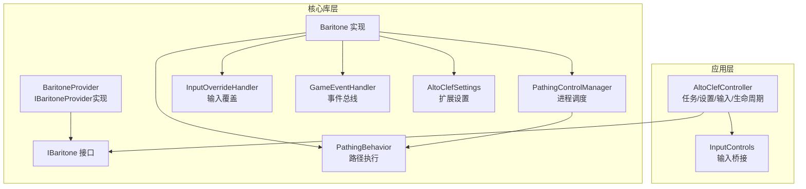
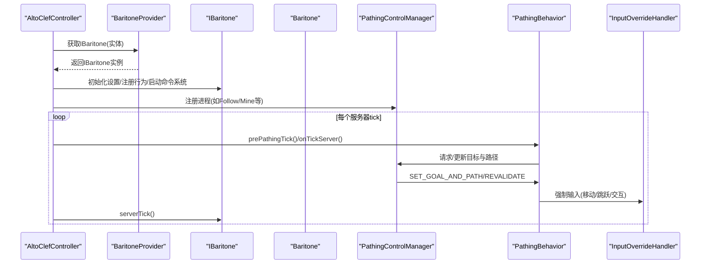
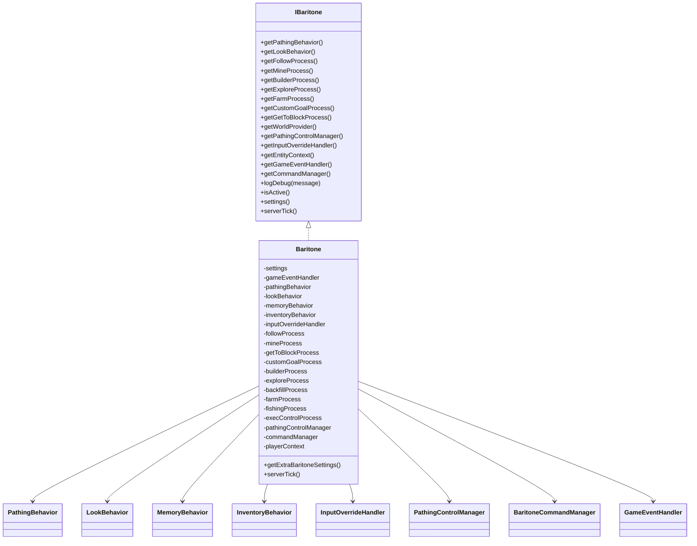
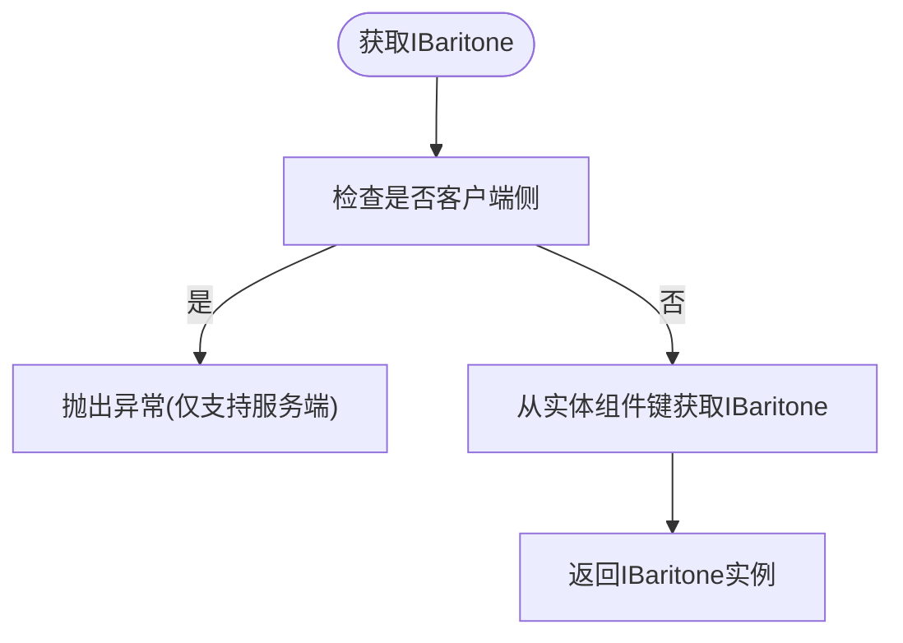
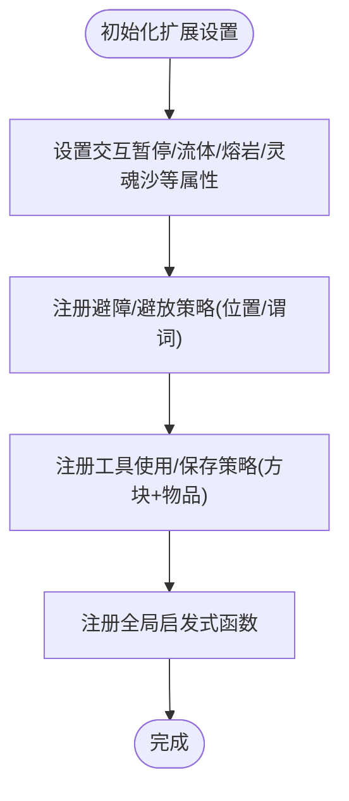
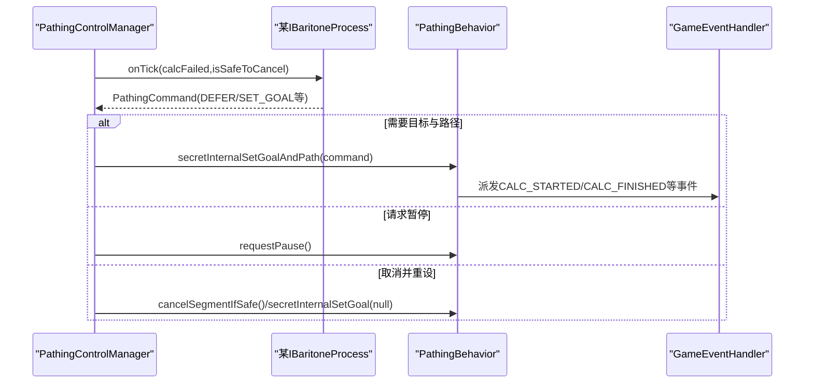
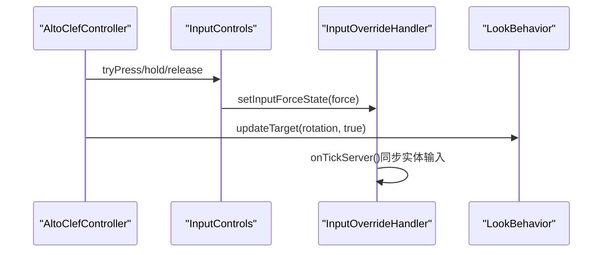
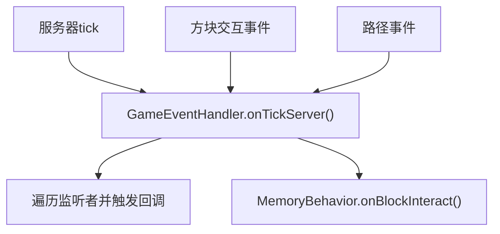
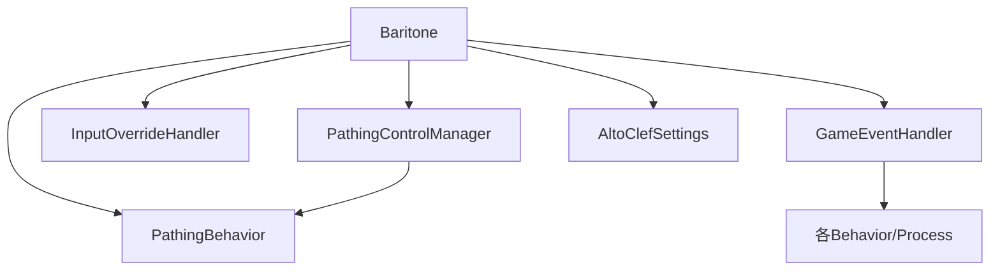

# Baritone集成

<cite>
**本文引用的文件**
- [AltoClefController.java](file://src/main/java/adris/altoclef/AltoClefController.java)
- [Baritone.java](file://src/main/java/baritone/Baritone.java)
- [BaritoneProvider.java](file://src/main/java/baritone/BaritoneProvider.java)
- [IBaritone.java](file://src/main/java/baritone/api/IBaritone.java)
- [IBaritoneProvider.java](file://src/main/java/baritone/api/IBaritoneProvider.java)
- [AltoClefSettings.java](file://src/main/java/baritone/autoclef/AltoClefSettings.java)
- [InputOverrideHandler.java](file://src/main/java/baritone/utils/InputOverrideHandler.java)
- [PathingBehavior.java](file://src/main/java/baritone/behavior/PathingBehavior.java)
- [PathingControlManager.java](file://src/main/java/baritone/utils/PathingControlManager.java)
- [GameEventHandler.java](file://src/main/java/baritone/event/GameEventHandler.java)
- [InputControls.java](file://src/main/java/adris/altoclef/control/InputControls.java)
- [LookHelper.java](file://src/main/java/adris/altoclef/util/helpers/LookHelper.java)
- [MemoryBehavior.java](file://src/main/java/baritone/behavior/MemoryBehavior.java)
- [MineProcess.java](file://src/main/java/baritone/process/MineProcess.java)
- [FollowProcess.java](file://src/main/java/baritone/process/FollowProcess.java)
- [BlockInteractEvent.java](file://src/main/java/baritone/api/event/events/BlockInteractEvent.java)
</cite>

## 目录
1. [简介](#简介)
2. [项目结构](#项目结构)
3. [核心组件](#核心组件)
4. [架构总览](#架构总览)
5. [详细组件分析](#详细组件分析)
6. [依赖关系分析](#依赖关系分析)
7. [性能考量](#性能考量)
8. [故障排查指南](#故障排查指南)
9. [结论](#结论)
10. [附录](#附录)

## 简介
本文件面向在项目中集成Baritone路径规划与行为系统的开发者，系统性阐述以下主题：
- Baritone主控制器的初始化流程与生命周期
- 设置管理（Settings）与扩展配置（AltoClefSettings）
- 行为系统（PathingBehavior、LookBehavior、MemoryBehavior等）与进程管理（PathingControlManager）
- IBaritone接口的实现与BaritoneProvider的作用
- 与Minecraft实体的交互、事件处理机制与输入控制系统集成
- 常见集成问题的调试技巧与最佳实践

## 项目结构
本项目的Baritone集成主要分布在两个层次：
- 应用层：AltoClefController作为高层协调者，负责任务编排、设置加载、输入控制桥接与生命周期管理
- 核心库层：baritone包内包含IBaritone接口、Baritone实现、行为系统、进程与事件处理等

图表来源
- [AltoClefController.java:83-134](file://src/main/java/adris/altoclef/AltoClefController.java#L83-L134)
- [BaritoneProvider.java:16-62](file://src/main/java/baritone/BaritoneProvider.java#L16-L62)
- [IBaritone.java:29-104](file://src/main/java/baritone/api/IBaritone.java#L29-L104)
- [Baritone.java:34-187](file://src/main/java/baritone/Baritone.java#L34-L187)
- [PathingControlManager.java:21-200](file://src/main/java/baritone/utils/PathingControlManager.java#L21-L200)
- [PathingBehavior.java:29-526](file://src/main/java/baritone/behavior/PathingBehavior.java#L29-L526)
- [InputOverrideHandler.java:11-93](file://src/main/java/baritone/utils/InputOverrideHandler.java#L11-L93)
- [GameEventHandler.java:13-48](file://src/main/java/baritone/event/GameEventHandler.java#L13-L48)
- [AltoClefSettings.java:14-237](file://src/main/java/baritone/autoclef/AltoClefSettings.java#L14-L237)

章节来源
- [AltoClefController.java:53-134](file://src/main/java/adris/altoclef/AltoClefController.java#L53-L134)
- [BaritoneProvider.java:16-62](file://src/main/java/baritone/BaritoneProvider.java#L16-L62)

## 核心组件
- IBaritone接口：定义了路径行为、行为系统、进程、命令系统、事件总线、实体上下文、日志与激活状态等能力，并通过EntityComponentKey绑定到实体上
- Baritone实现：构造并持有路径行为、行为系统、进程集合、命令管理器、事件总线与输入覆盖处理器；提供扩展设置AltoClefSettings
- BaritoneProvider：IBaritoneProvider实现，负责按实体获取IBaritone实例、提供全局Settings、世界扫描器、命令系统与Schematic系统，并提供componentFactory用于创建Baritone实例
- PathingControlManager：统一调度各IBaritoneProcess，根据优先级与命令类型决定当前控制权与目标路径更新策略
- PathingBehavior：负责路径计算、执行、暂停/取消、事件派发与ETA估算
- InputOverrideHandler：对底层输入进行强制覆盖，驱动实体移动、跳跃、潜行与交互
- GameEventHandler：集中触发各监听者的服务器tick与事件回调
- AltoClefSettings：扩展设置，提供避障、工具使用策略、交互暂停、属性开关等高级控制

章节来源
- [IBaritone.java:29-104](file://src/main/java/baritone/api/IBaritone.java#L29-L104)
- [Baritone.java:34-187](file://src/main/java/baritone/Baritone.java#L34-L187)
- [BaritoneProvider.java:16-62](file://src/main/java/baritone/BaritoneProvider.java#L16-L62)
- [PathingControlManager.java:21-200](file://src/main/java/baritone/utils/PathingControlManager.java#L21-L200)
- [PathingBehavior.java:29-526](file://src/main/java/baritone/behavior/PathingBehavior.java#L29-L526)
- [InputOverrideHandler.java:11-93](file://src/main/java/baritone/utils/InputOverrideHandler.java#L11-L93)
- [GameEventHandler.java:13-48](file://src/main/java/baritone/event/GameEventHandler.java#L13-L48)
- [AltoClefSettings.java:14-237](file://src/main/java/baritone/autoclef/AltoClefSettings.java#L14-L237)

## 架构总览
下图展示了从应用层到核心库层的调用关系与职责分工。

图表来源
- [AltoClefController.java:83-150](file://src/main/java/adris/altoclef/AltoClefController.java#L83-L150)
- [BaritoneProvider.java:24-31](file://src/main/java/baritone/BaritoneProvider.java#L24-L31)
- [Baritone.java:58-79](file://src/main/java/baritone/Baritone.java#L58-L79)
- [PathingControlManager.java:71-135](file://src/main/java/baritone/utils/PathingControlManager.java#L71-L135)
- [PathingBehavior.java:67-74](file://src/main/java/baritone/behavior/PathingBehavior.java#L67-L74)
- [InputOverrideHandler.java:50-88](file://src/main/java/baritone/utils/InputOverrideHandler.java#L50-L88)

## 详细组件分析

### IBaritone接口与实现
- IBaritone定义了行为系统、进程、命令系统、事件总线、实体上下文、日志与激活状态等契约，并通过EntityComponentKey绑定到实体
- Baritone实现负责构造行为系统与进程集合，注册默认进程，维护命令管理器与事件总线，并提供扩展设置AltoClefSettings

图表来源
- [IBaritone.java:29-104](file://src/main/java/baritone/api/IBaritone.java#L29-L104)
- [Baritone.java:34-187](file://src/main/java/baritone/Baritone.java#L34-L187)

章节来源
- [IBaritone.java:29-104](file://src/main/java/baritone/api/IBaritone.java#L29-L104)
- [Baritone.java:34-187](file://src/main/java/baritone/Baritone.java#L34-L187)

### BaritoneProvider的作用与配置参数
- BaritoneProvider提供全局Settings读取与应用，按实体返回IBaritone实例，并提供世界扫描器、命令系统与Schematic系统
- componentFactory返回Baritone::new，确保按实体创建独立的IBaritone实例

图表来源
- [BaritoneProvider.java:24-31](file://src/main/java/baritone/BaritoneProvider.java#L24-L31)

章节来源
- [BaritoneProvider.java:16-62](file://src/main/java/baritone/BaritoneProvider.java#L16-L62)

### 设置管理与AltoClefSettings扩展
- 应用层通过AltoClefController加载并初始化Baritone与扩展设置，包括交互暂停、放置水桶策略、行走属性、避障规则与全局启发式
- AltoClefSettings提供多组互斥锁保护的策略列表，支持基于位置/方块状态/物品的工具使用与保存策略、全局启发式叠加与受保护物品集

图表来源
- [AltoClefController.java:171-193](file://src/main/java/adris/altoclef/AltoClefController.java#L171-L193)
- [AltoClefSettings.java:14-237](file://src/main/java/baritone/autoclef/AltoClefSettings.java#L14-L237)

章节来源
- [AltoClefController.java:171-193](file://src/main/java/adris/altoclef/AltoClefController.java#L171-L193)
- [AltoClefSettings.java:14-237](file://src/main/java/baritone/autoclef/AltoClefSettings.java#L14-L237)

### 行为系统与进程管理
- PathingControlManager统一调度各IBaritoneProcess，依据优先级选择当前控制权，并根据PathingCommandType决定目标设定与路径重算策略
- PathingBehavior负责路径计算线程化、执行、暂停/取消、事件派发与ETA估算
- MemoryBehavior响应方块交互事件，记录床坐标为“bed”航点
- FollowProcess与MineProcess分别实现跟随与挖矿逻辑，动态生成Goal并返回PathingCommand

图表来源
- [PathingControlManager.java:71-135](file://src/main/java/baritone/utils/PathingControlManager.java#L71-L135)
- [PathingBehavior.java:67-193](file://src/main/java/baritone/behavior/PathingBehavior.java#L67-L193)
- [MemoryBehavior.java:17-25](file://src/main/java/baritone/behavior/MemoryBehavior.java#L17-L25)

章节来源
- [PathingControlManager.java:21-200](file://src/main/java/baritone/utils/PathingControlManager.java#L21-L200)
- [PathingBehavior.java:29-526](file://src/main/java/baritone/behavior/PathingBehavior.java#L29-L526)
- [MemoryBehavior.java:11-27](file://src/main/java/baritone/behavior/MemoryBehavior.java#L11-L27)
- [FollowProcess.java:18-97](file://src/main/java/baritone/process/FollowProcess.java#L18-L97)
- [MineProcess.java:47-148](file://src/main/java/baritone/process/MineProcess.java#L47-L148)

### 输入控制系统与与Minecraft实体交互
- InputOverrideHandler在服务器tick中根据强制输入状态更新实体的移动、跳跃、潜行与交互行为，并同步处理破坏/放置辅助
- InputControls为应用层提供便捷的输入桥接：一次性按键、持续按键、释放按键与强制视角更新
- LookHelper封装视角更新逻辑，支持与Baritone联动或直接设置实体旋转

图表来源
- [InputControls.java:16-52](file://src/main/java/adris/altoclef/control/InputControls.java#L16-L52)
- [InputOverrideHandler.java:23-88](file://src/main/java/baritone/utils/InputOverrideHandler.java#L23-L88)
- [LookHelper.java:198-205](file://src/main/java/adris/altoclef/util/helpers/LookHelper.java#L198-L205)

章节来源
- [InputControls.java:11-53](file://src/main/java/adris/altoclef/control/InputControls.java#L11-L53)
- [InputOverrideHandler.java:11-93](file://src/main/java/baritone/utils/InputOverrideHandler.java#L11-L93)
- [LookHelper.java:173-205](file://src/main/java/adris/altoclef/util/helpers/LookHelper.java#L173-L205)

### 事件处理机制
- GameEventHandler在服务器tick中为所有监听者触发onTickServer，并在方块交互与路径事件发生时派发对应事件
- MemoryBehavior订阅BlockInteractEvent并在使用床时添加航点

图表来源
- [GameEventHandler.java:21-41](file://src/main/java/baritone/event/GameEventHandler.java#L21-L41)
- [MemoryBehavior.java:17-25](file://src/main/java/baritone/behavior/MemoryBehavior.java#L17-L25)
- [BlockInteractEvent.java:1-26](file://src/main/java/baritone/api/event/events/BlockInteractEvent.java#L1-L26)

章节来源
- [GameEventHandler.java:13-48](file://src/main/java/baritone/event/GameEventHandler.java#L13-L48)
- [MemoryBehavior.java:11-27](file://src/main/java/baritone/behavior/MemoryBehavior.java#L11-L27)
- [BlockInteractEvent.java:1-26](file://src/main/java/baritone/api/event/events/BlockInteractEvent.java#L1-L26)

### Baritone实例创建、行为注册与进程管理（代码示例路径）
- Baritone实例创建与行为注册
  - [构造与行为注册:58-79](file://src/main/java/baritone/Baritone.java#L58-L79)
- 进程注册与命令系统
  - [进程注册与命令管理器:68-79](file://src/main/java/baritone/Baritone.java#L68-L79)
- 应用层初始化与设置加载
  - [构造与设置加载:83-127](file://src/main/java/adris/altoclef/AltoClefController.java#L83-L127)
  - [扩展设置初始化:171-193](file://src/main/java/adris/altoclef/AltoClefController.java#L171-L193)
- 服务器tick与输入控制
  - [每tick调用链:136-150](file://src/main/java/adris/altoclef/AltoClefController.java#L136-L150)
  - [InputOverrideHandler服务器tick:50-88](file://src/main/java/baritone/utils/InputOverrideHandler.java#L50-L88)
- 路径行为与事件派发
  - [PathingBehavior服务器tick与事件派发:67-74](file://src/main/java/baritone/behavior/PathingBehavior.java#L67-L74)
  - [PathingControlManager命令分发:71-135](file://src/main/java/baritone/utils/PathingControlManager.java#L71-L135)

章节来源
- [Baritone.java:58-79](file://src/main/java/baritone/Baritone.java#L58-L79)
- [AltoClefController.java:83-150](file://src/main/java/adris/altoclef/AltoClefController.java#L83-L150)
- [InputOverrideHandler.java:50-88](file://src/main/java/baritone/utils/InputOverrideHandler.java#L50-L88)
- [PathingBehavior.java:67-74](file://src/main/java/baritone/behavior/PathingBehavior.java#L67-L74)
- [PathingControlManager.java:71-135](file://src/main/java/baritone/utils/PathingControlManager.java#L71-L135)

## 依赖关系分析
- 组件耦合与内聚
  - Baritone内部通过PathingControlManager集中调度进程，降低进程间耦合
  - InputOverrideHandler与PathingBehavior解耦，前者专注输入覆盖，后者专注路径执行
- 外部依赖与集成点
  - IBaritoneProvider负责按实体创建与获取IBaritone实例，是跨实体集成的关键
  - GameEventHandler作为事件总线，承载行为系统与进程的事件通信
- 潜在循环依赖
  - 未发现直接循环依赖；行为系统通过注册进入事件总线，避免反向强依赖

图表来源
- [Baritone.java:34-187](file://src/main/java/baritone/Baritone.java#L34-L187)
- [PathingControlManager.java:21-200](file://src/main/java/baritone/utils/PathingControlManager.java#L21-L200)
- [PathingBehavior.java:29-526](file://src/main/java/baritone/behavior/PathingBehavior.java#L29-L526)
- [InputOverrideHandler.java:11-93](file://src/main/java/baritone/utils/InputOverrideHandler.java#L11-L93)
- [GameEventHandler.java:13-48](file://src/main/java/baritone/event/GameEventHandler.java#L13-L48)

章节来源
- [Baritone.java:34-187](file://src/main/java/baritone/Baritone.java#L34-L187)
- [PathingControlManager.java:21-200](file://src/main/java/baritone/utils/PathingControlManager.java#L21-L200)
- [GameEventHandler.java:13-48](file://src/main/java/baritone/event/GameEventHandler.java#L13-L48)

## 性能考量
- 路径计算与线程化
  - PathingBehavior通过线程池异步计算路径，减少主线程阻塞
  - 合理设置primary/failure超时与计划前瞻超时，避免长时间阻塞
- 输入覆盖与交互
  - InputOverrideHandler在服务器tick中批量更新实体输入，避免频繁网络同步
  - 合理使用REQUEST_PAUSE与CANCEL策略，减少无效路径计算
- 扩展设置优化
  - 使用AltoClefSettings的避障与工具策略，减少无效破坏/放置尝试
  - 全局启发式叠加需谨慎，避免过度增加搜索成本

[本节为通用指导，无需特定文件引用]

## 故障排查指南
- 无法获取IBaritone实例
  - 确认调用方处于服务端环境；客户端侧会抛出异常
  - 参考：[BaritoneProvider获取实例:24-31](file://src/main/java/baritone/BaritoneProvider.java#L24-L31)
- 路径计算失败或频繁取消
  - 检查PathingControlManager的命令类型与目标有效性
  - 参考：[命令分发与目标设定:71-135](file://src/main/java/baritone/utils/PathingControlManager.java#L71-L135)
- 输入不生效或冲突
  - 确认InputOverrideHandler的强制输入状态与清理逻辑
  - 参考：[输入覆盖与清理:23-47](file://src/main/java/baritone/utils/InputOverrideHandler.java#L23-L47)
- 交互暂停导致行为异常
  - 检查AltoClefSettings的interactionPaused标志位
  - 参考：[交互暂停控制:129-139](file://src/main/java/baritone/autoclef/AltoClefSettings.java#L129-L139)
- 事件未触发
  - 确认行为已通过Baritone.registerBehavior注册到GameEventHandler
  - 参考：[行为注册:85-87](file://src/main/java/baritone/Baritone.java#L85-L87) 与 [事件派发:21-41](file://src/main/java/baritone/event/GameEventHandler.java#L21-L41)

章节来源
- [BaritoneProvider.java:24-31](file://src/main/java/baritone/BaritoneProvider.java#L24-L31)
- [PathingControlManager.java:71-135](file://src/main/java/baritone/utils/PathingControlManager.java#L71-L135)
- [InputOverrideHandler.java:23-47](file://src/main/java/baritone/utils/InputOverrideHandler.java#L23-L47)
- [AltoClefSettings.java:129-139](file://src/main/java/baritone/autoclef/AltoClefSettings.java#L129-L139)
- [Baritone.java:85-87](file://src/main/java/baritone/Baritone.java#L85-L87)
- [GameEventHandler.java:21-41](file://src/main/java/baritone/event/GameEventHandler.java#L21-L41)

## 结论
本集成以AltoClefController为中心，通过BaritoneProvider按实体获取IBaritone实例，结合Baritone实现的行为系统、进程调度与事件总线，实现了稳定的路径规划与行为控制。AltoClefSettings提供了丰富的扩展配置，配合InputControls与InputOverrideHandler，可灵活地与Minecraft实体交互。建议在生产环境中合理配置超时参数、事件与输入覆盖策略，并通过扩展设置精细化控制行为表现。

[本节为总结，无需特定文件引用]

## 附录
- 常用配置项参考
  - 自由视角、随机视角、路径淡出、允许库存、禁止攀爬/对角下降/上升等
  - 参考：[扩展设置初始化:171-193](file://src/main/java/adris/altoclef/AltoClefController.java#L171-L193)
- 关键流程路径索引
  - [Baritone构造与行为注册:58-79](file://src/main/java/baritone/Baritone.java#L58-L79)
  - [进程注册与命令管理器:68-79](file://src/main/java/baritone/Baritone.java#L68-L79)
  - [应用层初始化与设置加载:83-127](file://src/main/java/adris/altoclef/AltoClefController.java#L83-L127)
  - [每tick调用链:136-150](file://src/main/java/adris/altoclef/AltoClefController.java#L136-L150)
  - [InputOverrideHandler服务器tick:50-88](file://src/main/java/baritone/utils/InputOverrideHandler.java#L50-L88)
  - [PathingBehavior事件派发:67-74](file://src/main/java/baritone/behavior/PathingBehavior.java#L67-L74)
  - [PathingControlManager命令分发:71-135](file://src/main/java/baritone/utils/PathingControlManager.java#L71-L135)

[本节为补充索引，无需特定文件引用]